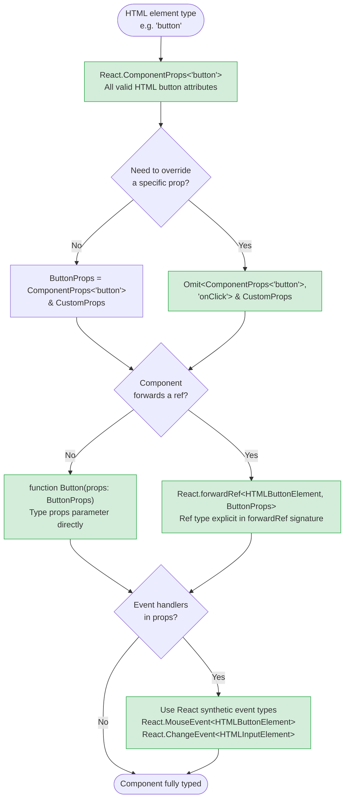

# TypeScript in React

TypeScript and React compose well because React's component model maps naturally onto TypeScript's structural type system. A component is a function from props to JSX, and a function type is exactly what TypeScript excels at typing. The practical questions that arise when combining the two are specific and concrete: how to type event handlers, how to type refs, how to type generic components, how to type children. Each of these has a TypeScript idiom that is more precise than reaching for `any` or guessing at the right annotation, and each idiom has a rationale that is worth understanding rather than just memorizing. Getting these idioms right means the compiler catches the mistakes that matter — a ref attached to the wrong element type, a handler receiving the wrong event, a wrapper component silently dropping attributes the caller expected to pass through.

The history of React's TypeScript support has left behind a few patterns that once appeared in tutorials and documentation but are now discouraged. `React.FC` — the function component annotation — was the recommended way to type components for several years before the React 18 type definitions changed the implicit behavior around `children`. Engineers who learned React TypeScript during that period carry the pattern forward through habit; engineers reading older code encounter it and assume it is still recommended. Understanding why `React.FC` is now discouraged, and what to use instead, is the first step toward idiomatic React TypeScript. The lesson generalizes: React TypeScript has evolved rapidly, and a pattern that was correct in 2019 may be actively misleading in 2024.

Wrapper components — components that encapsulate an HTML element with additional behavior or styling — present a recurring prop-typing challenge. A `<Button>` component that wraps `<button>` should accept all valid HTML button attributes, not just the handful the author remembered to include. TypeScript provides utilities for deriving those types directly from the HTML element type, which produces a more complete and lower-maintenance prop interface than enumerating attributes manually. The same utilities support overriding specific attributes, allowing a wrapper component to replace a standard attribute's type with a richer application-level type. The result is a component interface that is simultaneously complete, precise, and free from the ongoing maintenance burden of tracking the HTML specification.

Refs add a third distinct typing concern, and generic components add a fourth. `useRef` has two signatures that produce different types depending on the initial value — choosing the wrong one for a DOM ref is one of the most common sources of TypeScript errors in React code. Generic components, meanwhile, require a type parameter that flows from input data through to rendered output; a `<Select<User>>` or `<List<Product>>` must be a plain generic function, not a component wrapped in `React.FC`, because TypeScript's generic function syntax is the only tool that supports this. Understanding both the ref typing model and the generic function model resolves a class of errors that are otherwise worked around by trial and error.

## Design Thinking

### Avoiding React.FC

`React.FC` was the recommended annotation for function components from roughly React 16 through the early React 17 era. The type is defined in the React type package as a generic function type: `React.FC<Props>` is equivalent to `(props: Props & { children?: ReactNode }) => ReactElement | null`. The implicit `children` inclusion was the feature, not a side effect — the idea was that every component could accept children without explicitly declaring them.

The problems with this design became apparent at scale. First, the implicit `children` prop meant that components that were not intended to accept children — a `<Badge>` displaying a count, for example — would silently accept children from callers without any type error. The prop was optional, so passing unexpected children would not fail even though the component's render logic did not use them. The intended no-children constraint could not be expressed through `React.FC`.

Second, `React.FC` prevents components from being typed as generic functions. A component that accepts a generic `items` prop — `function List<T>({ items, renderItem }: ListProps<T>)` — cannot be annotated as `React.FC<ListProps<T>>` because the generic parameter on the component function and the generic parameter on `React.FC` refer to different things. The annotation and the generic signature are structurally incompatible, so engineers working with `React.FC` must abandon it as soon as they need a generic component.

Third, the React 18 type definitions removed `children` from the implicit props of `React.FC`, breaking the original rationale. The React team explicitly discouraged `React.FC` in the React 18 migration guide. Code that relied on the implicit `children` inclusion requires adding `children: React.ReactNode` to the props interface explicitly — which is exactly what typing the props parameter directly requires, and which is clearer than relying on an implicit addition by a wrapper type.

The modern idiom is to write the props type as an interface or type alias and annotate the function's parameter directly. The return type can be left to inference or annotated as `JSX.Element` when explicitness is preferred. The component's type signature is then exactly as it appears: a function from a specific props type to JSX, with no wrapper type adding hidden behavior.

There is a naming convention consideration as well. Prop interfaces are conventionally named with a `Props` suffix matching the component name: `ButtonProps` for `Button`, `SearchInputProps` for `SearchInput`. Using a type alias is fine, but an interface is generally preferred because interface errors report the interface name rather than an expanded structural representation, making compiler error messages easier to read. The choice between `type` and `interface` for props is a team convention decision, not a correctness one; what matters is that the annotation appears on the props parameter and not as a wrapper around the function type itself.

A related convention is where to declare the props type relative to the component. Declaring the interface immediately above the component function in the same file is the most common pattern. Exporting the interface alongside the component is appropriate when callers need to reference the props type — for testing, for extending the interface in a derived component, or for building higher-order components that wrap the original. Keeping the interface in the same file as the component prevents the fragmentation of having type definitions spread across a separate `types.ts` file with no clear organizational logic. Only when a set of interfaces is shared across many components does a dedicated types file make sense, and even then the interfaces belong in the closest common ancestor's directory, not in a top-level global types file.

The choice of whether to export props interfaces has one important implication for library authors: exported prop interfaces become part of the public API contract. Breaking changes to a prop interface — renaming a required prop, changing a prop's type, removing an optional prop — break callers who have imported and used the interface for typing. Library authors should treat exported prop interfaces with the same versioning discipline as the component's runtime behavior. Application-level code has more flexibility because consumers are internal, but establishing the habit of treating exported types as API surface is valuable regardless of context.

The version scope note in this article's introduction is worth restating in the context of component architecture decisions. React 19's ref-as-prop model removes the need for `forwardRef` entirely: a component that accepts `ref` as a regular prop and passes it to the underlying element satisfies the same use cases that `forwardRef` addressed. Teams on React 19 should migrate incrementally by removing `forwardRef` wrappers from new components and leaving existing `forwardRef` usage in place until a dedicated refactor opportunity arises. The migration does not require changing the underlying ref behavior — only the wrapping API — so it is lower risk than it might appear from the API surface change. Tracking the remaining `forwardRef` usages as a codebase migration item ensures that the team has a clear picture of the remaining work rather than accumulating a mix of old and new patterns indefinitely.
A codemods-based migration is available from the React team and handles the mechanical transformation of `forwardRef` wrappers to the new ref-as-prop pattern.
Running the codemod on a branch, reviewing the diff to confirm correctness, and addressing any TypeScript errors that surface is the recommended approach for teams with many components using `forwardRef`.
The codemod handles straightforward cases automatically; components with complex display name management or unusual wrapping patterns may require manual adjustment after the automated pass.
Running the codemod in isolation — before combining it with other feature work — makes the diff reviewable and the migration reversible if unexpected issues surface.
This isolation practice applies to any large-scale refactor and is especially important for changes that affect component interfaces, since downstream consumers in the same codebase may require corresponding updates that should be included in the same PR or tracked as immediate follow-ups.
Scheduling the React 19 ref migration as a dedicated tech-debt sprint item, rather than opportunistically combining it with feature work, produces the cleanest possible commit history and makes it straightforward to revert if a compatibility issue is discovered after deployment.

### Deriving prop types from HTML elements

A wrapper component like `<Button>` should accept all valid HTML `<button>` attributes plus its own custom props. The naive approach is to enumerate the attributes the author expects callers to use: `className`, `disabled`, `type`, `onClick`, `aria-label`. This list is always incomplete — callers encounter an attribute they need and find it missing from the prop type, requiring a change to the component interface. Enumerating HTML attributes is a maintenance problem that compounds as the component ages and more callers discover more edge cases.

`React.ComponentProps<'button'>` provides the complete set of valid HTML button attributes as typed by the React type definitions. It includes every attribute that can appear on a `<button>` element, including ARIA attributes, data attributes, and event handlers. Using it as the basis for a wrapper component's props ensures that callers have access to the full HTML interface without any enumeration work and without needing to maintain a list of attributes.

The practical pattern for a wrapper component is to spread `React.ComponentProps<'button'>` using an intersection: `type ButtonProps = React.ComponentProps<'button'> & { variant: 'primary' | 'secondary' }`. The intersection adds the component's custom props on top of the full HTML interface. When the component needs to override an existing HTML attribute with a different type — replacing the standard `onClick: React.MouseEventHandler<HTMLButtonElement>` with an application-level `onClick: (id: string) => void` — the `Omit` utility removes the original attribute before the intersection: `Omit<React.ComponentProps<'button'>, 'onClick'> & { onClick: (id: string) => void }`.

`React.ComponentPropsWithRef<'button'>` and `React.ComponentPropsWithoutRef<'button'>` are variants that explicitly include or exclude the `ref` prop. When a wrapper component uses `forwardRef`, the props type SHOULD use `ComponentPropsWithoutRef` to avoid duplicating the ref in both the props and the `forwardRef` generic signature. When a wrapper component does not forward a ref, the distinction does not matter, but being explicit is a form of documentation: `ComponentPropsWithoutRef` communicates that this component does not forward its ref.

A secondary benefit of `React.ComponentProps`-derived types is accessibility. Because the full ARIA attribute set is included — `aria-label`, `aria-describedby`, `aria-expanded`, `role`, and the rest — accessible wrapper components do not require special-casing for accessibility attributes. A design-system `Button` that derives from `ComponentProps<'button'>` automatically accepts `aria-label` without any additional declaration. Teams that build wrapper components by enumerating attributes tend to discover missing ARIA support through accessibility audits rather than at component authoring time, a feedback loop that is much slower and more expensive.

It is worth noting what `React.ComponentProps<'element'>` includes and what it does not. It includes all HTML attributes recognized by React's JSX type definitions, which closely track the HTML specification. It does not include React-internal props such as `key` and `ref` unless the `WithRef` variant is used. The `key` prop is intentionally excluded from component prop types because it is managed by React's reconciliation algorithm, not by the component itself — passing `key` as a prop always requires the JSX syntax rather than a function call, and TypeScript's JSX handling enforces this by excluding `key` from the component's prop interface.

### Typing refs correctly

`useRef` in TypeScript has two distinct signatures that produce structurally different types. The first signature, `useRef<T>(initialValue: T)`, returns `React.MutableRefObject<T>` — a ref whose `.current` property is writable and typed as `T`. This is the appropriate signature for refs that hold mutable values managed by application code, such as a timer ID or an animation frame handle. The second signature, `useRef<T>(null)`, returns `React.RefObject<T>` — a ref whose `.current` property is typed as `T | null` and is read-only from TypeScript's perspective, because React itself assigns the DOM node to `.current` when the element mounts.

The consequence of using the wrong signature is a type error at the point where the ref is attached to a JSX element. React's JSX type definitions expect a `React.RefObject<HTMLElement>` (the read-only variant) for the `ref` prop on DOM elements. Passing a `React.MutableRefObject<HTMLInputElement>` to a `ref` prop produces a type error because the mutable variant's type is not assignable to the DOM ref slot — the writable `.current` conflicts with React's expectation that it controls the assignment. The fix is always to use `useRef<HTMLInputElement>(null)` with the specific element type and the `null` initial value.

The specific element type matters for the same reason that choosing the right HTML element type matters elsewhere: `HTMLElement` is too broad for most use cases. An input ref typed as `HTMLElement` loses the input-specific API — `ref.current.value`, `ref.current.focus()`, `ref.current.select()` — that is the primary reason for creating the ref in the first place. `HTMLInputElement`, `HTMLButtonElement`, `HTMLDivElement`, and their siblings are the correct types for their corresponding HTML elements. TypeScript's DOM type definitions model these accurately, including the relationships between them via prototype chains, so assigning an `HTMLInputElement` ref to an `<input>` element passes the type check because `HTMLInputElement` is a subtype of `HTMLElement`.

`forwardRef` introduces a third consideration: the ref type must be declared in the `forwardRef` generic signature, and it must match the type of the DOM element the ref will be attached to. `React.forwardRef<HTMLButtonElement, ButtonProps>` declares that this component forwards a ref of type `HTMLButtonElement`. Callers receive a `React.RefObject<HTMLButtonElement>` when they attach a ref to the forwarded component, giving them access to the button-specific DOM API with full type safety.

One practical implication of the DOM ref model is how `useImperativeHandle` interacts with the ref type. When a component uses `useImperativeHandle` to expose a custom handle rather than the raw DOM node, the `forwardRef` generic type parameter should reflect the handle's shape, not the DOM element type. For example, if a component exposes `{ focus(): void; reset(): void }` through `useImperativeHandle`, the `forwardRef` signature becomes `React.forwardRef<{ focus(): void; reset(): void }, Props>`. This is an important distinction: the ref type declared in `forwardRef`'s generics is the type of whatever the parent receives when it reads `.current` from the ref, not necessarily the underlying DOM element type.

### Generic components

Some components are inherently generic: a `List` component that renders any array of items, a `Select` that works with any value type, a `Table` that operates on any row shape. These components cannot be typed with a fixed props type because the item type varies with each use. TypeScript supports this through generic function syntax on the component itself: `function List<T>({ items, renderItem }: ListProps<T>)` where `ListProps<T>` is defined as `{ items: T[]; renderItem: (item: T, index: number) => React.ReactNode }`.

The key constraint is that generic components cannot be typed with `React.FC`, as noted earlier. They must be plain generic functions. The generic parameter appears on the function keyword, not on a wrapper type. This is one of the most practical reasons the React community moved away from `React.FC`: the pattern breaks as soon as the component needs to be generic, which is a common need in reusable component libraries.

In TSX files, there is a syntactic ambiguity: `<T>` at the start of a generic type parameter looks like a JSX element opening tag. TypeScript resolves this ambiguity by requiring a trailing comma or a constraint: `<T,>` or `<T extends object>`. The trailing comma form `<T,>` is idiomatic in TSX generic components and is recognized by TypeScript and all major formatters. The constraint form `<T extends unknown>` is equivalent to the trailing comma for disambiguation purposes, but `<T extends object>` carries a semantic meaning (T must be an object type) that may not match the component's actual requirements. When the only reason for the constraint is disambiguation, use `<T,>`.

Generic components also work with `forwardRef`, though the combination is slightly more verbose. Because `forwardRef` takes its generic arguments at the call site (`React.forwardRef<Ref, Props>`), and the props type itself is generic, the forwarded component's type must be declared as a generic function that calls `forwardRef` with the appropriate types instantiated. One approach is to cast the return value of `forwardRef` to the generic function type using `as`, which allows callers to pass the type argument at the JSX call site. This is an advanced pattern and is typically only needed for design-system primitives that are both forwarded-ref and generic — most application-level components do not need to combine both.

### Typing children explicitly

With `React.FC` removed from the toolkit, `children` must be declared explicitly in the props interface whenever a component accepts them. The correct type for children that can be any React renderable content is `React.ReactNode`, which includes strings, numbers, JSX elements, arrays, fragments, portals, and `null` or `undefined`. This is the broadest children type and is appropriate for layout components, containers, and any component where the children's shape is not constrained.

When children must be a specific shape — a single element, a function, or a specific component type — more precise types are available. `React.ReactElement` (not `ReactNode`) represents a single JSX element, excluding strings, numbers, and other primitives. A render-prop pattern uses `children: (item: T) => React.ReactNode`, which TypeScript types as a function that receives a value and returns renderable content. These more specific types are only beneficial when the component genuinely constrains what it renders; using `ReactElement` instead of `ReactNode` to "be more precise" when the component actually renders any children is a form of over-typing that breaks callers passing string children or arrays.

The key rule is that the component's implementation determines the correct type. If the component calls `React.Children.map(children, fn)` or wraps children in a container, `ReactNode` is correct. If the component calls `children(item)` as a function, `(item: T) => ReactNode` is correct. If the component passes children directly to a single root element without processing, `ReactNode` is also correct because that element accepts `ReactNode`. Matching the declared type to the actual usage prevents both the caller-facing errors that come from over-constraining and the implementation errors that come from under-constraining.

A common scenario in compound components is typing children as a specific component type using `React.ReactElement<SpecificProps>`. This constrains callers to pass only elements of a particular component — a `<Tabs>` component that only accepts `<Tab>` children, for example. The constraint is enforced at the TypeScript level but React's runtime does not enforce it; TypeScript can only check the JSX that appears in the source, not dynamic children constructed at runtime. The type is most useful as documentation and for catching obvious misuse during development, not as a security boundary.

One additional children pattern worth knowing is `React.PropsWithChildren<Props>`, a utility type that adds `children?: React.ReactNode` to an existing props type. It is the explicit opt-in equivalent of what `React.FC` used to do implicitly. Using `PropsWithChildren<ButtonProps>` is a clear, searchable signal that this component accepts children, while still not requiring `React.FC`. Some teams prefer this form over manually adding `children: React.ReactNode` to each interface because it is consistent and the intent is explicit in the type name.

## Best Practices

**MUST NOT use `React.FC` for component type annotations.** `React.FC` implicitly adds `children` to props — a pre-React-18 pattern that has been removed from the recommended practice and causes components to silently accept children they do not render. It also prevents components from being typed as generic functions, which is a significant limitation for reusable components. Type the component's props parameter directly: `function MyComponent({ name }: MyComponentProps)`. This pattern is explicit, readable, works with generic components, and contains no hidden behavior.

**MUST type event handler props with React's synthetic event types rather than native DOM event types.** `React.ChangeEvent<HTMLInputElement>`, `React.MouseEvent<HTMLButtonElement>`, and `React.FormEvent<HTMLFormElement>` represent React's synthetic event abstraction, which has a stable cross-browser interface and a `target` typed as the specific element that fired the event. Native DOM event types such as `Event` and `MouseEvent` reflect browser-specific implementations and are structurally incompatible with what React passes to handlers. Using native types either requires a cast or silently narrows the handler's contract in ways that diverge from runtime behavior.

**MUST use `React.ComponentProps<'element'>` to derive prop types when building wrapper components around HTML elements.** Manually enumerating HTML attributes — `className`, `disabled`, `aria-label`, `type`, and so on — creates an incomplete and maintenance-burdened list that must be updated whenever a new attribute becomes relevant to a caller. `React.ComponentProps<'button'>` includes every valid attribute for the element, including ARIA attributes and event handlers, and stays current with the React types package without any manual synchronization. When a custom `onClick` or other prop needs to override the HTML attribute's type, use `Omit<React.ComponentProps<'element'>, 'propName'>` before the intersection to remove the original attribute and add the overriding type.

**SHOULD use `forwardRef` with explicit generic type arguments when a component needs to forward a ref.** `React.forwardRef<HTMLButtonElement, ButtonProps>` makes the ref type explicit and communicates to callers exactly what DOM element they will receive access to. The generic arguments are ordered element type first, props type second — `<ElementType, PropsType>` — which is the inverse of how most generic types in TypeScript are ordered and is worth noting to avoid argument-order errors. When the props type uses `React.ComponentPropsWithoutRef<'button'>`, combining it with the explicit `forwardRef` generic ensures that the ref is typed once, in the `forwardRef` signature, rather than duplicated in the props interface.

**SHOULD declare `children: React.ReactNode` explicitly in the props interface when a component renders children, rather than relying on any implicit inclusion.** Explicit declaration documents that the component accepts children, makes the intent searchable, and keeps the props interface complete. When a component does not render children, omitting `children` from the props interface is a meaningful constraint: TypeScript will flag callers that pass children to a component that cannot use them, which catches copy-paste errors and misuse of leaf components in a design system.

## Visual

The following diagram shows the prop typing patterns for a wrapper component. `React.ComponentProps<'button'>` provides the full HTML attribute surface; the wrapper intersects it with custom props and uses `Omit` when overriding an existing attribute. The `forwardRef` variant adds an explicit ref type alongside the props.



The diagram illustrates that `React.ComponentProps<'element'>` is the entry point for wrapper component prop typing. The `Omit` branch addresses the case where the HTML attribute type is too broad for the wrapper's intended contract — replacing `onClick: React.MouseEventHandler<HTMLButtonElement>` with an application-level signature, for instance. The `forwardRef` branch adds the ref type declaration, which belongs in the `forwardRef` generic signature rather than in the props interface.

The diagram's event handler check applies to both the `forwardRef` and non-`forwardRef` paths because the synthetic event type requirement is independent of whether the component forwards its ref. A `forwardRef` component with a custom `onChange` handler still needs `React.ChangeEvent<HTMLInputElement>` for that handler, for the same reason as a non-forwarding component: React passes a synthetic event to the handler, not a native DOM event.

## Example

The following examples demonstrate the three main patterns: a wrapper component using `React.ComponentProps`, a controlled input using a typed ref and a typed change handler, and a `forwardRef` component with explicit generic type arguments. These patterns are drawn from real design-system and application code — each addresses a concrete scenario where the naive approach (enumerating props manually, typing the ref as `any`, or using a native event type) compiles but produces incorrect or incomplete types. The examples include comments that identify the specific TypeScript idiom in use and explain why it is correct.

**Pattern 1: Button wrapper with `React.ComponentProps` and a custom `onClick`**

The `Button` component wraps the native `<button>` element. It omits the standard `onClick` attribute and replaces it with an application-level signature that requires a string `id`. All other HTML button attributes — `disabled`, `className`, `type`, `aria-*`, and so on — are available to callers because the base type is derived from `React.ComponentProps<'button'>`, not from a hand-written list. The spread `...rest` on the native `<button>` element passes all unrecognized attributes through to the DOM, which is what allows `aria-label`, `data-testid`, `form`, and other attributes to work without explicit forwarding logic.

```tsx
import React from 'react';

type ButtonProps = Omit<React.ComponentProps<'button'>, 'onClick'> & {
  id: string;
  variant?: 'primary' | 'secondary' | 'danger';
  onClick: (id: string) => void;
};

function Button({ id, variant = 'primary', onClick, children, ...rest }: ButtonProps) {
  return (
    <button
      {...rest}
      className={`btn btn--${variant}`}
      onClick={() => onClick(id)}
    >
      {children}
    </button>
  );
}

// Caller usage: the custom onClick signature is enforced
// <Button id="submit-btn" onClick={(id) => handleClick(id)}>Submit</Button>
// <Button id="cancel-btn" disabled onClick={(id) => handleCancel(id)}>Cancel</Button>
//          ^^ `disabled` is available because ComponentProps<'button'> includes it
```

**Pattern 2: Controlled input with a typed ref and typed change handler**

The `SearchInput` component manages its own input ref and exposes an `onSearch` callback. The ref is initialized with `null` to produce a `React.RefObject<HTMLInputElement>`, which React assigns when the element mounts. The change handler uses `React.ChangeEvent<HTMLInputElement>`, which types `event.target` as `HTMLInputElement`, giving access to `.value` without a cast. The `handleKeyDown` handler uses `React.KeyboardEvent<HTMLInputElement>`, which types the keyboard-specific event properties including `event.key`, `event.code`, and the modifier key booleans.

```tsx
import React, { useRef, useCallback } from 'react';

type SearchInputProps = {
  placeholder?: string;
  onSearch: (query: string) => void;
};

function SearchInput({ placeholder = 'Search…', onSearch }: SearchInputProps) {
  // useRef<HTMLInputElement>(null) returns React.RefObject<HTMLInputElement>
  // The null initial value is required for DOM refs — it signals to React that
  // it should assign the DOM node to .current when the element mounts.
  const inputRef = useRef<HTMLInputElement>(null);

  const handleChange = useCallback(
    (event: React.ChangeEvent<HTMLInputElement>) => {
      // event.target is typed as HTMLInputElement — .value is available without casting
      onSearch(event.target.value);
    },
    [onSearch]
  );

  const handleKeyDown = (event: React.KeyboardEvent<HTMLInputElement>) => {
    if (event.key === 'Enter' && inputRef.current) {
      onSearch(inputRef.current.value);
      inputRef.current.blur();
    }
  };

  return (
    <input
      ref={inputRef}
      type="search"
      placeholder={placeholder}
      onChange={handleChange}
      onKeyDown={handleKeyDown}
    />
  );
}
```

**Pattern 3: `forwardRef` with explicit generic type arguments**

`FancyInput` forwards its ref to the underlying `<input>` element so that parent components can call `.focus()` or `.select()` on the DOM node. The `forwardRef` generic arguments declare `HTMLInputElement` as the ref type and `FancyInputProps` as the props type. The props interface uses `React.ComponentPropsWithoutRef<'input'>` to inherit all input attributes without duplicating the ref. Note that the function expression inside `forwardRef` is named (`function FancyInput`) rather than anonymous — this gives the component a name in React DevTools and in error stack traces, which improves debuggability.

```tsx
import React from 'react';

type FancyInputProps = React.ComponentPropsWithoutRef<'input'> & {
  label: string;
  error?: string;
};

// Generic arguments: <ref element type, props type>
// The ref type is HTMLInputElement — callers receive React.RefObject<HTMLInputElement>
const FancyInput = React.forwardRef<HTMLInputElement, FancyInputProps>(
  function FancyInput({ label, error, ...inputProps }, ref) {
    return (
      <div className="field">
        <label className="field__label">{label}</label>
        <input
          {...inputProps}
          ref={ref}
          className={`field__input${error ? ' field__input--error' : ''}`}
          aria-invalid={error ? true : undefined}
          aria-describedby={error ? `${inputProps.id}-error` : undefined}
        />
        {error && (
          <span id={`${inputProps.id}-error`} className="field__error">
            {error}
          </span>
        )}
      </div>
    );
  }
);

// Caller usage: ref is typed as React.RefObject<HTMLInputElement>
// const inputRef = useRef<HTMLInputElement>(null);
// <FancyInput ref={inputRef} label="Email" type="email" id="email" />
// inputRef.current?.focus();  — HTMLInputElement API available, fully typed
```

The `FancyInput` component spreads `...inputProps` onto the `<input>` element, which means every attribute the caller passes — `type`, `id`, `autoComplete`, `disabled`, `required`, `maxLength`, and any other valid input attribute — flows through to the DOM element without the component needing to explicitly relay each one. This is possible only because the props type derives from `React.ComponentPropsWithoutRef<'input'>` rather than from a hand-written subset.

The three patterns in these examples cover the majority of React TypeScript prop-typing scenarios. The `ComponentProps` pattern (Pattern 1) is the default for any wrapper component. The typed-ref pattern (Pattern 2) applies whenever a component needs direct DOM access. The `forwardRef` pattern (Pattern 3) applies whenever the parent needs DOM access from outside the component. These patterns compose: a `forwardRef` wrapper component uses `ComponentPropsWithoutRef` for its props and `useRef<T>(null)` internally if it also needs its own DOM access, all while forwarding the external ref to the element. Understanding each pattern in isolation makes the composed version straightforward rather than confusing.

The React TypeScript types are maintained in the `@types/react` package on DefinitelyTyped and track React releases closely. Keeping `@types/react` and `react` versions in sync is important: mismatches between the runtime React version and the type definitions can cause false type errors or missing types for APIs that exist in the runtime. When upgrading React (for example, from React 17 to React 18), upgrading `@types/react` in the same step, and checking the type changelog for breaking changes, prevents surprises from silent implicit behavior changes like the removal of implicit `children` from `React.FC`.

The three patterns above are not mutually exclusive. A design-system `TextInput` component might use `forwardRef` (to support parent focus management), derive its props from `ComponentPropsWithoutRef<'input'>` (to expose the full input attribute surface), maintain an internal ref with `useRef<HTMLInputElement>(null)` (to implement internal validation logic), and use `React.ChangeEvent<HTMLInputElement>` for its own change handling — all in the same component. Each of these idioms operates on a different concern and they combine cleanly because they follow the TypeScript type model consistently.

## Common Mistakes

**Using `React.FC` and expecting it to prevent children from being passed.** Before React 18, `React.FC` implicitly included `children?: ReactNode` in the component's props, meaning that every component annotated with `React.FC` silently accepted children regardless of whether it was designed to. Engineers who added `React.FC` to prevent children — reasoning that the explicit type annotation would restrict the interface — found that it had the opposite effect. After the React 18 type changes removed the implicit `children`, codebases that relied on `React.FC<Props>` saw type errors when the implicit `children` disappeared. The correct approach has always been to declare `children` explicitly when a component accepts it, and to omit `children` from the interface when it does not.

**Calling `useRef<HTMLInputElement>()` without passing `null` as the initial value.** `useRef<T>()` with no argument returns `React.MutableRefObject<T | undefined>` — not a DOM ref. When this ref is passed to a JSX element's `ref` prop, TypeScript produces a type error because `MutableRefObject<T | undefined>` is not assignable to the `ref` prop's expected type. Engineers often resolve this by suppressing the error or by widening the generic type, both of which obscure the real problem: the `null` initial value is the signal that distinguishes a DOM ref from a mutable value ref. `useRef<HTMLInputElement>(null)` is the correct form for any ref that will be attached to a DOM element. The `null` is not a placeholder — it is the precise value React reads to determine that the ref should be populated when the element mounts and cleared when it unmounts. A related variant of this mistake is using `useRef<HTMLInputElement | null>(null)` — including `null` in the generic type parameter instead of just passing `null` as the initial value. This also produces `MutableRefObject<HTMLInputElement | null>` rather than `RefObject<HTMLInputElement>`, and the same type-assignability error results. The type parameter should be `HTMLInputElement` alone; the nullability is handled by the overload selection, not by the generic argument.

**Typing an event handler parameter as a native DOM event type rather than a React synthetic event type.** Writing `(e: Event) => void` or `(e: MouseEvent) => void` for a React event handler may appear to compile in some configurations but produces structurally incorrect types. Native DOM events and React synthetic events have different shapes: synthetic events wrap the native event and add a `nativeEvent` property, normalize cross-browser differences, and have `target` typed relative to the element that the handler is attached to. Using native event types means losing access to React-specific properties, getting incorrect types for `event.target`, and potentially encountering type errors when passing the handler to React's JSX event prop — because React's JSX definitions expect synthetic event types, not native DOM types. The correct type for an input's change handler is `React.ChangeEvent<HTMLInputElement>`; for a button's click handler, `React.MouseEvent<HTMLButtonElement>`. This mistake is particularly common when extracting a handler into a standalone function that is referenced rather than inlined: the inlined version type-checks because TypeScript infers the correct synthetic event type from the JSX context, but the extracted version without an explicit annotation defaults to a less specific or incorrect type if the author writes the parameter type from memory rather than from the JSX attribute's inferred type.

**Over-widening the type of a custom `onClick` or callback prop to accept `any`.** When a wrapper component replaces the HTML element's `onClick` with a custom signature, the temptation to use `onClick?: (...args: any[]) => void` avoids the need to think through the correct parameters but defeats the purpose of the replacement. A custom callback prop exists to carry application-level information — an entity ID, a selection state, a form value — and its type should capture that information precisely. `onClick: (id: string) => void` tells callers that they will receive a string ID; `onClick?: (...args: any[]) => void` tells them nothing. The TypeScript overhead of writing `(id: string) => void` instead of `(...args: any[]) => void` is a few characters; the benefit is that callers receive a type-safe contract and the compiler catches any mismatch between what the component passes and what the caller expects.

## Related FEEs

The prop-typing patterns in this article rely on TypeScript's utility types (`Omit`, intersection types) and the structural type system's ability to model HTML element attribute sets. FEE-1703 covers the utility types in depth, including `Omit`, `Pick`, `Partial`, and `Required`. FEE-1701 covers structural typing and how TypeScript's type inference interacts with function parameters, which is the mechanism that makes typing props parameters directly effective. FEE-501 covers component composition patterns at the React architecture level, including render props and compound components, which introduce additional TypeScript typing challenges (children as functions, component context types) that build on the foundational patterns here.

- FEE-1701 — Type System Fundamentals & Type Inference
- FEE-1703 — Utility Types & Type Manipulation
- FEE-501 — Component Composition Patterns

## References

The React TypeScript Cheatsheet is the most comprehensive community reference for React TypeScript patterns, covering topics from basic component typing through advanced patterns like higher-order components and context. The official React documentation's TypeScript guide reflects the React team's current recommendations and is the authoritative source for patterns like avoiding `React.FC`. The TypeScript Handbook's JSX section covers the JSX type system, including how TypeScript checks JSX attributes and how generic components work in TSX files.

For tracking breaking type changes across React versions, the `@types/react` changelog on the DefinitelyTyped GitHub repository documents each type-level change, including the React 18 removal of implicit `children` from `React.FC`. Reviewing this changelog before a React upgrade takes less than five minutes and prevents the category of "it compiled before but doesn't compile now" surprises that arise when type-level breaking changes are treated as invisible.

- DefinitelyTyped: @types/react changelog — https://github.com/DefinitelyTyped/DefinitelyTyped/blob/master/types/react/CHANGELOG.md

- React TypeScript Cheatsheet — https://react-typescript-cheatsheet.netlify.app/
- React: Using TypeScript — https://react.dev/learn/typescript
- TypeScript Handbook: JSX — https://www.typescriptlang.org/docs/handbook/jsx.html
