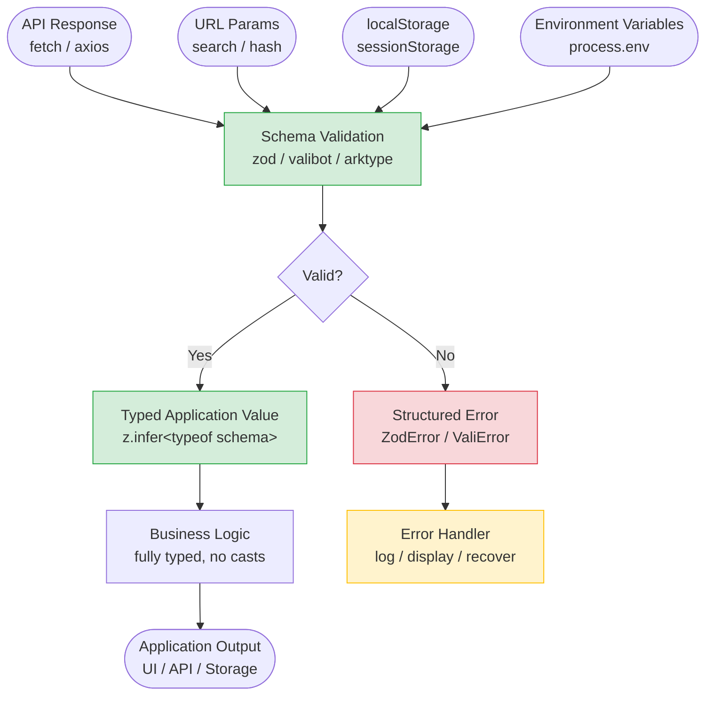

# Runtime Validation & Schema Libraries

TypeScript's type system is erased at compile time. A type annotation on an API response, a URL parameter, or a localStorage value is a promise, not a guarantee — it tells TypeScript how to type the value, but it does not validate that the value actually conforms to that type at runtime. A type assertion (`as User`) is not validation. It is a claim that the developer trusts to be true. When the claim is wrong, the failure is silent until the mistyped property is accessed.

The gap between TypeScript's compile-time guarantees and the runtime world is widest at system boundaries: the edge of the application where data arrives from outside. API responses come from a server under separate deployment. URL query parameters come from users who can type anything into a browser. Environment variables come from deployment configuration that is maintained independently of the application code. localStorage values were written by a previous version of the application, before a schema migration, or by a third-party extension. None of these sources has any obligation to conform to the TypeScript type the application expects.

Schema libraries exist to close this gap. A library like Zod, Valibot, or ArkType defines the shape of a value in code, validates an unknown input against that shape at runtime, and produces a typed output when validation succeeds. The definition is executable, not decorative. It runs at the moment the data crosses the boundary, before the application processes the value — and it produces a typed result only after confirming the structure is correct. This is the mechanism that connects TypeScript's static analysis to the messy reality of external data.

The choice of schema library is secondary to the practice of using one at all. No type annotation quantity can change the fact that a type system cannot analyze data that does not exist yet — only executable validation code can fill that gap. Zod is the most widely adopted in the TypeScript ecosystem, with a fluent API, strong community support, and broad framework integration (React Hook Form, tRPC, Astro, and others). Valibot optimizes for bundle size with a modular design where tree-shaking eliminates unused validators. ArkType provides TypeScript-syntax-first schemas with ahead-of-time type inference. The patterns in this article use Zod for examples, but the principles apply equally to the others — derive types from schemas, validate at boundaries, handle failures explicitly.

## Principle

Engineers MUST validate all data that enters the application from an external source — API responses, URL query parameters, localStorage values, WebSocket messages, and environment variables — with a schema library before treating that data as a declared TypeScript type. Type assertions on unvalidated external data are not validation; they suppress the compiler's concern without confirming that the runtime value matches the expected shape. The validated, typed result of a schema parse is the earliest point at which a TypeScript type can be trusted to reflect the actual structure of the value.

Engineers MUST derive the application's TypeScript types from their corresponding schemas using the library's inference utility, rather than maintaining a separate TypeScript interface alongside each schema. When a schema and an interface coexist as independent declarations for the same shape, a change to one is a silent divergence from the other — the schema rejects data that the type accepts, or the type accepts data that the schema rejects. `z.infer<typeof schema>` collapses schema and type into a single declaration with a single point of maintenance. Engineers SHOULD prefer `safeParse` over `parse` in application code that handles data from external sources, because `safeParse` returns a discriminated union that integrates with TypeScript's control flow narrowing rather than throwing an exception that must be caught at every call site.

## Design Thinking

### The boundary problem

TypeScript provides complete type safety for code written within the project. It provides no safety for data that enters the project from outside — API responses, URL query parameters, localStorage, environment variables, user-uploaded files. These are the boundaries where runtime validation is required.

Inside the project boundary, TypeScript's guarantees are real. A function that accepts a `User` parameter will receive a `User` because every call site is type-checked at compile time. The compiler traces every assignment, every function call, every return value, and ensures that the types are consistent across the entire codebase. When TypeScript says a value is a `User`, it has verified every code path that could produce that value.

Outside the boundary, TypeScript cannot see. An API response typed as `User` is typed by a developer assertion, not by the compiler's analysis of the network layer. If the server returns `{ id: "123", name: null }` when the type declares `{ id: number; name: string }`, TypeScript has no way to detect the mismatch. The fetch call succeeds, the JSON parses, the type assertion or cast tells TypeScript to treat the result as a `User`, and the first access of `user.name.toUpperCase()` throws a runtime exception that the type system was supposed to prevent.

The boundary problem is not a limitation of TypeScript — it is a structural property of the boundary between static analysis and dynamic runtime behavior. No amount of type annotation can change the fact that a type system cannot analyze data that does not exist yet. The only tool that closes this gap is runtime validation: code that executes when the data arrives and confirms that the shape matches before the application processes it.

Boundaries are finite and well-known. In a typical frontend application they are: HTTP API responses, GraphQL responses, URL search params, hash params, localStorage reads, sessionStorage reads, environment variables, cookie values, `postMessage` payloads, and user-uploaded file contents. Each of these has a corresponding location in the application code — a `fetch` wrapper, a URL parsing utility, an environment configuration module — where validation belongs. Validating at the boundary means that every path into the application is covered; validating inside business logic functions means that some paths are inevitably missed.

Centralizing validation at boundaries also has a beneficial effect on testing. A fetch utility that validates its response against a schema is testable in isolation: the test can provide a raw `unknown` payload and verify that the utility produces the correct typed result or the correct error. Business logic functions downstream of the boundary receive typed values and can be tested with typed test fixtures, without constructing `unknown` payloads or simulating network responses. The separation of concerns — "does the response conform to the schema?" versus "does the business logic do the right thing with valid data?" — makes each concern independently testable and independently maintainable.

A common intermediate state in codebases that are migrating toward validation is partial boundary coverage: some API responses are validated, others are not. This state is better than no coverage but it creates a false sense of security. Code that was written assuming all responses are validated will treat the output of unvalidated responses as trusted typed values. The safest migration strategy is to identify every boundary first, validate them all (even with a permissive schema that accepts `unknown` and logs mismatches), and tighten the schemas over time. A permissive schema that logs mismatches rather than throwing is a low-risk way to gather information about what the API actually returns before committing to a strict schema.

### Schema as single source of truth

A schema library like Zod defines the shape of data in one place and derives the TypeScript type from that schema (`z.infer<typeof schema>`). The schema is both the validator (runtime) and the type (compile-time). Maintaining a separate TypeScript interface alongside a validation function creates two sources of truth that drift when the schema changes.

The drift problem is subtle but persistent. A developer adds a new required field to the Zod schema. The type `z.infer<typeof userSchema>` now includes the new field automatically. But if there is also a separate `interface User` declared in a `types.ts` file, that interface is not updated automatically — it now describes a different shape than the schema. Application code that imports from `types.ts` compiles without error. Validation against the schema starts rejecting data that was previously accepted. The mismatch between the interface and the schema produces behavior that is confusing to debug: the code appears to be correctly typed but the validation fails at runtime.

The schema-as-source-of-truth pattern eliminates this class of bug. If the only `User` type in the codebase is `z.infer<typeof userSchema>`, every consumer uses the type that reflects what the schema actually validates. Adding a field to the schema adds it to the type. Making a field optional in the schema makes it optional in the type. The type cannot drift from the schema because it is not an independent declaration — it is a derived consequence of the schema's definition.

This pattern also improves the legibility of schema changes. A pull request that adds a field to a Zod schema is a pull request that adds a field to the type, to the validation, and to all downstream type-checks simultaneously. Reviewers see a single change in a single place, and TypeScript's type errors guide the author to every downstream callsite that needs updating. The alternative — separate schema and interface — requires the author to find and update both declarations and requires reviewers to check that they are consistent.

One practical consideration when adopting schema-as-source-of-truth is the treatment of optional and nullable fields. Zod distinguishes between `z.string().optional()` (the field may be absent from the object entirely, producing `string | undefined`) and `z.string().nullable()` (the field must be present but its value may be `null`, producing `string | null`) and `z.string().nullish()` (either absent or null, producing `string | null | undefined`). These three distinctions map to real differences in API behavior and in how the application should handle the value. Expressing them in the schema means that the derived TypeScript type carries the same distinction: `user.bio` typed as `string | undefined` in the application means the schema has declared it `.optional()`; if it were typed `string | null`, the schema uses `.nullable()`. This precision is only achievable if the schema is the source of truth — a hand-written interface that uses `string | null | undefined` for every optional field loses the distinction.

Schema libraries also compose. A `UserProfile` schema can embed a `UserAddress` schema using `z.object({ address: addressSchema })`. The derived TypeScript type naturally nests `z.infer<typeof addressSchema>` as the `address` field's type. The composition is structural and type-safe, and the nested schema is reusable independently. This composability makes schema-as-source-of-truth practical even for complex data shapes: the schemas are modular, testable, and reusable in the same way that the types they produce are reusable.

### parse vs. safeParse

`parse` throws a `ZodError` on invalid data. `safeParse` returns `{ success: true, data: T } | { success: false, error: ZodError }`. In application code that handles API responses or form submissions, `safeParse` integrates with TypeScript's narrowing: the `success: true` branch narrows `data` to the validated type. The `parse` variant is appropriate in test setup and initialization code where a failure should halt execution.

The control flow difference matters for how errors propagate through the application. Using `parse` in a data-fetching layer means that every call site either wraps the parse in a try/catch or allows the `ZodError` to propagate up the call stack to some outer error boundary. Neither option is pleasant at scale. The try/catch approach produces duplicated boilerplate across every fetch call. The propagation approach means that schema validation errors and network errors are handled by the same error boundary, which makes it harder to distinguish between "the server returned an error response" and "the server returned a malformed successful response" — two conditions that should trigger different recovery behaviors.

`safeParse` returns a value that participates in TypeScript's discriminated union narrowing without exceptions. The pattern is: call `safeParse`, check `result.success`, handle the error in the `false` branch, and use `result.data` in the `true` branch. The `true` branch's `data` property is narrowed to the schema's output type; the `false` branch's `error` property is a structured `ZodError` with per-field error messages that can be displayed, logged, or mapped to application error states. The pattern is composable: a fetch utility that returns `Promise<SafeParseReturnType<T>>` composes with async/await and with any error-handling pattern the caller prefers, without imposing try/catch at every level.

There is a practical rule of thumb for choosing between them: use `parse` when a validation failure should crash or throw (initialization code, test fixtures, configuration loading in contexts where startup should fail), and use `safeParse` everywhere that failure should produce a handled error result. In most application runtime code — data fetching, form processing, URL parsing — `safeParse` is the correct default.

One nuance is that `ZodError` contains structured information that `safeParse` makes easily accessible. `error.issues` is an array of `ZodIssue` objects, each with a `path` (the field path from the root to the failing field), a `code` (the error kind: `invalid_type`, `too_small`, `invalid_enum_value`, and others), and a `message` (a human-readable description). This structure is directly usable for form validation error display — mapping `error.issues` by path produces a field-to-message dictionary that can be applied to a form's error state. The `parse`-with-catch pattern buries this structure inside a caught exception whose type is `unknown` until narrowed; the `safeParse` pattern makes it a typed value in the failure branch, ready for use without additional narrowing or type assertions.

Zod also provides `.safeParseAsync` for schemas that include async refinements — validators that check uniqueness against a database, for example, or validators that call a remote service. The async variant returns `Promise<SafeParseReturnType<T>>` and follows the same discriminated union pattern. In server-side code running in a Node.js environment or an edge runtime, async schema refinements are useful for encoding business rules — "this username must be unique" — as part of the schema rather than as separate validation logic after a successful parse. The choice between synchronous and asynchronous validation belongs at the schema layer, not scattered across call sites.

## Best Practices

**MUST validate all data at system boundaries — API responses, URL parameters, localStorage values, and environment variables — with a schema library before treating the data as the declared TypeScript type.** TypeScript types are erased at runtime. A type assertion (`as User`) on an API response does not validate the response — it suppresses TypeScript's complaint while the runtime value may have missing fields, wrong types, or extra properties that cause failures when accessed. Validation at boundaries is the mechanism that makes TypeScript's static guarantees meaningful. Every path through which external data enters the application is a boundary; covering all boundaries means that once a value is inside the application with a type, the type accurately describes the value.

**MUST derive the TypeScript type from the schema using the library's inference utility rather than maintaining parallel declarations.** Zod's `z.infer<typeof schema>` and Valibot's `InferOutput<typeof schema>` produce a TypeScript type that is exactly what the schema validates. When the schema changes, the type changes automatically. A separately maintained interface that duplicates the schema's fields creates a maintenance obligation that produces silent drift: the schema rejects data that the type accepts, or new fields added to the interface are not validated at the boundary, silently passing invalid values through as the declared type. The schema is the single source of truth; the TypeScript type is its compile-time reflection.

**SHOULD use `safeParse` (Zod) or the equivalent non-throwing parse function in application code that handles data from external sources.** `parse` throws a `ZodError` on invalid data, which requires try/catch at every validation call site. `safeParse` returns a discriminated union result that integrates with TypeScript's control flow narrowing — the success branch provides the validated typed value; the failure branch provides the structured error. This pattern is composable and avoids exception-based control flow. The `ZodError` in the failure branch carries per-field error paths and messages that can be logged, surfaced to users, or mapped to application-specific error states, which is more actionable than a caught exception whose context depends on where in the call stack the try/catch lives.

**SHOULD validate environment variables at application startup using a schema, not with ad-hoc `process.env.VAR || 'default'` patterns.** Environment variables are strings. An API URL, a port number, and a feature flag all arrive as strings regardless of their intended types. A startup validation schema (using Zod or t3-env) coerces and validates all required environment variables at boot time, producing a typed configuration object and a clear error on startup if required variables are missing or malformed — before any request is handled. The `process.env.VAR || 'default'` pattern hides missing configuration until the code path that uses the variable is exercised; a startup schema surfaces the failure immediately at deployment time, when the cause is still obvious and the impact is zero served requests.

## Visual

The following diagram shows the validation boundary model: data flowing in from external sources passes through a schema validation step before being typed and used inside the application. The failure path at each boundary routes to explicit error handling rather than silently producing a mistyped value.



The diagram makes the structural point explicit: there is no path from any external data source to application business logic that bypasses the schema validation step. The typed value that enters the application's business logic is not an asserted type — it is the output of a successful parse. The error path routes to an explicit handler; it does not propagate silently as a mistyped value.

The four input sources shown are representative, not exhaustive. WebSocket messages, `postMessage` payloads, file reader results, and third-party SDK callbacks are additional boundary points that follow the same model. The validation node accepts the same schema-library mechanism regardless of the source. The typed output is what the rest of the application sees; the external world's raw `unknown` never enters the business logic layer.

The error path in the diagram also illustrates the distinction between different failure kinds. A network error, an HTTP error status, and a schema parse failure are three separate conditions that warrant different recovery strategies. The `FetchError` discriminated union in Pattern 2 models these as distinct variants so that TypeScript's control flow analysis ensures each is handled explicitly, rather than collapsing all failures into a single `catch (err)` block where the error's type is `unknown` and all cases receive the same treatment.

## Example

The following examples demonstrate three patterns: a Zod schema for an API response with `z.infer` type derivation, using `safeParse` to handle the response with discriminated union narrowing, and environment variable validation with a Zod-based approach. These are production-quality patterns that cover the most common validation scenarios in a TypeScript frontend application.

**Pattern 1: Zod schema for an API response with derived TypeScript type**

The `userSchema` defines the expected shape of a user profile API response. Every field is declared with its type and any refinements — `z.string().url()` for a URL, `z.enum([...])` for a constrained string, `z.number().int().positive()` for a validated integer. The TypeScript type `User` is derived from the schema using `z.infer`; it is not declared separately. There is one place to update when the API contract changes: the schema.

```typescript
import { z } from 'zod';

export const userSchema = z.object({
  id: z.number().int().positive(),
  username: z.string().min(1).max(64),
  email: z.string().email(),
  role: z.enum(['admin', 'editor', 'viewer']),
  avatarUrl: z.string().url().nullable(),
  createdAt: z.string().datetime(),
  preferences: z.object({
    theme: z.enum(['light', 'dark', 'system']).default('system'),
    emailNotifications: z.boolean().default(true),
  }),
});

// The TypeScript type is derived from the schema — no separate interface
export type User = z.infer<typeof userSchema>;

// For paginated list endpoints, compose schemas rather than duplicating fields
export const userListSchema = z.object({
  data: z.array(userSchema),
  total: z.number().int().nonnegative(),
  page: z.number().int().positive(),
  pageSize: z.number().int().positive(),
});

export type UserList = z.infer<typeof userListSchema>;
```

**Pattern 2: `safeParse` in a fetch utility with discriminated union narrowing**

The `fetchUser` function fetches a user profile and validates the response against `userSchema` using `safeParse`. It returns a discriminated union — a `Result<T, E>` type — that callers narrow with a type guard. The caller in `loadUserProfile` checks `result.ok` before accessing `result.data`; TypeScript narrows `result.data` to `User` in the `true` branch without a cast. The error branch receives the structured `ZodError`, which carries per-field messages suitable for logging or displaying.

```typescript
import { z, ZodError } from 'zod';
import { userSchema, type User } from './schemas';

type Success<T> = { ok: true; data: T };
type Failure<E> = { ok: false; error: E };
type Result<T, E> = Success<T> | Failure<E>;

type FetchError =
  | { kind: 'network'; message: string }
  | { kind: 'http'; status: number }
  | { kind: 'parse'; error: ZodError };

async function fetchUser(id: number): Promise<Result<User, FetchError>> {
  let response: Response;
  try {
    response = await fetch(`/api/users/${id}`);
  } catch (err) {
    return { ok: false, error: { kind: 'network', message: String(err) } };
  }

  if (!response.ok) {
    return { ok: false, error: { kind: 'http', status: response.status } };
  }

  const json: unknown = await response.json();
  const parsed = userSchema.safeParse(json);

  if (!parsed.success) {
    // parsed.error is ZodError — structured per-field error information
    return { ok: false, error: { kind: 'parse', error: parsed.error } };
  }

  // parsed.data is User — narrowed by the success: true branch
  return { ok: true, data: parsed.data };
}

// Caller: discriminated union narrowing, no casts
async function loadUserProfile(id: number): Promise<void> {
  const result = await fetchUser(id);

  if (!result.ok) {
    switch (result.error.kind) {
      case 'network':
        console.error('Network failure:', result.error.message);
        break;
      case 'http':
        console.error('HTTP error:', result.error.status);
        break;
      case 'parse':
        // ZodError.issues contains per-field error paths and messages
        console.error('Schema mismatch:', result.error.error.issues);
        break;
    }
    return;
  }

  // TypeScript knows result.data is User here — no assertion needed
  renderUserProfile(result.data);
}

declare function renderUserProfile(user: User): void;
```

**Pattern 3: Environment variable validation at startup**

The `envSchema` validates all required environment variables at application startup. Type coercion (`.url()`, `z.coerce.number()`, `z.enum([...])`) handles the fact that environment variables are always strings. If any required variable is missing or malformed, `parse` throws immediately during module initialization — before any request is served — with a clear error message identifying the missing variable. The exported `env` object is fully typed; callers access `env.apiBaseUrl` as a `string` (not `string | undefined`) without any null-checking.

```typescript
import { z } from 'zod';

const envSchema = z.object({
  // NODE_ENV is a well-known string enum
  NODE_ENV: z.enum(['development', 'test', 'production']).default('development'),

  // API base URL — must be a valid URL
  VITE_API_BASE_URL: z.string().url({
    message: 'VITE_API_BASE_URL must be a valid URL (e.g. https://api.example.com)',
  }),

  // Optional API timeout in milliseconds — coerce string to number
  VITE_API_TIMEOUT_MS: z.coerce.number().int().positive().default(10_000),

  // Feature flag — coerce '1' / 'true' to boolean
  VITE_ENABLE_NEW_DASHBOARD: z
    .string()
    .transform((v) => v === '1' || v === 'true')
    .default('false'),
});

// parse (not safeParse) is correct here: startup failures should halt immediately
// with a clear error rather than producing a partially-initialized config object
export const env = envSchema.parse({
  NODE_ENV: process.env.NODE_ENV,
  VITE_API_BASE_URL: import.meta.env.VITE_API_BASE_URL,
  VITE_API_TIMEOUT_MS: import.meta.env.VITE_API_TIMEOUT_MS,
  VITE_ENABLE_NEW_DASHBOARD: import.meta.env.VITE_ENABLE_NEW_DASHBOARD,
});

// Inferred type of env:
// {
//   NODE_ENV: 'development' | 'test' | 'production';
//   VITE_API_BASE_URL: string;
//   VITE_API_TIMEOUT_MS: number;
//   VITE_ENABLE_NEW_DASHBOARD: boolean;
// }
```

The three patterns cover the main boundary types: external API data (Pattern 1 and 2) and deployment configuration (Pattern 3). Pattern 2's `Result<T, E>` type is a general-purpose discriminated union that can be reused across all fetch utilities in the codebase — it is not Zod-specific. Pattern 3 uses `parse` deliberately, because an environment configuration failure at startup is a hard stop condition that should produce an immediate, clear error. The difference between `parse` and `safeParse` is not a stylistic choice; it reflects a deliberate decision about how failures should propagate in each context.

URL parameter validation follows the same pattern as API response validation. The Web `URL` API and `URLSearchParams` provide raw strings for every parameter; a schema validates the parameter values and coerces them to their intended types. A page route that expects `?userId=123&tab=settings` should validate that `userId` is a numeric string coercible to a number (`z.coerce.number().int().positive()`) and that `tab` is one of the allowed values (`z.enum(['settings', 'profile', 'billing'])`). Failing to validate URL parameters means that a crafted URL — `?userId=abc&tab=<script>` — produces undefined behavior rather than a clear error. The schema at the URL parameter boundary is also the natural place to define default values for optional parameters using `.default()`.

## Common Mistakes

**Using type assertions instead of validation when data comes from an API.** Writing `const user = data as User` after a `fetch` call is not validation — it is a suppression. TypeScript accepts the assertion and types `user` as `User` for all downstream code. If the API returns `{ id: "abc", username: null }` when the type declares `{ id: number; username: string }`, the mismatch is invisible until `user.id.toFixed(2)` or `user.username.toUpperCase()` throws at runtime. The assertion bypasses the type system's ability to catch the mismatch; the schema validation step is what should occupy the position after the fetch, not the assertion. This mistake is especially common in code that was written with `fetch` wrappers typed as `Promise<T>` using a generic return type — the generic suppresses the validation need at the declaration site, and every caller inherits the false confidence.

**Maintaining a separate TypeScript interface alongside a Zod schema for the same shape.** A `types/user.ts` file with `interface User { ... }` and a `schemas/user.ts` file with `const userSchema = z.object({ ... })` are two representations of the same contract. When the API adds a required field, the developer updates the schema (because failing validation forces it) and may or may not remember to update the interface. The interface diverges. Code that uses the interface type passes type-checking but the validated data at runtime reflects the schema, not the interface. The divergence produces runtime errors that appear unrelated to the type mismatch because the types themselves are not the source of truth. The fix is to delete the interface and replace every reference with `z.infer<typeof userSchema>`.

**Using `parse` with try/catch in every fetch call site instead of `safeParse`.** When a codebase uses `parse` for API response validation, every call site requires a try/catch to prevent `ZodError` from propagating uncaught. Teams that start with this pattern accumulate try/catch blocks across dozens of fetch functions, each with slightly different error handling: some log and rethrow, some log and return `null`, some swallow the error entirely. The inconsistency makes it hard to reason about error behavior across the application. `safeParse` resolves this by making the error a value rather than an exception. A single fetch utility that returns `Promise<Result<T, FetchError>>` standardizes error handling across the entire codebase; callers receive a discriminated union and handle each error kind explicitly. The `ZodError` in the failure branch is a first-class value with structured information, not an exception that escapes through whatever catch boundary happens to be nearest.

## Related FEEs

Runtime validation is the point where several other TypeScript and React concepts converge. The `unknown` type (FEE-1701) is the correct input type for any unvalidated value; narrowing (FEE-1704) is the mechanism that `safeParse`'s discriminated union leverages to provide typed access to the validated result. In form contexts, schema validation libraries are often integrated with form libraries — that intersection is covered in FEE-1903. The error and loading state patterns that complement validated async data are in FEE-1807.

- FEE-1701 — Type System Fundamentals & Type Inference
- FEE-1704 — Narrowing & Type Guards
- FEE-1903 — Schema Validation (forms context)
- FEE-1807 — Error Handling & Loading States

## References

The Zod documentation covers the full schema API: primitives, objects, arrays, unions, intersections, transformations, and the `safeParse` / `parse` distinction. It includes integration guides for frameworks (Next.js, React Hook Form, tRPC) and an API reference for `ZodError` and its `issues` structure. Reading the error formatting section is particularly valuable for understanding how to map per-field errors to form validation UI.

The Valibot documentation explains the library's tree-shakeable module design and provides a migration guide for teams moving from Zod. Valibot's approach to schema composition and pipe-based transformations is structurally similar to Zod but produces significantly smaller bundle footprints for applications that only use a subset of validators — worth evaluating for performance-sensitive browser bundles.

The t3-env documentation covers the recommended pattern for validating environment variables in Next.js and Vite projects. The library builds on Zod and adds framework-specific integration for distinguishing server-side from client-side environment variables — a separation that prevents accidental exposure of server secrets to the browser bundle. The t3-env approach is especially useful for monorepo setups where environment variables are shared across packages, because the schema can be declared once and imported wherever the configuration is needed.

The TypeScript Handbook's section on `unknown` is useful background for understanding why `unknown` is the correct type for unvalidated external data. Every schema library's `parse` and `safeParse` functions accept `unknown` as input and return the schema's output type on success — this is the type-level representation of the transformation from unvalidated data to validated data. Understanding `unknown`'s relationship to type narrowing clarifies why `safeParse`'s success branch is able to provide a fully typed value without a cast.

- Zod documentation — https://zod.dev/
- Valibot documentation — https://valibot.dev/
- t3-env (environment variable validation) — https://env.t3.gg/
- TypeScript Handbook: The `unknown` type — https://www.typescriptlang.org/docs/handbook/2/functions.html#unknown
- Zod error formatting — https://zod.dev/ERROR_HANDLING
