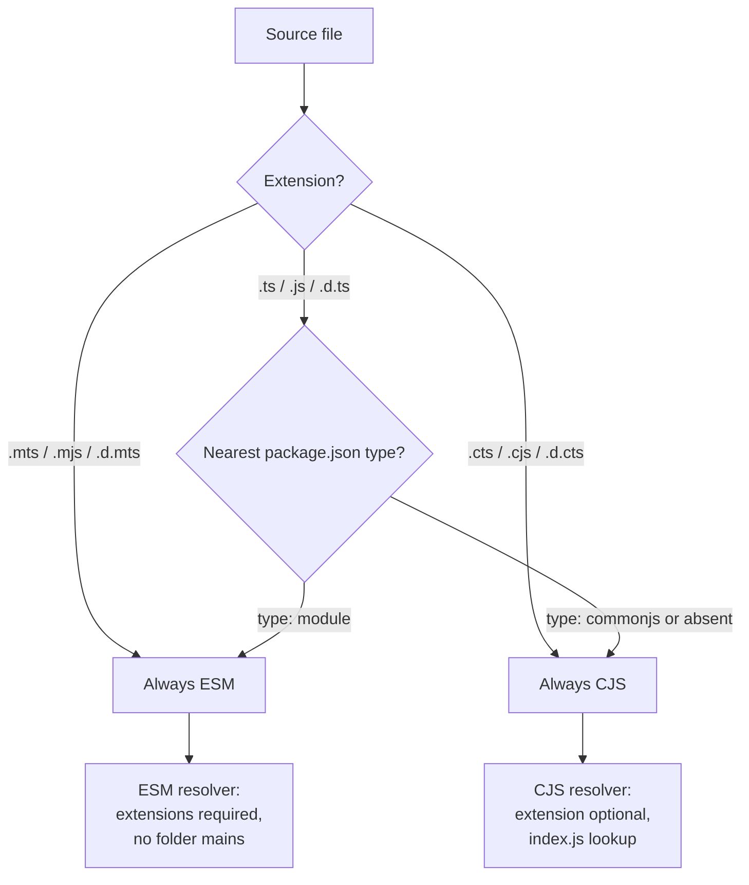

# [FEE-1714] Node.js ESM, `.mts`/`.cts` & `nodenext` Module Resolution

:::info
Node.js decides whether a JavaScript file is an ES module or CommonJS from two signals: the file extension and the nearest parent `package.json` `"type"` field. TypeScript 4.7 added `.mts` and `.cts` source extensions that mirror Node's `.mjs`/`.cjs`, and the `node16`/`nodenext` module options are the only correct choices for code that will run in Node.js v12 or later. The `bundler` option introduced in TypeScript 5.0 is convenient for apps consumed by a bundler, but it is a poor fit for libraries published to npm.
:::

## Context

Node's module system treats format as a first-class property of the file, not a runtime guess. A file is an ES module if its extension is `.mjs`, or if its nearest parent `package.json` contains `"type": "module"` and the extension is `.js`. Otherwise it is CommonJS. The Node docs put this plainly: "Authors can tell Node.js to interpret JavaScript as an ES module via the `.mjs` file extension, the `package.json` `\"type\"` field with a value `\"module\"`, or the `--input-type` flag with a value of `\"module\"`." The `"type"` field "defines the module format that Node.js uses for all `.js` files that have that `package.json` file as their nearest parent."

The ESM resolver then imposes rules CommonJS did not. Relative `import` specifiers "must include the file extension" and "directory indexes (e.g. `'./startup/index.js'`) must also be fully specified." There is no Node resolution walk across extensions, no folder-main lookup.

TypeScript 4.7 brought the authoring model in line with Node's runtime model. It added two source file extensions: "`.mts` and `.cts`. When TypeScript emits these to JavaScript files, it will emit them to `.mjs` and `.cjs` respectively." It also introduced `module: "node16"` (later `"nodenext"`), a compilation mode that matches Node's own resolver. Under these modes the compiler decides each file's format using Node's rules, then emits syntax valid for that format.

## Visual



| Input | Format under `node16`/`nodenext` | Emits as |
| --- | --- | --- |
| `foo.mts` | ESM | `foo.mjs` |
| `foo.cts` | CJS | `foo.cjs` |
| `foo.ts` in `"type": "module"` pkg | ESM | `foo.js` (ESM) |
| `foo.ts` in `"type": "commonjs"` pkg | CJS | `foo.js` (CJS) |

## Example

A minimal dual-format package. The `exports` field declares one entry point with two implementations and a shared type declaration. Node chooses the `import` condition for ESM consumers and `require` for CJS; TypeScript reads the `types` condition first when resolving declarations. The Node docs state that the `types` "condition should always be included first."

```json
{
  "name": "shape",
  "version": "1.0.0",
  "type": "module",
  "exports": {
    ".": {
      "types": "./dist/index.d.ts",
      "import": "./dist/index.mjs",
      "require": "./dist/index.cjs"
    }
  }
}
```

Sources use the matching extensions. `index.mts` emits `index.mjs`; `index.cts` emits `index.cjs`. The TypeScript 4.7 release notes describe this mapping directly.

```ts
// src/index.mts
export function area(r: number): number {
  return Math.PI * r * r;
}
```

```ts
// src/index.cts
export function area(r: number): number {
  return Math.PI * r * r;
}
```

After compilation, `dist/index.mjs` contains `export function area` and `dist/index.cjs` contains `exports.area = area`. The package.json `exports` map routes each consumer to the correct build.

## Best Practices

- **MUST** set `"module": "nodenext"` (or `"node16"`) when the output runs in Node.js. The TypeScript handbook states these "are the **only correct `module` options** for all apps and libraries that are intended to run in Node.js v12 or later, whether they use ES modules or not."
- **MUST** use the extension that matches the intended format. Under `node16`/`nodenext`, "`.mts`/`.mjs`/`.d.mts` files are always ES modules. `.cts`/`.cjs`/`.d.cts` files are always CommonJS modules. `.ts`/`.tsx`/`.js`/`.jsx`/`.d.ts` files are ES modules if the nearest ancestor package.json file contains `\"type\": \"module\"`, otherwise CommonJS modules."
- **SHOULD NOT** select `"moduleResolution": "bundler"` for libraries published to npm. The TypeScript 5.0 announcement warns: "If you're writing a library that's meant to be published on npm, using the bundler option can hide compatibility issues that may arise for your users who aren't using a bundler. So in these cases, using the node16 or nodenext resolution options is likely to be a better path."
- **SHOULD** keep library source compatible with `nodenext` even when the build happens through a bundler. `"moduleResolution": "bundler"` is "infectious, allowing code that only works in bundlers to be produced"; code valid under `nodenext` remains valid in bundlers.
- **MAY** use `"moduleResolution": "bundler"` for application code bundled by webpack, Vite, esbuild, or Rollup, where extensionless imports and bundler-specific export conditions are expected.

## Design Thinking

Two design choices explain the strictness of `nodenext`.

First, the ESM resolver in Node has "No default extensions. No folder mains." Browsers load ES modules by URL, and URLs do not guess. A specifier like `./foo` on the web resolves to `./foo` exactly, not `./foo.js` or `./foo/index.js`. Node inherited this model so that code written for the server can move to the browser without surprise rewrites. The cost is that every relative import must be spelled with its extension, including `./startup/index.js`.

Second, TypeScript must infer the runtime format for each file because guessing wrong is unrecoverable. The handbook's theory chapter states it directly: "If TypeScript were to emit `/example.js` with `import` and `export` statements in it, Node.js would crash when parsing the file. If TypeScript were to emit `/main.mjs` with `require` calls, Node.js would crash during evaluation." Under older `module` values the compiler could not see a file's runtime format, so a mis-configured `package.json` "type" silently produced a broken build. `nodenext` closes that gap by reading the same signals Node reads: extension first, then `package.json` `"type"`.

## Deep Dive

**The package.json walk.** The TypeScript 4.7 blog explains what `node16`/`nodenext` actually does at resolve time: "When TypeScript finds a `.ts`, `.tsx`, `.js`, or `.jsx` file, it will walk up looking for a `package.json` to see whether that file is an ES module, and use that to determine: how to find other modules which that file imports and how to transform that file if producing outputs." The walk stops at the first `package.json` found, which sets both the format and the resolver rules for every ambiguous extension underneath it.

**Implicit syntax rewriting.** A CJS-classified file can still be authored with `import` and `export` by default. The handbook: "TypeScript files that are determined to be in CommonJS format may still use `import` and `export` syntax by default, but the emitted JavaScript will use `require` and `module.exports` instead." This is convenient for migration but blurs what the output will look like. Setting `verbatimModuleSyntax: true` disables the rewrite; source syntax then has to match the emitted format exactly.

**Masquerading packages.** The Are The Types Wrong project uses two terms for a common failure mode: "Masquerading as CJS ... Masquerading as ESM ... These checks apply specifically to `node10`, `node16`, and `bundler` module resolution modes." A package "masquerades" when its type declarations advertise one format and its shipped JavaScript ships another, for example `.d.ts` describing named exports while the runtime file is a CommonJS `module.exports = ...`. Consumers under `node16`/`nodenext` then type-check green and crash at import. Running Are The Types Wrong against a tarball catches the mismatch before publish.

**Dual package hazard.** Shipping both formats from one package name is not free. The `dual-package-hazard` write-up states: "The dual package hazard occurs in packages that ship both CJS and ESM entry points, allowing the same package to get loaded twice: once through the CJS loader and once through the ESM loader." Two instances mean two sets of private state: classes fail `instanceof`, singletons diverge, and registries split. Mitigations include keeping the package stateless, exporting only data, or publishing separate packages for consumers who need the CJS build.

## Related Topics

- [Type-Only Imports & `verbatimModuleSyntax`](/en/TypeScript/type-only-imports)
- [tsconfig & Strict Mode](/en/TypeScript/1706)
- [Declaration Files & DefinitelyTyped](/en/TypeScript/1705)

## References

- Node.js, "ECMAScript modules," Node.js Documentation. https://nodejs.org/api/esm.html
- Node.js, "Modules: Packages," Node.js Documentation. https://nodejs.org/api/packages.html
- Microsoft, "Announcing TypeScript 4.7," TypeScript Blog (2022). https://devblogs.microsoft.com/typescript/announcing-typescript-4-7/
- Microsoft, "Announcing TypeScript 5.0," TypeScript Blog (2023). https://devblogs.microsoft.com/typescript/announcing-typescript-5-0/
- Microsoft, "Modules Reference," TypeScript Handbook. https://www.typescriptlang.org/docs/handbook/modules/reference.html
- Microsoft, "Modules Theory," TypeScript Handbook. https://www.typescriptlang.org/docs/handbook/modules/theory.html
- Microsoft, "Choosing Compiler Options," TypeScript Handbook. https://www.typescriptlang.org/docs/handbook/modules/guides/choosing-compiler-options.html
- Andrew Branch et al., "Are The Types Wrong," GitHub. https://github.com/arethetypeswrong/arethetypeswrong.github.io
- Geoffrey Booth, "dual-package-hazard," GitHub. https://github.com/GeoffreyBooth/dual-package-hazard
