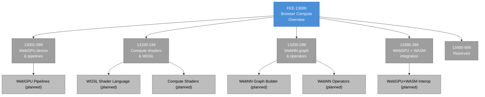

# [FEE-13000] Browser Compute Overview

:::info
The browser has spent thirty years as a document-and-UI runtime. WebGPU and WebNN are the specifications that add a compute runtime alongside it, and they are the API surface every browser-based GPU or ML workload now builds on.
:::

:::warning Web Platform Proposals
Articles in the 10000-19999 range cover features that are not yet stable across all major browsers. When a feature ships stable, its article graduates to the appropriate 0-9999 category.
:::

## Context

Two W3C Community and Working Groups share this category. The **GPU for the Web Community Group** authors the WebGPU specification; its membership is browser-engine teams, GPU IHVs (NVIDIA, AMD, Intel), and mobile vendors (Apple, Google). The **Web Machine Learning Working Group** authors the WebNN (Web Neural Network) specification, with a more ML-focused membership including Intel, Microsoft, and academic labs. Both groups operate under the W3C umbrella but with different cadences: the GPU group has been active since 2017, while the WebNN group formed in 2021 and is earlier in its lifecycle.

**Hardware heterogeneity** is the central design problem the specifications have to solve. The browser runs on Windows (where the native GPU API is Direct3D 12), macOS and iOS (Metal), Linux (Vulkan), and Android (Vulkan or Metal via iOS). A single shader program authored once must execute correctly on all of these, with predictable performance characteristics and consistent behavior. WebGPU's solution is to specify an abstract device/pipeline model that each browser engine implements atop the native API, and **WGSL** (WebGPU Shading Language) as a cross-platform shader language that every engine translates to its backend's native shader format (HLSL, MSL, or SPIR-V).

**WebGPU's shipping reality** is split across engines and platforms at the time of writing. The specification reached Candidate Recommendation in early 2026 and is shipping in multiple engines, though platform coverage varies. Chromium shipped WebGPU unflagged on Windows, macOS, and Linux desktop starting in 2023; Safari shipped WebGPU on macOS in a 2025 release. Firefox shipped WebGPU first on Windows (in 2025), with non-Windows platforms following later. The practical consequence is that WebGPU is a production-capable API on most desktop Chromium and Safari configurations, plus some Firefox configurations, but developers writing code today still need to check the per-platform matrix.

Mobile support is a separate dimension that lags desktop. Chromium on Android supports WebGPU on devices with compatible GPU drivers; iOS Safari shipped WebGPU with a 2025 iOS release but has its own per-device deny-list for older hardware. Firefox on Android is later still. A team targeting mobile audiences needs to check mobile support specifically; desktop shipping does not imply mobile shipping, and the two support matrices evolve on different schedules.

**WebNN's readiness** is earlier than WebGPU's. The specification reached Candidate Recommendation Draft in 2026 after a period of substantial evolution that added support for transformer models, the MLTensor API for buffer sharing, and new device selection mechanisms. At the specification level, WebNN has not yet demonstrated the two independent interoperable implementations required before advancing to Proposed Recommendation. Chromium ships an implementation behind the `WebMachineLearningNeuralNetwork` flag; Firefox and Safari have not shipped implementations. Production adoption today routes through WebGPU or WASM runtimes, with WebNN positioned as a future path once cross-engine shipping progresses.

The relationship between WebGPU and WebNN mirrors native-platform splits. On Apple hardware, Metal is the graphics API and MPS (Metal Performance Shaders) is the ML-focused kernel library atop Metal. On NVIDIA hardware, CUDA is the general-compute API and cuDNN is the ML-focused kernel library atop CUDA. Browsers adopted the same split: WebGPU is the low-level compute API that can execute arbitrary shaders, and WebNN is the high-level graph-builder API that targets the platform's ML accelerator through an operator-based interface. A team that wants general-purpose GPU compute uses WebGPU; a team that wants ML inference with minimum engineering effort uses WebNN when it ships.

Where WebGPU and WebNN overlap is in the operators that WebNN defines. WebNN's graph-builder API exposes operators (`conv2d`, `gemm`, `softmax`, `layernorm`, etc.) that map to ML-tuned kernel implementations on the platform. WebGPU can implement the same operators through custom compute shaders, but the application is responsible for writing those shaders. WebNN's advantage is that the operator implementation is platform-tuned; the disadvantage is the restricted operator set. A model that maps entirely onto WebNN's operator catalog benefits from using WebNN; a model that uses custom operators cannot use WebNN and falls back to WebGPU.

This category's governance structure also differs from its sibling tracks. Unlike TC39 (which has a committee plenary process) or WHATWG (which has a Steering Group), the GPU for the Web CG operates on a consensus-of-active-participants model. Specification changes are proposed in GitHub pull requests against the `gpuweb/gpuweb` repository; approval requires sign-off from multiple participant organizations. The result is slower progress than at TC39 or WHATWG but tighter implementer alignment, because every change has been reviewed by multiple engine teams before it lands.

The tradeoff is that non-implementer contribution is harder at the GPU for the Web CG than at some other standards bodies. A developer with a use case that needs a specific API shape cannot easily drive a specification change without an implementer champion. This is not a flaw in the process so much as a consequence of the domain: GPU APIs are deeply entangled with hardware and driver realities that most non-implementer contributors do not have visibility into. Implementer-led governance aligns with that technical reality.

## Scenario

A team prototypes in-browser large-language-model inference using the `@xenova/transformers` library (now known as transformers.js). The library detects available backends at load time and selects WebGPU when present, falling back to WASM-SIMD when not. The prototype runs at interactive speed in Chrome on Apple silicon, where WebGPU uses Metal under the hood. In Firefox on the same macOS machine, WebGPU is unavailable (Firefox has not yet shipped WebGPU on macOS), so the library falls back to WASM — which runs the same model at roughly one-tenth the throughput. On an Intel laptop, the WebGPU path works in Chrome and Edge; on Firefox the path works on Windows but falls back to WASM on Linux.

The team cannot promise the same experience across browsers and platforms. The decision matrix is three-dimensional (engine × platform × feature availability), and each cell has a different cost profile. The team has three broad options: ship the WebGPU path with a measurably slower WASM fallback for configurations that lack WebGPU, ship only the WASM path uniformly and miss the performance wins where WebGPU is available, or ship both paths with runtime detection and pay the complexity cost of maintaining both implementations. This overview maps the shape of that decision for any WebGPU or WebNN workload.

A library author in this space faces an additional concern. A compute-focused library (`transformers.js`, `onnxruntime-web`, `webgpu-utils`) must assume that the consumer's environment is heterogeneous; a library that ships only for WebGPU-capable environments excludes a large fraction of potential users. The library-author pattern is runtime-detection-with-graceful-degradation: probe for WebGPU at load time, probe for the specific required features (some shaders need more capability than others), fall back to CPU or WebGL where needed. This is more complex than the JavaScript-library pattern of "ship the feature unconditionally with polyfill" because the performance cliff between WebGPU and WebGL or WASM is steep enough to matter.

A product team that wants to ship WebGPU-based rendering (separate from inference use cases) has a different calculation. Rendering use cases tolerate WebGL fallback better than inference use cases, because WebGL is a mature graphics API with comparable (if awkward) capability. A WebGPU-rendered 3D scene can often be back-ported to WebGL with a manageable effort; a WebGPU-accelerated ML model typically cannot, because WebGL's compute-shader support is limited to fragment-shader tricks that do not scale to transformer-sized models. The adoption calculus for the two use cases diverges at the fallback question.

## Design Thinking

### Why compute is its own category

Before WebGPU, browsers exposed graphics primitives (2D canvas, WebGL) but not general compute primitives. WebGL is a graphics API; using it for compute means encoding compute workloads into vertex and fragment shaders, which the engine then executes on the GPU as a graphics pipeline. This works for some cases — early WebGL-based neural-net demos did exactly this — but the approach is awkward and inefficient. The GPU's compute units are scheduled through the graphics pipeline, which adds overhead; the memory model is foreign to compute workloads; debugging requires reading fragment-shader output as if it were pixel data.

WebGPU is a first-class compute API: it has a dedicated compute pipeline distinct from the render pipeline, and WGSL supports compute shaders as a native concept with proper workgroup semantics. The graphics capability comes along for free because the render pipeline is a separate subsystem that uses the same device abstraction. A team using WebGPU for ML inference is using the compute pipeline exclusively; a team using WebGPU for 3D rendering is using the render pipeline; a team doing both uses both through the same `GPUDevice`.

**The split between graphics (WebGPU) and ML (WebNN) mirrors native-SDK splits.** Apple ships Metal (graphics) and MPS (ML-focused kernels atop Metal); NVIDIA ships CUDA (general compute) and cuDNN (ML kernels); AMD ships ROCm (compute) and MIGraphX (ML). Browsers adopted the same split: WebGPU is the low-level compute API, WebNN is the high-level graph-builder API that targets the platform's ML accelerator through an operator-based interface. The split exists because the performance characteristics of hand-written shaders vs. vendor-tuned ML kernels are different by an order of magnitude for typical model operators; having both layers lets developers pick the right abstraction for their use case.

WebGPU's design choices are also shaped by the **don't-break-the-web constraint** that applies differently to compute APIs than to DOM APIs. A compute API can expose GPU hardware that differs in capability across devices (some GPUs lack certain operators, support different precision levels, or impose different memory limits). WebGPU responds with `GPUSupportedFeatures` and `GPUSupportedLimits` — a set of optional features that an adapter may or may not advertise, and a set of numeric limits on buffer size, workgroup size, and so on. Code that wants portability checks these at runtime and degrades gracefully. Code that wants peak performance on a specific GPU class feature-gates against the checked capabilities and uses them.

### How userland bridges the gap

**A WebGPU polyfill over WebGL is impractical.** WebGPU's device/pipeline model is fundamentally different from WebGL's state-machine model; a translation layer that preserves performance characteristics does not exist as a general-purpose library. A few specialized polyfills exist for narrow use cases (for example, Three.js's backend abstraction that runs on either WebGL or WebGPU), but these polyfills implement a restricted subset of WebGPU semantics and do not work for arbitrary shader code. Libraries that need cross-engine compatibility maintain separate WebGPU and WebGL implementations of their core routines.

**ONNX Runtime Web** (`onnxruntime-web` on npm) runtime-detects WebGPU and selects a backend per inference operator. When WebGPU is unavailable, it falls back to WASM-SIMD; when both are unavailable, it falls back to scalar WASM. The fallback is slower but functional on every engine. ONNX Runtime is the de facto standard for model inference in the browser; Hugging Face's `transformers.js` library uses it internally as its execution backend.

**transformers.js** and similar libraries adopt the same runtime-detection pattern: probe for WebGPU at load time, report the selected backend to the application for observability, run the model with whatever backend is available. The library's public API is backend-agnostic — the same method calls work regardless of which backend runs underneath. This lets application code stay portable while the library handles the capability-detection complexity.

The observability aspect matters for production monitoring. An application that measures inference latency should also log which backend the library selected; a sudden shift from WebGPU to WASM (caused by a browser update, a deny-list change, or a user preference change) will show as a step-function regression in the latency metrics. Without backend-level observability, the regression is hard to diagnose. The pattern to apply is: add backend identification to the application's telemetry alongside the latency numbers.

**For WebNN specifically, userland polyfills do not exist.** WebNN is meant to be the polyfill layer itself — a stable API over whatever ML accelerator the OS exposes. Until it ships cross-engine, teams route through WebGPU or WASM directly. When WebNN reaches shipping, libraries like ONNX Runtime Web will add WebNN as a preferred backend ahead of WebGPU for supported operators, because WebNN can invoke hardware-accelerated ML paths (NPU, Neural Engine) that WebGPU cannot reach directly.

### Reading the capability matrix

WebGPU's per-GPU capability matrix is a core complexity the category has to manage. The matrix has three dimensions: the adapter advertises **features** (`"shader-f16"`, `"timestamp-query"`, `"bgra8unorm-storage"`, etc.) that may or may not be available; the adapter reports **limits** (`maxBufferSize`, `maxStorageBufferBindingSize`, `maxComputeWorkgroupStorageSize`) that constrain resource sizes; and the engine's WebGPU implementation may itself have bugs or performance cliffs on specific hardware that the specification cannot predict.

Portable WebGPU code checks both features and limits at device creation time. A shader that needs `f16` precision to fit in memory must check `"shader-f16"` in `adapter.features` before requesting a device; a workload that needs a 1 GB buffer must check `adapter.limits.maxBufferSize` before allocating. Production code often runs a capability-probing phase before model loading to determine the feasible execution path on the current device.

```js
const adapter = await navigator.gpu.requestAdapter();
if (!adapter) {
  // WebGPU is unavailable; fall back to WASM.
}
const supportsF16 = adapter.features.has('shader-f16');
const maxBuffer = adapter.limits.maxBufferSize;
const device = await adapter.requestDevice({
  requiredFeatures: supportsF16 ? ['shader-f16'] : [],
});
```

The capability matrix has implications for specification stability. WebGPU cannot afford to remove features once shipped, because doing so would break code running on adapters that previously advertised them. Features are therefore additive-only: once a feature ships in the specification, it is a permanent part of the API, even if some future GPU architecture lacks it. This is the same stability constraint that shapes TC39 and HTML proposals, applied to GPU capabilities.

The constraint also means that new WebGPU features take longer to land than new HTML or CSS features, even after they reach Candidate Recommendation. A new WebGPU feature needs implementations on all three major backend APIs (Direct3D 12, Metal, Vulkan), and the implementation has to work across the range of GPUs that each engine supports. A feature that works on desktop Metal but has driver bugs on mobile Metal-through-iOS cannot ship unflagged until the driver bugs are resolved. This is why the WebGPU feature roadmap moves slowly compared with other specification tracks.

### When to adopt WebGPU or WebNN

The adoption calculus is a short set of questions.

First, **which use case — rendering or compute?** Rendering use cases have a viable fallback (WebGL) with comparable capability. Compute use cases have a fallback (WASM) with a 10x performance cliff. Rendering tolerates the fallback; compute tolerates it less well. A team adopting WebGPU for rendering can promise "WebGL fallback in engines that lack WebGPU"; a team adopting WebGPU for compute promises "WASM fallback at lower quality."

Second, **which platforms and engines are supported?** WebGPU's platform matrix is three-dimensional (engine × OS × feature). Check the current matrix on `caniuse.com/webgpu` plus the engine's release notes. A team targeting Chrome on desktop has the widest availability; a team targeting Firefox on macOS has effectively no availability at the time of writing.

Third, **what is the fallback cost?** For rendering, the fallback is WebGL and the cost is maintaining a second rendering pipeline. For compute, the fallback is WASM and the cost is acceptable quality on lower-throughput hardware. For ML inference specifically, WebGPU vs WASM changes the feasible model size — a 3B-parameter model might run at interactive latency on WebGPU but at multi-second latency on WASM.

Fourth, **does the feature set need WebNN?** Most browser ML workloads today can be served by WebGPU plus ONNX Runtime Web. WebNN becomes attractive when the target hardware has a dedicated NPU or Neural Engine that WebGPU cannot reach. As NPUs proliferate in consumer laptops (Intel Core Ultra, Snapdragon X, Apple Silicon post-M1), the gap between WebGPU and WebNN throughput widens for models that map well to NPU operators.

The articles under 13001-13399 answer these four questions for each specific topic. This overview provides the framework.

The order of the questions reflects the decision structure. Use case first rules out the irrelevant fallbacks. Platform coverage second determines whether the feature is usable for the target audience. Fallback cost third calibrates the quality degradation. WebNN applicability last determines whether an alternative compute path is worth pursuing. Teams that skip the first question often build WebGPU-exclusive compute paths that cannot run on a large fraction of their users' devices, which surfaces as a production incident once launch traffic arrives.

A library author in the compute space faces an additional layer. The library's target performance profile differs by use case: inference libraries need to hit interactive latency for small-to-medium models, while scientific-computing libraries need to hit throughput on large workloads. Both have different sensitivity to the WebGPU vs. WASM cliff. An inference library can gracefully degrade (slower model responses); a scientific-computing library may not be usable at all without GPU acceleration. The library's adoption calculus therefore differs from the application's — a library committed to serving a broad audience may need to restrict its scope to what runs adequately on the median supported device.

## Deep Dive

### The WGSL shader language

WGSL (WebGPU Shading Language) is the cross-platform shader language the specification defines. Every WebGPU shader is authored in WGSL; the engine translates WGSL to the backend's native format (HLSL for Direct3D, MSL for Metal, SPIR-V for Vulkan) at runtime. WGSL syntax resembles Rust (which was an influence) with type annotations, explicit storage classes, and workgroup decorators.

The design decision to specify a single shader language was contentious during specification development. An early-proposal alternative was to accept SPIR-V directly, passing shaders to the engine as a pre-compiled intermediate representation. The argument for a single language was that web content needs to be parseable by the browser for security review; accepting arbitrary SPIR-V would require the engine to validate every shader against the full SPIR-V specification, which is large and includes features irrelevant to the web. The argument against was that every compute library in the non-browser ecosystem already emits SPIR-V (via `rustc`, `shaderc`, `glslang`) and a single language forces a redundant compilation step. The specification chose WGSL; libraries now ship WGSL output as a build-time concern.

WGSL's feature set is a careful subset of what native shader languages support. Recursion is not supported; runtime-sized arrays are supported only in storage buffers; pointer arithmetic is absent. These restrictions are there to ensure the shader compiler can always translate WGSL to any of the three backend languages without encountering backend-specific features that the target backend lacks.

WGSL also includes several features that are cross-cutting improvements over the native shader languages. Built-in types for common graphics data (vectors, matrices, samplers, textures) have consistent semantics across all backends, unlike native shader languages where the same syntax can produce different results. The type system is stricter about implicit conversions than HLSL or GLSL, catching a class of bugs at compile time that would otherwise surface at runtime. These design choices let application code target WGSL once and run consistently across backends without per-backend adjustments.

Shader authoring tooling for WGSL is still catching up to the equivalent tooling for native shader languages. Syntax highlighting, language servers, and linters exist (a VSCode extension is maintained, and `naga` provides a standalone validator), but the ecosystem is younger than GLSL or HLSL. Teams adopting WebGPU should factor in tooling maturity when estimating authoring time.

### The security and privacy surface

Exposing GPU hardware to web content introduces a new security surface. Modern GPUs have shared caches, shared memory controllers, and shared execution units that can leak information across process boundaries if not carefully partitioned. The WebGPU specification addresses this with a dual approach: the specification itself restricts what a web shader can observe (no direct memory access outside allocated buffers, no direct timing queries with high precision), and the browser's implementation layer adds further isolation (process sandboxing, GPU-process isolation separate from content processes).

The **fingerprinting concern** is that adapter identification (vendor, architecture, driver version) is information that can be used to track users. The specification exposes some of this through `GPUAdapterInfo` but explicitly limits the precision; an adapter may report "Apple Silicon" without reporting which specific M-series chip. The engine may further restrict this information for users with tracking-protection enabled.

The **timing-side-channel concern** applies to compute workloads that could be used to observe cache access patterns from other processes. Browsers mitigate this by limiting the precision of `GPUQuerySet` timestamp queries, by running the GPU process with its own memory partitioning, and by disabling high-precision timing features for shaders that run on shared contexts. The mitigation posture continues to evolve as new side-channel techniques are discovered in academic research; teams building security-sensitive WebGPU applications should track the academic literature on GPU side channels and review their target browsers' mitigation status.

Teams adopting WebGPU should understand that the security posture depends on the browser's implementation alongside the specification. A browser that ships WebGPU without full process isolation could have vulnerabilities that the specification does not require the engine to fix. The specification describes what the API must expose; the security properties depend on how the engine implements it. A product team shipping a WebGPU-dependent feature to a security-sensitive audience should review the target browsers' GPU-sandbox posture in addition to checking API support.

### Reading chromestatus, webkit features, and Firefox DevTools

Each engine exposes its WebGPU implementation status through its platform-status page. Chromium's status is at `chromestatus.com/features?q=webgpu`, filtered to WebGPU-related features. Firefox's experimental WebGPU is tracked in the `dom.webgpu.enabled` preference set, with per-platform enablement in separate preferences (`dom.webgpu.enabled.macos`, `dom.webgpu.enabled.linux`). WebKit's status is in Safari's release notes and Safari Technology Preview release notes.

Reading these sources efficiently requires understanding the engine-specific semantics. Chromium "ships" WebGPU at a milestone (Chrome 113 on desktop for Windows/macOS/Linux; later for Android). Firefox ships by preference-default-true on a specific platform (Firefox 141 defaulted `dom.webgpu.enabled` to true on Windows; non-Windows platforms remain opt-in). Safari ships tied to Safari major versions. A production team tracking WebGPU's shipping progress checks all three sources plus `caniuse.com/webgpu` monthly.

For production deployments, an additional watchpoint is the **GPU deny-list** that browsers maintain. Certain GPU models are known to have driver bugs or performance cliffs severe enough that WebGPU is automatically disabled on them even in engines that otherwise ship WebGPU. The deny-lists are updated periodically as bugs are discovered or fixed. Teams launching WebGPU-dependent features should test on representative hardware to confirm the target audience is not largely on deny-listed GPUs.

### WebGPU's relationship to native GPU APIs

WebGPU is not a native GPU API; it is a web abstraction over native GPU APIs. Every WebGPU call traces down through the engine's WebGPU implementation to the native API (Direct3D 12, Metal, or Vulkan) to the driver to the hardware. The per-layer cost matters for performance analysis: a bottleneck can live at any layer, and debugging requires understanding which layer is doing what.

At the **specification layer**, WebGPU defines abstract concepts (GPUDevice, GPUQueue, GPURenderPipeline) that the engine implements. The specification prescribes behavior but not implementation — an engine can internally optimize by batching submissions, caching pipeline state, or deferring resource allocation, as long as the observable behavior matches the specification.

At the **engine layer**, the browser's WebGPU implementation maps specification concepts to native concepts. `GPUDevice` corresponds to a Direct3D 12 `ID3D12Device` or a Metal `MTLDevice` or a Vulkan `VkDevice`. The mapping is not always one-to-one: a single WebGPU call may emit multiple native calls, or a sequence of WebGPU calls may be coalesced into fewer native calls. The engine's optimization work at this layer is substantial and is where a lot of WebGPU's real-world performance comes from.

At the **driver layer**, the GPU vendor's driver implements the native API against the hardware. Driver quality varies by vendor and by hardware generation; older integrated GPUs may have driver bugs that affect WebGPU through the native API. Teams shipping WebGPU-heavy workloads should test on representative hardware and maintain a list of known-problematic driver versions.

At the **hardware layer**, the GPU executes the shaders and kernels. Hardware-level factors (memory bandwidth, compute unit count, thermal throttling) set the ultimate performance ceiling.

Understanding this layering is what distinguishes a team that can debug WebGPU performance from a team that only knows the API surface. Performance problems often live below the WebGPU call — in the engine's batching logic, in the driver's shader compilation, in the hardware's thermal behavior — and the fix is sometimes "use a different adapter" when the issue is a driver quirk that a shader rewrite will not address.

### Withdrawn and paused specifications

Not every GPU/ML proposal advances. The **WebGL 2.0 Compute** extension is a cautionary case. The extension was proposed in 2018 as an addition to WebGL that would add compute shader support. Chromium shipped an experimental implementation in 2019. The proposal stalled when browser teams concluded that extending WebGL was not the right path — WebGPU's first-class compute design was a better foundation, and splitting effort across WebGL-compute and WebGPU would delay both. WebGL 2.0 Compute was deprecated in 2020, and teams that had adopted it migrated to WebGPU.

This is a pattern worth noting: compute-adjacent proposals can be abandoned in favor of a better-positioned successor. The WebGL 2.0 Compute → WebGPU transition cost early adopters a migration, though the successor was a broader and better-structured specification, so the migration was usually a net benefit. Teams adopting early compute-adjacent proposals today (WebNN, custom WebGPU extensions) should treat this history as a signal about the risk profile.

### Emerging NPU access through WebNN

A specific trend worth tracking: **NPU-equipped consumer hardware is becoming common**. Intel's Core Ultra line (2024+), Qualcomm's Snapdragon X (2024+), and Apple's M-series (2020+) all include dedicated neural-processing units that are separate from the GPU's compute units. These NPUs are optimized for low-precision (int8, int4) matrix operations typical of neural-network inference; running the same model on the NPU vs the GPU is often 2-5x faster with lower power consumption.

WebGPU cannot target these NPUs directly — the API is GPU-scoped. WebNN is the proposed bridge. A WebNN implementation on a platform with an NPU routes matrix operations to the NPU transparently; an application using WebNN gets the NPU speedup without changing any application code. This is the primary reason WebNN matters as a separate specification from WebGPU: without it, browser-based inference cannot reach NPU hardware.

The practical consequence: teams shipping today should use WebGPU with ONNX Runtime Web and accept that NPU hardware will be underutilized. When WebNN ships cross-engine, ONNX Runtime Web will transparently prefer WebNN for NPU-targeted operators, and the performance profile will improve without application changes. The adoption pattern to apply today is: use a backend-agnostic inference library, monitor WebNN shipping progress, be ready to switch backends when the progress lands.

## Visual



The blue node is the category overview. Gray range nodes are currently empty of drafted sub-articles; the planned topics are shown as gray leaves. Sub-articles for the 13000 range are the scope of a follow-up specification under the FEE project — this overview is the entry point until those sub-articles exist. Readers tracking specific topics should use the References section's links to the W3C specifications, MDN, and engine-implementation trackers until the corresponding sub-article is drafted.

The category's emptiness reflects two realities. First, Browser Compute is a newer area than the JavaScript, CSS, and HTML tracks; the specifications are younger and the shipping is more recent. Second, writing effective sub-articles for this category requires substantial GPU and ML context that overlaps with broader graphics and inference topics — the sub-articles will likely cross-reference FEE-408 (WebGL and rendering) and FEE-404 (storage and memory APIs) to avoid duplicating foundational material.

The suggested reading order when the sub-articles exist: WebGPU device model first (the foundation), compute shaders and WGSL second (builds on the device model), WebNN graph builder third (a parallel specification but easier to understand after WebGPU), and integration patterns last (combines WebGPU with WebAssembly and requires familiarity with both). A developer new to browser compute should spend time on the WebGPU samples at `webgpu.github.io/webgpu-samples` as a runnable companion to the reading.

## Tracks in this range

| Range | Topic | Example content |
|-------|-------|-----------------|
| 13001-13099 | WebGPU device model, pipelines, buffers | GPUAdapter, GPUDevice, GPUQueue, buffer and texture lifecycle |
| 13100-13199 | Compute shaders & WGSL | Workgroup semantics, storage buffers, compute dispatch |
| 13200-13299 | WebNN graph & operators | MLGraphBuilder, operator catalog, tensor types, device selection |
| 13300-13399 | Integration patterns (WebGPU + WebAssembly) | Transferring data between WASM and GPU, shared-memory interop |
| 13400-13999 | Reserved | — |

The range assignments follow the natural layering of the specifications. WebGPU's device model (13001-13099) is prerequisite to the compute-shader topics (13100-13199), which are prerequisite to WebGPU+WASM integration (13300-13399). WebNN (13200-13299) is its own specification with a parallel learning arc, typically approached after the reader has a WebGPU baseline.

## Graduation

Graduation from 13000-range to `Browser APIs & Web Platform` (400-499) happens when a specification ships unflagged across all three major engines on all common platforms. For WebGPU, this means Chromium, Firefox, and Safari all shipping WebGPU unflagged on Windows, macOS, Linux, and at least one mobile platform. At the time of writing, the outstanding items are Firefox on non-Windows platforms and Safari on iOS/iPadOS. When those ship, WebGPU is a graduation candidate.

WebNN's graduation path is longer. The specification has not yet demonstrated the two interoperable implementations required to advance past Candidate Recommendation, and browser shipping (unflagged) is likely several years out. WebNN articles will stay in the 13000 range for the foreseeable future.

The long WebNN timeline also affects how teams plan around it. A team building a product that depends on NPU-accelerated inference cannot wait for WebNN's cross-engine shipping; they must either target specific devices where WebGPU-based inference meets their latency requirements or ship a native companion app for the subset of users who need the speed. This is a case where the 13000 range's "pre-stable" framing affects product roadmaps directly — a three-year delay on WebNN cross-engine shipping is a three-year delay in the browser-native alternative to native ML runtimes.

A partial-graduation approach applies here as well. The low-level WebGPU device model and rendering pipeline can graduate on their own schedule, while compute-specific topics (WGSL compute shaders, workgroup management) can stay in the 13000 range if they are lagging on cross-engine shipping. The graduation decision is per-topic, not per-category.

When a topic's corresponding article graduates, it moves to a new ID under 400-499 and the old 13000-range ID becomes a redirect. Inbound links, git history, and bookmarks remain intact.

The FEE does not formally track which topics are near graduation because the per-engine shipping matrix is the more precise answer. Readers curious about candidates should consult `caniuse.com/webgpu` for WebGPU, `caniuse.com/webnn` (when the tracker adds it) or the W3C WebNN implementation status for WebNN, plus each engine's platform-status page for current shipping intent.

Graduation editorial decisions will need to handle the specifications' internal structure. WebGPU has a core (the device model, the render pipeline, the compute pipeline, WGSL) and optional features that adapters may or may not advertise. The core is likely to graduate as a unit once cross-engine shipping is universal; the optional features may graduate individually as their cross-engine support matures. A sub-article covering `"shader-f16"` might remain in the 13000 range while the WebGPU core graduates, and then graduate independently when f16 support stabilizes. This mirrors the per-proposal graduation model used in the TC39 track.

## Related FEEs

| FEE | Relationship |
|-----|-------------|
| [FEE-400 Browser APIs & Web Platform](../../Browser%20APIs%20and%20Web%20Platform/400.md) | The destination category for graduated WebGPU and WebNN topics. |
| [FEE-408 WebGL & WebGPU](../../Browser%20APIs%20and%20Web%20Platform/408.md) | The graphics-API neighbor; readers evaluating WebGPU for graphics-only use cases should start here. |
| [FEE-405 Web Workers & Concurrency](../../Browser%20APIs%20and%20Web%20Platform/405.md) | WebGPU work often runs in workers to avoid blocking the main thread; FEE-405 is prerequisite for worker-based compute patterns. |
| [FEE-417 Transferable Objects](../../Browser%20APIs%20and%20Web%20Platform/417.md) | Transferring data between the main thread and GPU-worker threads requires understanding transferable-object semantics; FEE-417 covers the transfer-vs-clone decision. |
| [FEE-14000 WebAssembly Proposals](../WebAssembly%20Proposals/14000.md) | Sibling track — WASM is the fallback compute runtime for workloads that cannot use WebGPU, and WebGPU+WASM integration is a 13300-range topic. |
| [FEE-11000 CSS Experimental](../CSS%20Experimental/11000.md) | Sibling track for CSS proposals. |

## References

- [W3C GPU for the Web Community Group](https://www.w3.org/community/gpu/) — the authoring venue for the WebGPU specification.
- [WebGPU Specification (W3C CR)](https://www.w3.org/TR/webgpu/) — the normative WebGPU specification.
- [WGSL Specification](https://www.w3.org/TR/WGSL/) — the WebGPU Shading Language specification.
- [W3C Web Machine Learning WG](https://www.w3.org/groups/wg/webmachinelearning/) — the authoring venue for the WebNN specification.
- [W3C WebNN Specification](https://www.w3.org/TR/webnn/) — the normative WebNN specification.
- [gpuweb/gpuweb on GitHub](https://github.com/gpuweb/gpuweb) — the specification's working repository.
- [webmachinelearning/webnn on GitHub](https://github.com/webmachinelearning/webnn) — the WebNN specification's working repository.
- [MDN: WebGPU API](https://developer.mozilla.org/en-US/docs/Web/API/WebGPU_API) — per-API documentation with browser-compat-data tables.
- [MDN: WebGPU Shading Language](https://developer.mozilla.org/en-US/docs/Web/API/WebGPU_API/WGSL) — practical reference for WGSL syntax and semantics.
- [caniuse.com/webgpu](https://caniuse.com/webgpu) — community-maintained per-engine WebGPU shipping matrix.
- [Chrome WebGPU team blog](https://developer.chrome.com/blog/webgpu-io2023) — Google's running notes on WebGPU progress in Chromium.
- [WebKit WebGPU announcement](https://webkit.org/blog/) — WebKit blog with Safari's WebGPU rollout posts.
- [Firefox WebGPU enablement notes](https://hacks.mozilla.org/) — Mozilla's running notes on WebGPU shipping in Firefox.
- [ONNX Runtime Web](https://github.com/microsoft/onnxruntime/tree/main/js/web) — Microsoft's browser-ML runtime with WebGPU and WASM backends.
- [transformers.js](https://github.com/xenova/transformers.js) — Hugging Face's browser-native inference library built on ONNX Runtime Web.
- [WebGPU samples](https://webgpu.github.io/webgpu-samples/) — official WebGPU sample gallery for API patterns.
- [Three.js WebGPU backend](https://threejs.org/docs/#manual/en/introduction/WebGPU-Renderer) — Three.js's WebGPU renderer, one of the largest adopters of WebGPU for rendering.
- [WebGPU compatibility matrix on caniuse](https://caniuse.com/webgpu) — community-maintained shipping matrix for WebGPU across engines and platforms.
- [WGSL language reference on the MDN](https://developer.mozilla.org/en-US/docs/Web/API/WebGPU_API/WGSL) — practical reference for the WGSL shader language syntax and built-in functions.
- [W3C WebGPU implementation status](https://github.com/gpuweb/gpuweb/wiki/Implementation-Status) — wiki page with per-engine per-platform shipping status.
- [Babylon.js WebGPU](https://doc.babylonjs.com/setup/support/webGPU) — another major 3D engine with a WebGPU backend; useful comparison to Three.js.
- [Chrome AI developer page](https://developer.chrome.com/docs/ai) — Google's developer-facing hub for in-browser AI including WebGPU and WebNN resources.
- [WebGPU Fundamentals](https://webgpufundamentals.org/) — community tutorial site covering WebGPU patterns for rendering and compute.
- [WebML Demos](https://webmachinelearning.github.io/webnn-samples/) — sample gallery for WebNN API usage.
- [ONNX format](https://onnx.ai/) — the neural-network model interchange format used by most browser-ML libraries.
- [Hugging Face Hub](https://huggingface.co/models) — model library with ONNX and WebGPU-compatible formats for many popular models.
- [Intel OpenVINO web examples](https://github.com/openvinotoolkit/openvino) — Intel's reference implementations that pair with WebNN for NPU acceleration.
- [naga](https://github.com/gfx-rs/naga) — the WGSL validator and translator used by Firefox's WebGPU implementation.
- [Dawn](https://dawn.googlesource.com/dawn) — Chromium's WebGPU implementation project; reference for Chromium's internal WebGPU architecture.
- [wgpu](https://wgpu.rs/) — Rust-language WebGPU implementation that can also run natively; useful as a portability layer for teams targeting both browser and desktop.
- [WebGL to WebGPU comparison](https://developer.chrome.com/blog/webgpu-webgl) — practical migration guide from WebGL to WebGPU patterns.
- [WebGPU reporter tool](https://webgpureport.org/) — online tool that reports the current browser's WebGPU adapter information and capability matrix.
- [Academic GPU side channels](https://webgpu.github.io/webgpu/security.html) — the specification's security considerations section covering side-channel concerns.
- [ORT WebGPU execution provider](https://onnxruntime.ai/docs/execution-providers/WebGPU-ExecutionProvider.html) — ONNX Runtime's documentation on the WebGPU execution provider used by transformers.js.
- [Google MediaPipe](https://ai.google.dev/edge/mediapipe/solutions/guide) — MediaPipe solutions library with WebGPU-accelerated inference for on-device ML.
- [Kyutai's Moshi web demo](https://moshi.chat/) — example of a production WebGPU-based ML application demonstrating what the API can deliver at scale.
- [Tabby Studio WebGPU docs](https://developer.chrome.com/blog/new-in-webgpu-134) — developer blog series on new WebGPU capabilities landing in each Chrome release.
