# [FEE-11000] CSS Experimental Overview

:::info
CSS ships per module, not per specification. One module can be production-ready while its sister module is still a working draft; knowing which is which is the working skill for modern CSS.
:::

:::warning Web Platform Proposals
Articles in the 10000-19999 range cover features that are not yet stable across all major browsers. When a feature ships stable, its article graduates to the appropriate 0-9999 category.
:::

## Context

The **W3C CSS Working Group** (CSSWG) is the W3C working group responsible for CSS. Its membership is drawn from W3C member organizations (including every major browser vendor) plus invited experts. The group meets in person roughly yearly and holds weekly telephone conferences in between. Decisions are made in public: every issue is tracked in GitHub, every meeting produces minutes published to the public archive, and every specification draft lives in the `w3c/csswg-drafts` repository.

The CSS category of FEE is governed by a separate standards body from its sibling 10000s tracks. TC39 owns JavaScript; WHATWG owns HTML and the DOM; W3C CSSWG owns CSS. Each body has its own process, its own cadence, and its own relationship with browser engines. Readers coming from the JavaScript 10000s track will find that "stages" work differently here; the CSS process uses a maturity ladder (Working Draft, Candidate Recommendation, and so on) as its progression model. The adoption dilemma the track exists to explain is the same.

The **module-per-feature model** is the load-bearing structural decision behind modern CSS. After the 2011 CSS 2.1 freeze, the CSSWG abandoned the monolithic specification format that had produced CSS 1, CSS 2, and the stalled CSS 3. Each feature area became its own module with its own level number and its own editor. Anchor Positioning Level 1, Grid Layout Level 2, Cascade Layers Level 1, Scoping Level 1, and Nesting Level 1 are each their own specification, evolving at their own pace. The naming "CSS 3" persists in informal usage, but no such specification document exists; the current equivalent is the **CSS Snapshot**, a yearly W3C Group Note that lists which modules the working group considers stable. CSS Snapshot 2024, published as a Group Note in February 2025, is the most recent at the time of writing.

The **W3C maturity ladder** for each module proceeds as FPWD (First Public Working Draft) → WD (Working Draft) → CR (Candidate Recommendation) → PR (Proposed Recommendation) → REC (Recommendation). Practically, the useful bar is CR. At CR the specification is considered complete, browser implementations are expected to match the spec, and the document is open to an implementation-feedback loop during which engines report their experience. PR and REC are formal milestones that some shipped modules never reach — a module can sit at CR indefinitely while browsers ship it and developers use it. The CSS Snapshot's list of stable modules therefore includes both RECs and "Reliable CRs" that everyone treats as stable.

The **Interop project** (2022 onward) is a yearly cross-vendor commitment that pulls specific features onto a shared timeline. At the start of each year, representatives from Google, Apple, Mozilla, Microsoft, Bocoup, and Igalia negotiate a focus list of features or specifications that all three rendering engines commit to improving compatibility on during the year. The features are selected from areas where real-world developer pain has accumulated and where cross-engine implementation gaps are documented. Interop 2024 and Interop 2025 both included multiple CSS modules. Features selected for Interop typically close their cross-engine shipping gap within the calendar year; features outside Interop may sit for years behind one engine's flag while the other engines debate implementation details.

A typical timeline for a modern CSS module runs roughly five years from First Public Working Draft to universal cross-engine shipping. Container Queries took approximately four years (2020-2023). Subgrid Level 1 took approximately six years (2017-2023). Anchor Positioning reached Candidate Recommendation status and is shipping in some engines at the time of writing; cross-engine shipping is still in progress. The length of the tail depends on implementation complexity, the priority each engine assigns the feature, and whether the feature lands on the Interop list. Developers making adoption decisions are reading signals from every one of these inputs together with the specification's maturity level.

## Scenario

A product team receives design mocks that use anchor-positioned tooltips. Each button has a flyout that is positioned relative to the button's edge via the CSS `anchor-name` and `position-anchor` properties, with no JavaScript calculating offsets at runtime. The feature is shipping unflagged in Chromium at the time of writing; Safari and Firefox have implementations tracked but have not shipped stable releases. The design leans on CSS-only positioning for accessibility (no layout shift) and performance (no JS work on scroll or resize).

The team's adoption options map onto the same four-path shape as the JavaScript 10000s track, adapted to CSS tooling. Path 1: ship anchor positioning in every browser and accept the feature silently failing in Safari and Firefox, which will fall back to the CSS layout the browser can understand (typically the button and tooltip rendered in document flow without the intended positioning). Path 2: ship anchor positioning inside an `@supports(anchor-name: --x) { … }` block, with a JavaScript fallback outside the block that positions the tooltip using `getBoundingClientRect()` on browsers that lack the feature. Path 3: ship only the JavaScript path for now and wait for cross-engine shipping before adding the CSS-only version. Path 4: gate the entire feature behind a `CSS.supports()` runtime check in JavaScript, rendering a different component for the two cases.

Each path has a concrete cost. Path 1 costs no bundle size but degrades experience in roughly 35 % of a general web audience. Path 2 doubles the positioning logic (CSS and JS) and adds an `@supports` gate but keeps behavior consistent. Path 3 costs zero browser-specific code but delays the performance-wins the CSS-only path offers. Path 4 costs extra runtime logic but keeps the two paths fully independent. The articles under 11001-11099 cover Anchor Positioning specifically; this overview establishes the framework for reasoning about the shape of the decision for every feature in the CSS Experimental range.

A library author building a component system faces a different calculation. A headless-component library (Radix-style) that exposes tooltips and dropdowns cannot assume every consumer supports anchor positioning, and cannot unconditionally ship JavaScript positioning code to consumers who do not need it. The typical pattern is to expose a prop that controls positioning mode: "css-anchor-positioning" when the consumer has verified support, "js-runtime" otherwise. This pushes the decision down to the consuming application, where the information about the target browser population lives.

A design-system team faces yet another calculation. A design system publishes tokens, components, and layout primitives for internal consumption across a product portfolio. When a new CSS feature ships in one or two engines, the design system has to decide whether to expose the feature to downstream teams. Exposing too early forces every team to handle the `@supports` fallback themselves; exposing too late means multiple teams independently reinvent the same fallback. The design-system choice is typically to wait for two-engine shipping plus a clear Interop commitment before exposing a new feature as a first-class design-system primitive.

## Design Thinking

### Why modules replaced the monolithic specification

The CSSWG spent 2004 through 2011 stabilizing CSS 2.1. The effort was a multi-year process of errata, implementation corrections, and rephrasing to match how browsers actually behaved. No new features were added during that period, because the specification could not move forward until every editorial decision had been negotiated across the entire document. This taught the group that a monolithic specification stalls — every editorial improvement has to wait on every feature debate, and the slowest feature drags the rest.

The post-2011 decision was structural: each new feature gets its own module. The module has its own editor, its own specification text, its own maturity ladder, and its own shipping timeline. Anchor Positioning can reach Candidate Recommendation while Subgrid is still drafting; neither blocks the other. A reader asking "is CSS 5 out?" finds no answer because the question is no longer meaningful — the CSS specifications of 2026 are a collection of modules at different maturity levels, and the yearly CSS Snapshot is the closest equivalent to a version reference.

The module system has a visible cost: features are harder to version. A team that wants to say "we target CSS 2015" has nothing precise to point to. The W3C offered CSS Snapshots as a partial answer. The snapshots carry the status of W3C Group Notes, which is an informational category with no normative force, and developers mostly ignore them. Practical tooling (Autoprefixer, PostCSS, `caniuse-lite`) tracks individual feature support at the per-module granularity and bypasses the aggregated-version question entirely. Teams that need a version concept typically adopt "what ships in Safari 15+" or "what ships in Chrome 120+" as shorthand for a practical compatibility baseline.

The benefit of the module system is that feature-level adoption decisions are possible. A team can enable Container Queries for one component and leave Subgrid out of the codebase for another year; both decisions are local to the feature. This would be impossible under a monolithic specification where adopting any modern feature meant adopting the whole version.

### How userland bridges the gap

CSS's userland bridging tools work differently from JavaScript's. The distinction to understand first is that CSS is declarative: the author describes constraints, and the browser solves for layout. There is no runtime to polyfill in the way JavaScript has a runtime to polyfill — the "runtime" is the browser's rendering engine, which cannot be replaced by library code.

**PostCSS plugins** act as syntactic polyfills. A plugin accepts modern CSS source, transforms it into older CSS that the target browsers can parse, and emits the transformed output during the build. `postcss-nesting` rewrites native CSS nesting into flat selectors for pre-2023 browsers. `postcss-custom-properties` inlines custom property values for browsers without `--` support (now essentially universal). `postcss-preset-env` is a configurable aggregator of transforms indexed by a target browser matrix.

**Runtime JavaScript polyfills** exist for some layout behaviors but are genuinely limited. A runtime polyfill that wants to imitate Container Queries has to observe element size with `ResizeObserver`, compute the query predicates in JavaScript, and apply class names that the non-native CSS uses as selectors. This works for small cases but adds JS to every frame where layout can change. The Container Queries runtime polyfill existed during the feature's CR period and is now unused because all three engines shipped native support. Anchor Positioning has a partial runtime polyfill shipping as `@oddbird/css-anchor-positioning` for environments that lack native support.

**Progressive enhancement via `@supports`** is the primary CSS-only bridging mechanism. The `@supports` at-rule lets the stylesheet itself declare "apply this block only if the engine supports this property value." Properly used, `@supports` is a pattern where the base styles work everywhere, and the `@supports` block layers on enhancements for engines that support them. A tooltip that uses `@supports(anchor-name: --x)` ships with a default layout for non-supporting engines and uses anchor positioning for supporting ones, with zero JavaScript involved.

**Runtime feature detection** uses `CSS.supports('property: value')` from JavaScript, useful when a component's behavior needs to change beyond what an `@supports` block can express. A JavaScript framework might conditionally render one tooltip implementation or another based on `CSS.supports`. The detection is synchronous and cheap, so it can happen at component mount without performance concerns.

```js
const supportsAnchor = CSS.supports('anchor-name: --x');
if (supportsAnchor) {
  // Use CSS anchor positioning.
} else {
  // Fall back to JS-computed positioning.
}
```

### The per-engine shipping matrix

CSS features are implemented by three rendering engines: Blink (Chromium-based browsers, including Chrome, Edge, Opera, Brave, Arc, and many mobile browsers), Gecko (Firefox), and WebKit (Safari on macOS and iOS). A feature ships when a rendering engine releases a version that implements the feature unflagged. The release cycles are roughly six weeks for Chromium and Firefox, and tied to iOS/macOS releases for WebKit (typically one major release per year with smaller point releases in between).

The practical consequence: a CSS feature's shipping matrix is three columns, one per engine, each reporting a version number or "behind flag" or "not shipped." A feature is "universally shipping" only when all three columns show an unflagged version that has accumulated enough users to matter. The threshold for "enough users" depends on the team — a site whose traffic is 90 % Chromium might tolerate a feature that is still flagged in Firefox and behind a WebKit preference, while a site serving a broader audience needs all three engines shipping.

**caniuse.com** is the canonical per-feature shipping matrix for CSS. MDN's browser-compat-data provides the same information formatted into tables embedded in every MDN reference page, plus additional mobile and WebView platform data. Interop project scorecards at `wpt.fyi/interop` publish a running test-pass-rate per engine for every feature on the current year's focus list.

### The role of transpilation vs runtime polyfills in CSS

An adoption-pattern comparison worth making explicit is the difference between build-time transpilation (PostCSS-style) and runtime polyfills (JavaScript-library-style) for CSS features. The two have distinct profiles.

Build-time transpilation runs during the build. The transpiler reads modern CSS source and emits older CSS that the target browsers can parse. There is no runtime overhead — the browser just parses the emitted CSS as usual. The cost is bundle size (emitted CSS is typically larger than source CSS) and the transpilation step itself. This works for features that can be expressed in older CSS: nesting can be flattened, custom properties can be inlined for simple cases, new color spaces can be precomputed.

Build-time transpilation does not work for features that require the browser's layout engine to participate. Container Queries cannot be transpiled — the browser needs to know the container's size at layout time to match the query. Anchor Positioning cannot be transpiled — the browser needs to compute the anchor's position at layout time. For layout-time features, a runtime polyfill (JavaScript that runs in the browser and simulates the feature) is the only userland path.

Runtime polyfills cost JavaScript execution time on every relevant interaction — scroll, resize, layout change. A Container Queries polyfill running in the browser costs a measurable slice of the main-thread time budget per frame. This is the reason runtime polyfills are used sparingly and retired quickly once native support ships; the cost does not amortize.

The decision framework: if the feature is expressible in older CSS, use a build-time transpiler and accept the bundle size. If the feature requires layout-time participation, use `@supports` to ship a baseline-plus-enhancement pattern and accept that non-supporting engines see the baseline. Runtime polyfills are a last resort for cases where both build-time transpilation and `@supports` fallback are inadequate.

### The @supports-first adoption pattern

The CSS adoption pattern that composes most gracefully with the per-engine shipping matrix is `@supports`-first. The pattern has three rules:

**Rule 1: always write the baseline first.** The styles outside any `@supports` block must work in every target browser, even the ones that do not support the feature. A tooltip placed in document flow with `position: absolute` and a hand-coded offset is a valid baseline; the baseline is then enhanced with anchor positioning inside an `@supports` block for browsers that support it.

**Rule 2: `@supports` blocks add, do not subtract.** An `@supports` block should layer enhancements on top of the baseline; the baseline declarations stay intact outside the block. This makes the baseline the fallback automatically — when the feature is absent, the baseline is what the reader sees.

**Rule 3: feature-gate at the smallest scope possible.** An `@supports` block should wrap just the declarations that depend on the feature, not entire component selectors. This keeps the diff between enhanced and baseline styles small and reviewable.

This pattern makes browser-fragmentation tolerable. A team applying it does not need to wait for all three engines to ship before starting adoption; they enhance browsers that ship today and keep the baseline working for the rest.

### When to adopt a pre-stable CSS feature

The CSS adoption calculus is a short set of questions.

First, **is the feature CR or earlier?** Features at CR have stable specification text; grammar and value syntax are unlikely to change. Features at WD can and do change, sometimes breaking adopting code. Adopting at WD means committing to following the specification's evolution and updating code when the grammar shifts.

Second, **how many engines ship it, and how does the team handle the gap?** A feature shipping in one engine with no interop commitment is a bet. A feature on the Interop focus list has a committed closing date that year. A feature shipping in all three engines with active Interop testing is effectively stable.

Third, **does the feature support `@supports` detection?** Some CSS features are detectable via `@supports` (properties with specific values). Others are not (at-rules, selectors, pseudo-classes). For undetectable features, the only option is to feature-detect in JavaScript via `CSS.supports()` or via runtime probe tricks.

Fourth, **what is the churn cost if the specification changes?** WD and early CR modules can have grammar shifts. A team adopting at WD must monitor the specification's issues and pull requests. A team adopting at CR generally does not have to monitor the specification closely; the module's issues are closed or pending editorial fixes.

The articles under 11001-11399 answer these four questions for each specific feature. This overview provides the framework for reading those articles.

The order of the four questions reflects the structure of the adoption decision. Specification maturity first rules out modules that are too unstable to touch. Engine shipping second determines which engines will see the enhanced experience and which will see the baseline. `@supports` detectability third determines whether the team can gate the feature in CSS or whether they need JavaScript for feature detection. Churn cost last calibrates the overall risk. Teams that approach the order backwards — starting from "we want to use this" — typically find out late that the earlier questions had obvious answers that would have saved the effort.

## Deep Dive

### CSSWG mechanics: issues, drafts, and telecons

The CSSWG's day-to-day work happens in the `w3c/csswg-drafts` GitHub repository. Every open question about every module is an issue in that repo. Discussion happens in issue comments; resolutions are marked by the group's chair in weekly telephone conferences (telecons) where the minutes link back to the issues. Readers tracking a specific feature can subscribe to an issue and receive notifications as the discussion progresses.

Weekly telecons are held on Wednesdays and produce minutes published to the public `w3c/csswg-meeting-minutes` logs. Each telecon agenda is assembled from issues flagged as needing group discussion. Resolutions at a telecon typically confirm a direction for the issue's editor to implement in the specification draft; the draft itself is updated by separate pull requests.

Face-to-face meetings happen once or twice per year and cover cross-module topics that are hard to resolve asynchronously. These meetings are where major architectural decisions land — the decision to separate Scoping from Cascade Layers, for example, was made at a face-to-face after extended async discussion. Face-to-face minutes are also published publicly.

### Specification drafts vs published Recommendations

The CSSWG maintains two versions of every module: the **editor's draft** and the **published version**. The editor's draft lives at `drafts.csswg.org/<module-name>/` and reflects the spec's current state, including unreleased changes. The published version lives at `www.w3.org/TR/<module-name>/` and reflects the most recent formal publication (WD, CR, PR, or REC).

For most practical purposes, the editor's draft is what readers and implementers use. The published version is a snapshot for formal reference; the editor's draft is where the authoritative spec text lives between publications. A reader consulting a module should generally start at `drafts.csswg.org/` and check `www.w3.org/TR/` only when they need a dated reference.

When a module reaches a new maturity milestone (FPWD, CR, PR, REC), a new publication is cut from the editor's draft and added to `/TR/`. The editor's draft continues to evolve after the publication. A module that sits at CR for years has a CR publication from the year it first reached CR, plus many updates in the editor's draft that do not trigger a republication.

### Reading an engine's CSS implementation status

Each rendering engine publishes a running CSS implementation status. Chromium's is at `chromestatus.com/features`, filtered to CSS topics. Firefox's is in the `webcompat` repository and in the `DevTools` experimental-features panel. WebKit's is in the WebKit blog release notes and in the Safari Technology Preview release notes.

Reading an engine's status efficiently requires understanding what "shipped" means for that engine. Chromium "ships" a feature at a specific Chrome milestone version; features behind a flag ship at a later milestone, and features behind Origin Trial are available in production for registered origins only. Firefox ships features with a `layout.css.<feature>.enabled` preference that defaults true in stable releases. WebKit ships features tied to Safari major versions (Safari 17, 18, 26, etc.) with smaller point releases landing smaller features.

Cross-engine comparison is easiest via caniuse.com or MDN's browser-compat-data. The per-engine tracking is useful when a feature's shipping status is mid-migration — when one engine has shipped it and the other two are about to.

### Houdini: the extensibility track that stalled

The CSS Houdini Task Force, active from roughly 2015 through 2022, was an initiative to expose CSS rendering internals as a set of JavaScript APIs — Paint API, Layout API, Animation Worklet, Typed OM, and a few others. The goal was to let JavaScript extend CSS the way it extended HTML, with userland code able to define new `<paint>` functions, new layout algorithms, and new custom properties with typed values.

Houdini's status at the time of writing is mixed. `@property` (typed custom properties) shipped across all engines and is now effectively stable; the `CSS Properties and Values API Level 1` module is the survivor of the Houdini effort. Typed OM shipped in Chromium but has stalled in WebKit and Gecko, and is not seeing active development. The Paint API shipped in Chromium but was removed from WebKit's roadmap; it is rarely used in production. The Layout API and Animation Worklet never shipped in any engine beyond experimental implementations in Chromium.

The lesson for adoption is that not every CSSWG initiative produces universal features. Houdini's goals were sound (let userland extend CSS), but the implementation cost in three rendering engines exceeded the perceived developer-demand benefit. The modules that survived did so by being narrow and useful (`@property`); the modules that stalled did so by being broad, speculative, and expensive to ship.

Future extensibility proposals in the 11200 range should be read with this history in context. An extensibility module at CR with multiple-engine shipping is a good bet; an extensibility module at WD with one-engine shipping is a historical pattern for eventual stall.

### Withdrawn and replaced modules

Not every CSS module advances to REC. Some are withdrawn; some are replaced by later modules.

CSS Regions Level 1 is the clearest example of a withdrawn module. It reached Candidate Recommendation status, shipped in pre-Blink WebKit (and therefore in Safari for a period), and was subsequently removed when the design approach proved too complex to implement efficiently in every engine. Teams that adopted Regions had to migrate to alternatives (Grid Layout, column-flow patterns) when the feature was deprecated. The `/TR/css-regions-1/` page still exists as a historical reference.

CSS Grid Layout Level 1 is an example of a replaced module — it was followed by Grid Layout Level 2, which added Subgrid. Level 1 was not withdrawn; Level 2 extended it. The replacement pattern is less disruptive than withdrawal, because existing code keeps working.

The CSSWG also occasionally splits modules. CSS Scoping was originally bundled with Cascade Layers in an early draft; the two concepts were split into separate modules (`@scope` for scoping, `@layer` for cascade layers) when the group concluded the interaction patterns were distinct enough to warrant separate specifications. Splits do not break existing adoption because each split module starts clean.

### A worked example: Container Queries through the CSSWG

Container Queries make the CSSWG's process concrete. The idea — query a container's size rather than the viewport's — was discussed in the CSSWG for close to a decade before a concrete proposal crystallized. The resolution came from a combination of a specific syntax proposal by Miriam Suzanne, a prototype implementation by Google's Chrome team, and a willingness across the three engine teams to accept the implementation cost.

The First Public Working Draft landed in April 2021. The module reached Candidate Recommendation status in October 2021 after implementation feedback drove several refinements (notably the shift from `@container (min-width: …)` to `@container <name> (min-width: …)` to address scoping). Chromium shipped the feature unflagged in version 105 (August 2022). WebKit shipped in Safari 16 (September 2022). Firefox shipped in version 110 (February 2023), completing cross-engine availability within roughly two years of the FPWD.

Container Queries was on Interop 2022's focus list and again on Interop 2023's focus list (with the new container-query units `cqw`, `cqh`, `cqmin`, `cqmax`). By late 2023 all three engines had converged to ≥98 % test-pass rate. The module was a graduation candidate by early 2024. This is the modern CSS timeline working well: two years from FPWD to full shipping, with Interop pulling the engines into alignment during the feedback period.

The takeaway for adoption decisions is that CR-plus-Interop modules reach cross-engine stability on a roughly one-year horizon. Container Queries in late 2021 was a reasonable bet; by late 2022 the adoption cost had dropped substantially. Anchor Positioning in 2025 is in a comparable position — reaching CR with Interop commitments, which typically predicts stable shipping within a year.

## Visual

```mermaid
graph TD
    FEE11000["FEE-11000<br/>CSS Experimental<br/>Overview"]

    LAYOUT["11001-099<br/>Layout & positioning"]
    ANIM["11100-199<br/>Animation & scroll"]
    EXT["11200-299<br/>Extensibility"]
    CUSTOM["11300-399<br/>Custom properties<br/>& typed values"]
    SCOPING["11400-499<br/>Scoping"]
    RESERVED["11500-999<br/>Reserved"]

    FEE11001["11001<br/>Anchor Positioning"]
    FEE11002["11002<br/>Container Queries"]
    FEE11003["11003<br/>Subgrid"]
    FEE11100["11100<br/>Scroll-driven Animations"]
    FEE11101["11101<br/>@starting-style"]
    FEE11102["11102<br/>calc-size / interpolate-size"]
    FEE11103["11103<br/>View Transitions L1"]
    FEE11104["11104<br/>View Transitions L2"]
    FEE11200["11200<br/>@scope"]
    FEE11201["11201<br/>@property"]
    FEE11202["11202<br/>CSS Nesting"]
    FEE11203["11203<br/>@layer"]
    FEE11300["11300<br/>Carousel Primitives"]
    FEE11301["11301<br/>field-sizing"]
    FEE11302["11302<br/>Customizable select"]

    FEE11000 --> LAYOUT
    FEE11000 --> ANIM
    FEE11000 --> EXT
    FEE11000 --> CUSTOM
    FEE11000 --> SCOPING
    FEE11000 --> RESERVED

    LAYOUT --> FEE11001
    LAYOUT --> FEE11002
    LAYOUT --> FEE11003
    ANIM --> FEE11100
    ANIM --> FEE11101
    ANIM --> FEE11102
    ANIM --> FEE11103
    ANIM --> FEE11104
    EXT --> FEE11200
    EXT --> FEE11202
    EXT --> FEE11203
    CUSTOM --> FEE11201
    CUSTOM --> FEE11300
    CUSTOM --> FEE11301
    CUSTOM --> FEE11302

    style FEE11000 fill:#4A90D9,color:#fff,stroke:#2A5F9E
    style LAYOUT fill:#5BA55B,color:#fff,stroke:#3D7A3D
    style ANIM fill:#5BA55B,color:#fff,stroke:#3D7A3D
    style EXT fill:#5BA55B,color:#fff,stroke:#3D7A3D
    style CUSTOM fill:#5BA55B,color:#fff,stroke:#3D7A3D
    style SCOPING fill:#9E9E9E,color:#fff,stroke:#6A6A6A
    style RESERVED fill:#9E9E9E,color:#fff,stroke:#6A6A6A
```



The blue node is the category overview. Green range nodes are subcategories with at least one drafted article; gray range nodes are reserved for future use. Unstyled leaves are drafted articles in the corpus. The Extensibility range (11200-11299) currently hosts `@scope`, `@layer`, and CSS Nesting for historical reasons; future scoping-only proposals will land in the Scoping range (11400-11499) once that range activates.

The density of the CSS Experimental track at the time of writing reflects real activity in the CSSWG. Anchor Positioning, Scroll-driven Animations, View Transitions, `@starting-style`, `calc-size()`, Carousel Primitives, `field-sizing`, and Customizable Select have all reached CR or shipping status within the past three years. Historically, the CSSWG has gone through periods of lower output (the 2007-2011 CSS 2.1 freeze), but the current period is one of sustained module delivery.

The clustering of modules under Animation & scroll (11100-11199) deserves a brief note: scroll-driven animations, `@starting-style` for entry/exit animations, and the View Transitions API (Levels 1 and 2) together form a coherent story about bringing JavaScript-style motion capabilities into CSS. Reading these articles together produces a better mental model than reading each in isolation. The same is true of the Extensibility range (11200-11299) where `@scope`, `@layer`, and CSS Nesting together change how selectors are authored and how the cascade behaves.

## Tracks in this range

| Range | Topic | Example modules |
|-------|-------|-----------------|
| 11001-11099 | Layout & positioning | Anchor Positioning, Container Queries, Subgrid, Carousel Primitives |
| 11100-11199 | Animation & scroll-linked effects | Scroll-driven Animations, @starting-style, calc-size / interpolate-size, View Transitions |
| 11200-11299 | CSS extensibility | @scope, @layer, CSS Nesting, Houdini APIs (future) |
| 11300-11399 | Custom properties & typed values | @property, Custom Highlight API, field-sizing, Customizable select |
| 11400-11499 | Scoping proposals | Reserved for future scoping-specific proposals |
| 11500-11999 | Reserved | — |

The assignment of specific modules to ranges uses the reader-facing categorization the overview establishes. CSS Nesting sits under Extensibility because its structural effect on the cascade is the characteristic the reader most often needs to understand, and that effect aligns with the Extensibility theme. `field-sizing` sits under Custom Properties because the replaced-element resize semantics it introduces apply the same typed-value pattern. Future reorganizations can happen by adjusting the ranges and rebuilding cross-references.

## Graduation

The practical graduation bar for moving an article from 11000-range to `CSS & Layout Systems` (200-299) is Candidate Recommendation status **and** shipping unflagged in all three rendering engines (Blink, Gecko, WebKit). A module at CR that ships in two engines but is still flagged in the third remains in 11000 until the third engine ships it. This matches how working developers consume CSS features: a CR module that Safari does not yet ship still requires `@supports` or a JS polyfill for any public-facing production code.

The Interop project provides a useful secondary signal. A module on the current year's Interop focus list has a committed closing date for cross-engine support within that year. Modules that complete their Interop year with the three engines at ≥95 % test-pass rate are graduation candidates — the shipping matrix has converged, and the module's adoption cost is about to drop.

A concrete example from recent history: **Cascade Layers** (`@layer`, Level 1). The module reached CR in early 2022. Chromium shipped it in version 99 (March 2022). Firefox shipped it in version 97 (February 2022). WebKit shipped it in Safari 15.4 (March 2022). By mid-2022 all three engines were shipping unflagged. The module was on Interop 2022's focus list. By late 2022 the cross-engine shipping had stabilized, and Cascade Layers became a graduation candidate for the `CSS & Layout Systems` range. The pattern is the standard modern CSS timeline: CR-plus-Interop means shipping converges within the calendar year.

When a module's corresponding article graduates, it moves to a new ID in the 200-299 range and the old 11000-range ID becomes a redirect. Inbound links, git history, and bookmarks remain intact. Graduation therefore promotes content; it does not break reader paths.

Some modules warrant partial graduation instead of a wholesale move. View Transitions Level 1 (same-document) is universally shipping at the time of writing, while Level 2 (cross-document) is still in earlier stages. The FEE approach for split-level modules is to graduate each level independently once its cross-engine criteria are met; Level 1 can graduate to the stable range while Level 2 stays in the 11100 range until its own criteria are met. This avoids bundling unrelated maturity levels into a single graduation decision.

The FEE does not formally track which modules are near graduation — the question is a moving target that the Interop project scorecards answer more precisely. Readers curious about graduation candidates should consult the current year's Interop scorecard at `wpt.fyi/interop` plus the browser-compat-data tables on MDN. Modules at ≥95 % test-pass rate across the three engines are practical graduation candidates.

## Related FEEs

| FEE | Relationship |
|-----|-------------|
| [FEE-200 CSS & Layout Systems](../../CSS%20and%20Layout%20Systems/200.md) | The destination category for graduated CSS features. Readers want stable, cross-engine CSS go there; readers tracking emerging CSS features stay here. |
| [FEE-201 Cascade, Specificity & Inheritance](../../CSS%20and%20Layout%20Systems/201.md) | Several modules in this track (`@scope`, `@layer`) directly extend the cascade; a solid grounding in FEE-201 is prerequisite to evaluating them. |
| [FEE-203 Flexbox & Grid](../../CSS%20and%20Layout%20Systems/203.md) | Subgrid (FEE-11003) extends Grid Layout; anchor positioning builds on absolute positioning fundamentals covered in FEE-203. |
| [FEE-204 Responsive Design & Container Queries](../../CSS%20and%20Layout%20Systems/204.md) | Container Queries graduated from the 11000 range into FEE-204; other sibling modules in this track will follow similar paths. |
| [FEE-205 CSS Architecture & Scoping Strategies](../../CSS%20and%20Layout%20Systems/205.md) | Scoping modules (`@scope`) and cascade layers (`@layer`) are the platform-native answers to problems FEE-205 covers in userland. |
| [FEE-10000 TC39 & JS Proposals](../TC39%20and%20JS%20Proposals/10000.md) | Sibling track for JavaScript language proposals, governed by TC39 (a different standards body) but sharing the 10000-19999 "pre-stable" shipping conventions. |

## References

- [W3C CSSWG Drafts (GitHub)](https://github.com/w3c/csswg-drafts) — the working repository for every CSS module's specification text, issues, and pull requests.
- [drafts.csswg.org](https://drafts.csswg.org/) — the editor's draft version of every CSS specification; the authoritative current spec between formal publications.
- [CSS Snapshot 2024](https://www.w3.org/TR/css-2024/) — the most recent yearly W3C Group Note listing CSS modules the working group considers stable.
- [W3C Process — Maturity Levels](https://www.w3.org/2023/Process-20231103/#maturity-levels) — the formal definition of FPWD, WD, CR, PR, and REC.
- [Interop Project](https://wpt.fyi/interop) — yearly cross-vendor commitment on feature compatibility, with running per-engine test-pass-rate scorecards.
- [caniuse.com](https://caniuse.com/) — community-maintained per-feature browser shipping matrix; the canonical reference for "which browsers support X."
- [MDN: CSS Reference](https://developer.mozilla.org/en-US/docs/Web/CSS) — per-property documentation with browser-compat-data tables embedded in every page.
- [CSS Working Group public mailing list archive](https://lists.w3.org/Archives/Public/www-style/) — historical discussion archive for CSS specifications.
- [web.dev CSS](https://web.dev/explore/css) — Google's developer-facing articles on modern CSS features with practical adoption patterns.
- [State of CSS annual survey](https://stateofcss.com/) — community survey data on CSS feature awareness, usage, and opinions year-over-year.
- [css-anchor-positioning polyfill](https://github.com/oddbird/css-anchor-positioning) — partial runtime polyfill for anchor positioning, maintained by OddBird.
- [PostCSS Preset Env](https://github.com/csstools/postcss-plugins/tree/main/plugin-packs/postcss-preset-env) — configurable build-time transform pipeline for modern CSS features.
- [Chrome Status](https://chromestatus.com/features) — Chromium's running list of shipped and in-progress platform features.
- [WebKit Features](https://webkit.org/status/) — WebKit's running list of feature implementation status across Safari releases.
- [Mozilla Platform Status](https://mozilla.github.io/standards-positions/) — Mozilla's positions on in-development web platform specifications.
- [CSS WG Minutes](https://lists.w3.org/Archives/Public/www-style/) — archive of weekly telephone conference minutes where CSS Working Group decisions are recorded.
- [2024 CSSWG F2F notes](https://github.com/w3c/csswg-drafts/tree/main/css-meetings) — face-to-face meeting records with cross-module architectural decisions.
- [CSS Day conference talks](https://cssday.nl/) — annual developer conference with talks often previewing upcoming CSS modules by their champions.
- [Smashing Magazine CSS archive](https://www.smashingmagazine.com/category/css) — long-form articles on CSS adoption patterns, frequently featuring authors active in the CSSWG.
