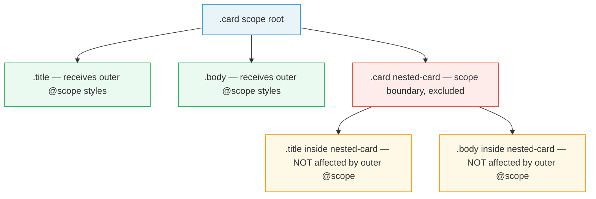

# [FEE-11200] CSS @scope — Scoped Styles Without Specificity Hacks

:::info
Write component-scoped CSS with zero build tools and zero JavaScript — `@scope` constrains your selectors to a DOM subtree so `.title` in one component never bleeds into another.
:::

:::info Baseline Newly Available
Supported in Chrome 118+, Firefox 128+, Safari 17.4+. Use progressive enhancement for older browsers.
:::

## Context

CSS operates in a single global namespace. Every selector you write competes with every other selector on the page. A rule like `.title { font-size: 1.25rem }` targets every element with class `title` everywhere — in your navigation, your card, your modal, your footer. This is not a bug; it is how CSS was designed. In 1996, pages were documents, not component trees.

The web platform gradually accumulated workarounds:

1. **BEM (Block Element Modifier)** — verbose class names act as namespaces: `.card__title`, `.nav__title`, `.modal__title`. No build step required, but the verbosity is painful and the convention is enforced only by team discipline.
2. **CSS Modules** — a bundler hashes class names at build time: `.title` becomes `.title_3xK9f`. Leakage is impossible, but DevTools shows hashed names that are hard to read, and the approach requires a JavaScript bundler.
3. **Shadow DOM** — the browser's native encapsulation primitive. Styles inside a shadow root are isolated by definition. But Shadow DOM requires Web Components, introduces slot projection complexity, and is overkill when you want to scope a `<div>`.
4. **Utility-class frameworks** — Tailwind and similar libraries avoid component naming altogether by composing low-level utilities. Scope is solved by not having shared class names, but every element ends up with a long string of utility tokens.

`@scope` is the CSS Working Group's native answer: a pure CSS at-rule that constrains selector matching to a subtree, requires no build step, and introduces a new cascade mechanism called **proximity specificity** that replaces specificity wars.

## Scenario

You are building a design system. The system has a `.card` component. Cards can be nested — a `.card` inside a `.card` is a legitimate pattern (a featured card containing a preview card). Both cards have a `.title` element.

The design requirement: the outer card's `.title` rule (`font-size: 1.25rem`) MUST NOT bleed into the inner card's `.title`. The inner card manages its own font sizing.

With global CSS, the ancestor selector `.card .title` still matches `.title` inside the inner card because the inner card is also a descendant of the outer `.card`. BEM would rename to `.card__title` — but the inner card also uses `.card__title`, so you are back to the same problem. CSS Modules would hash the names differently if they are in different files — but if the same component file renders both levels, you are back to the same problem.

`@scope (.card) to (.card)` — a donut scope — solves this with one declaration in pure CSS.

## Best Practices

- SHOULD use `@scope` to replace BEM naming conventions in new code. Meaningful semantic names (`.title`, `.body`, `.footer`) become safe inside a `@scope` block; no more `.card__title` prefixing.
- SHOULD use donut scope (`@scope (root) to (boundary)`) when building component systems where nested instances of the same component MUST NOT inherit outer scope styles.
- MUST NOT use `@scope` as a complete replacement for Shadow DOM. `@scope` only constrains CSS selector matching. It does not encapsulate JavaScript, custom element lifecycle callbacks, event listeners, or slot projection.
- SHOULD combine `@scope` with CSS custom properties for component theming. Declare theme variables on `:scope`; let child elements inherit them. This gives you component-local variable scope without Shadow DOM.
- SHOULD apply progressive enhancement. Wrap `@scope` blocks inside `@supports (selector(:scope))` so older browsers fall back to global selectors gracefully rather than receiving broken styles.
- SHOULD NOT rely on `@scope` proximity specificity to resolve conflicts between unrelated components sharing a selector name. Proximity is a tiebreaker within the same layer and specificity level; it is not a substitute for deliberate architecture.

## Design Thinking

### Why global CSS is hard

CSS has one specificity model and one namespace. Selector specificity (`0-1-0` for a class, `0-0-1` for an element) is computed globally. When two rules match the same element with the same specificity, the one that appears later in the source wins. This forces teams into an arms race: override a `.title` rule with `.card .title`, then override that with `.sidebar .card .title`, then `.page .sidebar .card .title`. Specificity only goes up.

The root cause: CSS selectors were designed to match elements in documents, not to be encapsulated inside components.

### How BEM solved it — and where it breaks

BEM escapes the namespace collision by embedding the component name in every class: `.card__title` cannot collide with `.nav__title` because they are different strings. The approach is reliable and requires no tooling. The cost is verbosity and convention enforcement: a developer who writes `.title` inside a `.card` context breaks the guarantee silently.

### How CSS Modules solved it — and its trade-offs

CSS Modules makes BEM-style uniqueness automatic by hashing class names at build time. The developer writes `.title`; the bundler outputs `.title_3xK9f`. Leakage is structurally impossible. The trade-offs: DevTools shows hashed names (debugging requires source maps or a browser extension), the approach is coupled to a JavaScript bundler, and switching frameworks means switching the CSS module toolchain.

### How Shadow DOM solved it — and when it is overkill

Shadow DOM provides browser-native style encapsulation. Styles defined in a shadow root do not leak out; external styles do not leak in (except inherited properties and custom properties). This is the strongest form of encapsulation. The cost: you must define a custom element, manage the shadow root lifecycle, and handle slot projection. For a `.card` that is purely a `<div>`, this is significant overhead.

### Why `@scope` is different

`@scope` is pure CSS. No build step, no JavaScript, no custom elements. The browser handles scope resolution as part of its native cascade computation. The `to` clause lets you define a "lower boundary" — descendants that match the boundary selector do not participate in the scope, creating a hole in the middle (the donut).

The key conceptual addition is **proximity specificity**: when two `@scope` rules with identical selectors and specificity both match an element, the rule whose scope root is closer in the DOM tree wins. This means nested components naturally take priority over their ancestors without specificity escalation.

## Visual

The following diagram shows how a donut scope works with nested `.card` components. The outer scope's styles apply to `.title` and `.body` inside the outer `.card`, but stop at the inner `.card` boundary.



The donut metaphor: the outer `.card` is the donut. The hole is the inner `.card`. Outer scope styles flow through the donut dough (`.title`, `.body` at the outer level) but not through the hole (anything inside the inner `.card`).

## Example

### Example 1 — The leakage problem and the `@scope` fix

Without `@scope`, a nested card inherits the outer card's `.title` rule because `.card .title` matches `.title` at any depth.

```html
<!DOCTYPE html>
<html lang="en">
<head>
  <meta charset="UTF-8" />
  <meta name="viewport" content="width=device-width, initial-scale=1.0" />
  <title>@scope — Leakage vs. Scoped</title>
  <style>
    body {
      font-family: system-ui, sans-serif;
      padding: 24px;
      display: flex;
      gap: 32px;
    }

    /* ── Shared card chrome ──────────────────────────────── */
    .card {
      border: 1px solid #ddd;
      border-radius: 8px;
      padding: 16px;
      background: #fff;
      max-width: 320px;
    }

    /* ── COLUMN A: Without @scope — leakage ─────────────── */
    .without-scope .card .title {
      font-size: 1.25rem;
      color: #1a1a2e;
      font-weight: 700;
    }

    /* ── COLUMN B: With @scope — contained ──────────────── */
    @supports (selector(:scope)) {
      @scope (.with-scope .card) to (.card) {
        .title {
          font-size: 1.25rem;
          color: #1a1a2e;
          font-weight: 700;
        }
      }
    }

    /* ── Inner card default title (smaller) ─────────────── */
    .inner-card .title {
      font-size: 0.875rem;
      color: #555;
      font-weight: 500;
    }
  </style>
</head>
<body>

  <!-- Column A: the outer rule bleeds into inner card -->
  <div class="without-scope">
    <h3 style="margin-top:0">Without @scope</h3>
    <div class="card">
      <h2 class="title">Outer Title (1.25rem)</h2>
      <p>Outer card content.</p>
      <div class="card inner-card">
        <h2 class="title">Inner Title — LEAKED to 1.25rem</h2>
        <p>Inner card content. The outer rule bleeds in.</p>
      </div>
    </div>
  </div>

  <!-- Column B: outer scope does not affect inner card title -->
  <div class="with-scope">
    <h3 style="margin-top:0">With @scope</h3>
    <div class="card">
      <h2 class="title">Outer Title (1.25rem)</h2>
      <p>Outer card content.</p>
      <div class="card inner-card">
        <h2 class="title">Inner Title — NOT affected (0.875rem)</h2>
        <p>Inner card content. Outer scope stops here.</p>
      </div>
    </div>
  </div>

</body>
</html>
```

In Column B, `@scope (.with-scope .card) to (.card)` creates a donut: styles apply inside any `.card` that is a descendant of `.with-scope`, but stop at the first nested `.card` boundary. The inner `.card`'s `.title` retains its own smaller size.

### Example 2 — Component theming with `:scope` and custom properties

`:scope` inside a `@scope` block refers to the scope root element. Use it to declare component-local custom properties that child elements inherit.

```html
<!DOCTYPE html>
<html lang="en">
<head>
  <meta charset="UTF-8" />
  <meta name="viewport" content="width=device-width, initial-scale=1.0" />
  <title>@scope — Component Theming</title>
  <style>
    body {
      font-family: system-ui, sans-serif;
      padding: 24px;
      display: flex;
      gap: 24px;
    }

    /* ── Base card chrome ────────────────────────────────── */
    .card {
      border-radius: 8px;
      padding: 20px;
      width: 260px;
      border: 2px solid var(--card-border, #ddd);
      background: var(--card-bg, #fff);
      color: var(--card-text, #111);
    }

    .card .title {
      font-size: 1rem;
      font-weight: 700;
      margin: 0 0 8px;
      color: var(--card-accent, #333);
    }

    .card .body {
      font-size: 0.875rem;
      margin: 0;
    }

    /* ── Default (neutral) theme via @scope + :scope ─────── */
    @scope (.card-neutral) {
      :scope {
        --card-bg: #f8f9fa;
        --card-border: #dee2e6;
        --card-text: #212529;
        --card-accent: #495057;
      }
    }

    /* ── Success theme ───────────────────────────────────── */
    @scope (.card-success) {
      :scope {
        --card-bg: #d1fae5;
        --card-border: #6ee7b7;
        --card-text: #065f46;
        --card-accent: #047857;
      }
    }

    /* ── Warning theme ───────────────────────────────────── */
    @scope (.card-warning) {
      :scope {
        --card-bg: #fef3c7;
        --card-border: #fcd34d;
        --card-text: #78350f;
        --card-accent: #b45309;
      }
    }
  </style>
</head>
<body>

  <div class="card card-neutral">
    <h2 class="title">Neutral Card</h2>
    <p class="body">Theme declared via @scope on :scope root.</p>
  </div>

  <div class="card card-success">
    <h2 class="title">Success Card</h2>
    <p class="body">Custom properties scoped to this instance only.</p>
  </div>

  <div class="card card-warning">
    <h2 class="title">Warning Card</h2>
    <p class="body">No JavaScript, no BEM modifier classes needed.</p>
  </div>

</body>
</html>
```

Each variant class applies a `@scope` block that sets custom properties on `:scope` (the card element itself). All child elements inherit those variables. The `.card`, `.title`, and `.body` rules remain clean and generic — themes are entirely additive.

## Deep Dive

### Proximity specificity

Proximity specificity is the cascade mechanism that `@scope` adds. It acts as a tiebreaker after layer order and before specificity.

Consider two overlapping scopes:

```css
/* Scope A — wraps the whole page */
@scope (.page) {
  p { color: red; }
}

/* Scope B — wraps a section */
@scope (.section) {
  p { color: blue; }
}
```

```html
<div class="page">
  <div class="section">
    <p>What color am I?</p>
  </div>
</div>
```

Both rules match `<p>` with identical specificity (`0-0-1`). In a world without `@scope`, the later rule wins — `color: blue`. With `@scope`, the browser computes the distance (in ancestor steps) from `<p>` to each scope root. `.section` is one step away; `.page` is two steps away. `.section` wins because it is **closer**, so `color: blue` applies regardless of source order.

This means component styles naturally win over page-level defaults without any specificity escalation — you do not need `.page .section p` to override `.page p`.

### `@scope` inside a `<style>` tag — implicit scope

When `@scope` is written without a scope root, `:scope` refers to the element that contains the `<style>` tag:

```html
<div class="card">
  <style>
    @scope {
      .title { font-size: 1.25rem; }
    }
  </style>
  <h2 class="title">Card Title</h2>
</div>
```

This is an **implicit scope**. The `<style>` element's parent (`.card`) becomes the scope root automatically. This pattern is particularly useful for HTML templates and server-rendered component partials where you want to co-locate styles with markup without a build step. Note: this is not the same as Declarative Shadow DOM — the styles are not encapsulated from the outside world, only scoped in selector matching.

### `@scope` and `@layer` composition

`@scope` and `@layer` are orthogonal cascade mechanisms that compose independently:

```css
@layer components {
  @scope (.card) {
    .title { font-size: 1.25rem; }
  }
}

@layer overrides {
  @scope (.card) {
    .title { font-size: 1.5rem; }
  }
}
```

Layer order resolves first (`overrides` beats `components`). Within the same layer, proximity specificity resolves next. Within the same layer and same proximity, standard specificity resolves. Source order is the final tiebreaker. The two mechanisms do not conflict; they occupy different positions in the cascade.

### The donut scope lower boundary is exclusive

An important subtlety: the lower boundary (the `to` clause) is **exclusive**. The element matching the boundary selector is excluded from the scope, but its ancestors between the root and the boundary are included.

```css
@scope (.article) to (aside) {
  p { color: #333; }
}
```

```html
<article class="article">
  <p>Included — inside scope</p>        <!-- styled -->
  <aside>
    <p>Excluded — inside boundary</p>   <!-- NOT styled -->
  </aside>
</article>
```

The `<aside>` element itself and everything inside it are outside the scope. The `<p>` before the `<aside>` is inside the scope. This asymmetry is intentional: you declare "style up to but not including these nested components."

### Progressive enhancement pattern

```css
/* Default styles for all browsers */
.card .title {
  font-size: 1.25rem;
  font-weight: 700;
}

/* Enhanced with @scope where supported */
@supports (selector(:scope)) {
  /* Remove the leaky rule */
  .card .title {
    font-size: unset;
    font-weight: unset;
  }

  @scope (.card) to (.card) {
    .title {
      font-size: 1.25rem;
      font-weight: 700;
    }
  }
}
```

Browsers that do not support `@scope` receive the global `.card .title` rule. Browsers that do support `@scope` apply the scoped version, which avoids leakage.

## Browser Support

| Browser | First version | Notes |
|---------|--------------|-------|
| Chrome  | 118          | Full support including donut scope |
| Firefox | 128          | Full support |
| Safari  | 17.4         | Full support |
| Edge    | 118          | Chromium-based |

Feature detection in CSS:

```css
@supports (selector(:scope)) {
  /* @scope is supported */
}
```

Feature detection in JavaScript:

```js
const supportsScope = CSS.supports('selector(:scope)');
```

As of 2026, `@scope` is Baseline Newly Available. It has reached broad support across the current versions of all major browsers. Use progressive enhancement (the `@supports` pattern above) when you need to support older browser versions in long-term maintenance projects.

## Internal References

- [FEE-11201 @property](../CSS%20Houdini/11201.md) — `@property` and `@scope` compose well for component theming: declare typed custom properties with `@property`, then scope their initial values to `:scope` inside a `@scope` block for fully typed, component-local theming variables.
- [FEE-11002 Container Queries](./11002.md) — Both `@scope` and Container Queries address the component-scoped styling problem from different angles. Container Queries scope *which styles apply* based on the container's size; `@scope` scopes *which elements selectors match* based on DOM ancestry. They are complementary: use Container Queries for responsive layout adaptation, use `@scope` to prevent selector bleed between instances.

## References

- [@scope — MDN Web Docs](https://developer.mozilla.org/en-US/docs/Web/CSS/@scope)
- [Limit the reach of your selectors with the CSS @scope at-rule — Chrome for Developers](https://developer.chrome.com/docs/css-ui/at-scope)
- [CSS Cascading and Inheritance Level 6 — W3C](https://www.w3.org/TR/css-cascade-6/#scoped-styles)
- [CSS @scope — web.dev](https://web.dev/articles/at-scope)
