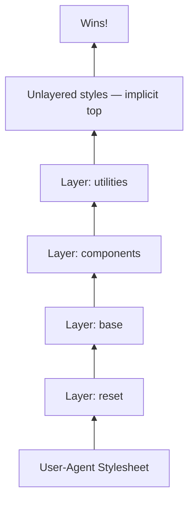

# [FEE-11203] CSS @layer — Cascade Layers

:::info
Take control of which CSS wins by declaring which layer of rules outranks which other layer. Layer order beats selector specificity: a rule in a higher-priority layer wins even when its selector is weaker.
:::

:::tip Baseline
This feature is Baseline Widely Available. Supported in Chrome 99+, Firefox 97+, Safari 15.4+.
:::

## Context

For the first quarter-century of CSS, developers had exactly one tool to decide which rule wins: specificity. A rule with a higher-specificity selector overrides a rule with a lower-specificity selector. If that is not the result you want, you escalate: you add another class, you wrap the selector in an ID, you reach for `!important`.

This worked well when CSS was written by one person for one document. It breaks down in large codebases with multiple contributors, multiple sources of CSS (design systems, third-party resets, legacy code, utility frameworks), and rules written years apart by people who did not know each other's code.

The root of the problem is that all author styles live in a single undifferentiated "author layer" in the CSS cascade: every `<link>` tag and every `<style>` block you write competes in the same pool. You cannot declare "these rules are framework rules" or "these rules are overrides" in a way that the browser respects. You can only compete on selector weight.

CSS Cascade Layers, defined in CSS Cascading and Inheritance Level 5, add a new axis to the cascade above specificity. You declare a set of named layers and assign rules to them. Within the author origin, layer order determines priority: rules in a higher-priority layer win over rules in a lower-priority layer regardless of selector specificity.

Consider a design system being integrated into a legacy enterprise application. The design system provides a `.button` component class, but the legacy application has accumulated years of stylesheet debt, including selectors like `#sidebar .button` and `#app .button.button--primary`. Every time the design system renders a button in the sidebar, the legacy stylesheet wins: `#sidebar .button` has specificity `(1,1,0)`, one ID and one class, while the design system's `.button` has specificity `(0,1,0)`, so the design system's styles are silently overridden.

The traditional fix is to escalate the design system's selectors to match or beat the legacy specificity: add an ID wrapper, repeat the class, add `!important` to every property. Each of these fixes increases the specificity debt and makes the next conflict harder to resolve. `@layer` solves this by ranking rule groups instead of individual selectors. The Example section works this through in full (see Legacy integration).

## Visual

Layer priority stack for normal (non-`!important`) rules. Higher in the diagram means higher priority:



The declaration that sets this order is a single line at the top of your stylesheet:

```css
@layer reset, base, components, utilities;
```

Rules in `utilities` beat rules in `components`. Rules in `components` beat rules in `base`. Unlayered rules beat everything. Within each layer, specificity and source order apply normally.

For `!important` rules, the priority stack is reversed: `!important` in `reset` beats `!important` in `utilities`.

## Example

### Three-layer setup: layer priority overrides specificity

This example demonstrates the core claim: layer priority overrides selector specificity. A low-specificity utility class in the `utilities` layer beats a high-specificity selector in the `components` layer.

```css
@layer reset, components, utilities;

@layer reset {
  *, *::before, *::after { box-sizing: border-box; margin: 0; }
  button { all: unset; }
}

@layer components {
  #app .button.button--primary {
    background: #0070f3;
    color: white;
    padding: 0.5rem 1rem;
    border-radius: 4px;
  }
}

@layer utilities {
  .bg-red { background: red; }
}
```

```html
<div id="app">
  <button class="button button--primary bg-red">Submit</button>
</div>
<!-- Result: red button — utilities layer beats components layer
     even though #app .button.button--primary has much higher specificity -->
```

The selector `#app .button.button--primary` has specificity `(1,2,0)`. The selector `.bg-red` has specificity `(0,1,0)`. Under the old model, `.bg-red` would lose badly. Under `@layer`, `.bg-red` wins because `utilities` is declared after `components`.

### Importing a third-party reset into a named layer

```css
@layer reset, base, components, utilities;

/* Assign the entire normalize.css to the reset layer */
@import url("https://cdnjs.cloudflare.com/ajax/libs/normalize/8.0.1/normalize.min.css") layer(reset);

@layer base {
  body {
    font-family: system-ui, sans-serif;
    line-height: 1.6;
    color: #333;
  }
  h1, h2, h3 { line-height: 1.2; }
}

@layer components {
  .card {
    background: white;
    border: 1px solid #e5e7eb;
    border-radius: 8px;
    padding: 1.5rem;
    box-shadow: 0 1px 3px rgba(0, 0, 0, 0.1);
  }

  .card__title {
    font-size: 1.25rem;
    font-weight: 700;
    margin-bottom: 0.5rem;
  }
}

@layer utilities {
  .mt-0 { margin-top: 0 !important; }
  .text-center { text-align: center; }
  .hidden { display: none; }
}
```

The `@import url() layer()` syntax layers the entire external stylesheet without modifying it. Any rule from normalize.css lives in the `reset` layer, the lowest layer in the stack, so your own styles always win.

### Legacy integration: design system over legacy selectors

This continues the design-system-into-legacy-app example introduced in Context, now implemented with `@layer`.

```css
/* Declare layer order: design system rules beat legacy rules */
@layer legacy, design-system;

/* Legacy stylesheet — high-specificity selectors */
@layer legacy {
  #sidebar .button {
    background: #888;
    color: white;
    border: none;
    padding: 6px 12px;
  }

  #app .button.button--primary {
    background: navy;
    font-weight: bold;
  }
}

/* Design system — clean, low-specificity selectors */
@layer design-system {
  .button {
    display: inline-flex;
    align-items: center;
    padding: 0.5rem 1rem;
    border-radius: 4px;
    font-weight: 600;
    cursor: pointer;
    background: #0070f3;
    color: white;
    border: none;
  }

  .button:hover {
    background: #0051a8;
  }
}
```

```html
<!-- In the sidebar: design-system .button wins over legacy #sidebar .button -->
<div id="sidebar">
  <button class="button">Filter</button>
</div>

<!-- Even here: design-system .button wins over legacy #app .button.button--primary -->
<div id="app">
  <button class="button button--primary">Submit</button>
</div>
```

The design system's `.button` rule wins in every context because `design-system` is declared after `legacy`; selector weight plays no role once two rules are in different layers. The legacy stylesheet was not modified: the fix lives entirely in the `@layer` declaration order.

### Unlayered styles as an escape hatch

```css
@layer reset, base, components, utilities;

@layer components {
  .modal {
    display: none;
    position: fixed;
    inset: 0;
    background: rgba(0, 0, 0, 0.5);
  }
}

/* Unlayered: beats every layered normal rule */
.modal--open {
  display: flex;
  align-items: center;
  justify-content: center;
}
```

The `.modal--open` class is unlayered. It beats `.modal` from `@layer components` even though `.modal` was defined there. Use unlayered styles intentionally: they are the escape hatch for cases where you need a rule to win over every layered normal rule.

### Combining `@layer` with CSS nesting

Nesting composes naturally inside a layer block.

```css
@layer reset, components, utilities;

@layer components {
  .button {
    display: inline-flex;
    align-items: center;
    gap: 0.5rem;
    padding: 0.5rem 1rem;
    border-radius: 4px;
    font-weight: 600;
    background: #0070f3;
    color: white;
    border: none;
    cursor: pointer;

    &:hover { background: #0051a8; }
    &:focus-visible { outline: 3px solid #0070f3; outline-offset: 2px; }
    &[disabled] { opacity: 0.5; cursor: not-allowed; }

    &.button--secondary {
      background: transparent;
      border: 2px solid #0070f3;
      color: #0070f3;
      &:hover { background: #e6f0ff; }
    }
  }
}

@layer utilities {
  .bg-transparent { background: transparent !important; }
}
```

The entire nested component lives inside `@layer components`. The structure, specificity, and layer membership are all explicit.

## Best Practices

- MUST declare the layer order at the top of your stylesheet, before any `@layer` block that assigns rules. The first `@layer <names>` declaration sets the priority order permanently; a later re-declaration of the same names does not change priority.
- SHOULD layer third-party and vendor resets at the lowest layer (e.g., `reset`), component rules in the middle, and utility overrides at the top. A typical order is `@layer reset, base, components, utilities`.
- SHOULD NOT put all your styles in layers without a deliberate strategy. Unlayered styles (styles not inside any `@layer` block) are treated as the implicit highest-priority layer for normal declarations, so an unlayered normal rule beats every layered normal rule. This does not hold for `!important`: a layered `!important` declaration still beats an unlayered `!important` declaration, so a utility-layer `!important` rule (like the ones in this article's own examples) can silently override an unlayered rule you expected to win unconditionally.
- MAY use `@import url() layer()` to assign an entire third-party stylesheet to a named layer without modifying the file. This is the correct way to layer normalize.css, reset.css, or other vendored resets.
- SHOULD NOT use anonymous layers (`@layer { ... }`) unless you intentionally want a layer that cannot be appended to. Anonymous layers have no name and cannot be targeted by subsequent `@layer` blocks; once declared, the rules in them are fixed.
- MAY combine `@layer` with `@scope` and CSS nesting. All three compose naturally; a nested component block inside a `@layer` block is valid and common.

## Design Thinking

### Why specificity was the only cascade control for 25 years

CSS was designed as a document stylesheet language. The original cascade model ordered rules by origin: user-agent styles, user styles, and author styles, with specificity as the tiebreaker within each origin. That model was appropriate for a world where a single author wrote a single stylesheet for a single document.

The author origin was never subdivided. Every author style, whether from your first `<link>` tag, your last `<style>` block, or an inline `style` attribute, competed in the same flat pool. There was no mechanism to say "these rules are lower priority within my own code." The only levers were selector weight and source order.

As the web grew into an application platform, this flat model created a recurring class of bugs. A legacy rule silently overrides a new rule whose author never saw the legacy selector, so a change that looks correct in isolation has no visible effect in the browser. Every large CSS codebase eventually develops specificity debt: an increasing arms race of heavier selectors and `!important` declarations applied as bandages.

The CSS Working Group recognized this problem in the early 2010s. Various proposals for "cascade control" were discussed. The `@layer` mechanism, which assigns named layers an explicit priority order, was specified in CSS Cascading and Inheritance Level 5, with stable browser implementations arriving in 2022.

### How the `!important` escalation pattern developed

In a flat author layer, `!important` is the nuclear option. A declaration marked `!important` wins over all normal declarations, regardless of specificity or source order. It exists to allow user stylesheets (accessibility overrides, high-contrast modes) to override author stylesheets, a legitimate use case in the original cascade model.

In practice, developers discovered that `!important` was also an escape hatch for specificity conflicts. Rather than refactoring a high-specificity selector, you could add `!important` to the rule you wanted to win. This worked until someone added `!important` to the competing rule. Then both rules had `!important`, and specificity tiebreaking resumed among them. The arms race continued one level up.

Large CSS codebases end up with stylesheets that are heavily `!important`-annotated, where the actual cascade priority is determined by who applied `!important` to what and in what order. Understanding why a given style applies requires tracing source order, specificity, and `!important` annotations simultaneously.

`@layer` does not make `!important` obsolete, but it changes how `!important` interacts with layers. For `!important` rules, the layer priority is reversed: `!important` rules in earlier (lower-priority) layers beat `!important` rules in later (higher-priority) layers. This mirrors how the broader cascade already reverses priority for `!important` rules between origins (user-agent, user, and author). Understanding this reversal is essential for codebases that mix layers and `!important`.

### The mental model shift: from weight to order

The key mental model change that `@layer` requires is moving from "which rule has the heavier selector" to "which layer wins, then which rule has the heavier selector within that layer."

In the old model, you reason about specificity globally. A rule anywhere in your codebase with `(1,2,0)` specificity beats a rule with `(0,3,0)` specificity, regardless of what file either rule is in.

In the layered model, you reason about layers first. If rule A is in layer `utilities` and rule B is in layer `components`, and `utilities` is declared after `components`, then rule A wins regardless of specificity; selector weight is not consulted until two rules land in the same layer.

This is a more powerful model, but it requires discipline at the architecture level. The layer declaration order at the top of your stylesheet is a load-bearing architectural decision. Changing it changes which rules win across your entire codebase.

The payoff is that each layer becomes a self-contained specificity domain. Inside `@layer components`, you no longer need to worry about specificity escalation from outside the layer. You can write clean, low-specificity selectors in your design system, knowing that the layer boundary protects them from legacy high-specificity selectors in a different layer.

## Deep Dive

### `revert-layer`: undoing a layer's declarations

CSS Cascading and Inheritance Level 5 also defines `revert-layer`, a CSS-wide keyword that rolls a property back to the value it would have had in the previous cascade layer within the author origin. Use it when a higher-priority layer needs to opt a single property out of its own override without deleting the rule:

```css
@layer base, special;

@layer base {
  .feature { color: green; }
}

@layer special {
  .feature { color: revert-layer; } /* falls back to green, the base-layer value */
}
```

If there is no earlier layer to revert to, the property falls back further, to the value it would have had with no author rule applied at all. `revert-layer` has been available across all major browsers since March 2022, the same rollout window as `@layer` itself, and is now Baseline Widely Available.

### Nested layers and the `parent.child` shorthand

Layers can nest, which is how frameworks expose sub-layers as extension points:

```css
@layer framework {
  @layer components {
    .button { color: blue; }
  }
}
```

This is equivalent to the flat dot-notation form:

```css
@layer framework.components {
  .button { color: blue; }
}
```

Nested layer priority resolves the parent order first, then the child order within that parent. A layer nested inside a lower-priority parent loses to every layer nested inside a higher-priority parent, no matter where it sits among its own siblings.

## Browser Support

| Browser | First version | Notes |
|---------|--------------|-------|
| Chrome  | 99           | Stable release March 2022 |
| Firefox | 97           | Stable release February 2022 |
| Safari  | 15.4         | Stable release March 2022 |
| Edge    | 99           | Chromium-based; ships with Chrome |

All four major browsers shipped `@layer` support within a two-month window in early 2022. As of 2026, this is Baseline Widely Available with no polyfill required for modern browser targets.

Feature detection: `@supports at-rule(@layer)` shipped in Chromium 148 (stable May 2026) and is available in Edge 148, but it is not yet supported in Firefox or Safari. Until then, checking the `CSSLayerBlockRule` or `CSSLayerStatementRule` interfaces in JavaScript remains the portable, cross-browser option:

```js
const supportsLayers = typeof CSSLayerBlockRule !== 'undefined';
```

Alternatively, rely on the Baseline Widely Available designation: if your browserslist excludes Chrome < 99, Firefox < 97, and Safari < 15.4, you can use `@layer` without a feature check.

### `@layer` in the wild: Tailwind CSS v4

Tailwind CSS v4 (released January 2025) generates its utility CSS inside native cascade layers: `@layer theme, base, components, utilities;`. Because those utilities live in a named layer, the unlayered-styles rule from Best Practices applies directly: any unlayered CSS now overrides Tailwind utilities that it previously lost to on specificity alone, whether it comes from a component library's stylesheet, a copy-pasted snippet, or a `<style>` block outside a `@layer` block. If you need a customization to consistently beat Tailwind's utilities, leaving it unlayered is what makes that guarantee hold under v4.

### `@layer` with PostCSS

The `@csstools/postcss-cascade-layers` plugin transpiles `@layer` syntax for browsers that do not support it natively. As of 2026, this is unnecessary for modern browser targets. The plugin is useful only if you need to support Chrome 98 and below or Firefox 96 and below.

## Related Topics

- [FEE-11200 CSS @scope](./11200.md): `@scope` and `@layer` are complementary tools. Use `@scope` to constrain which elements a component's selectors match; use `@layer` to control which layer's rules win when two layers target the same element.
- [FEE-11202 CSS Nesting](./11202.md): Nesting and `@layer` compose naturally. Place a nested component block inside a `@layer` block to get both authoring clarity and cascade priority control in one structure.

## References

- [Cascade layers — MDN Web Docs](https://developer.mozilla.org/en-US/docs/Learn_web_development/Core/Styling_basics/Cascade_layers)
- [@layer — MDN Web Docs](https://developer.mozilla.org/en-US/docs/Web/CSS/@layer)
- [revert-layer — MDN Web Docs](https://developer.mozilla.org/en-US/docs/Web/CSS/revert-layer)
- [Una Kravets, "Cascade layers are coming to your browser" — Chrome for Developers](https://developer.chrome.com/blog/cascade-layers)
- [CSS Cascading and Inheritance Level 5 — W3C](https://www.w3.org/TR/css-cascade-5/)
- [CSS @layer — Can I use](https://caniuse.com/css-cascade-layers)
- [Stephanie Eckles, "Getting Started With CSS Cascade Layers" — Smashing Magazine](https://www.smashingmagazine.com/2022/01/introduction-css-cascade-layers/)
- [Miriam Suzanne, "Cascade Layers Guide" — CSS-Tricks](https://css-tricks.com/css-cascade-layers/)
- [Tailwind CSS v4.0 — Tailwind Labs](https://tailwindcss.com/blog/tailwindcss-v4)
