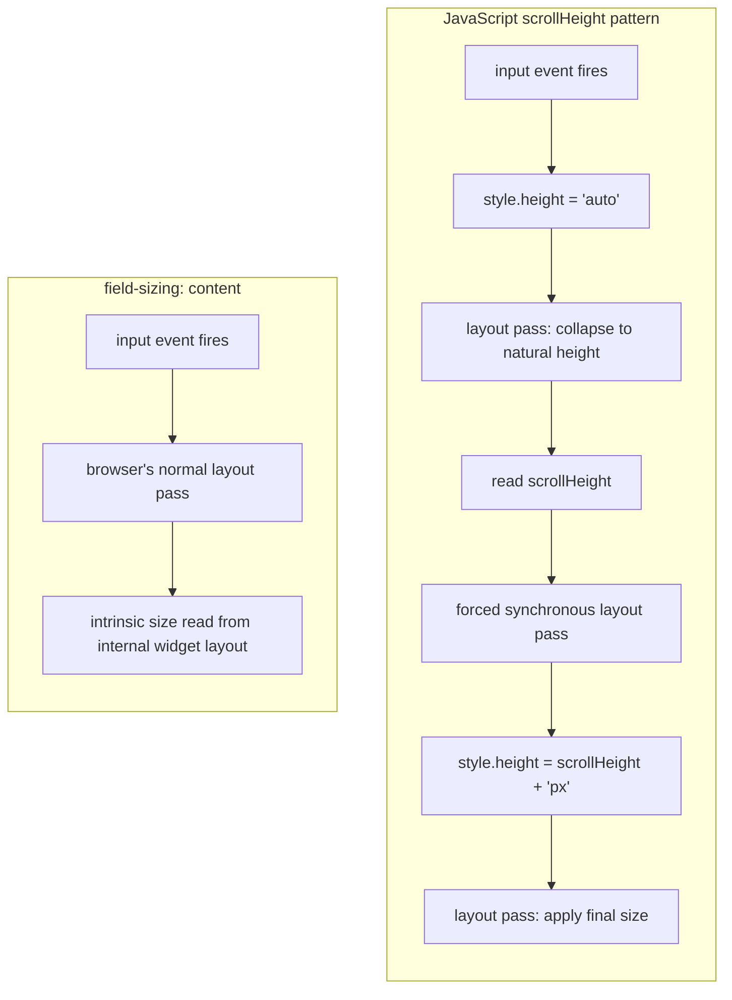

# [FEE-11301] field-sizing — Self-Sizing Form Controls

:::info
One CSS property, `field-sizing: content`, replaces the JavaScript textarea auto-grow pattern entirely. Form controls expand and shrink to fit their content with no event listeners and no layout thrash.
:::

:::info Baseline Newly Available
`field-sizing` reached Baseline Newly Available on 2026-06-16: Chrome 123+, Edge 123+, Safari 26.2+, and Firefox 152+ all ship support. Widely Available status (support across the last 2.5 years of browser versions) is projected for 2028-12-16; teams still supporting older browser versions should keep a fallback.
:::

## Context

Form controls occupy a peculiar position in CSS. Most elements on the page participate in the browser's intrinsic sizing model: a `<div>` wraps its children, a `<p>` stretches to fill its container, an `` defaults to its natural dimensions. Form controls do not.

`<textarea>` and `<input>` are **replaced elements** under the CSS specification: CSS treats them as an opaque box with a size, not as something whose size it can compute from content. Browsers originally reinforced that opacity by delegating form-control rendering to the operating system's native widget toolkit. Modern engines such as Blink and Gecko render their own form controls instead of handing off to the OS, but the replaced-element sizing model never changed. Until `field-sizing`, CSS still had no way to size a `<textarea>` or `<input>` from its own text content, the way it can size a `<div>` from its children.

The practical result: both elements have fixed default dimensions.

- `<textarea>` defaults to 2 rows × 20 columns (approximately), controlled by the `rows` and `cols` HTML attributes.
- `<input type="text">` defaults to 20 characters wide, controlled by the `size` attribute.

Neither element has any built-in mechanism to grow as the user types. Developers have been solving this with JavaScript for over fifteen years, most visibly through libraries like `react-textarea-autosize`.

### The JavaScript scrollHeight approach

The canonical approach for auto-growing textareas, documented on virtually every frontend reference site, involves three steps:

```js
textarea.addEventListener('input', () => {
  textarea.style.height = 'auto';      // step 1: collapse to natural height
  textarea.style.height = textarea.scrollHeight + 'px';  // step 2: expand to fit
});
```

**Step 1 is the problematic part.** Setting `height: auto` causes the browser to perform a layout pass to determine the natural height. Reading `scrollHeight` immediately after forces a second layout pass, a synchronous style and layout recalculation that blocks the main thread. This is commonly called a "forced reflow" or "layout thrash." On every keystroke.

On a modern machine with a single simple textarea, the cost is negligible. In a document with many auto-growing textareas rendered at once, for example a block-based editor where each block is its own field, the cumulative cost is measurable and creates jank: any solution that re-measures every field on every keystroke pays a forced-reflow cost that scales with the number of fields on the page.

### The shadow DOM clone technique

A more reliable but heavier approach creates a hidden "shadow" clone of the textarea:

```js
const mirror = document.createElement('textarea');
// copy all computed styles from the real textarea
// copy the same content
// append mirror to DOM (visibility: hidden)
// read mirror.scrollHeight
// set real textarea height
```

This approach avoids the forced reflow on the real element by reading from the hidden clone. The tradeoff: double the DOM nodes, requires style synchronization on every update, and breaks when font loading is async or when the container dimensions change. `react-textarea-autosize` is built on this technique: it maintains a hidden mirror `<textarea>` and reads that mirror's `scrollHeight` rather than toggling `height: auto` on the visible field. That sidesteps the double-layout-pass problem above, but reading `scrollHeight` from the mirror still forces a synchronous layout flush, so in a document with many auto-growing fields the library still re-measures every field on every keystroke, and the reflow cost still scales with the number of fields on the page.

### Why the JS solutions are architectural debt

Both solutions share the same root problem: they are working around the fact that CSS cannot observe form control content size. Every solution that reads `scrollHeight` is doing a layout measurement that the browser already performed internally; it is re-computing a value the browser knows but does not expose.

`field-sizing: content` exposes it.

### What a chat composer needs

Consider a chat interface where the message composer is a `<textarea>` that should:

- Start at exactly one line height, not two rows and not a fixed pixel size.
- Expand as the user types, adding lines naturally.
- Stop growing at five lines and become scrollable beyond that.
- Shrink back when the user deletes content.
- Require no JavaScript for the resize behavior.

Before `field-sizing`, meeting all five requirements at once meant JavaScript: either the `scrollHeight` pattern above or the shadow DOM clone technique. `field-sizing: content` meets all five in CSS alone. The Visual section below contrasts the two approaches; the Example section builds this composer end to end.

## Visual

The two approaches reach the same visible result, an auto-growing textarea, through different paths. The JavaScript pattern reads a measurement the browser already computed internally and writes it back as an explicit height, forcing an extra synchronous layout pass. `field-sizing: content` lets the layout engine use that internal measurement directly, inside its normal layout pass.



## Example

### Chat message composer

A chat input that starts at one line, grows to a maximum of five lines (7.5em with 1.5 line-height), and scrolls beyond that.

```html
<form class="chat-form">
  <textarea
    class="chat-input"
    placeholder="Type a message…"
    rows="1"
  ></textarea>
  <button type="submit" class="chat-send">Send</button>
</form>
```

```css
.chat-form {
  display: flex;
  align-items: flex-end;
  gap: 0.5rem;
  padding: 0.75rem;
  border: 1px solid #ccc;
  border-radius: 8px;
  background: #fff;
}

.chat-input {
  flex: 1;
  resize: none;
  border: none;
  outline: none;
  font: inherit;
  line-height: 1.5;
  padding: 0.25rem 0;
  overflow-wrap: break-word;
}

.chat-send {
  flex-shrink: 0;
  padding: 0.5rem 1rem;
  border-radius: 6px;
  border: none;
  background: #0066cc;
  color: white;
  font: inherit;
  cursor: pointer;
}

/* --- Progressive enhancement: field-sizing supported --- */
@supports (field-sizing: content) {
  .chat-input {
    field-sizing: content;
    min-height: 1.5em;   /* one line: never collapse to zero */
    max-height: 7.5em;   /* five lines: cap growth */
    overflow-y: auto;    /* scroll when content exceeds max-height */
  }
}

/* --- Fallback: field-sizing not supported --- */
@supports not (field-sizing: content) {
  .chat-input {
    height: 1.5em;       /* fixed single-line start height */
    overflow-y: hidden;  /* hide scrollbar until JS kicks in */
  }
}
```

```js
// Fallback JS for browsers below the Baseline versions
// (Chrome/Edge < 123, Safari < 26.2, Firefox < 152).
// Teams whose support matrix already excludes those versions can drop this block.
if (!CSS.supports('field-sizing', 'content')) {
  const textarea = document.querySelector('.chat-input');

  textarea.addEventListener('input', () => {
    textarea.style.height = 'auto';
    const maxHeight = parseFloat(getComputedStyle(textarea).fontSize) * 7.5;
    textarea.style.height = Math.min(textarea.scrollHeight, maxHeight) + 'px';
    textarea.style.overflowY = textarea.scrollHeight > maxHeight ? 'auto' : 'hidden';
  });
}
```

**What this gives you:**

- In Chrome/Edge 123+, Safari 26.2+, and Firefox 152+: pure CSS auto-grow, no JavaScript for the resize behavior.
- On older browser versions: the JavaScript fallback activates automatically, providing the same UX.
- In both cases: starts at one line, caps at five, scrolls beyond that.

### Inline edit input

A compact pattern for inline editing: a text input that wraps its label precisely, no extra whitespace.

```html
<label class="inline-edit">
  <span>Project name:</span>
  <input type="text" class="inline-edit-input" value="My Project" />
</label>
```

```css
.inline-edit {
  display: inline-flex;
  align-items: center;
  gap: 0.5rem;
  border-bottom: 1px solid #ccc;
  padding-bottom: 2px;
}

.inline-edit-input {
  border: none;
  outline: none;
  font: inherit;
  background: transparent;
  min-width: 4ch;          /* never narrower than 4 characters */
  max-width: 30ch;         /* never wider than 30 characters */
}

@supports (field-sizing: content) {
  .inline-edit-input {
    field-sizing: content;
  }
}
```

The input grows as the user types up to 30 characters wide, then clips. Without `field-sizing`, this pattern requires a hidden `<span>` that mirrors the input value to measure the text width.

### Select that tracks selected option

```html
<label>
  Sort by:
  <select class="compact-select">
    <option>Name</option>
    <option>Date</option>
    <option>Most recently modified</option>
    <option>Size</option>
  </select>
</label>
```

```css
@supports (field-sizing: content) {
  .compact-select {
    field-sizing: content;
  }
}
```

The select box width changes as the user selects different options. "Name" produces a narrow select; "Most recently modified" produces a wider one.

## Best Practices

- MUST pair `field-sizing: content` with `min-height` on any `<textarea>`. Without `min-height`, an empty textarea collapses to zero height, making it invisible and unusable.
- MUST pair `field-sizing: content` with `max-height` on any `<textarea>` where unbounded growth would break the layout. Without `max-height`, the textarea expands indefinitely as the user types.
- SHOULD provide a fallback with `@supports not (field-sizing: content)` for users on pre-Baseline browser versions (Chrome/Edge below 123, Safari below 26.2, Firefox below 152). A fixed `height` or a JS-based `scrollHeight` adjustment in the `not` branch keeps the control usable on those versions; drop the branch once your support matrix excludes them.
- SHOULD set `overflow-y: auto` alongside `max-height`. When the content exceeds `max-height`, the textarea should scroll rather than clip content invisibly.
- MAY apply `field-sizing: content` to `<input type="text">` for compact tag-input or inline-edit UI patterns where the input should wrap its text precisely rather than maintain a fixed width.
- SHOULD test with long unbroken strings (e.g., a URL with no spaces): add `overflow-wrap: break-word` or `word-break: break-all` to prevent the control from overflowing its container horizontally.
- SHOULD NOT use `field-sizing: content` on `<input type="number">` or other typed inputs where unexpected width changes on every keystroke would create disorienting layout shifts.
- SHOULD NOT remove `resize: none` from textareas that use `field-sizing: content`. The browser's default drag-handle resizer interacts poorly with content-driven sizing; users dragging the handle and then typing will see conflicting behaviors.

## Design Thinking

### Why form controls are replaced elements

HTML form controls predate CSS. When browsers first implemented `<input>` and `<textarea>`, they delegated rendering entirely to the operating system's native widget toolkit: Win32 EDIT controls on Windows, NSTextField on macOS, GTK2 widgets on Linux. This was correct for the time: it gave form controls consistent appearance with native applications and free accessibility support from the OS.

The cost was isolation from CSS layout. A replaced element tells CSS: "I have a size; ask me for it." It does not tell CSS: "here is how to compute my size from my content." The intrinsic sizing model that CSS uses for text nodes, flex items, and grid items simply does not apply. CSS can set an explicit `width` or `height` on a textarea; CSS cannot ask the textarea to compute its own size from content.

This is why every auto-grow solution before `field-sizing` required JavaScript. JavaScript can read `scrollHeight`, a property that exposes the internal layout measurement, then write it back as an explicit `height`. It is a read-measure-write loop that bridges the gap CSS could not bridge.

### How the scrollHeight approach forces two layout passes

When you type a character in a textarea:

1. The browser processes the input event.
2. The textarea's internal layout engine computes the new scrollable height.
3. If a JavaScript `input` listener runs `element.style.height = 'auto'`, the browser schedules a style recalculation.
4. If the listener then reads `element.scrollHeight` before the next paint, the browser must flush the pending style and layout calculations synchronously to return a valid measurement.
5. The listener writes the measured value back as an explicit height.
6. The browser schedules another layout pass for the new explicit height.
7. The browser paints.

Steps 4-6 are a forced synchronous layout, the same forced reflow described earlier: two full layout passes inside a single event handler, back to back, that the browser cannot batch. One layout pass would suffice; the read-then-write pattern makes the browser perform two.

For a single textarea in a simple document, this is fast enough to be imperceptible. In a document with many auto-growing textareas at once, such as the block-based editor scenario described earlier, or on a low-powered mobile device, the cumulative cost is visible.

### Why field-sizing: content is architecturally better

`field-sizing: content` moves the sizing decision from JavaScript into the CSS layout engine itself. Instead of "measure in JS, write back as explicit height," the model becomes: this element participates in intrinsic sizing like any other element.

The browser already knows the textarea's content size: it computes that size as part of its internal widget layout. `field-sizing: content` is an instruction to the layout engine to use that internal measurement as the intrinsic size for CSS layout purposes, rather than using the fixed default.

Consequences:

- **No event listeners**: the textarea grows on every keystroke without any JavaScript wiring.
- **No forced reflow**: the sizing happens in the normal layout pass, not as a synchronous read-write cycle.
- **No extra DOM nodes**: no hidden clone, no mirror element.
- **Works with CSS constraints**: `min-height`, `max-height`, `min-width`, `max-width` all apply normally, just as they do for any intrinsically sized element.
- **Works with animations**: because the height is now a CSS value, it can be transitioned with CSS transitions or animated with `@keyframes`. The JS approach cannot easily animate the height change.

### The intrinsic sizing model

CSS defines three ways an element can determine its size:

1. **Explicit sizing**: the author sets `width` or `height` directly.
2. **Intrinsic sizing**: the element computes its size from its content (text nodes, children).
3. **Extrinsic sizing**: the element stretches or shrinks to fill its containing block.

Before `field-sizing`, form controls only participated in explicit and extrinsic sizing. `field-sizing: content` adds intrinsic sizing: the element reports a preferred size computed from its content, which CSS layout can then use as the basis for further constraint application.

This is the same mechanism that makes `width: max-content` work on a `<div>`: the element reports its maximum intrinsic width and CSS uses it. `field-sizing: content` gives form controls the same capability.

### field-sizing on select

`field-sizing: content` also applies to `<select>` elements. With `field-sizing: fixed` (the default), a `<select>` dropdown has a fixed width set by the widest option or by explicit CSS. With `field-sizing: content`, the `<select>` width tracks the currently selected option: narrower options produce a narrower select box.

This is useful for inline form layouts where a fixed-width select creates large empty gaps for short option labels. It is less useful when the options vary dramatically in length, where the layout shift as the user selects different options can be visually disruptive.

### Interaction with resize

Textareas have a user-resizable drag handle by default (`resize: both`). When `field-sizing: content` is active, the user can still drag the handle to resize, but the next keystroke overrides the manual size and snaps back to the content-driven size. This is likely not the intended behavior. Always pair `field-sizing: content` with `resize: none` or `resize: horizontal` on textareas.

## Browser Support

| Browser | First version | Shipped | Notes |
|---------|--------------|---------|-------|
| Chrome  | 123          | March 2024 | Full support for `<input>`, `<textarea>`, `<select>` |
| Edge    | 123          | March 2024 | Chromium-based; same support as Chrome |
| Safari  | 26.2         | December 2025 | Full support |
| Firefox | 152          | June 2026 | Full support; completed cross-engine Baseline |

`field-sizing` reached Baseline Newly Available on 2026-06-16, once Firefox 152 shipped. Baseline Widely Available (support across the last 2.5 years of browser versions) is projected for 2028-12-16.

Feature detection:

```css
@supports (field-sizing: content) {
  /* field-sizing is supported */
}
```

```js
const supportsFieldSizing = CSS.supports('field-sizing', 'content');
```

**Production guidance:** With all four major engines shipping support, most projects can use `field-sizing: content` directly. Keep the `@supports` fallback only if your project still supports pre-Baseline browser versions (Chrome/Edge below 123, Safari below 26.2, Firefox below 152); otherwise drop it. `field-sizing` is defined in CSS Form Control Styling Level 1 (`drafts.csswg.org/css-forms-1`), which absorbed the property from its earlier home in CSS Basic User Interface Module Level 4. Utility-first frameworks have picked it up too: Tailwind CSS ships `field-sizing-content` and `field-sizing-fixed` classes that map directly to the property.

## Related Topics

No closely related FEE articles yet. This is the first article in the series to cover CSS form control enhancements.

## References

- [CSS field-sizing — Chrome for Developers](https://developer.chrome.com/docs/css-ui/css-field-sizing)
- [field-sizing — MDN Web Docs](https://developer.mozilla.org/en-US/docs/Web/CSS/Reference/Properties/field-sizing)
- [Use Cases for Field Sizing — Ahmad Shadeed](https://ishadeed.com/article/field-sizing/)
- [Better form UX with the CSS property field-sizing — Stephanie Stimac's Blog](https://blog.stephaniestimac.com/posts/2024/01/css-field-sizing/)
- [field-sizing — CSS-Tricks Almanac](https://css-tricks.com/almanac/properties/f/field-sizing/)
- [field-sizing isn't only about growing textareas — Stefan Judis](https://www.stefanjudis.com/today-i-learned/field-sizing-is-about-more-than-textareas/)
- [Can I use: field-sizing](https://caniuse.com/mdn-css_properties_field-sizing)
- [New to the web platform in June — web.dev](https://web.dev/blog/web-platform-06-2026)
- [field-sizing — Web Platform Features Explorer](https://web-platform-dx.github.io/web-features-explorer/features/field-sizing/)
- [field-sizing — Tailwind CSS Docs](https://tailwindcss.com/docs/field-sizing)
- [react-textarea-autosize — npm](https://www.npmjs.com/package/react-textarea-autosize)
