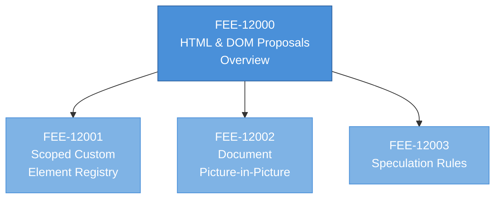

# [FEE-12000] HTML & DOM Proposals Overview

:::info
HTML has no version number. Features ship one by one into a Living Standard, which means every feature's readiness is its own calculation.
:::

:::warning Web Platform Proposals
Articles in the 10000-19999 range cover features that are not yet stable across all major browsers. When a feature ships stable, its article graduates to the appropriate 0-9999 category.
:::

## Context

**WHATWG** (the Web Hypertext Application Technology Working Group) owns the HTML and DOM specifications. Its membership is the four major browser engines — Apple, Google, Mozilla, Microsoft — operating through a Steering Group that resolves disputes and approves significant changes. The Steering Group exists specifically as a multi-implementer consensus mechanism; any change that reaches the specification has passed through implementers who will build it. This differs from TC39 and CSSWG, which include invited experts and community delegates beyond the engine vendors. WHATWG is deliberately implementer-centric.

The 2019 W3C/WHATWG Memorandum of Understanding settled a decade of parallel specifications. Before 2019, W3C and WHATWG both published specifications for HTML, DOM, Fetch, and related standards. Implementations followed WHATWG's drafts in practice because those tracked actual browser behavior, but W3C's formal Recommendations often diverged. The MoU ended the duplication by making WHATWG the single source of truth for the covered specifications; W3C publishes review copies but does not fork the specifications anymore. The practical consequence for a reader is that `html.spec.whatwg.org` is the definitive source for HTML, and any competing document should be treated as historical.

Before the MoU, checking HTML spec behavior often required reading two specifications and reconciling differences. The WHATWG HTML Living Standard described what browsers actually did; the W3C HTML 5.x Recommendation described a specific moment in the spec's evolution with editorial additions. Differences in technical detail could leave readers uncertain which source applied. The MoU's single-source-of-truth rule simplified this substantially: readers consult WHATWG for HTML, DOM, Fetch, URL, and Streams, and the question of which version applies does not arise.

The **Living Standard model** is the structural decision that distinguishes HTML from most other specifications. There is no HTML5, HTML5.1, or HTML6. The specification is continuously updated; a commit to the `whatwg/html` repository can land at any time, and the published spec at `html.spec.whatwg.org` always reflects the current state. Features are added incrementally without any version ceremony. Editors preserve anchor links when possible so that external references to specific sections continue to resolve after content updates. The model follows three questions the WHATWG editors use as guiding heuristics: what do implementations do, what do the tests reveal, what should the processing model look like.

**Origin Trials** are Chrome's mechanism for shipping features to production traffic before full cross-engine agreement. A site operator registers for a specific trial at `developer.chrome.com/origintrials`, receives a token, and deploys the token as a meta tag, HTTP header, or injected JavaScript. For the duration of the trial (typically six months, sometimes extended), the feature is enabled on Chrome for the registered origin's traffic. The data collected during the trial informs Chrome's decision to ship the feature unflagged, revise it, or withdraw it. Origin Trials are a Chrome-specific program; Firefox and Safari have similar mechanisms at smaller scale, but Chrome's is the most used in practice.

The **WICG (Web Incubator Community Group)** is where many HTML and DOM proposals begin their life. WICG operates under the W3C umbrella as an incubator — a forum where developers, browser engineers, and researchers can discuss ideas that might eventually become standards. Proposals start in the `WICG/proposals` repository, graduate to their own dedicated repositories when they gain traction, and move to WHATWG or W3C when they are ready for standardization. Popover, Invokers (the `commandfor` and `command` attributes), Speculation Rules, and the Navigation API all started as WICG proposals before reaching WHATWG. The WICG-to-WHATWG pipeline is a soft handoff; a proposal graduates when its champion and collaborators agree it is ready for implementer commitment.

Some proposals stay in WICG indefinitely. The **Observable** proposal — a reactive-programming primitive for DOM events — has been discussed at WICG for years without graduating, because implementers have not reached consensus on whether the abstraction belongs at the DOM level or the JavaScript-language level. Proposals of this shape serve as useful shared designs even without graduating; framework authors study them as reference architectures and sometimes ship their own implementations (`signals`, `observables`, reactive libraries) that influence the platform-level design in turn.

The **informal three-engine convention** is the load-bearing readiness rule. A feature is considered "standard" enough for production documentation when it ships unflagged in Chromium, Firefox, and WebKit. The convention is informal because no formal body enforces it, but every web platform references page on MDN and every compatibility tracker follows it. Features that ship in one engine and are implemented but unshipped in another sit in an ambiguous middle zone that this article category exists to navigate.

The three-engine convention reflects a deeper fact about the web: it is a contract between implementations. A feature that ships in only one engine is a vendor-specific extension, not a platform feature. The web platform gets meaningful definition when multiple independent implementations agree on behavior. The rule is informal because the number of qualifying engines has varied through history (Opera's Presto was a fourth engine until 2013; Internet Explorer's Trident was a fifth until 2016) and because the line between "shipped" and "enabled by default" can be blurred. Developers learn to read the signal from the stable shipping matrix on MDN and caniuse, and treat the three-engine convention as the practical floor.

## Scenario

A product team audits the HTML feature inventory for a new project. The Popover API — the `popover` attribute, `showPopover()`, `hidePopover()`, `togglePopover()`, and the `:popover-open` pseudo-class — reached Baseline 2025 status and ships unflagged in every major engine; the team can use it directly without guards. The scoped custom element registry proposal is a draft specification tracked by WHATWG with one implementation landing; it would simplify their web-component architecture but is shipping in only one engine. Both features live under the same WHATWG "HTML Living Standard" banner; a reader looking at a single "HTML" category without per-feature readiness data would see them as equivalent.

The team's options for scoped custom element registry split along four paths. Path 1: adopt now in Chrome-only code and accept that Safari and Firefox users will see the default global registry behavior. Path 2: wait for cross-engine shipping before adopting; keep the existing component architecture in the meantime. Path 3: ship a polyfill that emulates scoping by intercepting `customElements.define` calls and isolating registrations per tree; the polyfill adds runtime overhead and does not match native semantics exactly. Path 4: adopt the Origin Trial (if one is offered) to get production feedback on their own usage while the feature is still in the implementer feedback loop.

Each path has a different cost profile and a different set of signals to monitor. Path 1 ships broken behavior to 35-40 % of users and requires Chrome-user-agent detection or feature detection to gate. Path 2 postpones the feature without cost but also postpones the architecture improvement. Path 3 pays a polyfill tax on every page load for every user, regardless of native support. Path 4 enables experimentation on Chrome while keeping the codebase ready to switch to the native implementation when it ships universally. This overview is the framework for reasoning about the shape of that decision for any HTML or DOM proposal in the 12000 range.

The specific tradeoffs map to audience and deployment context. A consumer-facing product with a broad user population cannot afford Path 1's broken-behavior cost; it typically chooses Path 2 or Path 3. An internal tool with a controlled user base (known to be Chrome-only) can choose Path 1 safely. A high-traffic product with engineering capacity to track the Origin Trial feedback loop benefits most from Path 4. The framework is the same across audiences; the decision differs because the cost units (user-visible broken behavior vs engineering time vs bundle bytes vs feedback-loop overhead) are weighted differently in each context.

A library author faces the usual pattern variation: publish the library with a peer-dependency-style expectation that the consuming application handles feature detection and polyfill loading. A component library that exposes `<Popover>` today can rely on the native Popover API being available universally; a library that wants to expose scoped custom element registration cannot, and must either ship the polyfill or require consumers to do so. The design choice shifts with each feature's shipping status.

A design-system team's calculus adds one layer. Design systems publish primitives (tokens, components, layout utilities) that downstream teams consume without necessarily understanding the browser-shipping landscape. A design system that exposes a tooltip primitive built on Popover gets to rely on the native implementation now and can publish the primitive without a polyfill. A design system that exposes a component built on pre-stable APIs either ships a polyfill to every consumer (inflating bundle size for every consuming product) or requires each downstream team to handle the feature gate (pushing architectural complexity outward). The design-system team's typical choice is to wait for universal shipping before exposing a pre-stable feature as a first-class primitive.

## Design Thinking

### Why HTML abandoned versioning

HTML 4 was published in 1997 as a W3C Recommendation. W3C's successor effort, XHTML, pushed HTML toward strict XML syntax. XHTML 1.0 was a reformulation of HTML 4 in XML syntax; XHTML 2, published as a W3C Working Draft in 2002, broke compatibility with HTML's parsing model to enforce strict syntax universally. Browser vendors refused to implement XHTML 2 because the break-the-web cost was unacceptable. In 2004, engineers from Apple, Mozilla, and Opera formed WHATWG to continue developing HTML as a living standard that matched actual browser behavior.

The decision to abandon version numbers formalized what was already true: HTML is the evolving contract between browser engines and content authors. Version numbers suggested a false sense of compatibility boundary — a document marked "HTML 4.01 Strict" did not actually require a different browser behavior from "HTML 4.01 Transitional"; the doctype was a stylistic choice with minor parsing implications. Removing the version concept let browsers ship features continuously without coordinating version numbers, and let the specification accumulate accumulated corrections without triggering a version bump.

The tradeoff is that readers cannot say "this site targets HTML X" the way they could in 2008. The new contract is "this site requires these specific features," and feature detection replaces version detection as the readiness check. This tradeoff is accepted because the alternative — maintaining versioned HTML specifications with explicit compatibility levels — would slow every feature behind the pace of the slowest version.

The Living Standard model has an implication that catches new readers off guard: the specification can change without notice. A section of `html.spec.whatwg.org` that described behavior one way last year may describe it a different way this year, because the editors updated the section based on implementation feedback. The archive at `web.archive.org` is the effective version-history mechanism. Readers citing the spec in a blog post or bug report should include the date of their reading alongside the URL.

### The implementer-first design philosophy

WHATWG's operating philosophy — encoded in the working mode document and repeated across editor practice — is that specifications describe what implementations will do, not what a theoretical model says they should do. The phrase that captures this internally is "don't write fiction." A proposal that cannot be pointed to a willing implementer is fiction; specifications that describe behavior no implementer has committed to implementing accumulate as dead weight on the platform.

This philosophy has visible effects on the proposal shape. Every WHATWG proposal has at least one implementer willing to prototype before the specification text is written. Early prototyping produces feedback that shapes the specification; the specification is finalized only after the prototype proves the design can actually be implemented. This is different from TC39 (which allows proposals to sit in early stages with implementer interest but no implementer commitment) and from CSSWG (which produces specification text first, then seeks implementer feedback during CR).

The tradeoff is that WHATWG proposals move slowly when no implementer is willing to start. A good idea with no implementer interest sits in WICG indefinitely. A good idea with multiple implementer interest advances quickly. The ratio of shipped to proposed features is higher at WHATWG than at TC39 or CSSWG, but the set of available features at any moment is smaller, because the implementer-first filter has excluded the "cool idea nobody wants to build" category.

### How the ecosystem bridges the gap

HTML and DOM proposals have three primary userland bridging strategies.

**JavaScript polyfills** are the most common bridge for DOM proposals. The Popover API shipped with a polyfill (`popover-polyfill` on npm) during its development period that implemented `togglePopover()` and related methods on any element with a `popover` attribute. The `<dialog>` element similarly had polyfills before Safari shipped it in 2022. Polyfills for DOM APIs are usually moderate in size (a few KB), add no build step, and feature-detect at load time to avoid overriding native implementations.

**Feature detection** for DOM APIs uses `'methodName' in Element.prototype`, `typeof element.method === 'function'`, or specific property presence tests. For HTML-level behaviors (e.g. the `popover` attribute's presence), a test element can be created and inspected: `document.createElement('div').showPopover` exists on a supporting engine and is undefined on a non-supporting one.

**Origin Trials** let large production sites gather real-traffic feedback during the implementer-feedback phase, before cross-engine shipping. A trial token is a commitment — if the API changes before graduation (and trials do change APIs in response to feedback), the site must adapt. Origin Trials are a Chrome-specific mechanism; the equivalent in Firefox is the `layout.experimental.*` preference set and in Safari is the Safari Technology Preview release channel.

**WICG participation** is the bridge for proposals not yet in WHATWG. A team watching a WICG proposal can file issues, propose syntax changes, and influence the direction of a feature before it reaches implementer consideration. This is how real-world requirements enter the specification pipeline; proposals that reach implementer consideration without prior WICG-style incubation often get rejected for missing use cases or failing to consider existing patterns.

Beyond individual polyfills, the **`@webcomponents/` ecosystem** provides generalized polyfills for core DOM features: `@webcomponents/custom-elements`, `@webcomponents/shadydom`, and historical `@webcomponents/html-imports`. These polyfills are maintained by the Polymer-era team at Google and are the standard way to support older browsers that predate universal custom-element shipping. For modern browsers targeting Baseline "Widely available" features, these polyfills are no longer needed; they remain useful for projects that still support legacy engines.

### A worked example: the Popover API through the pipeline

Popover makes the HTML/DOM pipeline concrete. The initial proposal came from Open UI Community Group and WICG in 2022, driven by developer frustration with `aria-haspopup` patterns, focus-management bugs, and the complexity of implementing accessible dropdowns and tooltips. The proposal moved to WHATWG in late 2022 once multiple implementers committed to implementing it.

Chromium shipped the `popover` attribute unflagged in Chrome 114 (May 2023). WebKit followed in Safari 17 (September 2023). Firefox shipped it in Firefox 125 (April 2024), completing cross-engine availability. Once all three engines shipped, the feature reached Baseline 2025 in January 2025 — a status that `web.dev/baseline` assigns when a feature has been cross-engine-shipping for 30 months, with the newer "Newly available" status assigned when shipping completes. This is the modern HTML shipping timeline: a WICG incubation phase, a move to WHATWG when implementers commit, then 18-24 months of engine implementation with Origin Trials filling the gap for early adopters, then cross-engine shipping and eventual Baseline status.

Popover's graduation to Baseline 2025 is the event that moves an HTML/DOM proposal from the 12000 range into FEE-100 (HTML & Semantic Markup). Features behind the Popover API — Interest Invokers, the `commandfor` attribute — are tracked separately and may graduate independently as they reach their own Baseline milestones.

### When to adopt a pre-stable HTML or DOM proposal

The adoption calculus is a short set of questions.

First, **has the proposal moved from WICG to WHATWG?** A WICG proposal is still in the ideation phase; the API shape is expected to change. A WHATWG proposal has implementer commitment and the shape is stabilizing. Adoption at WICG means signing up for redesign; adoption at WHATWG means signing up for revision.

Second, **how many engines ship it, and how does the team handle the gap?** A proposal shipping in all three engines is a full adoption candidate. A proposal shipping in two engines with an active implementation in the third is a "coming soon" case where Origin Trial or polyfill bridges the gap. A proposal shipping in only one engine with no implementation in the other two is a bet on the proposal's future.

Third, **does the feature have a polyfill or Origin Trial?** DOM proposals often have polyfills published on npm. HTML attribute proposals (Popover, Invokers) sometimes have polyfills, sometimes do not. Checking for a polyfill on npm is a five-minute task that often shortcuts the decision — if a well-maintained polyfill exists, the team can adopt now and retire the polyfill when native support arrives.

Fourth, **what is the churn cost if the specification changes?** WICG-stage proposals can and do change shape. WHATWG proposals are more stable but not frozen. The cost of a shape change is proportional to the number of call sites using the feature and the complexity of the migration. Features that touch component contracts (Popover, Navigation API) have higher migration costs than features that touch local behavior (`showPicker()` on form elements).

The articles under 12001-12499 answer these four questions for each specific proposal. This overview provides the framework.

A concrete worked example of the calculus: scoped custom element registry (a WICG-stage proposal). Runtime proposal? Yes — a DOM API. Spec stage? WICG-stage; WHATWG tracking in progress. Engines shipping? One engine landing the implementation at the time of writing; the others have not committed. Polyfill available? Yes, `@open-wc/scoped-elements` on npm. Churn cost? Moderate — the component API boundary is stable but internal registration semantics could shift with spec iteration.

The decision falls out of the calculus: if the team can live with a polyfill and is willing to migrate if spec changes happen, adoption is viable now. If the team needs feature-native semantics and cannot afford migration, adoption waits for WHATWG shipping in at least two engines. The calculus does not make the decision for the team but it surfaces the tradeoffs the team has to weigh.

The order of the four questions is deliberate. Specification stage first rules out early proposals the team cannot yet commit to. Engine shipping second determines whether the feature is universally usable or needs a bridge. Polyfill availability third shortcuts the decision for bridgeable cases. Churn cost last calibrates the overall risk. Teams that adopt without this ordering typically find out late that an earlier question had an answer that would have changed the decision.

An additional question worth asking after the four above: **what is the engine-maintainer position?** Mozilla and WebKit publish standards-positions documents (`mozilla.github.io/standards-positions`, `webkit.org/tracking-prevention`) that record each engine's stance on every proposal. A proposal marked "worth prototyping" or "positive" by all three engines is a strong candidate for universal shipping. A proposal marked "opposed" by one or more engines may never reach universal shipping; adopting it is a bet that the opposition will change, which sometimes happens and sometimes does not.

## Deep Dive

### WHATWG governance: Steering Group and Workstream Participants

WHATWG's governance structure has two levels. At the working level, any developer can file an issue, propose a change, or submit a pull request against a WHATWG specification. These contributions are reviewed by the spec editors (two editors per specification, by design) who merge changes with implementer agreement or escalate disagreements upward. At the resolution level, the **Steering Group** — one seat per member organization (Apple, Google, Mozilla, Microsoft) — resolves disputes the editors cannot resolve and approves significant changes (new specs, spec retirements, structural changes to the organization).

The Steering Group's implementer-only composition is a deliberate design choice. HTML and DOM specifications describe browser behavior; a specification that implementers have not committed to implementing has no force. Expanding the Steering Group to include non-implementer delegates (academics, standards activists, framework authors) would, in the group's view, produce specifications that implementers then refused to implement, which would damage the spec's credibility. The implementer-only composition therefore trades breadth for enforceability.

Non-implementer input enters through **Workstream Participants** (formal participants in a specific specification's discussion) and through the issue/PR workflow on GitHub. A proposal from a non-implementer that gains implementer support becomes a candidate for specification; a proposal that no implementer supports stays in the issue tracker.

### The HTML parser and the constraint backlog

HTML's parser is the load-bearing constraint on every HTML proposal. The parser is defined by the specification to handle a decade of real-world input — malformed markup, legacy tag soup, vendor-specific extensions — in a way that produces identical parse trees across engines. Any new HTML syntax proposal has to fit into this parser without breaking existing parse behavior on any real page.

The practical consequence: new HTML elements are rare and new HTML attributes are common. An element requires parser changes and has cascading effects on the tag-closing algorithm; an attribute is an additive change to the attribute list on an existing element. Popover is implemented as an attribute (`popover`) on existing elements for this reason — an attribute avoids the parser-change cost that introducing a new `<popover>` element would have imposed. Invokers likewise use the `commandfor` and `command` attributes on existing elements (buttons, links), following the same additive approach. The parser-compatibility constraint shapes the surface of the proposals.

When a genuinely new element is needed (`<dialog>`, `
`, `<template>`), the parser work is substantial. The `<dialog>` element took over a decade from first proposal to universal shipping partly because of the parser complexity and partly because the focus-management semantics had to be worked out from scratch.

### Security and privacy review

Every HTML and DOM proposal goes through security and privacy review before it ships. The `w3ctag/security-questionnaire` — a checklist maintained by the W3C Technical Architecture Group — is the standard format. Proposals have to answer questions like "does this feature expose cross-origin information?", "can this feature be used for fingerprinting?", "what new attack surface does this introduce?"

Security review catches significant design problems in advance of shipping. The early Permissions API design allowed sites to enumerate what permissions the user had previously granted to other origins; the security review flagged this as a fingerprinting vector and the API was redesigned to query only the current origin's permissions. Similar redesigns have happened with the Notifications API, the Clipboard API, and the File System Access API — all of which reached shipping in modified form after privacy review identified concerns.

The practical consequence for adoption: a feature that has shipped in one engine but not others is sometimes blocked by security concerns that the non-shipping engines want resolved. A team adopting early without checking the engine's standards positions page (`mozilla.github.io/standards-positions`, `webkit.org/tracking-prevention`, `chromestatus.com/features`) may be adopting a feature that one or two engines have already marked as "worth prototyping" or "opposed." The position pages are worth checking before committing to any pre-universal-shipping feature.

### Reading the HTML spec and MDN alongside it

The HTML spec at `html.spec.whatwg.org` is the normative source but it is dense — it is written for implementers and assumes familiarity with WebIDL, the DOM specification, and web security models. For most practical reading, MDN's HTML reference at `developer.mozilla.org/docs/Web/HTML` is the useful companion. MDN pages summarize the spec, link to the normative section for deeper reading, and embed browser-compat-data tables that show per-engine shipping status.

A reader approaching a new HTML or DOM proposal should typically read MDN first, file specific questions against the WHATWG issue tracker, and only dive into the normative spec text when debugging a specific behavior that MDN does not cover. The spec is the canonical reference but rarely the starting point for adoption decisions.

### Withdrawn and deferred proposals

Not every proposal that reaches WHATWG advances. Some are deferred; some are withdrawn.

The **HTML Imports** proposal is the clearest example of withdrawal. HTML Imports allowed authors to include external HTML documents as resources, similar to how CSS and JS are included. The proposal reached implementer consideration in Chrome in 2013, was never implemented by Firefox or Safari, and was eventually deprecated in Chrome when the ES modules proposal (on the JavaScript side) offered a better solution for the same use cases. Teams that adopted HTML Imports had to migrate to ES modules or templating libraries.

The **AppCache** (Application Cache) is an example of deprecation after shipping. AppCache was shipped across all engines as an offline-first caching mechanism in the early 2010s, then deprecated in favor of Service Workers when the model's limitations proved incompatible with real-world usage patterns. Deprecation involved warnings in DevTools, removal from newer specifications, and eventually implementation removal.

The pattern lesson is that HTML proposals can be withdrawn even after shipping, if the design turns out to be incompatible with real-world usage. Adoption at the 12000 stage carries a churn risk similar to the CSS Experimental and TC39 tracks. The HTML-specific pattern is that churn typically happens later in the lifecycle (post-shipping) compared with those tracks, where most churn happens during implementer feedback.

### Origin Trials in practice

For large production sites, participating in an Origin Trial is a useful way to influence a feature's design before it ships universally. The trial gives production-traffic feedback to the implementer team: errors encountered at scale, performance characteristics under real load, API-shape friction that surfaces only when a feature is used in earnest. Feedback collected during the trial often shapes the final specification.

Registering for an Origin Trial takes a few minutes: select the trial at `developer.chrome.com/origintrials`, agree to the terms (which include a commitment to submit feedback), receive a token, deploy it as a meta tag (`<meta http-equiv="origin-trial" content="…">`) or an HTTP header (`Origin-Trial: …`). The token is origin-scoped and time-limited; when the trial ends, the feature reverts to its flagged or unflagged status per the post-trial shipping decision.

The risks of Origin Trial participation are two. First, the API may change during the trial period in response to feedback — a site that builds a feature on the Trial API has to track changes and adapt. Second, the trial may end without the feature shipping; the site then has to remove the dependency. Both risks are manageable if the site architects the feature as an optional enhancement layered on top of a stable baseline, with a fallback code path for users outside the trial.

Firefox has a similar mechanism via the `layout.experimental.*` preference set, though it is not a production-facing program like Chrome's. Safari Technology Preview serves a comparable role for WebKit — developers can test features on Technology Preview before they reach stable Safari.

### The "Baseline" status model

The `web.dev/baseline` status system has become the practical readiness reference for HTML, DOM, and CSS features. Baseline assigns three states: "Limited availability" (shipping in one engine, not yet in others), "Newly available" (just became available across all modern browsers), and "Widely available" (has been available across all modern browsers for at least 30 months).

For the adoption decision, Baseline provides a single lookup that summarizes the per-engine shipping matrix into a three-state signal. "Limited availability" means the team needs a polyfill or a feature-gated code path. "Newly available" means the team can adopt in most browsers but may still need fallback for older devices or users on older browser versions. "Widely available" means the team can use the feature unconditionally in production code targeting modern browsers.

The 30-month threshold for "Widely available" is calibrated to match the typical enterprise browser upgrade cycle and the mobile OS update distribution curve. A feature that has been available for 30 months has had time to propagate through slow-updating contexts — older corporate fleets, users who delay OS updates, mobile devices with vendor-controlled update cycles. The threshold captures when a feature is safe to use in broad-audience production code without browser-upgrade prompts.

## Visual

The blue node is the category overview. Each sub-article below it is a drafted FEE entry covering one pre-stable HTML or DOM proposal. The three articles are listed in numerical order; there is no topical grouping beneath the overview. Additional 12xxx articles may be added by future specs as new proposals mature; they will be numbered sequentially from 12004.

The three sub-articles cover distinct surfaces of the HTML platform.

FEE-12001 documents `CustomElementRegistry` construction and `attachShadow({ registry })`, the namespace-scoping mechanism for custom element definitions.

FEE-12002 documents `documentPictureInPicture.requestWindow()`, which promotes arbitrary HTML into a floating always-on-top window.

FEE-12003 documents `<script type="speculationrules">`, the declarative prefetch and prerender governance replacement for `<link rel="prerender">`.

Two previously-planned articles graduated out of this range before the spec landed. Invoker Commands (`command` / `commandfor` attributes) reached Baseline 2025 in December 2025 and is tracked for a dedicated stable-range FEE. The Navigation API reached Baseline 2026 in January 2026 and is tracked for the same stable-range follow-up alongside Popover and Invoker Commands. The 12xxx range documents proposals that are not yet Baseline-stable; once a feature graduates, its article moves to the stable 0-9999 categories.

The articles are independent — a reader can pick any one and understand it without the others. Cross-references appear in each article's Internal References section where the proposals genuinely interact. Scoped Custom Element Registry touches tooling around Web Components; Document Picture-in-Picture interacts with video and media APIs; Speculation Rules interacts with Resource Hints and Core Web Vitals.

Different audiences enter this range at different articles, driven by the problem they already have:

- **Micro-frontend integrator** — starts with Scoped Custom Element Registry. The namespace collision problem (two widgets defining the same tag) is the motivating pain that sends them into the range in the first place.
- **Video-conferencing or live-coding product engineer** — starts with Document Picture-in-Picture. The always-on-top windowing capability is not approximated by any other platform primitive.
- **Performance engineer** — starts with Speculation Rules. The declarative prefetch and prerender governance replaces ad-hoc `<link rel="prefetch">` usage with a policy surface.

The reading-order recommendation above (the numerical order) is the ordering for someone surveying the range without a specific pre-existing problem. Readers with a problem already in hand should jump directly to the matching article above and treat the others as optional background. Readers interested in the recently-graduated Invoker Commands or Navigation API should look in the 100s range once the stable-range follow-up spec lands.

Graduation tracking stays separate from this overview. When an individual proposal reaches the cross-engine shipping bar defined in Context, a dedicated graduation spec moves that article's content to the appropriate 0-9999 category and leaves behind a redirect stub at the 12xxx slot. The 12xxx slot remains occupied — the FEE ID is not reused — so that cross-references from other articles do not break.

The next candidate for graduation is Scoped Custom Element Registry if Firefox ships it unflagged, which would move 12001 to the 100s range and leave a stub at 12001. Document Picture-in-Picture and Speculation Rules depend on Safari and Firefox shipping and are less predictable. Invoker Commands and Navigation API, though they originally sat in this range's planning document, graduated before a 12xxx article was written — they are directly written in the stable 100s range without a 12xxx stop.

The practical implication for a reader browsing the 12xxx range: if a feature that was planned here has disappeared from the index without a stub, check the stable 100s range first. The FEE project's graduation policy preserves stubs only for features that did have a full 12xxx article; features that graduated during planning (like Invoker Commands and Navigation API here) move cleanly to their stable destination without a stub redirect.

This pattern — features graduating before their pre-stable article is written — is a healthy signal about the platform's shipping cadence. The 12xxx range captures the window between "proposal shipping in one engine" and "available across all major engines." When that window closes before the FEE project can author an article, the article is written at its stable destination instead of being written twice.

The overview exists as the entry point and the graduation tracker.

Readers use it to orient themselves on the proposal landscape and to decide which sub-article to read next. The FEE project uses it as the checklist that tells specs which articles are eligible for graduation. Keeping the two roles in one document is deliberate — separating them would double the maintenance cost and split the shipping-status reality across two surfaces.

The category's shallow depth reflects the pace at which HTML and DOM proposals graduate relative to the pace at which FEE catches up. Popover (Baseline 2025), Invoker Commands (Baseline 2025), and Navigation API (Baseline 2026) are all tracked for a dedicated stable-range FEE in a separate spec. Scoped Custom Element Registry is the next likely candidate for graduation if Firefox ships it unflagged.

The suggested reading order follows the numbering. Scoped Custom Element Registry comes first for multi-owner namespace scoping; Document Picture-in-Picture second for the new window capability; Speculation Rules last for prefetch and prerender governance. A developer new to this range can read them in order to build a mental model — the element-registration addition first, the windowing API second, the performance-governance surface last.

Beyond the five sub-articles above, the 12000 range has room for features that have not yet reached WICG or WHATWG. Observable primitives (the `Observable` interface now under WICG discussion) may eventually arrive; view-source-level changes (the proposed `source` element for structured data) could populate the range.

The reserved numbering (`12006`+) accommodates future proposals without renumbering existing articles. The FEE-ID allocation is monotonic — a newly drafted article always gets the next unused ID in the range, regardless of the topic. This keeps cross-references stable across specs and avoids the coordination cost of moving articles around when new proposals are added.

## Tracks in this range

| ID    | Title                          | Status                |
|-------|--------------------------------|-----------------------|
| 12001 | Scoped Custom Element Registry | Limited availability  |
| 12002 | Document Picture-in-Picture    | Limited availability  |
| 12003 | Speculation Rules              | Limited availability  |

Sub-articles are numbered sequentially, in roughly the order a reader encounters the proposals in practice. Scoped Custom Element Registry is an element-registration addition; Document Picture-in-Picture is a windowing API; Speculation Rules governs prefetch and prerender hints. Each article's Internal References section cross-links the proposals that interact with each other.

## Graduation

Graduation from 12000-range to either `HTML & Semantic Markup` (100-199) or `Browser APIs & Web Platform` (400-499) happens when a feature ships unflagged in all three major engines and is considered stable for production documentation. The practical signal is the Baseline status on web.dev/baseline, which assigns "Newly available" when all three engines first ship and "Widely available" after 30 months of continued availability. A feature with Baseline "Widely available" is a strong graduation candidate; a feature with Baseline "Newly available" is a near-term candidate pending content-depth review.

Element proposals (Popover, Invokers, `<dialog>`) typically graduate to HTML & Semantic Markup (100-199). API proposals (Navigation API, Document PiP, URL Pattern) typically graduate to Browser APIs & Web Platform (400-499). The graduation target is noted in each sub-article's frontmatter so the maintainer can identify the destination at graduation time.

Some proposals have no obvious destination category in the current FEE taxonomy. The Observable primitive under WICG discussion would fit naturally into `JavaScript Core & Runtime` despite being a DOM API, because the abstract behavior it defines lives at the language level. For such cases, the graduation decision lands where the reader-facing mental model lives, even when that destination is separate from the implementing specification's home. This is the same pattern FEE uses for Temporal — spec-wise a JavaScript language proposal with DOM-side interactions, destination-wise a JavaScript Core & Runtime article.

A concrete example from recent history is the **`<dialog>` element**. The element was specified in HTML for over a decade before shipping universally. Chromium shipped it unflagged in 2014; Safari followed in March 2022 (Safari 15.4); Firefox followed in July 2022 (Firefox 98). Once all three engines shipped, the element reached Baseline "Widely available" status in 2024 and became a graduation candidate. This is a typical HTML-element timeline — parser and focus-management complexity extend implementation time well beyond the specification's completion.

When a feature's corresponding article graduates, it moves to a new ID in the 100-199 or 400-499 range; the old 12000-range ID becomes a redirect. Inbound links, git history, and bookmarks remain intact. Graduation promotes content; it does not break reader paths.

Some features cross category boundaries in ways that need editorial judgment. The Navigation API, for example, is a DOM API (so naturally lands in 400-499) but its effect on application architecture touches the same concerns as client-side routing — a topic closer to Component Architecture than to raw browser APIs. The editorial decision for each graduating feature is whether the article's destination should match its technical home or its author-facing mental model. For the Navigation API, the current plan is to place the technical reference in 400-499 and add a cross-reference from any routing-related article in the 500-599 range. The split preserves both findability paths.

The FEE does not formally track which features are near graduation because Baseline status is the more precise answer. Readers curious about graduation candidates should consult the Baseline tracker at `web.dev/baseline` plus the WHATWG specification's change log for cross-engine shipping confirmation.

Partial graduation applies to feature families that ship in pieces. The Popover API has a core (the `popover` attribute, `showPopover()`, `:popover-open`) and extensions (interest-based invocation, anchor targeting). The core reached Baseline 2025 and is graduation-ready; the extensions are at varying earlier stages. The approach is to graduate the core as a standalone FEE article once the sub-article exists, and to add extension-specific sub-articles that stay in the 12000 range until their own Baseline criteria are met. This partial-graduation pattern matches how the engines themselves shipped — Popover's core was Chrome 114's milestone, with extensions landing in later releases.

## Related FEEs

| FEE | Relationship |
|-----|-------------|
| [FEE-100 HTML & Semantic Markup](../../HTML%20and%20Semantic%20Markup/100.md) | The destination category for graduated HTML element and attribute proposals. |
| [FEE-400 Browser APIs & Web Platform](../../Browser%20APIs%20and%20Web%20Platform/400.md) | The destination category for graduated DOM and browser API proposals. |
| [FEE-402 Events & Event Delegation](../../Browser%20APIs%20and%20Web%20Platform/402.md) | Many DOM proposals extend the event model (observable primitives, Interest Invokers); a solid grounding in FEE-402 is prerequisite. |
| [FEE-405 Web Workers & Concurrency](../../Browser%20APIs%20and%20Web%20Platform/405.md) | Some DOM proposals interact with worker threads and shared memory; FEE-405 provides the concurrency background. |
| [FEE-10000 TC39 & JS Proposals](../TC39%20and%20JS%20Proposals/10000.md) | Sibling track for JavaScript language proposals; governance by TC39 (a different standards body) with different shipping conventions. |
| [FEE-11000 CSS Experimental](../CSS%20Experimental/11000.md) | Sibling track for CSS module proposals; governance by W3C CSSWG. |

## References

- [WHATWG HTML Living Standard](https://html.spec.whatwg.org/) — the normative specification for HTML, continuously updated.
- [WHATWG DOM Living Standard](https://dom.spec.whatwg.org/) — the normative specification for DOM.
- [WHATWG Working Mode](https://whatwg.org/working-mode) — the process document describing how WHATWG operates.
- [WHATWG FAQ](https://whatwg.org/faq) — frequently asked questions about the Living Standard model and WHATWG's relationship with W3C.
- [Chrome Origin Trials](https://developer.chrome.com/docs/web-platform/origin-trials) — Chrome's program for opt-in production testing of experimental features.
- [WICG (Web Incubator Community Group)](https://wicg.io/) — incubator for HTML and DOM proposals before they reach WHATWG.
- [WICG Proposals](https://github.com/WICG/proposals) — the central repository where new ideas are first proposed.
- [web.dev Baseline](https://web.dev/baseline) — canonical source for the "Newly available" and "Widely available" status of web platform features.
- [MDN: HTML reference](https://developer.mozilla.org/en-US/docs/Web/HTML) — per-element documentation with browser-compat-data tables.
- [MDN: DOM reference](https://developer.mozilla.org/en-US/docs/Web/API) — per-API documentation with browser-compat-data tables.
- [caniuse.com](https://caniuse.com/) — community-maintained per-feature browser shipping matrix for HTML, DOM, and CSS.
- [Interop Project](https://wpt.fyi/interop) — cross-vendor yearly commitment on feature compatibility; often includes HTML and DOM features on the focus list.
- [Open UI Community Group](https://open-ui.org/) — research group for built-in HTML controls and component primitives; Popover originated here.
- [Mozilla Platform Status](https://mozilla.github.io/standards-positions/) — Mozilla's positions on in-development web platform specifications.
- [WebKit Features](https://webkit.org/status/) — WebKit's running list of feature implementation status.
- [Chrome Status](https://chromestatus.com/features) — Chromium's running list of platform features with per-version shipping status.
- [W3C TAG security-questionnaire](https://github.com/w3ctag/security-questionnaire) — the checklist used for security and privacy review of web platform proposals.
- [@webcomponents polyfills on npm](https://www.npmjs.com/org/webcomponents) — legacy polyfills for core custom-element and shadow-DOM features.
- [Open UI reports](https://open-ui.org/reports/) — research reports on built-in HTML controls, anchoring the Popover and Invokers designs.
- [popover-polyfill on npm](https://www.npmjs.com/package/@oddbird/popover-polyfill) — runtime polyfill for the Popover API, maintained by OddBird.
- [@open-wc/scoped-elements](https://open-wc.org/docs/development/scoped-elements/) — polyfill and helpers for scoped custom element registry, from the Open Web Components project.
- [WHATWG GitHub discussions](https://github.com/whatwg/html/discussions) — community discussion forum for HTML specification questions.
- [HTML Standard changes](https://html.spec.whatwg.org/commit-snapshots/) — commit-snapshot archive for cited-date references to historical spec states.
- [WebIDL Standard](https://webidl.spec.whatwg.org/) — the interface-definition language WHATWG uses to specify DOM API shapes.
- [caniuse ID lookup for baseline features](https://caniuse.com/?search=baseline) — search and filter for features by Baseline status.
