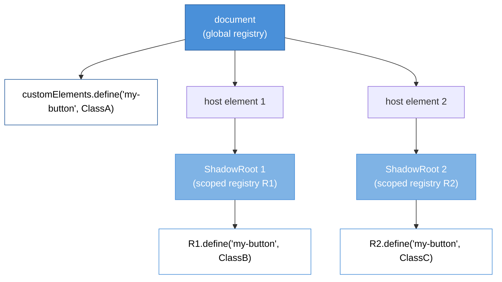

# [FEE-12001] Scoped Custom Element Registry

:::info
Multiple versions of the same custom element can coexist on one page when each is registered in its own shadow root's local registry, solving the namespace collision problem that has haunted micro-frontend and widget-library integration since custom elements shipped.
:::

:::info Limited availability
Shipping in Chromium and WebKit at time of writing. Firefox tracks implementation. This article covers the proposal and the polyfill pathway until cross-engine availability lands.
:::

## Context

Custom elements arrived in 2016 with a single, document-global `CustomElementRegistry` reachable through `window.customElements`. The registry is a name-to-constructor map that maps tag names like `<my-button>` to the class the browser instantiates when it encounters that tag.

Every custom element definition competes for a single namespace. Calling `customElements.define('my-button', ClassA)` once binds the name for the lifetime of the document. A second `define('my-button', ClassB)` throws a `NotSupportedError`. The registry is final-write-wins-never: the first registration wins permanently.

The global registry was a reasonable default for single-owner pages in 2016. A product that owned its own custom elements had no reason to worry about collisions because it controlled every `define()` call. The assumption that a page has one author held for most production code at the time. The design matched how `document.registerElement`, the pre-standard API, worked — and the pre-standard API was itself modeled on framework patterns (Polymer, X-Tag) where components belonged to the application author.

The assumption stopped holding as the web platform matured. Micro-frontend architectures let independent teams deploy features that share a document but do not share build pipelines. Widget and SDK vendors ship embeddable components that coexist with other vendors' components in a host page. Browser extensions inject DOM that must not collide with the page's custom elements. Developer tools, analytics libraries, A/B testing frameworks, and even password managers register custom elements without knowing what the host page has registered. Each of these scenarios breaks the single-author assumption the global registry was designed around.

The Scoped Custom Element Registry proposal answers the collision problem by making the registry a per-shadow-root concept instead of a per-document concept. A shadow root can carry its own `CustomElementRegistry`, created with `new CustomElementRegistry()`. The constructor-lookup inside that shadow root checks the scoped registry first. Two shadow roots on the same page can each register `<my-button>` against a different class, and each `<my-button>` inside those shadow roots resolves to its own local definition.

The WHATWG HTML Living Standard section on custom elements now describes the scoped registry variant. The `CustomElementRegistry()` constructor (with no arguments) creates a new scoped registry and sets its internal `is scoped` flag to true. The `attachShadow()` options bag accepts a `registry` field that points to a `CustomElementRegistry` instance; the shadow root's internal `custom element registry` is set to that registry. Element creation inside the shadow root — via the shadow root's own `createElement`, `createElementNS`, or `importNode` methods, or via `document.createElement` with a `customElementRegistry` option — consults the scoped registry first.

The proposal moved through WICG for several years before reaching implementer consensus. Early designs explored alternatives: a parallel "scoped registry" namespace that coexisted with the global one, a registry-per-document-fragment approach, and various opt-in flags on `define()`. The shipping design attaches the registry to shadow DOM because shadow DOM already provides the structural isolation boundary that scoped lookups need. Reusing an existing boundary avoided inventing a new scoping primitive, which the proposal authors treat as a guiding design principle.

Implementer readiness varies across engines. Chromium shipped scoped registries unflagged after a staged rollout that first introduced the constructor, then the `attachShadow` option, then the shadow-root element-creation methods. WebKit followed with a similar staged path. Firefox tracks the proposal and has implementation work in progress; the exact shipping timeline depends on coordination with the DOM and custom elements implementation teams.

## Scenario

A product page embeds two widgets from different vendors. Vendor A's widget ships a `<vendor-button>` custom element implemented as a click-tracking button with Vendor A's branding. Vendor B's widget also ships a `<vendor-button>` custom element — same tag name, different behavior, different internal state. The product page's runtime loads Vendor A's widget bundle first; the bundle calls `customElements.define('vendor-button', VendorAButton)`. When Vendor B's bundle loads and calls the same `define`, the registry throws `NotSupportedError`.

The runtime consequence of that thrown error depends on how Vendor B wrote their initialization. If Vendor B catches the exception and continues, Vendor B's widget never registers and every `<vendor-button>` in Vendor B's shadow trees renders as an unknown HTML element with no behavior — a blank inline container. If Vendor B does not catch, the exception propagates up the call stack and may crash Vendor B's bundle's initialization entirely, depending on how the bundle is structured. Either way, Vendor B's widget stops working on pages where Vendor A loaded first.

Before scoped registries, the product team had three mediocre options to avoid this crash:

**Option 1: coordinate tag-name prefixes across vendors.** Agree with both vendors that Vendor A uses `<vendor-a-button>` and Vendor B uses `<vendor-b-button>`. The coordination cost is high and breaks any time a third vendor enters the picture. Third-party SDKs that aim for broad distribution cannot realistically coordinate with every host page they land on; the one-sided nature of the coordination puts the burden on the host.

**Option 2: iframe isolation.** Load each vendor into an `<iframe>` to get real document-level namespace isolation. Iframes lose shared state with the host page, cost extra HTTP requests (each iframe is a new document fetch), break copy-paste user flows, and do not scale to a widget grid with dozens of cells. Accessibility tools struggle with iframe-heavy pages, screen readers need additional markup to narrate iframe content well, and iframe boundaries interfere with the host page's scroll behavior.

**Option 3: vendors version their tag names on every release.** Vendor A ships `<vendor-a-button-v12>` and `<vendor-a-button-v13>`; Vendor B ships `<vendor-b-button-v8>`. Two versions of Vendor A's widget can coexist at runtime. But every version bump becomes a coordinated rename that leaks into analytics identifiers, CSS selectors, third-party integrations, and any author-written JavaScript that queries by tag name. The complexity compounds with every release.

With scoped custom element registries, the product team asks each vendor to attach their widget to a shadow root that carries a local registry. Vendor A calls `host.attachShadow({ mode: 'open', registry: new CustomElementRegistry() })` and defines `<vendor-button>` on that registry. Vendor B does the same on their own host element. Two `<vendor-button>` definitions coexist in the document, each inside its own shadow root, each with its own class, state, and event listeners. No coordination between vendors is required and no rename churn is needed on version bumps.

The integration contract becomes simpler. Each vendor's widget is self-contained: it owns its shadow root, its registry, and the lifecycle of its elements. The host page does not need to know which tag names each vendor uses internally. A vendor can change its tag names without coordinating with the host, because the names never leak out of the shadow root's scope. Portable component distribution — the original "write once, use anywhere" Web Components promise — finally works in multi-owner pages.

A multi-vendor design system adopts the same pattern. Each vendor publishes its components as self-scoping widgets, and the host page stitches them into a layout without touching their internal namespaces. Design tokens and theme variables flow in through CSS custom properties (which cross shadow DOM boundaries by default). Events bubble up through the shadow DOM boundary and reach the host's event listeners. The integration surface is explicit: styles in, events out, namespace isolated.

## Best Practices

Use scoped registries at integration boundaries. A micro-frontend host that composes independently-deployed features should wrap each feature in a shadow root carrying a scoped registry. A widget SDK that runs inside a host page controlled by a different team should create its own scoped registry for its internal custom elements. An in-page module that controls the full document (a single-owner app) does NOT need a scoped registry — the global registry is simpler and correct for that case.

Feature-detect before relying on scoped behavior. The constructor presence check works across all non-supporting engines: `typeof CustomElementRegistry === 'function' && 'define' in CustomElementRegistry.prototype` is true everywhere, but only supporting engines allow `new CustomElementRegistry()` without throwing. The narrower check is a try-catch around the constructor call. If scoped registries are not available, the integration layer should either require the polyfill OR fall back to versioned tag names for the affected components.

Pass the scoped registry through `attachShadow({ mode, registry })`. The registry option is the documented API surface; do NOT monkey-patch `document.createElement` or intercept tag resolution through other means. The `createElement`, `createElementNS`, and `importNode` methods on the shadow root itself honor the scoped registry automatically.

Do not use scoped registries for application-internal encapsulation. If your codebase uses ES modules, ES module scope already provides the encapsulation you need; scoped registries add shadow DOM overhead for no additional benefit. Scoped registries solve the multi-owner problem, not the module-boundary problem.

Pair scoped registries with shadow DOM style isolation. The scoped registry keeps the element definition isolated, but CSS inheritance still flows into the shadow root by default. Use `:host` selectors and `adoptedStyleSheets` to prevent host-page styles from overriding widget styles, or use an explicit `mode: 'closed'` shadow root where appropriate.

Share a scoped registry across multiple shadow roots by passing the same `CustomElementRegistry` instance to multiple `attachShadow` calls. This is the correct pattern when several shadow roots belong to the same logical scope (e.g. a widget with multiple host elements). Each `attachShadow` that uses the shared registry resolves definitions from the same name-to-constructor map.

MUST NOT rely on the global registry from within a scoped shadow root. Code running inside the shadow root that calls `customElements.get('vendor-button')` returns the global definition, not the scoped one. Use the shadow root's local registry reference — accessible as `shadowRoot.customElements` on supporting engines.

## Design Thinking

### Why the platform needed the feature

The 2016 design of custom elements mirrored `document.registerElement`, the pre-standard API that predated it. `document.registerElement` was itself modeled on how web-framework custom-element systems worked in 2013-2015, when most frameworks assumed a single-owner page. Angular, Ember, and Backbone all treated custom elements as page-author additions, not as library-shipped primitives. The global registry matched that mental model.

The mental model changed as custom elements became the portable component primitive. Web Components promised "write once, use anywhere" for UI components: a library could ship a `<fancy-input>` custom element, publish it on npm, and any consumer could use it. That promise only works if two libraries publishing a `<fancy-input>` can coexist. The global registry made that coexistence impossible; the only solution was the coordination of tag names across the entire web, which does not scale.

Micro-frontends made the coexistence problem acute. A page that integrates features from independently-deployed teams is exactly the multi-owner scenario custom elements were not designed for. The platform options — iframes or tag-name coordination — both imposed structural costs on the integration. Scoped registries restore the "portable component" promise by decoupling the component from the global namespace.

The delay between 2016 (custom elements) and scoped registries landing (2025-2026) reflects how long the multi-owner pain took to become prominent enough to justify spec work. Early web-components advocates assumed registries would stay simple; once the micro-frontend pattern stabilized and the iframe-alternative pain accumulated, the design space for scoped registries became concrete enough to ship.

### Design decisions in the proposal

The proposal deliberately limits the scope of what scoping touches. Scoped registries isolate element-definition namespace only — they do not create a new CSS-selector scope, a new focus scope, or a new event-retargeting scope. Those are handled by shadow DOM itself (CSS scoping via `::part` and `:host`, focus via shadow DOM focus boundaries). The scoped registry rides on shadow DOM's existing boundary.

The API attaches the registry at shadow-root creation time, not at element-creation time. A shadow root either has a scoped registry (passed at `attachShadow` time) or uses the document's global registry (no `registry` option). This makes the scope visible statically — a reader of the code knows which registry applies by looking at the `attachShadow` call, not by tracing element creation.

Constructor lookup remains global. If a consumer calls `new VendorButton()` (the class constructor directly) from outside the shadow root, the element is instantiated against the global registry — which may not have the class. This is a deliberate limit: the proposal authors chose not to build a new constructor-resolution path for scoped registries, keeping the implementation surface small. In practice, code inside the shadow root uses the shadow root's `createElement` methods, and code outside the shadow root does not reach into the shadow's element-type system.

The `define` method's collision semantics carry over unchanged. Defining a name already present in the registry throws `NotSupportedError`, whether the registry is global or scoped. Two scoped registries can independently define the same name because they are separate registry objects with separate name-to-constructor maps.

### How the ecosystem bridges the gap

The `@webcomponents/scoped-custom-element-registry` polyfill is the ecosystem's bridge for engines without native support. The polyfill implements the constructor, the `attachShadow` option, and the scoped lookup behavior, and it lives alongside the broader webcomponents polyfill set. The polyfill approach is to intercept `attachShadow` and to rewrite element creation inside scoped roots so that tag names resolve to scoped definitions.

The polyfill has documented limitations. CSS rules written against the original tag name inside the shadow root may not match scoped-rewritten elements on certain engines, because the polyfill's rewriting strategy replaces the tag name with a prefixed variant at DOM-construction time. The polyfill's authors recommend using `:host` and part-based selectors rather than tag selectors for scoped elements, which aligns with shadow-DOM best practice anyway. DevTools display the prefixed names rather than the original, making debugging slightly noisier.

Framework authors who ship scoped-registry-aware components can detect support and only use the native API when available. A component that supports both native and polyfill paths checks for the constructor at load time; if native, it uses the `registry` option to `attachShadow`; if polyfilled, it relies on the polyfill's intercepted path; if neither, it falls back to versioned tag names or warns the consumer.

Lit, Stencil, and Angular Elements all track the proposal. Each framework has its own relationship to custom element registration:

- **Lit** registers classes declaratively via `@customElement(name)` decorators or imperative `customElements.define` calls. A scoped-registry-aware Lit integration would expose the registry at the component-class level or at the shadow-root-creation boundary.
- **Stencil** compiles component classes into registration calls at build time. Scoped-registry support requires a build-time signal (a decorator option or a runtime opt-in) that tells Stencil to target a scoped registry instead of the global one.
- **Angular Elements** wraps Angular components as custom elements via `createCustomElement`. The wrapper is registered with the global registry by default; a scoped-registry-aware wrapper would accept an explicit registry argument.

Frameworks that commit to a scoped-registry-first integration — by exposing scoped-registry APIs in their component APIs — can offer multi-owner-safe composition as a first-class feature rather than a best-effort configuration.

### Registry sharing and inheritance

Shadow roots that belong to the same logical scope can share a single scoped registry. Passing the same `CustomElementRegistry` instance to multiple `attachShadow` calls is idiomatic for a widget with multiple host elements — a card grid, a tabbed panel, or a virtualized list — where each host wants the same element definitions available.

Scoped registries do NOT inherit from the global registry. Defining `<my-button>` in the global registry does not make it available inside a scoped-root unless the scoped registry also defines it. This is a deliberate design choice: inheritance would reintroduce the name-conflict problem that scoping was designed to solve. A scoped root that wants access to a globally-defined element must look it up through `document.createElement` or import the class and re-register it in the scoped registry.

The non-inheritance rule affects integration patterns. A micro-frontend that uses both the host application's design-system components (registered globally) and its own private components (registered scoped) must either define the design-system components in both registries or create design-system elements through the host document's API rather than the shadow root's API.

### Performance characteristics

Scoped registries have minimal runtime cost. The lookup path inside a shadow root checks the scoped registry before falling back to the global registry, adding a constant-time map lookup per element creation. The memory overhead is one registry object per scoped shadow root, plus its name-to-constructor map.

The main cost is shadow DOM itself. A page with hundreds of scoped shadow roots pays the usual shadow-DOM overhead: extra DOM nodes, extra style-recalculation scope, and extra event-retargeting work. Scoped registries do not add a new cost on top of shadow DOM's existing cost — they reuse the shadow-DOM boundary rather than introducing a parallel scope.

Teams profiling a scoped-registry-heavy page should focus on shadow DOM metrics first (shadow-root count, total shadow-tree depth, style recalc time) and only investigate scoped-registry behavior if shadow DOM itself is not the bottleneck. In practice, shadow DOM dominates.

### Why not declarative registration?

The proposal deliberately keeps registration imperative — `registry.define(name, class)` — rather than declarative. A declarative alternative would let a shadow root's template string declare which elements it uses (e.g. `<template registry="vendor-a-button=VendorAButton">...</template>`) and have the browser set up the registry automatically.

Declarative registration was discussed in the WICG and discarded for several reasons. First, JavaScript classes are the registration unit, and classes cannot live in HTML markup. The imperative API mirrors the reality that custom element definitions come from JavaScript modules. Second, declarative registration would require a new HTML syntax for class references, which is a significant spec burden and is redundant with module imports. Third, existing component libraries already have imperative registration patterns; forcing them to a declarative model would break compatibility with years of production code.

The imperative API pays a small cost — the consumer must remember to call `define` — in exchange for alignment with the existing ecosystem. Framework adapters (Lit, Stencil, Angular Elements) can layer declarative wrappers on top of the imperative API for their own component definitions, which is the right place for declarative-style ergonomics.

### Interaction with declarative shadow DOM

Declarative shadow DOM (`<template shadowrootmode>`) does not yet have a documented path for attaching a scoped registry, because the declarative syntax has no way to reference a JavaScript registry object. Pages that use declarative shadow DOM for server-rendered shadow trees fall back to the global registry for those roots.

Scoped registries and declarative shadow DOM are complementary but independent features. A page can use both: some shadow roots attach declaratively and use the global registry; others attach imperatively via `attachShadow({ registry })` and use a scoped registry. Future proposals may unify them by adding a registry-reference attribute to declarative shadow DOM, but that is not part of the current scoped-registry proposal.

## Visual



Three independent `my-button` definitions coexist in one document. The global registry binds `ClassA`. Shadow root 1 carries registry R1 which binds `ClassB`. Shadow root 2 carries registry R2 which binds `ClassC`. An element lookup inside shadow root 1 resolves through R1; an element lookup outside any shadow root resolves through the global registry; an element lookup inside shadow root 2 resolves through R2. The three registries never interfere.

## Example

Two widgets register their own `<vendor-button>` against distinct scoped registries. The widgets render side-by-side in the host page with different behaviors, proving the definitions do not collide.

```html
<!DOCTYPE html>
<html>
<head><meta charset="utf-8"><title>Scoped Registry Demo</title></head>
<body>
<div id="slot-a"></div>
<div id="slot-b"></div>
<script type="module">
// Vendor A's widget module
class VendorAButton extends HTMLElement {
  connectedCallback() {
    this.innerHTML = '<button style="background:#4A90D9;color:#fff">A</button>';
    this.addEventListener('click', () => console.log('Vendor A clicked'));
  }
}

const registryA = new CustomElementRegistry();
registryA.define('vendor-button', VendorAButton);

const hostA = document.getElementById('slot-a');
const shadowA = hostA.attachShadow({ mode: 'open', registry: registryA });
shadowA.innerHTML = '<vendor-button></vendor-button>';

// Vendor B's widget module
class VendorBButton extends HTMLElement {
  connectedCallback() {
    this.innerHTML = '<button style="background:#D94A4A;color:#fff">B</button>';
    this.addEventListener('click', () => console.log('Vendor B clicked'));
  }
}

const registryB = new CustomElementRegistry();
registryB.define('vendor-button', VendorBButton);

const hostB = document.getElementById('slot-b');
const shadowB = hostB.attachShadow({ mode: 'open', registry: registryB });
shadowB.innerHTML = '<vendor-button></vendor-button>';
</script>
</body>
</html>
```

Clicking the A button logs "Vendor A clicked"; clicking the B button logs "Vendor B clicked". Both buttons have the same tag name, live in the same document, and do not conflict because each resolves through its own scoped registry. Without scoped registries, the second `define` call on the global registry would throw, and vendor B's `<vendor-button>` would render as an unknown element.

## Common Pitfalls

Several patterns look correct but break in scoped-registry-aware code.

**Reaching into a scoped root from outside.** Code that runs on the host page and calls `document.querySelector('vendor-button')` returns only elements that live in the light DOM, not inside any shadow root. A host-page script cannot reach scoped-root-internal elements through global selectors; it must traverse into the shadow root explicitly. This is standard shadow DOM behavior, but scoped registries make it more visible because the scoped-root elements do not exist at all in the global registry's namespace.

**Instantiating via the class constructor.** Calling `new VendorAButton()` directly, without going through the shadow root's `createElement`, creates an element instance whose tag resolution defaults to the global registry. If the class is not registered globally, the element ends up as an unknown HTML element despite having the correct constructor. Always instantiate through the scoped shadow root's `createElement` (or through `document.createElement` with the `customElementRegistry` option on supporting engines).

**Mixing global and scoped definitions for the same name.** A host that defines `<my-button>` globally and then creates a scoped root that also defines `<my-button>` works correctly in supporting engines, but the non-inheritance rule means elements inside the scoped root render the scoped class, while elements outside render the global class. Readers of the code who do not know the scoped root exists will be confused when the same tag name produces different behavior on different parts of the page. Document the boundary explicitly.

**Using scoped registries without shadow DOM.** The API attaches the registry to a shadow root; there is no top-level `document.registerScoped` or equivalent. A page that wants per-module isolation must use shadow DOM to create the boundary. Workarounds that try to scope registrations without shadow DOM (e.g. interception via `MutationObserver`) do not match the native semantics and produce edge cases.

**Expecting CSS selectors to scope with the registry.** Scoped registries isolate the element-definition namespace, not CSS selectors. A `vendor-button { color: red }` rule defined in the host-page stylesheet will not reach into a scoped shadow root (because shadow DOM isolates styles), but inside the scoped root, any `vendor-button` selector matches both scoped and potentially globally-defined elements of that tag. Style scoping is shadow DOM's job, not the registry's.

## Migration Guide

Migrating an existing library or widget from the global registry to a scoped registry follows a consistent pattern.

**Step 1: Inventory current registrations.** List every `customElements.define` call in the codebase and the scope in which it runs. Registrations that happen at module import time (top-level code in an imported module) are the highest-risk — they execute before the integration boundary is set up.

**Step 2: Move registrations inside the integration boundary.** Refactor top-level `customElements.define` calls into a function that runs when the widget initializes. The function accepts the target registry as an argument and calls `registry.define` instead of `customElements.define` (on supporting engines) or falls back to the global registry (on non-supporting engines).

**Step 3: Replace internal `document.createElement` calls.** Inside the widget's shadow tree, swap `document.createElement('vendor-button')` for `shadowRoot.createElement('vendor-button')`. The shadow root's `createElement` resolves through the scoped registry; the document's resolves through the global registry.

**Step 4: Update tag-name queries.** Replace `document.querySelector` calls that look for the widget's elements with `shadowRoot.querySelector` calls. Querying from the document level still works for light-DOM descendants of the host, but returns nothing for elements inside the shadow root.

**Step 5: Test with and without scoped-registry support.** The widget must work identically in both modes. Test in Chromium (native support), in a polyfilled environment (polyfill semantics), and with the polyfill explicitly disabled (global-registry fallback).

**Step 6: Document the integration contract.** Publish the widget's expected registry shape. Consumers need to know whether the widget accepts a registry argument, creates its own, or requires the polyfill. Make the contract part of the widget's public API.

## Debugging Notes

Scoped registries change what a developer sees in browser DevTools.

The Elements panel in DevTools displays the tag name as it was registered. Inside a scoped shadow root, a `<vendor-button>` registered on a scoped registry displays as `<vendor-button>` in the panel — same as a globally-registered element. The panel does not annotate which registry resolved the tag. To determine the registry in use, inspect the shadow root's host element and check `shadowRoot.customElements` (or the ancestor's equivalent) in the console.

The Console panel's `$0.customElementRegistry` (or `$0.getRootNode().customElements` for elements inside shadow roots) returns the registry that resolved the element. This is the primary debugging entry point when an element's behavior does not match expectations.

When the polyfill is active, tag names in the Elements panel may appear rewritten — a `vendor-button` inside a polyfilled scoped root shows as `scoped-1-vendor-button` or a similar prefixed form. This is expected polyfill behavior. The rewriting is stable for the lifetime of the registry, so breakpoints and selector queries continue to work, but the visual noise is real.

Source-maps and stack traces reference the class names (`VendorAButton`) rather than the tag names. Stack traces in the console show the class constructor's location in source, not the tag registration site. Breakpoints set on `connectedCallback` fire per-instance, independent of registry scope.

Verifying registry isolation during development is easiest via a tiny probe: attach a shadow root with a scoped registry, attempt to define a name that conflicts with a globally-registered name, and confirm that neither `define` call throws. If the scoped `define` throws, the engine's scoped-registry support is incomplete or the polyfill is not loaded.

A CI-level regression check wraps the probe in an automated test that runs against the project's target browser matrix. Teams that target multiple engines should fail the build if the probe fails on any targeted engine, forcing the integration path to either load the polyfill or degrade to versioned tag names. The probe takes under a millisecond and fits naturally into existing component-library test suites.

## Browser Support and Fallback

At time of writing (April 2026), MDN reports the `CustomElementRegistry()` constructor as "Limited availability" — shipping in Chromium-based browsers (Chrome, Edge) and WebKit (Safari), behind a flag or in-progress in Firefox. The status will continue to evolve; readers should verify current support against MDN and caniuse before committing to a production strategy.

Three fallback paths cover the pre-Baseline window:

1. **Polyfill.** Install `@webcomponents/scoped-custom-element-registry` and load it as early as possible in the page lifecycle. The polyfill intercepts `attachShadow` and adds the scoped lookup path. Accept the polyfill's trade-offs (tag-name rewriting, DevTools noise) in exchange for a uniform API across engines.

2. **Versioned tag names.** For integration boundaries you control, have each vendor prefix their tag names with a version string: `<vendor-a-button-v1>`, `<vendor-b-button-v2>`. This works on all engines today but leaks version churn into every consumer that references the tag.

3. **Iframe isolation.** For widgets that cannot tolerate any coordination, `<iframe>` gives each widget its own document and its own global registry. Accept the extra HTTP request, lost host-state sharing, and accessibility friction in exchange for full isolation.

Pick based on the integration's shape. A trusted-first-party micro-frontend can polyfill. A third-party SDK in a browser-diverse consumer base may prefer versioned tag names. A security-sensitive widget with no shared-state need can use iframes.

A hybrid strategy uses native support where available and degrades gracefully where it is not. The widget's initialization code detects scoped-registry support; on supporting engines it creates a scoped registry and registers its classes; on non-supporting engines it falls back to global registration with prefixed tag names. The public API of the widget is the same either way — host pages do not see the difference. This is the strategy library authors should default to during the Baseline transition window.

The Baseline transition for this feature is expected over 2026-2027 as Firefox ships. Libraries that adopt early can ship a single code path, but the host-page support-matrix remains mixed. A pragmatic policy: feature-detect at the widget-initialization boundary, and log an observability signal when falling back, so the author can track what portion of real traffic exercises each path. When the observability signal drops below a threshold, the library author can retire the fallback path and require native support.

Observability also matters for detecting polyfill drift. The polyfill is maintained by the webcomponents community and updates track the spec; occasional behavioral divergences from native semantics surface in edge cases. A widget that logs the presence of the polyfill alongside its shadow-root creation gives the author data to correlate bug reports with polyfill versions.

## Internal References

- FEE-12000 — parent overview for HTML & DOM proposals
- FEE-12002 — next sub-article in reading order (Document Picture-in-Picture)
- FEE-12003 — third sub-article in this range (Speculation Rules)

## References

1. [WHATWG HTML Living Standard — custom elements](https://html.spec.whatwg.org/multipage/custom-elements.html#customelementregistry) — normative specification for the `CustomElementRegistry` constructor and the `attachShadow` registry option.
2. [WICG Scoped Custom Element Registries proposal](https://github.com/WICG/webcomponents/blob/gh-pages/proposals/Scoped-Custom-Element-Registries.md) — design proposal explaining motivation, API, and key decisions.
3. [MDN — `CustomElementRegistry` constructor](https://developer.mozilla.org/en-US/docs/Web/API/CustomElementRegistry/CustomElementRegistry) — API reference and Baseline availability annotations.
4. [`@webcomponents/scoped-custom-element-registry` polyfill (webcomponents/polyfills)](https://github.com/webcomponents/polyfills/tree/master/packages/scoped-custom-element-registry) — ecosystem polyfill package for engines without native support.
5. [MDN — `CustomElementRegistry.define`](https://developer.mozilla.org/en-US/docs/Web/API/CustomElementRegistry/define) — `define` method reference covering the collision behavior that applies identically to global and scoped registries.
