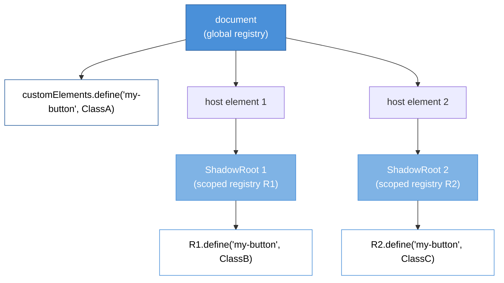

# [FEE-12001] Scoped Custom Element Registry

:::info
Multiple versions of the same custom element can coexist on one page when each is registered in its own shadow root's local registry, solving the namespace collision problem that has haunted micro-frontend and widget-library integration since custom elements shipped.
:::

:::info Limited availability
Shipping in Chromium and WebKit at time of writing. Firefox tracks implementation. This article covers the proposal and the polyfill pathway until cross-engine availability lands.
:::

## Context

Custom elements arrived in 2016 with a single, document-global `CustomElementRegistry` reachable through `window.customElements`. The registry is a name-to-constructor map that maps tag names like `<my-button>` to the class the browser instantiates when it encounters that tag.

Every custom element definition competes for a single namespace. Calling `customElements.define('my-button', ClassA)` once binds the name for the lifetime of the document. A second `define('my-button', ClassB)` throws a `NotSupportedError`. The registry is final-write-wins-never: the first registration wins permanently.

The global registry was a reasonable default for single-owner pages in 2016. A product that owned its own custom elements had no reason to worry about collisions because it controlled every `define()` call. The assumption that a page has one author held for most production code at the time. The design matched how `document.registerElement`, the pre-standard API, worked. That pre-standard API was itself modeled on framework patterns (Polymer, X-Tag) where components belonged to the application author.

The assumption stopped holding as the web platform matured. Micro-frontend architectures let independent teams deploy features that share a document but do not share build pipelines. Widget and SDK vendors ship embeddable components that coexist with other vendors' components in a host page. Browser extensions inject DOM that must not collide with the page's custom elements. Developer tools, analytics libraries, A/B testing frameworks, and even password managers register custom elements without knowing what the host page has registered. Each of these scenarios breaks the single-author assumption the global registry was designed around.

A concrete version of the problem: a product page embeds two widgets from different vendors, and both ship a `<vendor-button>` custom element with different behavior and internal state. The page loads Vendor A's bundle first, which calls `customElements.define('vendor-button', VendorAButton)`. When Vendor B's bundle loads and calls the same `define`, the registry throws `NotSupportedError`. If Vendor B's code catches the exception and continues, every `<vendor-button>` in Vendor B's markup renders as an unknown HTML element with no behavior, a blank inline container. If Vendor B does not catch it, the exception can crash Vendor B's initialization entirely, depending on how the bundle is structured. Either way, Vendor B's widget stops working on any page where Vendor A happened to load first.

Before scoped registries, teams worked around this with three mediocre options. Coordinating tag-name prefixes across vendors (`<vendor-a-button>`, `<vendor-b-button>`) has a coordination cost that breaks the moment a third vendor arrives, and third-party SDKs aiming for broad distribution cannot realistically coordinate with every host page they land on. Loading each vendor into an `<iframe>` gets real document-level isolation, but iframes lose shared state with the host page, cost an extra HTTP request per widget, break copy-paste flows, and complicate accessibility and scroll behavior. Versioning tag names on every release (`<vendor-a-button-v12>`, `<vendor-a-button-v13>`) lets two versions coexist, but every version bump becomes a coordinated rename that leaks into analytics identifiers, CSS selectors, and any code that queries by tag name.

The Scoped Custom Element Registry proposal answers the collision problem by making the registry a per-shadow-root concept instead of a per-document concept. A shadow root can carry its own `CustomElementRegistry`, created with `new CustomElementRegistry()`. The constructor-lookup inside that shadow root checks the scoped registry first. Two shadow roots on the same page can each register `<my-button>` against a different class, and each `<my-button>` inside those shadow roots resolves to its own local definition. The WICG proposal that originated this design (see References) named the option `registry`; the shipped API renamed it to `customElementRegistry` before it landed in any browser, and that is the name used throughout this article and in the runnable example below.

The WHATWG HTML Living Standard section on custom elements describes the scoped registry variant. The `CustomElementRegistry()` constructor (with no arguments) creates a new scoped registry and sets its internal `is scoped` flag to true. The `attachShadow()` options bag accepts a `customElementRegistry` field that points to a `CustomElementRegistry` instance; the shadow root's internal registry is set to that value. Element creation inside the shadow root, whether through the shadow root's own `createElement`, `createElementNS`, or `importNode` methods, or through `document.createElement` with a `customElementRegistry` option, consults the scoped registry first. `CustomElementRegistry.initialize(root)` attaches a registry to a root after creation; the Design Thinking section below covers when that matters.

The proposal moved through WICG for several years before reaching implementer consensus. Early designs explored alternatives: a parallel "scoped registry" namespace that coexisted with the global one, a registry-per-document-fragment approach, and various opt-in flags on `define()`. The shipping design attaches the registry to shadow DOM because shadow DOM already provides the structural isolation boundary that scoped lookups need. Reusing an existing boundary avoided inventing a new scoping primitive, which the proposal authors treat as a guiding design principle.

Implementer readiness varies across engines. Safari 26 (September 2025) shipped first, followed by Chrome and Edge 146 (March 2026) after a staged rollout that introduced the constructor, then the `attachShadow` option, then the shadow-root element-creation methods. Firefox has not shipped scoped custom element registries; the feature is one of the tracked focus areas in Interop 2026, the cross-browser initiative coordinating convergence work across engines.

## Visual



Three independent `my-button` definitions coexist in one document. The global registry binds `ClassA`. Shadow root 1 carries registry R1 which binds `ClassB`. Shadow root 2 carries registry R2 which binds `ClassC`. An element lookup inside shadow root 1 resolves through R1; an element lookup outside any shadow root resolves through the global registry; an element lookup inside shadow root 2 resolves through R2, and none of the three lookups can see the other two registries' definitions.

## Example

With scoped custom element registries, each vendor attaches its widget to a shadow root that carries a local registry instead of relying on the global one. Vendor A defines `<vendor-button>` on its own registry; Vendor B defines the same tag name on a separate registry. Both definitions coexist in the document, each inside its own shadow root, each with its own class, state, and event listeners. Neither vendor needs to know what tag names the other vendor uses internally, and neither needs to rename anything on a future release.

The same pattern extends to a multi-vendor design system. Each vendor publishes components as self-scoping widgets, and the host page stitches them into a layout without touching their internal namespaces. Design tokens and theme variables still flow in through CSS custom properties, which cross shadow DOM boundaries by default, and events still bubble up to the host's listeners; only the element names stay isolated to each shadow root.

The demo below registers two `<vendor-button>` definitions against distinct scoped registries and renders them side by side, proving the definitions do not collide.

```html
<!DOCTYPE html>
<html>
<head><meta charset="utf-8"><title>Scoped Registry Demo</title></head>
<body>
<div id="slot-a"></div>
<div id="slot-b"></div>
<script type="module">
// Vendor A's widget module
class VendorAButton extends HTMLElement {
  connectedCallback() {
    this.innerHTML = '<button style="background:#4A90D9;color:#fff">A</button>';
    this.addEventListener('click', () => console.log('Vendor A clicked'));
  }
}

const registryA = new CustomElementRegistry();
registryA.define('vendor-button', VendorAButton);

const hostA = document.getElementById('slot-a');
const shadowA = hostA.attachShadow({ mode: 'open', customElementRegistry: registryA });
shadowA.innerHTML = '<vendor-button></vendor-button>';

// Vendor B's widget module
class VendorBButton extends HTMLElement {
  connectedCallback() {
    this.innerHTML = '<button style="background:#D94A4A;color:#fff">B</button>';
    this.addEventListener('click', () => console.log('Vendor B clicked'));
  }
}

const registryB = new CustomElementRegistry();
registryB.define('vendor-button', VendorBButton);

const hostB = document.getElementById('slot-b');
const shadowB = hostB.attachShadow({ mode: 'open', customElementRegistry: registryB });
shadowB.innerHTML = '<vendor-button></vendor-button>';
</script>
</body>
</html>
```

Clicking the A button logs "Vendor A clicked"; clicking the B button logs "Vendor B clicked". Both buttons have the same tag name, live in the same document, and do not conflict because each resolves through its own scoped registry. Without scoped registries, the second `define` call on the global registry would throw, and Vendor B's `<vendor-button>` would render as an unknown element.

## Best Practices

Use scoped registries at integration boundaries. A micro-frontend host that composes independently-deployed features should wrap each feature in a shadow root carrying a scoped registry. A widget SDK that runs inside a host page controlled by a different team should create its own scoped registry for its internal custom elements. An in-page module that controls the full document (a single-owner app) does NOT need a scoped registry; the global registry is simpler and correct for that case.

Feature-detect before relying on scoped behavior. The constructor presence check works across all non-supporting engines: `typeof CustomElementRegistry === 'function' && 'define' in CustomElementRegistry.prototype` is true everywhere, but only supporting engines allow `new CustomElementRegistry()` without throwing. The narrower check is a try-catch around the constructor call. If scoped registries are not available, the integration layer should either require the polyfill OR fall back to versioned tag names for the affected components.

Pass the scoped registry through `attachShadow({ mode, customElementRegistry })`. The `customElementRegistry` option is the documented API surface; do NOT monkey-patch `document.createElement` or intercept tag resolution through other means. The `createElement`, `createElementNS`, and `importNode` methods on the shadow root itself honor the scoped registry automatically.

Do not use scoped registries for application-internal encapsulation. If your codebase uses ES modules, module scope already provides the encapsulation you need, and a scoped registry only adds shadow-DOM overhead on top of it. Reserve scoped registries for pages that mix code from separate build pipelines or separate teams.

Pair scoped registries with shadow DOM style isolation. The scoped registry keeps the element definition isolated, but CSS inheritance still flows into the shadow root by default. Use `:host` selectors and `adoptedStyleSheets` to prevent host-page styles from overriding widget styles, or use an explicit `mode: 'closed'` shadow root where appropriate.

Share a scoped registry across multiple shadow roots by passing the same `CustomElementRegistry` instance to multiple `attachShadow` calls. This is the correct pattern when several shadow roots belong to the same logical scope (e.g. a widget with multiple host elements). Each `attachShadow` that uses the shared registry resolves definitions from the same name-to-constructor map.

MUST NOT rely on the global registry from within a scoped shadow root. Code running inside the shadow root that calls `customElements.get('vendor-button')` returns the global definition, not the scoped one. Use the shadow root's local registry reference instead, accessible as `shadowRoot.customElementRegistry` on supporting engines.

## Design Thinking

### Why the platform needed the feature

The 2016 design of custom elements mirrored `document.registerElement`, the pre-standard API that predated it. `document.registerElement` was itself modeled on how web-framework custom-element systems worked in 2013-2015, when tools built directly on the emerging custom-elements primitive, chiefly Polymer and X-Tag, assumed a single-owner page. The global registry matched that mental model.

The mental model changed as custom elements became the portable component primitive. Web Components promised "write once, use anywhere" for UI components: a library could ship a `<fancy-input>` custom element, publish it on npm, and any consumer could use it. That promise only works if two libraries publishing a `<fancy-input>` can coexist. The global registry made that coexistence impossible; the only workaround was coordinating tag names across the entire web, which does not scale.

Micro-frontends made the coexistence problem acute. A page that integrates features from independently-deployed teams is exactly the multi-owner scenario custom elements were not designed for. The platform's pre-existing options, iframes and tag-name coordination, both imposed structural costs on the integration. Scoped registries restore the "portable component" promise by decoupling the component from the global namespace.

Custom elements v1 shipped in 2016 with the single global registry described above. Scoped registries shipped nearly a decade later: Safari 26 in September 2025, then Chrome and Edge 146 in March 2026, with Firefox still unshipped and the feature tracked as an Interop 2026 focus area.

### Design decisions in the proposal

The proposal deliberately limits the scope of what scoping touches. Scoped registries isolate element-definition namespace only; they do not create a new CSS-selector scope, a new focus scope, or a new event-retargeting scope. Those are handled by shadow DOM itself (CSS scoping via `::part` and `:host`, focus via shadow DOM focus boundaries). The scoped registry rides on shadow DOM's existing boundary.

The registry usually attaches when the shadow root is created, through the `customElementRegistry` option on `attachShadow`. A shadow root left without that option uses the document's global registry, so a reader can tell which registry applies straight from the `attachShadow` call.

`CustomElementRegistry.initialize(root)` is the escape hatch for roots that don't get a registry at creation time. It associates a registry with a root whose internal registry is still `null`, walks the root's descendants to set their registry, and attempts to upgrade any matching elements it finds along the way. This is how a shadow root parsed from declarative shadow DOM markup, which has no way to reference a JavaScript object at parse time, can pick up a scoped registry after the fact, and how a shadow root created with `customElementRegistry: null` can be scoped later.

Constructor lookup remains global. If a consumer calls `new VendorButton()` directly, bypassing the shadow root's `createElement`, the element is instantiated against the global registry, which may not have the class registered at all. This is a deliberate limit: the proposal authors did not build a new constructor-resolution path for scoped registries, keeping the implementation surface small. In practice, code inside the shadow root uses the shadow root's `createElement` methods, and code outside the shadow root does not reach into the shadow's element-type system.

The `define` method's collision semantics carry over unchanged. Defining a name already present in the registry throws `NotSupportedError`, whether the registry is global or scoped. Two scoped registries can independently define the same name because they are separate registry objects with separate name-to-constructor maps.

### How the ecosystem bridges the gap

The `@webcomponents/scoped-custom-element-registry` polyfill is the ecosystem's low-level bridge for engines without native support. The polyfill implements the constructor, the `attachShadow` option, and the scoped lookup behavior, and it lives alongside the broader webcomponents polyfill set. Its approach is to intercept `attachShadow` and rewrite element creation inside scoped roots so that tag names resolve to scoped definitions.

The polyfill has documented limitations. CSS rules written against the original tag name inside the shadow root may not match scoped-rewritten elements on certain engines, because the polyfill's rewriting strategy replaces the tag name with a prefixed variant at DOM-construction time. The polyfill's authors recommend using `:host` and part-based selectors rather than tag selectors for scoped elements, which aligns with shadow-DOM best practice anyway. DevTools display the prefixed names rather than the original, making debugging slightly noisier.

`@open-wc/scoped-elements` is the ecosystem's dominant adoption path built on top of that polyfill. It ships a `ScopedElementsMixin` for both plain `HTMLElement` subclasses and Lit (2.x and 3.x) components: a consuming class declares a `scopedElements` map of tag names to classes, and the mixin registers each one on a scoped registry tied to the component's shadow root.

Lit also has a native-spec-aligned path: `@lit-labs/scoped-registry-mixin` adds a `static elementDefinitions` map to a `LitElement` subclass. The consuming class lists the tag names and classes it wants scoped to its own shadow root, and the mixin creates and attaches the registry for that shadow root at render time. Stencil and Angular Elements track the proposal but do not yet ship an equivalent built-in. Stencil compiles component classes into registration calls at build time, so scoped-registry support there requires a build-time signal, a decorator option or a runtime opt-in, that tells Stencil to target a scoped registry instead of the global one. Angular Elements wraps Angular components as custom elements via `createCustomElement` and registers with the global registry by default; a scoped-registry-aware wrapper would need to accept an explicit registry argument.

Frameworks that expose scoped-registry APIs directly in their component model, like Lit's `elementDefinitions` and `@open-wc/scoped-elements`'s `scopedElements`, give consumers a documented, built-in option for multi-owner-safe composition.

### Registry sharing and inheritance

Shadow roots that belong to the same logical scope can share a single scoped registry. Passing the same `CustomElementRegistry` instance to multiple `attachShadow` calls is idiomatic for a widget with multiple host elements, for example a card grid or a tabbed panel, where each host wants the same element definitions available.

Scoped registries do NOT inherit from the global registry. Defining `<my-button>` in the global registry does not make it available inside a scoped root unless the scoped registry also defines it. This is a deliberate design choice: inheritance would reintroduce the name-conflict problem that scoping was designed to solve. A scoped root that wants access to a globally-defined element must look it up through `document.createElement` or import the class and re-register it in the scoped registry.

The non-inheritance rule affects integration patterns. A micro-frontend that uses both the host application's design-system components (registered globally) and its own private components (registered scoped) must either define the design-system components in both registries or create design-system elements through the host document's API rather than the shadow root's API.

### Performance characteristics

Scoped registries have minimal runtime cost. The lookup path inside a shadow root checks the scoped registry before falling back to the global registry, adding a constant-time map lookup per element creation. The memory overhead is one registry object per scoped shadow root, plus its name-to-constructor map.

The main cost is shadow DOM itself. A page with hundreds of scoped shadow roots pays the usual shadow-DOM overhead: extra DOM nodes, extra style-recalculation scope, and extra event-retargeting work. Scoped registries add no cost beyond shadow DOM's own overhead, because the lookup reuses the shadow-DOM boundary that already exists.

Teams profiling a scoped-registry-heavy page should focus on shadow DOM metrics first (shadow-root count, total shadow-tree depth, style recalc time) and only investigate scoped-registry behavior if shadow DOM itself is not the bottleneck.

### Why not declarative registration?

The proposal keeps registration imperative: a script calls `registry.define(name, class)`, rather than a shadow root's template declaring which elements it uses through markup. A declarative alternative was on the table early in the WICG discussion, something like a `<template>` attribute that maps tag names to class references and lets the browser populate the registry automatically.

That approach was discarded for two main reasons. JavaScript classes are the registration unit, and classes cannot live in HTML markup, so a declarative form would need a new syntax for referencing them, duplicating what module imports already do. Existing component libraries also already have imperative registration patterns; forcing a declarative model on them would break years of production code for no clear gain.

The imperative API costs the consumer one extra step, remembering to call `define`, but it lines up with how the ecosystem already registers elements. Framework adapters (Lit, Stencil, Angular Elements) can layer declarative wrappers, like Lit's `elementDefinitions`, on top of the imperative API for their own component definitions.

### Interaction with declarative shadow DOM

Declarative shadow DOM (`<template shadowrootmode>`) has a documented path to a scoped registry: the `shadowrootcustomelementregistry` attribute on the `<template>` element. When the HTML parser encounters that attribute, it leaves the resulting shadow root's registry unset instead of defaulting it to the global registry. The page's script then calls `registry.initialize(shadowRoot)`, which associates the scoped registry with that root and upgrades any custom elements already present in the parsed subtree.

This closes the gap between server-rendered shadow trees and scoped registries. A server can stream a shadow root's markup with `shadowrootcustomelementregistry` set, and the client-side bundle initializes the matching registry once it loads, without the shadow root ever resolving elements through the global registry in between.

## Common Pitfalls

Several patterns look correct but break in scoped-registry-aware code.

**Reaching into a scoped root from outside.** Code that runs on the host page and calls `document.querySelector('vendor-button')` returns only elements that live in the light DOM, not inside any shadow root. A host-page script cannot reach scoped-root-internal elements through global selectors; it must traverse into the shadow root explicitly. This is standard shadow DOM behavior, but scoped registries make it more visible because the scoped-root elements do not exist at all in the global registry's namespace.

**Instantiating via the class constructor.** Calling `new VendorAButton()` directly, without going through the shadow root's `createElement`, creates an element instance whose tag resolution defaults to the global registry. If the class is not registered globally, the element ends up as an unknown HTML element despite having the correct constructor. Always instantiate through the scoped shadow root's `createElement` (or through `document.createElement` with the `customElementRegistry` option on supporting engines).

**Mixing global and scoped definitions for the same name.** A host that defines `<my-button>` globally and then creates a scoped root that also defines `<my-button>` works correctly in supporting engines, but the non-inheritance rule means elements inside the scoped root render the scoped class, while elements outside render the global class. Readers of the code who do not know the scoped root exists will be confused when the same tag name produces different behavior on different parts of the page. Document the boundary explicitly.

**Using scoped registries without shadow DOM.** The API attaches the registry to a shadow root; there is no top-level `document.registerScoped` or equivalent. A page that wants per-module isolation must use shadow DOM to create the boundary. Workarounds that try to scope registrations without shadow DOM (e.g. interception via `MutationObserver`) do not match the native semantics and produce edge cases.

**Expecting CSS selectors to scope with the registry.** Scoped registries isolate the element-definition namespace, not CSS selectors. A `vendor-button { color: red }` rule defined in the host-page stylesheet will not reach into a scoped shadow root (because shadow DOM isolates styles), but inside the scoped root, any `vendor-button` selector matches both scoped and potentially globally-defined elements of that tag. Style scoping is shadow DOM's job, not the registry's.

## Migration Guide

Migrating an existing library or widget from the global registry to a scoped registry follows a consistent pattern.

**Step 1: Inventory current registrations.** List every `customElements.define` call in the codebase and the scope in which it runs. Registrations that happen at module import time (top-level code in an imported module) are the highest-risk: they execute before the integration boundary is set up.

**Step 2: Move registrations inside the integration boundary.** Refactor top-level `customElements.define` calls into a function that runs when the widget initializes. The function accepts the target registry as an argument and calls `registry.define` instead of `customElements.define` (on supporting engines) or falls back to the global registry (on non-supporting engines).

**Step 3: Replace internal `document.createElement` calls.** Inside the widget's shadow tree, swap `document.createElement('vendor-button')` for `shadowRoot.createElement('vendor-button')`. The shadow root's `createElement` resolves through the scoped registry; the document's resolves through the global registry.

**Step 4: Update tag-name queries.** Replace `document.querySelector` calls that look for the widget's elements with `shadowRoot.querySelector` calls. Querying from the document level still works for light-DOM descendants of the host, but returns nothing for elements inside the shadow root.

**Step 5: Test with and without scoped-registry support.** The widget must work identically in both modes. Test in Chromium and WebKit (native support), in a polyfilled environment (polyfill semantics), and with the polyfill explicitly disabled (global-registry fallback).

**Step 6: Document the integration contract.** Publish the widget's expected registry shape. Consumers need to know whether the widget accepts a registry argument, creates its own, or requires the polyfill. Make the contract part of the widget's public API.

## Debugging Notes

Scoped registries change what a developer sees in browser DevTools.

The Elements panel in DevTools displays the tag name as it was registered. Inside a scoped shadow root, a `<vendor-button>` registered on a scoped registry displays as `<vendor-button>` in the panel, the same as a globally-registered element. The panel does not annotate which registry resolved the tag. To determine the registry in use, inspect the shadow root's host element and check `shadowRoot.customElementRegistry` (or the host element's `customElementRegistry`) in the console.

The Console panel's `$0.customElementRegistry` (or `$0.getRootNode().customElementRegistry` for elements inside shadow roots) returns the registry that resolved the element. This is the primary debugging entry point when an element's behavior does not match expectations.

When the polyfill is active, tag names in the Elements panel may appear rewritten. A `vendor-button` inside a polyfilled scoped root shows as `scoped-1-vendor-button` or a similar prefixed form, which is expected polyfill behavior. The rewriting is stable for the lifetime of the registry, so breakpoints and selector queries continue to work, but the visual noise is real.

Source-maps and stack traces reference the class names (`VendorAButton`) rather than the tag names. Stack traces in the console show the class constructor's location in source, not the tag registration site. Breakpoints set on `connectedCallback` fire per-instance, independent of registry scope.

Verifying registry isolation during development is easiest via a tiny probe: attach a shadow root with a scoped registry, attempt to define a name that conflicts with a globally-registered name, and confirm that neither `define` call throws. If the scoped `define` throws, the engine's scoped-registry support is incomplete or the polyfill is not loaded.

A CI-level regression check wraps the probe in an automated test that runs against the project's target browser matrix. Teams that target multiple engines should fail the build if the probe fails on any targeted engine, forcing the integration path to either load the polyfill or degrade to versioned tag names. The probe takes under a millisecond and fits naturally into existing component-library test suites.

## Browser Support and Fallback

At time of writing, MDN reports the `CustomElementRegistry()` constructor as "Limited availability": it ships in Safari 26 (September 2025) and in Chrome and Edge 146 (March 2026), and Firefox has not shipped it yet. Scoped custom element registries are one of the tracked focus areas in Interop 2026, the cross-browser initiative coordinating convergence on features like this one. Readers should verify current support against MDN and caniuse before committing to a production strategy.

Three fallback paths cover the pre-Baseline window:

1. **Polyfill.** Install `@webcomponents/scoped-custom-element-registry` and load it as early as possible in the page lifecycle. The polyfill intercepts `attachShadow` and adds the scoped lookup path. Accept the polyfill's trade-offs (tag-name rewriting, DevTools noise) in exchange for a uniform API across engines.

2. **Versioned tag names.** For integration boundaries you control, have each vendor prefix their tag names with a version string: `<vendor-a-button-v1>`, `<vendor-b-button-v2>`. This works on all engines today but leaks version churn into every consumer that references the tag.

3. **Iframe isolation.** For widgets that cannot tolerate any coordination, `<iframe>` gives each widget its own document and its own global registry. Accept the extra HTTP request, lost host-state sharing, and accessibility friction in exchange for full isolation.

Pick based on the integration's shape. A trusted-first-party micro-frontend can polyfill. A third-party SDK in a browser-diverse consumer base may prefer versioned tag names. A security-sensitive widget with no shared-state need can use iframes.

A hybrid strategy uses native support where available and degrades gracefully where it is not. The widget's initialization code detects scoped-registry support; on supporting engines it creates a scoped registry and registers its classes; on non-supporting engines it falls back to global registration with prefixed tag names. The public API of the widget is the same either way. Host pages do not see the difference. This is the strategy library authors should default to during the Baseline transition window.

The Baseline transition for this feature depends on Firefox's Interop 2026 work landing. Libraries that adopt early can ship a single code path, but the host-page support matrix remains mixed until then. A pragmatic policy: feature-detect at the widget-initialization boundary, and log an observability signal when falling back, so the author can track what portion of real traffic exercises each path. When the observability signal drops below a threshold, the library author can retire the fallback path and require native support.

Observability also matters for detecting polyfill drift. The polyfill is maintained by the webcomponents community and updates track the spec; occasional behavioral divergences from native semantics surface in edge cases. A widget that logs the presence of the polyfill alongside its shadow-root creation gives the author data to correlate bug reports with polyfill versions.

## Related Topics

- [HTML & DOM Proposals Overview](/en/Web%20Platform%20Proposals/HTML%20and%20DOM%20Proposals/12000)
- [Document Picture-in-Picture](/en/Web%20Platform%20Proposals/HTML%20and%20DOM%20Proposals/12002)
- [Speculation Rules](/en/Web%20Platform%20Proposals/HTML%20and%20DOM%20Proposals/12003)

## References

1. [WHATWG HTML Living Standard — custom elements](https://html.spec.whatwg.org/multipage/custom-elements.html#customelementregistry) — normative specification for the `CustomElementRegistry` constructor, the `attachShadow` `customElementRegistry` option, and `initialize()`.
2. [Chrome for Developers — Make custom elements behave with scoped registries](https://developer.chrome.com/blog/scoped-registries) — canonical practitioner explainer covering the `customElementRegistry` option name, `initialize()`, and the declarative-shadow-DOM path; documents the Chrome/Edge 146 (March 2026) launch.
3. [WICG Scoped Custom Element Registries proposal](https://github.com/WICG/webcomponents/blob/gh-pages/proposals/Scoped-Custom-Element-Registries.md) — design proposal explaining motivation and key decisions; predates shipping and uses the option name `registry`, since renamed to `customElementRegistry`.
4. [MDN — `CustomElementRegistry()` constructor](https://developer.mozilla.org/en-US/docs/Web/API/CustomElementRegistry/CustomElementRegistry) — API reference and Baseline availability annotations.
5. [MDN — `CustomElementRegistry.initialize()`](https://developer.mozilla.org/en-US/docs/Web/API/CustomElementRegistry/initialize) — reference for attaching a registry to an existing subtree, including declaratively-created shadow roots.
6. [MDN — `Element.attachShadow()`](https://developer.mozilla.org/en-US/docs/Web/API/Element/attachShadow) — reference for the `customElementRegistry` option accepted by `attachShadow()`.
7. [MDN — `ShadowRoot.customElementRegistry`](https://developer.mozilla.org/en-US/docs/Web/API/ShadowRoot/customElementRegistry) — accessor for reading back the registry attached to a shadow root.
8. [MDN — `CustomElementRegistry.define()`](https://developer.mozilla.org/en-US/docs/Web/API/CustomElementRegistry/define) — `define` method reference covering the collision behavior that applies identically to global and scoped registries.
9. [`@webcomponents/scoped-custom-element-registry` polyfill (webcomponents/polyfills)](https://github.com/webcomponents/polyfills/tree/master/packages/scoped-custom-element-registry) — ecosystem polyfill package for engines without native support.
10. [`@open-wc/scoped-elements`](https://open-wc.org/docs/development/scoped-elements/) — scoping mixin for vanilla `HTMLElement` and Lit components, built on the polyfill.
11. [`@lit-labs/scoped-registry-mixin`](https://www.npmjs.com/package/@lit-labs/scoped-registry-mixin) — Lit mixin exposing a `static elementDefinitions` map for scoping a component's child element names.
