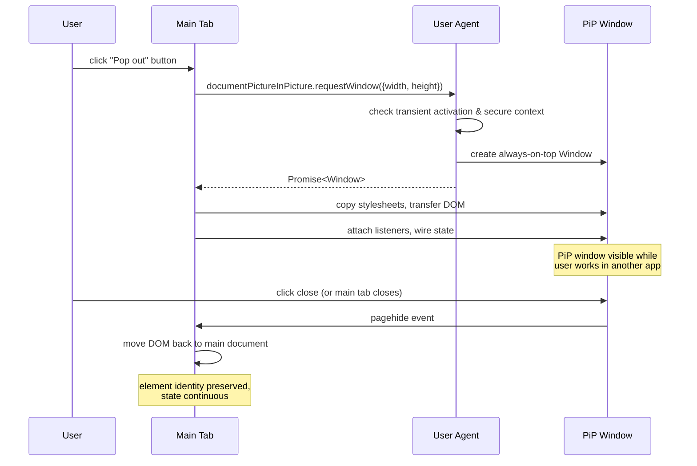

# [FEE-12002] Document Picture-in-Picture

:::info
Put an entire HTML document into a floating, always-on-top window so users can keep a conference grid, a scrubber, or a task list visible while working in another application. The API covers full-document PiP rather than the video-only PiP that preceded it.
:::

:::info Limited availability
Shipping in Chromium-based browsers (Chrome 116+, Edge). Safari and Firefox track implementation. This article covers the proposal, the Chromium implementation, and fallback strategies until cross-engine availability lands.
:::

## Context

The pre-existing `HTMLVideoElement.requestPictureInPicture()` API handled exactly one use case: popping a `<video>` element into a floating always-on-top window. Browsers shipped video PiP in the 2017-2020 window because streaming-media apps drove the demand, and a video element was a tractable scope. A single element, a single playback state, no navigation concerns.

Document Picture-in-Picture widens the scope. `documentPictureInPicture.requestWindow({ width, height })` returns a full `Window` object. The page can append any DOM into its `document` — a participant grid, a chat panel, a code editor, a task list, anything the author wants visible when the user switches focus to another application. The PiP window is not constrained to media; it is a general-purpose always-on-top surface.

The feature lives on `window.documentPictureInPicture` (a global accessor) and is gated behind user activation and secure context. A page that wants to open a PiP window calls `documentPictureInPicture.requestWindow({ width: 400, height: 300 })` inside a click handler or other user-initiated callback; if called without transient activation, the call rejects with `NotAllowedError`. The secure-context requirement means HTTPS-only.

The returned `Window` object is a same-origin browsing context. The page can access it like any other window reference: append stylesheets via `pipWindow.document.head.appendChild(style)`, transfer DOM via `pipWindow.document.body.appendChild(element)`, attach event listeners, read `pipWindow.innerWidth` and `innerHeight`. The PiP window shares the opener's JavaScript heap, so moving an element from the main document to the PiP document does not require serialization — the node's identity and its attached listeners survive the move.

The specification limits what the PiP window can do. The window cannot navigate; setting `location.href` inside the PiP document throws or is ignored. The PiP window cannot enter fullscreen; the fullscreen API is disabled inside it. The website cannot reposition the window programmatically (`moveTo`, `moveBy` are no-ops), because the user agent owns window positioning. The PiP window "never outlives the opening window" — closing the main tab closes the PiP window automatically.

The design sits in the WICG with implementer interest from Chromium. Chrome shipped Document PiP in Chrome 116 on desktop, and the feature has been stable through subsequent releases. Safari's WebKit and Firefox's Gecko track the proposal; at time of writing (April 2026), neither ships the feature unflagged. The proposal itself is mature — the API surface has not changed substantively since Chrome's initial ship — but the cross-engine availability gap keeps the feature in the pre-stable range.

The current spec state no longer includes the `copyStyleSheets` option that early proposal iterations described. Developers must copy stylesheets manually by iterating `document.styleSheets` and either serializing rules into `<style>` tags or cloning `<link rel="stylesheet">` tags into the PiP document. The motivation for removing the option was the observation that most apps want partial stylesheet transfer (scoped to the PiP content) rather than a whole-document mirror; making the copy explicit forces authors to think about which styles cross the boundary.

## Scenario

A video-conferencing web app displays a participant grid, caption overlay, and minimal controls during a call. When the user switches to another application to take notes, the browser tab loses visible space — even with a tiled window manager, the tab's viewport is no longer watching the user's gaze. Without Document PiP, the user either tolerates the invisible call tab or splits screen real estate between the app and the notes.

The video-only PiP from 2018 does not solve this. `HTMLVideoElement.requestPictureInPicture()` can pop a single `<video>` element — perhaps the active speaker's stream — but loses the participant grid, the captions, the raise-hand indicator, and the mute button. The user gets one visible speaker but none of the meeting's contextual state.

With Document Picture-in-Picture, the app constructs a second DOM tree containing the participant grid, captions, and controls, and transfers it to a PiP window. The user's notes app takes primary focus; the participant grid stays visible in a floating always-on-top window. Captions update in real time via the same event streams that update the main tab. The user can mute themselves via the PiP controls without switching focus back to the main tab.

The API shape makes the transfer concrete. The app calls `documentPictureInPicture.requestWindow({ width: 400, height: 300 })` inside the user's click handler on the "pop out" button. The returned `Window` references a blank same-origin document. The app copies its shared stylesheet into the PiP document's `<head>`, then moves the participant-grid element from the main document to `pipWindow.document.body`. The element's event listeners, React state bindings, and video-stream attachments all follow. The main tab's participant-grid slot can either become empty or be replaced with a "viewing in PiP" placeholder.

When the user closes the PiP window — via the window-chrome close button or `pipWindow.close()` — the `pagehide` event fires on the PiP window. The app listens for this event and moves the participant-grid element back to the main document, restoring the in-tab view. Because the element's identity survived the PiP trip, React's reconciliation, the video stream's attachment, and the captions' subscription all continue from where they were; no remount occurs.

## Best Practices

Feature-detect before relying on Document PiP. Check `'documentPictureInPicture' in window` at the point where the feature would be used. Non-supporting engines return `undefined` for the accessor; any code path that calls `documentPictureInPicture.requestWindow` on a non-supporting engine throws `TypeError`.

Call `requestWindow` only inside a user-activated event handler. Spontaneous calls (timer callbacks, microtasks, fetch completion handlers) reject with `NotAllowedError`. The user-activation requirement is a security guard — the browser does not let arbitrary pages pop up always-on-top windows without the user asking for them. UI affordances must be wired to a click, keypress, or other user gesture.

Copy stylesheets manually. Iterate `document.styleSheets`, serialize their `cssRules` into a `<style>` tag, and append that tag to `pipWindow.document.head`. For cross-origin `<link>` stylesheets whose `cssRules` access throws (the security model of cross-origin stylesheets), clone the `<link>` element itself into the PiP head so the PiP window re-fetches the stylesheet. The `copyStyleSheets` spec option no longer exists; the manual pattern is the current canonical approach.

Handle `pagehide` on the PiP window. The event fires when the user closes the PiP window via window chrome, when the main tab closes (which closes the PiP automatically), or when the app calls `pipWindow.close()`. Use `pagehide` as the hook for returning transferred elements to the main document.

Do NOT navigate inside the PiP window. The PiP document cannot be redirected. Any attempt to set `location.href` or submit a form that navigates the PiP document is either ignored or closes the window. Build the PiP content as an imperatively-constructed DOM tree, not as a URL.

Do NOT rely on window positioning. `moveTo`, `moveBy`, and `resizeTo` are user-agent controlled for PiP windows. Request size via the `width` and `height` options at `requestWindow` time; the UA picks final position and may round dimensions.

Provide a fallback UI for non-supporting engines. A "pop out" button that does nothing is a broken UX. On non-supporting engines, either hide the button entirely (feature-detected at render time), or fall back to a detached `window.open()` (which loses always-on-top), or to an in-page floating pane that the user can drag.

Secure the opener relationship. The `disallowReturnToOpener` option, when true, prevents the PiP window from navigating back to the opener. Set this if the PiP content should not be able to redirect the user away from the main tab. For most use cases the default (allow return) is fine, but conference apps that embed untrusted user content may want the stricter setting.

MUST NOT use Document PiP to create notifications, popups, or ads. User agents reject abuse patterns and the always-on-top nature makes intrusive overlays particularly bad UX. The feature is designed for content the user actively wants visible.

## Design Thinking

### Why the platform needed the feature

Video PiP was scoped narrowly because the streaming-media use case dominated the demand curve in 2017-2020. Netflix, YouTube, and video-conferencing products all wanted a way to keep a video visible while the user multitasked, and a single-element API was the minimum viable primitive for that.

The constraint became a bottleneck once web apps evolved into multi-pane surfaces. Video conferencing is the sharpest example: a call is not one video — it is a participant grid, captions, a chat, raise-hand indicators, screen-share previews, and mute controls. The user who popped out a video stream during a call lost all the other context. Live-coding streams face the same problem — a user watching a coding demo wants the code, the output, and the chat, not just the streamer's webcam.

Document PiP generalizes from "one video" to "one document." A document is the unit the page author already structures their UI around, so the API matches the existing programming model. The author does not need to decompose their UI into media elements to use PiP; they can just transfer the relevant subtree.

The spec work took several years from initial proposal to Chrome ship because the design space has real security tension. An always-on-top window that any page can open is a phishing vector — users may believe the PiP window is a system dialog. The spec resolves this with the origin visibility requirement (the PiP window shows the opener's origin in its chrome), the user-activation requirement (the user must have asked), and the no-navigation rule (the PiP cannot be hijacked after open).

### Why not just use window.open()?

`window.open()` with a small-window configuration is the closest pre-PiP primitive. Popups can be shown in tiny windows that float next to the main content. But popups are not always-on-top — focusing another application hides them. Document PiP's always-on-top behavior is the load-bearing difference that makes the API worth introducing.

Window managers on macOS, Windows, and Linux all expose "always on top" as a window property, and desktop apps (Slack, Zoom, OBS) use it routinely. The web platform did not expose it because exposing it naively invites abuse. Document PiP's guardrails (user activation, secure context, origin visibility, single-window-per-tab, no navigation) are the design trade-off that makes always-on-top safe enough to ship on the web.

### API shape decisions

The `requestWindow` method takes a single options dictionary (`{ width, height, disallowReturnToOpener, preferInitialWindowPlacement }`). The dictionary pattern is the modern Web Platform idiom for forward-compatible APIs — new options can be added without breaking existing call sites.

Width and height must be specified together or not at all. Specifying only one throws `RangeError`. The pairing rule avoids the ambiguity of "what do I do with the other dimension" (default to square? preserve aspect ratio?) by forcing the author to think about both. The default (no width/height) lets the user agent pick a reasonable size, which is also a valid and common choice.

`disallowReturnToOpener` is the security guard for embedded third-party content. A page that constructs the PiP content from user-generated input (e.g. a shared note in a collaboration app) can set this flag so the PiP cannot navigate back to the opener's origin. The default is false for backward compatibility and for the common case where the app author trusts the PiP content.

`preferInitialWindowPlacement` is a hint to the user agent about where to place the PiP window. The UA is not obligated to honor it; the flag is a preference, not a command. This reflects the design principle that the user agent owns window placement, not the page.

### How the ecosystem bridges the gap

There is no effective polyfill. The always-on-top behavior is an OS-level window capability that JavaScript cannot simulate. Libraries that claim to "polyfill PiP" either use `window.open()` (losing always-on-top) or render an in-page floating pane (losing OS-level pop-out).

Feature detection is the practical bridge. Apps that want Document PiP where available, and a graceful degradation elsewhere, structure the code to branch at runtime:

- **Supporting engines**: call `documentPictureInPicture.requestWindow`, transfer DOM, wire `pagehide`.
- **Non-supporting engines**: fall back to a floating in-page pane constrained to the main tab's viewport, or hide the pop-out affordance entirely.

Frameworks are just starting to add Document PiP support. React libraries like `react-document-picture-in-picture` and Vue equivalents wrap the lifecycle (requesting, transferring, tearing down) into a component-friendly API. These wrappers let the component tree render into the PiP window via portals, which matches the framework's existing cross-boundary rendering model.

Server-side rendering does not apply — Document PiP is an imperative, runtime-only feature. Apps using SSR must render the PiP content client-side after hydration.

### Interaction with video PiP

Document PiP and video PiP coexist; neither replaces the other. A page can use video PiP for a single-video scenario and Document PiP for multi-element scenarios. The APIs do not compose — a page cannot have both open simultaneously in the same tab; opening a Document PiP when a video PiP is active closes the video PiP first.

Authors migrating from video PiP to Document PiP typically transfer the `<video>` element into the Document PiP window rather than calling video PiP separately. The `<video>` element's identity survives the transfer, so the playback state, the media stream attachment, and any attached listeners continue working. This is the preferred migration because it gives the author control over the PiP surrounding layout (captions, controls, participant info) that video PiP cannot provide.

### Performance considerations

Document PiP runs two documents in the same tab process. Layout and paint happen in both, style recalc happens in both, and JavaScript event loops run in both. The cost scales with PiP content complexity; a participant grid with ten video streams is more expensive than a static text panel.

Teams popping heavyweight content into PiP should profile the pre-PiP and in-PiP states and measure the delta. The common bottleneck is redundant work: the main document keeps updating a participant grid that has been transferred to PiP, wasting CPU on an element that is no longer visible in the main tab.

The mitigation is to pause main-document work for the transferred subtree while the element lives in PiP. A `visibilitychange` listener on the main document does not fire when PiP opens — the main tab is still visible — so the author must signal the transition explicitly. Keep track of whether the element is currently in PiP (a boolean flag set on open, cleared on `pagehide`) and gate the subtree's update loop on that flag.

Video streams in transferred `<video>` elements continue to render at full quality in the PiP window. There is no automatic downgrade. Apps that want to reduce bandwidth during PiP (because the PiP window is small and the full-resolution stream is wasteful) must downsample the stream manually via `applyConstraints` or a server-side stream switch.

### Security model

The PiP window carries the opener's origin in its window chrome, so users can see which site is showing the floating content. This is the primary anti-phishing guard — a page cannot masquerade the PiP window as a system dialog or a different site's UI, because the user agent controls the chrome.

The always-on-top behavior is gated by user activation so that a page cannot surprise the user with a floating window. Browsers also rate-limit PiP requests: a site that opens and closes PiP rapidly is not allowed to keep spawning windows.

The `disallowReturnToOpener` option is a finer-grained guard for apps that embed untrusted content in the PiP window. Set true when the PiP content is user-generated (a shared note, a user-supplied rich text block) to prevent the PiP window from navigating to the opener's origin. This is the PiP equivalent of the `noopener` attribute on `<a>` and `window.open()`.

Permissions Policy (formerly Feature Policy) can restrict or allow PiP in iframed contexts via the `document-picture-in-picture` policy name. Sites that serve embeds in iframes and want those embeds to open PiP must explicitly allow the policy; the default is to deny, which prevents third-party embeds from opening always-on-top windows without the top-frame's consent.

## Visual



The request-to-return lifecycle. The user initiates the transition via activation; the user agent enforces guards; the page receives a Window reference and populates it; when the user or the tab closes the PiP, `pagehide` signals the page to reclaim the transferred DOM.

## Example

A minimal video-conferencing pop-out button. The button transfers a participant-grid container into a PiP window and returns it on close.

```html
<!DOCTYPE html>
<html>
<head>
  <meta charset="utf-8">
  <title>Document PiP Demo</title>
  <style>
    .grid { display: grid; grid-template-columns: 1fr 1fr; gap: 8px; padding: 8px; }
    .tile { background: #222; color: #fff; aspect-ratio: 16/9; border-radius: 4px; }
  </style>
</head>
<body>
<button id="popout">Pop out participant grid</button>
<div id="grid-host">
  <div class="grid">
    <div class="tile">Alice</div>
    <div class="tile">Bob</div>
    <div class="tile">Carol</div>
    <div class="tile">Dave</div>
  </div>
</div>
<script>
const btn = document.getElementById('popout');
const host = document.getElementById('grid-host');

btn.addEventListener('click', async () => {
  if (!('documentPictureInPicture' in window)) {
    alert('Document PiP not supported on this browser');
    return;
  }
  const pipWindow = await documentPictureInPicture.requestWindow({
    width: 400,
    height: 300
  });

  // Copy stylesheets
  [...document.styleSheets].forEach((sheet) => {
    try {
      const css = [...sheet.cssRules].map((r) => r.cssText).join('');
      const style = document.createElement('style');
      style.textContent = css;
      pipWindow.document.head.appendChild(style);
    } catch {
      const link = document.createElement('link');
      link.rel = 'stylesheet';
      link.href = sheet.href;
      pipWindow.document.head.appendChild(link);
    }
  });

  // Move the grid into PiP
  const grid = host.firstElementChild;
  pipWindow.document.body.appendChild(grid);

  // Move it back on close
  pipWindow.addEventListener('pagehide', () => {
    host.appendChild(grid);
  });
});
</script>
</body>
</html>
```

Clicking the button pops a 400x300 always-on-top window containing the participant grid. Closing the PiP window restores the grid to the main document. The element identity is preserved, so attached listeners, state, and (if any) playing media continue seamlessly.

## Fallback Strategy

The feature has no effective polyfill, so apps that target a multi-engine audience need a branching strategy.

**Tier 1: Native Document PiP.** On supporting engines, use the API. This is the preferred path and the UX target.

**Tier 2: `window.open()` popup.** On non-supporting engines that allow non-blocked popups (still user-activated), open a small same-origin window. Transfer content into it the same way. The UX difference is that the window is not always-on-top; focusing another application hides it. This is a visible degradation but still better than nothing for users who can tolerate window-switching.

**Tier 3: In-page floating pane.** On engines where popups are blocked or behave badly, render an in-page draggable pane inside the main tab's viewport. The pane cannot leave the tab, but the user can position it somewhere the viewport's other content does not obscure. Libraries like `react-rnd` provide drag-resize primitives.

**Tier 4: Feature hidden.** For apps where the fallback tiers are worse than nothing, hide the "pop out" button entirely on non-supporting engines. Detect via `'documentPictureInPicture' in window` at render time.

Choose the tier based on user expectations. A video-conferencing app targeting professionals who do video calls all day should implement Tier 1 and consider Tier 2 as a bridge; Tier 3 is a distant fallback because users expect always-on-top behavior. A task-list app with a "float this list" feature that is nice-to-have can ship Tier 4 on non-supporting engines and promote the feature as Chromium-only for now.

## Common Pitfalls

Several patterns look correct but break Document PiP usage in subtle ways.

**Forgetting the user-activation requirement.** Calling `requestWindow` inside a `setTimeout` callback, a `Promise.then` handler that does not originate from a user event, or a WebSocket message handler, all throw `NotAllowedError`. The call must synchronously descend from a user gesture. Apps that want to open PiP in response to a background event (a meeting participant joins) must prompt the user to click a button first.

**Forgetting the secure-context requirement.** Loading a page over plain HTTP and calling `requestWindow` throws. Localhost is treated as a secure context for development purposes, so `http://localhost:3000` works in dev, but a staging environment on a non-HTTPS domain will fail silently. Configure TLS on every environment the PiP path runs in.

**Leaving the transferred element in PiP after close.** A `pagehide` handler that does not return the element to the main document leaves the element orphaned in a window that no longer exists. The next attempt to access the element throws or returns a detached node. Always wire `pagehide` before the transfer, not after.

**Creating a new element instead of transferring.** Constructing a fresh DOM tree inside `pipWindow.document` and filling it with cloned content — rather than transferring the existing element — breaks listener continuity, breaks React state bindings, and breaks `<video>` stream attachment. Transfer the element itself; the node's identity is preserved across the boundary.

**Opening PiP from an iframe.** The user-activation and secure-context checks apply to the frame that calls `requestWindow`. An iframe whose origin differs from the top frame may not be able to open PiP depending on Permissions Policy. If an app relies on iframed embeds, declare `document-picture-in-picture` in the Permissions-Policy header or the iframe's `allow` attribute.

**Assuming the PiP window maintains focus.** The PiP window does not receive or retain focus automatically; focus stays in the main tab or moves to whichever window the user interacts with. Apps that depend on keyboard shortcuts reaching the PiP window must either give it focus explicitly (which is UA-gated) or handle the shortcuts in the main document and forward them.

**Assuming `resizeTo` and `moveTo` work.** The PiP window rejects or ignores repositioning calls. The `resizeTo`/`moveTo` methods return silently on the PiP window. Use the `width` and `height` options at `requestWindow` time; post-open resizing is user-controlled.

**Closing the PiP window incorrectly.** `pipWindow.close()` is the documented way to programmatically close. Do not set `pipWindow.location = 'about:blank'` or remove elements from the PiP document and expect the window to close — it will stay open with an empty body, which is worse UX.

**Exposing sensitive content without considering PiP capture.** The PiP window is capturable in screen-sharing tools and screenshots the same as any other window. Apps that render sensitive content (financial data, private messages) should warn users before popping content out, or use a redacted representation in the PiP window.

## Debugging Notes

DevTools show the PiP window as a separate top-level target. In Chromium DevTools, the PiP window appears in the frame tree alongside the main document; selecting it switches the inspector to the PiP document's DOM.

Console logs written from the main document still appear in the main document's console. Logs written from the PiP document go to the PiP document's console, which is accessible via a separate DevTools instance (right-click in the PiP window → Inspect). Cross-boundary logging is a manual exercise.

Breakpoints set in the main document's source files apply to the main document's execution. If a transferred element's event listener was attached in the main document, the listener's execution shows up in the main document's call stack even when the event fires in the PiP window. Transferred-element reasoning gets easier when the dev thinks of execution context as tied to the script that installed the listener, not the DOM location of the element.

The `pagehide` event can fire for reasons other than window close — page navigation, tab close, browser close. Use the `event.persisted` property to distinguish a close (`persisted` false) from a cache-preserving navigation (`persisted` true). For Document PiP, the non-persisted case is the relevant one.

Chrome DevTools Performance panel captures PiP-window work. When profiling, enable the PiP window's target in the Performance panel's target dropdown. Without explicit target selection, the profile shows only the main document's work and misses the PiP document's frames, layout, and paint costs.

The Memory panel treats the PiP document's objects as attached to the tab's heap. Retained-size analysis includes PiP-resident nodes and their listeners. Heap snapshots before and after a PiP open-close cycle can confirm that transferred elements are fully reclaimed; a leak typically shows up as the transferred subtree still referenced after `pagehide` returned the element to the main document.

For cross-engine verification, test the feature manually in Chrome (native) and in Safari Tech Preview or Firefox Nightly (where the flag may be available). The behavior differences are small at time of writing, but the opener-relationship and window-chrome semantics can vary by engine during the pre-stable period.

Automated end-to-end testing is harder. WebDriver does not yet have a documented way to address the PiP window, so most apps fall back to unit-testing the transfer logic (the side effects of `requestWindow` can be stubbed) and manually verifying the in-browser behavior.

As the feature matures, expect WebDriver and Playwright to add PiP-window targeting so full e2e coverage becomes practical. Until then, the pragmatic strategy is to verify the transfer logic (unit tests) and the PiP-resident behavior (manual tests in a real browser), and accept that cross-boundary behavior lacks automated regression coverage for now.

The lack of automated coverage is another reason to keep the PiP code path narrow. Apps that only use PiP for a single popped-out component can unit-test the transfer and rely on manual regression for the PiP-resident layout.

Apps that want PiP as a general-purpose pop-out for many components should invest in a shared PiP-management utility and unit-test that utility; the individual component surfaces then layer over a tested core.

## Internal References

- FEE-12000 — parent overview for HTML & DOM proposals
- FEE-12001 — prior sub-article (Scoped Custom Element Registry)
- FEE-12003 — next sub-article (Speculation Rules)

## References

1. [WICG Document Picture-in-Picture specification](https://wicg.github.io/document-picture-in-picture/) — normative specification for `documentPictureInPicture.requestWindow` and the returned Window's behavior.
2. [Chrome for Developers — Document Picture-in-Picture](https://developer.chrome.com/docs/web-platform/document-picture-in-picture) — canonical Chrome explainer with shipping version, stylesheet-copy pattern, and use cases.
3. [MDN — Document Picture-in-Picture API](https://developer.mozilla.org/en-US/docs/Web/API/Document_Picture-in-Picture_API) — API reference and Baseline availability annotations.
4. [WICG document-picture-in-picture proposal repository](https://github.com/WICG/document-picture-in-picture) — design history, issue tracker, and implementer feedback.
5. [MDN — `HTMLVideoElement.requestPictureInPicture`](https://developer.mozilla.org/en-US/docs/Web/API/HTMLVideoElement/requestPictureInPicture) — the video-only predecessor that Document PiP generalizes.
