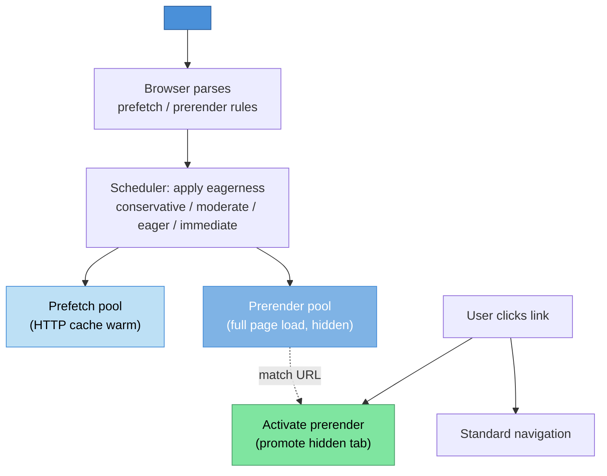

# [FEE-12003] Speculation Rules

:::info
Declaratively tell the browser which links to prefetch or prerender, and how eagerly, via a JSON block in a `<script type="speculationrules">` tag. The API replaces the ad-hoc mix of `<link rel="prefetch">`, `<link rel="prerender">` (removed in 2019), and hand-written hover prefetchers with a single governance surface.
:::

:::warning Limited availability
Shipped in Chromium (Chrome 109+/Edge); Firefox and Safari have not shipped by default — see Context for the per-engine breakdown. This article covers the API, eagerness semantics, and the side-effect guards authors must navigate.
:::

## Context

Prefetching and prerendering are performance wins when the browser can predict the user's next navigation. A page that prefetches the "checkout" page while the user is on "cart" eliminates the network round trip at click time; a page that prerenders the full "checkout" subresource graph eliminates the render cost too. The speed-up is large enough that a fast checkout can measurably reduce cart abandonment, though the exact effect size depends on the site's baseline latency and traffic mix.

Pre-Speculation-Rules primitives provided partial coverage. `<link rel="prefetch" href="/next">` schedules a low-priority network fetch for the resource, which warms the HTTP cache but does not execute scripts or fetch subresources. `<link rel="prerender" href="/next">` (removed from Chromium in 2019) fully loaded the target page, including scripts and network requests. That was powerful but expensive and leak-prone: it ran the full page for links the user might never click, analytics beacons and all, with no way to scale back how eagerly it triggered.

The removal of `<link rel="prerender">` left a gap. Developers wrote ad-hoc JavaScript prefetchers that listened for `mouseenter` on links and issued `<link rel="prefetch">` insertions. The pattern worked but each team reimplemented it, with varying eagerness heuristics (300ms hover threshold, 100ms, no threshold at all) and varying quality. Cross-team consistency was poor, and the platform had no way to express "prerender this page without running its scripts" or "prefetch the HTML only but not the subresources."

Speculation Rules is the post-mortem redesign. A `<script type="speculationrules">` element carries a JSON block that declares which URLs the browser should prefetch, which to prerender, under what conditions (`where` pattern matchers), and with what eagerness. The JSON is declarative: the browser's scheduler chooses when to act, honoring user preferences, data-saver modes, and resource pressure. The API is scoped (same-origin by default for prerender, with explicit opt-in required for same-site cross-origin, and cross-site prerendering unsupported entirely) and gated (intrusive page behaviors are suspended during prerender until the user activates).

The specification has moved from WICG to the HTML Living Standard. The WICG repository at `wicg.github.io/nav-speculation` is now a redirect pointer to the HTML Standard's speculative-loading section. The move reflects that Speculation Rules has reached implementer-consensus maturity at WHATWG, where the editorial work continues.

Shipping status at time of writing: Chrome 109 (January 2023) shipped prefetch and prerender via Speculation Rules using explicit `urls`-list rules. Chrome 121 added the `where` pattern-matcher form and eagerness levels together. Edge follows Chromium. Firefox has not shipped Speculation Rules; Mozilla's formal standards position on the proposal itself is neutral (concerns: complexity), though Firefox is prototyping same-origin prefetch and has taken a positive position on aligning general prefetch behavior. Safari has a flagged implementation, not yet on by default. The cross-engine availability gap keeps the feature in the pre-stable range despite its maturity in Chromium.

The JSON block schema has two top-level keys: `prefetch` and `prerender`. Each value is an array of rule objects. Each rule declares `urls` (an explicit list of URLs, supported since Chrome 109) or `where` (a URL pattern matcher with `href_matches`, `selector_matches`, and `and`/`or`/`not` combinators, supported since Chrome 121), plus an optional `eagerness` with values `conservative`, `moderate`, `eager`, or `immediate`. The `eagerness` governs how aggressively the browser acts: `conservative` acts on click-down, `moderate` on hover-with-delay, `eager` on hover, and `immediate` on rule-registration. The worked example later in this article uses `where` matchers, so it needs Chrome 121 or later; on Chrome 109-120 only the explicit `urls` form works.

Consider a documentation site that measures a 400ms p75 latency for in-site navigation. The user clicks a link, waits 400ms, then sees the new page. The team has already optimized the critical rendering path; the latency is dominated by the network round trip plus initial rendering. A prerender strategy could reduce the observed latency to near-zero because the target page is already rendered before the click.

Without Speculation Rules, the team has three mediocre options. They could write a hover prefetcher in JavaScript that issues `<link rel="prefetch">` at `mouseenter`; this prefetches HTML but does not prerender. They could coordinate with a CDN to prefetch at the edge; this reduces backend cost but does not prerender client-side. They could ship a service worker that cache-warms targets; this reduces cache-miss cost but not the rendering cost.

With Speculation Rules, the team adds a `<script type="speculationrules">` block to the page that declares: prerender any same-origin link the user hovers for 200ms with `eagerness: "moderate"`. The browser handles the rest: it watches for hover-with-delay, prerenders the target page in a hidden tab, runs its scripts, loads its subresources, and holds the rendered result. When the user clicks, the browser activates the prerender: the hidden tab is promoted to visible, the URL bar updates, and the navigation completes in single-digit milliseconds.

The win is real but comes with tradeoffs. Prerendering pages that the user does not navigate to wastes bandwidth and CPU on both the client and server. Analytics beacons fire for prerendered pages by default, polluting funnel metrics. Pages with side-effectful initialization (auto-play video, read receipts, push notification prompts) may fire those effects for never-visited pages, confusing users and servers. Eagerness is the knob that trades certainty of navigation for resource cost; choosing the right level requires knowing the per-page cost and the hit rate.

An e-commerce site's calculus differs from a documentation site's. The e-commerce site's checkout page is expensive to prerender (many subresources, personalization calls, cart-state sync) and its hit rate from the cart page is high. `moderate` eagerness is a good fit: the user who hovers the checkout button is likely to click. A documentation site's article-to-article navigation is cheap to prerender (static HTML, no personalization) and the hit rate per hover is lower; `eager` or even `immediate` on certain curated paths may be appropriate.

## Visual



The browser's pipeline for Speculation Rules. Parse the JSON block; dispatch to the prefetch pool (HTTP-cache warming) or the prerender pool (full hidden page load) according to the rule and eagerness; on user click, either activate a matching prerender or fall back to standard navigation.

## Example

A documentation site adds a Speculation Rules block that prerenders any same-origin link in the main content area when the user hovers for 200ms. Analytics is deferred until activation.

```html
<!DOCTYPE html>
<html>
<head>
  <meta charset="utf-8">
  <title>Docs — Speculation Rules Demo</title>
  <script type="speculationrules">
    {
      "prerender": [
        {
          "where": {
            "and": [
              { "href_matches": "/*" },
              { "selector_matches": "main a[href]" },
              { "not": { "href_matches": "/account/*" } }
            ]
          },
          "eagerness": "moderate"
        }
      ]
    }
  </script>
</head>
<body>
<main>
  <h1>Introduction</h1>
  <p>Read the <a href="/getting-started">getting started guide</a> next.</p>
  <p>Or jump to <a href="/reference">the reference</a>.</p>
</main>
<script>
  // Defer analytics until prerender activation
  if (document.prerendering) {
    document.addEventListener('prerenderingchange', () => {
      trackPageView();
    }, { once: true });
  } else {
    trackPageView();
  }

  function trackPageView() {
    // Send beacon here
    console.log('page view', location.pathname);
  }
</script>
</body>
</html>
```

The `where` matcher targets all same-origin links inside `<main>` except account pages (excluded because account flows may fire state-changing requests). The `moderate` eagerness triggers prerender on a 200ms hover. Analytics defers until the user actually activates the prerender: `document.prerendering` is true during the hidden load, and the `prerenderingchange` event fires on activation.

## Best Practices

Feature-detect before relying on Speculation Rules. Check `HTMLScriptElement.supports('speculationrules')` to verify the browser parses the script type. On non-supporting engines, the `<script type="speculationrules">` block is simply ignored (it does nothing rather than erroring), but feature-detection lets the app log observability signals about the supported-vs-fallback split.

Default to `eagerness: "moderate"` unless you have measured evidence for a different level. `moderate` balances hit rate against over-speculation cost: it triggers on a short hover or pointerdown, so the user has already signaled intent. `conservative` triggers only on click, which defeats most of the prerender benefit but still prefetches. `eager` and `immediate` are for curated paths where the per-page cost is low and the hit rate is high.

Prerender only idempotent same-origin pages by default. Pages that fire side effects on load (email-open tracking, one-time notifications, state-mutating POSTs) must not be prerendered. The `where` matcher's `not` combinator lets you exclude specific URL patterns from prerender while still allowing prefetch. Maintain an explicit excluded-paths list as part of the site's prerender policy.

SHOULD defer analytics beacons until the page is activated. Prerendered pages expose the `document.prerendering` property; code that runs during load can check this and delay beacon emission until a `prerenderingchange` event fires indicating the user activated the prerender. Common analytics libraries are starting to honor this pattern; older libraries require manual wrapping.

Use `<link rel="prefetch">` as fallback for non-supporting engines. A `<script type="speculationrules">` block provides declarative governance on supporting engines; paired with a `<link rel="prefetch">` set for the same URLs, non-supporting engines still warm the HTTP cache (without the prerender win). The combination degrades gracefully.

Provide explicit same-origin opt-out for pages that cannot tolerate prerender. A page whose load handler fires non-idempotent effects should set a `Supports-Loading-Mode` response header or use the `sec-purpose` request-header check to suppress the prerender. The server can distinguish prerender-triggered requests and return a cacheable-but-side-effect-free variant.

MUST NOT rely on cross-origin prerender without the target's explicit opt-in, and MUST NOT expect prerender to work across sites at all. Same-site cross-origin prerender (a different origin on the same registrable domain) requires the target to declare `Supports-Loading-Mode: credentialed-prerender` in the response header. Cross-site prerendering, a genuinely different registrable domain, is not possible regardless of any header, per current browser implementations. The same-site restriction is a security and privacy guard: without it, a same-site but different-origin page could trigger navigation-level effects on the target without its knowledge.

MAY combine Speculation Rules with View Transitions. A prerendered target page is eligible for cross-document view transitions via the `@view-transition` rule; the combination delivers near-instant navigation with animated transitions, which is the platform's answer to SPA-style routing for multi-page apps.

Track speculation hit rate: the fraction of speculated URLs the user actually visits. There is no published universal threshold for what counts as a "good" hit rate; Chrome's own guidance is qualitative: only prerender when there is a high likelihood of the page being navigated to. Measure your own hit rate per page type and tune eagerness against that baseline instead of a borrowed number.

## Design Thinking

### Why the platform needed a post-mortem

`<link rel="prerender">` was removed from Chromium in 2019 for two intertwined reasons: it ran the entire target page, analytics beacons and cookie-setting side effects included, for links the user had not yet clicked, and it offered no eagerness control, so a site could not dial back from "prerender on hover" to something more conservative.

The engineering debrief after the removal identified the core tension. Prerendering is valuable, but the valuable case (signal-strong user intent with low side-effect cost) is narrow, and the dangerous case (signal-weak intent with high side-effect cost) is wide. `<link rel="prerender">` did not distinguish. A post-mortem redesign had to let the page author express the distinction declaratively.

Speculation Rules is that redesign. The JSON block expresses which URLs to act on, with what certainty (eagerness), and under what conditions (pattern matchers). The browser's scheduler can honor or decline the rules based on user preferences (data-saver, battery), device resources (CPU pressure), and privacy posture (incognito mode). The API is explicit about the page's intent while preserving the browser's authority over execution.

The declarative shape is the key design choice. An imperative API (`navigation.speculate(url)`) would have the same side-effect problems: the author declares intent once and the browser acts opaquely. The `<script type="speculationrules">` block is inspectable by the user agent, by DevTools, by security tooling, and by CI lint rules. The declarative shape makes the governance surface auditable.

### The side-effect problem

Prerender fires the full page-load pipeline: scripts run, subresources load, network requests complete. Any of those can have side effects the author did not intend to fire for a prerender:

- Analytics beacons that log a page view.
- Notification-permission prompts (these are UA-gated during prerender, but the prompt code may still execute and queue).
- State-mutating POST requests issued during load.
- Session-cookie updates that change the user's server-side state.
- Read-receipt pings that mark a message as seen.

The spec suspends user-interaction APIs during prerender (fullscreen requests, permission prompts, etc.) so that the user does not see UI from a hidden tab. But it cannot suspend analytics beacons or application-level state mutations: those are indistinguishable from the page's normal load behavior. Authors must detect `document.prerendering` and defer these effects themselves.

The `prerenderingchange` event fires when the user activates the prerender (navigates to it). Deferred analytics should listen for this event and emit at that point. Deferred state mutations should be reviewed for whether they can be delayed until activation or whether they belong on a different endpoint entirely.

### Eagerness as a design surface

The four eagerness values let authors express how much evidence of intent triggers a speculation:

- **`conservative`**: trigger on click-down. This is close to `<link rel="prefetch">` behavior; it uses the brief window between mousedown and click to start the network fetch. Minimal over-speculation cost, minimal benefit.
- **`moderate`**: trigger on pointer-hover-with-delay (200ms) or pointerdown. The user has at least paused to read the link. Balanced default.
- **`eager`**: trigger on pointer-hover (no delay) or focus. Higher hit rate on curated paths; higher over-speculation on exploratory pages.
- **`immediate`**: trigger on rule registration. Appropriate for a handful of high-confidence targets (the next page in a reading series, the primary CTA of a landing page).

The per-engine thresholds (200ms for `moderate`) may shift as engines gather usage data. The author commits to a level, not to a specific threshold; the engine picks the concrete behavior.

### Same-origin vs cross-origin

Prerender is same-origin by default. The page can prerender URLs on the same origin without any opt-in from the target, because the target is the same origin and its security posture is shared. Same-site cross-origin prerender, a different origin on the same registrable domain such as `checkout.example.com` from `shop.example.com`, requires the target to opt in via the `Supports-Loading-Mode: credentialed-prerender` response header, because otherwise a same-site page could trigger cross-origin effects (analytics, state mutation, cookies) on the target without its knowledge. Cross-site prerendering, a genuinely different registrable domain, is not possible at all regardless of any header the target sends.

The opt-in header is the target's consent to being prerendered, with credentials, by a same-site page. A same-site cross-origin page that does not set the header falls back to prefetch (network-only cache warming), which has no execution or side-effect implications.

Prefetch is same-origin by default as well but cross-origin prefetch is less restricted because prefetch only warms the HTTP cache and does not execute scripts or make sub-requests.

### How the ecosystem integrates

Framework routers do not emit Speculation Rules automatically, as of 2026-07. Next.js's `<Link>` component prefetches through its own internal mechanism, not through `<script type="speculationrules">`; Vercel's own "Optimizing hard navigations" guide shows the integration path as a hand-written component that injects the JSON block into the page, typically generated from the router's known routes. Remix's `<Link prefetch>` emits `<link rel="prefetch">` and `<link rel="modulepreload">` tags for a page's assets through its `PrefetchPageLinks` mechanism; that warms the HTTP cache but is not Speculation Rules and does not prerender. A team that wants the prerender benefit inside one of these frameworks has to add the JSON block itself, alongside the framework's built-in `rel=prefetch` behavior as the fallback for non-supporting engines.

Static-site generators are a natural fit for the manual pattern, because they already know the full URL graph at build time. Documentation platforms (VitePress, Docusaurus) can emit a site-wide Speculation Rules block covering the in-site navigation graph without per-page author work. CDNs and edge layers can inject the block centrally too: a worker adds `<script type="speculationrules">` to every HTML response, so policy changes roll out via edge-config updates rather than site rebuilds.

Analytics libraries vary in whether they honor `document.prerendering`. Google Analytics 4's `gtag.js` defers page-view measurement until activation by default. Trackers that skip the check do not: WordPress 6.8's speculative loading defaults to prefetch with conservative eagerness, which warms the cache without running scripts, but operators who switched the configuration to prerender documented Meta Pixel and similar third-party scripts recording page-view events for pages that had only been prerendered and never actually visited, because those scripts fire on load regardless of `document.prerendering`. Before enabling aggressive eagerness, audit which analytics and marketing scripts on the page check the flag and which do not.

## Common Pitfalls

**Prerendering non-idempotent URLs.** A checkout-complete page, an email-open tracker, or a read-receipt endpoint fires state-changing effects. Prerendering such URLs corrupts server-side state and the user's records. Audit the site's URL patterns for non-idempotent endpoints and exclude them via the `where` matcher's `not` clause.

**Forgetting to defer analytics.** An analytics library that fires a beacon on load inflates page-view counts by every prerendered URL, whether or not the user visits. Always wrap beacon emission in a `document.prerendering` check. Monitor analytics dashboards after enabling Speculation Rules; unexplained jumps in page views signal this pitfall.

**Using `immediate` eagerness on many URLs.** `immediate` triggers at rule-registration time, which means the browser starts prerendering on page load. Applying it to a large URL set causes cascading resource consumption. Reserve `immediate` for a handful of high-confidence targets (the next chapter in a reading series, the primary call-to-action of a landing page).

**Cross-origin prerender without opt-in.** Prerendering third-party URLs without their `Supports-Loading-Mode` header falls back silently to prefetch. Authors who assumed cross-origin prerender would work may see no benefit and not understand why. Test with network-panel timing, not with assumption.

**Stale Speculation Rules in SPAs.** Rules registered on initial page load remain active until removed or replaced. An SPA that navigates to a new route via its router should refresh the rules block to match the new page's relevant URLs; otherwise old rules continue triggering speculations for now-irrelevant targets.

**Not respecting `Save-Data`.** Users on constrained connections may send `Save-Data: on`. The browser's scheduler honors this by default, but authors should not emit `immediate`-level rules that assume bandwidth is free. Test the site under throttled conditions to confirm the speculation-rules behavior degrades gracefully.

**Ignoring DevTools Application panel.** Chrome DevTools exposes active speculations in the Application panel under "Speculative Loads." Teams that do not inspect this panel during development miss signals about rules firing too aggressively or matching the wrong URLs.

**Assuming prerender runs JavaScript deterministically.** Prerender runs JavaScript, but some APIs are gated or queued until activation. Code that depends on immediate camera access, notification permission, or geolocation may misbehave. Test the target page as a prerendered surface, not only as a directly-loaded surface.

**Mixing `urls` and `where` in a single rule.** A rule object uses either the explicit `urls` array or the pattern-based `where` matcher; combining both in one rule is invalid and the rule is dropped. If an author needs both explicit URLs and pattern-matched URLs, split them into two rules within the same `prerender` array.

**Leaking sensitive URLs via rules.** Speculation Rules are inline in the HTML source; anyone who views the page source or inspects DevTools can see which URLs the site prerenders. Do not include sensitive URL parameters (session tokens, private identifiers) in rule `urls` lists. Use `where` pattern-matchers that describe shapes without including literal sensitive values.

**Counting on same-page scroll restoration.** A prerendered page does not carry the user's scroll position from the main tab into the activated view: the prerender starts at the top of the target page. Apps that rely on a specific scroll position in the target should use View Transitions or scroll-anchoring mechanisms; do not expect prerender alone to handle this.

## Debugging Notes

Chrome DevTools exposes speculations under Application → Background services → Speculative loads, with Speculative loads, Rules, and Speculations tabs. The Speculations table lists each entry's URL, Action, Rule set, and Status, with status values such as Not triggered, Ready, and Failure.

The Performance panel's navigation timeline shows an activated prerender as a near-instantaneous navigation: the delta between click and render-stable is the observed win. For a precise, API-level signal rather than a visual read, use the `activationStart` timestamp described below.

Logging `document.prerendering` at various script points reveals whether the page is running in a prerender context. This is useful for confirming the feature-detection branch is correct during development.

The `sec-purpose: prefetch` and `sec-purpose: prefetch;prerender` request headers let the server distinguish speculation traffic from real user traffic. Server-side logging should strip or flag these requests to avoid polluting traffic dashboards.

Automated testing of Speculation Rules is possible via Puppeteer's `--enable-features=SpeculationRulesPrerendering` flag; the tool can navigate a page, inspect the Application panel data, and assert that the expected rules fired. The WebDriver Bidi spec is adding first-class support for speculation-state inspection as the feature matures.

Cross-engine testing is currently Chromium-only because only Chromium ships by default. Until Safari and Firefox ship by default, automated cross-engine test coverage for Speculation Rules is not achievable; manual testing on Chrome plus feature-detection in non-supporting engines is the pragmatic strategy.

Performance regression tracking should include prerender hit rate. A sudden drop in hit rate (speculated URLs not being visited) often indicates a regression: perhaps a matcher is now targeting the wrong URLs, or the eagerness was bumped too high. Track this as a Core Web Vitals sibling metric.

The `Navigation` timing entry for an activated prerender records the activation time separately from the usual navigation timings. Page-load timing code that reports LCP or TTI should distinguish activated-prerender navigations from cold-load navigations, since the timing semantics differ substantially. Real-User Monitoring (RUM) libraries that are prerender-aware annotate the entry type; older libraries report the activated navigation as a standard load with suspiciously fast timings.

Checking the `activationStart` timestamp on the `PerformanceNavigationTiming` entry distinguishes a cold navigation (value is 0) from an activated prerender (non-zero, indicates how long the prerender was held before activation). Dashboards split by `activationStart` tell the story of where prerender wins are landing and where the hit rate is lower than expected.

The `sec-purpose` request header combined with Speculation Rules also enables server-side hit-rate measurement. A CDN or origin server can log the count of speculation-triggered requests and compare against the count of real navigations that match those URLs. The ratio is the server-observed hit rate, which can differ from the client-observed one if caching or content-negotiation varies between speculation and activation.

## Fallback Strategy

On non-supporting engines (Safari without the flag enabled, Firefox, older Chromium), the Speculation Rules block is silently ignored. Pages still work; they just do not get the prerender speed-up. Three tiers describe the options, in order of decreasing capability:

**Tier 1: Native Speculation Rules.** Supporting engines parse the JSON block and act on it. This is the target.

**Tier 2: `<link rel="prefetch">` for the same URLs.** Non-supporting engines get cache warming via the old primitive. Emit `<link rel="prefetch" href="...">` for the same URL set alongside the Speculation Rules block; supporting engines prefer the rules block, non-supporting engines fall back to the link tags. The fallback loses the prerender advantage but keeps the network-layer warming.

**Tier 3: Framework-level prefetch.** Next.js `<Link>`, Remix `<Link>`, and similar framework primitives implement hover-triggered prefetch regardless of Speculation Rules support. Relying on the framework's primitive keeps the app portable without per-engine branching.

Choose based on effort budget, not framework marketing. Tier 3 (the framework's built-in hover-prefetch) is free on any Next.js or Remix app today. Tier 1 (native Speculation Rules) requires manually injecting the JSON block, typically generated from the router's route table; see Vercel's "Optimizing hard navigations" guide for the Next.js pattern. As of 2026-07, no major framework router emits Speculation Rules automatically. Apps on bare HTML need to write both Tier 1 and Tier 2 by hand.

## Related Topics

- [HTML & DOM Proposals Overview](/en/Web%20Platform%20Proposals/HTML%20and%20DOM%20Proposals/12000)
- [Scoped Custom Element Registry](/en/Web%20Platform%20Proposals/HTML%20and%20DOM%20Proposals/12001)
- [Document Picture-in-Picture](/en/Web%20Platform%20Proposals/HTML%20and%20DOM%20Proposals/12002)

## References

- WHATWG, "Speculative loading (HTML Standard)," WHATWG (2026). https://html.spec.whatwg.org/multipage/document-sequences.html#prerendering
- Chrome for Developers, "Prerender pages with the Speculation Rules API," developer.chrome.com (2026). https://developer.chrome.com/docs/web-platform/prerender-pages
- MDN Contributors, "Speculation Rules API," MDN Web Docs (2026). https://developer.mozilla.org/en-US/docs/Web/API/Speculation_Rules_API
- MDN Contributors, "The `<script type=speculationrules>` element," MDN Web Docs (2026). https://developer.mozilla.org/en-US/docs/Web/HTML/Element/script/type/speculationrules
- WICG, "nav-speculation proposal repository," GitHub (2026). https://github.com/WICG/nav-speculation
- Umar Hansa, "Blazing Fast Websites with Speculation Rules," DebugBear (2025). https://www.debugbear.com/blog/speculation-rules
- Seresa, "WordPress 6.8 Speculative Loading Is Firing GA4 and Meta Pixel Ghost Visits," Seresa (2026). https://seresa.io/blog/wordpress-tracking/wordpress-6-8-speculative-loading-is-firing-ga4-and-meta-pixel-ghost-visits
- Vercel, "Optimizing hard navigations," Vercel Knowledge Base (2026). https://vercel.com/kb/guide/optimizing-hard-navigations
