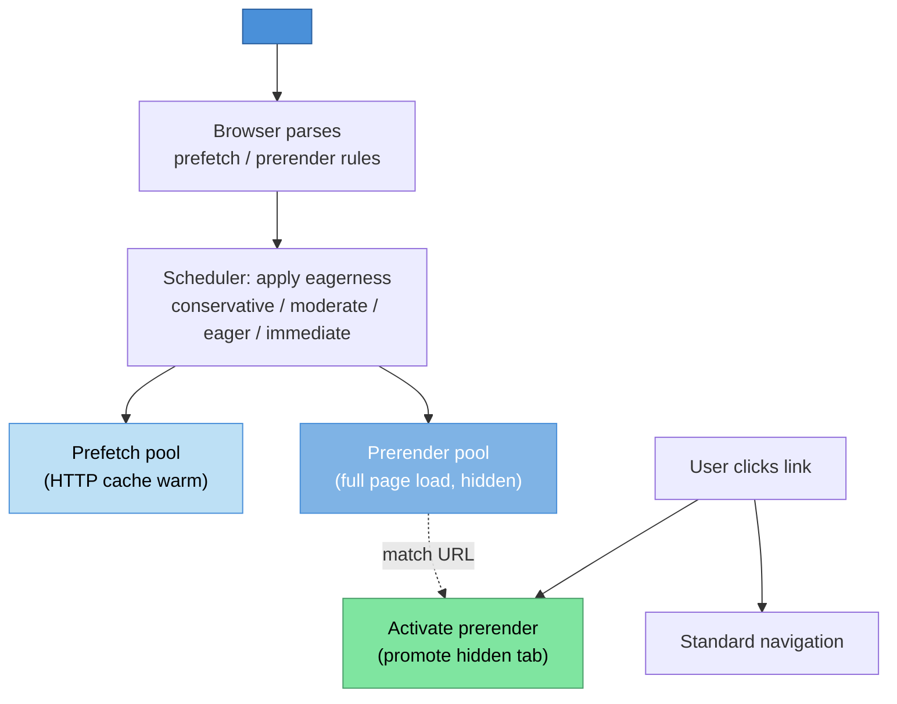

# [FEE-12003] Speculation Rules

:::info
Declaratively tell the browser which links to prefetch or prerender, and how eagerly, via a JSON block in a `<script type="speculationrules">` tag. The API replaces the ad-hoc mix of `<link rel="prefetch">`, `<link rel="prerender">` (removed in 2019), and hand-written hover prefetchers with a single governance surface.
:::

:::info Limited availability
Chromium-based browsers (Chrome 109+, Edge) ship Speculation Rules for prefetch and prerender. Eagerness features landed in Chrome 121. Safari and Firefox track the proposal. This article covers the API, eagerness semantics, and the side-effect guards authors must navigate.
:::

## Context

Prefetching and prerendering are performance wins when the browser can predict the user's next navigation. A page that prefetches the "checkout" page while the user is on "cart" eliminates the network round trip at click time; a page that prerenders the full "checkout" subresource graph eliminates the render cost too. The speed-up can be large enough to convert abandoned-cart rates noticeably.

Pre-Speculation-Rules primitives provided partial coverage. `<link rel="prefetch" href="/next">` schedules a low-priority network fetch for the resource, which warms the HTTP cache but does not execute scripts or fetch subresources. `<link rel="prerender" href="/next">` (removed from Chromium in 2019) fully loaded the target page including scripts and network requests, which was powerful but expensive and leak-prone — it fired analytics beacons, ran side-effectful JavaScript, and consumed bandwidth for pages the user might never visit.

The removal of `<link rel="prerender">` left a gap. Developers wrote ad-hoc JavaScript prefetchers that listened for `mouseenter` on links and issued `<link rel="prefetch">` insertions. The pattern worked but each team reimplemented it, with varying eagerness heuristics (300ms hover threshold, 100ms, no threshold at all) and varying quality. Cross-team consistency was poor, and the platform had no way to express "prerender this page without running its scripts" or "prefetch the HTML only but not the subresources."

Speculation Rules is the post-mortem redesign. A `<script type="speculationrules">` element carries a JSON block that declares which URLs the browser should prefetch, which to prerender, under what conditions (`where` pattern matchers), and with what eagerness. The JSON is declarative — the browser's scheduler chooses when to act, honoring user preferences, data-saver modes, and resource pressure. The API is scoped (same-origin by default for prerender, with explicit opt-in for cross-origin) and gated (intrusive page behaviors are suspended during prerender until the user activates).

The specification has moved from WICG to the HTML Living Standard. The WICG repository at `wicg.github.io/nav-speculation` is now a redirect pointer to the HTML Standard's speculative-loading section. The move reflects that Speculation Rules has reached implementer-consensus maturity at WHATWG, where the editorial work continues.

Shipping status at time of writing: Chrome 109 (December 2022) shipped prefetch and prerender via Speculation Rules. Chrome 121 added eagerness features. Edge follows Chromium. Safari and Firefox track the proposal but do not ship unflagged. The cross-engine availability gap keeps the feature in the pre-stable range despite its maturity in Chromium.

The JSON block schema has two top-level keys: `prefetch` and `prerender`. Each value is an array of rule objects. Each rule declares `urls` (an explicit list of URLs) or `where` (a URL pattern matcher with `href_matches`, `selector_matches`, and `and`/`or`/`not` combinators), plus an optional `eagerness` with values `conservative`, `moderate`, `eager`, or `immediate`. The `eagerness` governs how aggressively the browser acts: `conservative` acts on click-down, `moderate` on hover-with-delay, `eager` on hover, and `immediate` on rule-registration.

## Scenario

A documentation site measures a 400ms p75 latency for in-site navigation — the user clicks a link, waits 400ms, then sees the new page. The team has already optimized the critical rendering path; the latency is dominated by the network round trip plus initial rendering. A prerender strategy could reduce the observed latency to near-zero because the target page is already rendered before the click.

Without Speculation Rules, the team has three mediocre options. They could write a hover prefetcher in JavaScript that issues `<link rel="prefetch">` at `mouseenter`; this prefetches HTML but does not prerender. They could coordinate with a CDN to prefetch at the edge; this reduces backend cost but does not prerender client-side. They could ship a service worker that cache-warms targets; this reduces cache-miss cost but not the rendering cost.

With Speculation Rules, the team adds a `<script type="speculationrules">` block to the page that declares: prerender any same-origin link the user hovers for 200ms with `eagerness: "moderate"`. The browser handles the rest — it watches for hover-with-delay, prerenders the target page in a hidden tab, runs its scripts, loads its subresources, and holds the rendered result. When the user clicks, the browser activates the prerender: the hidden tab is promoted to visible, the URL bar updates, and the navigation completes in single-digit milliseconds.

The win is real but comes with tradeoffs. Prerendering pages that the user does not navigate to wastes bandwidth and CPU on both the client and server. Analytics beacons fire for prerendered pages by default, polluting funnel metrics. Pages with side-effectful initialization (auto-play video, read receipts, push notification prompts) may fire those effects for never-visited pages, confusing users and servers. Eagerness is the knob that trades certainty of navigation for resource cost; choosing the right level requires knowing the per-page cost and the hit rate.

An e-commerce site's calculus differs from a documentation site's. The e-commerce site's checkout page is expensive to prerender (many subresources, personalization calls, cart-state sync) and its hit rate from the cart page is high. `moderate` eagerness is a good fit — the user who hovers the checkout button is likely to click. A documentation site's article-to-article navigation is cheap to prerender (static HTML, no personalization) and the hit rate per hover is lower; `eager` or even `immediate` on certain curated paths may be appropriate.

## Best Practices

Feature-detect before relying on Speculation Rules. Check `HTMLScriptElement.supports('speculationrules')` to verify the browser parses the script type. On non-supporting engines, the `<script type="speculationrules">` block is simply ignored — the block does nothing rather than erroring — but feature-detection lets the app log observability signals about the supported-vs-fallback split.

Default to `eagerness: "moderate"` unless you have measured evidence for a different level. `moderate` balances hit rate against over-speculation cost: it triggers on a short hover or pointerdown, so the user has already signaled intent. `conservative` triggers only on click, which defeats most of the prerender benefit but still prefetches. `eager` and `immediate` are for curated paths where the per-page cost is low and the hit rate is high.

Prerender only idempotent same-origin pages by default. Pages that fire side effects on load (email-open tracking, one-time notifications, state-mutating POSTs) must not be prerendered. The `where` matcher's `not` combinator lets you exclude specific URL patterns from prerender while still allowing prefetch. Maintain an explicit excluded-paths list as part of the site's prerender policy.

SHOULD defer analytics beacons until the page is activated. Prerendered pages expose the `document.prerendering` property; code that runs during load can check this and delay beacon emission until a `prerenderingchange` event fires indicating the user activated the prerender. Common analytics libraries are starting to honor this pattern; older libraries require manual wrapping.

Use `<link rel="prefetch">` as fallback for non-supporting engines. A `<script type="speculationrules">` block provides declarative governance on supporting engines; paired with a `<link rel="prefetch">` set for the same URLs, non-supporting engines still warm the HTTP cache (without the prerender win). The combination degrades gracefully.

Provide explicit same-origin opt-out for pages that cannot tolerate prerender. A page whose load handler fires non-idempotent effects should set a `Supports-Loading-Mode` response header or use the `sec-purpose` request-header check to suppress the prerender. The server can distinguish prerender-triggered requests and return a cacheable-but-side-effect-free variant.

MUST NOT prerender cross-origin pages without explicit opt-in. Cross-origin prerender requires the target to declare `Supports-Loading-Mode: credentialed-prerender` in the response header. This is a security and privacy guard — a malicious page could otherwise trigger navigation-level effects on third-party sites.

MAY combine Speculation Rules with View Transitions. A prerendered target page is eligible for cross-document view transitions via the `@view-transition` rule; the combination delivers near-instant navigation with animated transitions, which is the platform's answer to SPA-style routing for multi-page apps.

Set an analytics dashboard for speculation hit rate. Track the fraction of speculated URLs that the user actually visits. A hit rate below 20% suggests eagerness is too aggressive; above 80% suggests eagerness is too conservative. Tune per-page-type based on the measured distribution.

## Design Thinking

### Why the platform needed a post-mortem

`<link rel="prerender">` was removed from Chromium in 2019 after accumulating a set of intertwined problems. It fired analytics beacons for pages the user never saw, polluting funnel metrics for any site that enabled it naively. It consumed bandwidth and memory for pages that might not be navigated. It ran arbitrary JavaScript from the target, which could set cookies or fire server-side effects that would be confusing when the user had not actually visited. And it provided no eagerness control — the rule was all-or-nothing.

The engineering debrief after the removal identified the core tension. Prerendering is valuable, but the valuable case (signal-strong user intent with low side-effect cost) is narrow, and the dangerous case (signal-weak intent with high side-effect cost) is wide. `<link rel="prerender">` did not distinguish. A post-mortem redesign had to let the page author express the distinction declaratively.

Speculation Rules is that redesign. The JSON block expresses which URLs to act on, with what certainty (eagerness), and under what conditions (pattern matchers). The browser's scheduler can honor or decline the rules based on user preferences (data-saver, battery), device resources (CPU pressure), and privacy posture (incognito mode). The API is explicit about the page's intent while preserving the browser's authority over execution.

The declarative shape is the key design choice. An imperative API (`navigation.speculate(url)`) would have the same side-effect problems — the author declares intent once and the browser acts opaquely. The `<script type="speculationrules">` block is inspectable by the user agent, by DevTools, by security tooling, and by CI lint rules. The declarative shape makes the governance surface auditable.

### The side-effect problem

Prerender fires the full page-load pipeline: scripts run, subresources load, network requests complete. Any of those can have side effects the author did not intend to fire for a prerender:

- Analytics beacons that log a page view.
- Notification-permission prompts (these are UA-gated during prerender, but the prompt code may still execute and queue).
- State-mutating POST requests issued during load.
- Session-cookie updates that change the user's server-side state.
- Read-receipt pings that mark a message as seen.

The spec suspends user-interaction APIs during prerender (fullscreen requests, permission prompts, etc.) so that the user does not see UI from a hidden tab. But it cannot suspend analytics beacons or application-level state mutations — those are indistinguishable from the page's normal load behavior. Authors must detect `document.prerendering` and defer these effects themselves.

The `prerenderingchange` event fires when the user activates the prerender (navigates to it). Deferred analytics should listen for this event and emit at that point. Deferred state mutations should be reviewed for whether they can be delayed until activation or whether they belong on a different endpoint entirely.

### Eagerness as a design surface

The four eagerness values let authors express how much evidence of intent triggers a speculation:

- **`conservative`**: trigger on click-down. This is close to `<link rel="prefetch">` behavior; it uses the brief window between mousedown and click to start the network fetch. Minimal over-speculation cost, minimal benefit.
- **`moderate`**: trigger on pointer-hover-with-delay (200ms) or pointerdown. The user has at least paused to read the link. Balanced default.
- **`eager`**: trigger on pointer-hover (no delay) or focus. Higher hit rate on curated paths; higher over-speculation on exploratory pages.
- **`immediate`**: trigger on rule registration. Appropriate for a handful of high-confidence targets (the next page in a reading series, the primary CTA of a landing page).

The per-engine thresholds (200ms for `moderate`) may shift as engines gather usage data. The author commits to a level, not to a specific threshold; the engine picks the concrete behavior.

### Same-origin vs cross-origin

Prerender is same-origin by default. The page can prerender URLs on the same origin without any opt-in from the target, because the target is the same origin and its security posture is shared. Cross-origin prerender requires the target to opt in via the `Supports-Loading-Mode: credentialed-prerender` response header, because otherwise a malicious page could trigger cross-origin effects (analytics, state mutation, cookies) without the target's knowledge.

The opt-in header is the target's consent to being prerendered with credentials. A cross-origin page that does not set the header falls back to prefetch (network-only cache warming) which has no execution or side-effect implications.

Prefetch is same-origin by default as well but cross-origin prefetch is less restricted because prefetch only warms the HTTP cache and does not execute scripts or make sub-requests.

### How the ecosystem integrates

Framework routers are adopting Speculation Rules. Next.js's `<Link>` component can emit Speculation Rules entries for its prefetch targets on supporting engines, falling back to the framework's existing prefetch logic elsewhere.

Remix's prefetcher supports similar integration. Nuxt and SvelteKit track the pattern. Each framework's adoption path follows the same shape: detect support, emit rules on supporting engines, keep the pre-existing `<link rel="prefetch">` path as fallback.

Static-site generators are a natural fit. Documentation platforms (VitePress, Docusaurus) can emit a site-wide Speculation Rules block that covers the in-site navigation graph. Blog engines can emit rules for the post-index relationship. The SSG's knowledge of the full URL graph makes it easy to generate comprehensive rules without per-page author work.

CDNs and edge layers can inject Speculation Rules centrally. A site using Cloudflare or Fastly can configure a worker to add `<script type="speculationrules">` to every HTML response with site-appropriate defaults. The central configuration means individual pages do not need the block in their templates, and policy changes roll out via edge-config updates rather than site rebuilds.

Analytics libraries are starting to honor `document.prerendering`. Google Analytics 4 defers page-view events until activation. Mixpanel, Amplitude, and similar libraries are adding similar support.

The ecosystem is still adjusting; site operators should audit their analytics library versions and configurations. An out-of-date analytics library that does not check `document.prerendering` will inflate page-view metrics by a factor equal to the prerender-to-activation ratio — sometimes 5x or more for aggressive eagerness settings, which turns a feature launch into a metrics-analysis panic.

## Visual



The browser's pipeline for Speculation Rules. Parse the JSON block; dispatch to the prefetch pool (HTTP-cache warming) or the prerender pool (full hidden page load) according to the rule and eagerness; on user click, either activate a matching prerender or fall back to standard navigation.

## Example

A documentation site adds a Speculation Rules block that prerenders any same-origin link in the main content area when the user hovers for 200ms. Analytics is deferred until activation.

```html
<!DOCTYPE html>
<html>
<head>
  <meta charset="utf-8">
  <title>Docs — Speculation Rules Demo</title>
  <script type="speculationrules">
    {
      "prerender": [
        {
          "where": {
            "and": [
              { "href_matches": "/*" },
              { "selector_matches": "main a[href]" },
              { "not": { "href_matches": "/account/*" } }
            ]
          },
          "eagerness": "moderate"
        }
      ]
    }
  </script>
</head>
<body>
<main>
  <h1>Introduction</h1>
  <p>Read the <a href="/getting-started">getting started guide</a> next.</p>
  <p>Or jump to <a href="/reference">the reference</a>.</p>
</main>
<script>
  // Defer analytics until prerender activation
  if (document.prerendering) {
    document.addEventListener('prerenderingchange', () => {
      trackPageView();
    }, { once: true });
  } else {
    trackPageView();
  }

  function trackPageView() {
    // Send beacon here
    console.log('page view', location.pathname);
  }
</script>
</body>
</html>
```

The `where` matcher targets all same-origin links inside `<main>` except account pages (excluded because account flows may fire state-changing requests). The `moderate` eagerness triggers prerender on a 200ms hover. Analytics defers until the user actually activates the prerender — `document.prerendering` is true during the hidden load, and the `prerenderingchange` event fires on activation.

## Common Pitfalls

**Prerendering non-idempotent URLs.** A checkout-complete page, an email-open tracker, or a read-receipt endpoint fires state-changing effects. Prerendering such URLs corrupts server-side state and the user's records. Audit the site's URL patterns for non-idempotent endpoints and exclude them via the `where` matcher's `not` clause.

**Forgetting to defer analytics.** An analytics library that fires a beacon on load inflates page-view counts by every prerendered URL, whether or not the user visits. Always wrap beacon emission in a `document.prerendering` check. Monitor analytics dashboards after enabling Speculation Rules; unexplained jumps in page views signal this pitfall.

**Using `immediate` eagerness on many URLs.** `immediate` triggers at rule-registration time, which means the browser starts prerendering on page load. Applying it to a large URL set causes cascading resource consumption. Reserve `immediate` for a handful of high-confidence targets (the next chapter in a reading series, the primary call-to-action of a landing page).

**Cross-origin prerender without opt-in.** Prerendering third-party URLs without their `Supports-Loading-Mode` header falls back silently to prefetch. Authors who assumed cross-origin prerender would work may see no benefit and not understand why. Test with network-panel timing, not with assumption.

**Stale Speculation Rules in SPAs.** Rules registered on initial page load remain active until removed or replaced. An SPA that navigates to a new route via its router should refresh the rules block to match the new page's relevant URLs; otherwise old rules continue triggering speculations for now-irrelevant targets.

**Not respecting `Save-Data`.** Users on constrained connections may send `Save-Data: on`. The browser's scheduler honors this by default, but authors should not emit `immediate`-level rules that assume bandwidth is free. Test the site under throttled conditions to confirm the speculation-rules behavior degrades gracefully.

**Ignoring DevTools Application panel.** Chrome DevTools exposes active speculations in the Application panel under "Speculative Loads." Teams that do not inspect this panel during development miss signals about rules firing too aggressively or matching the wrong URLs.

**Assuming prerender runs JavaScript deterministically.** Prerender runs JavaScript, but some APIs are gated or queued until activation. Code that depends on immediate camera access, notification permission, or geolocation may misbehave. Test the target page as a prerendered surface, not only as a directly-loaded surface.

**Mixing `urls` and `where` in a single rule.** A rule object uses either the explicit `urls` array or the pattern-based `where` matcher; combining both in one rule is invalid and the rule is dropped. If an author needs both explicit URLs and pattern-matched URLs, split them into two rules within the same `prerender` array.

**Leaking sensitive URLs via rules.** Speculation Rules are inline in the HTML source; anyone who views the page source or inspects DevTools can see which URLs the site prerenders. Do not include sensitive URL parameters (session tokens, private identifiers) in rule `urls` lists. Use `where` pattern-matchers that describe shapes without including literal sensitive values.

**Counting on same-page scroll restoration.** A prerendered page does not carry the user's scroll position from the main tab into the activated view — the prerender starts at the top of the target page. Apps that rely on a specific scroll position in the target should use View Transitions or scroll-anchoring mechanisms; do not expect prerender alone to handle this.

## Debugging Notes

Chrome DevTools exposes speculations in the Application panel → Background Services → Speculative Loads. Each entry shows the source URL, the target URL, the eagerness, the rule that matched, and the current status (pending, prerendering, prerender-ready, activated, discarded).

The `Performance Insights` panel (Chrome) highlights prerender activations in the navigation timeline. An activated prerender shows as a near-instantaneous navigation; the delta between click and render-stable is the observed win.

Logging `document.prerendering` at various script points reveals whether the page is running in a prerender context. This is useful for confirming the feature-detection branch is correct during development.

The `sec-purpose: prefetch` and `sec-purpose: prefetch;prerender` request headers let the server distinguish speculation traffic from real user traffic. Server-side logging should strip or flag these requests to avoid polluting traffic dashboards.

Automated testing of Speculation Rules is possible via Puppeteer's `--enable-features=SpeculationRulesPrerendering` flag; the tool can navigate a page, inspect the Application panel data, and assert that the expected rules fired. The WebDriver Bidi spec is adding first-class support for speculation-state inspection as the feature matures.

Cross-engine testing is currently Chromium-only because only Chromium ships. Until Safari and Firefox ship, automated cross-engine test coverage for Speculation Rules is not achievable; manual testing on Chrome plus feature-detection in non-supporting engines is the pragmatic strategy.

Performance regression tracking should include prerender hit rate. A sudden drop in hit rate (speculated URLs not being visited) often indicates a regression — perhaps a matcher is now targeting wrong URLs, or the eagerness was bumped too high. Track this as a Core Web Vitals sibling metric.

The `Navigation` timing entry for an activated prerender records the activation time separately from the usual navigation timings. Page-load timing code that reports LCP or TTI should distinguish activated-prerender navigations from cold-load navigations, since the timing semantics differ substantially. Real-User Monitoring (RUM) libraries that are prerender-aware annotate the entry type; older libraries report the activated navigation as a standard load with suspiciously fast timings.

Checking the `activationStart` timestamp on the `PerformanceNavigationTiming` entry distinguishes a cold navigation (value is 0) from an activated prerender (non-zero, indicates how long the prerender was held before activation). Dashboards split by `activationStart` tell the story of where prerender wins are landing and where the hit rate is lower than expected.

The `sec-purpose` request header combined with Speculation Rules also enables server-side hit-rate measurement. A CDN or origin server can log the count of speculation-triggered requests and compare against the count of real navigations that match those URLs. The ratio is the server-observed hit rate, which can differ from the client-observed one if caching or content-negotiation varies between speculation and activation.

## Fallback Strategy

On non-supporting engines (Safari, Firefox, older Chromium), the Speculation Rules block is silently ignored. Pages still work; they just do not get the prerender speed-up. Two fallback tiers cover the gap:

**Tier 1: Native Speculation Rules.** Supporting engines parse the JSON block and act on it. This is the target.

**Tier 2: `<link rel="prefetch">` for the same URLs.** Non-supporting engines get cache warming via the old primitive. Emit `<link rel="prefetch" href="...">` for the same URL set alongside the Speculation Rules block; supporting engines prefer the rules block, non-supporting engines fall back to the link tags. The fallback loses the prerender advantage but keeps the network-layer warming.

**Tier 3: Framework-level prefetch.** Next.js `<Link>`, Remix `<Link>`, and similar framework primitives implement hover-triggered prefetch regardless of Speculation Rules support. Relying on the framework's primitive keeps the app portable without per-engine branching.

Choose based on the framework's capabilities. Apps built on a framework that already emits Speculation Rules on supporting engines (Next.js 14+, Remix 2+) get tiers 1 and 3 for free. Apps built on bare HTML or on frameworks without this support need to emit the tiers manually.

The Baseline transition for Speculation Rules depends on Safari and Firefox shipping. The proposal's maturity in Chromium suggests the blockers are engine-implementation work rather than design disagreement, but the timeline is indefinite.

Teams should treat Speculation Rules as a Chromium-first progressive enhancement for now, with a re-evaluation when Firefox or Safari ship unflagged. The economics of the feature favor early adoption — the latency win on supporting engines is real and the cost of the fallback tiers is minimal, so sites that adopt early pay little and gain measurable wins on Chromium traffic.

Observability during the transition matters. Log the presence of Speculation Rules support per visitor, the rule match rate, the activation rate, and the observed navigation latency split by activated vs cold. The data tells the story of whether the feature is delivering and where tuning effort should go.

Sites that run A/B tests on speculation aggressiveness can refine their eagerness settings empirically. Start with `moderate` globally, measure, then try `eager` on a path-prefix where the cost is low and the hit rate is plausibly high. The space of possible settings is wide, and the right setting is rarely the default.

Internal documentation should capture the chosen settings and the reasoning. A team that picks `eager` on `/docs/*` because the hit rate measured 85% and the pages are cheap should record that decision somewhere durable. When the site's structure evolves or the team changes, the recorded reasoning prevents the setting from becoming an orphan.

Speculation Rules is the first web-platform feature that gives the page author an API surface for "predict and prepare." The paradigm is worth the investment to learn because subsequent proposals (prerender for MPA SPAs with View Transitions, deeper cross-document preloading) will build on the same mental model.

Teams that build fluency with eagerness, same-origin constraints, and analytics deferral now will find subsequent features easier to adopt. Teams that skip Speculation Rules because "Chromium-only" will face a steeper learning curve once cross-engine availability lands and the productivity gap compounds.

The adoption curve for Speculation Rules mirrors earlier platform-predictive features (preconnect, preload). Both of those features shipped in Chromium first, accumulated adoption on Chromium-dominated traffic, and reached cross-engine availability several years later. Speculation Rules sits at a similar early-adoption point, with the same tradeoffs: real wins on supporting engines, small cost for the fallback, and time-to-learn that pays off as the feature matures.

A healthy adoption policy commits to measurement.

Before rollout, baseline the current navigation latency and prefetch strategy. After rollout, measure the delta on Chromium traffic. Keep the baseline instrumented so regressions (misconfigured rules, analytics pollution) can be caught quickly. The feature is one of the more observability-friendly parts of the web platform; take advantage of that.

## Internal References

- FEE-12000 — parent overview for HTML & DOM proposals
- FEE-12001 — first sub-article in this range (Scoped Custom Element Registry)
- FEE-12002 — prior sub-article (Document Picture-in-Picture)

## References

1. [HTML Living Standard — speculative loading](https://html.spec.whatwg.org/multipage/document-sequences.html#prerendering) — normative specification for the `<script type="speculationrules">` parse and the prerender browsing context.
2. [Chrome for Developers — Prerender pages with the Speculation Rules API](https://developer.chrome.com/docs/web-platform/prerender-pages) — canonical Chrome explainer covering eagerness, analytics deferral, and common pitfalls.
3. [MDN — Speculation Rules API](https://developer.mozilla.org/en-US/docs/Web/API/Speculation_Rules_API) — API reference and Baseline availability annotations.
4. [MDN — `<script type="speculationrules">`](https://developer.mozilla.org/en-US/docs/Web/HTML/Element/script/type/speculationrules) — element-level reference with example rule blocks.
5. [WICG nav-speculation proposal repository](https://github.com/WICG/nav-speculation) — design history and issue tracker; notes the move of the editorial work to the HTML Standard.
