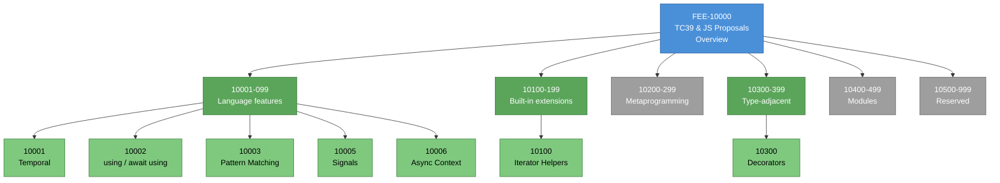

# [FEE-10000] TC39 & JS Proposals Overview

:::info
The JavaScript language ships in stages. Understanding which stage a proposal is at, and which stage makes it safe to adopt in production, is the entry skill for working with modern JavaScript.
:::

:::warning Web Platform Proposals
Articles in the 10000-19999 range cover features that are not yet stable across all major browsers or have not reached TC39 Stage 4. When a proposal ships stable, its article graduates to the appropriate 0-9999 category.
:::

## Context

TC39 is Ecma International's Technical Committee 39, the body that maintains ECMA-262 (the ECMAScript specification) and ECMA-402 (the Internationalization API specification). Delegates from browser vendors, runtime implementers, transpiler authors, and the broader community meet roughly every two months. Decisions are consensus-based: if any delegate blocks a proposal, the proposal does not advance. Proposals are driven by **champions** — individual delegates who shepherd a feature through the multi-stage pipeline, answer committee questions, and maintain the proposal's public GitHub repository.

TC39 is one of several standards bodies that together govern the web platform. The W3C (World Wide Web Consortium) and its Community Groups cover HTML (in partnership with WHATWG), CSS, and many DOM-adjacent APIs. WHATWG (Web Hypertext Application Technology Working Group) owns the HTML Living Standard, DOM, Fetch, and Streams. TC39 owns the JavaScript language itself, separately from the DOM APIs the language can access. A proposal to add a method to `Document.prototype` goes through WHATWG; a proposal to add a method to `Array.prototype` goes through TC39. This separation is occasionally visible at the boundary — for example, the debate over whether `structuredClone` should be a DOM API (WHATWG) or a language primitive (TC39) took real effort to resolve, and the final decision was to keep it in the HTML Living Standard because it depends on platform-specific transferable types.

Membership in TC39 runs through Ecma International, and the committee convenes at plenary meetings (roughly six per year) plus smaller working group sessions between plenaries. Each plenary advances proposals, discusses specification revisions, and handles administrative matters. The committee's decision-making process is codified: proposal advancement requires consensus of delegates present, where consensus means no blocking objection rather than unanimous enthusiasm. Specification editing is a separate role from the champion role; a small group of editors maintains the ECMA-262 prose itself and reviews every proposal's spec text before it merges.

Delegate organizations include the major engine vendors (Google for V8, Mozilla for SpiderMonkey, Apple for JavaScriptCore, Microsoft for ChakraCore historically), the transpiler and tooling teams (Igalia, the Babel team, Bloomberg), and a range of invited expert delegates from academia and the web industry. Each organization assigns one or more named delegates who attend plenaries and vote on advancement. The roster is public; the tc39/Reflector repository records organizational affiliations. This breadth is the mechanism that makes consensus decisions meaningful: a proposal that advances has been scrutinized by representatives of every major JavaScript runtime before it can move forward.

The committee's **code of conduct, IPR policy, and meeting protocols** are all public documents, maintained in the tc39/how-we-work repository. New delegates are onboarded through this documentation and through pair-assignment with a senior delegate. The openness is deliberate: the committee's output is a specification that every browser on Earth implements, and a private process would make that output less trusted. The public meeting notes, public proposals, and public process documentation are how TC39 maintains legitimacy.

The **Stage 0 through Stage 4 pipeline** is the central mechanism. Stage 0 is "strawperson" — any ideation posted in the proposals repository. Stage 1 is "proposal" — the committee accepts the problem statement and agrees it is worth solving. Stage 2 is "draft" — a complete API design with spec text in progress. Stage 2.7, formalized in the process document in late 2023, is "candidate" — spec text is reviewed and approved by editors, and the design is ready for implementation testing. Stage 3 is "candidate" in the engine sense — native implementations and Test262 tests are expected; changes respond to implementer feedback. Stage 4 is "finished" — two shipping implementations pass Test262, the spec text is merged into the editor's draft of ECMA-262, and the feature rolls into the next yearly edition.

The practical reality is that **engine shipping is not locked to stage progression**. V8, SpiderMonkey, and JavaScriptCore ship Stage 3 proposals behind flags, and ship Stage 4 proposals unflagged after a separate per-engine release process. A Stage 4 proposal merged into ECMA-262 in 2025 may still be absent in Safari in early 2026. The usable bar for production adoption therefore requires both Stage 4 **and** cross-engine shipping; Stage 4 by itself is still a partial milestone. The per-engine release timeline is its own tracking surface, which is why MDN, caniuse.com, and the kangax ES compatibility table exist alongside the TC39 repos.

The yearly-release cadence itself was a committee decision forced by a failure. The **ES4 proposal**, an ambitious multi-year effort from 2000 through 2008 to add classes, types, and packages to JavaScript, collapsed when Microsoft and Yahoo refused to support it. ES5, published in 2009, was a much smaller course correction. ES6 (later renamed ES2015) shipped six years later and marked the start of the annual cadence. Since then, every June, Ecma publishes a new edition (ES2016, ES2017, and onward) containing the Stage 4 proposals finalized during that cycle. The current published edition is ES2025; the editor's draft at `tc39.es/ecma262/` reflects the next target edition and contains the most recently merged Stage 4 proposals. The yearly cadence is the reason the corpus of post-ES2015 features exists at all.

The naming convention matters. Each yearly edition is referred to by its year (ES2016, ES2017, ..., ES2025) rather than by a version number like "ES7" or "ES8". The version-numbered form was briefly in vogue in 2016-2017, but the committee standardized on the year-suffix form to avoid confusion and to reinforce the "living evolution" framing. A proposal that reached Stage 4 in 2024 and missed the 2024 edition cutoff lands in ES2025, and so on. The yearly snapshot functions as an archive point that pins a set of merged proposals to a citable year, without any marketing-release ceremony attached.

## Scenario

A team is considering replacing every call site of `new Date()` in a production codebase with the Temporal API. Temporal reached TC39 Stage 4 and is merged into the editor's draft of ECMA-262. It shipped in Firefox 139 (May 2025) and Chrome 144 (January 2026) as unflagged native APIs. Safari has an implementation in progress at the time of writing but has not shipped a stable release. The team wants to adopt Temporal now — the `Date` bugs it fixes (mutability, timezone handling, month-zero indexing, DST-aware duration math) are costing engineering time every month.

The choice collapses to three practical paths. The team can ship the `@js-temporal/polyfill` unconditionally, which works in every engine including Safari, at a cost of roughly 50-100 KB of polyfill code in the bundle. They can ship native Temporal with a conditional polyfill for environments where `typeof Temporal === 'undefined'`, which keeps the bundle light in Firefox and Chrome at the cost of a second code path to maintain and a runtime dynamic import in Safari. They can wait for Safari to ship before starting the migration. Each path has a measurable cost and a user-visible tradeoff.

A fourth path — "transpile to native" — is not available, because Temporal is a runtime API, not new syntax. Transpilers (Babel, SWC) cannot produce a `Temporal.PlainDate` object on a runtime that does not natively define it; they can only rewrite syntax. This distinction — syntax proposals can be transpiled, runtime proposals need polyfills — is the first classification every adoption decision in the 10000s range runs through. This article maps the shape of that decision for every proposal in the range, not only Temporal, and links to per-proposal articles that cover the specific design, migration strategy, and current shipping matrix.

For this team, the numerical cost estimate for each path is worth making explicit. The polyfill-unconditional path adds roughly 50-100 KB compressed to the bundle on every page load in every engine; at a site with 100,000 daily users, that is roughly 5-10 GB of additional daily bandwidth. The native-with-fallback path costs one dynamic `import()` on Safari-only traffic (typically 15-25 % of a general web audience) and a small amount of conditional-loading logic; the bundle cost on Firefox and Chrome is zero. The wait path costs nothing in bytes but accrues an engineering-time cost on every `Date` bug that the team hits before Safari ships. The three costs are not comparable in units, which is why the decision is a judgment call about which costs the team is willing to absorb.

A library author's calculus is different. A library that uses Temporal internally ships its own polyfill payload to every consumer, which is a hard cost to inflict on users whose engines already ship the feature natively. The library-author pattern is typically **peer-dependency with feature detection**: the library expects `Temporal` to exist in the environment, documents the requirement in its README, and lets the consuming application decide whether to load a polyfill. This pushes the adoption decision down to the application layer, where it belongs. The same pattern applies to every runtime proposal a library might want to use: expose the requirement, let consumers handle it. For syntax proposals, library authors generally avoid pre-Stage-3 syntax entirely, because the transpiled output would lock consumers into a specific Babel plugin version.

## Design Thinking

### Why proposals exist as a process at all

The first design question is: why does TC39 run a staged process at all, instead of just merging features into the language when they seem ready? The answer is two constraints that JavaScript alone among major languages has to obey. A comparison with other language communities makes the difference concrete. Rust has a single blessed implementation (rustc), a central team that decides features, and a release train that ships every six weeks. Go is similar, with the Google-led Go team as the sole arbiter. Python has one reference implementation (CPython) that drives the language's evolution, and alternate implementations follow. None of these languages need a staged consensus process because they have one implementer. JavaScript has four major browser engines, each with its own release cadence and its own engineering priorities, plus server runtimes (Node.js, Deno, Bun) that follow the spec but ship at their own pace. TC39's staged process is the mechanism that keeps these independent implementations aligned.

The first constraint is the **post-ES4 lessons**. The ES4 effort was, in retrospect, a negotiated monolithic proposal — a single sweeping version of JavaScript that tried to land classes, a type system, and a module system together. Vendors disagreed on priorities. One vendor could, and did, block the entire effort. The post-mortem was explicit: large, vendor-negotiated, all-at-once specifications are a failure mode for a language with multiple independent implementers. The incremental stage process replaces the monolithic negotiation with small, independent proposals. Each proposal reaches consensus on its own terms. No proposal can block another from advancing, and no implementer has to agree to an entire basket of features at once. Temporal's Stage 4 advancement did not depend on Pattern Matching's Stage 2 negotiation, and vice versa.

The second constraint is the **"don't break the web" rule**. JavaScript is the only runtime in wide use that cannot afford a 2.x major version with backwards-incompatible changes. A 20-year-old page still in a corporate intranet must load and run in a 2026 browser. Every new feature therefore has to be backwards-compatible with all existing JavaScript, including accidental feature detection by existing libraries. This forces several process choices. New syntax must not clash with valid existing syntax (the reason `using` needed a contextual keyword, so that code using `using` as an identifier would still parse). New built-in methods must not shadow properties that popular libraries might have monkey-patched onto `Array.prototype`. Implementers run "Web Compat" investigations before shipping, testing a candidate feature against a large corpus of real-world JavaScript to detect breakage. Features that break too much real-world code are revised or rejected, even late in the process. The `Array.prototype.contains` proposal was renamed to `Array.prototype.includes` specifically because MooTools had an incompatible `contains` method on production pages, and renaming was judged less costly than breaking those pages.

The champion model exists to make this process tractable. A proposal without a champion does not advance, because there is no single person who is responsible for shepherding it through the committee's concerns, maintaining the spec text, and writing the Test262 tests. The champion is typically a delegate from one of the engine vendors, a transpiler team, or a language-facing framework team. Each stage is a checkpoint where the committee confirms that the champion's work has reached the entrance criteria for the next stage, with the champion retaining responsibility across the transition. This is why proposals can sit at Stage 2 for years — advancing requires the champion to do the specification, review, and testing work the next stage demands.

### How the ecosystem bridges the gap

Once a proposal reaches Stage 2 or Stage 3, production adoption is possible through userland tooling. The tooling splits along a line the committee itself drew: syntax proposals versus runtime proposals.

**Syntax proposals** introduce new grammar — new keywords, new declaration forms, new operators. `using` and `await using` (Explicit Resource Management, Stage 3) add new declaration forms. Decorators (Stage 3) add a new class-member annotation syntax. Pattern Matching (Stage 1) proposes a new `match` expression. Syntax proposals cannot be polyfilled by a JavaScript library, because the source code will not parse in engines that do not yet implement the syntax. The ecosystem bridge is transpilation: Babel and SWC ship parser plugins that accept the new syntax and emit ES2015-compatible output. For syntax proposals at Stage 3, the transpiled output is typically stable because the grammar is unlikely to change; at Stage 2, grammar shifts are common and transpilers track them with plugin versions.

**Runtime proposals** introduce new built-in functions, methods, or objects, but no new grammar. Temporal, Iterator Helpers, `Promise.withResolvers`, Array grouping, and Symbols-as-WeakMap-keys are all runtime proposals. Runtime proposals can be polyfilled by a JavaScript library — code that, when loaded, defines the new API on the existing global or prototype if it is not already present. Canonical examples include `@js-temporal/polyfill`, which implements the full Temporal API in userland JavaScript at a measurable bundle-size cost, and the `core-js` package, which bundles polyfills for most post-ES2015 runtime additions. A polyfill adds bytes to the bundle; it does not add a build step.

**Feature detection** for runtime proposals uses `typeof` guards or `in` checks: `if (typeof Temporal !== 'undefined')` or `if ('withResolvers' in Promise)`. Transpilers do not help with feature detection — detection must run at load time in the deployed environment, because the same JavaScript bundle runs across many engine versions. Conditional polyfill loading uses dynamic `import()` after the feature-detection check to keep the polyfill payload out of the bundle for engines that have already shipped the feature:

```js
if (typeof Temporal === 'undefined') {
  await import('@js-temporal/polyfill');
}
// Temporal is now available on this page.
```

**Status sources** are how teams confirm which engines ship what. Kangax's ES compatibility table at `compat-table.github.io/compat-table/` is the community-maintained reference for engine-by-engine feature support, with separate columns for ES2016+, ES2025, and ES Next. The tc39/proposals GitHub repository tracks the current stage of every active proposal. MDN's browser-compat-data repository, consumed by every MDN reference page, tracks per-engine shipping versions for every documented API. The Web Platform Tests Interop project publishes an annual cross-engine compatibility report for a selected set of features. Teams that adopt pre-Stage-4 features monitor these sources the way they monitor dependency release notes.

### Stage criteria in detail

Each stage has specific entrance criteria that must be met before the committee advances a proposal to it, and exit criteria that describe what the proposal looks like when it leaves. Understanding these criteria is what lets a reader predict how stable a given proposal's API surface is at the moment they encounter it.

**Stage 1 (Proposal)** requires a named champion, a problem description, and a public repository. The exit criterion is that the committee has agreed on a preferred solution direction. A Stage 1 proposal can have no spec text, no examples, and no concrete API; the committee is saying "yes, this problem is worth solving" without committing to a specific shape for the solution. Adopting at Stage 1 means accepting that the API might not exist yet or might be radically different by Stage 2.

**Stage 2 (Draft)** requires high-level API design, examples, and initial specification text. Placeholders in the spec text are acceptable at entry. The exit criterion is complete spec text with reviewer and editor sign-off. Stage 2 is where the API surface takes shape: method names, argument orders, error handling, edge-case behavior. Stage 2 proposals can change significantly between plenaries, because the committee is still negotiating concrete design choices. Adopting at Stage 2 means accepting that method names and argument shapes might shift.

**Stage 2.7 (Candidate, spec-ready)** is the newest stage, added to the process in late 2023 to split what had been Stage 3 into two phases. Entrance requires all reviewers and relevant editors to sign off on the current spec text. Exit requires design validation through comprehensive testing and prototype implementations. This stage exists because engine implementers found that "ready for native implementation" (old Stage 3) and "spec is stable" had diverged — spec stability often lagged native implementation attempts, creating churn. Separating the two into Stage 2.7 and Stage 3 gives editors a stable-spec milestone before engines commit to implementation.

**Stage 3 (Candidate, implementer-ready)** requires the proposal to have passed Stage 2.7 validation. The exit criterion is two compatible native implementations passing Test262 tests. Stage 3 is the first stage at which adopting teams can reasonably expect the API to be stable; post-Stage-3 changes do happen, but they are typically narrow and respond to concrete implementer feedback. Browser engines typically ship Stage 3 proposals behind flags or runtime preferences, giving Origin-Trial-style field feedback to the champion before Stage 4.

**Stage 4 (Finished)** requires two shipping implementations that pass Test262, plus the proposal's spec text merged into the ECMA-262 editor's draft. The proposal is "done" from the committee's perspective: the yearly edition will include it, and no further changes from the committee are expected. Per-engine shipping continues on each vendor's release schedule, which is why Stage 4 alone is not yet the production-adoption bar.

### A worked example: Temporal's path through the stages

Temporal's trajectory makes the process concrete. The proposal was first championed by Maggie Pint, Matt Johnson-Pint, Brian Terlson, and Philipp Dunkel; it reached Stage 1 in 2017. The initial spec text took roughly two years to stabilize; the proposal reached Stage 2 in 2018 and Stage 3 in 2021. Stage 3 is where the proposal spent the longest: nearly four years, during which engines implemented it, bugs surfaced, edge cases around DST transitions and ISO calendar arithmetic were clarified, and the polyfill (`@js-temporal/polyfill`, later joined by `temporal-polyfill`) became the reference implementation for early production users.

Stage 4 advancement happened in 2024-2025, in several pieces. The editors split the proposal to separate the core calendar API from the non-ISO calendar systems (Hebrew, Islamic, Chinese, etc.) because the non-ISO calendars needed additional specification work. Firefox shipped Temporal unflagged in version 139 in May 2025. Chrome followed in version 144 in January 2026 after V8 completed its implementation audit. WebKit has an implementation in progress and is expected to ship in 2026, but the Safari release cadence is slower than the Chromium cadence. The champion team continues to maintain the proposal repo, answer spec interpretation questions, and coordinate with the editors on test fixes.

What this trajectory tells a production team is that **the "safe to adopt" line does not coincide with "Stage 4."** Temporal has been usable in production via polyfill since Stage 2, usable with native-plus-polyfill since Stage 3, and usable natively with polyfill fallback since the first engine shipped. The question "when is it safe to use X?" is answered by the adoption path the team chooses; a single committee milestone cannot answer it by itself. A team that ships the polyfill unconditionally has been able to adopt Temporal since 2021; a team that refuses to ship any polyfill bytes has to wait for Safari. Both positions are defensible; they just have different costs.

### The syntax/runtime distinction in practice

Any team planning to adopt a pre-stable proposal first needs to classify it as syntax or runtime, because the classification determines the tooling pipeline.

A **syntax proposal** example: Explicit Resource Management adds the `using` and `await using` declaration forms:

```js
function openResource() {
  using file = openFile('data.json');
  // file.read(...)
  // At block exit, file[Symbol.dispose]() is called automatically.
}
```

For this code to run in an engine that has not yet shipped `using`, a transpiler must rewrite the declaration into a `try { ... } finally { ... }` block that calls `Symbol.dispose` manually. Babel's `@babel/plugin-proposal-explicit-resource-management` does exactly this. The transpiler output runs on every ES2015+ engine. Feature detection is not involved — the transpiled code is the final shape that ships.

A **runtime proposal** example: Temporal adds new global APIs:

```js
const deadline = Temporal.PlainDate.from('2026-12-31');
const daysLeft = deadline.since(Temporal.Now.plainDateISO()).total({ unit: 'day' });
```

A transpiler cannot rewrite this into `Date` arithmetic — the behavior of `Temporal.PlainDate.from` and `Temporal.Now.plainDateISO()` is not expressible as ES2015 code in the general case. Instead, a polyfill library such as `@js-temporal/polyfill` installs `Temporal` as a global. The application code is unchanged; the polyfill runs at load time and makes the global available to everything that follows. Feature-detection and conditional polyfill loading are the optimization paths.

**A proposal can be both.** Decorators are partly syntactic (the `@name` annotation) and partly runtime (the semantics of how decorators compose and the metadata protocol). Adopting Decorators pre-Stage-4 requires both a transpiler plugin and (depending on the surrounding ecosystem) a small runtime helper that implements the metadata protocol. The cost composes: the team is on the hook for the transpiler version pinning, the polyfill bundle size, and the feature-detection logic for parts of the runtime API that may ship before the rest.

### When to adopt a pre-Stage-4 proposal

The practical adoption calculus, condensed to its structure, is a small set of questions.

First, **is this a runtime proposal or a syntax proposal?** Runtime proposals can be polyfilled in userland without a build step; the only cost is bundle size. Syntax proposals require a transpiler, which already exists in most frontend build pipelines but is not free to introduce to a codebase that does not have one. A team with no build pipeline (for example, a team shipping vanilla ES modules directly to the browser) can adopt runtime proposals at Stage 3 with a polyfill and cannot easily adopt syntax proposals at any stage.

Second, **is the spec text stable?** At Stage 3, the spec text is expected to change only in response to implementer feedback; Stage 3 changes are typically small clarifications. At Stage 2, the spec text can change in breaking ways — API surface, method names, and behavior can all shift between committee meetings. Adopting at Stage 2 means accepting the possibility of having to rewrite the adopting code when the proposal advances.

Third, **how many engines ship it, and how does the team handle the gap?** A proposal at Stage 4 shipping in all three engines is a full-stable adoption — no polyfill needed, no conditional logic. A proposal at Stage 4 shipping in two engines requires either a polyfill-fallback code path for the third engine or a decision to let that engine's users see a degraded experience. A proposal at Stage 3 shipping in one engine requires a polyfill (or transpile) plus a path to update when the proposal's spec shifts.

Fourth, **what is the churn cost if the proposal changes or is withdrawn?** Withdrawals after Stage 3 are rare but not unprecedented: the `Array.prototype.contains` rename, the Pipeline Operator's long Stage 1-2 churn, and the original Decorators proposal's multi-year rewrite all generated real costs for early adopters. Teams that adopt early build a debt against the possibility of a rewrite. The cost of that rewrite is proportional to the number of call sites touching the new API.

The articles under 10000-10999 answer these four questions for each specific proposal. This overview gives the framework for reading those articles.

The ordering of the four questions also matters. Classifying runtime vs. syntax first rules out whole classes of options (a transpile-only team cannot adopt syntax proposals; a polyfill-only team cannot adopt syntax proposals without adding a build step). Spec-text stability second filters out Stage 1 and most of Stage 2 for any team that cannot afford churn. Engine shipping third determines the per-engine code paths. Churn cost last sets the overall risk budget. Teams that reverse the ordering — starting from "this is exciting, can we ship it?" — typically discover only late that the first and second questions had obvious answers that would have saved the effort.

## Deep Dive

### Committee mechanics: plenaries, working groups, and consensus

TC39 plenaries run for three days, roughly six times per year, either in person or by teleconference. The agenda is set in advance from a public queue of topics submitted by delegates. Each proposal with an advancement item on the agenda is presented by its champion, followed by discussion and — if advancement is requested — a consensus check. Consensus is defined negatively: a proposal advances unless one or more delegates block. Blocks are rare and usually come with a stated reason that the champion can try to address before a subsequent plenary.

Between plenaries, smaller working groups handle narrower topics. The Editor Group handles ECMA-262 spec editing; the Internationalization Group handles ECMA-402 proposals; the Test262 Group handles the conformance test suite. Working groups meet on shorter schedules (often biweekly or monthly) and surface their output to plenary. A proposal's champion typically interacts with multiple working groups throughout the proposal's lifetime.

The **meeting notes** are public. Every plenary produces published notes in the tc39/notes repository, which is the primary record of committee deliberations. Readers tracking a specific proposal's history can often reconstruct the design debates by reading the relevant meeting notes chronologically. This is useful when an early adopter needs to understand why an API shape changed between Stage 2 and Stage 3, or why a named alternative was rejected.

### Spec editors and the ECMA-262 editor's draft

The ECMA-262 specification is maintained by a small group of editors, currently led by a named editor from a browser-vendor team. Editors are responsible for the prose of the spec: the algorithmic language, the cross-references between sections, the terminology consistency. Editors are not usually the champions of the proposals they edit; the roles are separate. When a proposal advances to Stage 4, the editors merge the proposal's spec text (maintained in a per-proposal repo) into the main ECMA-262 editor's draft at `tc39.es/ecma262/`. The merge is where editorial work happens: cross-references are adjusted, algorithmic steps are normalized against the rest of the spec, and terminology is aligned.

The editor's draft is always ahead of the published yearly edition. A reader consulting the spec should understand which version they are reading. The yearly edition (published each June) is a snapshot of the editor's draft at the time of approval. The editor's draft continues to evolve between editions; proposals that merge between the June cutoff and the next year's cutoff will appear in the next yearly edition rather than the current one.

When a proposal reaches Stage 4 and merges into the editor's draft, the proposal's own spec repository becomes frozen at the merged state. Future updates happen through ECMA-262 editorial issues and pull requests, not through the proposal repo. For readers consulting per-proposal repositories, the repo becomes a historical artifact after Stage 4, and the ECMA-262 editor's draft is the current source of truth. Confusing the two can lead to reading outdated spec text that was current for the proposal but has since been clarified or corrected in the main specification.

### Reading the proposal tracker

The `tc39/proposals` GitHub repository is the canonical tracker. Its README organizes active proposals by stage, with columns for proposal name, champion(s), and links to the per-proposal repository. Reading the tracker efficiently is a small skill worth developing.

**Start at the top of the README.** The Stage 3 section is at the top because Stage 3 proposals are the most likely to affect a team's upcoming work. Each Stage 3 row links to a dedicated repository. The per-proposal README typically has a "Status" section (current stage, last advancement), a "Polyfill" section (if applicable), and a "Implementations" section (which engines ship it, at which versions, behind which flags).

**Scan Stage 2.7 and Stage 2 sections for proposals the team already depends on.** If a library you use has already started using a Stage 2 proposal internally, your codebase is downstream of its churn. Knowing which proposals your dependency tree pulls in is part of maintaining it.

**Check finished-proposals.md for recent graduations.** This file lists Stage 4 proposals with the yearly edition they shipped in (e.g., "ES2024: Promise.withResolvers"). Proposals listed here are merged into the ECMA-262 spec; the remaining question is per-engine shipping. MDN's browser-compat-data is the canonical per-engine shipping reference; the kangax compat-table is the community reference with broader runtime coverage (Node.js versions, Deno, Bun, etc.).

**Do not treat the tracker as a real-time source for every detail.** Stage changes happen at plenaries (roughly six per year); per-engine shipping updates happen at engine release cadence (weekly to monthly). The tracker is authoritative for stage; per-engine shipping requires consulting MDN or caniuse for the current snapshot.

### Withdrawn and stalled proposals

Not every proposal that reaches Stage 2 or 3 advances. Some are withdrawn; some stall for years. Both outcomes represent real costs to anyone who adopted early.

The **Pipeline Operator** (`|>`) is a long-running example. It has moved between Stage 1 and Stage 2 with multiple competing syntax variants (F#-style vs Hack-style, with a smart-mix fallback). Production teams that adopted an early syntax had to migrate when the committee changed direction. The proposal is still alive but has spent nearly a decade in the early stages. Adopting the pipeline operator at Stage 1 in 2018 would have meant multiple code rewrites since.

The **original Decorators proposal**, sometimes called "Stage 2 Decorators," was the initial design for the `@name` syntax on class members. It matured to Stage 2, generated significant ecosystem adoption through TypeScript's `experimentalDecorators` flag, and was then revised and eventually replaced by a new design that is now the Stage 3 proposal. The migration cost for early adopters was substantial: decorator library authors had to rewrite their implementations, TypeScript's decorator output had to change, and every codebase using decorators had to navigate the transition.

The **Observable** proposal is an example of a stall. It reached Stage 1 in 2016, was expected to advance quickly, and has not moved since. The ecosystem worked around the stall by adopting RxJS as the de facto standard; the proposal itself is still technically active but not advancing.

The implications for a team considering early adoption are straightforward. At Stage 1, the API might not exist in any recognizable form a year from now. At Stage 2, the API will probably exist but in a different shape. At Stage 3, shape changes are less likely but still possible. At Stage 4, changes are restricted to editorial corrections. Early adoption is a bet; the further from Stage 4, the bigger the bet.

A reasonable team posture is to track each pre-Stage-4 proposal a team depends on (directly or transitively through libraries) as a line item in the team's technical risk register. Each proposal gets a stage, an adoption status ("not adopted", "adopted via polyfill", "adopted via transpile", "adopted native"), and a rollback plan if the proposal changes significantly or is withdrawn. This explicit tracking is what converts a vague concern ("we're using some preview features") into a specific engineering plan.

## Visual



The blue node is the category overview. Green range nodes are subcategories with at least one drafted article; gray range nodes are reserved for future use. Pale-green leaves are drafted articles in the corpus. Each leaf links to the article that covers the proposal's design, current stage, adoption status, and migration strategy. Readers tracking a specific proposal should go directly to its article; readers surveying the landscape should start with this overview and follow the range-to-leaf structure to find proposals that match their adoption criteria.

The structure is intentionally hierarchical rather than flat. A flat list of ten or fifteen proposals would obscure the natural clustering — language features behave differently from built-in extensions, which behave differently from metaprogramming proposals, which behave differently from module-system proposals. The range-based subcategorization makes those clusters visible at a glance, and the FEE's numbering scheme reserves numerical space in each cluster for future proposals without forcing renumbering of existing articles.

## Tracks in this range

| Range | Topic | Example proposals |
|-------|-------|-------------------|
| 10001-10099 | Language features (syntax, operators, declarations) | Temporal (runtime but classed as a language addition here), `using` / `await using`, Pattern Matching, Signals, Async Context |
| 10100-10199 | Built-in object extensions (Array, Set, Iterator, Promise) | Iterator Helpers, Set methods, Promise combinators |
| 10200-10299 | Metaprogramming & reflection | Reflect additions, Proxy extensions |
| 10300-10399 | Type-adjacent proposals (decorators, type annotations) | Decorators, Decorator Metadata, Type Annotations |
| 10400-10499 | Module system proposals | Import Attributes, Module Expressions, Deferred Import Evaluation |
| 10500-10999 | Reserved | — |

The assignment of specific proposals to ranges uses the overview's reader-facing categorization, not the committee's internal taxonomy. A proposal such as Temporal straddles the language-addition and built-in-extension boundaries; the FEE places it under 10001-10099 because readers approaching it will think of it as a new language feature (a replacement for `Date`) rather than a new method on an existing built-in.

## Graduation

Reaching Stage 4 alone is not the graduation bar for moving an article from 10000-range into the 0-9999 stable range. The practical graduation gate is Stage 4 **and** shipping unflagged in all three major engines: V8 (Chrome and Chromium-based browsers), SpiderMonkey (Firefox), and JavaScriptCore (Safari). A proposal that has reached Stage 4 but is only shipping in one or two engines continues to live under 10000-10999 until the remaining engine ships it. This matches how working developers actually consume new features: a Stage 4 feature that Safari does not yet ship still requires a polyfill or a feature-gated code path in any public-facing production code.

A concrete example is **Sync Iterator Helpers**. Iterator Helpers reached Stage 4 and merged into ECMA-262 in 2025. V8 shipped the feature unflagged in Chrome in 2024 (before the Stage 4 merge, at Stage 3 readiness). SpiderMonkey shipped in Firefox in 2024. JavaScriptCore followed later. Once all three engines had shipped the feature unflagged, the article covering Iterator Helpers became eligible to graduate from 10100 to an appropriate slot in the `JavaScript Core & Runtime` (300-399) range. Until that graduation happens, readers looking up Iterator Helpers can find the article under both its current ID and any redirect the graduation creates.

When a proposal's corresponding article graduates, it is rewritten in place at its new ID under `JavaScript Core & Runtime` (300-399) and the old ID under 10000-10999 is converted into a lightweight redirect. This preserves inbound links from other FEE articles, external blog posts, and search-engine indexes. The git history remains intact across the move. Graduation therefore does not break reader paths — it promotes the content.

The FEE also keeps historical context at the new location. A graduated article's "Context" section should briefly note that the feature was a TC39 proposal in the 10000s range before shipping, and should link back to the redirected placeholder. Later readers debugging a behavior difference between engines sometimes benefit from knowing that a feature shipped at different times in different engines, a property of its proposal-era rollout that persists in edge-case behavior of the now-stable feature. Forgetting the history is a small cost for the vast majority of readers but a real loss for the minority debugging edge cases.

Graduation is not automatic. It is a manual editorial decision triggered by the FEE maintainer confirming cross-engine shipping. For a major feature like Temporal, graduation will involve rewriting the article substantially — removing the "adoption calculus" framing that a 10000-range article uses and replacing it with the full deep-dive structure of a mature topical article. For smaller features like `Promise.withResolvers`, graduation might just move the article and adjust one or two paragraphs.

The FEE does not formally track which proposals are near graduation, because the question is a moving target. A reader curious about what will graduate next should check the intersection of tc39/proposals/finished-proposals.md (Stage 4) and the three-browser shipping matrix on MDN's browser-compat-data. Features on both lists are candidates. Features listed as Stage 4 but missing from one or more engines are not yet candidates, and will remain in the 10000s until the missing engine ships.

## Related FEEs

| FEE | Relationship |
|-----|-------------|
| [FEE-300 JavaScript Core & Runtime](../../JavaScript%20Core%20and%20Runtime/300.md) | The destination category for graduated proposals. Readers who want mature, cross-engine features go here; readers tracking emerging features stay in the 10000s. |
| [FEE-301 Event Loop & Async Model](../../JavaScript%20Core%20and%20Runtime/301.md) | Several proposals in this track (Async Context, Explicit Resource Management) extend the async model directly; a solid grounding in FEE-301 is prerequisite to evaluating them. |
| [FEE-307 ES Modules & Module Systems](../../JavaScript%20Core%20and%20Runtime/307.md) | Module-related proposals in the 10400-10499 range build on the semantics FEE-307 covers. |
| [FEE-308 Iterators, Generators & Async Iteration](../../JavaScript%20Core%20and%20Runtime/308.md) | Iterator Helpers and Async Iterator Helpers build directly on the iteration protocols FEE-308 documents. |
| [FEE-803 Transpilation: Babel, TypeScript Compiler & SWC](../../Build%20Tooling%20and%20Module%20Systems/803.md) | The transpilation pipeline is the userland bridge for syntax proposals; readers adopting Stage 2 or Stage 3 syntax should understand it first. |
| [FEE-11000 CSS Experimental Overview](../CSS%20Experimental/11000.md) | Sibling track: proposals for the web platform's styling language, governed by W3C CSSWG rather than TC39 but sharing the 10000-19999 "pre-stable" shipping conventions. |

## References

- [TC39 Process Document](https://tc39.es/process-document/) — the authoritative specification of what each stage means, entrance criteria, and exit criteria. The Stage 2.7 intermediate stage is defined here.
- [tc39/proposals on GitHub](https://github.com/tc39/proposals) — the central tracker for every active proposal, with current stage, champions, and links to the per-proposal repository.
- [tc39/proposals finished-proposals](https://github.com/tc39/proposals/blob/HEAD/finished-proposals.md) — the list of Stage 4 proposals with their target ECMA-262 edition year.
- [tc39/proposal-temporal](https://github.com/tc39/proposal-temporal) — the reference repository for the Temporal proposal, with shipping status and polyfill packages listed in the README.
- [ECMA-262 Editor's Draft](https://tc39.es/ecma262/) — the living draft of the ECMAScript specification. Stage 4 proposals merge here before rolling into the next yearly edition.
- [ECMA-402 Editor's Draft](https://tc39.es/ecma402/) — the internationalization API companion specification. Some proposals (notably Temporal) span both ECMA-262 and ECMA-402.
- [Test262](https://github.com/tc39/test262) — the official ECMAScript conformance test suite. Stage 4 advancement requires an implementation to pass the relevant Test262 tests.
- [MDN: JavaScript Reference](https://developer.mozilla.org/en-US/docs/Web/JavaScript/Reference) — per-feature documentation with browser-compat-data tables that reflect per-engine shipping status.
- [kangax ES Compat Table](https://compat-table.github.io/compat-table/es2016plus/) — community-maintained cross-engine feature support table covering ES2016 onward, including Stage 3 proposals.
- [Web Platform Tests Interop Project](https://wpt.fyi/interop-2026) — annual cross-engine compatibility scorecard for a selected set of platform features.
- [tc39/how-we-work](https://github.com/tc39/how-we-work) — committee working practices, code of conduct, and IPR policy documentation.
- [tc39/notes](https://github.com/tc39/notes) — public meeting notes for every plenary; useful for reconstructing the history of a specific proposal.
- [@js-temporal/polyfill](https://www.npmjs.com/package/@js-temporal/polyfill) — the canonical production polyfill for Temporal, maintained alongside the proposal.
- [core-js](https://github.com/zloirock/core-js) — the most widely used runtime polyfill aggregator, covering most post-ES2015 built-in proposals.
- [Babel plugin-proposal collection](https://babeljs.io/docs/plugins#proposal) — transpiler plugins for syntax proposals at Stage 2 and above.
- [MDN browser-compat-data](https://github.com/mdn/browser-compat-data) — the data source behind every MDN compatibility table; canonical per-engine shipping version reference.
