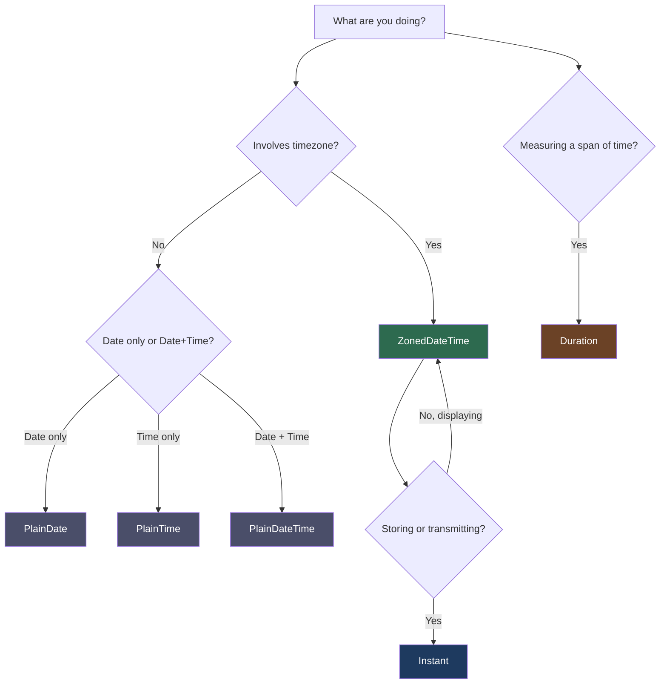

# [FEE-10001] Temporal API — Replacing `Date`

:::info
`Date` has been broken since Netscape Navigator 2. Temporal replaces it with immutable types and first-class IANA timezone support: `ZonedDateTime` carries its zone by construction, and the remaining types are explicitly timezone-free. The proposal reached TC39 Stage 4 in March 2026, and it now ships natively and unflagged in Firefox 139+, Chrome and Edge 144+, and Node.js 26+.
:::

:::warning Web Platform Proposals
Temporal reached TC39 Stage 4 in March 2026 and is slated for the ES2027 edition (it missed the ES2026 snapshot; TC39's finished-proposals table lists its expected publication year as 2027). It ships stable and unflagged in Firefox 139+ (May 2025), Chrome and Edge 144+ (January 2026), and Node.js 26+ (May 2026). Safari has an implementation in Safari Technology Preview only, behind a flag; it is not yet Baseline (supported in all core browsers), so a polyfill (`@js-temporal/polyfill` or `temporal-polyfill`) is still needed for Safari and other older runtimes. Per the category's own graduation policy (see [FEE-10000](10000.md#graduation)), Temporal stays at FEE-10001 until it ships unflagged in all three major engines; it becomes a graduation candidate for `JavaScript Core & Runtime` once Safari ships stable.
:::

## Context

`Date` is one of JavaScript's oldest and most problematic APIs. It was designed in 10 days by Brendan Eich in 1995, copying the design of Java's `java.util.Date`. Java itself deprecated most of that API in Java 1.1 (1997), barely a year after shipping it in Java 1.0.

### The five core problems with `Date`

**1. Month is 0-indexed.** January is `0`, December is `11`. There is no technical justification. It is a bug from Java that was copied into JavaScript and cannot be fixed without breaking the web.

```js
// "What month is this?" — wrong answer every time you forget
const d = new Date(2024, 0, 15); // January 15, not month 0
d.getMonth(); // returns 0, not 1
```

**2. `Date` is mutable.** Every `setXxx()` method mutates the object in place. Pass a `Date` to a library function and it can modify your timestamp out from under you without warning.

```js
const deadline = new Date('2024-12-31');
doSomething(deadline); // library calls deadline.setMonth(6) internally
console.log(deadline); // now July 31 — your deadline is gone
```

**3. No IANA timezone support.** `Date` objects have no timezone. You get local time (whatever the machine's OS says) or UTC. There is no way to work with `America/New_York` or `Asia/Tokyo` as first-class values. Every timezone-aware app either ships a library or writes fragile manual offset math.

**4. Parsing is implementation-dependent.** The behavior of `new Date(string)` is partially standardized and partially left to the engine.

```js
new Date('2020-01-01')       // UTC (ISO 8601 date-only → UTC per spec)
new Date('01/01/2020')       // local time (non-ISO format → implementation)
new Date('Jan 1 2020')       // implementation-dependent
```

Across different environments (Node.js versions, browsers, iOS Safari), the same string can produce different instants.

**5. No duration arithmetic.** There is no built-in `Duration` type. "30 days from now" requires manual millisecond arithmetic. That arithmetic breaks on DST boundaries.

```js
// Wrong: DST transitions can add or remove an hour
const thirtyDays = 30 * 24 * 60 * 60 * 1000;
const future = new Date(Date.now() + thirtyDays);

// Also wrong: this silently gives the wrong hour on DST transition day
const d = new Date();
d.setDate(d.getDate() + 30);
```

### A distributed team hits problem five

A developer is building a calendar app for a distributed team. Meetings need to be displayed in each participant's local timezone. The developer writes:

```js
// Attempt 1: offset math
function toUserTime(utcMs, offsetHours) {
  return new Date(utcMs + offsetHours * 3600 * 1000);
}

const meeting = new Date('2024-03-10T14:00:00Z'); // UTC
const nyDisplay = toUserTime(meeting.getTime(), -5); // "EST is UTC-5"
```

This works fine in winter. Then on March 10 — the day the US switches to Daylight Saving Time — the meeting shows at the wrong hour. New York is UTC-4 after the transition, not UTC-5.

The developer tries to fix it with a hardcoded DST table, discovers the table needs to cover every timezone and every year's rule changes, and finds themselves building a broken version of the IANA timezone database.

The correct fix is `Temporal.ZonedDateTime` with an IANA timezone identifier. Temporal handles DST transitions and calendar arithmetic natively; leap seconds, like in `Date`, are deliberately not represented (a parsed `:60` second is clamped to `:59`). The Example section below resolves this same March 10 meeting correctly.

## Visual



**Quick reference:**

| Scenario | Type |
|----------|------|
| Displaying a meeting to the user | `ZonedDateTime` |
| Storing an event in a database | `Instant` |
| A birthday or holiday (date only) | `PlainDate` |
| Business hours (time only) | `PlainTime` |
| A form's date-time input value | `PlainDateTime` |
| "Add 30 days" or "duration between" | `Duration` |

## Example

A complete worked example for a timezone-aware calendar app. Native Temporal is used where the engine ships it; a polyfill loads only where it is missing:

```js
// Feature-detect and load a polyfill only where Temporal is missing
// (Safari, and any runtime older than Firefox 139 / Chrome 144 / Node.js 26)
// Note: @js-temporal/polyfill deliberately does not install a global Temporal
// object (to avoid shadowing native implementations), so the import must be
// bound to globalThis explicitly.
globalThis.Temporal ??= (await import('@js-temporal/polyfill')).Temporal;

// 0. Resolve the March 10, 2024 meeting from Context correctly
const meeting = Temporal.Instant
  .from('2024-03-10T14:00:00Z')
  .toZonedDateTimeISO('America/New_York');
console.log(meeting.toString());           // "2024-03-10T10:00:00-04:00[America/New_York]"
console.log(meeting.offset);               // "-04:00" — DST resolved automatically

// 1. Get current time as ZonedDateTime
const nowNY = Temporal.Now.zonedDateTimeISO('America/New_York');
console.log(nowNY.toString());
// e.g. "2024-03-15T09:30:00-04:00[America/New_York]"
```

The `[America/New_York]` suffix is the RFC 9557 extension to ISO 8601. It round-trips the IANA zone alongside the UTC offset, so a serialized `ZonedDateTime` keeps the zone identity that a bare offset cannot express.

```js
// 2. Add 30 days using Duration
const thirtyDays = Temporal.Duration.from({ days: 30 });
const futureNY = nowNY.add(thirtyDays);
console.log(futureNY.toString());
// "2024-04-14T09:30:00-04:00[America/New_York]"
// DST-safe: Temporal adjusts the UTC offset automatically

// 3. Convert to Instant for storage
const instant = futureNY.toInstant();
const stored = instant.toJSON(); // ISO 8601 UTC string
console.log(stored);
// "2024-04-14T13:30:00Z"

// 4. Reconstruct ZonedDateTime from stored value
const reconstructed = Temporal.Instant
  .from(stored)
  .toZonedDateTimeISO('America/New_York');
console.log(reconstructed.toString());
// "2024-04-14T09:30:00-04:00[America/New_York]" — exact match

// 5. Cross-timezone comparison: 9am Tokyo vs 9am London
const tokyoMeeting = Temporal.ZonedDateTime.from(
  '2024-06-01T09:00:00+09:00[Asia/Tokyo]'
);
const londonMeeting = Temporal.ZonedDateTime.from(
  '2024-06-01T09:00:00+01:00[Europe/London]'
);

// Compare as Instants to find which is earlier on the timeline
const tokyoInstant  = tokyoMeeting.toInstant();
const londonInstant = londonMeeting.toInstant();

const comparison = Temporal.Instant.compare(tokyoInstant, londonInstant);
// -1 means tokyoMeeting comes first
console.log(comparison); // -1

// How far apart are they?
const gap = tokyoInstant.until(londonInstant);
console.log(gap.toString()); // "PT8H" — Tokyo 9am is 8 hours before London 9am

// Display Tokyo time in London's timezone
const tokyoMeetingInLondon = tokyoMeeting
  .toInstant()
  .toZonedDateTimeISO('Europe/London');
console.log(tokyoMeetingInLondon.toLocaleString('en-GB', { timeZoneName: 'short' }));
// "01/06/2024, 01:00:00 BST"
```

## Best Practices

**Engineers MUST use `Temporal.ZonedDateTime` for any user-facing date/time** that will be displayed, scheduled, or compared across timezones. This is the type that carries a date, a time, and an IANA timezone simultaneously.

```js
const meeting = Temporal.ZonedDateTime.from({
  year: 2024, month: 3, day: 10,
  hour: 14, minute: 0,
  timeZone: 'America/New_York',
});
```

**Engineers MUST use `Temporal.Instant` for database storage and inter-system exchange.** `Instant` is a pure UTC moment with no timezone or calendar. It is the right type to store in a database, put in an API response, or write to a log.

```js
// Store this — not ZonedDateTime
const stored = meeting.toInstant().toJSON(); // "2024-03-10T18:00:00Z"
```

**Engineers SHOULD NOT use `Temporal.PlainDateTime` when timezone is relevant.** `Plain` types exist for timezone-less use cases: form inputs, template scheduling ("every Monday at 9am regardless of where the user is"), and hypothetical future dates before a timezone is known.

**Store dates as `Temporal.Instant.toJSON()` (ISO 8601 string) or `.epochMilliseconds` (number).** Never store `ZonedDateTime` directly to a database. It carries a user-specific timezone that does not belong in your data layer.

```js
// Correct patterns for persistence
const asISO    = instant.toJSON();           // "2024-03-10T18:00:00Z"
const asNumber = instant.epochMilliseconds;  // 1710093600000
```

**Use `Temporal.Now.zonedDateTimeISO()` instead of `new Date()` for current time.**

```js
// Before
const now = new Date();

// After
const now = Temporal.Now.zonedDateTimeISO('America/New_York');
```

**When parsing user input from `<input type="date">`, parse as `PlainDate` then convert to `ZonedDateTime`** with the user's known timezone. `input[type=date]` gives you a string like `"2024-03-10"`: no time, no timezone. Treat it as `PlainDate` first.

```js
const inputValue = '2024-03-10'; // from <input type="date">
const plain = Temporal.PlainDate.from(inputValue);
const zoned = plain.toZonedDateTime({
  timeZone: userTimezone,
  plainTime: Temporal.PlainTime.from({ hour: 9 }),
});
```

**Use `.with()` for partial updates instead of mutation.**

Before:
```js
// Before: mutating Date
const d = new Date(2024, 2, 15);
d.setMonth(5); // mutates d in place
```

After:
```js
// After: immutable Temporal
const d = Temporal.PlainDate.from('2024-03-15');
const updated = d.with({ month: 6 }); // June 15, d is unchanged
```

### Migrating existing `Date` code

Interop between `Date` and Temporal always goes through `Instant`. There is no direct `Date → ZonedDateTime` or `Date → PlainDate` conversion.

```js
// Date → Temporal (two equivalent paths)
const legacyDate = new Date('2024-03-10T18:00:00Z');
const instantA = legacyDate.toTemporalInstant();                  // bridge method the proposal adds to Date.prototype
const instantB = Temporal.Instant.fromEpochMilliseconds(legacyDate.getTime());

// Temporal → Date
const backToDate = new Date(instantA.epochMilliseconds);

// Instant → a specific timezone, once you know which one applies
const zoned = instantA.toZonedDateTimeISO('America/New_York');
```

**Engineers SHOULD prefer `legacyDate.toTemporalInstant()`** over manual epoch-millisecond conversion when migrating existing code. It is the bridge method the proposal itself defines on `Date.prototype`, and it exists natively in Firefox 139+, Chrome and Edge 144+, and Node.js 26+. Under `@js-temporal/polyfill`, this method is not attached automatically; patch it on before calling it: `Date.prototype.toTemporalInstant = toTemporalInstant;` (imported from the polyfill package).

## Design Thinking

### Why `Date` was designed this way

Brendan Eich wrote JavaScript in 10 days in May 1995 to meet a Netscape deadline. Date handling was copied directly from Java's `java.util.Date`, including the 0-indexed months. Java shipped `java.util.Date` in version 1.0 (1996), recognized the design was broken, and deprecated most of its methods in Java 1.1 (1997) in favor of `java.util.Calendar`. JavaScript had no similar escape hatch. The web's backward-compatibility constraint made the bug permanent.

### How the ecosystem compensated

The inadequacy of `Date` created an entire category of third-party date libraries:

| Library | Status | Approach |
|---------|--------|----------|
| Moment.js | Maintenance mode (Sept 2020) | Mutable wrapper, large bundle |
| date-fns | Active | Functional, tree-shakeable |
| day.js | Active | Tiny Moment.js-compatible API |
| Luxon | Active | Immutable, timezone-aware |

Temporal learns from the lessons of Moment.js and Luxon. Maggie Johnson-Pint, a Moment.js maintainer, co-championed the Temporal proposal, and the design draws on the ecosystem's experience with both libraries. The most load-bearing lesson: separating instant-in-time from calendar-date from wall-clock-time into distinct types makes the API self-documenting.

### Temporal's immutability design

Every Temporal type is immutable. Arithmetic operations return new objects; the original is untouched. This is the same design as `String` in JavaScript: you do not mutate a string, you produce a new one.

```js
const date = Temporal.PlainDate.from('2024-01-15');
const nextMonth = date.add({ months: 1 }); // new object: 2024-02-15
console.log(date.toString()); // "2024-01-15" — unchanged
```

Immutability also makes Temporal objects safe to share across function calls, store in state, and use as cache keys. None of these are safe with `Date`.

### The separation of concerns in Temporal's type system

`Date` tried to be everything: a calendar date, a clock time, a UTC timestamp, and a local-time formatter, all in one mutable object. Temporal separates these concerns explicitly:

- **Instant**: where are we on the universal timeline? (No calendar, no timezone)
- **PlainDate / PlainTime / PlainDateTime**: what does the clock say, ignoring timezone?
- **ZonedDateTime**: what does the calendar and clock say in a specific place?
- **Duration**: how much time separates two points?

This mirrors how humans actually think about time. "My flight departs at 14:00" is a `PlainTime`. "The epoch started at 1970-01-01T00:00:00Z" is an `Instant`. "The meeting is on Tuesday at 9am New York time" is a `ZonedDateTime`.

## Type Reference

| Type | One-line description |
|------|---------------------|
| `Temporal.PlainDate` | A calendar date without a time — birthdays, holidays, filing deadlines |
| `Temporal.PlainTime` | A time-of-day without a date — business hours, alarm times |
| `Temporal.PlainDateTime` | A date and time without a timezone — scheduling UI inputs, hypothetical dates |
| `Temporal.ZonedDateTime` | A date, time, and IANA timezone — the right choice for any user-facing time |
| `Temporal.Instant` | An absolute UTC moment — logging, database storage, cross-system comparison |
| `Temporal.Duration` | A length of time for arithmetic — "30 days", "2 hours 15 minutes" |

All types are immutable. All arithmetic methods return new objects. Beyond the default ISO 8601 calendar, `PlainDate`, `PlainDateTime`, and `ZonedDateTime` also support regional calendars (Gregorian, Japanese, Hebrew, Persian, Chinese, Islamic, and others) via a `calendar` option.

### Common construction patterns

```js
// From a literal string
Temporal.PlainDate.from('2024-03-15');
Temporal.Instant.from('2024-03-15T14:00:00Z');
Temporal.ZonedDateTime.from('2024-03-15T14:00:00+09:00[Asia/Tokyo]');

// From components
Temporal.PlainDate.from({ year: 2024, month: 3, day: 15 });
Temporal.ZonedDateTime.from({ year: 2024, month: 3, day: 15, hour: 14, timeZone: 'Asia/Tokyo' });

// From current time
Temporal.Now.instant();                          // current UTC instant
Temporal.Now.zonedDateTimeISO('Asia/Tokyo');     // current time in Tokyo
Temporal.Now.plainDateISO('Asia/Tokyo');         // today's date in Tokyo
```

## Related Topics

- [FEE-300 JavaScript Core & Runtime Overview](../../JavaScript%20Core%20and%20Runtime/300.md)
- [FEE-400 Browser APIs Overview](../../Browser%20APIs%20and%20Web%20Platform/400.md)
- [FEE-10000 TC39 & JS Proposals Overview](10000.md)
- [FEE-10002 Explicit Resource Management](10002.md)

## References

- TC39, "Temporal Proposal," GitHub (2026). https://tc39.es/proposal-temporal/
- TC39, "Temporal API Documentation," GitHub (2026). https://tc39.es/proposal-temporal/docs/
- MDN Contributors, "Temporal," MDN Web Docs (2026). https://developer.mozilla.org/en-US/docs/Web/JavaScript/Reference/Global_Objects/Temporal
- TC39, "Temporal Cookbook," GitHub (2026). https://tc39.es/proposal-temporal/docs/cookbook.html
- Igalia, "Temporal Reaches Stage 4," Igalia Blog (2026). https://www.igalia.com/2026/03/13/Temporal-Reaches-Stage-4.html
- js-temporal maintainers, "@js-temporal/polyfill," npm (2026). https://www.npmjs.com/package/@js-temporal/polyfill
- FullCalendar, "temporal-polyfill (spec-compliant, roughly 20 KB min+gz)," GitHub (2026). https://github.com/fullcalendar/temporal-polyfill
- Mozilla, "Firefox 139 for Developers (first browser to ship Temporal unflagged)," MDN Web Docs (2025). https://developer.mozilla.org/en-US/docs/Mozilla/Firefox/Releases/139
- Node.js Foundation, "Node.js 26.0.0 (Current) Release Notes," Node.js (2026). https://nodejs.org/en/blog/release/v26.0.0/
