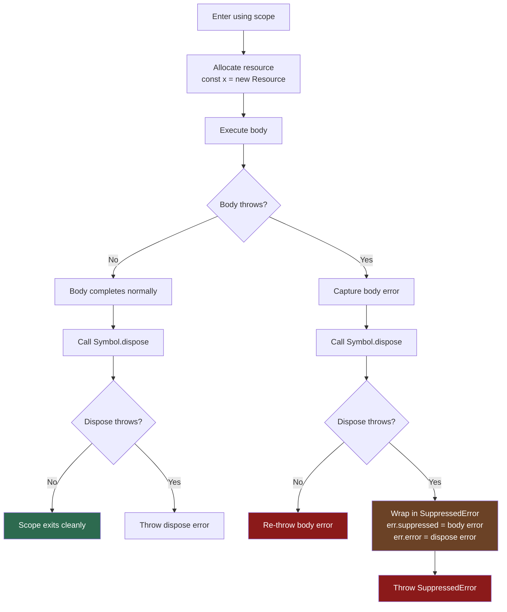

# [FEE-10002] Explicit Resource Management — `using` & `await using`

:::info
Every database connection you forgot to close, every file handle left dangling after an exception — `using` makes cleanup unconditional and co-located with allocation, the way it always should have been.
:::

:::warning Web Platform Proposals
This proposal is at TC39 Stage 3. It shipped in V8 12.1 (Chrome 123+, Node.js 22+) and is supported in TypeScript 5.2+ and via Babel transform.
The API surface may change before Stage 4. Check MDN and the TC39 proposal repo for the latest status.
:::

## Context

Resource management in JavaScript has historically relied on `try/finally` blocks. The pattern is well-known but deeply error-prone. Every time a developer manually writes cleanup code, they are one mistake away from a resource leak.

### The four failure modes of `try/finally`

**1. Forgetting the `finally` block entirely.** When developers focus on the happy path, `finally` is often an afterthought. In code review or under deadline pressure, it gets skipped.

```js
async function handleRequest(req) {
  const db = await openConnection();
  const result = await db.query(req.params.id); // throws on bad id
  await db.close(); // never reached if query throws
  return result;
}
```

The connection leaks on every error. The problem may not surface until the connection pool is exhausted in production.

**2. Forgetting to `await` in an async `finally` block.** This is a subtle variant that TypeScript does not catch by default.

```js
async function handleRequest(req) {
  const db = await openConnection();
  try {
    return await db.query(req.params.id);
  } finally {
    db.close(); // missing await — close() runs but errors are silently dropped
  }
}
```

The `finally` block returns a floating Promise. The connection may not be closed before the next request arrives.

**3. Errors thrown during cleanup silently swallow the original error.** If both the body and the `finally` block throw, the `finally` error wins and the original error is lost forever.

```js
async function doWork() {
  const db = await openConnection();
  try {
    throw new Error('query failed'); // original error
  } finally {
    throw new Error('close failed'); // this replaces the original
    // "query failed" is gone — you will never see it in your logs
  }
}
```

**4. Multiple resources require nested `try/finally` blocks.** Each additional resource adds a level of nesting and another opportunity for mistakes.

```js
async function handleRequest(req) {
  const db = await openConnection();
  try {
    const file = await openFile(req.params.path);
    try {
      return await processFileWithDb(file, db);
    } finally {
      await file.close();
    }
  } finally {
    await db.close();
  }
}
```

The pyramid grows with every resource. The cleanup logic is separated from the allocation logic by an arbitrary distance. The resource lifetime is not visually clear.

## Scenario

A developer is writing a request handler for a Node.js API. The handler opens a database connection to look up a user record, then opens a file to write an audit log entry. In the original code, the developer correctly adds a `finally` block for the database connection but forgets to handle the file handle:

```js
// BROKEN: file handle leaks on error
async function auditHandler(req, res) {
  const db = await Database.connect(process.env.DB_URL);
  try {
    const user = await db.findUser(req.body.userId);
    const logFile = await fs.open('./audit.log', 'a');

    // If this line throws, logFile is never closed
    await logFile.appendFile(`[${new Date().toISOString()}] ${user.name} accessed\n`);
    await logFile.close();

    res.json({ ok: true });
  } finally {
    await db.close(); // db is always cleaned up
    // logFile.close() was forgotten here
  }
}
```

The file handle leaks on any error thrown by `appendFile`. In high-traffic conditions this exhausts the OS file descriptor limit.

With `using` and `await using`, the fix is structural, not disciplinary — the developer cannot forget cleanup because it is declared at the point of allocation:

```js
// FIXED: both resources are always cleaned up
async function auditHandler(req, res) {
  await using db = await Database.connect(process.env.DB_URL);
  // db[Symbol.asyncDispose]() is called when this scope exits, no matter what

  const user = await db.findUser(req.body.userId);

  await using logFile = await fs.open('./audit.log', 'a');
  // logFile[Symbol.asyncDispose]() is called when this scope exits

  await logFile.appendFile(`[${new Date().toISOString()}] ${user.name} accessed\n`);

  res.json({ ok: true });
  // Both db and logFile are disposed here, in reverse declaration order
}
```

The cleanup is now unconditional and co-located with the resource allocation. There is nothing to forget.

## Best Practices

**Engineers MUST implement `[Symbol.dispose]()` on any class that manages a resource** — database connections, file handles, locks, subscriptions, event listeners, timers. If a class acquires something that must be released, it must expose a disposal interface.

```js
class DatabaseConnection {
  #conn;

  constructor(conn) {
    this.#conn = conn;
  }

  async query(sql) {
    return this.#conn.execute(sql);
  }

  // Sync dispose: for classes where cleanup is synchronous
  [Symbol.dispose]() {
    this.#conn.closeSync();
  }

  // Async dispose: for classes where cleanup is asynchronous
  async [Symbol.asyncDispose]() {
    await this.#conn.close();
  }
}
```

**Engineers SHOULD prefer `using` over `try/finally` for all resource cleanup.** The `using` keyword makes cleanup unconditional (it runs on both normal exit and on throw) and co-located with allocation (cleanup logic lives on the class, not scattered in every call site).

**Use `DisposableStack` when managing a variable number of resources**, such as dynamically acquired locks, a batch of connections, or resources created inside a loop.

```js
async function processItems(items) {
  await using stack = new AsyncDisposableStack();

  for (const item of items) {
    // .use() registers a disposable; stack takes ownership
    const lock = stack.use(await acquireLock(item.id));
    await processItem(item, lock);
  }
  // All locks are released in reverse order when stack exits scope
}
```

**When both sync and async disposal are needed, implement both `[Symbol.dispose]` and `[Symbol.asyncDispose]`.** This allows the class to be used with both `using` (sync contexts) and `await using` (async contexts).

**Do not throw from `[Symbol.dispose]`.** If cleanup fails, log and suppress the error, or use `SuppressedError` to preserve both errors. A throwing dispose will replace the original error in the caller's stack, making debugging harder.

```js
[Symbol.dispose]() {
  try {
    this.#conn.closeSync();
  } catch (err) {
    // Log but do not re-throw
    console.error('Connection close failed:', err);
  }
}
```

## Design Thinking

### RAII: a 30-year pattern JavaScript was missing

RAII (Resource Acquisition Is Initialization) is a C++ design principle introduced by Bjarne Stroustrup in the 1980s. The core idea: tie resource lifetime to object scope. When an object goes out of scope, its destructor runs — unconditionally, even if an exception propagates.

JavaScript has had closures, Promises, and async/await, but no language-level equivalent of RAII. Resources had to be manually tracked and released. This was not a failure of discipline — it was a missing language feature.

### How other languages solved this

JavaScript is one of the last major languages to add explicit resource management syntax:

| Language | Syntax | Interface |
|----------|--------|-----------|
| C++ | Destructor (`~T()`) | Runs when scope exits |
| Python | `with` statement | `__enter__` / `__exit__` |
| C# | `using` statement | `IDisposable.Dispose()` |
| Java | try-with-resources | `AutoCloseable.close()` |
| Swift | `defer` statement | Arbitrary statement |
| Kotlin | `.use {}` extension | `Closeable.close()` |
| Go | `defer` statement | Arbitrary statement |
| **JavaScript** | `using` / `await using` | `[Symbol.dispose]()` / `[Symbol.asyncDispose]()` |

The JavaScript design is closest to C# — a keyword that invokes a well-known interface method at scope exit — while adding a separate async variant to accommodate JavaScript's pervasive use of asynchronous APIs.

### React's `useEffect` cleanup is the same concept

React developers already think in terms of "setup and cleanup":

```js
useEffect(() => {
  const subscription = eventBus.subscribe(handler);
  return () => {
    subscription.unsubscribe(); // cleanup function
  };
}, []);
```

The `return () => {}` in `useEffect` is RAII in the component lifecycle. The Explicit Resource Management proposal brings the same concept to plain JavaScript scope, without requiring React or any framework. The cleanup function becomes `[Symbol.dispose]()`, and the scope boundary becomes the `using` declaration.

### `SuppressedError`: preserving both errors

Before this proposal, if both the body and a cleanup routine threw, one error was silently lost:

```js
// The original error "body threw" is replaced by "cleanup threw"
// You will never see "body threw" in your logs
```

The proposal introduces `SuppressedError` to preserve both:

```js
// SuppressedError structure:
// err.message    — "An error was suppressed during disposal"
// err.error      — the error thrown by [Symbol.dispose]() (the suppressor)
// err.suppressed — the original error thrown by the body (the suppressed)
```

When `using` catches both a body error and a dispose error, it wraps them in a `SuppressedError` and throws that. You now have access to both errors in your catch block — the original problem and the cleanup failure.

## Visual



**Comparison: `using` vs `try/finally` control flow**

| Scenario | `try/finally` | `using` |
|----------|---------------|---------|
| Cleanup on normal exit | Yes (with `finally`) | Always |
| Cleanup on throw | Yes (with `finally`) | Always |
| Forgetting cleanup | Possible | Impossible — cleanup is on the class |
| Both body and dispose throw | Original error lost | Both preserved in `SuppressedError` |
| Multiple resources | Nested blocks | Linear declarations |
| Cleanup location | Call site | Class definition |

## Deep Dive

### How `using` interacts with `try/catch/finally`

`using` registers a dispose action that runs when the lexical scope exits — but "scope exit" follows a precise order with respect to `try/catch/finally`:

1. The `finally` block runs first.
2. The `using` dispose actions run after `finally`, in reverse declaration order.

```js
function example() {
  using a = new ResourceA();
  using b = new ResourceB();
  try {
    throw new Error('body error');
  } catch (err) {
    console.log('catch:', err.message);
  } finally {
    console.log('finally');
    // b[Symbol.dispose]() and a[Symbol.dispose]() have NOT run yet
  }
  // b[Symbol.dispose]() runs here (last declared, first disposed)
  // a[Symbol.dispose]() runs here (first declared, last disposed)
}
// Output:
// catch: body error
// finally
// (dispose b)
// (dispose a)
```

This ordering is intentional: the `finally` block may still reference the resources (for logging, flushing, etc.), so disposal happens after `finally` completes. Note: this ordering applies when `using` is declared in the enclosing function scope, outside the `try` block. If `using` is declared inside a `try` block, its disposal fires when that `try`-block scope exits — before `finally`.

### `SuppressedError` semantics

`SuppressedError` is a new built-in error type introduced by this proposal. It extends `Error`.

```js
try {
  using resource = new FailingResource();
  throw new Error('body error');
} catch (err) {
  if (err instanceof SuppressedError) {
    console.log('Original error:', err.suppressed.message); // "body error"
    console.log('Cleanup error:', err.error.message);       // from dispose
  }
}
```

The naming is intentional but can be confusing at first:
- `err.suppressed` is the error that was suppressed — the original body error.
- `err.error` is the error that caused the suppression — the error from `[Symbol.dispose]()`.

Think of it as: the dispose error is the "active" error (`err.error`), and the body error was "suppressed" by it (`err.suppressed`).

### `DisposableStack` methods

`DisposableStack` (and its async counterpart `AsyncDisposableStack`) provide a stack of disposables that are all released when the stack itself is disposed. This is the right tool for dynamic resource management.

```js
function createBatch(items) {
  const stack = new DisposableStack();

  for (const item of items) {
    // .use(resource) — registers a Disposable; returns the resource
    const conn = stack.use(openConnection(item));

    // .adopt(value, fn) — registers a non-Disposable with a callback
    stack.adopt(conn.socket, (socket) => socket.destroy());

    // .defer(fn) — registers an arbitrary cleanup callback
    stack.defer(() => console.log(`closed connection for ${item}`));
  }

  return stack; // caller is responsible for disposing
}

{
  using batch = createBatch(['a', 'b', 'c']);
  // use batch...
} // all connections closed, sockets destroyed, log messages printed
```

The four methods on `DisposableStack`:

| Method | What it accepts | When to use |
|--------|----------------|-------------|
| `.use(disposable)` | Any object with `[Symbol.dispose]()` | Transferring ownership of a disposable |
| `.adopt(value, fn)` | Any value + cleanup callback | Non-disposable resources (raw sockets, native handles) |
| `.defer(fn)` | A zero-argument function | Arbitrary side effects at cleanup time |
| `.move()` | Nothing | Transfer ownership: returns a new stack; old stack is empty |

### TypeScript support

TypeScript 5.2 added `using` and `await using` as first-class keywords. The relevant types are in the `lib` definitions:

```ts
// TypeScript built-in interfaces (no import needed)
interface Disposable {
  [Symbol.dispose](): void;
}

interface AsyncDisposable {
  [Symbol.asyncDispose](): Promise<void>;
}

// TypeScript infers the type of `conn` from the right-hand side
using conn = new DatabaseConnection(url);
//     ^^^^ TypeScript checks that DatabaseConnection implements Disposable
```

TypeScript will emit a compile error if you use `using` with a type that does not implement `[Symbol.dispose]()`. This static check eliminates an entire class of runtime errors.

To use `using` in a TypeScript project targeting older environments, add `"lib": ["ES2022", "ESNext.Disposable"]` (or `"ESNext"`) to your `tsconfig.json`.

## Example

### 1. Basic `using` with a database connection

```js
class DatabaseConnection {
  #pool;
  #client;

  constructor(client, pool) {
    this.#client = client;
    this.#pool = pool;
  }

  async query(sql, params = []) {
    return this.#client.query(sql, params);
  }

  // Synchronous dispose: return client to pool immediately
  [Symbol.dispose]() {
    this.#pool.release(this.#client);
  }
}

class DatabasePool {
  // ... pool implementation

  async connect() {
    const client = await this.#acquireClient();
    return new DatabaseConnection(client, this);
  }

  release(client) {
    this.#clients.push(client);
  }
}

// Usage — connection is always returned to pool, even on throw
async function getUserById(pool, userId) {
  using conn = await pool.connect();
  const rows = await conn.query('SELECT * FROM users WHERE id = $1', [userId]);
  return rows[0] ?? null;
  // conn[Symbol.dispose]() called here — client returned to pool
}
```

### 2. `await using` with an async file handle

```js
import { open } from 'node:fs/promises';

class AsyncFileHandle {
  #handle;

  constructor(handle) {
    this.#handle = handle;
  }

  async read() {
    return this.#handle.readFile({ encoding: 'utf8' });
  }

  async write(data) {
    return this.#handle.writeFile(data, { encoding: 'utf8' });
  }

  async [Symbol.asyncDispose]() {
    await this.#handle.close();
    // File descriptor released — safe to call multiple times if needed
  }
}

async function appendAuditLog(userId, action) {
  await using fh = new AsyncFileHandle(await open('./audit.log', 'a'));
  await fh.write(`${new Date().toISOString()} user=${userId} action=${action}\n`);
  // fh[Symbol.asyncDispose]() called here — file handle closed
}
```

### 3. `DisposableStack` composing multiple resources

```js
// Polyfill: import 'core-js/proposals/explicit-resource-management' (side-effect)
// Native in Node.js 22+ and Chrome 123+

async function processTransaction(db, items) {
  await using stack = new AsyncDisposableStack();

  // Acquire a transaction — wrap it so the stack can dispose it
  const tx = await db.beginTransaction();
  stack.defer(async () => {
    if (!tx.committed) {
      await tx.rollback(); // always rollback uncommitted transactions
    }
  });

  // Acquire a lock for each item
  for (const item of items) {
    const lock = await acquireRowLock(item.id);
    // .adopt() handles resources without [Symbol.asyncDispose]
    stack.adopt(lock, async (l) => await l.release());
  }

  // Process everything
  for (const item of items) {
    await tx.update('items', { processed: true }, { id: item.id });
  }

  await tx.commit();
  // stack disposes in reverse order:
  // 1. item locks released (in reverse acquisition order)
  // 2. rollback guard runs (no-op because tx.committed is true)
}
```

## Internal References

- [FEE-300 JavaScript Core & Runtime Overview](../../JavaScript%20Core%20and%20Runtime/300.md)
- [FEE-301 Event Loop & Async Model](../../JavaScript%20Core%20and%20Runtime/301.md)
- [FEE-10001 Temporal API](10001.md)
- [FEE-10006 Async Context](10006.md)

## References

- [TC39 proposal-explicit-resource-management](https://github.com/tc39/proposal-explicit-resource-management) — official proposal repository with specification text and motivation
- [TypeScript 5.2 Release Notes — `using` Declarations and Explicit Resource Management](https://www.typescriptlang.org/docs/handbook/release-notes/typescript-5-2.html) — TypeScript implementation details and type system integration
- [MDN: Symbol.dispose](https://developer.mozilla.org/en-US/docs/Web/JavaScript/Reference/Global_Objects/Symbol/dispose) — browser compatibility and API reference
- [MDN: Symbol.asyncDispose](https://developer.mozilla.org/en-US/docs/Web/JavaScript/Reference/Global_Objects/Symbol/asyncDispose) — async disposal reference
- [V8 blog: Explicit Resource Management](https://v8.dev/blog/explicit-resource-management) — V8 implementation notes and performance considerations
- [MDN: SuppressedError](https://developer.mozilla.org/en-US/docs/Web/JavaScript/Reference/Global_Objects/SuppressedError) — error type reference
- [Axel Rauschmayer: Explicit Resource Management in JavaScript](https://2ality.com/2022/10/javascript-explicit-resource-management.html) — in-depth analysis of the proposal design
