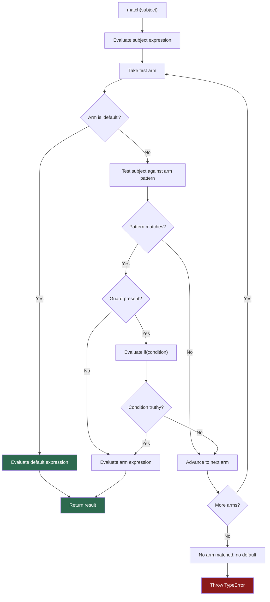

# [FEE-10003] Pattern Matching — `match` Expression

:::info
`switch` compares values. `match` compares shapes — and being an expression, it can live anywhere a value can, turning conditional dispatch into something the type system can actually reason about.
:::

:::warning Web Platform Proposals
This proposal is at TC39 Stage 1. No browser or engine implementation exists. No Babel plugin exists for the current syntax. The syntax is exploratory and will change. Do not use in production. Check the TC39 proposal repo for the latest status.
:::

## Context

JavaScript's `switch` statement has served as the primary multi-branch dispatch mechanism for decades. It works for simple equality tests, but falls apart quickly once you need to branch on the *structure* of a value. Five specific problems make `switch` inadequate for modern JavaScript:

### 1. No structural matching

`switch` can only compare a subject against literal values using `===`. It cannot inspect object shapes, array lengths, or nested properties.

```js
// You cannot write this with switch:
// "if the response has status 200 and a data property, do X"
// You must write nested ifs instead:
if (res.status === 200 && 'data' in res) {
  handleSuccess(res.data);
} else if (res.status === 404 && 'message' in res) {
  handleNotFound(res.message);
}
```

Every check must be manually decomposed into property accesses and comparisons. The structure of the value is described piecemeal, scattered across conditions.

### 2. Fall-through bugs require explicit `break`

`switch` falls through from one `case` to the next unless explicitly stopped. The `break` requirement is a footgun: missing a single `break` silently runs two cases.

```js
switch (action.type) {
  case 'INCREMENT':
    count++;
    // missing break — falls through to DECREMENT
  case 'DECREMENT':
    count--;
    break;
}
```

This class of bug is common enough that linters (`no-fallthrough`) exist specifically to catch it.

### 3. No guard clauses — nesting required

`switch` cannot attach a condition to a `case`. Any conditional logic beyond simple equality must be nested inside the case body:

```js
switch (res.status) {
  case 429:
    if (res.retryAfter < MAX_RETRY_DELAY) {
      scheduleRetry(res.retryAfter);
    } else {
      handleFatalError(res);
    }
    break;
}
```

The guard condition is hidden inside the body, not visible at the structural level of the `switch`.

### 4. `switch` is a statement, not an expression

`switch` does not produce a value. You cannot use it in an assignment, a `return`, or a template literal without wrapping it in an immediately-invoked function or introducing a `let` variable for mutation:

```js
// Forced to use a mutable variable
let label;
switch (status) {
  case 200: label = 'OK'; break;
  case 404: label = 'Not Found'; break;
  default:  label = 'Unknown';
}
```

This pattern is boilerplate. The imperative mutation obscures intent.

### 5. TypeScript type narrowing is limited with `switch`

TypeScript can narrow discriminated union types inside `switch`, but the narrowing breaks down in more complex patterns — nested conditions, multiple discriminants, or structural checks. The compiler's ability to verify exhaustiveness depends on a `never` trick in a `default` case that is easy to forget.

---

The `match` expression addresses all five problems simultaneously.

## Scenario

A developer is building a client-side API layer. The fetch handler returns different shapes depending on the server's response:

- `{ status: 200, data: T }` — success
- `{ status: 404, message: string }` — not found
- `{ status: 429, retryAfter: number }` — rate limited
- Any other `{ status: number, error: string }` — unexpected server error

The current implementation uses a long `if/else if` chain:

```js
// BEFORE: brittle, verbose, no structural guarantees
async function handleApiResponse(res) {
  if (res.status === 200 && res.data !== undefined) {
    return renderData(res.data);
  } else if (res.status === 404 && res.message !== undefined) {
    return renderNotFound(res.message);
  } else if (res.status === 429 && res.retryAfter !== undefined) {
    if (res.retryAfter < 60) {
      return scheduleRetry(res.retryAfter);
    } else {
      return renderError('Rate limit exceeded — retry window too long');
    }
  } else {
    return renderError(res.error ?? 'Unknown error');
  }
}
```

Problems with this code:

- The structural tests (`res.data !== undefined`) are disconnected from the shape they describe.
- The guard condition on `retryAfter` is nested two levels deep.
- Adding a new response shape requires careful placement to avoid shadowing an earlier condition.
- TypeScript cannot prove exhaustiveness.

With the `match` expression, the same logic becomes:

```js
// AFTER: structural, exhaustive, readable
// No transpiler available for Stage 1 syntax — illustrative only
async function handleApiResponse(res) {
  return match (res) {
    when { status: 200, let data }: renderData(data);
    when { status: 404, let message }: renderNotFound(message);
    when { status: 429, let retryAfter } and if (retryAfter < 60):
      scheduleRetry(retryAfter);
    when { status: 429 }: renderError('Rate limit exceeded — retry window too long');
    default: renderError(res.error ?? 'Unknown error');
  };
}
```

Each arm describes the shape it expects, destructures what it needs, and attaches a guard where required. The `default` arm makes exhaustiveness explicit. TypeScript can narrow the type in each arm based on the binding patterns.

## Best Practices

**Engineers SHOULD prefer `match` over long `if/else if` chains for discriminated unions and variant types.** When the subject is a value with a known set of shapes (API responses, Redux actions, route objects, parser AST nodes), `match` expresses both the test and the extraction in one place.

**Always include a `default` arm to make exhaustiveness explicit.** Without a `default` arm, a `match` expression throws a `TypeError` at runtime if no arm matches. An explicit `default` arm — even if it throws or logs — documents the developer's intent about unrecognized cases.

```js
// Prefer this:
match (action.type) {
  when 'INCREMENT': state + 1;
  when 'DECREMENT': state - 1;
  default: throw new Error(`Unhandled action: ${action.type}`);
}

// Over this (silent undefined on miss):
// ... no default arm
```

**Use guard patterns (`and if(condition)`) instead of nesting `if` inside a `when` arm.** Guard patterns keep the condition visible at the structural level of the match expression, not buried inside the arm body.

```js
// Preferred — guard is visible at the arm level
when { status: 429, let retryAfter } and if (retryAfter < 60): scheduleRetry(retryAfter);

// Avoid — nesting if inside the arm body hides the guard
when { status: 429, let retryAfter }:
  retryAfter < 60 ? scheduleRetry(retryAfter) : renderError('retry window too long');
```

Note: Multi-statement arm bodies are NOT part of proposal-pattern-matching. Extract logic into helper functions. Multi-statement blocks require the separate proposal-do-expressions.

**Pair `match` with TypeScript discriminated unions for compile-time exhaustiveness checking.** Binding patterns narrow the type inside each arm. Combined with a discriminant property (like `status` or `type`), TypeScript can verify that all union members are handled.

```ts
type ApiResponse =
  | { status: 200; data: User }
  | { status: 404; message: string }
  | { status: 429; retryAfter: number };

// In each arm, TypeScript narrows res to the matching member
match (res as ApiResponse) {
  when { status: 200, let data }: renderUser(data);  // data: User
  when { status: 404, let message }: renderError(message); // message: string
  when { status: 429, let retryAfter }: scheduleRetry(retryAfter); // retryAfter: number
  default: throw new Error('Unexpected status');
}
```

**Do NOT use `match` in production.** The proposal is at Stage 1. The syntax is exploratory and will change. No production-ready Babel plugin exists for the current syntax. Check the TC39 proposal repository for the latest status.

## Design Thinking

### Why JavaScript has lagged behind

Pattern matching is not a new idea. It is foundational in ML-family languages (Haskell, OCaml, F#), Rust, Swift, and Elixir. These languages treat it as the primary way to inspect and branch on data — more fundamental than `if` statements.

JavaScript lacked pattern matching for decades not because the feature is hard to specify, but because `switch` was considered "good enough" and the community filled the gap with libraries. Once userland workarounds exist, the pressure to standardize decreases. The proposal is a recognition that the gap has grown too large to ignore, especially as TypeScript discriminated unions have made structural branching a core TypeScript idiom.

### How libraries filled the gap

Before the proposal, the ecosystem developed several pattern-matching libraries:

**ts-pattern** (the most popular TypeScript solution) provides a `match` function with chainable `.with()` arms and `.exhaustive()` for compile-time exhaustiveness:

```ts
// ts-pattern equivalent of the API response example
import { match } from 'ts-pattern';

const result = match(res)
  .with({ status: 200 }, ({ data }) => renderData(data))
  .with({ status: 404 }, ({ message }) => renderNotFound(message))
  .with({ status: 429, retryAfter: P.when(r => r < 60) }, ({ retryAfter }) =>
    scheduleRetry(retryAfter))
  .with({ status: 429 }, () => renderError('retry window too long'))
  .otherwise(() => renderError(res.error ?? 'Unknown error'));
```

`ts-pattern` achieves much of what the proposal offers, but requires a runtime library, cannot use native syntax (no destructuring in the match arms), and the pattern DSL is TypeScript-only. The native proposal will bring this capability to plain JavaScript and deepen TypeScript integration.

Other libraries: Redux action type switches are manual pattern matching — a `switch` on `action.type` with destructuring inside each `case` is a structural match by convention. `match-iz` and `patcom` offer similar functionality with different ergonomics.

### Learning from Rust and Python

**Rust's `match`** introduced two key ideas that the TC39 proposal adopts:

1. Exhaustiveness guarantees — a `match` must handle every possible case, or the compiler refuses to compile. The TC39 proposal achieves the same at runtime (via `TypeError` on miss) and at type-check time (via TypeScript).
2. Binding in patterns — Rust's `let` bindings inside patterns (e.g., `Some(x)`) are directly mirrored in the proposal's binding patterns (`let x`).

**Python's `match` statement (PEP 634, Python 3.10)** proved that structural pattern matching can be added to a dynamic language without breaking the type system or adding overhead. Python's `case` syntax uses implicit binding (a bare name is always a capture, not a comparison), whereas the TC39 proposal makes binding explicit with `let`/`const`/`var` to avoid ambiguity with variable comparisons.

### TypeScript discriminated unions + `match` as the canonical idiom

The likely long-term outcome is that TypeScript discriminated unions and `match` become the standard way to handle variant types in JavaScript and TypeScript. The pattern mirrors what Rust calls enums with data: a type that can be one of several shapes, each holding different data, matched and extracted in a single expression. Redux, XState, result types, and parser ASTs all already use this shape — they just lack the language-level syntax to dispatch on it cleanly.

## Visual



**Pattern evaluation order summary:**

| Step | What happens |
|------|-------------|
| 1 | Subject is evaluated once |
| 2 | Arms are tested top-to-bottom |
| 3 | For each arm: pattern is tested first |
| 4 | If pattern matches and a guard exists: guard is evaluated |
| 5 | First arm where both pattern and guard pass wins |
| 6 | `default` arm matches unconditionally if reached |
| 7 | No match with no `default` throws `TypeError` |

## Example

### 1. API response handler — `match` with object, binding, and guard patterns

```js
// No transpiler available for Stage 1 syntax — illustrative only
// Stage 1 — syntax is exploratory and will change

/**
 * ApiResponse union type:
 *   | { status: 200, data: User }
 *   | { status: 404, message: string }
 *   | { status: 429, retryAfter: number }
 *   | { status: number, error: string }
 */

// Note: Multi-statement arm bodies are NOT part of proposal-pattern-matching.
// Extract logic into helper functions. Multi-statement blocks require the
// separate proposal-do-expressions.
async function retryThenFetch(retryAfter, userId) {
  await new Promise(r => setTimeout(r, retryAfter * 1000));
  return fetchUser(userId);
}

async function fetchUser(userId) {
  const res = await fetch(`/api/users/${userId}`).then(r => r.json());

  return match (res) {
    // Object pattern — matches shape { status: 200 }, binds data
    when { status: 200, let data }: data;

    // Object pattern — matches shape { status: 404 }, binds message
    when { status: 404, let message }: null;  // caller treats null as "not found"

    // Object pattern + guard — only retry if window is short
    when { status: 429, let retryAfter } and if (retryAfter < 30):
      retryThenFetch(retryAfter, userId);

    // Object pattern without guard — retry window too long
    when { status: 429, let retryAfter }:
      Promise.reject(new Error(`Rate limited. Retry after ${retryAfter}s.`));

    // Default arm — any other status (500, 503, etc.)
    default: Promise.reject(new Error(res.error ?? 'Unexpected server error'));
  };
}
```

### 2. Array pattern with rest binding

```js
// Parsing a command protocol — array shape dispatch
function handleCommand(tokens) {
  return match (tokens) {
    // Exactly ["quit"]
    when ['quit']: shutdown();

    // ["move", direction] — exactly two items, first is "move"
    when ['move', let direction]: move(direction);

    // ["say", ...words] — "say" followed by one or more words
    when ['say', ...let words]: speak(words.join(' '));

    // Any other array
    default: console.warn('Unknown command:', tokens);
  };
}
```

### 3. Combinator patterns: `and`, `or`, `not`

```js
function classifyNumber(n) {
  return match (n) {
    // and combinator: both conditions must hold
    when Number and if (n > 0 && n % 2 === 0): 'positive even';

    // or combinator: match any of the literal values
    when ((-1) or 0 or 1): 'unit value';

    // not combinator: subject must not match
    when not NaN and Number: 'finite number';

    default: 'not a number or special case';
  };
}
```

### 4. `ts-pattern` equivalent (Design Thinking comparison)

The same API response logic written with the `ts-pattern` library (no transpiler required, works today):

```ts
import { match, P } from 'ts-pattern';

async function fetchUser(userId: string) {
  const res = await fetch(`/api/users/${userId}`).then(r => r.json());

  return match(res)
    .with({ status: 200 }, ({ data }) => data)
    .with({ status: 404 }, () => null)
    .with(
      { status: 429, retryAfter: P.when((r: number) => r < 30) },
      ({ retryAfter }) => scheduleRetry(retryAfter)
    )
    .with({ status: 429 }, ({ retryAfter }) =>
      Promise.reject(new Error(`Rate limited. Retry after ${retryAfter}s.`))
    )
    .otherwise(() =>
      Promise.reject(new Error(res.error ?? 'Unexpected server error'))
    );
}
```

Key differences: `ts-pattern` is available today without a transpiler and provides excellent TypeScript inference. The native `match` expression will offer tighter syntax (native destructuring in patterns, guard clauses at the structural level) and will work in plain JavaScript. Both approaches are structurally equivalent.

## Deep Dive

### Pattern types reference

The proposal defines several pattern types that compose recursively:

**Literal patterns** — match a subject using `SameValue` semantics:

```js
match (x) {
  when 42: '...';       // SameValue to 42
  when "hello": '...';  // SameValue to "hello"
  when true: '...';     // SameValue to true
  when null: '...';     // SameValue to null
}
```

Note: `0` uses `SameValue` semantics, so `+0` and `-0` are distinct. Use `+0` or `-0` explicitly to match a specific signed zero.

**Binding patterns** — always match, introduce a named binding with `let`, `const`, or `var`:

```js
match (res) {
  when let x: console.log(x);  // x is bound to res
}
```

Binding patterns are commonly used inside object or array patterns to extract properties while testing structure:

```js
when { status: 200, let data }: renderData(data);
//                  ^^^^^^^^^^ binding pattern inside object pattern
```

**Object patterns** — test that the subject has the specified properties; sub-patterns are applied to each property's value:

```js
match (obj) {
  // Tests: obj has 'type', obj.type === 'click', obj has 'target'
  when { type: 'click', let target }: handleClick(target);

  // Shorthand: { foo } is equivalent to { foo: let foo }
  // (binds the value of property 'foo' to a local variable named 'foo')
  when { foo }: '...';
}
```

**Array patterns** — test that the subject is iterable with the specified number of items:

```js
match (arr) {
  when []:                 'empty';
  when [let x]:            `one item: ${x}`;
  when [let x, let y]:     `two items: ${x}, ${y}`;
  when [let head, ...let tail]: `head=${head}, rest=${tail.length} items`;
  // `...` without a binding: relaxes the length check to "at least 2 items"
  when [let a, let b, ...]: 'two or more items';
}
```

**Guard patterns** — an `if(<expression>)` appended with `and`:

```js
match (score) {
  when Number and if (score >= 90): 'A';
  when Number and if (score >= 80): 'B';
  when Number and if (score >= 70): 'C';
  default: 'F';
}
```

**Combinator patterns** — `and`, `or`, `not` for boolean logic across patterns:

```js
// and: subject must match both patterns
when String and if (s.length > 0): 'non-empty string';

// or: subject must match at least one pattern
when (200 or 201 or 204): 'success status';

// not: subject must NOT match the pattern
when not null: 'not null';

// Combinators require explicit parentheses — no implicit precedence
// VALID:   (foo and bar) or baz
// INVALID: foo and bar or baz  (syntax error)
```

### Guard clauses in depth

Guard patterns (`and if(expr)`) attach an arbitrary boolean condition to a match arm without nesting. Bindings established before the guard are available inside the guard expression:

```js
match (event) {
  // 'key' is bound first by the object pattern; the guard uses it
  when { type: 'keydown', let key } and if (key === 'Enter' || key === ' '):
    activate();

  when { type: 'keydown', let key } and if (key === 'Escape'):
    dismiss();

  default: void 0;
}
```

If the guard evaluates to falsy, the arm is skipped and the next arm is tested — the guard does not throw.

### `match` as an expression

Because `match` is an expression, it can be used anywhere a value is expected:

```js
// In a return statement
return match (status) { when 200: 'ok'; default: 'error'; };

// In a variable assignment
const label = match (status) { when 200: 'OK'; when 404: 'Not Found'; default: 'Unknown'; };

// In a template literal (NOTE: do NOT use {{ }} — Vue/VitePress will interpret it)
const msg = `Status: ${match (code) { when 200: 'OK'; default: 'Error'; }}`;

// As a default argument
function render(ui = match (env) { when 'test': TestUI; default: ProdUI; }) { ... }
```

### Comparison with `switch`

| Feature | `switch` | `match` |
|---------|----------|---------|
| Expression vs statement | Statement only | Expression |
| Comparison semantics | `===` equality only | Structural, custom matchers |
| Fall-through | Implicit (requires `break`) | Never — arms are independent |
| Binding values | Requires explicit variable before block | Native binding patterns |
| Guard conditions | Requires `if` inside `case` body | `and if(expr)` at arm level |
| Object shape tests | Not possible | Object patterns |
| Array shape tests | Not possible | Array patterns |
| Exhaustiveness | No language-level enforcement | `TypeError` on no-match; TypeScript narrowing |
| Scope | All `case` share one scope | Each arm is an independent block scope |

### TypeScript interaction

Binding patterns in `match` create narrowed types inside the arm body. TypeScript understands the discriminant narrowing from object pattern matching:

```ts
type Shape =
  | { kind: 'circle'; radius: number }
  | { kind: 'square'; side: number }
  | { kind: 'triangle'; base: number; height: number };

function area(shape: Shape): number {
  return match (shape) {
    when { kind: 'circle', let radius }:
      Math.PI * radius ** 2;
      // TypeScript infers: radius is number (narrowed from Shape union)

    when { kind: 'square', let side }:
      side ** 2;

    when { kind: 'triangle', let base, let height }:
      (base * height) / 2;

    // TypeScript exhaustiveness: if Shape gains a new member,
    // the default can surface the gap at runtime
    default: throw new Error(`Unknown shape: ${(shape as any).kind}`);
  };
}
```

## Internal References

- [FEE-300 JavaScript Core & Runtime Overview](../../JavaScript%20Core%20and%20Runtime/300.md)
- [FEE-302 Closures](../../JavaScript%20Core%20and%20Runtime/302.md) — binding patterns create new bindings in the enclosing scope, similar to closure captures
- [FEE-10005 Signals](10005.md) — both Signals and Pattern Matching are language-level primitives currently in proposal phase

## References

- [TC39 proposal-pattern-matching](https://github.com/tc39/proposal-pattern-matching) — official proposal repository with full specification text, pattern type definitions, and motivating examples
- [ts-pattern](https://github.com/gvergnaud/ts-pattern) — exhaustive Pattern Matching library for TypeScript; the closest userland approximation available today
- [Python PEP 634 — Structural Pattern Matching](https://peps.python.org/pep-0634/) — the Python specification that proved structural matching works in a dynamic language; a direct influence on the TC39 proposal
- [The Rust Programming Language — Patterns and Matching](https://doc.rust-lang.org/book/ch06-02-match.html) — Rust's `match` as the canonical model for exhaustive, binding-capable pattern matching
- [TC39 Proposals tracking page](https://github.com/tc39/proposals) — current stage status for all active TC39 proposals
