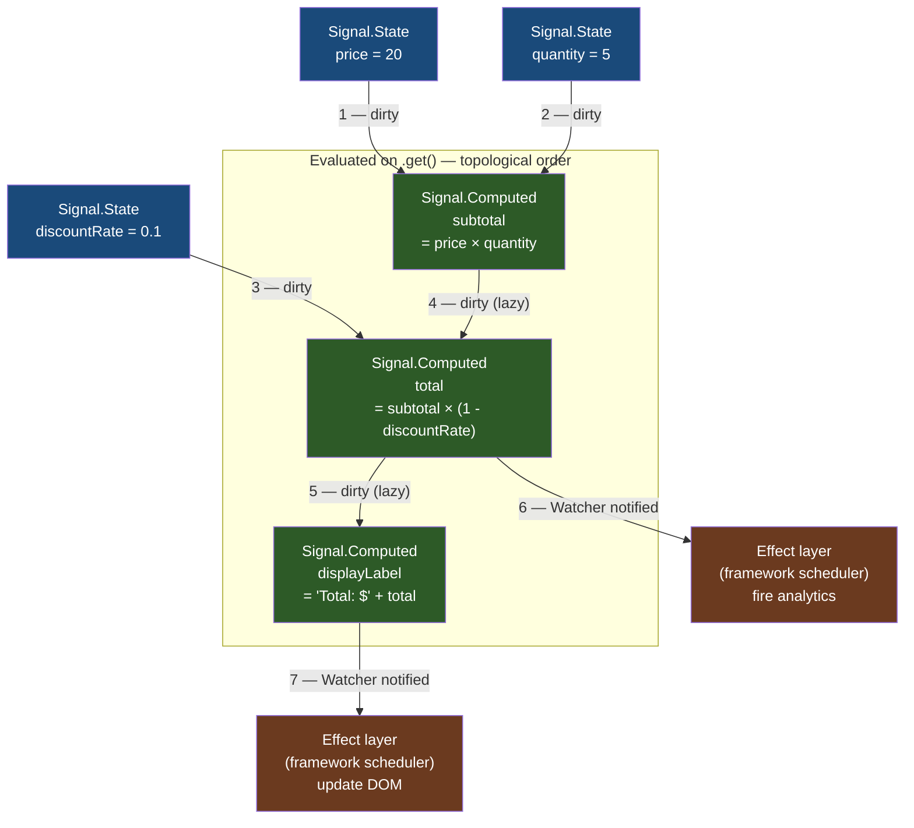

# [FEE-10005] Signals — Reactive Primitives in the Language

:::info
Every major JavaScript framework has invented its own reactive state system — and none of them can talk to each other. TC39 Signals is the attempt to fix that at the language level.
:::

:::warning Web Platform Proposals
This proposal is at TC39 Stage 1. No browser implementation exists.
Available via the `signal-polyfill` npm package for experimentation.
The API may change before Stage 4. Check the TC39 proposal repo for the latest status.
:::

## Context

Reactive state is the mechanism by which a UI updates automatically when the data it depends on changes. Every major JavaScript framework has implemented this mechanism — and every implementation is incompatible with every other:

| Framework | State primitive | Derived value | Side effect |
|-----------|----------------|---------------|-------------|
| Vue 3 | `ref()` | `computed()` | `watchEffect()` |
| React | `useState()` | `useMemo()` | `useEffect()` |
| Angular 17+ | `signal()` | `computed()` | `effect()` |
| SolidJS | `createSignal()` | `createMemo()` | `createEffect()` |
| Preact Signals | `signal()` | `computed()` | `effect()` |
| Svelte 5 | `$state` rune | `$derived` rune | `$effect` rune |

The implementations share the same mental model — a reactive value that propagates changes to anything that depends on it — but they are not interoperable. A Vue `ref` cannot be read by a SolidJS `createMemo`. A reactive utility library built on MobX cannot run in an Angular application. Shared reactive business logic must be rewritten in each framework's dialect.

TC39 Signals aims to provide a single standard primitive that all frameworks can build on top of. The proposal, authored jointly by contributors from Angular, Vue, Solid, Preact, Ember, and others, defines three building blocks:

- **`Signal.State`** — a mutable reactive value (the source of truth)
- **`Signal.Computed`** — a lazy derived value that tracks its dependencies automatically
- **`Signal.subtle.Watcher`** — a low-level hook for frameworks to build their own schedulers and effect systems

The proposal deliberately does NOT include effects. Effects are framework-specific: React batches updates, SolidJS runs synchronously, Angular uses zones (and is migrating away from them). Scheduling is not standardized. What IS standardized is the dependency tracking graph that all frameworks need before they can build their own scheduling on top.

## Scenario

A frontend team is building a design system with shared reactive business logic. The component library team works in Vue. A new micro-frontend from a backend team is being built in SolidJS. Both need access to the same `cartTotal` computation: the sum of item prices after applying a discount code.

### The incompatibility problem

```js
// cart.vue-store.js — works in Vue, invisible to SolidJS
import { ref, computed } from 'vue';

export const items = ref([]);
export const discountRate = ref(0);
export const cartTotal = computed(() =>
  items.value.reduce((sum, item) => sum + item.price, 0) * (1 - discountRate.value)
);
```

```js
// cart.solid-store.js — duplicate implementation for SolidJS
import { createSignal, createMemo } from 'solid-js';

export const [items, setItems] = createSignal([]);
export const [discountRate, setDiscountRate] = createSignal(0);
export const cartTotal = createMemo(() =>
  items().reduce((sum, item) => sum + item.price, 0) * (1 - discountRate())
);
```

Two implementations, two maintenance burdens, and divergence is inevitable.

### With TC39 Signals

```js
// cart.signals.js — framework-agnostic, works everywhere
import { Signal } from 'signal-polyfill';

export const items = new Signal.State([]);
export const discountRate = new Signal.State(0);
export const cartTotal = new Signal.Computed(() =>
  items.get().reduce((sum, item) => sum + item.price, 0) * (1 - discountRate.get())
);
```

```js
// In a Vue component — read via .get(), wrap in a computed for Vue's reactivity
import { computed } from 'vue';
import { cartTotal } from './cart.signals.js';

const total = computed(() => cartTotal.get());
```

```js
// In a SolidJS component — read via .get(), wrap in createMemo for SolidJS tracking
import { createMemo } from 'solid-js';
import { cartTotal } from './cart.signals.js';

const total = createMemo(() => cartTotal.get());
```

The business logic is written once. Each framework reads the signal value using `.get()` inside its own reactive primitive, and the framework's scheduler takes over from there. Shared devtools, shared test utilities, and shared reactive libraries become possible.

## Best Practices

**Engineers SHOULD use `Signal.State` only for source-of-truth values — anything derivable MUST be `Signal.Computed`.** If a value can be computed from other signals, it MUST be a `Signal.Computed`, not a `Signal.State` that is manually kept in sync. Manual sync is the primary source of reactive inconsistency.

```js
// CORRECT — total is derived, not stored
const price = new Signal.State(100);
const quantity = new Signal.State(3);
const total = new Signal.Computed(() => price.get() * quantity.get());

// INCORRECT — storing a derivable value as State creates sync bugs
const price = new Signal.State(100);
const quantity = new Signal.State(3);
const total = new Signal.State(300); // will drift out of sync
```

**Engineers MUST NOT call `.set()` inside a `Signal.Computed`.** A computed that calls `.set()` on a signal it depends on creates an infinite evaluation loop. The runtime will throw, but the root cause is always a misuse of computed as a side-effectful operation.

```js
// WRONG — will cause infinite loop or error
const doubled = new Signal.Computed(() => {
  count.set(count.get() + 1); // never do this
  return count.get() * 2;
});
```

**Engineers MUST call `.get()` to read a signal value — referencing the signal object itself does NOT read the value.** A `Signal.State` or `Signal.Computed` instance is a JavaScript object. Passing it around, storing it, or comparing it does not trigger reactive tracking. Only `.get()` reads the value and registers the dependency.

```js
const count = new Signal.State(0);

console.log(count);       // Signal.State object — NOT the value
console.log(count.get()); // 0 — correct
```

**Clean up `Signal.subtle.Watcher` instances when they are no longer needed.** Watchers hold strong references to the signals they watch. A Watcher that is not unwatched or garbage-collected will prevent the signals it watches from being collected, and the callback will continue firing indefinitely. Always call `.unwatch(...signals)` before discarding a Watcher.

**Do NOT use signals for non-reactive data.** Configuration constants, one-time initialization values, and data that never changes should remain plain variables. Wrapping everything in `Signal.State` adds overhead and noise to the dependency graph with no benefit.

**Effects are NOT part of the TC39 proposal.** Do not expect a `Signal.effect()` API. Use your framework's effect API (`watchEffect`, `createEffect`, `effect`) built on top of `Signal.subtle.Watcher`. If working outside a framework, build a minimal effect runner using `Watcher` (see Example section).

## Design Thinking

### Part 1: The history of reactive programming in JavaScript

Understanding why TC39 Signals exists requires tracing how reactive programming arrived in JavaScript — and why 15 years of framework-level invention still could not produce a shared primitive.

#### Spreadsheets: the original reactive system

The conceptual origin of reactive programming is the spreadsheet, particularly Excel (1985). In a spreadsheet, a cell that contains a formula does not store the result — it stores the *recipe*. When a dependency cell changes, all dependent cells recompute automatically. There is no explicit subscription call. There is no manual "notify observers." The spreadsheet engine maintains a dependency graph and evaluates cells in topological order, ensuring that every cell always reflects the current state of its dependencies.

This is exactly what signals do. The spreadsheet model predates JavaScript by a decade and a half, yet it took the JavaScript ecosystem until the 2010s to rediscover it at scale.

#### Hardware circuit simulation: the origin of the term "signal"

The word "signal" itself comes from hardware description languages (HDLs) like VHDL and Verilog, used to simulate digital circuits. In a circuit, a "signal" is a wire that carries a value. Logic gates read input signals and drive output signals. When an input changes, the change propagates through the circuit graph. This is fine-grained reactive evaluation — the circuit equivalent of `Signal.Computed`.

When reactive programming frameworks began reusing the term "signal" in the 2010s, they were consciously invoking this lineage: reactive values that propagate changes through a dependency graph, just as electrical signals propagate through circuit wires.

#### Knockout.js (2010): first major reactive JavaScript library

Knockout.js was the first widely-adopted JavaScript library to bring reactive observables to the browser UI layer. It introduced `ko.observable()` (a mutable reactive value) and `ko.computed()` (a derived reactive value that tracked its dependencies automatically). Knockout's syntax was verbose by today's standards — HTML templates with `data-bind` attributes — but the conceptual model was fully formed: state, derived state, and automatic dependency tracking.

Knockout demonstrated that fine-grained reactivity was practical at browser scale, but it required explicit property access through function calls (`name()` to read, `name('Alice')` to write), which felt foreign alongside regular JavaScript syntax.

#### Meteor (2012): reactive data on the server and client

Meteor introduced `Tracker`, a reactive dependency system that worked across both client and server. `Tracker.autorun()` registered a function that would re-run whenever any reactive data source it accessed changed. Meteor's data sources (Minimongo collections, session variables) were all reactive by default.

Meteor's contribution was demonstrating that reactive tracking could be implicit — you did not need to declare subscriptions. Running inside a `Tracker.autorun()` context was enough for any reactive read to register a dependency. This implicit tracking model became the standard: it is what Vue's `watchEffect`, SolidJS's `createEffect`, and `Signal.Computed` all use.

#### MobX (2015): fine-grained reactivity with decorators

MobX brought reactive programming to the mainstream React ecosystem, offering fine-grained observable state as an alternative to Redux's immutable store model. MobX used `observable()` for state, `computed()` for derived values, and `autorun()` for effects — the same three-primitive model that TC39 Signals would formalize a decade later.

MobX's influence on the TC39 proposal is direct: the `Signal.Computed` lazy evaluation model and the "glitch-free" guarantee of consistent intermediate state are design goals that MobX had already solved in userland by 2015.

#### Vue 2 (2016): `Object.defineProperty`-based reactivity

Vue 2 introduced reactive objects where every property was automatically tracked using `Object.defineProperty` getters and setters. Accessing a reactive property inside a computed function registered a dependency. Setting a property triggered recomputation of all dependents.

The caveats were significant: Vue 2 could not detect property additions or deletions, could not track array index mutations, and required special `Vue.set()` calls for some operations. These limitations were fundamental to `Object.defineProperty` — you can only intercept property accesses on properties that *already exist* on the object.

#### RxJS and Observables: a different paradigm

RxJS (and the broader Observable pattern from Reactive Extensions) took a fundamentally different approach: push-based reactive streams. An Observable is a lazy data producer. Subscribers register callbacks. Values are *pushed* to subscribers as they arrive, over time.

Signals and Observables solve different problems. Signals model *current state* — there is always a current value, and reading it returns that value synchronously. Observables model *event streams* — there may be no current value, values arrive asynchronously, and the stream can complete or error.

The TC39 Signals proposal explicitly chose the *state* model over the *stream* model. Signals are for reactive state management. RxJS is for async event composition. The two coexist in applications: signals for component state, RxJS for API calls and WebSocket streams.

#### Vue 3 (2020): Proxy-based reactivity

Vue 3 replaced `Object.defineProperty` with `Proxy`, eliminating all of Vue 2's caveats. `reactive()` wraps any object in a Proxy that intercepts all property reads and writes. `ref()` wraps a primitive value in an object with a `.value` property.

Vue 3's composition API (`ref`, `computed`, `watchEffect`) is the closest prior art to the TC39 proposal. The three-primitive model — mutable state, derived state, side effects — maps directly to `Signal.State`, `Signal.Computed`, and `Signal.subtle.Watcher`-based effects.

#### React's non-signal approach: why React chose a different model

React made a deliberate choice to NOT use fine-grained reactivity. Instead, React uses:

1. **Unidirectional data flow** — state flows down from parent to child, events flow up
2. **Immutable state** — `useState` always replaces the entire state value; mutation is invisible to React
3. **Top-down re-render** — when a component's state changes, React re-renders that component and all of its descendants (modulo `React.memo`)
4. **Virtual DOM diffing** — React computes the minimal DOM changes by diffing the previous and new virtual DOM trees

This model trades fine-grained efficiency for predictability. The developer does not need to think about which computed values to invalidate or which effects to re-run. Everything downstream of a state change re-renders, and the diffing algorithm optimizes the actual DOM mutations.

`useMemo` and `useCallback` are opt-in escape hatches — you declare that a derived value should be memoized, but the default is to recompute. This is the inverse of signals, where derivation is the default and memoization is the only option.

React's model is not "wrong" — it reflects a genuine design tradeoff between the ergonomic simplicity of whole-subtree re-render and the performance ceiling of fine-grained updates. For React Server Components and the concurrent rendering model, the whole-tree approach integrates naturally with Suspense and streaming HTML. Fine-grained reactivity would require a fundamentally different rendering architecture.

This is why TC39 Signals will not replace React's state model. React will likely adopt signals as an optional optimization layer, not as a replacement for `useState`.

#### SolidJS (2021): fine-grained signals with no virtual DOM

SolidJS took the reactive primitive model to its logical conclusion: if you have fine-grained reactive tracking, you do not need a virtual DOM at all. Instead of re-rendering a component when state changes, SolidJS compiles templates to DOM nodes and attaches signals directly to DOM properties. When a signal changes, only the specific DOM attribute or text node that depends on it updates — no diffing, no component re-render.

SolidJS's `createSignal`, `createMemo`, and `createEffect` are the direct ancestors of `Signal.State`, `Signal.Computed`, and effect runners built on `Signal.subtle.Watcher`. Ryan Carniato (SolidJS's author) is one of the most prominent voices in the TC39 Signals proposal discussion.

#### Angular 17 (2023): replacing Zone.js with signals

Angular's adoption of signals in version 17 is the most significant framework migration in the proposal's history. Angular had used Zone.js — a library that monkey-patches browser APIs to trigger change detection after any async operation — since its inception. Zone.js was effective but opaque: it made every `setTimeout`, `Promise`, and `fetch` call trigger a full change detection pass, with no way to know what actually changed.

Angular 17 introduced `signal()`, `computed()`, and `effect()` as first-class reactive primitives. The Angular team intends to replace Zone.js entirely with a signals-based change detection system. This transition, from a coarse-grained polling model to a fine-grained dependency tracking model, represents a complete architectural rewrite of Angular's rendering engine.

The Angular team's involvement in the TC39 proposal is not coincidental. They needed a reactive primitive that was not tied to Angular's framework internals, so that the broader ecosystem could share tooling and patterns.

#### The TC39 Signals committee (2024): rare cross-framework alignment

The TC39 Signals proposal, presented at Stage 1 in 2024, is notable for the breadth of its authorship. The committee includes contributors from Angular (Google), Vue (Evan You), SolidJS (Ryan Carniato), Preact (Jason Miller), Ember, Svelte, and others. This level of cross-framework alignment on a TC39 proposal is historically rare.

The shared motivation: every framework has independently arrived at the same three-primitive model (state, computed, effect), and all of them would benefit from a standard reactive graph that they can build on top of — sharing devtools, testing utilities, and reactive utility libraries across framework boundaries.

---

### Part 2: The "glitch" problem

A "glitch" in reactive programming is an intermediate inconsistent state that becomes visible to an observer before all updates have settled.

Consider a system with two signals and a computed value:

```
price = Signal.State(10)
quantity = Signal.State(3)
total = Signal.Computed(() => price.get() * quantity.get())
```

Now suppose both `price` and `quantity` change in the same update cycle: `price` to 20, `quantity` to 5.

A naive push-based system might process updates in this order:
1. `price` changes to 20 → notifies `total` → `total` recomputes as `20 * 3 = 60` (WRONG — quantity is still 3)
2. `quantity` changes to 5 → notifies `total` → `total` recomputes as `20 * 5 = 100` (correct)

An observer watching `total` would see it transiently equal to 60 — an inconsistent state that was never intentionally valid. This is a glitch.

**How signals solve it: lazy evaluation and topological sort**

`Signal.Computed` is *lazy*. It does not eagerly push a new value to dependents when its inputs change. Instead, it marks itself "dirty" — stale, needs recomputation — and waits to be read.

When a framework's effect system reads a computed value (via `.get()`), the signal runtime performs a topological sort of the dependency graph: it identifies all dirty signals and recomputes them in dependency order, from sources to sinks. By the time any computed value is read, all of its transitive dependencies have already been resolved to their final values for the current update cycle.

The result: no glitch. An observer never sees an inconsistent intermediate state, because computed values are never evaluated until all inputs have settled.

**Why React's model is different**

React avoids glitches by a different mechanism: whole-subtree batching. When state changes, React schedules a re-render pass. During that pass, all `useMemo` values are recomputed in component tree order (parent before child). Because the entire tree re-renders as a batch, there is no window where a child sees old parent state alongside new grandchild state.

React's approach to glitch-freedom is architectural — it falls out of the top-down re-render model. Signals' approach is algorithmic — it falls out of lazy evaluation and topological sort. Both are valid; they operate at different granularities.

---

### Part 3: Why frameworks can share a primitive

If every framework has its own scheduler (React batches, SolidJS is synchronous, Angular uses microtask queuing), how can they all share the same signal primitive?

The answer is that **scheduling is intentionally NOT part of the TC39 proposal**. The proposal specifies only the reactive graph: how states are created, how computed values track their dependencies, and how changes propagate through the graph. The proposal says nothing about *when* a framework should process pending updates.

`Signal.subtle.Watcher` is the integration point. A Watcher is notified (via its callback) the *first time* any watched signal becomes dirty after the previous notification was cleared. Frameworks use this callback to schedule their own update batches:

- React can enqueue a re-render in its own scheduler
- SolidJS can run effects synchronously
- Angular can queue a microtask for change detection

The shared primitive is the dependency graph. The per-framework layer is the scheduler that decides when to drain that graph.

**What sharing enables:**

- **Shared devtools**: A browser extension that visualizes signal dependency graphs works across Vue, Angular, and Solid simultaneously
- **Shared testing utilities**: A library like `@testing-library/signals` can write reactive tests that run against any framework's signal integration
- **Shared reactive libraries**: A date range picker component that exposes `Signal.State` inputs can be consumed by Vue, SolidJS, and Angular apps without adaptation
- **Shared reactive utilities**: Operators like `throttle(signal, 100ms)` or `debounce(signal, 300ms)` can be written once and used everywhere

## Visual

The reactive dependency graph shows how `Signal.State` nodes drive `Signal.Computed` nodes, which drive the effects layer. Numbered arrows show the topological evaluation order when a state changes.



**Reading the diagram:** State nodes (blue) are the sources of truth. When state changes, dependent Computed nodes (green) are marked dirty but NOT immediately recomputed — they are lazy. Watchers (brown, the effects layer) are notified that pending work exists. When the framework's scheduler calls `.get()` on a Computed node, the runtime evaluates all dirty ancestors in topological order (arrows 1–7) before returning the final value. No observer sees an intermediate inconsistent state.

## Example

### 1. Basic counter with State and Computed

```js
import { Signal } from 'signal-polyfill';

// Signal.State — the mutable source of truth
const count = new Signal.State(0);

// Signal.Computed — derived, lazy, glitch-free
const doubled = new Signal.Computed(() => count.get() * 2);
const label = new Signal.Computed(() => `Count is ${count.get()}, doubled is ${doubled.get()}`);

// Reading values — MUST use .get()
console.log(count.get());   // 0
console.log(doubled.get()); // 0
console.log(label.get());   // "Count is 0, doubled is 0"

// Writing values — ONLY Signal.State has .set()
count.set(5);

console.log(count.get());   // 5
console.log(doubled.get()); // 10
console.log(label.get());   // "Count is 5, doubled is 10"
```

### 2. Building a simple effect with Signal.subtle.Watcher

Effects are NOT in the TC39 proposal. Here is the minimal pattern for building one using `Signal.subtle.Watcher`:

```js
import { Signal } from 'signal-polyfill';

/**
 * Minimal effect runner built on Signal.subtle.Watcher.
 * This is a simplified version of what frameworks implement internally.
 * For production use, use your framework's effect API.
 */
function effect(fn) {
  let scheduled = false;

  const watcher = new Signal.subtle.Watcher(() => {
    // This callback fires (once) when any watched signal first becomes dirty.
    // Schedule a microtask to run the effect in the next microtask checkpoint.
    if (!scheduled) {
      scheduled = true;
      queueMicrotask(() => {
        scheduled = false;
        // Re-run the effect, which also re-registers dependencies via .get() calls
        watcher.watch(); // re-enable the watcher for the next cycle
        computed.get();  // trigger recomputation
      });
    }
  });

  // NOTE: In this minimal implementation, 'fn' is used as both the dependency
  // tracker AND the side-effectful function. This is a simplification for
  // illustration purposes only. Production effect runners (Vue's watchEffect,
  // Angular's effect()) track dependencies separately from side effects.
  // MUST NOT treat Signal.Computed as an effect runner in production code.
  const computed = new Signal.Computed(fn);

  // Watch the computed — the watcher will fire when fn's dependencies change
  watcher.watch(computed);

  // Run once immediately to register initial dependencies
  computed.get();

  // Return a cleanup function
  return () => {
    watcher.unwatch(computed);
  };
}

// Usage
const name = new Signal.State('Alice');
const greeting = new Signal.State('Hello');

const cleanup = effect(() => {
  // Any .get() call inside here registers a dependency
  console.log(`${greeting.get()}, ${name.get()}!`);
});
// Logs: "Hello, Alice!"

name.set('Bob');
// Logs (next microtask): "Hello, Bob!"

greeting.set('Hi');
// Logs (next microtask): "Hi, Bob!"

// When the component unmounts — prevent memory leaks
cleanup();
```

### 3. Shopping cart — shared cross-framework reactive logic

```js
// cart.signals.js — shared reactive business logic
import { Signal } from 'signal-polyfill';

export const items = new Signal.State([]);
export const discountCode = new Signal.State(null);

// Discount rates by code — plain data, not reactive (correct)
const DISCOUNT_RATES = { 'SAVE10': 0.10, 'SAVE20': 0.20 };

export const discountRate = new Signal.Computed(() => {
  const code = discountCode.get();
  return code ? (DISCOUNT_RATES[code] ?? 0) : 0;
});

export const subtotal = new Signal.Computed(() =>
  items.get().reduce((sum, item) => sum + item.price * item.qty, 0)
);

export const total = new Signal.Computed(() =>
  subtotal.get() * (1 - discountRate.get())
);

export const itemCount = new Signal.Computed(() =>
  items.get().reduce((sum, item) => sum + item.qty, 0)
);

// Helpers — always use .set() with a new array (do not mutate in place)
export function addItem(item) {
  items.set([...items.get(), item]);
}

export function applyDiscount(code) {
  discountCode.set(code);
}
```

```js
// Usage in Vue — wrap in computed() for Vue's reactivity system
import { computed } from 'vue';
import { total, itemCount, addItem } from './cart.signals.js';

export default {
  setup() {
    return {
      total: computed(() => total.get()),
      itemCount: computed(() => itemCount.get()),
      addItem,
    };
  }
};
```

```js
// Usage in SolidJS — wrap in createMemo() for SolidJS tracking
import { createMemo } from 'solid-js';
import { total, itemCount, addItem } from './cart.signals.js';

function CartSummary() {
  const totalValue = createMemo(() => total.get());
  const count = createMemo(() => itemCount.get());
  return <div>{count()} items — ${totalValue().toFixed(2)}</div>;
}
```

### 4. Framework comparison table

| Concept | TC39 Signal | Vue 3 | Angular 17+ | SolidJS |
|---------|------------|-------|-------------|---------|
| Mutable state | `new Signal.State(v)` | `ref(v)` | `signal(v)` | `createSignal(v)` |
| Read value | `s.get()` | `s.value` | `s()` | `s()` |
| Write value | `s.set(v)` | `s.value = v` | `s.set(v)` | `setS(v)` |
| Derived value | `new Signal.Computed(fn)` | `computed(fn)` | `computed(fn)` | `createMemo(fn)` |
| Effect | Not in proposal | `watchEffect(fn)` | `effect(fn)` | `createEffect(fn)` |
| Lazy evaluation | Yes (lazy) | Yes | Yes | Yes |
| Glitch-free | Yes | Yes | Yes | Yes |
| Effect scheduling | Framework layer | Vue scheduler | Angular scheduler | Synchronous |

## Deep Dive

### Glitch-free execution: lazy evaluation and topological sort

The glitch-free guarantee is achieved by two properties of `Signal.Computed`:

**1. Laziness**: A `Signal.Computed` never proactively pushes its value to dependents. When an input signal changes, the computed marks itself dirty and propagates the dirty marker to all downstream computeds. No recomputation happens at this point.

**2. Topological evaluation**: When `.get()` is called on a dirty `Signal.Computed`, the runtime walks the dependency graph and recomputes all dirty ancestors in dependency order before returning. Ancestors with no dirty inputs are returned from cache without recomputation. The evaluation never observes a "half-updated" ancestor.

Combined, these properties guarantee that any call to `.get()` returns a value that is consistent with the current state of all transitive source signals — exactly what the spreadsheet model guarantees.

### `Signal.subtle.Watcher` API reference

`Signal.subtle.Watcher` is the integration point for building schedulers and effect systems.

```js
// Constructor: fn is called (synchronously) the first time a watched signal
// becomes dirty after the watcher has been "cleared"
const watcher = new Signal.subtle.Watcher((signal) => {
  // signal is the first dirty signal that triggered the notification
  // This callback runs synchronously, during the .set() call that caused dirtiness
  // Do NOT call .get() here — schedule work for later instead
  scheduleFlush();
});

// .watch(...signals) — add signals to the watch set
// Calling .watch() also "clears" the watcher, re-enabling the callback for next dirty
watcher.watch(computedA, computedB);

// .unwatch(...signals) — remove signals from the watch set
// Always call this before discarding the watcher to prevent memory leaks
watcher.unwatch(computedA, computedB);

// .getPending() — returns the list of watched signals that are currently dirty
// Use this inside the scheduler flush to know which computeds need recomputation
const pending = watcher.getPending(); // Signal[]
for (const signal of pending) {
  signal.get(); // recompute and notify downstream
}
```

**Key behavioral details:**
- The Watcher callback fires at most once per "cycle" — it fires when the first signal becomes dirty, not on every subsequent dirtiness
- The callback fires synchronously during the `.set()` call, before `.set()` returns
- Calling `.get()` inside the callback is unsafe (may observe partial state) — always schedule async work instead
- After the callback fires, the Watcher is "armed" — it will not fire again until `.watch()` is called to re-clear it

### `Signal.subtle.untrack(fn)`

`untrack` executes a function without registering any reactive dependencies. Use this to read a signal value inside a computed context without making the computed depend on that signal.

```js
const a = new Signal.State(1);
const b = new Signal.State(100);

const c = new Signal.Computed(() => {
  // c depends on `a` — changing `a` dirties `c`
  const aVal = a.get();

  // c does NOT depend on `b` — changing `b` does NOT dirty `c`
  const bVal = Signal.subtle.untrack(() => b.get());

  return aVal + bVal;
});

console.log(c.get()); // 101

b.set(200);
console.log(c.get()); // still 101 — b change did not dirty c

a.set(2);
console.log(c.get()); // 202 — a change dirtied c, recomputes with current b (200)
```

Typical use: reading configuration values, accessing the current value of a signal without creating a dependency (e.g., in a transition or animation where you want the start value but not the end value as a reactive input).

### `Signal.subtle.currentComputed()`

Returns the `Signal.Computed` currently being evaluated, or `null` if called outside a computed context.

```js
const inner = new Signal.Computed(() => {
  const self = Signal.subtle.currentComputed();
  console.log(self === inner); // true — returns the currently-running computed
  return 42;
});

console.log(Signal.subtle.currentComputed()); // null — not in a computed context
inner.get(); // logs: true
```

Primary use cases: building reactive utility libraries that need to detect whether they are being called inside a reactive context, and diagnostic tools that inspect the currently-running computed for devtools.

### `Signal.State` options: `equals`

`Signal.State` accepts an options object with an `equals` function. By default, `Signal.State` uses `Object.is` to determine whether a new value is different from the current value. If the values are equal, dependent computeds are NOT marked dirty.

```js
// Default: Object.is comparison
const count = new Signal.State(0);
count.set(0); // no-op — Object.is(0, 0) is true, no dependents dirtied

// Custom equals: deep comparison for arrays
const tags = new Signal.State([], {
  equals: (a, b) => a.length === b.length && a.every((v, i) => v === b[i])
});

tags.set(['typescript', 'react']); // sets
tags.set(['typescript', 'react']); // no-op — arrays are shallowly equal
```

This option is important for preventing unnecessary recomputation when a signal is set to a value that is semantically equivalent but referentially different (a common pattern when producing new arrays/objects from state transformations).

## Internal References

- [FEE-300 JavaScript Core & Runtime Overview](../../JavaScript%20Core%20and%20Runtime/300.md) — foundational JS knowledge required for this article
- [FEE-502 Reactive State & Signals in Component Architecture](../../Component%20Architecture%20and%20Design%20Patterns/502.md) — signals applied at the component layer; framework-specific usage patterns
- [FEE-600 State Management](../../State%20Management/600.md) — signals as the foundational primitive for state management systems
- [FEE-10003 Pattern Matching](10003.md) — both Signals and Pattern Matching are language-level primitives being standardized at TC39

## References

- [TC39 proposal-signals](https://github.com/tc39/proposal-signals) — official proposal repository; includes the full specification, design rationale, FAQ, and committee discussion history
- [signal-polyfill on npm](https://www.npmjs.com/package/signal-polyfill) — the reference polyfill for TC39 Signals; use for experimentation only, API will change
- [Angular Signals guide](https://angular.dev/guide/signals) — Angular's production implementation of signals; the most complete real-world adoption of the TC39 model to date
- [SolidJS Signals documentation](https://docs.solidjs.com/concepts/signals) — SolidJS's `createSignal`, `createMemo`, `createEffect`; the direct prior art for TC39 Signals
- [Preact Signals](https://preactjs.com/guide/v10/signals/) — Preact's signals implementation; notable for its minimal bundle size and cross-framework adapter approach
- [Ryan Carniato — A Hands-on Introduction to Fine-Grained Reactivity](https://dev.to/ryansolid/a-hands-on-introduction-to-fine-grained-reactivity-3ndf) — SolidJS author's deep explanation of fine-grained reactive systems; essential reading for understanding the TC39 proposal's design goals
- [Vue 3 Reactivity in Depth](https://vuejs.org/guide/extras/reactivity-in-depth) — Vue team's explanation of their reactive system; covers the same concepts with Vue-specific implementation details
- [TC39 Proposals tracking page](https://github.com/tc39/proposals) — current stage status for all active TC39 proposals
