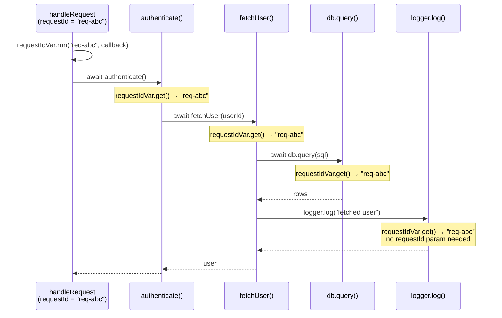

# [FEE-10006] Async Context — Propagating Context Across Async Boundaries

:::info
A request ID set at the top of a request handler silently disappears by the time a deeply nested `await` calls a logging utility — Async Context fixes that at the language level.
:::

:::warning Web Platform Proposals
This proposal is at TC39 Stage 2. No browser implementation exists.
Prior art: Node.js `AsyncLocalStorage` (Node 12.17+).
The API may change before Stage 4. Check the TC39 proposal repo for the latest status.
:::

## Context

Async JavaScript is built around the event loop: a request arrives, a handler fires, and a chain of `await` expressions suspends and resumes execution across microtask checkpoints. Each suspension discards the call stack. By the time execution resumes — whether in a `Promise.then()` callback, a `setTimeout` handler, or a nested `await` — there is no ambient "who called me" information preserved by the runtime.

This creates a fundamental problem for **cross-cutting concerns**: pieces of information that need to be available throughout an entire async operation without being explicitly passed as function arguments.

### The three workarounds — and why each fails

**1. Pass context as function arguments (context threading)**

The most explicit approach: every function that might need the request ID accepts it as a parameter.

```js
async function handleRequest(req, res) {
  const requestId = req.headers['x-request-id'];
  const user = await authenticate(requestId);        // pass it down
  const profile = await fetchProfile(user.id, requestId); // and down
  await updateCache(profile, requestId);             // and down
  logger.log('done', { requestId });                 // finally used here
}
```

This works, but it is **viral**: every intermediate function must accept and forward `requestId` even if it has no use for it itself. Adding a new cross-cutting concern (e.g., a tenant ID, a locale) requires updating every function signature in every call chain.

**2. Module-level globals**

Store the current request ID in a module-level variable.

```js
// logger.js
let currentRequestId = null;

export function setRequestId(id) { currentRequestId = id; }
export function log(msg) { console.log(`[${currentRequestId}] ${msg}`); }
```

This works for single-threaded, single-request scenarios. It **breaks immediately with concurrent requests**: if two requests run concurrently (both are awaiting something simultaneously), they share the same `currentRequestId` variable. Request B's `setRequestId()` call overwrites request A's value mid-flight.

**3. Node.js `AsyncLocalStorage`**

Node.js introduced `AsyncLocalStorage` in version 12.17 (2020) as a production-ready solution. It stores a value that is automatically propagated across all async operations spawned from the current context — `await`, `Promise.then()`, `setTimeout`, `setImmediate`, and more.

```js
import { AsyncLocalStorage } from 'node:async_hooks';

const store = new AsyncLocalStorage();

async function handleRequest(req, res) {
  store.run({ requestId: req.headers['x-request-id'] }, async () => {
    await authenticate();
    await fetchProfile();
    logger.log('done'); // can call store.getStore() to read requestId
  });
}
```

`AsyncLocalStorage` solves the problem completely — but it is **Node.js-only**. There is no equivalent API in browsers, Web Workers, or other JavaScript runtimes. OpenTelemetry's browser SDK cannot use it. Deno required its own polyfill. Edge runtimes (Cloudflare Workers, Vercel Edge) had to implement their own equivalents.

### The web observability gap

Distributed tracing systems like OpenTelemetry assign a **trace ID** to each incoming request and a **span ID** to each unit of work within that request. Every log line, every outgoing fetch, every database call should carry the current trace and span IDs so that a tracing backend (Jaeger, Zipkin, Honeycomb) can reconstruct the full call tree.

In Node.js, OpenTelemetry's SDK uses `AsyncLocalStorage` to propagate the active span through all async operations automatically. The application code never touches the trace ID — it just does `await fetch(url)`, and the OpenTelemetry instrumentation picks up the active span from the async local store to inject the `traceparent` header.

In browsers, this is impossible today. There is no `AsyncLocalStorage`. OpenTelemetry's browser SDK must fall back to manual context passing or cannot propagate spans across async boundaries at all.

**TC39 Async Context** is the proposal to bring `AsyncLocalStorage`-equivalent semantics to all JavaScript environments — browsers, Node.js, Deno, Cloudflare Workers — as a first-class language feature.

## Scenario

An SSR web server handles two concurrent requests. Each request needs a unique `requestId` to correlate all of its log lines in a centralized logging system.

### Without Async Context: the two failure modes

**Failure mode 1 — module-level global (data race):**

```js
// logger.js — BROKEN for concurrent requests
let requestId = null;

export function setRequestId(id) { requestId = id; }
export function log(msg) { console.log(`[${requestId ?? 'no-id'}] ${msg}`); }
```

```js
// server.js
import { setRequestId, log } from './logger.js';

async function handleRequest(req) {
  setRequestId(req.headers['x-request-id']);
  log('request received');           // [req-A] request received
  await authenticate(req);           // suspends — req-B runs here
  // req-B called setRequestId('req-B') while we were awaiting
  log('auth complete');              // [req-B] auth complete  ← WRONG
}

// Two concurrent requests
handleRequest({ headers: { 'x-request-id': 'req-A' } });
handleRequest({ headers: { 'x-request-id': 'req-B' } });
```

The `await authenticate()` suspension allows the event loop to process `req-B`, which overwrites `requestId`. When `req-A` resumes, it logs with `req-B`'s ID. This is a silent data corruption bug — no error is thrown.

**Failure mode 2 — context threading (viral parameters):**

```js
// Every single function must accept requestId — even ones that don't use it directly
async function handleRequest(req) {
  const requestId = req.headers['x-request-id'];
  await authenticate(req, requestId);
}

async function authenticate(req, requestId) {
  const user = await fetchUser(req.userId, requestId); // must forward it
  return user;
}

async function fetchUser(userId, requestId) {
  const row = await db.query('SELECT * FROM users WHERE id = ?', userId, requestId); // forward again
  log('fetched user', requestId); // finally used here
  return row;
}

async function log(msg, requestId) {
  console.log(`[${requestId}] ${msg}`); // the actual use site
}
```

`requestId` appears in four function signatures just to reach the log call. Add a second cross-cutting concern (`tenantId`, `locale`, `traceSpan`) and every signature grows again.

### With Async Context: clean propagation

```js
// context.js — define the variable once
import { AsyncContext } from 'async-context-polyfill'; // proposal API

export const requestIdVar = new AsyncContext.Variable({
  name: 'requestId',
  defaultValue: 'no-request-id',
});
```

```js
// server.js — set the value once at the entry point
import { requestIdVar } from './context.js';

async function handleRequest(req) {
  requestIdVar.run(req.headers['x-request-id'], async () => {
    await authenticate(req); // no requestId parameter needed
    await fetchProfile(req);
    log('request complete'); // no requestId parameter needed
  });
}
```

```js
// logger.js — read the value from anywhere in the async chain
import { requestIdVar } from './context.js';

function log(msg) {
  const requestId = requestIdVar.get(); // always correct, even after awaits
  console.log(`[${requestId}] ${msg}`);
}
```

```js
// db.js — also reads correctly, zero parameter changes needed
import { requestIdVar } from './context.js';

async function query(sql) {
  const requestId = requestIdVar.get();
  console.log(`[${requestId}] db.query: ${sql}`);
  // ...
}
```

Two concurrent requests each have their own `requestId` value, and each async operation spawned from a `.run()` call inherits that value. No parameters changed. No global state race.

## Best Practices

**Engineers SHOULD use `AsyncContext.Variable` for cross-cutting ambient data** — trace IDs, request IDs, user session tokens, locale settings, feature flags — anything that is logically "the context of the current operation" rather than a direct input to a specific function.

**Engineers SHOULD use `AsyncContext.Snapshot` when passing async work to third-party callbacks** that may not propagate context automatically. Event listeners, `setTimeout`, `requestAnimationFrame`, and third-party APIs that accept callbacks are all outside the standard propagation chain. Wrap the callback with a `Snapshot` to capture the current context and restore it when the callback fires.

```js
// Without Snapshot — context is lost in the event listener callback
element.addEventListener('click', async () => {
  // requestIdVar.get() returns the default here — context was not propagated
  await doWork();
});

// With Snapshot — context is preserved
const snapshot = new AsyncContext.Snapshot();
element.addEventListener('click', snapshot.wrap(async () => {
  // requestIdVar.get() returns the value that was current when Snapshot was created
  await doWork();
}));
```

**Do NOT use `AsyncContext.Variable` as a replacement for explicit function parameters when the data is a direct, logical input to the function.** A function that needs a `userId` to compute a result should accept `userId` as a parameter. Async Context is for data that would otherwise require threading through many intermediate layers that have no semantic interest in the value.

**Do NOT use `AsyncContext.Variable` for application state.** It is not a state management solution. Values stored in `AsyncContext.Variable` are scoped to a specific async operation tree. Mutations in one branch do NOT propagate upward or sideways. Use it for ambient metadata, not for shared mutable state.

```js
// WRONG — using Async Context for application state
const cartVar = new AsyncContext.Variable();
cartVar.run(new Cart(), async () => {
  await addItem('product-1');      // modifies cart inside run()
  // The Cart mutation is visible inside this run() scope
  // but not accessible from outside it — this is confusing, not useful
});

// CORRECT — use it for ambient metadata
const traceIdVar = new AsyncContext.Variable({ name: 'traceId' });
traceIdVar.run(generateTraceId(), async () => {
  await processOrder(); // traceId flows through all awaits
});
```

**Set the value at the outermost boundary of the async operation** — at the request handler, the event handler entry point, or the job scheduler entry point. Setting it deep in the call chain creates a smaller propagation scope than intended.

## Design Thinking

### Node.js `AsyncLocalStorage`: the battle-tested prior art

`AsyncLocalStorage` was introduced in Node.js 12.17.0 (May 2020) under the `async_hooks` module, which had existed since Node.js 8 as an experimental API for tracing async operations. `AsyncLocalStorage` wrapped the lower-level async hooks into a clean, usable API.

By Node.js 16, `AsyncLocalStorage` had become stable. Major observability tools adopted it immediately: OpenTelemetry Node.js SDK, `cls-hooked`, `dd-trace` (Datadog APM), and `elastic-apm-node` all use it as their context propagation backbone.

The TC39 Async Context proposal is explicitly modeled on `AsyncLocalStorage`. The semantics are identical: run a callback with a value, and all async operations spawned within that callback (including their descendants, recursively) inherit the value. The difference is that TC39 Async Context is a language-level standard, not a Node.js-specific API.

Node.js 22 added `AsyncContext.Variable` support behind a flag as an early preview of the TC39 API shape. The two APIs will converge.

### Zone.js: the monkey-patching predecessor

Before `AsyncLocalStorage`, the dominant solution in the browser ecosystem was Zone.js, used by Angular since AngularJS 2. Zone.js works by monkey-patching every async API in the browser: `setTimeout`, `setInterval`, `Promise`, `fetch`, `XMLHttpRequest`, `addEventListener`, `requestAnimationFrame`, and more.

When you are inside a Zone, any async operation you schedule carries the Zone reference. When the callback fires, Zone.js restores the Zone context before invoking the callback.

This works, but has significant costs:
- **Startup overhead**: monkey-patching dozens of browser APIs on load
- **Compatibility risk**: any async API that Zone.js does not know about breaks the chain
- **Bundle size**: Zone.js adds ~50KB to the bundle
- **Interference with devtools**: monkey-patched Promises confuse some browser profilers

TC39 Async Context is the native, non-monkey-patching version of what Zone.js built. Instead of wrapping every async API from the outside, the JavaScript engine propagates context natively through every async mechanism. No patching. No missed APIs. No overhead beyond the context read/write operations.

Angular's migration away from Zone.js (driven by the Signals proposal and the broader reactivity rework) is partly motivated by the expectation that Async Context will eventually replace Zone.js's context propagation role.

### OpenTelemetry: the primary production use case

OpenTelemetry (OTel) is the CNCF standard for distributed tracing and observability. Its context propagation model is built around exactly the problem Async Context solves:

1. An incoming HTTP request carries a `traceparent` header with a trace ID and parent span ID.
2. The server starts a new span for the incoming request and stores the active span in a context store.
3. Every outgoing fetch, database call, and message queue publish reads the active span from the context store and injects it into the outgoing request's headers.
4. Downstream services continue the trace chain.

In Node.js, OTel uses `AsyncLocalStorage` for step 2. All `await` operations that happen during the request automatically inherit the active span. The application developer does not touch the trace ID.

In browsers, OTel cannot do this today. The browser SDK must use a global variable (with the concurrent-request race condition) or requires manual context passing. Async Context will close this gap, enabling full distributed tracing in browser-originated async operation trees — including Single Page Applications, service workers, and worklets.

### "Implicit context" and "dynamic extent" — the computer science lineage

The problem that Async Context solves is well-studied in programming language theory under several names:

**Dynamic extent** (as opposed to lexical extent): a variable with dynamic extent is visible throughout the execution of the call that established it, including all callees, regardless of lexical scope. Lisp's `special variables`, Common Lisp's `let` with `defvar`, and Scheme's `parameterize` form are all dynamic extent mechanisms.

**`dynamic-wind` in Scheme**: Scheme's `dynamic-wind` guarantees that setup and teardown procedures run when control enters and exits a dynamic extent, even through continuations. Async Context's propagation through `await` is analogous to maintaining dynamic extent across continuation boundaries.

**Haskell's `ReaderT` monad**: `ReaderT` threads a read-only environment through a computation without explicit parameter passing. It is the pure functional equivalent of Async Context. The environment flows through the monadic bind (`>>=`), just as Async Context flows through `await`.

These concepts converge in Async Context: the JavaScript `await` mechanism is a form of continuation, and propagating context through it requires a dynamic extent mechanism — which is exactly what `AsyncContext.Variable` provides.

### Connection to React Context

React's Context API (`React.createContext`, `useContext`) solves the same "implicit context" problem but at the component tree level:

- **React Context**: implicit context scoped to a subtree of React components, propagated through the render tree
- **Async Context**: implicit context scoped to a subtree of async operations, propagated through `await` chains

The mental model is identical. The domain is different. A React developer who understands `useContext` will find `AsyncContext.Variable` immediately intuitive.

One notable difference: React Context is read-only within a consumer — you cannot mutate the context value, only provide a new value to a subtree via `<Context.Provider>`. `AsyncContext.Variable` similarly scopes mutations: calling `.run(newValue, fn)` only affects the async operations spawned within `fn`. The change does not propagate upward or sideways.

## Visual

The following diagram shows an async call tree for a single HTTP request. The `requestId` value `"req-abc"` is established at the request handler and flows through every async operation in the tree — through `await` boundaries, into utility functions, without being passed as an argument.



Each node in the call tree inherits the `requestId` from the root `.run()` call. The context value is not a parameter — it is ambient data carried by the async execution context. If a second request runs concurrently with `requestId = "req-xyz"`, its entire async tree carries `"req-xyz"` independently.

## Example

### 1. Basic `AsyncContext.Variable` usage

```js
// Using the TC39 proposal API (polyfill or future native support)
// npm install async-context  (community polyfill for experimentation)

const requestIdVar = new AsyncContext.Variable({
  name: 'requestId',
  defaultValue: 'unknown',
});

async function handleRequest(requestId) {
  // run() establishes the value for this async operation tree
  await requestIdVar.run(requestId, async () => {
    await stepOne();
    await stepTwo();
  });
}

async function stepOne() {
  // No requestId parameter — reads from the async context
  const id = requestIdVar.get();
  console.log(`[stepOne] requestId = ${id}`);
  await stepOneHelper();
}

async function stepOneHelper() {
  // Also inherits — the context flows through every nested await
  const id = requestIdVar.get();
  console.log(`[stepOneHelper] requestId = ${id}`);
}

async function stepTwo() {
  const id = requestIdVar.get();
  console.log(`[stepTwo] requestId = ${id}`);
}

// Two concurrent requests — each has its own context
handleRequest('req-abc');
handleRequest('req-xyz');

// Output (order may vary due to async scheduling):
// [stepOne] requestId = req-abc
// [stepOne] requestId = req-xyz
// [stepOneHelper] requestId = req-abc
// [stepOneHelper] requestId = req-xyz
// [stepTwo] requestId = req-abc
// [stepTwo] requestId = req-xyz
```

Each request's async tree carries its own `requestId`. The values never cross.

### 2. `AsyncContext.Snapshot` — preserving context in callbacks

`AsyncContext.Snapshot` captures the current variable bindings at the point it is created. Use it when passing callbacks to APIs that do not propagate context natively — event listeners, `setTimeout`, `requestAnimationFrame`, third-party schedulers.

```js
const traceVar = new AsyncContext.Variable({ name: 'traceId' });

async function processJob(traceId) {
  await traceVar.run(traceId, async () => {
    console.log('start:', traceVar.get()); // traceId

    // Capture context NOW, before handing off to setTimeout
    const snapshot = new AsyncContext.Snapshot();

    setTimeout(
      snapshot.wrap(() => {
        // Without snapshot.wrap(), traceVar.get() would return 'unknown' here
        // With snapshot.wrap(), it returns the traceId captured at Snapshot creation
        console.log('timeout callback:', traceVar.get()); // traceId — correct
      }),
      100
    );

    // For comparison — without Snapshot:
    setTimeout(() => {
      console.log('without snapshot:', traceVar.get()); // 'unknown' — context lost
    }, 100);
  });
}

processJob('trace-789');
```

### 3. Multiple variables — layering context

Multiple `AsyncContext.Variable` instances are independent. Each tracks its own value through the async tree.

```js
const traceIdVar = new AsyncContext.Variable({ name: 'traceId', defaultValue: null });
const userIdVar = new AsyncContext.Variable({ name: 'userId', defaultValue: null });
const localeVar = new AsyncContext.Variable({ name: 'locale', defaultValue: 'en-US' });

function withRequestContext(traceId, userId, locale, fn) {
  return traceIdVar.run(traceId, () =>
    userIdVar.run(userId, () =>
      localeVar.run(locale, fn)
    )
  );
}

async function renderPage() {
  const traceId = traceIdVar.get();   // 'trace-001'
  const userId  = userIdVar.get();    // 'user-42'
  const locale  = localeVar.get();    // 'zh-TW'
  console.log({ traceId, userId, locale });
}

withRequestContext('trace-001', 'user-42', 'zh-TW', async () => {
  await renderPage(); // reads all three correctly
});
```

### 4. Node.js `AsyncLocalStorage` equivalent

For the same use case in Node.js today (production-ready, no proposal API needed):

```js
import { AsyncLocalStorage } from 'node:async_hooks';

const requestStore = new AsyncLocalStorage();

async function handleRequest(req, res) {
  const context = { requestId: req.headers['x-request-id'] };

  // run() establishes the store for the async tree rooted here
  await requestStore.run(context, async () => {
    await authenticate(req);
    await fetchProfile(req);
    res.send('ok');
  });
}

function log(msg) {
  const ctx = requestStore.getStore(); // always correct after any await
  const requestId = ctx?.requestId ?? 'no-id';
  console.log(`[${requestId}] ${msg}`);
}

async function authenticate(req) {
  log('authenticating'); // reads requestId without parameter
  // ...
}

async function fetchProfile(req) {
  log('fetching profile'); // reads requestId without parameter
  // ...
}
```

The `AsyncLocalStorage` API shape maps directly to the TC39 proposal:

| Node.js `AsyncLocalStorage` | TC39 `AsyncContext.Variable` |
|-----------------------------|------------------------------|
| `new AsyncLocalStorage()` | `new AsyncContext.Variable({ name, defaultValue })` |
| `store.run(value, fn)` | `variable.run(value, fn)` |
| `store.getStore()` | `variable.get()` |
| `AsyncLocalStorage.snapshot()` | `new AsyncContext.Snapshot()` |

## Deep Dive

### How context propagates: the mechanics

`AsyncContext.Variable` propagates through every JavaScript async mechanism:

- **`await`**: the context active at the `await` expression is restored when the promise settles and execution resumes. This is the primary propagation mechanism.
- **`Promise.then(fn)` / `Promise.catch(fn)` / `Promise.finally(fn)`**: the `fn` callback inherits the context that was active when `.then()` was called (not when the promise resolved).
- **`queueMicrotask(fn)`**: the callback inherits the context that was active at the `queueMicrotask()` call site.
- **`setTimeout(fn)` / `setInterval(fn)`**: the callback inherits the context at the `setTimeout()` call site. (This is a change from `AsyncLocalStorage`'s original behavior, which was timer-specific — the TC39 proposal standardizes consistent propagation.)
- **`new Promise(executor)`**: the executor inherits the context at the `new Promise()` call site.

### What does NOT propagate

**`new Worker(url)`**: Web Workers run in an isolated global scope. They have their own execution context. An `AsyncContext.Variable` value does NOT cross the Worker boundary. If you need to pass context to a Worker, serialize it and send it via `postMessage`.

**`structuredClone()` and `postMessage()`**: serialization mechanisms discard the async context. Values in `AsyncContext.Variable` are not part of the structured clone algorithm.

### `AsyncContext.Variable` default value behavior

`.get()` returns the `defaultValue` provided in the constructor when called outside any `.run()` call:

```js
const traceVar = new AsyncContext.Variable({
  name: 'traceId',
  defaultValue: 'no-trace',
});

// Outside any run():
console.log(traceVar.get()); // 'no-trace'

traceVar.run('trace-abc', () => {
  console.log(traceVar.get()); // 'trace-abc'
});

// After run() completes:
console.log(traceVar.get()); // 'no-trace' — back to default
```

Without a `defaultValue`, `.get()` returns `undefined` outside a `.run()` call. Always provide a `defaultValue` or guard against `undefined` in consumers.

### `AsyncContext.Snapshot` internals

`new AsyncContext.Snapshot()` captures the **entire set of current `AsyncContext.Variable` bindings** at the point the `Snapshot` is created — not the values themselves as a copy, but the binding map. This means:

- All variables that have active values at Snapshot creation are captured.
- Variables added after `new Snapshot()` are not in the snapshot.
- The snapshot does not track changes: if a variable's value changes after the snapshot is taken, the snapshot still holds the value from snapshot creation time.

```js
const v = new AsyncContext.Variable({ defaultValue: 'initial' });

v.run('first', () => {
  const snapshot = new AsyncContext.Snapshot(); // captures 'first'

  v.run('second', () => {
    console.log(v.get()); // 'second' — inside the second run

    snapshot.run(() => {
      console.log(v.get()); // 'first' — snapshot restored 'first'
    });

    console.log(v.get()); // 'second' — back to the second run's value
  });
});
```

`snapshot.wrap(fn)` is shorthand for `(...args) => snapshot.run(() => fn(...args))`.

### Interaction with structured concurrency

TC39 is also exploring a structured concurrency proposal. The interaction between Async Context and structured concurrency is an active design area: when a "scope" (the structured concurrency primitive) forks child tasks, do those children inherit the parent's async context? The current expectation is yes — child tasks inherit context from their parent scope, consistent with how `await` propagates context today.

### Why Stage 2 takes longer: the browser integration challenges

Moving from Stage 2 to Stage 3 requires a complete specification. For Async Context, the spec must define exactly how context propagates through:

- All existing async primitives in the HTML specification (`setTimeout`, event listeners, microtask queue)
- Future async APIs as they are added (they will need to specify context propagation behavior)
- Host environments that extend the JavaScript engine (browsers, Node.js, Deno, Cloudflare Workers)

This cross-cutting nature — the proposal must reach into the HTML spec, not just ECMA-262 — is why Stage 2 work takes significant time. The champions are working with browser vendors (notably Chrome/V8 and Firefox/SpiderMonkey) to align on implementation strategy.

## Internal References

- [FEE-301 — Event Loop](../../JavaScript%20Core%20and%20Runtime/301.md) — the async model that context flows through; understanding microtask and task queues is prerequisite knowledge
- [FEE-403 — Fetch and Network](../../Web%20APIs%20and%20Browser%20Platform/403.md) — trace ID propagation in outgoing fetch requests; primary OTel use case
- [FEE-10002 — Explicit Resource Management](10002.md) — another async primitive being standardized at TC39; both proposals address async lifecycle concerns
- [FEE-1400 — Observability](../../Engineering%20Excellence/1400.md) — the primary production use case for Async Context; distributed tracing and log correlation

## References

- [TC39 proposal-async-context](https://github.com/tc39/proposal-async-context) — official proposal repository; includes specification, design rationale, API reference, and committee discussion history
- [Node.js AsyncLocalStorage documentation](https://nodejs.org/api/async_context.html) — production-ready prior art; same semantics, Node.js-specific API
- [OpenTelemetry JavaScript SDK — Context propagation](https://opentelemetry.io/docs/languages/js/context/) — real-world use of AsyncLocalStorage for distributed trace propagation; the primary motivation for the TC39 proposal
- [Zone.js README](https://github.com/angular/angular/tree/main/packages/zone.js) — the monkey-patching predecessor; documents the async context problem and Zone.js's solution approach
- [TC39 Proposals — Stage 2](https://github.com/tc39/proposals) — current stage status for all active TC39 proposals
- [Node.js async_hooks documentation](https://nodejs.org/api/async_hooks.html) — lower-level API underlying AsyncLocalStorage; useful for understanding the Node.js implementation history
