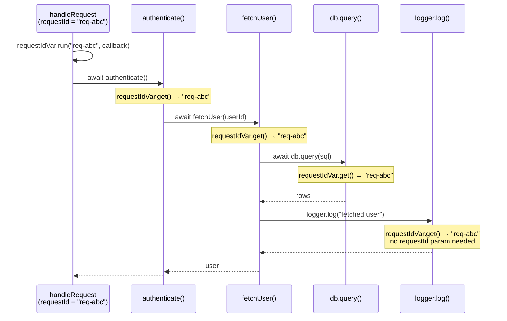

# [FEE-10006] Async Context — Propagating Context Across Async Boundaries

:::info
A request ID set at the top of a request handler silently disappears by the time a deeply nested `await` calls a logging utility. Async Context fixes that at the language level.
:::

:::warning Web Platform Proposals
As of 2026-07, this proposal is at TC39 Stage 2, with Stage 2.7 reviewers assigned (James M Snell, Mark S. Miller). No browser implementation exists yet. The remaining work is defining how the proposal integrates with web-platform APIs (events, timers, and other HTML-spec async primitives); TC39 delegates consider the core ECMAScript semantics largely settled.
Prior art: Node.js `AsyncLocalStorage`, available since Node.js 13.10.0 / 12.17.0 (2020).
Check the [TC39 proposal repo](https://github.com/tc39/proposal-async-context) for the latest status.
:::

## Context

Async JavaScript is built around the event loop: a request arrives, a handler fires, and a chain of `await` expressions suspends and resumes execution across microtask checkpoints. Each suspension discards the call stack. When execution resumes, whether in a `Promise.then()` callback, a `setTimeout` handler, or a nested `await`, there is no ambient "who called me" information preserved by the runtime.

This creates a fundamental problem for **cross-cutting concerns**: pieces of information that need to be available throughout an entire async operation without being explicitly passed as function arguments.

### The three workarounds (and why each fails)

**1. Pass context as function arguments (context threading)**

The most explicit approach: every function that might need the request ID accepts it as a parameter.

```js
async function handleRequest(req, res) {
  const requestId = req.headers['x-request-id'];
  const user = await authenticate(requestId);        // pass it down
  const profile = await fetchProfile(user.id, requestId); // and down
  await updateCache(profile, requestId);             // and down
  logger.log('done', { requestId });                 // finally used here
}
```

This works, but it is **viral**: every intermediate function must accept and forward `requestId` even if it has no use for it itself. Adding a new cross-cutting concern (e.g., a tenant ID, a locale) requires updating every function signature in every call chain.

**2. Module-level globals**

Store the current request ID in a module-level variable.

```js
// logger.js
let currentRequestId = null;

export function setRequestId(id) { currentRequestId = id; }
export function log(msg) { console.log(`[${currentRequestId}] ${msg}`); }
```

This works for single-threaded, single-request scenarios. It **breaks immediately with concurrent requests**: if two requests run concurrently (both are awaiting something simultaneously), they share the same `currentRequestId` variable. Request B's `setRequestId()` call overwrites request A's value mid-flight.

**3. Node.js `AsyncLocalStorage`**

Node.js shipped `AsyncLocalStorage` in version 13.10.0 and backported it to the 12.17.0 LTS line (both 2020) as a production-ready solution. It stores a value that is automatically propagated across all async operations spawned from the current context: `await`, `Promise.then()`, `setTimeout`, `setImmediate`, and more.

```js
import { AsyncLocalStorage } from 'node:async_hooks';

const store = new AsyncLocalStorage();

async function handleRequest(req, res) {
  store.run({ requestId: req.headers['x-request-id'] }, async () => {
    await authenticate();
    await fetchProfile();
    logger.log('done'); // can call store.getStore() to read requestId
  });
}
```

`AsyncLocalStorage` covers `await`, promise, and timer chains automatically, though callback-based APIs like `EventEmitter` still need explicit `AsyncResource` binding. It is also **Node.js-only**: there is no equivalent API in browsers, Web Workers, or other JavaScript runtimes. Deno required its own polyfill. Edge runtimes (Cloudflare Workers, Vercel Edge) had to implement their own equivalents.

### The web observability gap

Distributed tracing systems like OpenTelemetry assign a **trace ID** to each incoming request and a **span ID** to each unit of work within that request. Every log line, every outgoing fetch, every database call should carry the current trace and span IDs so that a tracing backend (Jaeger, Zipkin, Honeycomb) can reconstruct the full call tree.

In Node.js, OpenTelemetry's SDK uses `AsyncLocalStorage` to propagate the active span through all async operations automatically. The application code never touches the trace ID: it just does `await fetch(url)`, and the OpenTelemetry instrumentation picks up the active span from the async local store to inject the `traceparent` header.

There is no `AsyncLocalStorage` in browsers, so OpenTelemetry's web SDK has two options instead. The default, `StackContextManager`, tracks context synchronously on a stack and loses it across any `await`. The alternative, `ZoneContextManager`, depends on Zone.js, the same monkey-patching library covered in Design Thinking below, to restore propagation across promise chains and transpiled (ES2016-target) `await`; it cannot track native ES2017+ `async`/`await`, where context is lost after the second `await` (see Deep Dive), and it brings the bundle-size and compatibility costs Zone.js carries. Async Context would let the browser SDK reach full native-`await` propagation without either trade-off.

**TC39 Async Context** is the proposal to bring `AsyncLocalStorage`-equivalent semantics to all JavaScript environments, including browsers, Node.js, Deno, and Cloudflare Workers, as a first-class language feature.

## Visual

The following diagram shows an async call tree for a single HTTP request. The `requestId` value `"req-abc"` is established at the request handler and flows through every async operation in the tree: through `await` boundaries, into utility functions, without being passed as an argument.



Each node in the call tree inherits the `requestId` from the root `.run()` call. The context value is not a parameter. It is ambient data carried by the async execution context. If a second request runs concurrently with `requestId = "req-xyz"`, its entire async tree carries `"req-xyz"` independently.

## Example

An SSR web server handles two concurrent requests. Each request needs a unique `requestId` to correlate all of its log lines in a centralized logging system. The walkthrough below shows what goes wrong without Async Context, what the proposal API looks like once it fixes both failure modes, and how it maps onto the API most engineers already know from Node.js.

### Without Async Context: two failure modes

**Failure mode 1: module-level global (data race)**

```js
// logger.js — BROKEN for concurrent requests
let requestId = null;

export function setRequestId(id) { requestId = id; }
export function log(msg) { console.log(`[${requestId ?? 'no-id'}] ${msg}`); }
```

```js
// server.js
import { setRequestId, log } from './logger.js';

async function handleRequest(req) {
  setRequestId(req.headers['x-request-id']);
  log('request received');           // [req-A] request received
  await authenticate(req);           // suspends — req-B runs here
  // req-B called setRequestId('req-B') while we were awaiting
  log('auth complete');              // [req-B] auth complete  ← WRONG
}

// Two concurrent requests
handleRequest({ headers: { 'x-request-id': 'req-A' } });
handleRequest({ headers: { 'x-request-id': 'req-B' } });
```

The `await authenticate()` suspension allows the event loop to process `req-B`, which overwrites `requestId`. When `req-A` resumes, it logs with `req-B`'s ID. This is a silent data corruption bug: no error is thrown.

**Failure mode 2: context threading (viral parameters)**

```js
// Every single function must accept requestId — even ones that don't use it directly
async function handleRequest(req) {
  const requestId = req.headers['x-request-id'];
  await authenticate(req, requestId);
}

async function authenticate(req, requestId) {
  const user = await fetchUser(req.userId, requestId); // must forward it
  return user;
}

async function fetchUser(userId, requestId) {
  const row = await db.query('SELECT * FROM users WHERE id = ?', userId, requestId); // forward again
  log('fetched user', requestId); // finally used here
  return row;
}

async function log(msg, requestId) {
  console.log(`[${requestId}] ${msg}`); // the actual use site
}
```

`requestId` appears in four function signatures just to reach the log call. Add a second cross-cutting concern (`tenantId`, `locale`, `traceSpan`) and every signature grows again.

### With Async Context: clean propagation

The proposal exposes two classes: `AsyncContext.Variable`, which holds a value scoped to an async operation tree, and `AsyncContext.Snapshot`, covered in Example 2 below. A `Variable` has two operations: `.run(value, fn)` establishes the value for the async tree rooted at `fn`, and `.get()` reads the current value from anywhere inside that tree. `Snapshot` has an instance method, `.run(fn)`, that restores a captured set of bindings around a callback, and a static method, `AsyncContext.Snapshot.wrap(fn)`, that returns a new function wrapping `fn` so it always runs with the bindings active at the moment `wrap` was called.

```js
// context.js — define the variable once
import { AsyncContext } from 'simple-async-context'; // proposal API, no native implementation ships yet

export const requestIdVar = new AsyncContext.Variable({
  name: 'requestId',
  defaultValue: 'no-request-id',
});
```

```js
// server.js — set the value once at the entry point
import { requestIdVar } from './context.js';

async function handleRequest(req) {
  requestIdVar.run(req.headers['x-request-id'], async () => {
    await authenticate(req); // no requestId parameter needed
    await fetchProfile(req);
    log('request complete'); // no requestId parameter needed
  });
}
```

```js
// logger.js — read the value from anywhere in the async chain
import { requestIdVar } from './context.js';

function log(msg) {
  const requestId = requestIdVar.get(); // always correct, even after awaits
  console.log(`[${requestId}] ${msg}`);
}
```

```js
// db.js — also reads correctly, zero parameter changes needed
import { requestIdVar } from './context.js';

async function query(sql) {
  const requestId = requestIdVar.get();
  console.log(`[${requestId}] db.query: ${sql}`);
  // ...
}
```

Two concurrent requests each have their own `requestId` value, and each async operation spawned from a `.run()` call inherits that value. No parameters changed. No global state race.

### 1. Basic `AsyncContext.Variable` usage

```js
// Using the TC39 proposal API (polyfill or future native support)
// npm install simple-async-context  (community polyfill for experimentation)

const requestIdVar = new AsyncContext.Variable({
  name: 'requestId',
  defaultValue: 'unknown',
});

async function handleRequest(requestId) {
  // run() establishes the value for this async operation tree
  await requestIdVar.run(requestId, async () => {
    await stepOne();
    await stepTwo();
  });
}

async function stepOne() {
  // No requestId parameter — reads from the async context
  const id = requestIdVar.get();
  console.log(`[stepOne] requestId = ${id}`);
  await stepOneHelper();
}

async function stepOneHelper() {
  // Also inherits — the context flows through every nested await
  const id = requestIdVar.get();
  console.log(`[stepOneHelper] requestId = ${id}`);
}

async function stepTwo() {
  const id = requestIdVar.get();
  console.log(`[stepTwo] requestId = ${id}`);
}

// Two concurrent requests — each has its own context
handleRequest('req-abc');
handleRequest('req-xyz');

// Output (order may vary due to async scheduling):
// [stepOne] requestId = req-abc
// [stepOne] requestId = req-xyz
// [stepOneHelper] requestId = req-abc
// [stepOneHelper] requestId = req-xyz
// [stepTwo] requestId = req-abc
// [stepTwo] requestId = req-xyz
```

Each request's async tree carries its own `requestId`. The values never cross.

### 2. `AsyncContext.Snapshot`: preserving context in callbacks

`AsyncContext.Snapshot` captures the current variable bindings at the point it is created. Use it for callbacks that a third-party API stores and invokes later from a context unrelated to where they were registered: a batching queue that flushes on its own schedule, a plugin system that replays callbacks after some other event, or a real user-triggered event listener (the click itself, not the code that called `addEventListener`). Ordinary `setTimeout`, `queueMicrotask`, and promise callbacks do not need `Snapshot`: per the proposal's web-integration design (see Deep Dive, below), they already inherit the context active at their own call site.

```js
const traceVar = new AsyncContext.Variable({ name: 'traceId' });

// A third-party job queue that batches callbacks and flushes them later,
// from its own internal loop, unrelated to whoever pushed the job.
class JobQueue {
  #jobs = [];
  push(fn) {
    this.#jobs.push(fn);
  }
  flush() {
    const jobs = this.#jobs.splice(0);
    for (const job of jobs) job();
  }
}

const queue = new JobQueue();

async function processJob(traceId) {
  await traceVar.run(traceId, async () => {
    console.log('start:', traceVar.get()); // traceId

    // AsyncContext.Snapshot.wrap() captures context NOW, before handing
    // the callback to the queue
    queue.push(
      AsyncContext.Snapshot.wrap(() => {
        // Without Snapshot.wrap(), traceVar.get() would return 'unknown' here,
        // because flush() runs later from unrelated code.
        console.log('queued job:', traceVar.get()); // traceId — correct
      })
    );
  });
}

processJob('trace-789');

// Some unrelated part of the app, running outside any traceVar.run():
queue.flush();
```

Without the `Snapshot`, `queue.flush()` runs the job in whatever context happens to be active when the unrelated code that owns the queue decides to flush it, not necessarily `trace-789`'s context.

### 3. Multiple variables: layering context

Multiple `AsyncContext.Variable` instances are independent. Each tracks its own value through the async tree.

```js
const traceIdVar = new AsyncContext.Variable({ name: 'traceId', defaultValue: null });
const userIdVar = new AsyncContext.Variable({ name: 'userId', defaultValue: null });
const localeVar = new AsyncContext.Variable({ name: 'locale', defaultValue: 'en-US' });

function withRequestContext(traceId, userId, locale, fn) {
  return traceIdVar.run(traceId, () =>
    userIdVar.run(userId, () =>
      localeVar.run(locale, fn)
    )
  );
}

async function renderPage() {
  const traceId = traceIdVar.get();   // 'trace-001'
  const userId  = userIdVar.get();    // 'user-42'
  const locale  = localeVar.get();    // 'zh-TW'
  console.log({ traceId, userId, locale });
}

withRequestContext('trace-001', 'user-42', 'zh-TW', async () => {
  await renderPage(); // reads all three correctly
});
```

### 4. Node.js `AsyncLocalStorage` equivalent

For the same use case in Node.js today (production-ready, no proposal API needed):

```js
import { AsyncLocalStorage } from 'node:async_hooks';

const requestStore = new AsyncLocalStorage();

async function handleRequest(req, res) {
  const context = { requestId: req.headers['x-request-id'] };

  // run() establishes the store for the async tree rooted here
  await requestStore.run(context, async () => {
    await authenticate(req);
    await fetchProfile(req);
    res.send('ok');
  });
}

function log(msg) {
  const ctx = requestStore.getStore(); // always correct after any await
  const requestId = ctx?.requestId ?? 'no-id';
  console.log(`[${requestId}] ${msg}`);
}

async function authenticate(req) {
  log('authenticating'); // reads requestId without parameter
  // ...
}

async function fetchProfile(req) {
  log('fetching profile'); // reads requestId without parameter
  // ...
}
```

The `AsyncLocalStorage` API shape maps directly to the TC39 proposal:

| Node.js `AsyncLocalStorage` | TC39 `AsyncContext.Variable` |
|-----------------------------|------------------------------|
| `new AsyncLocalStorage()` | `new AsyncContext.Variable({ name, defaultValue })` |
| `store.run(value, fn)` | `variable.run(value, fn)` |
| `store.getStore()` | `variable.get()` |
| `AsyncLocalStorage.snapshot()` | `new AsyncContext.Snapshot()` |

## Best Practices

**Engineers SHOULD use `AsyncContext.Variable` for cross-cutting ambient data**: trace IDs, request IDs, user session tokens, locale settings, feature flags, anything that is logically "the context of the current operation" rather than a direct input to a specific function.

**Engineers SHOULD use `AsyncContext.Snapshot` when passing async work to callbacks that run outside the standard propagation chain.** A real user-triggered event (a person clicking a button) starts a new, unrelated async operation under the web-integration proposal and runs in an empty context by design; wrap the listener with a `Snapshot` if the handler needs the context that was active when the listener was registered. Third-party schedulers that store a callback and invoke it later from unrelated code have the same problem. `setTimeout`, `requestAnimationFrame`, and promise chains are not in this category: they inherit the context active at their call site automatically (see Deep Dive, below), so wrapping them in `Snapshot` is unnecessary.

```js
// Without Snapshot — context is lost for a real user click
element.addEventListener('click', async () => {
  // A user-triggered click starts a new browser task with an empty context,
  // so requestIdVar.get() returns the default here.
  await doWork();
});

// With Snapshot — context is preserved
element.addEventListener('click', AsyncContext.Snapshot.wrap(async () => {
  // requestIdVar.get() returns the value that was current when Snapshot.wrap() was called
  await doWork();
}));
```

**Do NOT use `AsyncContext.Variable` as a replacement for explicit function parameters when the data is a direct, logical input to the function.** A function that needs a `userId` to compute a result should accept `userId` as a parameter. Async Context is for data that would otherwise require threading through many intermediate layers that have no semantic interest in the value.

**Do NOT use `AsyncContext.Variable` for application state.** It is not a state management solution. Values stored in `AsyncContext.Variable` are scoped to a specific async operation tree. Mutations in one branch do NOT propagate upward or sideways. Use it for ambient metadata, not for shared mutable state.

```js
// WRONG — using Async Context for application state
const cartVar = new AsyncContext.Variable();
cartVar.run(new Cart(), async () => {
  await addItem('product-1');      // modifies cart inside run()
  // The Cart mutation is visible inside this run() scope
  // but not accessible from outside it — this is confusing, not useful
});

// CORRECT — use it for ambient metadata
const traceIdVar = new AsyncContext.Variable({ name: 'traceId' });
traceIdVar.run(generateTraceId(), async () => {
  await processOrder(); // traceId flows through all awaits
});
```

**Set the value at the outermost boundary of the async operation**: the request handler, the event handler entry point, or the job scheduler entry point. Setting it deep in the call chain creates a smaller propagation scope than intended.

## Design Thinking

### Node.js `AsyncLocalStorage`: the battle-tested prior art

`AsyncLocalStorage` shipped in Node.js 13.10.0 and was backported to the 12.17.0 LTS line (both 2020), built on the `async_hooks` module that had existed since Node.js 8 as an experimental API for tracing async operations. `AsyncLocalStorage` wrapped the lower-level async hooks into a clean, usable API.

By Node.js 16, `AsyncLocalStorage` had become stable. OpenTelemetry's Node.js SDK, `dd-trace` (Datadog APM), and `elastic-apm-node` all adopted it as their context propagation backbone, superseding userland solutions like `cls-hooked` that had been built directly on `async_hooks`.

The TC39 Async Context proposal is explicitly modeled on `AsyncLocalStorage`. The semantics are close to identical: run a callback with a value, and all async operations spawned within that callback, including their descendants, inherit the value. The difference is that TC39 Async Context is a language-level standard, not a Node.js-specific API.

Node.js has not shipped `AsyncContext.Variable` under any flag. What did land is `AsyncContextFrame`, a V8-based reimplementation of `AsyncLocalStorage`'s internals that removes the `async_hooks` tracking overhead: it shipped behind `--experimental-async-context-frame` starting in Node.js 22.7.0 and became the default in Node.js 24.0.0, with `--no-async-context-frame` added as the opt-out. The `AsyncLocalStorage` API surface is unchanged; `AsyncContextFrame` is an internal performance change informed by the design work on the TC39 proposal, not a new public API.

### Zone.js: the monkey-patching predecessor, still in production

Before `AsyncLocalStorage`, the dominant solution in the browser ecosystem was Zone.js, used by Angular since Angular 2 (2016) and still OpenTelemetry's browser context manager today (see the web observability gap in Context, above). Zone.js works by monkey-patching every async API in the browser: `setTimeout`, `setInterval`, `Promise`, `fetch`, `XMLHttpRequest`, `addEventListener`, `requestAnimationFrame`, and more.

When you are inside a Zone, any async operation you schedule carries the Zone reference. When the callback fires, Zone.js restores the Zone context before invoking the callback.

This works, but has real costs:
- **Startup overhead**: monkey-patching dozens of browser APIs on load
- **Compatibility risk**: any async API that Zone.js does not know about breaks the chain
- **Bundle size**: zone.js (0.16.x) adds roughly 34-36KB minified, about 11.5-12KB gzipped, to the bundle
- **Interference with devtools**: monkey-patched Promises confuse some browser profilers

TC39 Async Context is the native, non-monkey-patching version of what Zone.js built: instead of wrapping every async API from the outside, the JavaScript engine propagates context through every async mechanism it owns, so no third-party API list can go stale. The cost does not vanish; it relocates into browser engines, into the implementation and performance work needed to wire context propagation through every host API, which is exactly what Mozilla has raised as an open concern (see Why Stage 2 takes longer, in Deep Dive).

Angular's own framework-level Signals API drives its move to zoneless change detection, which removes that specific dependency on Zone.js. Whether Async Context ends up replacing Zone.js's broader context-propagation role for libraries like OpenTelemetry is still an open question, not a settled roadmap item.

### OpenTelemetry: the primary production use case

OpenTelemetry (OTel) is the CNCF standard for distributed tracing and observability. Its context propagation model is built around exactly the problem Async Context solves:

1. An incoming HTTP request carries a `traceparent` header with a trace ID and parent span ID.
2. The server starts a new span for the incoming request and stores the active span in a context store.
3. Every outgoing fetch, database call, and message queue publish reads the active span from the context store and injects it into the outgoing request's headers.
4. Downstream services continue the trace chain.

In Node.js, OTel uses `AsyncLocalStorage` for step 2. All `await` operations that happen during the request automatically inherit the active span. The application developer does not touch the trace ID.

In browsers, OTel's SDK cannot rely on `AsyncLocalStorage` and instead depends on the context managers covered in the web observability gap (Context, above): a synchronous-only default, or a Zone.js-based one that pays Zone.js's costs (see Zone.js, above). Async Context would close that gap directly, extending `AsyncLocalStorage`-quality propagation to Single Page Applications, service workers, and worklets.

### "Implicit context" and "dynamic extent": the computer science lineage

The problem that Async Context solves is well-studied in programming language theory under several names:

**Dynamic extent** (as opposed to lexical extent): a variable with dynamic extent is visible throughout the execution of the call that established it, including all callees, regardless of lexical scope. Lisp's `special variables`, Common Lisp's `let` with `defvar`, and Scheme's `parameterize` form are all dynamic extent mechanisms.

**`dynamic-wind` in Scheme**: Scheme's `dynamic-wind` guarantees that setup and teardown procedures run when control enters and exits a dynamic extent, even through continuations. Async Context's propagation through `await` is analogous to maintaining dynamic extent across continuation boundaries.

**Haskell's `ReaderT` monad**: `ReaderT` threads a read-only environment through a computation without explicit parameter passing. It is the pure functional equivalent of Async Context. The environment flows through the monadic bind (`>>=`), just as Async Context flows through `await`.

These concepts converge in Async Context: the JavaScript `await` mechanism is a form of continuation, and propagating context through it requires a dynamic extent mechanism. `AsyncContext.Variable` provides exactly that for JavaScript's `await`.

### Connection to React Context

React's Context API (`React.createContext`, `useContext`) solves the same "implicit context" problem but at the component tree level:

- **React Context**: implicit context scoped to a subtree of React components, propagated through the render tree
- **Async Context**: implicit context scoped to a subtree of async operations, propagated through `await` chains

The parallel is real but partial. Both scope a provided value to a subtree and let code read it without threading it through every intermediate function's parameters. They differ in what "subtree" means: React Context is lexical, read at render time from a component's position in the tree; Async Context is dynamic, read at the point an async operation resumes, regardless of where that operation is lexically defined. A React developer who understands `useContext` will recognize the shape of `AsyncContext.Variable`, not its exact behavior.

One notable similarity is in how both scope mutations: React Context is read-only within a consumer (you cannot mutate the context value, only provide a new value to a subtree via `<Context.Provider>`). `AsyncContext.Variable` similarly scopes mutations: calling `.run(newValue, fn)` only affects the async operations spawned within `fn`. The change does not propagate upward or sideways.

## Deep Dive

### How context propagates: the mechanics

The proposal's own `WEB-INTEGRATION.md` document specifies exactly which context each host API propagates. The primitives most relevant to typical application code:

- **`await`**: the context active at the `await` expression is restored when the promise settles and execution resumes. This is the primary propagation mechanism.
- **`Promise.then(fn)` / `Promise.catch(fn)` / `Promise.finally(fn)`**: the `fn` callback inherits the context that was active when `.then()` was called (not when the promise resolved).
- **`queueMicrotask(fn)`**: the callback inherits the context that was active at the `queueMicrotask()` call site.
- **`setTimeout(fn)` / `setInterval(fn)`**: the callback inherits the context that was active at the `setTimeout()` call site. `setTimeout` is a host (HTML spec) API, not part of ECMA-262, so this behavior comes from the proposal's web-integration work rather than the core language spec. `WEB-INTEGRATION.md` categorizes timers as "schedulers," where the call-site context is the only context that makes sense to propagate.
- **`new Promise(executor)`**: the executor inherits the context at the `new Promise()` call site.

### What does NOT propagate

**`new Worker(url)`**: Web Workers run in an isolated global scope. They have their own execution context. An `AsyncContext.Variable` value does NOT cross the Worker boundary. If you need to pass context to a Worker, serialize it and send it via `postMessage`.

**`structuredClone()` and `postMessage()`**: serialization mechanisms discard the async context. Values in `AsyncContext.Variable` are not part of the structured clone algorithm.

### `AsyncContext.Variable` default value behavior

`.get()` returns the `defaultValue` provided in the constructor when called outside any `.run()` call:

```js
const traceVar = new AsyncContext.Variable({
  name: 'traceId',
  defaultValue: 'no-trace',
});

// Outside any run():
console.log(traceVar.get()); // 'no-trace'

traceVar.run('trace-abc', () => {
  console.log(traceVar.get()); // 'trace-abc'
});

// After run() completes:
console.log(traceVar.get()); // 'no-trace' — back to default
```

Without a `defaultValue`, `.get()` returns `undefined` outside a `.run()` call. Always provide a `defaultValue` or guard against `undefined` in consumers.

### `AsyncContext.Snapshot` internals

`new AsyncContext.Snapshot()` captures the entire set of current `AsyncContext.Variable` bindings at the point the `Snapshot` is created. This is the binding map itself, not a copy of the values. In practice, this means:

- All variables that have active values at Snapshot creation are captured.
- Variables added after `new Snapshot()` are not in the snapshot.
- The snapshot does not track changes: if a variable's value changes after the snapshot is taken, the snapshot still holds the value from snapshot creation time.

```js
const v = new AsyncContext.Variable({ defaultValue: 'initial' });

v.run('first', () => {
  const snapshot = new AsyncContext.Snapshot(); // captures 'first'

  v.run('second', () => {
    console.log(v.get()); // 'second' — inside the second run

    snapshot.run(() => {
      console.log(v.get()); // 'first' — snapshot restored 'first'
    });

    console.log(v.get()); // 'second' — back to the second run's value
  });
});
```

`AsyncContext.Snapshot.wrap(fn)` captures a snapshot when called and returns a function that restores it: `const snap = new AsyncContext.Snapshot(); return (...args) => snap.run(() => fn(...args));`.

### A companion proposal: disposable scoping

TC39 is also incubating [`proposal-async-context-disposable`](https://github.com/tc39/proposal-async-context-disposable), a design that would let `AsyncContext.Variable` mutations be scoped with a `using` declaration (see [FEE-10002](10002.md)) instead of always wrapping the rest of the block in `.run(value, fn)`. The motivation is code that cannot easily nest a callback, such as a generator function body with multiple `yield` points. This is exploratory work rather than a staged proposal; there is no active TC39 structured-concurrency proposal for Async Context to coordinate with today.

### Why Stage 2 takes longer: the web-integration challenge

Moving from Stage 2 to Stage 3 requires a complete specification. TC39 delegates describe the core ECMAScript semantics (`AsyncContext.Variable`, `.run()`, `.get()`, `Snapshot`) as largely settled. What remains is defining how every web-platform async primitive interacts with Async Context, especially events. The proposal has assigned Stage 2.7 reviewers, James M Snell and Mark S. Miller, in the tc39/proposals table, but has not yet advanced past Stage 2 as of 2026-07.

Events took the longest to settle. Earlier drafts distinguished "registration context" (active when `addEventListener` was called) from "dispatch context" (active when the event fires). At the April 2025 TC39 plenary, the champions dropped registration context in response to Mozilla's review and settled on dispatch context only, for a defined subset of dispatches: synchronous dispatches are transparent to whatever context is active, dispatches caused by the same object's own API call (an `XMLHttpRequest` firing `load` after `.send()`) run in the context that was active when that call started the task, stored on the object and restored when the event fires, and externally caused dispatches, such as a real user click, run in an empty context by design. The corresponding changes are landing as pull requests against the WHATWG HTML and WebIDL specs (`whatwg/html#12152`, `whatwg/webidl#1568`), and the proposal separately requested WHATWG Stage 1 for that work in November 2025.

Not everyone agrees the web integration is worth its cost. In Mozilla's standards-position review (mozilla/standards-positions#1187), a Mozilla reviewer argued the API mainly serves library authors rather than most developers, and that once it ships, application developers will still reach for it directly and need to learn which host APIs propagate "registration" versus "causal" context, adding platform complexity for a comparatively narrow audience. An OpenTelemetry maintainer replied in the same thread that OTel's current browser support, built on Zone.js, cannot track native `async`/`await` and should not count as evidence that Async Context is unnecessary. That disagreement, more than remaining ECMAScript design work, is why this proposal has stayed at Stage 2 for several years.

## Runtime Support Matrix

| Environment | Status (2026-07) | Notes |
|---|---|---|
| Browsers (Chrome, Firefox, Safari) | No implementation | TC39 Stage 2; web-platform integration (events, timers) still being specified against the WHATWG HTML and WebIDL specs |
| Node.js | No `AsyncContext.Variable`; `AsyncLocalStorage` is the stable equivalent | `AsyncLocalStorage` stable since Node.js 16; its default implementation switched to `AsyncContextFrame` in Node.js 24.0.0 (behind `--experimental-async-context-frame` starting in Node.js 22.7.0), which removes `async_hooks` tracking overhead without changing the public API |
| Deno | `AsyncLocalStorage` supported (Node compatibility layer) | No native `AsyncContext.Variable`; relies on the same Node-compatible API |
| Cloudflare Workers | `AsyncLocalStorage` supported (`node:async_hooks` compatibility) | Implemented internally with a frame-based design; see James Snell's "The Road to Async Context" (References) for the runtime's perspective from one of the proposal's Stage 2.7 reviewers |
| Polyfills (`simple-async-context`, `@b9g/async-context`) | Userland only | Implement the proposal's API shape today; `@b9g/async-context` wraps `AsyncLocalStorage` internally, so it runs on any runtime that provides it (Node.js, Bun, Deno, Cloudflare Workers) but cannot provide browser support, unlike a true polyfill |

Treat this table as a snapshot: check the [TC39 proposal repo](https://github.com/tc39/proposal-async-context) and each runtime's release notes before depending on any row past 2026-07.

## Related Topics

- [FEE-301 — Event Loop](../../JavaScript%20Core%20and%20Runtime/301.md) — the async model that context flows through; understanding microtask and task queues is prerequisite knowledge
- [FEE-403 — Fetch and Network](../../Browser%20APIs%20and%20Web%20Platform/403.md) — trace ID propagation in outgoing fetch requests; primary OTel use case
- [FEE-10002 — Explicit Resource Management](10002.md) — another async primitive being standardized at TC39; the disposable-scoping design in Deep Dive builds directly on this one
- [FEE-1400 — Observability](../../Observability%20and%20Error%20Tracking/1400.md) — the primary production use case for Async Context; distributed tracing and log correlation

## References

- TC39, "Async Context for JavaScript" (proposal-async-context), GitHub repository (2026). https://github.com/tc39/proposal-async-context
- TC39, "WEB-INTEGRATION.md," proposal-async-context repository (2026). https://github.com/tc39/proposal-async-context/blob/master/WEB-INTEGRATION.md
- TC39, "proposals," GitHub repository (2026). https://github.com/tc39/proposals
- WHATWG, "AsyncContext Stage 1 request," WHATWG breakout session minutes (2025). https://www.w3.org/2025/11/11-whatwg-minutes.html
- Mozilla, "TC39 AsyncContext," standards-positions issue #1187 (2025). https://github.com/mozilla/standards-positions/issues/1187
- Igalia, "Summary of the April 2025 TC39 plenary," Igalia Compilers blog (2025). https://blogs.igalia.com/compilers/2025/05/20/summary-of-the-april-2025-tc39-plenary/
- James Snell, "The Road to Async Context," Node Congress 2023, GitNation (2023). https://gitnation.com/contents/the-road-to-async-context
- Node.js, "Asynchronous context tracking," Node.js API documentation (2026). https://nodejs.org/api/async_context.html
- Node.js, "async_hooks," Node.js API documentation (2026). https://nodejs.org/api/async_hooks.html
- OpenTelemetry, "Context propagation," OpenTelemetry JavaScript documentation (2026). https://opentelemetry.io/docs/languages/js/context/
- Angular, "zone.js," angular/angular GitHub repository (2026). https://github.com/angular/angular/tree/main/packages/zone.js
