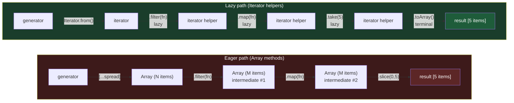

# [FEE-10100] Iterator Helpers — `.map()`, `.filter()`, `.take()` on Iterators

:::info
You can now chain `.map()`, `.filter()`, and `.take()` directly on any iterator — no intermediate arrays, no libraries, and no eager evaluation.
:::

:::warning Web Platform Proposals
This proposal reached TC39 Stage 4 and shipped as part of ECMAScript 2025.
Available in Chrome 122+, Firefox 131+, Safari 18.4+. Iterator helpers are Baseline Newly Available as of March 2025.
Check MDN for the current compatibility table.
:::

## Context

JavaScript has always had a composition problem with iterables. Arrays have rich transformation methods — `.map()`, `.filter()`, `.reduce()` — but those methods only work on arrays. Any other iterable (a `Set`, a `Map`, a generator, a `NodeList`) must first be materialized into an array before you can do anything useful with it.

### The three problems

**1. Forced eager materialization.** If you have a `Set` of user IDs and you want to map over it, you cannot call `.map()` directly. You must spread it first:

```js
const ids = new Set([1, 2, 3, 4, 5]);

// This does NOT work — Set has no .map()
ids.map(id => fetchUser(id)); // TypeError

// You must materialize first
[...ids].map(id => fetchUser(id));
```

That spread creates a full intermediate array, even if you only needed the first result.

**2. Intermediate arrays multiply.** Chaining `.filter()` and `.map()` on an array creates two separate intermediate arrays. For large datasets this is wasteful:

```js
const result = largeArray
  .filter(x => x.active)   // intermediate array #1
  .map(x => x.name)        // intermediate array #2
  .slice(0, 10);            // final result
```

Three passes over the data. Three allocations. The `.slice(0, 10)` at the end makes all the work done on items 11 through N completely wasted.

**3. Generators have no composition utilities.** Generator functions are a powerful tool for expressing lazy sequences, but the iterator protocol they implement has no built-in helpers. A generator that yields 10,000 items has no `.filter()`, no `.take()`, nothing:

```js
function* naturals() {
  let n = 0;
  while (true) yield n++;
}

// To get the first 5 even numbers, you must write the loop by hand
function firstFiveEvens() {
  const result = [];
  for (const n of naturals()) {
    if (n % 2 === 0) result.push(n);
    if (result.length === 5) break;
  }
  return result;
}
```

This is exactly the kind of boilerplate that kills productivity. Libraries like Lodash and Ramda have always filled this gap — `_.chain()` in Lodash is a well-known workaround — but they require a runtime dependency and operate on arrays, not iterators.

**4. Infinite sequences are impractical.** Because there is no way to say "stop after 5 results", a developer with an infinite generator is forced to either collect into a big finite array manually, or write the early-exit loop from scratch every time.

Iterator helpers solve all four problems in one go.

## Scenario

Your team receives large paginated datasets from an API. Rather than pulling all pages at once, a senior engineer has written a generator that yields records lazily as they arrive:

```js
async function* fetchRecords(endpoint) {
  let cursor = null;
  do {
    const resp = await fetch(`${endpoint}?cursor=${cursor ?? ''}`);
    const page = await resp.json();
    for (const record of page.items) yield record;
    cursor = page.nextCursor;
  } while (cursor);
}
```

You need to find the first 10 active premium users from this stream. Without iterator helpers, you have two bad options:

```js
// Option A: collect everything first — defeats the purpose of the generator
const allRecords = [];
for await (const r of fetchRecords('/users')) allRecords.push(r);
const result = allRecords
  .filter(r => r.active && r.plan === 'premium')
  .slice(0, 10);

// Option B: write manual loop boilerplate every time
const result = [];
for await (const r of fetchRecords('/users')) {
  if (r.active && r.plan === 'premium') result.push(r);
  if (result.length === 10) break;
}
```

With sync iterator helpers (and the async variant once it ships), this becomes a single expressive chain:

```js
// Clean, lazy, readable — stops as soon as it has 10 results
const result = Iterator.from(fetchRecords('/users'))
  .filter(r => r.active && r.plan === 'premium')
  .take(10)
  .toArray();
```

No intermediate arrays. No manual `break`. The intent is immediately readable.

## Best Practices

**Engineers SHOULD chain iterator helpers before any eager terminal to avoid intermediate arrays.** The lazy helpers (`.map()`, `.filter()`, `.take()`, `.drop()`, `.flatMap()`) return new iterator objects — no work is done until a terminal method consumes the chain.

```js
// Correct: all transformation is lazy, one terminal at the end
const result = Iterator.from(data)
  .filter(x => x.active)
  .map(x => x.name)
  .take(10)
  .toArray();

// Incorrect: .toArray() in the middle breaks laziness
const names = Iterator.from(data)
  .filter(x => x.active)
  .toArray()             // eager — materializes here
  .map(x => x.name)     // now operating on an Array, not an iterator
  .slice(0, 10);
```

**Engineers MUST use `Iterator.from()` to access helpers on non-Array iterables.** `Set`, `Map`, generator results, and `NodeList` do not inherit from `Iterator.prototype` directly — wrap them with `Iterator.from()` first:

```js
const set = new Set([1, 2, 3, 4, 5]);

// TypeError — Set.prototype has no .filter()
set.filter(x => x > 2);

// Correct
Iterator.from(set).filter(x => x > 2).toArray(); // [3, 4, 5]
```

**Use `.take(n)` as a safety valve on potentially infinite or very large generators.** Any generator that can yield unbounded values should have a `.take(n)` in any chain that ends with `.toArray()` or `.reduce()`. Without it, a bug in your filter condition could cause the consumer to hang:

```js
// Dangerous: if no value satisfies the filter, this never terminates
Iterator.from(infiniteSource()).filter(isRare).toArray();

// Safe: guaranteed to stop
Iterator.from(infiniteSource()).filter(isRare).take(100).toArray();
```

**Iterators are single-use.** Once an iterator is consumed (fully or partially), it is exhausted. You cannot rewind or iterate it again. If you need to iterate the same data multiple times, call the factory function again to get a fresh iterator:

```js
const iter = Iterator.from(mySet);
iter.take(3).toArray(); // [a, b, c]
iter.take(3).toArray(); // [] — iterator is exhausted

// Correct: create a new iterator each time
const fresh = () => Iterator.from(mySet);
fresh().take(3).toArray(); // [a, b, c]
fresh().take(3).toArray(); // [a, b, c]
```

**Prefer `.find()` or `.some()` over `.filter().toArray()[0]`** when you only need to check or retrieve a single element — they short-circuit on the first match and do not consume the rest of the iterator.

## Design Thinking

### Lazy evaluation is standard everywhere except JS arrays

Most modern languages treat iteration as inherently lazy by default. Python's built-in `map()` and `filter()` return lazy generators — no work is done until you iterate the result. Haskell's lists are lazy by construction: an infinite list `[1..]` is perfectly valid because nothing is evaluated until consumed. Rust's iterator adapters (`.map()`, `.filter()`, `.take_while()`) are famously zero-cost: the compiler fuses the entire chain into a single tight loop.

JavaScript took the opposite approach. Array methods, introduced in ES5, were designed for small, in-memory collections in an era when "big data in the browser" was not a real concern. The methods are eager: every element is transformed before returning. The `Symbol.iterator` protocol was added in ES6, but only the low-level protocol — no high-level helpers came with it.

The result: two parallel universes. Arrays have a rich method library; everything else has nothing. Iterator helpers collapse this gap.

### Lodash's `_.chain()` was the userland answer

`_.chain()` in Lodash has been a widely used workaround for over a decade:

```js
import _ from 'lodash';

const result = _.chain([1, 2, 3, 4, 5, 6, 7, 8, 9, 10])
  .filter(n => n % 2 === 0)
  .map(n => n * n)
  .take(3)
  .value(); // [4, 16, 36]
```

`_.chain()` wraps the array in a lazy wrapper that defers execution until `.value()` is called. This is functionally similar to iterator helpers — the difference is that it still operates on arrays, not on the iterator protocol itself, so it cannot consume generators or non-array iterables natively. Iterator helpers are the native, protocol-level version of this pattern.

### Infinite sequences are now practical

Before iterator helpers, an infinite sequence was a conceptual tool — useful for explaining generators but awkward to use in real code. Now, a developer can express "give me the first N even squares from the natural numbers" as a direct pipeline:

```js
function* naturals() {
  let n = 0;
  while (true) yield n++;
}

// First 5 even squares — reads like a specification
Iterator.from(naturals())
  .map(n => n * n)
  .filter(n => n % 2 === 0)
  .take(5)
  .toArray(); // [0, 4, 16, 36, 64]
```

The generator never produces the infinite list. Each step pulls one value at a time: `.take(5)` requests 5, `.filter()` pulls from `.map()` until 5 pass, `.map()` pulls from `naturals()` one value at a time. Nothing is materialized prematurely.

### Why arrays stayed eager

Changing `Array.prototype.map()` to return a lazy iterator would break the web. Thousands of codebases rely on `Array.prototype.map()` returning a real array immediately. The TC39 committee explicitly chose to add helpers on `Iterator.prototype` rather than change `Array.prototype`, leaving array behavior untouched. This is the same backward-compatibility discipline that gave us `const`/`let` instead of changing `var`.

## Visual



The eager path creates three intermediate arrays regardless of how few results you need. The lazy path pulls values one at a time — once `.take(5)` has collected 5 items, the generator is never called again.

## Example

### 1. Infinite Fibonacci with lazy filtering

```js
function* fibonacci() {
  let [a, b] = [0, 1];
  while (true) {
    yield a;
    [a, b] = [b, a + b];
  }
}

// First 5 even Fibonacci numbers
const result = Iterator.from(fibonacci())
  .filter(n => n % 2 === 0)
  .take(5)
  .toArray();

console.log(result); // [0, 2, 8, 34, 144]
```

The generator yields values indefinitely; `.take(5)` ensures it stops after collecting 5 even numbers.

### 2. Deduplicating and transforming with `Iterator.from(Set)`

```js
const raw = new Set([1, 2, 3, 2, 1, 4, 5]);

const doubled = Iterator.from(raw)
  .map(x => x * 2)
  .toArray();

console.log(doubled); // [2, 4, 6, 8, 10]
```

`Iterator.from()` wraps the `Set` — which already deduplicates by construction — and gives it the full iterator helper API.

### 3. Mapping over a Map's entries

```js
const scores = new Map([
  ['Alice', 92],
  ['Bob', 78],
  ['Carol', 85],
]);

const passing = Iterator.from(scores)
  .filter(([, score]) => score >= 80)
  .map(([name, score]) => `${name}: ${score}`)
  .toArray();

console.log(passing); // ["Alice: 92", "Carol: 85"]
```

### 4. Lodash equivalent for comparison

The Lodash `_.chain()` pattern compared side by side:

```js
// Lodash — array-based, requires a dependency
import _ from 'lodash';

const lodashResult = _.chain([1, 2, 3, 4, 5, 6, 7, 8, 9, 10])
  .filter(n => n % 2 === 0)
  .map(n => n * n)
  .take(3)
  .value();
// [4, 16, 36]

// Iterator helpers — native, works on any iterable
function* nums() { let n = 1; while (true) yield n++; }

const nativeResult = Iterator.from(nums())
  .filter(n => n % 2 === 0)
  .map(n => n * n)
  .take(3)
  .toArray();
// [4, 16, 36]
```

The iterator helpers version works on an infinite generator; the Lodash version requires a finite array upfront.

### 5. Early exit with `.find()` and `.some()`

```js
const data = Iterator.from([10, 3, 7, 25, 2, 18]);

// Short-circuits on first match — does not consume the whole iterator
const firstBig = data.find(n => n > 20);
console.log(firstBig); // 25

// Check existence without collecting
const hasTiny = Iterator.from([10, 3, 7, 25]).some(n => n < 5);
console.log(hasTiny); // true
```

## Deep Dive

### Complete API reference

#### Lazy methods (return a new iterator helper — no work done yet)

| Method | Description |
|--------|-------------|
| `.map(mapperFn)` | Transform each value; yields mapped values one at a time |
| `.filter(predicateFn)` | Skip values that fail the predicate |
| `.take(limit)` | Stop after yielding `limit` values |
| `.drop(limit)` | Skip the first `limit` values, yield the rest |
| `.flatMap(mapperFn)` | Map each value to an iterable, then flatten one level |
| `.indexed()` | **NOT in the spec.** This method was discussed during the proposal but was not included in ECMAScript 2025. Use `.map((v, i) => [i, v])` or `entries()` on arrays if you need index access. |

Note: `.map()` on iterators does NOT receive an index as the second argument (unlike `Array.prototype.map`). The mapper receives only the current value.

#### Eager methods (consume the iterator — trigger evaluation)

| Method | Description |
|--------|-------------|
| `.toArray()` | Collect all remaining values into an `Array` |
| `.reduce(reducerFn, initialValue)` | Fold values into a single result |
| `.forEach(fn)` | Call `fn` for each value; returns `undefined` |
| `.some(predicateFn)` | Returns `true` if any value passes; short-circuits |
| `.every(predicateFn)` | Returns `true` if all values pass; short-circuits on first failure |
| `.find(predicateFn)` | Returns the first value that passes; short-circuits |

#### Static method

| Method | Description |
|--------|-------------|
| `Iterator.from(iterableOrIterator)` | Wrap any iterable or iterator to gain access to `Iterator.prototype` helpers |

### How `Iterator.from()` works

`Iterator.from()` checks if its argument already inherits from `Iterator.prototype`. If it does, it returns it directly. If not, it creates a thin wrapper that delegates to the underlying iterator's `next()` and `return()` methods. This means the wrapping overhead is minimal, and any cleanup semantics of the original iterator (e.g., generator `finally` blocks) are preserved.

```js
function* gen() {
  try {
    yield 1;
    yield 2;
    yield 3;
  } finally {
    console.log('cleaned up');
  }
}

// .take(1) calls iterator.return() to signal early termination
// The generator's finally block still runs
Iterator.from(gen()).take(1).toArray();
// logs: "cleaned up"
// returns: [1]
```

### Subclassing `Iterator`

The `Iterator` class is designed to be subclassed. If you build a custom data structure with a custom iterator, you can have it inherit from `Iterator` and get all the helpers for free:

```js
class Range extends Iterator {
  #start; #end;
  constructor(start, end) {
    super();
    this.#start = start;
    this.#end = end;
  }
  next() {
    if (this.#start >= this.#end) return { done: true, value: undefined };
    return { done: false, value: this.#start++ };
  }
}

const range = new Range(1, 11);
range.filter(n => n % 2 === 0).toArray(); // [2, 4, 6, 8, 10]
```

### Polyfilling

For environments that do not yet support iterator helpers, a spec-compliant polyfill is available:

```
npm install iterator-helpers-polyfill
```

Or use the `core-js` polyfill with `useBuiltIns: 'usage'` in Babel. The polyfill patches `Iterator.prototype` and adds `Iterator.from()`.

### TC39 Stage history

Iterator helpers reached TC39 Stage 4 at the January 2026 TC39 plenary and shipped as part of ECMAScript 2025 (published June 2025). The proposal was championed by Michael Ficarra, Yulia Startsev, Lea Verou, and others. It sat at Stage 3 for several years while browser implementations caught up.

## Internal References

- [FEE-300 JavaScript Core & Runtime Overview](../../JavaScript%20Core%20and%20Runtime/300.md)
- [FEE-308 Generators & Iterators](../../JavaScript%20Core%20and%20Runtime/308.md)
- [FEE-10101 Set Methods](10101.md)

## References

- [TC39 proposal-iterator-helpers](https://github.com/tc39/proposal-iterator-helpers) — proposal repository with spec text and motivation
- [MDN: Iterator](https://developer.mozilla.org/en-US/docs/Web/JavaScript/Reference/Global_Objects/Iterator) — full method reference and browser compatibility
- [V8 blog: Iterator helpers](https://v8.dev/features/iterator-helpers) — implementation notes and examples from the V8 team
- [web.dev: Iterator helpers Baseline announcement](https://web.dev/blog/baseline-iterator-helpers) — Baseline Newly Available announcement, March 2025
- [ECMAScript 2025 finalized — socket.dev](https://socket.dev/blog/ecmascript-2025-finalized) — Iterator helpers and Set Methods in ES2025
- [LogRocket: Iterator helpers, the most underrated feature in ES2025](https://blog.logrocket.com/iterator-helpers-es2025/) — practical guide with examples
