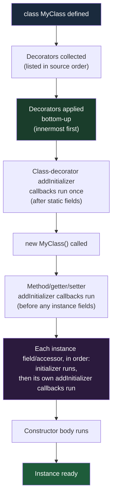

# [FEE-10300] Decorators — Class, Method, and Field Decorators

:::info
TC39 decorators define a standard way to annotate and transform classes, methods, and fields. Today they run only through transpilers (TypeScript 5.0+, Babel, or esbuild) because no browser ships them natively, but they replace the incompatible `experimentalDecorators` system that frameworks have relied on since 2015.
:::

:::warning Web Platform Proposals
This proposal is listed at TC39 Stage 2.7 as of 2026-07 (previously Stage 3 from March 2022; reclassified amid stalled browser implementations). See "Running decorators today" below for engine status.
No browser ships decorators natively; see [caniuse.com/decorators](https://caniuse.com/decorators) for current support.
TypeScript 5.0+ supports TC39 decorators without the `experimentalDecorators` flag, via transpilation.
Check the [TC39 proposal repo](https://github.com/tc39/proposal-decorators) for the latest status.
:::

:::danger Legacy vs TC39 Decorators — Two Incompatible Systems
**There are two completely incompatible decorator systems in the JavaScript ecosystem. This article covers ONLY the TC39 standard (currently Stage 2.7).**

| | Legacy TypeScript decorators | TC39 decorators |
|---|---|---|
| Enabled by | `"experimentalDecorators": true` in tsconfig | TypeScript 5.0+ with no extra flag |
| Spec basis | Abandoned early TC39 proposal (2015) | TC39 Stage 2.7 (reached Stage 3 in 2022, reclassified May 2026); transpiler-only, no native runtime |
| Context object | Raw descriptor (`target`, `key`, `descriptor`) | Structured `context` object with `kind`, `name`, `addInitializer`, `metadata` |
| Field decorators | Run once at class definition; cannot see values | Run at definition with `value` as `undefined`; may return an initializer-transform function |
| Parameter decorators | Supported (used by DI frameworks) | Absent from the standard — a separate proposal, `tc39/proposal-class-method-parameter-decorators`, sits at Stage 1 |
| Metadata | `Reflect.metadata` (separate proposal, never standardized) | `Symbol.metadata`, from the companion Decorator Metadata proposal (Stage 2.7) |
| Used by | Angular (all versions), NestJS (all versions), TypeORM, MobX ≤5 | Lit 3+, MobX 6.11+, new standalone libraries |

**Mixing the two in the same project produces cryptic TypeScript errors and runtime bugs. If your tsconfig has `"experimentalDecorators": true`, you are NOT using TC39 decorators.**

Frameworks whose dependency injection relies on parameter decorators and `design:paramtypes` metadata (Angular, NestJS) cannot mechanically migrate to TC39 decorators today; see "Migration Guide" below.
:::

## Context

The TC39 decorators proposal was first presented in 2014 (champion: Yehuda Katz) and went through three full redesigns before reaching Stage 3 in March 2022, a standardization effort now past its twelfth year. Python added function decorators in 2003, Java annotations arrived in 2004, C# has had attributes since .NET 1.0, and Swift introduced property wrappers in 2019; JavaScript's class-annotation syntax is arriving roughly two decades after the earliest of those.

### The boilerplate problem

Consider four concerns that appear in virtually every serious application: **logging**, **caching**, **input validation**, and **dependency injection**. Each is orthogonal to the business logic it wraps. Writing them inline pollutes the business logic; extracting them requires hand-rolled wrapper patterns:

```js
// Without decorators: logging wrapped by hand
class UserService {
  getUser(id) {
    console.log(`getUser called with ${id}`);
    const start = performance.now();
    const result = this._fetchUser(id);
    console.log(`getUser returned in ${performance.now() - start}ms`);
    return result;
  }
}
```

Repeat this across dozens of methods and the logging concern becomes impossible to manage consistently.

### TypeScript's false start

TypeScript added `experimentalDecorators` in 2015, based on a very early TC39 proposal. That early proposal was later abandoned after extensive redesign discussions. TypeScript's implementation shipped into production use by Angular, NestJS, and MobX, all of which are now bound to the legacy behavior. The TC39 proposal was completely redesigned before reaching Stage 3 in 2022, resulting in a cleaner, more principled API that is **incompatible** with the TypeScript experimental version.

This split created the two-system problem documented in the danger block above.

### What the TC39 design standardizes

The specification defines six decorator kinds (`class`, `method`, `getter`, `setter`, `field`, and `accessor`), each receiving a structured **context object** rather than raw property descriptors. The context object provides a consistent interface: the `kind` of thing being decorated, its `name`, whether it is `static` or `private`, an `addInitializer` hook for per-instance setup, and an `access` object for reading and writing the value.

### The wall: DI frameworks cannot migrate

A developer joins a team maintaining an Angular application. The codebase has `"experimentalDecorators": true` in tsconfig and uses `@Component`, `@Injectable`, and `@Input` throughout. A new utility library (`@observability/trace`) ships with TC39-style decorators for tracing service method calls.

The developer installs the library and applies `@trace` to a service method:

```ts
// tsconfig.json — legacy setting is still present
{
  "compilerOptions": {
    "experimentalDecorators": true,   // <-- this is the problem
    "emitDecoratorMetadata": true
  }
}
```

```ts
import { trace } from '@observability/trace'; // TC39-style decorator

@Injectable()
export class UserService {
  @trace()  // TypeScript error: Argument of type 'MethodDecorator' is not assignable...
  getUser(id: string) { ... }
}
```

TypeScript reports an incompatibility error because `experimentalDecorators: true` tells the compiler to expect legacy decorator signatures (taking `target`, `key`, `descriptor`), but `@trace` exports a TC39-style decorator that takes `(value, context)`.

Unlike a version-skew problem, there is no upgrade path that resolves this. Angular's dependency injection identifies constructor parameters using legacy parameter decorators plus `emitDecoratorMetadata`'s `design:paramtypes`. Neither has a standard equivalent (parameter decorators are covered by the separate, Stage 1 `tc39/proposal-class-method-parameter-decorators`). Angular's own CLI still scaffolds new projects with `"experimentalDecorators": true` in the workspace tsconfig template; NestJS is in the same position for the same reason. The realistic options are to call `@observability/trace`'s plain-function API directly or to wrap the method by hand; no Angular release migrates the framework to standard decorators.

### Running decorators today

Every code example in this article requires a build step; nothing here runs unmodified in a browser or in Node without transpilation. As of 2026-07, the transpiler matrix is:

| Tool | Minimum version |
|---|---|
| TypeScript | 5.0+ (no `experimentalDecorators` flag) |
| Babel | `@babel/plugin-proposal-decorators`, `version: "2023-11"` |
| esbuild | 0.21+ |
| SWC | supported via `jsc.transform.decoratorVersion: "2022-03"` |

Deno and Bun (1.3.10+) transpile standard decorators with their built-in TypeScript transpilers; Node's built-in type-stripping and `--experimental-transform-types` reject decorator syntax outright, so on Node the code needs an external transpiler or loader (tsx, ts-node, or a build step). None of the three executes decorators natively.

## Visual



**Application order detail:** When multiple decorators are stacked on one element, they are applied bottom-up (the decorator closest to the declaration runs first). This matches the mathematical function composition convention: `@A @B fn` means `A(B(fn))`.

```ts
class Example {
  @outer   // applied second
  @inner   // applied first
  method() {}
}
```

## Example

### 1. `@logged` — method decorator for call tracing

```ts
function logged(value, context) {
  const methodName = String(context.name);

  return function (...args) {
    console.log(`[${methodName}] called with`, args);
    const result = value.call(this, ...args);
    console.log(`[${methodName}] returned`, result);
    return result;
  };
}

class Calculator {
  @logged
  add(a, b) {
    return a + b;
  }
}

const calc = new Calculator();
calc.add(2, 3);
// [add] called with [2, 3]
// [add] returned 5
```

The decorator returns a new function that wraps the original. `value.call(this, ...args)` ensures the original method's `this` binding is preserved.

### 2. `@memoize` — method decorator for caching

```ts
function memoize(value, context) {
  const cache = new Map();

  return function (...args) {
    const key = JSON.stringify(args);
    if (cache.has(key)) {
      return cache.get(key);
    }
    const result = value.call(this, ...args);
    cache.set(key, result);
    return result;
  };
}

class MathService {
  @memoize
  fibonacci(n) {
    if (n <= 1) return n;
    return this.fibonacci(n - 1) + this.fibonacci(n - 2);
  }
}

const svc = new MathService();
svc.fibonacci(40); // computed once
svc.fibonacci(40); // returned from cache
```

Note: this cache is shared across all instances because `cache` is captured in the decorator closure at class-definition time, not per-instance. For a per-instance cache, use `addInitializer` to store the map on the instance.

### 3. `@required` — accessor decorator that validates every assignment

An `addInitializer` callback for an instance field runs immediately after that field's own declared initializer, before the constructor body executes, so it cannot see a value the constructor assigns afterward. To validate a value the constructor sets, decorate an `accessor` field instead and check the value in the returned `set`, which fires on every assignment including from the constructor:

```ts
function required(value, context) {
  const { get, set } = value;
  return {
    get() {
      return get.call(this);
    },
    set(newValue) {
      if (newValue === undefined || newValue === null) {
        throw new Error(
          `Field "${String(context.name)}" is required but was ${newValue}`
        );
      }
      set.call(this, newValue);
    },
  };
}

class User {
  @required
  accessor name;

  @required
  accessor email;

  constructor(data) {
    this.name = data.name;   // runs through the generated setter above
    this.email = data.email;
  }
}

new User({ name: 'Alice', email: 'alice@example.com' }); // OK
new User({ name: 'Bob', email: null }); // Error: Field "email" is required but was null
```

### 4. The decorator context object

Every decorator receives a `context` object as its second argument. Here is the full structure:

```ts
interface DecoratorContext {
  kind: 'class' | 'method' | 'getter' | 'setter' | 'field' | 'accessor';
  name: string | symbol;
  static: boolean;
  private: boolean;
  access: {
    get?: (object) => unknown;   // present for method, getter, field, accessor
    set?: (object, value) => void; // present for setter, field, accessor
    has?: (object) => boolean;   // present across kinds, not limited to private members
  };
  addInitializer: (initializer: () => void) => void;
  metadata: Record<string | symbol, unknown>; // shared across all decorators on the class
}
```

```ts
function inspect(value, context) {
  console.log('kind:', context.kind);
  console.log('name:', context.name);
  console.log('static:', context.static);
  console.log('private:', context.private);
  return value; // return unchanged
}

class Demo {
  @inspect
  greet() {}

  @inspect
  static count = 0;
}
// kind: method, name: greet, static: false, private: false
// kind: field, name: count, static: true, private: false
```

## Best Practices

**Engineers MUST NOT mix legacy `experimentalDecorators` and TC39 decorators in the same project.** TypeScript will emit confusing errors, and runtime behavior will be unpredictable. Pick one system and use it consistently.

**Use decorators for cross-cutting concerns:** logging, caching, validation, dependency injection, serialization, access control, rate limiting. These are the concerns that decorators are designed to express cleanly.

```ts
class ProductService {
  @logged       // cross-cutting: tracing
  @memoize      // cross-cutting: caching
  getProduct(id: string) {
    return this.db.find(id);
  }
}
```

**Do NOT use decorators to hide business logic.** The body of a decorated class or method should be fully readable without knowing what the decorator does. If a reader must understand `@processOrder` to understand what `submitOrder()` does, the decorator is hiding business logic rather than a cross-cutting concern.

```ts
// Bad: decorator hides essential business logic
class OrderService {
  @processOrderAndSendEmailAndDeductInventory
  submitOrder(order: Order) {
    // reader cannot understand this method without the decorator
  }
}

// Good: decorator handles a cross-cutting concern only
class OrderService {
  @transactional   // infrastructure concern: wraps in DB transaction
  submitOrder(order: Order) {
    this.inventory.deduct(order.items);
    this.email.sendConfirmation(order.customer);
    this.db.save(order);
  }
}
```

**Use `addInitializer` for instance bootstrapping, not for validating values the constructor assigns later.** Field decorators receive `undefined` as their `value`; `context.addInitializer` queues a callback that runs immediately after that field's own declared initializer, before the constructor body executes. That makes it well suited to registering the instance somewhere or seeding an internal `Map`, but it runs too early to see a value the constructor assigns. To validate or transform a value on every assignment (including from the constructor), decorate an `accessor` field instead and reject bad values in the returned `set`:

```ts
function required(value, context) {
  const { get, set } = value;
  return {
    get() {
      return get.call(this);
    },
    set(newValue) {
      if (newValue === undefined || newValue === null) {
        throw new Error(`Field "${String(context.name)}" is required but was ${newValue}`);
      }
      set.call(this, newValue);
    },
  };
}
```

**Always verify your TypeScript version before using TC39 decorators.** TypeScript 5.0+ without `experimentalDecorators: true` uses TC39 decorators. TypeScript 4.x with `experimentalDecorators: true` uses the legacy system. If your project was set up before 2023, verify which version and setting you have before adding decorator libraries.

## Design Thinking

### Decorators across languages

The decorator pattern has a long cross-language history:

- **Python (2003):** `@decorator` syntax on functions and classes. Python decorators are ordinary higher-order functions; the syntax is pure sugar for `fn = decorator(fn)`.
- **Java annotations (2004):** metadata-only in the language itself, but frameworks like Spring and JUnit use reflection to act on them. Annotations do not transform the annotated element at define time.
- **C# attributes:** similar to Java annotations; metadata that tools and runtimes read via reflection.
- **Swift property wrappers (2019):** a compile-time mechanism to wrap stored properties in a generic struct, providing get/set behavior customization.
- **TypeScript `experimentalDecorators` (2015):** based on the TC39 Stage 1 proposal that was later redesigned. These shipped early into production use by major frameworks before the spec stabilized.

The TC39 design most closely resembles Python decorators in spirit (the decorator returns a replacement or wrapper), but adds the structured context object to provide richer metadata without requiring reflection.

### The TC39 redesign

The original TC39 decorator proposal (champion: Yehuda Katz, 2014) was based on property descriptors. It went through at least three major redesigns before reaching Stage 3 in March 2022:

- **v1 (2014–2018):** Descriptor-based, similar to what TypeScript implemented. Stalled due to interaction problems with `Reflect.metadata` and class fields.
- **v2 (2018–2020):** "Static decorators," a fundamentally different approach using compile-time analysis. Abandoned because it was too restrictive.
- **v3 (2020–2022):** Context-object-based. Decorators receive a structured `context` object instead of raw descriptors. `addInitializer` provides the per-instance hook. `Symbol.metadata` replaces `Reflect.metadata`. This is the version that reached Stage 3, and was reclassified to Stage 2.7 in May 2026 once browser implementation stalled (see "Running decorators today" in Context).

That multi-year redesign explains why TypeScript's 2015 implementation diverged so dramatically from the final design.

### Key design differences from legacy decorators

The most important behavioral difference is **field decorator timing**. Legacy TypeScript property decorators run once at class-definition time and receive only `(target, key)`; the decorator never sees a descriptor or a value and plays no part in per-instance initialization. TC39 field decorators run at class-definition time too, but receive `value` as `undefined` and may return an initializer-transform function that runs against the field's declared initial value. Per-instance setup that needs the constructed instance goes through `addInitializer` instead, which (for instance field, accessor, method, getter, and setter decorators) runs immediately after that member's own declaration step, before the constructor body executes (see Deep Dive for the full ordering).

The second key difference is the **context object vs. raw descriptors**. Legacy decorators receive `(target, key, descriptor)`: you must inspect `descriptor.value` or `descriptor.get` to know what you're decorating. TC39 decorators receive `(value, context)` where `context.kind` tells you exactly what you are working with.

## Deep Dive

### All decorator kinds and signatures

#### Method decorator

```ts
function methodDecorator(value: Function, context: ClassMethodDecoratorContext) {
  // value: the original method function
  // return: a replacement function, or undefined to keep original
  return function (...args) {
    return value.call(this, ...args);
  };
}
```

- `context.kind === 'method'`
- Return a new function to replace the method; return `undefined` (or nothing) to leave it unchanged.

#### Field decorator

```ts
function fieldDecorator(value: undefined, context: ClassFieldDecoratorContext) {
  // value: always undefined for fields
  // return: an initializer function, or undefined
  return function (initialValue) {
    // called with the field's initializer value; return the actual stored value
    return initialValue;
  };
}
```

- `context.kind === 'field'`
- Return a function that takes the initial value and returns the stored value. This is how you can transform the initial value.
- Use `context.addInitializer` for side effects that need the fully-initialized instance.

#### Class decorator

```ts
function classDecorator(value: typeof MyClass, context: ClassDecoratorContext) {
  // value: the class constructor itself
  // return: a replacement class, or undefined
  return class extends value {
    extraMethod() { return 'added by decorator'; }
  };
}
```

- `context.kind === 'class'`
- Return a new class (typically extending the original) to replace it, or return `undefined` to leave unchanged.

#### Accessor decorator (`accessor` keyword)

The `accessor` keyword creates an auto-accessor field backed by a private slot with getter and setter:

```ts
class Temperature {
  @logged
  accessor celsius = 0;
}
```

The accessor decorator receives an object `{ get, set }` and can return a new `{ get, set }` pair:

```ts
function logged(value, context) {
  const { get, set } = value;
  return {
    get() {
      const v = get.call(this);
      console.log(`get ${String(context.name)}:`, v);
      return v;
    },
    set(v) {
      console.log(`set ${String(context.name)}:`, v);
      set.call(this, v);
    },
  };
}
```

#### Getter and setter decorators

```ts
class Box {
  #value = 0;

  @logged
  get value() { return this.#value; }

  @logged
  set value(v) { this.#value = v; }
}
```

- `context.kind === 'getter'` or `'setter'`
- Return a new getter/setter function, or `undefined`.

### `addInitializer(fn)`

`addInitializer` is available to every decorator kind, but *when* the queued callback runs depends on the kind; the ordering is not a single rule:

| Decorator kind | When its `addInitializer` callback runs |
|---|---|
| `class` | Once, after the class is fully defined and after static field initializers have run. `this` is the class itself. |
| `method` / `getter` / `setter` (instance) | During construction, before any instance fields are initialized. `this` is the new instance. |
| `field` / `accessor` (instance) | During construction, immediately after that specific field's own declared initializer runs — interleaved per field, not batched at the end. `this` is the new instance. |
| `method` / `getter` / `setter` (static) | Once, at class-definition time, after static class methods have been assigned but before any static field initializers run — not at the member's source position. `this` is the class itself. |
| `field` / `accessor` (static) | Once, at class-definition time, immediately after that specific static field's own declared initializer runs — interleaved per member, in source position. `this` is the class itself. |

The instance method/getter/setter-before-fields ordering is what makes the canonical `@bound` decorator work: it can safely register a bound-method initializer that runs before any field relies on the bound method existing.

Key rules:
- Multiple calls to `addInitializer` queue multiple callbacks; they run in declaration order.
- It cannot be called after the class definition completes.

```ts
function register(value, context) {
  context.addInitializer(function () {
    // `this` is the new instance
    Registry.register(this, context.name);
  });
}
```

### `Symbol.metadata`

`context.metadata` and `Symbol.metadata` come from a companion proposal, `tc39/proposal-decorator-metadata` (also Stage 2.7), not from the decorators proposal itself; it replaces the `Reflect.metadata` dependency from the legacy system. TypeScript supports it starting at 5.2 (not 5.0). No JavaScript engine defines `Symbol.metadata` yet, so until an engine ships it, code that reads `MyClass[Symbol.metadata]` needs the well-known symbol polyfilled, for example:

```ts
(Symbol as any).metadata ??= Symbol.for('Symbol.metadata');
```

With that polyfill (or `core-js`) in place: all decorators applied to a class share one `context.metadata` object, and after the class is defined, that object is stored at `MyClass[Symbol.metadata]`.

```ts
function serialize(value, context) {
  // store metadata for later use by a serialization library
  context.metadata[context.name] = { serializable: true, type: 'string' };
}

class Person {
  @serialize
  name;

  @serialize
  email;
}

console.log(Person[Symbol.metadata]);
// { name: { serializable: true, type: 'string' },
//   email: { serializable: true, type: 'string' } }
```

## Migration Guide

### Migrating from `experimentalDecorators`

**What changes:**

1. Remove `"experimentalDecorators": true` and `"emitDecoratorMetadata": true` from tsconfig.
2. Upgrade TypeScript to 5.0+ (5.2+ if you need `Symbol.metadata`).
3. All custom decorators must be rewritten: the signature changes from `(target, key, descriptor)` to `(value, context)`.
4. Libraries that provided legacy decorators must be updated to versions that ship TC39 decorators.
5. `Reflect.metadata` usage must be replaced with `Symbol.metadata` (plus a polyfill; see Deep Dive).

**What stays the same:**

- The `@decorator` call-site syntax is identical.
- Decorators still cannot be used on plain object literals (class members only in TC39).
- Stacking and composition behavior is the same.

**What cannot migrate at all:** parameter decorators. The TC39 standard has no equivalent; a separate proposal, `tc39/proposal-class-method-parameter-decorators`, is still at Stage 1. Any decorator that reads a constructor parameter's type (the pattern dependency-injection frameworks build on) has no mechanical path to the standard today.

### Framework and library status (2026-07)

- **Angular:** still generates projects with `experimentalDecorators: true`. A [feature request asking about standard-decorator support](https://github.com/angular/angular/issues/56146) was filed in May 2024 and closed by its own author 13 minutes later after finding a fresh Angular project builds without the flag; the underlying gap remains: Angular's DI is built on constructor parameter decorators, which the standard does not have.
- **NestJS:** in the same position as Angular, for the same reason: its DI container depends on parameter decorators and `emitDecoratorMetadata`'s `design:paramtypes`.
- **Lit 3+:** supports both systems. Its [decorators documentation](https://lit.dev/docs/components/decorators/) covers the standard-decorator path (which requires the `accessor` keyword, since standard decorators cannot change a class member's kind) but currently still recommends `experimentalDecorators` for production, citing smaller compiled output.
- **MobX 6.11+:** added support for the standard decorators; `@observable` and friends work on `accessor` fields, per the [MobX decorators documentation](https://mobx.js.org/enabling-decorators.html). Legacy decorators remain supported in the 6.x line but will be removed in MobX 7.

**TypeScript compatibility matrix:**

| TypeScript version | `experimentalDecorators: true` | No flag | Decorator system used |
|---|---|---|---|
| < 5.0 | Required | N/A | Legacy only |
| 5.0+ | Present | — | Legacy (flag takes precedence) |
| 5.0+ | Absent | — | TC39 (Stage 2.7) |

## Related Topics

- [FEE-303 Prototypes & Inheritance](../../JavaScript%20Core%20and%20Runtime/303.md): decorators operate on class prototypes; understanding the prototype chain is essential for method decorators
- [FEE-300 JavaScript Core Overview](../../JavaScript%20Core%20and%20Runtime/300.md): foundational context for classes and the object model

## References

- TC39, "proposal-decorators," GitHub. https://github.com/tc39/proposal-decorators
- TC39, "proposal-decorator-metadata," GitHub. https://github.com/tc39/proposal-decorator-metadata
- TC39, "ECMAScript proposals (stage tracking table)," GitHub tc39/proposals (2026). https://github.com/tc39/proposals
- Can I Use, "Decorators," caniuse.com (2026). https://caniuse.com/decorators
- Igalia, "Summary of the February 2025 TC39 plenary," Igalia Compilers Blog (2025). https://blogs.igalia.com/compilers/2025/03/27/summary-of-the-february-2025-tc39-plenary/
- Microsoft, "TypeScript 5.0," TypeScript release notes (2023). https://www.typescriptlang.org/docs/handbook/release-notes/typescript-5-0.html
- Microsoft, "TypeScript 5.2," TypeScript release notes (2023). https://www.typescriptlang.org/docs/handbook/release-notes/typescript-5-2.html
- Babel, "@babel/plugin-proposal-decorators," Babel documentation. https://babeljs.io/docs/babel-plugin-proposal-decorators
- Lit, "Decorators," lit.dev documentation. https://lit.dev/docs/components/decorators/
- MobX, "Enabling Decorators," mobx.js.org documentation. https://mobx.js.org/enabling-decorators.html
- Angular, Issue #56146 "Support for \"experimentalDecorators: false\" in TypeScript configuration file," GitHub (2024). https://github.com/angular/angular/issues/56146
- Axel Rauschmayer, "JavaScript metaprogramming with the 2022-03 decorators API," 2ality (2022). https://2ality.com/2022/10/javascript-decorators.html
- TC39, "Decorators to stage 2.7, per 2026.05.19 TC39," meeting notes, GitHub tc39/notes (2026). https://github.com/tc39/notes/blob/main/meetings/2026-05/may-19.md
