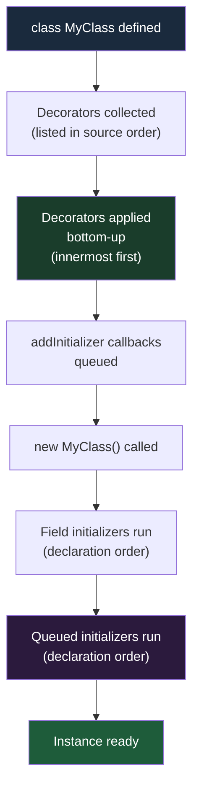

# [FEE-10300] Decorators — Class, Method, and Field Decorators

:::info
TC39 Stage 3 decorators give JavaScript a native, standards-aligned way to annotate and transform classes, methods, and fields — eliminating the cross-cutting-concern boilerplate that has long been delegated to frameworks and transpiler-specific hacks.
:::

:::warning Web Platform Proposals
This proposal is at TC39 Stage 3. Shipped Chrome 130+, Firefox 133+.
TypeScript 5.0+ supports TC39 decorators without the `experimentalDecorators` flag.
The API surface may change before Stage 4. Check MDN and the TC39 proposal repo for the latest status.
:::

:::danger Legacy vs TC39 Decorators — Two Incompatible Systems
**There are two completely incompatible decorator systems in the JavaScript ecosystem. This article covers ONLY the TC39 Stage 3 standard.**

| | Legacy TypeScript decorators | TC39 Stage 3 decorators |
|---|---|---|
| Enabled by | `"experimentalDecorators": true` in tsconfig | TypeScript 5.0+ with no extra flag |
| Spec basis | Abandoned early TC39 proposal (2015) | TC39 Stage 3 (2022), shipped in browsers |
| Context object | Raw descriptor (`target`, `key`, `descriptor`) | Structured `context` object with `kind`, `name`, `addInitializer`, `metadata` |
| Field decorators | Run after field initializer | Run before field initializer; `value` is `undefined` |
| Metadata | `Reflect.metadata` (separate proposal, never standardized) | `Symbol.metadata` on the class |
| Used by | Angular <18, NestJS <10, MobX legacy | Angular 18+, NestJS 10+, new libraries |

**Mixing the two in the same project produces cryptic TypeScript errors and runtime bugs. If your tsconfig has `"experimentalDecorators": true`, you are NOT using TC39 decorators.**

To migrate: remove `"experimentalDecorators": true` from tsconfig, update to TypeScript 5.0+, and follow the Angular 18 / NestJS migration guides.
:::

## Context

Decorators are one of the most-requested features in JavaScript's history. The concept is not new: Python added function decorators in 2003, Java annotations arrived in 2004, C# has had attributes since .NET 1.0, and Swift introduced property wrappers in 2019. Every major language ecosystem eventually converges on a mechanism for annotating and transforming code without modifying the code itself.

JavaScript lagged. The language had prototype manipulation, higher-order functions, and Proxy — all capable of meta-programming — but no first-class syntax for attaching cross-cutting concerns to classes.

### The boilerplate problem

Consider four concerns that appear in virtually every serious application: **logging**, **caching**, **input validation**, and **dependency injection**. Each is orthogonal to the business logic it wraps. Writing them inline pollutes the business logic; extracting them requires hand-rolled wrapper patterns:

```js
// Without decorators: logging wrapped by hand
class UserService {
  getUser(id) {
    console.log(`getUser called with ${id}`);
    const start = performance.now();
    const result = this._fetchUser(id);
    console.log(`getUser returned in ${performance.now() - start}ms`);
    return result;
  }
}
```

Repeat this across dozens of methods and the logging concern becomes impossible to manage consistently.

### TypeScript's false start

TypeScript added `experimentalDecorators` in 2015, based on a very early TC39 proposal. That early proposal was later abandoned after extensive redesign discussions. TypeScript's implementation shipped into production use by Angular, NestJS, and MobX — all of which are now bound to the legacy behavior. The TC39 proposal was completely redesigned before reaching Stage 3 in 2022, resulting in a cleaner, more principled API that is **incompatible** with the TypeScript experimental version.

This split created the two-system problem documented in the danger block above.

### What the TC39 design standardizes

The Stage 3 specification defines five decorator kinds — `method`, `field`, `class`, `accessor`, and `getter`/`setter` — each receiving a structured **context object** rather than raw property descriptors. The context object provides a consistent interface: the `kind` of thing being decorated, its `name`, whether it is `static` or `private`, an `addInitializer` hook for per-instance setup, and an `access` object for reading and writing the value.

## Scenario

A developer joins a team maintaining an Angular 17 application. The codebase has `"experimentalDecorators": true` in tsconfig and uses `@Component`, `@Injectable`, and `@Input` throughout. A new utility library (`@observability/trace`) ships with TC39-style decorators for tracing service method calls.

The developer installs the library and applies `@trace` to a service method:

```ts
// tsconfig.json — legacy setting is still present
{
  "compilerOptions": {
    "experimentalDecorators": true,   // <-- this is the problem
    "emitDecoratorMetadata": true
  }
}
```

```ts
import { trace } from '@observability/trace'; // TC39-style decorator

@Injectable()
export class UserService {
  @trace()  // TypeScript error: Argument of type 'MethodDecorator' is not assignable...
  getUser(id: string) { ... }
}
```

TypeScript reports an incompatibility error because `experimentalDecorators: true` tells the compiler to expect legacy decorator signatures (taking `target`, `key`, `descriptor`), but `@trace` exports a TC39-style decorator that takes `(value, context)`.

**The resolution path:**

1. Check whether Angular 18 has been released and is available for the project (Angular 18+ supports TC39 decorators).
2. If the project cannot yet migrate Angular, use a different tracing approach — either a wrapper function or wait for the library to provide a legacy-compatible export.
3. If migrating to Angular 18+: remove `experimentalDecorators` and `emitDecoratorMetadata` from tsconfig, upgrade TypeScript to 5.0+, and follow the [Angular 18 migration guide](https://angular.dev/guide/migrations/overview).

**The lesson:** never assume a decorator is compatible with your project's decorator system. Check the library's documentation for which system it targets.

## Best Practices

**Engineers MUST NOT mix legacy `experimentalDecorators` and TC39 decorators in the same project.** TypeScript will emit confusing errors, and runtime behavior will be unpredictable. Pick one system and use it consistently.

**Use decorators for cross-cutting concerns** — logging, caching, validation, dependency injection, serialization, access control, rate limiting. These are the concerns that decorators are designed to express cleanly.

```ts
class ProductService {
  @logged       // cross-cutting: tracing
  @memoize      // cross-cutting: caching
  getProduct(id: string) {
    return this.db.find(id);
  }
}
```

**Do NOT use decorators to hide business logic.** The body of a decorated class or method should be fully readable without knowing what the decorator does. If a reader must understand `@processOrder` to understand what `submitOrder()` does, the decorator is hiding business logic rather than a cross-cutting concern.

```ts
// Bad: decorator hides essential business logic
class OrderService {
  @processOrderAndSendEmailAndDeductInventory
  submitOrder(order: Order) {
    // reader cannot understand this method without the decorator
  }
}

// Good: decorator handles a cross-cutting concern only
class OrderService {
  @transactional   // infrastructure concern: wraps in DB transaction
  submitOrder(order: Order) {
    this.inventory.deduct(order.items);
    this.email.sendConfirmation(order.customer);
    this.db.save(order);
  }
}
```

**For field initialization side effects, use `addInitializer` rather than modifying field descriptors.** Field decorators receive `undefined` as their `value` (fields have no value at decoration time); the correct hook for per-instance setup is `context.addInitializer`:

```ts
function required(value, context) {
  // value is undefined for fields — do not try to use it here
  context.addInitializer(function () {
    // `this` is the instance; runs during construction
    if (this[context.name] === undefined || this[context.name] === null) {
      throw new Error(`Field "${String(context.name)}" is required`);
    }
  });
}
```

**Always verify your TypeScript version before using TC39 decorators.** TypeScript 5.0+ without `experimentalDecorators: true` uses TC39 decorators. TypeScript 4.x with `experimentalDecorators: true` uses the legacy system. If your project was set up before 2023, verify which version and setting you have before adding decorator libraries.

## Design Thinking

### Decorators across languages

The decorator pattern has a long cross-language history:

- **Python (2003)** — `@decorator` syntax on functions and classes. Python decorators are ordinary higher-order functions; the syntax is pure sugar for `fn = decorator(fn)`.
- **Java annotations (2004)** — metadata-only in the language itself, but frameworks like Spring and JUnit use reflection to act on them. Annotations do not transform the annotated element at define time.
- **C# attributes** — similar to Java annotations; metadata that tools and runtimes read via reflection.
- **Swift property wrappers (2019)** — a compile-time mechanism to wrap stored properties in a generic struct, providing get/set behavior customization.
- **TypeScript `experimentalDecorators` (2015)** — based on the TC39 Stage 1 proposal that was later redesigned. These shipped early into production use by major frameworks before the spec stabilized.

The TC39 Stage 3 design most closely resembles Python decorators in spirit (the decorator returns a replacement or wrapper), but adds the structured context object to provide richer metadata without requiring reflection.

### The TC39 redesign

The original TC39 decorator proposal (champion: Yehuda Katz, 2014) was based on property descriptors. It went through at least three major redesigns over eight years before reaching Stage 3 in 2022:

- **v1 (2014–2018):** Descriptor-based, similar to what TypeScript implemented. Stalled due to interaction problems with `Reflect.metadata` and class fields.
- **v2 (2018–2020):** "Static decorators" — a fundamentally different approach using compile-time analysis. Abandoned because it was too restrictive.
- **v3 (2020–2022, current):** Context-object-based. Decorators receive a structured `context` object instead of raw descriptors. Field decorators run before class fields are initialized. `addInitializer` provides the per-instance hook. `Symbol.metadata` replaces `Reflect.metadata`. This is the version at Stage 3.

The eight-year journey explains why TypeScript's 2015 implementation diverged so dramatically from the final design.

### Key design differences from legacy decorators

The most important behavioral difference is **field decorator timing**. In legacy TypeScript decorators, field decorators run after the field initializer. In TC39 decorators, field decorators run before the initializer, and the `value` argument is always `undefined` (because fields have no stable value yet). This is why `addInitializer` exists: it queues a callback that runs per-instance during construction, after the field initializer has assigned the value.

The second key difference is the **context object vs. raw descriptors**. Legacy decorators receive `(target, key, descriptor)` — you must inspect `descriptor.value` or `descriptor.get` to know what you're decorating. TC39 decorators receive `(value, context)` where `context.kind` tells you exactly what you are working with.

### Migration trajectory

Angular 18 and NestJS 10 both migrated to TC39 decorators. The migration is non-trivial because the signature of every framework-level decorator changed. For Angular, `ng update` handles the mechanical changes, but third-party decorator libraries may need to be updated or replaced.

## Visual



**Application order detail:** When multiple decorators are stacked on one element, they are applied bottom-up (the decorator closest to the declaration runs first). This matches the mathematical function composition convention: `@A @B fn` means `A(B(fn))`.

```ts
class Example {
  @outer   // applied second
  @inner   // applied first
  method() {}
}
```

## Example

### 1. `@logged` — method decorator for call tracing

```ts
function logged(value, context) {
  const methodName = String(context.name);

  return function (...args) {
    console.log(`[${methodName}] called with`, args);
    const result = value.call(this, ...args);
    console.log(`[${methodName}] returned`, result);
    return result;
  };
}

class Calculator {
  @logged
  add(a, b) {
    return a + b;
  }
}

const calc = new Calculator();
calc.add(2, 3);
// [add] called with [2, 3]
// [add] returned 5
```

The decorator returns a new function that wraps the original. `value.call(this, ...args)` ensures the original method's `this` binding is preserved.

### 2. `@memoize` — method decorator for caching

```ts
function memoize(value, context) {
  const cache = new Map();

  return function (...args) {
    const key = JSON.stringify(args);
    if (cache.has(key)) {
      return cache.get(key);
    }
    const result = value.call(this, ...args);
    cache.set(key, result);
    return result;
  };
}

class MathService {
  @memoize
  fibonacci(n) {
    if (n <= 1) return n;
    return this.fibonacci(n - 1) + this.fibonacci(n - 2);
  }
}

const svc = new MathService();
svc.fibonacci(40); // computed once
svc.fibonacci(40); // returned from cache
```

Note: this cache is shared across all instances because `cache` is captured in the decorator closure at class-definition time, not per-instance. For a per-instance cache, use `addInitializer` to store the map on the instance.

### 3. `@required` — field decorator using `addInitializer`

```ts
function required(value, context) {
  // value is undefined for field decorators
  context.addInitializer(function () {
    const fieldValue = this[context.name];
    if (fieldValue === undefined || fieldValue === null) {
      throw new Error(
        `Field "${String(context.name)}" is required but was ${fieldValue}`
      );
    }
  });
}

class User {
  @required
  name;

  @required
  email;

  constructor(data) {
    this.name = data.name;
    this.email = data.email;
    // addInitializer callbacks run after field assignments
  }
}

new User({ name: 'Alice', email: 'alice@example.com' }); // OK
new User({ name: 'Bob', email: null }); // Error: Field "email" is required but was null
```

### 4. The decorator context object

Every decorator receives a `context` object as its second argument. Here is the full structure:

```ts
interface DecoratorContext {
  kind: 'class' | 'method' | 'getter' | 'setter' | 'field' | 'accessor';
  name: string | symbol;
  static: boolean;
  private: boolean;
  access: {
    get?: (object) => unknown;   // present for method, getter, accessor
    set?: (object, value) => void; // present for setter, accessor
    has?: (object) => boolean;   // present for private fields
  };
  addInitializer: (initializer: () => void) => void;
  metadata: Record<string | symbol, unknown>; // shared across all decorators on the class
}
```

```ts
function inspect(value, context) {
  console.log('kind:', context.kind);
  console.log('name:', context.name);
  console.log('static:', context.static);
  console.log('private:', context.private);
  return value; // return unchanged
}

class Demo {
  @inspect
  greet() {}

  @inspect
  static count = 0;
}
// kind: method, name: greet, static: false, private: false
// kind: field, name: count, static: true, private: false
```

## Deep Dive

### All decorator kinds and signatures

#### Method decorator

```ts
function methodDecorator(value: Function, context: ClassMethodDecoratorContext) {
  // value: the original method function
  // return: a replacement function, or undefined to keep original
  return function (...args) {
    return value.call(this, ...args);
  };
}
```

- `context.kind === 'method'`
- Return a new function to replace the method; return `undefined` (or nothing) to leave it unchanged.

#### Field decorator

```ts
function fieldDecorator(value: undefined, context: ClassFieldDecoratorContext) {
  // value: always undefined for fields
  // return: an initializer function, or undefined
  return function (initialValue) {
    // called with the field's initializer value; return the actual stored value
    return initialValue;
  };
}
```

- `context.kind === 'field'`
- Return a function that takes the initial value and returns the stored value — this is how you can transform the initial value.
- Use `context.addInitializer` for side effects that need the fully-initialized instance.

#### Class decorator

```ts
function classDecorator(value: typeof MyClass, context: ClassDecoratorContext) {
  // value: the class constructor itself
  // return: a replacement class, or undefined
  return class extends value {
    extraMethod() { return 'added by decorator'; }
  };
}
```

- `context.kind === 'class'`
- Return a new class (typically extending the original) to replace it, or return `undefined` to leave unchanged.

#### Accessor decorator (`accessor` keyword)

The `accessor` keyword creates an auto-accessor field backed by a private slot with getter and setter:

```ts
class Temperature {
  @logged
  accessor celsius = 0;
}
```

The accessor decorator receives an object `{ get, set }` and can return a new `{ get, set }` pair:

```ts
function logged(value, context) {
  const { get, set } = value;
  return {
    get() {
      const v = get.call(this);
      console.log(`get ${String(context.name)}:`, v);
      return v;
    },
    set(v) {
      console.log(`set ${String(context.name)}:`, v);
      set.call(this, v);
    },
  };
}
```

#### Getter and setter decorators

```ts
class Box {
  #value = 0;

  @logged
  get value() { return this.#value; }

  @logged
  set value(v) { this.#value = v; }
}
```

- `context.kind === 'getter'` or `'setter'`
- Return a new getter/setter function, or `undefined`.

### `addInitializer(fn)`

`addInitializer` is available to all decorator kinds. For method, field, accessor, and getter/setter decorators, the queued function runs during instance construction, after all field initializers have run, with `this` as the instance. For class decorators, the queued function runs once after the class is fully defined, with `this` as the class itself (not per-instance).

Key rules:
- It can be called from any decorator kind: `method`, `field`, `accessor`, `getter`/`setter`, and `class`.
- Multiple calls to `addInitializer` queue multiple callbacks; they run in declaration order.
- For instance-targeted decorators, callbacks run per-instance during construction.
- For class decorators, callbacks run once after class definition, not per-instance.
- It cannot be called after the class definition completes.

```ts
function register(value, context) {
  context.addInitializer(function () {
    // `this` is the new instance
    Registry.register(this, context.name);
  });
}
```

### `Symbol.metadata`

TC39 decorators ship with a `Symbol.metadata` mechanism for attaching metadata to classes — replacing the `Reflect.metadata` dependency from the legacy system.

All decorators applied to a class share one `context.metadata` object. After the class is defined, that object is stored at `MyClass[Symbol.metadata]`.

```ts
function serialize(value, context) {
  // store metadata for later use by a serialization library
  context.metadata[context.name] = { serializable: true, type: 'string' };
}

class Person {
  @serialize
  name;

  @serialize
  email;
}

console.log(Person[Symbol.metadata]);
// { name: { serializable: true, type: 'string' },
//   email: { serializable: true, type: 'string' } }
```

### Migration from `experimentalDecorators`

**What changes:**

1. Remove `"experimentalDecorators": true` and `"emitDecoratorMetadata": true` from tsconfig.
2. Upgrade TypeScript to 5.0+.
3. All custom decorators must be rewritten: the signature changes from `(target, key, descriptor)` to `(value, context)`.
4. Libraries that provided legacy decorators must be updated to versions that ship TC39 decorators.
5. `Reflect.metadata` usage must be replaced with `Symbol.metadata`.

**What stays the same:**

- The `@decorator` call-site syntax is identical.
- Decorators still cannot be used on plain object literals (class members only in TC39).
- Stacking and composition behavior is the same.

**Framework timelines:**
- Angular 18 (May 2024): supports TC39 decorators; `ng update` migrates the mechanical changes.
- NestJS 10: TC39 decorator support added; follow the [NestJS migration guide](https://docs.nestjs.com/).
- MobX 6+: ships both legacy and TC39 versions; see the MobX documentation for the migration path.

**TypeScript compatibility matrix:**

| TypeScript version | `experimentalDecorators: true` | No flag | Decorator system used |
|---|---|---|---|
| < 5.0 | Required | N/A | Legacy only |
| 5.0+ | Present | — | Legacy (flag takes precedence) |
| 5.0+ | Absent | — | TC39 Stage 3 |

## Internal References

- [FEE-303 Prototypes & Inheritance](../../JavaScript%20Core%20and%20Runtime/303.md) — decorators operate on class prototypes; understanding the prototype chain is essential for method decorators
- [FEE-300 JavaScript Core Overview](../../JavaScript%20Core%20and%20Runtime/300.md) — foundational context for classes and the object model
- [FEE-10302 Decorator Metadata](10302.md) — the `Symbol.metadata` follow-on proposal for structured decorator metadata

## References

- [TC39 proposal-decorators](https://github.com/tc39/proposal-decorators) — proposal repository with spec text, motivation, and detailed FAQ
- [TypeScript 5.0 release notes — Decorators](https://www.typescriptlang.org/docs/handbook/release-notes/typescript-5-0.html) — TypeScript's implementation of TC39 Stage 3 decorators, including the migration notes from `experimentalDecorators`
- [MDN: Decorators](https://developer.mozilla.org/en-US/docs/Web/JavaScript/Reference/Classes/decorators) — browser compatibility table and language reference
- [Chrome 130 release highlights](https://developer.chrome.com/blog/chrome-130-beta) — Chrome 130 shipped TC39 decorators (October 2024)
- [Exploring JS: Decorators (Axel Rauschmayer)](https://exploringjs.com/js/book/ch_decorators.html) — deep-dive reference covering the TC39 Stage 3 design, all decorator kinds, and comparison with legacy decorators
- [Babel plugin-proposal-decorators](https://babeljs.io/docs/babel-plugin-proposal-decorators) — Babel transpilation for TC39 decorators; use `version: "2023-11"` for the Stage 3 spec
