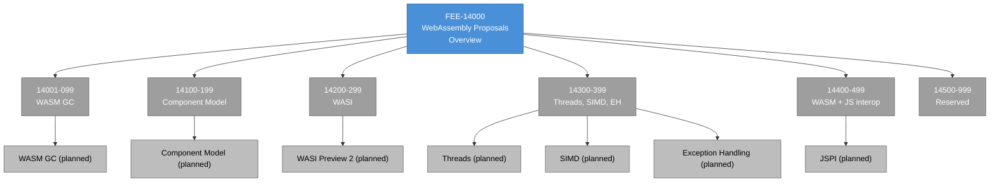

# [FEE-14000] WebAssembly Proposals Overview

:::info
WebAssembly shipped as a minimum viable runtime in 2017 and has been adding language-shaped features ever since. Every compile-to-WASM toolchain is a bet on which proposals have landed in the target engines.
:::

:::warning Web Platform Proposals
Articles in the 10000-19999 range cover features that are not yet stable across all major browsers. When a feature ships stable, its article graduates to the appropriate 0-9999 category.
:::

## Context

The **WebAssembly Community Group** (WebAssembly CG) at W3C maintains the core WebAssembly specification and incubates new proposals. The **WebAssembly Working Group** (WebAssembly WG) publishes the formal Recommendation track. The two groups share membership — every engine vendor and many language-toolchain teams participate in both — and coordinate so that CG-incubated proposals transition cleanly into WG standardization when they mature. Unlike TC39 or WHATWG, the governance structure explicitly separates the incubation role (CG) from the recommendation role (WG), which lets early-stage proposals live in the CG without affecting the stability of the WG's Recommendations.

The **BytecodeAlliance** is a nonprofit organization that is distinct from the W3C groups but deeply integrated with them. It hosts shared implementations of WASM standards — Wasmtime (the reference runtime), Wasmer (an alternative runtime), `wasm-tools`, `cranelift` (a code generator used by Wasmtime), and `wit-bindgen` (a binding generator for the Component Model). The Alliance's members (Mozilla, Intel, Fastly, Red Hat, Microsoft, Amazon, and others) contribute to these projects, which are the de facto reference implementations for WASM outside the browser. The Alliance does not own the specifications; it owns the implementations.

This split between specification governance (W3C) and implementation governance (BytecodeAlliance) is unusual among web platform standards. TC39 has no equivalent — the engine teams that implement ECMAScript participate directly in the standards body, and there is no separate nonprofit that hosts a reference implementation. The WASM split exists because the non-browser WASM ecosystem needs a commonly available, commercially friendly reference implementation that the browser vendors are not positioned to provide. The Alliance fills that role for edge compute, serverless, and plugin ecosystems.

The **phase model** (Phase 0 through Phase 4) mirrors TC39's stage model and describes a proposal's maturity. Phase 0 is pre-proposal; proposals in Phase 0 are tracked in the design repository issue tracker and have not yet reached formal CG consideration. Phase 1 is "Feature Proposal" (the CG has agreed the problem is worth solving). Phase 2 is "Proposed Spec Text" (a complete specification in a dedicated repository with a champion). Phase 3 is "Implementation Phase" (engines are implementing and providing feedback). Phase 4 is "Standardize the Feature" (the WG merges the proposal into the core specification). Engines often ship Phase 3 proposals unflagged when the spec text stabilizes and implementers agree that further spec changes are unlikely.

The **in-browser / out-of-browser split** is the single most important fact about this category. Some WASM proposals target the browser directly — WASM GC, Threads, SIMD, Exception Handling, and JS Promise Integration all make sense only in contexts with JavaScript interop and browser-shipping concerns. Other proposals target non-browser WASM runtimes — WASI (the WebAssembly System Interface) and the Component Model are designed for server and edge compute environments where WASM runs inside Wasmtime, Wasmer, or Spin. Browser shipping and non-browser shipping are separate tracking concerns with different success criteria.

This FEE category covers both sides. Articles 14001-14099 (WASM GC) and 14300-14399 (Threads/SIMD/Exception Handling/JSPI) are about the browser — what ships in V8, SpiderMonkey, and JavaScriptCore, how it integrates with JavaScript, and what toolchain authors can target. Articles 14100-14199 (Component Model) and 14200-14299 (WASI) are about the runtime ecosystem — what ships in Wasmtime and Wasmer, how the component linking model works, and how WASI's capability-based system interfaces compose. Readers coming from a browser background focus on the first set; readers coming from a server or edge compute background focus on the second.

The two tracks also have different ship-velocity characteristics. Browser-side shipping moves at engine-release pace (weeks to months for a single engine, a few quarters for cross-engine availability). Runtime-side shipping moves at the runtime maintainer's pace, which can be faster for smaller feature additions (Wasmtime ships every month) but slower for proposals that cross the core WASM surface (where multi-runtime coordination matters). A reader predicting adoption timelines needs to understand which track a given proposal is on.

The **2017 MVP** was the original WebAssembly shipping milestone. It defined four value types (`i32`, `i64`, `f32`, `f64`), linear memory, functions, tables, and nothing else. No garbage collection, no exceptions, no threads, no SIMD. The minimal surface was a deliberate choice: a small specification that all four browser engines could implement quickly and interoperably, with additions to follow. The MVP shipped in Chrome 57 (March 2017), Firefox 52 (March 2017), and Safari 11 (September 2017). Edge followed shortly thereafter. Since then, each post-MVP proposal has extended the surface incrementally, with the core specification absorbing features as they reach Phase 4.

The MVP's design also inherited key decisions from its predecessors. Mozilla's `asm.js` (2013) demonstrated that a subset of JavaScript could be used as a compilation target for C/C++; Google's PNaCl (Portable Native Client, 2013-2017) demonstrated that a portable bytecode format could run native-compiled code in the browser with reasonable security guarantees. WASM took lessons from both: a binary format (learned from PNaCl's failed-to-take-off bytecode approach) with tight JavaScript integration (learned from asm.js's success at cross-browser adoption). The result is a specification that the industry accepted on its first shipping release — no prior WASM alternative had achieved that.

## Scenario

A team ships a large application written in Kotlin/WASM. Kotlin's compiler emits WASM GC bytecode — it relies on the WASM GC proposal to manage object allocation and garbage collection natively in the engine, avoiding the overhead of implementing a Kotlin-compatible allocator inside linear memory. WASM GC reached Phase 4 and merged into the core specification in 2023-2024. Chromium shipped WASM GC unflagged in Chrome 119 (October 2023). Firefox shipped it in Firefox 120 (November 2023). Safari shipped it in Safari 18.2 (December 2024). By 2025, WASM GC was a universally available feature, and the Kotlin team could ship their WASM output to any modern browser with confidence.

The team's confidence does not extend to every WASM feature they might want to use. JSPI (JavaScript Promise Integration) lets WASM code call async JavaScript APIs as if they were synchronous Kotlin functions, which simplifies bridging WASM with the browser's async APIs (fetch, IndexedDB, Web Animations). JSPI reached Phase 4 in 2025 but is at a different shipping point — it has an Origin Trial in Chrome, is behind a preference in Firefox, and has not shipped in Safari. The team cannot ship JSPI-dependent code as a hard requirement; they either avoid JSPI entirely, wrap async calls in a polyfill-style promise-to-callback bridge, or use Origin Trial participation to ship JSPI-dependent code to their Chrome users only.

The per-proposal shipping status is therefore a recurring check any compile-to-WASM toolchain user runs every release cycle. A WASM application that lands in the browser is typically an assembly of multiple proposals (GC + Threads + SIMD + optional JSPI), and each proposal's shipping status is tracked separately. This overview provides the framework for reasoning about which proposals to adopt when, for browser-targeted and runtime-targeted workloads alike.

The team's first-run decision — adopt WASM GC unconditionally, defer JSPI to a per-engine code path — is representative of how WASM adoption works in practice. Each proposal gets its own shipping check and its own adoption decision. A production WASM codebase evolves proposal by proposal: today's deployment uses GC universally, today's experimental feature flag enables JSPI for Chrome users, next quarter's upgrade maybe adds JSPI universally once Safari ships. The framework for making each decision is the same; the specific answer changes with each proposal's state at the time of the decision.

A library author — for example, the author of a WASM-compiled crypto library or a PDF-rendering library — has an additional concern. The library's compiled WASM binary is a deployment artifact that must run on the consumer's target environment. A library compiled with SIMD enabled cannot run on older browsers that do not support SIMD; the library author must either ship multiple binaries (SIMD and non-SIMD variants) with a runtime selection based on `wasm-feature-detect`, or compile with a conservative feature set that runs everywhere but leaves performance on the table. The library-author pattern is multi-binary shipping with feature detection, similar to how native libraries ship architecture-specific binaries (x86_64, ARM64, etc.) and select at load time.

The multi-binary approach has infrastructure costs that accumulate for libraries with many users. Each binary variant is a separate artifact to build, test, host, and deliver; the artifact delivery itself typically involves a CDN with cache-control for each feature combination. Libraries targeting broad browser support often ship 2-4 variants (no features, SIMD only, SIMD + Threads, full feature set) and accept the infrastructure cost as the price of covering the user population. Libraries targeting a narrower audience — for example, a desktop-only web app — may ship a single binary compiled with the feature set the target audience universally supports, trading coverage for simplicity.

## Design Thinking

### Why WASM shipped an MVP first

The 2017 MVP was deliberately minimal. The four engine teams (V8, SpiderMonkey, JavaScriptCore, ChakraCore at the time) could have negotiated a larger v1 that included garbage collection, exceptions, threads, and SIMD. They chose not to, because a larger v1 would have delayed shipping by years while the teams debated design details. The minimal MVP shipped across all engines within seven months — a shipping timeline that the industry had not previously seen for a new byte-level language specification.

The post-MVP proposals emerged from real production experience. C++ and Rust users asked for SIMD once their numeric code hit speed ceilings; Threads followed once multi-core scaling became a bottleneck. Java, Kotlin, and Dart users asked for GC once implementing a language-specific GC inside linear memory proved to double memory usage and cripple performance on typical allocation patterns. Swift users asked for Exception Handling because its error model needed it and translating exceptions into WASM's original control flow was too expensive. Each proposal traces to a specific language community's production pain, and the proposal's design reflects that community's requirements.

The staging let the engines ship a stable base and add capability incrementally, and let toolchain authors target the shipping feature set at each point in time. The alternative — shipping GC, EH, Threads, and SIMD together in a v1 — would have delayed the MVP by years, would have produced a larger specification with more interaction edges between features, and would have made engine implementation harder because every feature would have had to work with every other feature from day one. The incremental approach let features stabilize independently and let engine teams ship them on independent timelines.

The incremental approach also has costs that are worth naming. Toolchains have to track which proposals are at which phase in which engine; the matrix is large enough that automated tooling (the `wasm-feature-detect` library, `wasm-tools` crate features) is effectively required. Applications that want to use the latest features have to ship multiple binaries and select at load time. Documentation for compile-to-WASM toolchains often lags proposal shipping, so teams adopting new features find themselves reading GitHub issues and engine release notes as the authoritative sources, before curated documentation catches up. These costs are real and they accumulate as the post-MVP proposal set grows; they are the tradeoff the CG accepts to keep the MVP shipping timeline.

### How the ecosystem bridges the gap

**wasm-bindgen** (Rust) and **emscripten** (C/C++) are the two dominant compile-to-WASM toolchains for browser targets. Both generate glue code that detects feature support at load time and uses the appropriate binary. Multiple binaries can be shipped — one compiled without SIMD, one with — and the loader selects at runtime based on `navigator.wasm.simd` (or the equivalent feature-detect probe). The glue code also handles the JavaScript-side bindings: wrapping WASM function exports in typed JavaScript functions, marshaling strings and objects across the WASM/JS boundary, and managing the WASM instance's lifecycle.

**`wasm-feature-detect`** is a small npm library that tests for each proposal by compiling a tiny probe module. The library's API is `await simd()` or `await threads()`; each probe compiles a minimal WASM module that exercises the specific feature and returns whether the engine accepts it. This approach is more reliable than checking engine version numbers because it tests the actual runtime capability; a version string only yields an inferred capability that can lag the real runtime behavior. Production applications that adapt to multiple WASM binaries use `wasm-feature-detect` at load time to select which binary to fetch.

**Fallback compilation targets.** When a proposal is not shipping everywhere, toolchains can emit alternative output. Kotlin/WASM GC can fall back to Kotlin/JS (compiled to JavaScript) on environments where WASM GC is missing; the performance tradeoff is significant but the output runs. Emscripten can emit `asm.js` for environments that predate WASM entirely, which is rare today but was common in 2017-2019. The fallback path doubles the maintenance burden (two compilation pipelines, two test matrices) and is typically reserved for projects that must support a broad environment range.

**Origin Trials** (for browser-shipped WASM proposals) let production applications test against shipping engines before the proposal reaches universal shipping. JSPI's Origin Trial at the time of writing lets Chrome-targeting applications use the proposal in production while providing feedback that shapes the final specification. Trial tokens are origin-scoped and time-limited; applications participating in trials architect the feature as an optional enhancement so that trial expiration does not break the product.

Runtime-side proposals do not have an Origin Trial equivalent; the analogous mechanism is a runtime's pre-release binary tagged for experimentation. Wasmtime, for example, ships features behind flags (`--wasm-features` on the CLI) that become default-enabled when the CG phase and interop-testing criteria are met. Teams adopting runtime proposals early ship against the pre-release Wasmtime binaries and upgrade as the stable track catches up.

### Tracing a proposal: WASM GC through the pipeline

WASM GC illustrates the WASM CG pipeline. The proposal was first discussed in 2017 as a follow-up to the MVP. Early sketches explored embedding a language-generic GC in the runtime, but the design complexity was significant and the CG put the proposal on hold while other post-MVP features (SIMD, Threads, EH) shipped first.

The proposal reached Phase 1 in 2020 with a revised approach: a reference-type-based GC that relies on the host's garbage collector (in browsers, the JavaScript engine's GC) instead of introducing a separate GC into the WASM runtime. This design sidestepped the complexity of a WASM-specific GC by delegating to the host. The proposal moved to Phase 2 in 2021 with a complete specification, Phase 3 in 2022 with active engine implementations, and Phase 4 in 2023-2024 with cross-engine shipping. The total elapsed time from Phase 1 to Phase 4 was roughly three years — faster than the original MVP took to ship, because the specification process had matured and the engine teams had infrastructure for implementing post-MVP features.

Kotlin/WASM was the first major production compile-to-WASM-GC toolchain, shipping in Kotlin 2.0 in 2024 as an alpha and graduating to beta in subsequent releases. Dart/WASM followed, targeting WASM GC for Flutter's web output. The Java community also has tracking efforts (CheerpJ, TeaVM) that use WASM GC for compiled Java-to-WASM workloads. This is the pattern that compile-to-WASM-GC toolchains all follow: wait for Phase 4 + cross-engine shipping, then ship WASM GC output as the primary target with a fallback path for environments that lack the feature.

The WASM GC story also illustrates the CG's openness to significant design pivots. The initial 2017-2019 approach to GC was different from the final design; the CG paused the proposal mid-development and rebooted it with a cleaner reference-type-based approach. This willingness to pivot — even after investment in an earlier design — is part of what lets WASM proposals ship with high quality. The cost is longer elapsed time for features that have to pivot; the benefit is that features reach shipping with designs that survived implementer review, avoiding the churn that comes from rushed designs under deadline pressure.

### The `wasm-pack` and `wasm-bindgen` developer experience

For Rust-to-browser-WASM workflows, `wasm-pack` is the wrapper tool that builds, optimizes, and publishes a WASM package to npm or a web server. `wasm-bindgen` is the lower-level library that generates JavaScript glue code around Rust functions, producing typed JS exports from the Rust-side types. Together they form the canonical Rust-to-browser pipeline.

The developer experience is close to standard Rust development: `cargo build --target wasm32-unknown-unknown` produces a raw WASM binary, `wasm-bindgen` post-processes it into a package, `wasm-pack publish` uploads the package to npm. Applications consume the package with a standard npm dependency and call Rust functions as if they were JavaScript functions. Performance-critical paths move into Rust; application glue stays in JavaScript.

Similar developer experiences exist for other languages: `emscripten` for C/C++, `go` with the `syscall/js` package for Go, `dotnet-wasm` for .NET. The developer experience varies in maturity — Rust's is the most polished, Go's is improving, and .NET's is catching up. A team starting a compile-to-WASM project typically chooses the source language partly for its developer experience quality.

### When to adopt a pre-Phase-4 WASM proposal

The WASM adoption calculus is a short set of questions.

First, **is this a browser proposal or a runtime proposal?** Browser proposals (GC, Threads, SIMD, EH, JSPI) have the same per-engine shipping concerns as CSS and HTML proposals — tracked via MDN, caniuse, and the engines' own status pages. Runtime proposals (Component Model, WASI) have different tracking: the status to check is Wasmtime, Wasmer, and WasmEdge's implementation status plus the runtime-host ecosystem's support.

Second, **has the proposal reached Phase 3 or later?** Phase 1 and Phase 2 proposals have specifications that can and do change shape. Phase 3 proposals have stable enough specifications that engines are actively implementing against them; changes at Phase 3 are typically small clarifications. Phase 4 is "done" from the CG's perspective. Adoption at Phase 3 is a reasonable bet for teams that can tolerate minor revisions; adoption at Phase 2 requires following spec iterations closely.

Third, **which compile-to-WASM toolchain is the team using, and does it support the proposal?** Toolchain support lags proposal shipping. A proposal at Phase 4 in all three browsers may still be unsupported by the team's compiler — Rust's `wasm32-unknown-unknown` target, for example, added WASM GC support at a specific release, and applications compiled before that release cannot use GC features. Teams check their toolchain's feature matrix alongside the engines'.

Fourth, **what is the binary-size and startup-cost profile?** WASM proposals can affect binary size (SIMD code is larger per operation than scalar; GC introduces type-info metadata) and startup cost (JSPI adds stack-switching overhead; Threads requires SharedArrayBuffer, which has HTTP header requirements). Adoption decisions factor in the performance profile the team is targeting, since some proposals have tradeoffs that matter for specific workloads.

The articles under 14001-14499 answer these four questions for each specific proposal. This overview provides the framework.

A concrete application of the framework: a team shipping an image-processing library compiled from Rust to WASM. Browser-targeted? Yes. Phase status? The relevant proposals (SIMD for image kernels, Threads for parallel batch processing, Exception Handling for error propagation from Rust panic points) are all Phase 4. Toolchain support? Rust's `wasm32-unknown-unknown` target supports SIMD with a feature flag at compile time; Threads requires `wasm32-unknown-unknown` with atomics enabled plus `-C target-feature=+atomics,+bulk-memory`. Performance profile? SIMD doubles throughput on vectorizable kernels; Threads scales to available cores minus cross-origin isolation overhead; EH adds modest binary size with negligible runtime cost.

Decision: adopt SIMD and EH unconditionally (Phase 4 + universal shipping), adopt Threads conditionally behind a cross-origin isolation check (feature-detect and fall back to single-threaded on non-isolated origins). This produces a library that ships in every modern browser with optional performance improvements where available.

The ordering of the questions matters. Browser-vs-runtime first decides which tracking sources apply. Phase status second filters out proposals too unstable to commit to. Toolchain support third determines whether the team can even produce a binary that uses the proposal. Performance profile last calibrates the tradeoff. Teams that skip the first question find themselves tracking the wrong status pages; teams that skip the third find out late that their compiler cannot emit the feature they wanted.

## Deep Dive

### Cross-origin isolation and SharedArrayBuffer

WASM Threads require SharedArrayBuffer, which is a JavaScript feature that was partially disabled in 2018 after the Spectre CPU vulnerability was disclosed. Modern browsers gate SharedArrayBuffer behind a **cross-origin isolation** requirement: the page must be served with `Cross-Origin-Opener-Policy: same-origin` and `Cross-Origin-Embedder-Policy: require-corp` (or `credentialless`) HTTP headers. These headers isolate the browsing context from cross-origin pages and cross-origin resources, which mitigates the Spectre attack surface that SharedArrayBuffer would otherwise expose.

The practical consequence for WASM Threads adoption: the site hosting the WASM application must configure the cross-origin isolation headers. Sites that embed third-party content (ad networks, analytics scripts, embedded videos) may find cross-origin isolation incompatible with their existing integrations — every cross-origin resource must either opt into being embeddable (`Cross-Origin-Resource-Policy: cross-origin`) or use `credentialless` mode, which itself has compatibility implications. A site that cannot configure cross-origin isolation cannot use WASM Threads.

This infrastructure requirement distinguishes WASM Threads from other WASM proposals. GC, SIMD, EH, and JSPI have no header requirements; Threads has a header requirement that can be a significant adoption obstacle. Teams planning to use WASM Threads should verify their hosting environment supports the headers before committing to the feature.

For applications that need Threads but cannot configure cross-origin isolation site-wide, there is a narrower escape hatch: the **credentialless** COEP mode loosens the opt-in requirement for cross-origin subresources at the cost of excluding credentials from those requests. This works for static assets (scripts, images) that do not need authentication but is not suitable for cross-origin API calls that require cookies or other credentials. Teams with mixed requirements often carve out a dedicated origin for their Threads-dependent application and accept the cross-origin isolation requirements on that origin only, while keeping the main origin without them.

### The Component Model and WIT

The Component Model is a major post-MVP proposal that targets non-browser runtimes. Its goal is to let WASM modules compose cleanly — a WASM component written in one language (Rust, C, Python, Go) can be linked against a component written in another, with an IDL (WIT — WebAssembly Interface Types) describing the interface between them. The Component Model is the foundation for WASI Preview 2, which defines standard system interfaces (filesystem, networking, HTTP) as WIT interfaces.

WIT is a small interface-definition language. It describes types (records, variants, lists, options, results) and functions, and a Component Model tool chain (`wit-bindgen`) generates language-specific bindings from a WIT interface. A Rust component that imports a `wasi:filesystem` interface links against any WASI Preview 2 host that provides that interface, without needing to know the host's implementation details. This is analogous to how COM on Windows or CORBA in the 1990s structured cross-language linking — a lesson the WASM CG has studied when designing the Component Model.

The practical consequence for adoption: the Component Model is a major capability but targets non-browser runtimes first. Browsers do not yet have native support for Component Model imports; a component running in the browser today does so through a Component-Model-aware loader that simulates the linking behavior. Runtimes (Wasmtime, WasmEdge, Spin) have first-class support. Teams building edge-compute or serverless workloads benefit most; teams targeting the browser see the Component Model as a future path.

Component Model adoption has an additional cost: the toolchain must support the component format, which requires different tooling from the core-WASM toolchain. Rust's `cargo component` wraps Cargo for component output; JCO (JavaScript Component Tools) wraps JavaScript for component generation; jco-transpile converts components to web-compatible form. Each of these tools is maintained by a small team and may lag behind the core-WASM ecosystem in stability. Teams adopting Component Model should budget for tooling maturity and expect rougher edges compared with core-WASM toolchains.

### WASI Preview 2 and the capability-based model

WASI (WebAssembly System Interface) is a specification for how WASM components interact with the host system — reading files, making network requests, handling environment variables. WASI Preview 2, which shipped in 2024, restructured the earlier WASI Preview 1 around the Component Model and introduced a capability-based security model: a WASM component cannot access system resources it was not explicitly granted access to.

The capability-based model is a departure from POSIX-style ambient authority (where any process can call `open("/etc/passwd")` as long as the OS permits it). A WASI Preview 2 component that wants to read a file must be invoked with a filesystem handle pre-opened at a specific path; attempts to open paths outside that handle fail. This makes WASI components safer by default — a component cannot accidentally leak data by reading unexpected files — and lets host runtimes enforce security policies through handle scoping.

The tradeoff is that capability-based composition is more complex to design than ambient authority. A team writing a WASI application must think about which capabilities to grant, how to scope them, and how to compose capabilities across linked components. Runtime tooling (Wasmtime's `--dir` flags, Spin's component manifest) makes this manageable for typical use cases, but sophisticated deployments require capability-design thinking that native-OS development does not.

WASI Preview 2's interface set is deliberately conservative. The Preview 2 shipping set covers filesystem, networking (TCP sockets, UDP sockets), HTTP, and basic process control. It does not cover GUI primitives, graphics APIs, or hardware-specific interfaces. Future WASI iterations may add those; for now, any WASI application needing capabilities beyond Preview 2's set must rely on runtime-specific extensions or go outside the WASI model. This is a deliberate conservative posture from the WASI subgroup — the goal is a stable cross-runtime interface, and stability requires restraint on scope.

### The WASM text format and compilation pipeline

WASM has a binary format (`.wasm`) and a human-readable text format (`.wat`). The text format is used for debugging, small hand-written examples, and specification reference; the binary format is what ships in production. Compilers emit the binary directly; `wasm-tools` can convert between the two for inspection.

The compilation pipeline for compile-to-WASM languages has several stages. The source language (Rust, C++, Kotlin) is compiled to an intermediate representation (LLVM IR for Rust/C++/Swift, Kotlin's IR for Kotlin). A WASM-targeting backend then emits the binary WASM module. `wasm-opt` (from the Binaryen toolkit) post-processes the binary to optimize for size and runtime performance. The final binary is what the browser or runtime loads.

Teams adopting WASM should understand this pipeline because performance analysis often reveals issues at specific stages. A shader authored suboptimally costs runtime performance; a compiler emitting suboptimal WASM costs binary size; a `wasm-opt` configuration mismatched to the target environment costs either size or speed. Debugging performance problems requires knowing which stage introduced them.

### Graduation expectations for browser WASM features

Browser-targeted WASM proposals graduate to `Browser APIs & Web Platform` (400-499) when they ship unflagged across Chromium, Firefox, and Safari. WASM GC, Threads, SIMD, and Exception Handling are all past this bar at the time of writing and are graduation candidates. JSPI is at Phase 4 but still shipping in fewer engines; it remains in the 14000 range until cross-engine shipping completes.

The FEE graduation decision for WASM proposals also factors in toolchain adoption. A proposal that has shipped universally but has no production-ready toolchain support still has limited practical reach; readers consulting the FEE need to be able to actually use the feature, not only know about it. The editorial check at graduation time is: does at least one major compile-to-WASM toolchain (wasm-bindgen, emscripten, Kotlin/WASM, Dart/WASM) emit code that uses this feature? If yes, graduation is appropriate; if no, the article stays in the 14000 range until toolchain adoption catches up.

Runtime-targeted proposals (Component Model, WASI) do not graduate to a browser category, because they do not target the browser. They remain in 14000 as the stable home for content about server-side WASM. If a future FEE category is added for server-runtime concerns (edge compute, serverless WASM, WASI-based sandboxing), those articles could move there; for now, 14100-14299 is their home.

The partial-graduation pattern applies here as well. WASM GC can graduate on its own schedule even if JSPI is still shipping; SIMD graduates independently of Threads. Each proposal is tracked and graduates individually, which matches how the CG itself structures the proposal set — each proposal is independent, and graduation respects that independence.

## Visual

The blue node is the category overview. Gray range nodes are currently empty of drafted sub-articles; the planned topics are shown as gray leaves. Sub-articles for the 14000 range are the scope of a follow-up specification under the FEE project — this overview is the entry point until those sub-articles exist. Readers tracking specific topics should use the References section's links to the WebAssembly CG, BytecodeAlliance, and implementation trackers until the corresponding sub-article is drafted.

The suggested reading order when the sub-articles exist: WASM GC first for browser-targeted readers (most mature, largest language-community adoption), then Threads + SIMD + EH as the performance-focused browser trio, then JSPI for the async-interop concern, and finally the runtime-targeted Component Model and WASI as a separate arc. A reader coming from a compile-to-WASM toolchain background can skip directly to the proposals their toolchain supports. A reader coming from a server-runtime background focuses on the Component Model and WASI sub-articles and skips the browser-shipping content entirely.

The browser-side and runtime-side arcs have different learning curves. Browser-side WASM is typically a build-configuration concern for a single application binary; the learning is compiler-flag selection and feature-detection patterns. Runtime-side WASM is an architecture concern that affects the whole application's deployment model; the learning includes capability design, component composition, and the host-integration model. A reader new to WASM should expect browser-side to come first in time-to-productivity, with runtime-side adoption following when the application's deployment model warrants it.

## Tracks in this range

| Range | Topic | Example proposals |
|-------|-------|-------------------|
| 14001-14099 | WASM GC (garbage collection for reference types) | GC base, non-nullable references, type equality |
| 14100-14199 | Component Model | WIT interface definition, `wit-bindgen`, component composition |
| 14200-14299 | WASI (WebAssembly System Interface) | WASI Preview 2, filesystem, HTTP, sockets |
| 14300-14399 | Threads, SIMD, Exception Handling | SharedArrayBuffer integration, atomics, SIMD opcodes, tag-based exceptions |
| 14400-14499 | WASM + JS interop | JS Promise Integration, Type Reflection, exported memory patterns |
| 14500-14999 | Reserved | — |

The range assignments reflect both proposal grouping and reader-facing categorization. WASM GC has its own range because it crosses the language-support boundary and deserves dedicated treatment; Threads/SIMD/EH share a range because they are the performance-focused browser triad. The Component Model and WASI sit apart because they target non-browser runtimes and have different tracking concerns.

Future range assignments may emerge as new proposals land. Memory64 (supporting 64-bit linear memory addressing) is a candidate for an eventual range of its own once it reaches Phase 4 and ships; the Tail Call proposal similarly might earn its own sub-range if the compile-to-WASM toolchains that care about it (functional-language compilers) justify the dedicated treatment. The 14500-14999 reserved range accommodates these future additions.

## Graduation

Browser-shipped proposals (WASM GC, Threads, SIMD, EH, JSPI) graduate to `Browser APIs & Web Platform` (400-499) when they ship unflagged across Chromium, Firefox, and Safari. WASM GC is past this bar and a near-term graduation candidate. Threads has shipped across engines but is gated by cross-origin isolation requirements that affect how teams adopt; the graduation decision may wait until the adoption patterns settle. SIMD and EH are universally shipping and are also near-term candidates.

Runtime-only proposals (Component Model, WASI) do not graduate to a browser category. They remain in 14000 as the stable home for content about server-side WASM. If a future FEE category is added for server-runtime concerns, those articles could move there; the decision will happen when the category is added.

Until such a category exists, the 14100-14299 range serves as the de facto home for runtime-side WASM content. This has the effect of keeping all WASM content — browser and runtime — in a single top-level category, which simplifies discovery for readers unfamiliar with the two-track structure. The downside is that readers strictly interested in browser WASM have to scroll past runtime content they do not need.

When a browser-targeted proposal's corresponding article graduates, it moves to a new ID in the 400-499 range and the old 14000-range ID becomes a redirect. Inbound links, git history, and bookmarks remain intact.

The FEE does not formally track which features are near graduation because the WebAssembly CG's phase tracker is the more precise answer. Readers curious about graduation candidates should consult `github.com/WebAssembly/proposals` for the current phase status, plus the engines' WASM implementation trackers (V8's WASM status, SpiderMonkey's WASM feature flags, JavaScriptCore's Safari release notes).

## Related FEEs

| FEE | Relationship |
|-----|-------------|
| [FEE-400 Browser APIs & Web Platform](../../Browser%20APIs%20and%20Web%20Platform/400.md) | The destination category for graduated browser-shipped WASM proposals. |
| [FEE-405 Web Workers & Concurrency](../../Browser%20APIs%20and%20Web%20Platform/405.md) | WASM Threads requires Worker-based architecture and SharedArrayBuffer understanding; FEE-405 is prerequisite for multi-threaded WASM patterns. |
| [FEE-417 Transferable Objects](../../Browser%20APIs%20and%20Web%20Platform/417.md) | Transferring data between the main thread and WASM-hosting workers involves transferable-object semantics. |
| [FEE-13000 Browser Compute](../Browser%20Compute/13000.md) | Sibling track — WASM is the fallback compute runtime for WebGPU workloads, and WebGPU+WASM integration is a shared topic. |
| [FEE-10000 TC39 & JS Proposals](../TC39%20and%20JS%20Proposals/10000.md) | Sibling track — JSPI specifically bridges WASM and the JS async model covered by TC39 proposals. |
| [FEE-11000 CSS Experimental](../CSS%20Experimental/11000.md) | Sibling track for CSS proposals; governance and process differ. |

## References

- [WebAssembly Community Group](https://www.w3.org/community/webassembly/) — the W3C CG that incubates WASM proposals.
- [WebAssembly Working Group](https://www.w3.org/wasm/) — the W3C WG that publishes the formal Recommendation.
- [WebAssembly Phases Document](https://github.com/WebAssembly/meetings/blob/main/process/phases.md) — the authoritative definition of Phase 0 through Phase 4.
- [WebAssembly/proposals on GitHub](https://github.com/WebAssembly/proposals) — the central tracker for every active WASM proposal with current phase and champions.
- [WebAssembly/spec](https://github.com/WebAssembly/spec) — the core specification repository.
- [WebAssembly Core Specification](https://www.w3.org/TR/wasm-core-2/) — the formal W3C Recommendation for WebAssembly Core 2.
- [BytecodeAlliance](https://bytecodealliance.org/) — the nonprofit behind the major non-browser WASM runtimes.
- [Wasmtime](https://wasmtime.dev/) — the reference WASM runtime from BytecodeAlliance.
- [Wasmer](https://wasmer.io/) — an alternative WASM runtime with embeddings for multiple host languages.
- [WASI project](https://github.com/WebAssembly/WASI) — the WebAssembly System Interface specification.
- [Component Model](https://github.com/WebAssembly/component-model) — the Component Model specification and tooling.
- [`wasm-feature-detect`](https://www.npmjs.com/package/wasm-feature-detect) — npm library for runtime WASM feature detection.
- [MDN: WebAssembly](https://developer.mozilla.org/en-US/docs/WebAssembly) — the canonical browser-side WASM reference.
- [wasm-bindgen (Rust)](https://rustwasm.github.io/wasm-bindgen/) — Rust's compile-to-browser-WASM toolchain with JS interop.
- [emscripten (C/C++)](https://emscripten.org/) — C/C++ compile-to-WASM toolchain.
- [Kotlin/WASM documentation](https://kotlinlang.org/docs/wasm-overview.html) — Kotlin's WASM GC target.
- [WebAssembly Weekly](https://wasmweekly.news/) — newsletter covering the WASM CG and ecosystem.
- [BytecodeAlliance Zulip](https://bytecodealliance.zulipchat.com/) — the primary chat venue for WASM CG participants and implementers.
- [wit-bindgen](https://github.com/bytecodealliance/wit-bindgen) — binding generator for Component Model interfaces.
- [Spin](https://github.com/spinframework/spin) — a developer-facing Component Model runtime from Fermyon.
- [WasmEdge](https://wasmedge.org/) — another WASM runtime with a focus on edge compute.
- [WebAssembly Implementation Status](https://webassembly.org/features/) — community-maintained page with per-engine feature support.
- [V8 WebAssembly features](https://v8.dev/features) — Chromium's V8 engine running notes on WASM feature shipping.
- [SpiderMonkey WebAssembly status](https://spidermonkey.dev/) — Firefox's SpiderMonkey engine notes on WASM implementation.
- [Dart/WASM documentation](https://dart.dev/web/wasm) — Dart's compile-to-WASM target documentation.
- [Apple WebKit WebAssembly](https://webkit.org/blog/7691/webassembly/) — WebKit blog entries on WebAssembly progress in Safari.
- [WebAssembly Summit proceedings](https://webassembly-summit.org/) — annual community conference with implementer and toolchain-author talks.
- [CHERI and WASM capability research](https://www.cl.cam.ac.uk/research/security/ctsrd/cheri/) — academic research on capability-based security relevant to the Component Model.
- [wasi-libc](https://github.com/WebAssembly/wasi-libc) — the C library implementation for WASI-targeting C/C++ code.
- [Spec interpreter (reference)](https://github.com/WebAssembly/spec/tree/main/interpreter) — the official WASM reference interpreter useful for spec-compliance debugging.
- [wasmCloud](https://wasmcloud.com/) — distributed application platform built on the Component Model.
- [Extism](https://extism.org/) — plugin framework leveraging WASM components for language-agnostic extensibility.
- [Fermyon cloud](https://www.fermyon.com/) — serverless platform built on Spin and the Component Model.
- [Cloudflare Workers WASM](https://blog.cloudflare.com/workers-brings-webassembly/) — Cloudflare's WASM-targeted worker runtime documentation.
- [Proxy-WASM](https://github.com/proxy-wasm/spec) — specification for WASM-based proxy filters, used in Envoy and Istio.
- [Shopify Functions](https://shopify.dev/docs/apps/build/functions) — Shopify's WASM-based extensibility framework using the Component Model.
- [wasmCon proceedings](https://wasmcon.io/) — annual WebAssembly conference archives.
- [WebAssembly abstract machine](https://webassembly.github.io/spec/core/) — the formal machine-state specification used in the WASM semantics.
- [Mozilla WASM docs](https://developer.mozilla.org/en-US/docs/WebAssembly/Reference) — per-instruction reference documentation.
- [WebAssembly WG Recommendations](https://www.w3.org/TR/?tag=webassembly) — published WG Recommendation documents.
