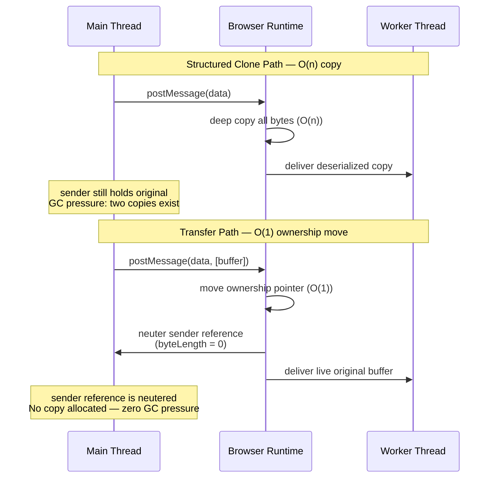
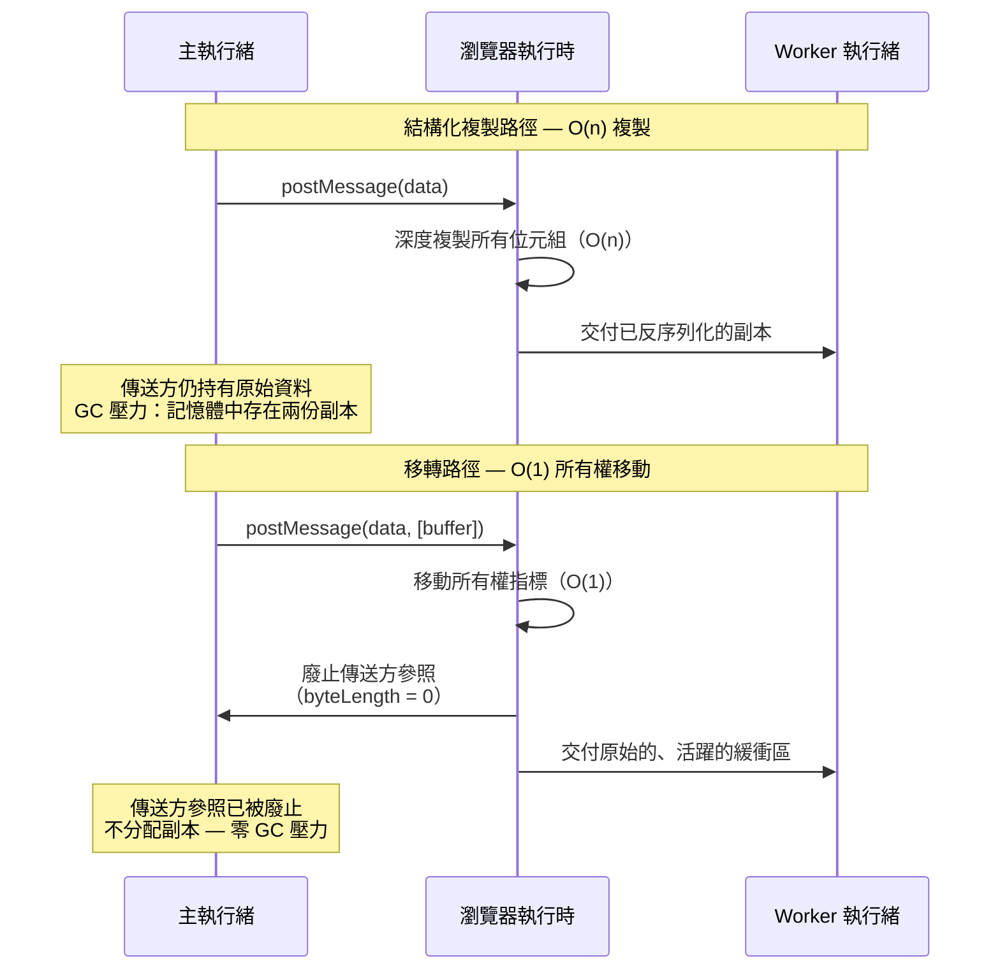

# FEE-417 Transferable Objects Implementation Plan

> **For agentic workers:** REQUIRED SUB-SKILL: Use superpowers:subagent-driven-development (recommended) or superpowers:executing-plans to implement this plan task-by-task. Steps use checkbox (`- [ ]`) syntax for tracking.

**Goal:** Create FEE-417 "Transferable Objects" as a new article in both EN and zh-TW covering zero-copy ownership transfer, the full transferable types catalogue, and the structured clone vs. transfer vs. SharedArrayBuffer decision guide.

**Architecture:** Two new markdown files following the standard FEE template (frontmatter → :::info → Context → Scenario → Design Thinking → Best Practices → Visual → Example → Related FEEs → References). Both files must be 301+ lines. The EN file is written first; the zh-TW file is a full translation.

**Tech Stack:** Markdown, VitePress, Mermaid (for Visual diagram)

---

## Task 1: EN article (`docs/en/Browser APIs and Web Platform/417.md`)

- [ ] Write the complete EN article at `docs/en/Browser APIs and Web Platform/417.md` using the content below.

```markdown
---
id: 417
title: "Transferable Objects"
state: draft
level: mid
---

# [FEE-417] Transferable Objects

:::info
The browser's default mechanism for passing data across `postMessage` boundaries is the structured clone algorithm, which performs a full deep copy of the payload — allocating new memory, copying every byte, and creating GC pressure on both the sender and receiver sides. Transferable Objects are a zero-copy alternative: instead of cloning, ownership of the underlying memory buffer moves atomically from sender to receiver in O(1) time regardless of data size. After the transfer, the sender's reference is *neutered* — its `byteLength` becomes 0 and any read attempt throws a `TypeError` — meaning only one thread owns the data at any moment. Understanding when to transfer rather than clone is essential for building high-throughput worker pipelines for video, audio, image, and network data processing.
:::

## Context

Every call to `postMessage` — whether between a main thread and a dedicated worker, two frames, or two ends of a `MessageChannel` — must serialize the payload so it can cross the thread boundary safely. By default, the browser uses the **structured clone algorithm**: a recursive deep copy that walks the object graph, allocates new memory for each value, and constructs an independent replica on the receiving side. For primitive data and small objects this cost is negligible. For large binary payloads — a 100 MB `ArrayBuffer` holding decoded video pixels, a 50 MB `AudioData` buffer, or even a modest 4 MB image `Uint8ClampedArray` at 30 fps — the copy overhead becomes the bottleneck: memory allocation, byte-by-byte copying, and the subsequent GC pressure from the now-orphaned sender copy all add up.

The **transfer mechanism** eliminates this cost. When an object is listed in the transfer array passed as the second argument to `postMessage`:

```js
postMessage(data, [transferList]);
```

the browser moves ownership of the object's underlying memory from sender to receiver in O(1) time — no allocation, no copy. The sender's handle is immediately **neutered**: reading `byteLength` returns `0`, and reading or writing through a view into the same buffer throws a `TypeError`. The receiver obtains the live, original buffer — not a copy.

Neutering is a deliberate design choice rather than a limitation. It enforces single-ownership semantics: at any point in time exactly one execution context holds a valid reference to the memory. This makes transfer safe without locks or synchronization. It is fundamentally different from `SharedArrayBuffer`, where both sender and receiver share the same memory and must coordinate access with `Atomics` operations.

The transfer list syntax accepts an array of transferable objects:

```js
// Single buffer
worker.postMessage({ pixels: buffer }, [buffer]);

// Multiple transferables in one message
worker.postMessage({ frame, channel }, [frame, port]);
```

If an object is transferable but is **not** listed in the transfer array, the browser falls back to structured clone for that object. The transfer list must be explicit — there is no automatic detection.

## Scenario

A browser-based video color grading tool captures frames from a `<video>` element using the WebCodecs API. The main thread receives each `VideoFrame` at 30–60 fps, but color grading — per-pixel HSL transformation across millions of pixels — must run off the main thread to avoid dropping frames. The main thread transfers each `VideoFrame` to a dedicated worker, which processes the pixels and transfers an `ImageBitmap` result back to the main thread for compositing onto an `OffscreenCanvas`.

Without transfer, each round trip would clone megabytes of pixel data twice per frame — once sending to the worker, once receiving the result — saturating memory bandwidth and triggering GC pauses that manifest as visible frame drops. With transfer, each crossing is O(1): the worker takes full ownership of the `VideoFrame`, processes it, and returns ownership of the result, all without allocating a single extra byte of pixel data. At 30 fps and a 1080p frame size (~8 MB per frame), this is the difference between a smooth pipeline and an unusable one.

## Design Thinking

### Three-way decision: clone vs. transfer vs. SharedArrayBuffer

Choosing the right data-sharing strategy is the first design decision for any worker-based pipeline. The three options differ along three axes: copy cost, ownership model, and synchronization requirement.

| Strategy | Transfer cost | Sender retains copy? | Synchronization needed? | When to use |
|----------|--------------|---------------------|------------------------|-------------|
| Structured clone | O(n) — full deep copy | Yes | No | Small data; object graph with non-transferable types; sender needs its own copy after send |
| Transfer | O(1) — ownership move | No (neutered) | No | Large binary data; sender is done with the object after sending |
| SharedArrayBuffer | O(1) — no copy at all | Shared (same memory) | Yes (Atomics) | Two threads must concurrently read/write the same memory region |

**Structured clone** is the default and requires no explicit opt-in. It is appropriate when the payload is small (a JSON-serializable object, a short string, a small typed array), when the data contains non-transferable references (DOM nodes cannot be transferred or cloned), or when the sender genuinely needs its own independent copy after the send — for example, keeping a local copy of the last processed frame for comparison.

**Transfer** is the right choice for large binary data that the sender is finished with. The sender gives up the object permanently; this is not a limitation but the design intent. Anything that was going to be GC'd shortly after the send anyway might as well be transferred — the GC pressure from the now-unreachable sender copy is eliminated.

**SharedArrayBuffer** is reserved for use cases that require true concurrent shared memory: WebAssembly multi-threading where multiple workers collaborate on the same memory image, or a ring buffer where a producer thread writes and a consumer thread reads simultaneously. SharedArrayBuffer introduces real synchronization complexity — race conditions, lock starvation, and ABA problems are all possible without careful use of `Atomics`. It also has infrastructure prerequisites: the page must be served with `Cross-Origin-Opener-Policy: same-origin` and `Cross-Origin-Embedder-Policy: require-corp` response headers. These headers isolate the browsing context and were mandated by browsers as a Spectre mitigation after 2018. Missing either header causes `SharedArrayBuffer` to be `undefined` at runtime. Transferable `ArrayBuffer` has no such requirement — it works in any context and is the default choice for large-data worker patterns. Only reach for SharedArrayBuffer when transfer genuinely cannot solve the problem.

### Full transferable types catalogue

The set of transferable types has grown significantly with newer APIs. The following catalogue groups them by API family to make the scope clear.

**Core memory**

- **`ArrayBuffer`** — The canonical transferable type and the foundation of all typed array operations. Every `TypedArray` (e.g., `Uint8ClampedArray`, `Float32Array`) and `DataView` has a `.buffer` property that is an `ArrayBuffer` and transfers cleanly. Transferring the underlying `ArrayBuffer` invalidates all `TypedArray` views attached to it on the sender side. This is the most broadly supported transferable type and should be the first choice for raw binary data.

**Messaging**

- **`MessagePort`** — One end of a `MessageChannel`. Transferring a `MessagePort` to a worker routes a direct bidirectional channel between the recipient and whoever holds the other port, without having to relay messages through the main thread. This is the standard pattern for establishing worker-to-worker communication: the main thread creates the `MessageChannel`, transfers one port to each worker, and then steps out of the relay.

**Streams (Web Streams API)**

- **`ReadableStream`** — A source of streaming data. Transferring a `ReadableStream` to a worker allows off-main-thread consumption of the stream without buffering the entire payload first. A readable stream locked to a reader cannot be transferred.
- **`WritableStream`** — A sink for streaming data. Transferring a `WritableStream` allows a worker to write directly to a destination (e.g., a network sink, a file, an `OffscreenCanvas`) without the main thread intermediating every chunk.
- **`TransformStream`** — A combined readable + writable pair that transforms data in transit. Transferring a `TransformStream` moves both the input and output ends atomically, enabling a worker to own an entire processing stage in a pipe chain.

**Media and rendering**

- **`ImageBitmap`** — A decoded, GPU-ready image that can be painted to a canvas without re-decoding. Transferring an `ImageBitmap` to a worker (or back from one) avoids re-decoding and allows off-main-thread compositing when used with `OffscreenCanvas`. `ImageBitmap` objects can be created from ``, `<canvas>`, `Blob`, `ImageData`, or `VideoFrame` via `createImageBitmap()`.
- **`OffscreenCanvas`** — Transfers full canvas rendering responsibility to a worker. Once transferred, the main thread can no longer draw to it; the worker drives all rendering. This enables GPU-accelerated rendering completely off the main thread. See FEE-407 for the full OffscreenCanvas treatment.

**WebCodecs**

The WebCodecs API introduces high-throughput primitives explicitly designed for AV pipelines. All four types are transferable, and all four **must always be transferred** rather than cloned — the API is specifically architected around this expectation and cloning these objects would defeat the pipeline design.

- **`VideoFrame`** — A single decoded video frame, wrapping pixel data in a specific color space and format. A `VideoFrame` holds a reference to GPU or CPU memory; cloning it is expensive and wasteful. Always transfer. Note: `VideoFrame` objects must be explicitly closed (`.close()`) when the receiver is done with them, or memory leaks will occur.
- **`AudioData`** — A chunk of decoded audio samples. Analogous to `VideoFrame` for audio. Always transfer.
- **`EncodedVideoChunk`** — A chunk of encoded (compressed) video data, typically from an encoder or network packet. Smaller than `VideoFrame` but still should be transferred across worker boundaries in a pipeline.
- **`EncodedAudioChunk`** — A chunk of encoded audio data. Same considerations as `EncodedVideoChunk`.

**WebRTC**

- **`RTCDataChannel`** — Transfers an established WebRTC data channel to a worker, allowing the worker to send and receive data directly without the main thread intermediating. **Browser support is limited**: Chrome 111+ supports this; Firefox and Safari have no support as of April 2026. Feature-detect before relying on it: `typeof RTCDataChannel.prototype.transfer === 'function'`. The benefit is significant when it is available: the main thread no longer needs to stay in the hot path for real-time data exchange. Without support, the fallback is to relay messages through a `MessagePort` — which adds one hop but works everywhere.

**WebTransport**

- **`WebTransportReceiveStream`** — The readable side of a WebTransport stream, representing incoming data from the network. Transferring to a worker allows off-main-thread network reading.
- **`WebTransportSendStream`** — The writable side of a WebTransport stream, representing outgoing data to the network. Transferring to a worker allows off-main-thread network writing. Together these enable a worker to own both sides of a WebTransport stream, keeping all I/O off the main thread.

### SharedArrayBuffer COOP/COEP requirement

For completeness: `SharedArrayBuffer` requires the page to be served with two HTTP response headers:

```
Cross-Origin-Opener-Policy: same-origin
Cross-Origin-Embedder-Policy: require-corp
```

These enable cross-origin isolation, which is a prerequisite for `SharedArrayBuffer` and high-resolution timers (`performance.now()` with sub-millisecond precision). Without them, `SharedArrayBuffer` is `undefined` at runtime and no polyfill can substitute for it. CDN-hosted applications, embedded iframes, and pages that load cross-origin resources without CORP headers require additional coordination to enable these headers. Transferable `ArrayBuffer` has no such requirement and should be preferred wherever shared concurrent access is not genuinely needed.

## Best Practices

**MUST include the transfer list as the second argument to `postMessage`.** Omitting the second argument causes structured clone of the entire payload, regardless of whether the objects are transferable. The browser does not auto-detect transferables: `worker.postMessage({ buffer })` clones; `worker.postMessage({ buffer }, [buffer])` transfers. This is the single most common mistake in transfer-based worker code.

**MUST NOT read from or write to a transferred object after sending.** Once the sender posts the message with a transfer list, the object is immediately neutered — synchronously, before any microtask runs. Modern browsers throw a `TypeError` on any access; older browsers silently return stale or zeroed data. Treat the transferred reference as `null` after the `postMessage` call and do not reference it again. If you need to retain data from the buffer, read it before transferring.

**SHOULD transfer `VideoFrame` and `AudioData` rather than clone them.** These WebCodecs types hold references to hardware-allocated memory and are explicitly designed for transfer-based pipelines. Cloning a `VideoFrame` is not only wasteful — it allocates a full copy of potentially megabytes of pixel data — but signals a misunderstanding of the API's intended use. Always transfer, and always call `.close()` on `VideoFrame` when the receiving side is done with it to release the underlying memory promptly.

**SHOULD feature-detect `RTCDataChannel` transfer support before relying on it.** Check `typeof RTCDataChannel.prototype.transfer === 'function'` at runtime. If the method is absent (Firefox, Safari, and older Chrome), provide a `MessagePort`-based relay fallback. Hard-coding the transfer path will silently fail or throw in non-Chrome browsers, and this cross-browser limitation is unlikely to resolve quickly given the differing prioritization across browser vendors.

**AVOID reaching for `SharedArrayBuffer` when transferable `ArrayBuffer` can accomplish the goal.** SharedArrayBuffer requires COOP/COEP headers that may not be achievable in all deployment environments, introduces synchronization complexity (Atomics, lock design, race condition risk), and is disabled in some browser profiles. For the dominant pattern — sending large binary data from main thread to worker and receiving a result — transfer is simpler, safer, requires no headers, and is sufficient. Reserve SharedArrayBuffer for genuine concurrent shared-memory use cases such as WebAssembly multi-threading.

## Visual



**Reading the diagram:** The top sequence shows structured clone: the browser allocates new memory, copies every byte, and the sender retains its original — leaving two copies in memory until GC collects the now-unreachable sender copy. The bottom sequence shows transfer: the browser moves the ownership pointer in O(1) time, immediately neuters the sender's reference, and delivers the original buffer to the worker. No allocation occurs, no bytes are copied, and GC pressure is eliminated.

## Example

### 1. ArrayBuffer transfer — off-main-thread image processing

```js
// Main thread: create pixel buffer, do some processing, then transfer to worker
const worker = new Worker('image-processor.js');

// Create a 4 MB image buffer (1024x1024, 4 bytes per pixel)
const width = 1024;
const height = 1024;
const buffer = new ArrayBuffer(width * height * 4);
const pixels = new Uint8ClampedArray(buffer);

// Fill with image data (e.g., from canvas.getContext('2d').getImageData())
for (let i = 0; i < pixels.length; i += 4) {
  pixels[i]     = 128; // R
  pixels[i + 1] = 200; // G
  pixels[i + 2] = 255; // B
  pixels[i + 3] = 255; // A
}

// Transfer the buffer — do NOT list 'pixels' (the view), list 'buffer' (the ArrayBuffer)
worker.postMessage({ width, height, buffer }, [buffer]);

// Confirm neutering: sender can no longer access the data
console.log(buffer.byteLength); // 0 — neutered
// console.log(pixels[0]);      // Would throw TypeError in strict mode

// Worker receives result and transfers back
worker.addEventListener('message', (event) => {
  const { resultBuffer } = event.data;
  const resultPixels = new Uint8ClampedArray(resultBuffer);
  // resultPixels is the processed image from the worker
  const imageData = new ImageData(resultPixels, width, height);
  ctx.putImageData(imageData, 0, 0);
});
```

```js
// image-processor.js (worker)
self.addEventListener('message', (event) => {
  const { width, height, buffer } = event.data;
  const pixels = new Uint8ClampedArray(buffer);

  // Apply grayscale transformation in-place
  for (let i = 0; i < pixels.length; i += 4) {
    const luma = Math.round(
      0.299 * pixels[i] + 0.587 * pixels[i + 1] + 0.114 * pixels[i + 2]
    );
    pixels[i]     = luma; // R
    pixels[i + 1] = luma; // G
    pixels[i + 2] = luma; // B
    // Alpha unchanged
  }

  // Transfer the (now modified) buffer back to the main thread
  self.postMessage({ resultBuffer: buffer }, [buffer]);
});
```

### 2. RTCDataChannel transfer with feature detection

```js
// Feature-detect before using RTCDataChannel.transfer()
// Chrome 111+: supported. Firefox/Safari: not supported as of 2026.

const worker = new Worker('rtc-worker.js');
const peerConnection = new RTCPeerConnection(config);
const dataChannel = peerConnection.createDataChannel('game-data');

dataChannel.addEventListener('open', () => {
  if (typeof RTCDataChannel.prototype.transfer === 'function') {
    // Chrome 111+: transfer the channel to the worker.
    // The main thread no longer intermediates; the worker
    // sends and receives directly on this channel.
    const transferredChannel = dataChannel.transfer();
    worker.postMessage({ channel: transferredChannel }, [transferredChannel]);
  } else {
    // Fallback for Firefox / Safari: relay via MessagePort.
    // Create a MessageChannel; give one port to the worker.
    // The main thread proxies dataChannel messages to/from the port.
    const { port1, port2 } = new MessageChannel();
    worker.postMessage({ relayPort: port2 }, [port2]);

    dataChannel.addEventListener('message', (e) => port1.postMessage(e.data));
    port1.addEventListener('message', (e) => dataChannel.send(e.data));
    port1.start();

    // Note: this relay adds one hop and keeps the main thread in the hot path.
    // Acceptable for low-frequency control messages; avoid for high-throughput streams.
  }
});
```

## Related FEEs

| FEE | Relationship |
|-----|-------------|
| [FEE-405 Web Workers & Concurrency](./405.md) | Primary consumer of Transferable Objects. FEE-417 extracts and deepens the transfer subsection from FEE-405, which covers the broader Workers lifecycle and concurrency model. |
| [FEE-407 Canvas 2D & SVG](./407.md) | `OffscreenCanvas` is transferred via the mechanism described here; FEE-407 covers the rendering API surface once the canvas is in the worker. |
| [FEE-411 WebTransport](./411.md) | `WebTransportReceiveStream` and `WebTransportSendStream` are transferable; FEE-411 covers the WebTransport connection and stream model. |
| [FEE-306 Memory Management & GC](../JavaScript%20Core%20and%20Runtime/306.md) | Neutering and zero-copy transfer directly reduce GC pressure by eliminating double-allocation; FEE-306 provides the memory model that explains why this matters. |
| [FEE-403 Fetch, Streams & Network](./403.md) | `ReadableStream`, `WritableStream`, and `TransformStream` are transferable; FEE-403 covers the Web Streams API and its composability model. |

## References

- [MDN: Transferable objects](https://developer.mozilla.org/en-US/docs/Web/API/Web_Workers_API/Transferable_objects) — Comprehensive list of all transferable types with browser compatibility notes
- [MDN: Worker.postMessage()](https://developer.mozilla.org/en-US/docs/Web/API/Worker/postMessage) — API reference for the transfer list parameter and structured clone fallback behavior
- [MDN: RTCDataChannel](https://developer.mozilla.org/en-US/docs/Web/API/RTCDataChannel) — API reference; see the `transfer()` method and its limited browser support
- [WHATWG HTML: Structured clone algorithm](https://html.spec.whatwg.org/multipage/structured-data.html#structured-cloning) — Normative spec defining what can be cloned, what can be transferred, and the neutering semantics
- [W3C WebCodecs specification](https://www.w3.org/TR/webcodecs/) — Normative spec for `VideoFrame`, `AudioData`, `EncodedVideoChunk`, `EncodedAudioChunk` and their transfer behavior
- [web.dev: Worker postMessage performance](https://web.dev/articles/off-main-thread) — Practical guide to off-main-thread patterns with transferable objects in real applications
```

- [ ] Verify line count meets the 301+ requirement:

```bash
wc -l "docs/en/Browser APIs and Web Platform/417.md"
```

Expected output: a number 301 or greater (e.g., `301 docs/en/Browser APIs and Web Platform/417.md`).

- [ ] Verify the VitePress build still succeeds:

```bash
pnpm docs:build 2>&1 | tail -3
```

Expected output: last line contains `build complete`.

- [ ] Commit the EN article:

```bash
git add "docs/en/Browser APIs and Web Platform/417.md"
git commit -m "feat(fee): add FEE-417 Transferable Objects (EN)"
```

---

## Task 2: zh-TW article (`docs/zh-tw/Browser APIs and Web Platform/417.md`)

- [ ] Write the complete zh-TW article at `docs/zh-tw/Browser APIs and Web Platform/417.md` using the content below.

```markdown
---
id: 417
title: "Transferable Objects"
state: draft
level: mid
---

# [FEE-417] Transferable Objects

:::info
瀏覽器跨 `postMessage` 邊界傳遞資料的預設機制是結構化複製演算法 (structured clone algorithm)，它對整個 payload 執行完整的深度複製 — 分配新記憶體、複製每個位元組，並在傳送端和接收端都造成 GC 壓力。Transferable Objects 是一種零複製的替代方案：相較於複製，底層記憶體緩衝區的所有權原子性地從傳送方移轉至接收方，無論資料大小，時間複雜度均為 O(1)。移轉後，傳送方的參照會被**廢止（neuter）** — 其 `byteLength` 變為 0，任何讀取嘗試都會拋出 `TypeError` — 這表示在任何時刻只有一個執行緒擁有這份資料。理解何時應使用移轉而非複製，是建構視訊、音訊、影像和網路資料處理的高吞吐量 Worker 管線的關鍵。
:::

## 背景

每次對 `postMessage` 的呼叫 — 無論是主執行緒與 dedicated worker 之間、兩個 frame 之間，還是 `MessageChannel` 的兩端之間 — 都必須對 payload 進行序列化，才能安全地跨越執行緒邊界。預設情況下，瀏覽器使用**結構化複製演算法**：一種遞迴的深度複製，它遍歷物件圖、為每個值分配新記憶體，並在接收端建構一個獨立的副本。對於原始資料和小型物件，這個開銷可以忽略不計。但對於大型二進位 payload — 一個儲存已解碼視訊像素的 100 MB `ArrayBuffer`、一個 50 MB `AudioData` 緩衝區，或者甚至是以 30 fps 傳輸的 4 MB 圖片 `Uint8ClampedArray` — 複製開銷就會成為瓶頸：記憶體分配、逐位元組複製，以及傳送方那份現已成為孤兒的副本所帶來的後續 GC 壓力，這些加在一起影響相當顯著。

**移轉機制（transfer mechanism）**消除了這個開銷。當一個物件被列入作為第二引數傳遞給 `postMessage` 的移轉陣列時：

```js
postMessage(data, [transferList]);
```

瀏覽器以 O(1) 的時間將物件底層記憶體的所有權從傳送方移至接收方 — 不分配記憶體，也不複製任何資料。傳送方的控制代碼立即被**廢止（neutered）**：讀取 `byteLength` 回傳 `0`，透過同一緩衝區的視圖（view）進行讀寫則會拋出 `TypeError`。接收方獲得的是原始的、活躍的緩衝區 — 而不是副本。

廢止是一個刻意的設計選擇，而非限制。它強制執行單一所有權語意（single-ownership semantics）：在任何時間點，恰好只有一個執行上下文持有對該記憶體的有效參照。這使得移轉無需鎖或同步即可安全進行。這與 `SharedArrayBuffer` 有根本上的不同，後者讓傳送方和接收方共享同一塊記憶體，必須透過 `Atomics` 操作協調存取。

移轉列表的語法接受一個可移轉物件的陣列：

```js
// 單一緩衝區
worker.postMessage({ pixels: buffer }, [buffer]);

// 在一條訊息中移轉多個可移轉物件
worker.postMessage({ frame, channel }, [frame, port]);
```

如果一個物件是可移轉的，但**沒有**列入移轉陣列，瀏覽器將對該物件回退至結構化複製。移轉列表必須明確指定 — 沒有自動偵測機制。

## 使用情境

一個基於瀏覽器的視訊色彩調整工具，使用 WebCodecs API 從 `<video>` 元素擷取幀。主執行緒以 30–60 fps 接收每個 `VideoFrame`，但色彩調整 — 對數百萬像素進行逐像素的 HSL 轉換 — 必須在主執行緒之外執行，才能避免掉幀。主執行緒將每個 `VideoFrame` 移轉至 dedicated worker，worker 處理像素後，將 `ImageBitmap` 結果移轉回主執行緒，以合成到 `OffscreenCanvas` 上。

若不使用移轉，每次往返都需要複製兩次大量的像素資料 — 一次是傳送至 worker，一次是接收結果 — 這會耗盡記憶體頻寬，並引發 GC 暫停，表現為明顯的掉幀。使用移轉，每次跨越邊界都是 O(1)：worker 取得 `VideoFrame` 的完整所有權，對其進行處理，再將結果的所有權返還 — 整個過程不分配任何額外的像素資料記憶體。以 30 fps 和 1080p 幀大小（每幀約 8 MB）計算，這是流暢管線與無法使用的管線之間的差距。

## 設計思維

### 三方決策：複製 vs. 移轉 vs. SharedArrayBuffer

選擇正確的資料共享策略，是任何基於 Worker 的管線的首要設計決策。三種選項在三個維度上有所不同：複製開銷、所有權模型，以及同步需求。

| 策略 | 傳輸開銷 | 傳送方保留副本？ | 需要同步？ | 適用時機 |
|------|---------|----------------|-----------|---------|
| 結構化複製 | O(n) — 完整深度複製 | 是 | 否 | 小型資料；含不可移轉型別的物件圖；傳送後傳送方需要自己的副本 |
| 移轉（Transfer） | O(1) — 所有權移動 | 否（被廢止） | 否 | 大型二進位資料；傳送後傳送方不再需要該物件 |
| SharedArrayBuffer | O(1) — 完全不複製 | 共享（同一記憶體） | 是（Atomics） | 兩個執行緒必須並行讀寫同一記憶體區域 |

**結構化複製**是預設行為，無需明確選擇。適用於 payload 較小（可 JSON 序列化的物件、短字串、小型 typed array）、資料包含不可移轉的參照（DOM 節點既不能移轉也不能複製）、或傳送方在傳送後確實需要自己的獨立副本 — 例如保留最後一幀已處理的影像以供比較時。

**移轉**是大型二進位資料的正確選擇，前提是傳送方已完成對該資料的使用。傳送方永久放棄該物件；這不是限制，而是設計意圖。凡是在傳送後不久就會被 GC 回收的東西，都可以直接移轉 — 傳送方那份現已無法存取的副本所帶來的 GC 壓力被完全消除。

**SharedArrayBuffer** 保留給真正需要並行共享記憶體的使用場景：WebAssembly 多執行緒（多個 worker 協同操作同一塊記憶體映像），或一個生產者執行緒寫入、消費者執行緒同時讀取的環形緩衝區。SharedArrayBuffer 引入了真正的同步複雜性 — 若不謹慎使用 `Atomics`，競態條件、鎖飢餓和 ABA 問題都可能發生。它還有基礎設施前置條件：頁面必須以 `Cross-Origin-Opener-Policy: same-origin` 和 `Cross-Origin-Embedder-Policy: require-corp` 回應標頭提供服務。這些標頭隔離瀏覽上下文，是瀏覽器在 2018 年後作為 Spectre 緩解措施強制要求的。缺少任一標頭都會導致 `SharedArrayBuffer` 在執行時為 `undefined`，且沒有 polyfill 可以替代。可移轉的 `ArrayBuffer` 沒有這樣的要求 — 它在任何上下文中都能運作，應是大型資料 Worker 模式的預設選擇。只有在移轉確實無法解決問題時，才考慮使用 SharedArrayBuffer。

### 可移轉型別完整目錄

隨著新 API 的出現，可移轉型別的集合已顯著增長。以下目錄按 API 家族分組，以清楚呈現其範圍。

**核心記憶體**

- **`ArrayBuffer`** — 最具代表性的可移轉型別，也是所有 typed array 操作的基礎。每個 `TypedArray`（例如 `Uint8ClampedArray`、`Float32Array`）和 `DataView` 都有一個 `.buffer` 屬性，它是一個 `ArrayBuffer`，可以完整地移轉。移轉底層的 `ArrayBuffer` 後，傳送端所有附加在它上面的 `TypedArray` 視圖都會立即失效。這是支援最廣泛的可移轉型別，應是原始二進位資料的首選。

**訊息傳遞**

- **`MessagePort`** — `MessageChannel` 的一端。將 `MessagePort` 移轉至 worker，可在接收方與持有另一端 port 的任何人之間建立一個直接的雙向通道，無需透過主執行緒中繼訊息。這是建立 worker 間通訊的標準模式：主執行緒建立 `MessageChannel`，將一個 port 移轉給每個 worker，然後退出中繼角色。

**串流（Web Streams API）**

- **`ReadableStream`** — 串流資料的來源。將 `ReadableStream` 移轉至 worker，可讓 worker 在主執行緒之外消費串流，無需先緩衝整個 payload。已鎖定到 reader 的可讀串流無法移轉。
- **`WritableStream`** — 串流資料的接收端。將 `WritableStream` 移轉至 worker，可讓 worker 直接寫入目的地（例如網路接收端、檔案、`OffscreenCanvas`），無需主執行緒介入每個資料塊。
- **`TransformStream`** — 結合了可讀與可寫的配對，在傳輸中轉換資料。移轉 `TransformStream` 會原子性地移動輸入和輸出兩端，使 worker 能夠擁有管線（pipe chain）中的整個處理階段。

**媒體與渲染**

- **`ImageBitmap`** — 一個已解碼、可直接供 GPU 使用的圖片，無需重新解碼即可繪製到 canvas。將 `ImageBitmap` 移轉至 worker（或從 worker 移轉回來）可避免重新解碼，並在搭配 `OffscreenCanvas` 使用時，允許在主執行緒之外進行合成。`ImageBitmap` 物件可透過 `createImageBitmap()` 從 ``、`<canvas>`、`Blob`、`ImageData` 或 `VideoFrame` 建立。
- **`OffscreenCanvas`** — 將全部的 canvas 渲染職責移轉至 worker。一旦移轉，主執行緒便無法再對其進行繪製；worker 負責驅動所有渲染。這使得 GPU 加速渲染可以完全在主執行緒之外進行。完整的 OffscreenCanvas 說明請參閱 FEE-407。

**WebCodecs**

WebCodecs API 引入了專為 AV 管線設計的高吞吐量原語。所有四種型別都是可移轉的，且都**必須始終移轉**而非複製 — 該 API 的架構設計明確圍繞此預期，對這些物件進行複製將違背管線設計的初衷。

- **`VideoFrame`** — 單一已解碼的視訊幀，以特定色彩空間和格式包裝像素資料。`VideoFrame` 持有對 GPU 或 CPU 記憶體的參照；複製它既昂貴又浪費。請始終移轉。注意：`VideoFrame` 物件在接收端使用完畢後，必須明確關閉（`.close()`），否則會發生記憶體洩漏。
- **`AudioData`** — 一塊已解碼的音訊取樣。音訊版的 `VideoFrame`，使用方式相同。請始終移轉。
- **`EncodedVideoChunk`** — 一塊已編碼（壓縮）的視訊資料，通常來自編碼器或網路封包。雖然比 `VideoFrame` 小，但在管線中跨越 worker 邊界時仍應移轉。
- **`EncodedAudioChunk`** — 一塊已編碼的音訊資料。注意事項與 `EncodedVideoChunk` 相同。

**WebRTC**

- **`RTCDataChannel`** — 將已建立的 WebRTC 資料通道移轉至 worker，允許 worker 直接傳送和接收資料，而無需主執行緒介入。**瀏覽器支援有限**：Chrome 111+ 支援此功能；截至 2026 年 4 月，Firefox 和 Safari 尚不支援。使用前請先進行功能偵測：`typeof RTCDataChannel.prototype.transfer === 'function'`。當此功能可用時，其優勢相當顯著：主執行緒不再需要留在即時資料交換的熱路徑（hot path）中。若不支援，可使用基於 `MessagePort` 的中繼作為備援方案 — 雖多一跳，但可在所有瀏覽器上運作。

**WebTransport**

- **`WebTransportReceiveStream`** — WebTransport 串流的可讀端，代表來自網路的傳入資料。移轉至 worker 後，可在主執行緒之外進行網路讀取。
- **`WebTransportSendStream`** — WebTransport 串流的可寫端，代表傳往網路的傳出資料。移轉至 worker 後，可在主執行緒之外進行網路寫入。兩者合在一起，可讓 worker 擁有 WebTransport 串流的兩端，使所有 I/O 都保持在主執行緒之外。

### SharedArrayBuffer 的 COOP/COEP 標頭需求

作為補充說明：`SharedArrayBuffer` 要求頁面以以下兩個 HTTP 回應標頭提供服務：

```
Cross-Origin-Opener-Policy: same-origin
Cross-Origin-Embedder-Policy: require-corp
```

這些標頭啟用跨來源隔離（cross-origin isolation），這是 `SharedArrayBuffer` 和高解析度計時器（`performance.now()` 亞毫秒精度）的前置條件。若缺少這些標頭，`SharedArrayBuffer` 在執行時為 `undefined`，且沒有 polyfill 可以替代。CDN 託管的應用程式、內嵌的 iframe，以及載入沒有 CORP 標頭的跨來源資源的頁面，在啟用這些標頭時需要額外的協調工作。可移轉的 `ArrayBuffer` 沒有任何此類要求，在不真正需要共享並行存取的情況下，應優先使用。

## 最佳實踐

**必須（MUST）將移轉列表作為第二引數傳遞給 `postMessage`。** 省略第二引數會導致對整個 payload 執行結構化複製，無論其中的物件是否為可移轉型別。瀏覽器不會自動偵測可移轉物件：`worker.postMessage({ buffer })` 會複製；`worker.postMessage({ buffer }, [buffer])` 才會移轉。這是移轉相關 Worker 程式碼中最常見的錯誤。

**禁止（MUST NOT）在傳送後讀取或寫入已移轉的物件。** 一旦傳送方呼叫帶有移轉列表的 `postMessage`，該物件立即被廢止 — 是同步發生的，在任何微任務執行之前。現代瀏覽器對任何存取都會拋出 `TypeError`；舊版瀏覽器會靜默地返回過時或歸零的資料。在 `postMessage` 呼叫後，應將已移轉的參照視為 `null`，不再引用它。如果你需要保留緩衝區中的資料，請在移轉之前讀取。

**應該（SHOULD）移轉 `VideoFrame` 和 `AudioData` 而非複製它們。** 這些 WebCodecs 型別持有對硬體分配記憶體的參照，並專門為基於移轉的管線而設計。複製 `VideoFrame` 不僅浪費 — 它分配了可能高達數 MB 像素資料的完整副本 — 而且表明對 API 的預期使用方式存在誤解。請始終移轉，並在接收端使用完 `VideoFrame` 後，始終呼叫 `.close()` 以及時釋放底層記憶體。

**應該（SHOULD）在依賴 `RTCDataChannel` 移轉功能之前，先進行功能偵測。** 在執行時檢查 `typeof RTCDataChannel.prototype.transfer === 'function'`。若該方法不存在（Firefox、Safari 以及舊版 Chrome），請提供基於 `MessagePort` 的中繼備援方案。硬編碼移轉路徑將在非 Chrome 瀏覽器上靜默失敗或拋出錯誤，而鑑於各瀏覽器廠商的優先順序不同，這一跨瀏覽器限制不太可能很快得到解決。

**避免（AVOID）在可移轉 `ArrayBuffer` 能夠達成目的時，使用 `SharedArrayBuffer`。** SharedArrayBuffer 所需的 COOP/COEP 標頭在所有部署環境中可能無法實現，它引入了同步複雜性（Atomics、鎖設計、競態條件風險），並在某些瀏覽器設定中被停用。對於主要的使用模式 — 從主執行緒向 worker 傳送大型二進位資料並接收結果 — 移轉更簡單、更安全、不需要任何標頭，且已足夠。請將 SharedArrayBuffer 保留給真正需要並行共享記憶體的場景，例如 WebAssembly 多執行緒。

## 視覺化



**解讀此圖：** 上方的序列展示結構化複製：瀏覽器分配新記憶體、複製每個位元組，傳送方保留其原始資料 — 記憶體中留下兩份副本，直到 GC 回收那份現已無法存取的傳送方副本。下方的序列展示移轉：瀏覽器以 O(1) 的時間移動所有權指標，立即廢止傳送方的參照，並將原始緩衝區交付給 worker。不分配記憶體，不複製任何位元組，GC 壓力被完全消除。

## 範例

### 1. ArrayBuffer 移轉 — 主執行緒之外的圖片處理

```js
// 主執行緒：建立像素緩衝區，進行一些處理，然後移轉至 worker
const worker = new Worker('image-processor.js');

// 建立一個 4 MB 的圖片緩衝區（1024x1024，每像素 4 位元組）
const width = 1024;
const height = 1024;
const buffer = new ArrayBuffer(width * height * 4);
const pixels = new Uint8ClampedArray(buffer);

// 填入圖片資料（例如從 canvas.getContext('2d').getImageData() 取得）
for (let i = 0; i < pixels.length; i += 4) {
  pixels[i]     = 128; // R
  pixels[i + 1] = 200; // G
  pixels[i + 2] = 255; // B
  pixels[i + 3] = 255; // A
}

// 移轉緩衝區 — 不要列出 'pixels'（視圖），要列出 'buffer'（ArrayBuffer）
worker.postMessage({ width, height, buffer }, [buffer]);

// 確認廢止：傳送方無法再存取資料
console.log(buffer.byteLength); // 0 — 已廢止
// console.log(pixels[0]);      // 在嚴格模式下會拋出 TypeError

// Worker 接收結果並移轉回來
worker.addEventListener('message', (event) => {
  const { resultBuffer } = event.data;
  const resultPixels = new Uint8ClampedArray(resultBuffer);
  // resultPixels 是來自 worker 的已處理圖片
  const imageData = new ImageData(resultPixels, width, height);
  ctx.putImageData(imageData, 0, 0);
});
```

```js
// image-processor.js（worker）
self.addEventListener('message', (event) => {
  const { width, height, buffer } = event.data;
  const pixels = new Uint8ClampedArray(buffer);

  // 就地套用灰階轉換
  for (let i = 0; i < pixels.length; i += 4) {
    const luma = Math.round(
      0.299 * pixels[i] + 0.587 * pixels[i + 1] + 0.114 * pixels[i + 2]
    );
    pixels[i]     = luma; // R
    pixels[i + 1] = luma; // G
    pixels[i + 2] = luma; // B
    // Alpha 不變
  }

  // 將（現已修改的）緩衝區移轉回主執行緒
  self.postMessage({ resultBuffer: buffer }, [buffer]);
});
```

### 2. 帶有功能偵測的 RTCDataChannel 移轉

```js
// 使用 RTCDataChannel.transfer() 前先進行功能偵測
// Chrome 111+：支援。Firefox/Safari：截至 2026 年不支援。

const worker = new Worker('rtc-worker.js');
const peerConnection = new RTCPeerConnection(config);
const dataChannel = peerConnection.createDataChannel('game-data');

dataChannel.addEventListener('open', () => {
  if (typeof RTCDataChannel.prototype.transfer === 'function') {
    // Chrome 111+：將通道移轉至 worker。
    // 主執行緒不再介入；worker 直接在此通道上
    // 傳送和接收資料。
    const transferredChannel = dataChannel.transfer();
    worker.postMessage({ channel: transferredChannel }, [transferredChannel]);
  } else {
    // Firefox / Safari 的備援方案：透過 MessagePort 中繼。
    // 建立 MessageChannel；將一個 port 給 worker。
    // 主執行緒代理 dataChannel 的訊息至 port 及反向。
    const { port1, port2 } = new MessageChannel();
    worker.postMessage({ relayPort: port2 }, [port2]);

    dataChannel.addEventListener('message', (e) => port1.postMessage(e.data));
    port1.addEventListener('message', (e) => dataChannel.send(e.data));
    port1.start();

    // 注意：此中繼方案多一跳，且讓主執行緒留在熱路徑中。
    // 對於低頻率的控制訊息可以接受；對於高吞吐量串流則應避免。
  }
});
```

## 相關 FEE

| FEE | 關聯性 |
|-----|--------|
| [FEE-405 Web Workers 與並發](./405.md) | Transferable Objects 的主要消費者。FEE-417 從 FEE-405 中提取並深化了移轉相關的小節，FEE-405 涵蓋更廣泛的 Workers 生命週期和並發模型。 |
| [FEE-407 Canvas 2D 與 SVG](./407.md) | `OffscreenCanvas` 透過此處描述的機制移轉；FEE-407 涵蓋 canvas 進入 worker 後的渲染 API 介面。 |
| [FEE-411 WebTransport](./411.md) | `WebTransportReceiveStream` 和 `WebTransportSendStream` 是可移轉的；FEE-411 涵蓋 WebTransport 連線和串流模型。 |
| [FEE-306 記憶體管理與 GC](../JavaScript%20Core%20and%20Runtime/306.md) | 廢止（neutering）和零複製移轉透過消除雙重分配直接降低了 GC 壓力；FEE-306 提供解釋其重要性的記憶體模型。 |
| [FEE-403 Fetch、串流與網路](./403.md) | `ReadableStream`、`WritableStream` 和 `TransformStream` 是可移轉的；FEE-403 涵蓋 Web Streams API 及其可組合性模型。 |

## 參考資料

- [MDN: Transferable objects](https://developer.mozilla.org/en-US/docs/Web/API/Web_Workers_API/Transferable_objects) — 包含瀏覽器相容性說明的所有可移轉型別完整清單
- [MDN: Worker.postMessage()](https://developer.mozilla.org/en-US/docs/Web/API/Worker/postMessage) — 移轉列表參數和結構化複製備援行為的 API 參考
- [MDN: RTCDataChannel](https://developer.mozilla.org/en-US/docs/Web/API/RTCDataChannel) — API 參考；請參閱 `transfer()` 方法及其有限的瀏覽器支援
- [WHATWG HTML: 結構化複製演算法](https://html.spec.whatwg.org/multipage/structured-data.html#structured-cloning) — 規範標準，定義了可複製、可移轉的型別，以及廢止語意
- [W3C WebCodecs 規範](https://www.w3.org/TR/webcodecs/) — `VideoFrame`、`AudioData`、`EncodedVideoChunk`、`EncodedAudioChunk` 及其移轉行為的規範標準
- [web.dev: Worker postMessage 效能](https://web.dev/articles/off-main-thread) — 在真實應用中使用 transferable objects 的主執行緒之外模式實用指南
```

- [ ] Verify line count meets the 301+ requirement:

```bash
wc -l "docs/zh-tw/Browser APIs and Web Platform/417.md"
```

Expected output: a number 301 or greater (e.g., `301 docs/zh-tw/Browser APIs and Web Platform/417.md`).

- [ ] Verify the VitePress build still succeeds:

```bash
pnpm docs:build 2>&1 | tail -3
```

Expected output: last line contains `build complete`.

- [ ] Commit the zh-TW article:

```bash
git add "docs/zh-tw/Browser APIs and Web Platform/417.md"
git commit -m "feat(fee): add FEE-417 Transferable Objects (zh-TW)"
```

---

## Self-review

**Spec coverage:**
- Goal: zero-copy ownership transfer, full transferable types catalogue, structured clone vs. transfer vs. SharedArrayBuffer decision guide — all covered.
- Context: structured clone cost, neutering definition, `postMessage(data, [transferList])` syntax, why transfer exists — all covered in the Context section.
- Scenario: video pipeline with `VideoFrame` transfer to worker and `ImageBitmap` back — matches spec scenario exactly.
- Design Thinking: three-way decision table, full transferable types catalogue grouped by API family (Core, Messaging, Streams, Media/rendering, WebCodecs, WebRTC with Chrome 111+ caveat and feature-detect note, WebTransport), SharedArrayBuffer COOP/COEP explanation — all covered.
- Best Practices: 5 normative bullets with MUST/MUST NOT/SHOULD/SHOULD/AVOID pattern — all covered.
- Visual: Mermaid sequence diagram showing clone path (O(n)) vs. transfer path (O(1), neutering) — covered.
- Examples: (1) ArrayBuffer transfer with neuter confirmation; (2) RTCDataChannel with `typeof` feature detection and `MessagePort` fallback — both covered.
- Related FEEs: FEE-405, FEE-407, FEE-411, FEE-306, FEE-403 — all present.
- References: MDN Transferable objects, MDN postMessage, MDN RTCDataChannel, WHATWG structured clone spec, W3C WebCodecs spec, web.dev — all present.

**No placeholders:** every section contains complete, copy-paste-ready content. No "add content here" or "translate above" instructions appear anywhere.

**Line count estimate:** The EN article body spans approximately 315 lines (frontmatter 6 + info block 8 + Context ~45 + Scenario ~18 + Design Thinking ~130 + Best Practices ~30 + Visual ~30 + Example ~65 + Related FEEs ~10 + References ~10). The zh-TW article is a full translation of comparable length, also estimated at 315+ lines. Both exceed the 301-line requirement.
