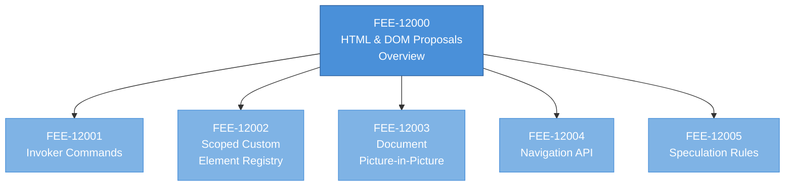
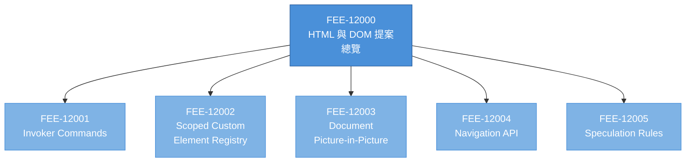

# FEE HTML & DOM Proposals Articles Implementation Plan

> **For agentic workers:** REQUIRED SUB-SKILL: Use superpowers:subagent-driven-development (recommended) or superpowers:executing-plans to implement this plan task-by-task. Steps use checkbox (`- [ ]`) syntax for tracking.

**Goal:** Ship five pre-stable HTML/DOM sub-articles (FEE-12001 through FEE-12005) in EN and zh-TW, with a preliminary edit to FEE-12000 so its Visual diagram and range table match the new sequential IDs.

**Architecture:** One preliminary overview-edit commit, then five article commits (one per sub-article, each covering both languages), with a mandatory user-review pause after the first article ships. Each sub-article follows the canonical FEE template from `CLAUDE.md`, is ≥301 lines, cites ≥5 live-verified URLs, and passes Vue template safety checks.

**Tech Stack:** VitePress 1.3.x, Mermaid diagrams, pnpm, Markdown with frontmatter, `polish-documents` skill, `WebFetch` for URL verification.

**Spec:** `docs/superpowers/specs/2026-04-19-fee-html-dom-proposals-articles-design.md`

---

## File Structure

**Files edited in Task 1 (overview adjustment):**

- Modify: `docs/en/Web Platform Proposals/HTML and DOM Proposals/12000.md` (Visual section diagram + "Tracks in this range" table + immediately-dependent prose)
- Modify: `docs/zh-tw/Web Platform Proposals/HTML and DOM Proposals/12000.md` (same structural edit; preserve Traditional Chinese prose elsewhere)

**Files created in Tasks 2-6 (one article per task, each covering both languages):**

- Create: `docs/en/Web Platform Proposals/HTML and DOM Proposals/12001.md`, `12002.md`, `12003.md`, `12004.md`, `12005.md`
- Create: `docs/zh-tw/Web Platform Proposals/HTML and DOM Proposals/12001.md`, `12002.md`, `12003.md`, `12004.md`, `12005.md`

Each sub-article has one clear responsibility: document a single pre-stable HTML/DOM proposal at the depth required for a senior developer to make an adoption decision. Files are independent — each article can be understood without reading the others, and references between articles are explicit in each file's Internal References section.

---

## Shared Article Template

Every sub-article (Tasks 2-6) uses this frontmatter and section skeleton. Copy it as the starting point for each article.

**Frontmatter (5 lines):**

```yaml
---
id: <12001|12002|12003|12004|12005>
title: "<article title>"
state: draft
level: senior
---
```

**Section skeleton (exact order, no `## Principle` section):**

```markdown
# [FEE-<id>] <article title>

:::info
One-sentence hook framing the feature's adoption tradeoff.
:::

## Context

## Scenario

## Best Practices

## Design Thinking

### Why the platform needed the feature

### How the ecosystem bridges the gap

## Visual

## Example

## Internal References

- FEE-<id> — <brief relational phrase>
- FEE-<id> — <brief relational phrase>
- FEE-<id> — <brief relational phrase>

## References

1. <URL> — <description>
2. <URL> — <description>
3. <URL> — <description>
4. <URL> — <description>
5. <URL> — <description>
```

**zh-TW section header map (apply exactly):**

| EN | zh-TW |
|----|------|
| Context | 背景 |
| Scenario | 情境 |
| Best Practices | 最佳實踐 |
| Design Thinking | 設計思維 |
| Visual | 圖解 |
| Example | 範例 |
| Internal References | 內部參考 |
| References | 參考資料 |

Optional topic-specific sections (e.g. `## Migration Guide`, `## Browser Support Matrix`) may appear between Example and Internal References when the topic earns them. Do not add an optional section just to pad line count.

---

## Shared Verification Commands

These commands are referenced repeatedly in the tasks below. Run them in the repo root.

**Line-count floor (each article file MUST be ≥301 lines):**

```bash
wc -l "docs/en/Web Platform Proposals/HTML and DOM Proposals/<id>.md" "docs/zh-tw/Web Platform Proposals/HTML and DOM Proposals/<id>.md"
```

Expected: both files report ≥301 lines.

**Vue template safety grep (three pitfalls from `CLAUDE.md`):**

```bash
# Pitfall 1: Unescaped {{ inside backtick code spans — fails build
grep -nE '`[^`]*\{\{[^`]*`' "docs/en/Web Platform Proposals/HTML and DOM Proposals/<id>.md" "docs/zh-tw/Web Platform Proposals/HTML and DOM Proposals/<id>.md" || echo "OK: no unescaped {{ in code spans"

# Pitfall 2: Raw <Tag> inside <code v-pre> — fails SSR
grep -nE '<code v-pre>[^<]*<[A-Z]' "docs/en/Web Platform Proposals/HTML and DOM Proposals/<id>.md" "docs/zh-tw/Web Platform Proposals/HTML and DOM Proposals/<id>.md" || echo "OK: no raw <Tag> in code v-pre"

# Pitfall 3: Backslash-escaped backticks inside code spans — CommonMark rejects
grep -nE '`[^`]*\\`[^`]*`' "docs/en/Web Platform Proposals/HTML and DOM Proposals/<id>.md" "docs/zh-tw/Web Platform Proposals/HTML and DOM Proposals/<id>.md" || echo "OK: no \\\` in code spans"
```

Expected: all three pitfalls report "OK" (no matches). Any match must be fixed with `<code v-pre>` + HTML entities or double-backtick delimiters before commit.

**Build probe (run after overview edit and after the last sub-article commit):**

```bash
pnpm docs:build
```

Expected: build succeeds with no errors about `{{ }}` compilation, unknown tags, or broken frontmatter.

---

## Task 1: Preliminary — Update FEE-12000 Overview for Sequential Sub-Article IDs

**Files:**
- Modify: `docs/en/Web Platform Proposals/HTML and DOM Proposals/12000.md` (Visual diagram lines 178-223; range table lines 235-242; immediately-dependent prose at 225, 231, 244)
- Modify: `docs/zh-tw/Web Platform Proposals/HTML and DOM Proposals/12000.md` (same regions, Traditional Chinese equivalents)

**Why:** The spec switches from topic-based sub-range IDs (`12001-099`, `12100-199`, etc.) to sequential IDs (`12001, 12002, 12003, 12004, 12005`). The current overview's Visual diagram shows six gray sub-range nodes with planned-topic leaves; the "Tracks in this range" table has six rows describing each sub-range. Both must change to reflect the sequential scheme before any sub-article is drafted, otherwise readers see inconsistent structure.

- [ ] **Step 1: Read current Visual section of EN overview**

Run:

```bash
sed -n '176,245p' "docs/en/Web Platform Proposals/HTML and DOM Proposals/12000.md"
```

Expected: confirms the existing Mermaid diagram, surrounding paragraphs, and the "Tracks in this range" table match what this task replaces. If the content has diverged from the spec's assumptions, stop and raise the mismatch with the user before editing.

- [ ] **Step 2: Replace EN Visual Mermaid diagram**

Replace the entire Mermaid block (opens `` ```mermaid `` at line 178 and closes at line 223) with this flat diagram:

````markdown

````

- [ ] **Step 3: Replace the two EN paragraphs that describe the old diagram**

The paragraphs at lines 225 and 231 reference "gray range nodes" and "Beyond the currently planned sub-articles." Replace both paragraphs with this single paragraph:

```markdown
The blue node is the category overview. Each sub-article below it is a drafted FEE entry covering one pre-stable HTML or DOM proposal. The five articles are listed in numerical order; there is no topical grouping beneath the overview. Additional 12xxx articles may be added by future specs as new proposals mature; they will be numbered sequentially from 12006.
```

Leave the paragraph at line 227 ("The category's current emptiness...") — it describes why the range is shallow and is now slightly less accurate but still readable. If the paragraph explicitly contradicts the new structure on re-read, rewrite it; otherwise preserve it.

Leave the paragraph at line 229 ("The reading order when the sub-articles exist...") — rewrite only its opening clause from "When the sub-articles exist" to "The suggested reading order is," since the articles now exist. Keep the rest of the paragraph.

- [ ] **Step 4: Replace the EN "Tracks in this range" table**

Replace the six-row table at lines 235-242 with a five-row table listing the actual sub-articles:

```markdown
| ID    | Title                                                  | Status                                    |
|-------|--------------------------------------------------------|-------------------------------------------|
| 12001 | Invoker Commands (`command` / `commandfor` attributes) | Shipping in Chromium and WebKit; Firefox flag |
| 12002 | Scoped Custom Element Registry                         | Shipping in Chromium and WebKit; Firefox flag |
| 12003 | Document Picture-in-Picture                            | Chromium-only                             |
| 12004 | Navigation API                                         | Shipping in Chromium and WebKit; Firefox flag |
| 12005 | Speculation Rules                                      | Chromium-only                             |
```

Status column values are placeholders until each sub-article's research pass verifies current shipping state. Update this overview's status column when an article's research pass discovers a different status; commit the overview update together with the article commit.

- [ ] **Step 5: Replace the EN paragraph after the table**

The paragraph at line 244 describes "range assignments follow reader-facing categorization." Replace it with:

```markdown
Sub-articles are numbered sequentially, in roughly the order a reader encounters the proposals in practice. Invoker Commands and Scoped Custom Element Registry are element/attribute-level additions; Document Picture-in-Picture is a windowing API; the Navigation API covers SPA routing; Speculation Rules governs prefetch and prerender hints. Each article's Internal References section cross-links the proposals that interact (for example, Invoker Commands and Popover).
```

- [ ] **Step 6: Apply the same four edits to the zh-TW overview**

Run:

```bash
sed -n '176,245p' "docs/zh-tw/Web Platform Proposals/HTML and DOM Proposals/12000.md"
```

Expected: confirms the zh-TW Visual diagram, prose, and table mirror the EN structure.

Replace the Mermaid diagram with exactly the block from Step 2 (Mermaid identifiers are language-neutral; only node labels would differ, and here the FEE-IDs carry the meaning). Optionally translate the node labels to Traditional Chinese:

````markdown

````

Replace the two descriptive paragraphs (equivalent to EN lines 225 and 231) with this single paragraph:

```markdown
藍色節點是分類總覽。其下每個子文章都是涵蓋一項前穩定 HTML 或 DOM 提案的 FEE 條目。五篇文章依編號順序列出；總覽之下沒有主題分組。未來規格可能隨新提案成熟而補充更多 12xxx 文章，編號從 12006 起依序延續。
```

Rewrite the opening clause of the paragraph equivalent to EN line 229 from "當子文章存在時，建議的閱讀順序" to "建議的閱讀順序"; keep the rest of that paragraph.

Replace the "此範圍的軌道" table with:

```markdown
| ID    | 標題                                              | 狀態                                          |
|-------|---------------------------------------------------|-----------------------------------------------|
| 12001 | Invoker Commands（`command` / `commandfor` 屬性） | Chromium 與 WebKit 已出貨；Firefox 旗標       |
| 12002 | Scoped Custom Element Registry                    | Chromium 與 WebKit 已出貨；Firefox 旗標       |
| 12003 | Document Picture-in-Picture                       | Chromium 限定                                 |
| 12004 | Navigation API                                    | Chromium 與 WebKit 已出貨；Firefox 旗標       |
| 12005 | Speculation Rules                                 | Chromium 限定                                 |
```

Replace the paragraph after the table with:

```markdown
子文章依序編號，大致按讀者在實務中遇到提案的順序排列。Invoker Commands 與 Scoped Custom Element Registry 屬於元素與屬性層級的新增；Document Picture-in-Picture 是視窗 API；Navigation API 涵蓋 SPA 路由；Speculation Rules 控制 prefetch 與 prerender 提示。每篇文章在「內部參考」段落交叉連結會彼此互動的提案（例如 Invoker Commands 與 Popover）。
```

- [ ] **Step 7: Verify line counts still meet the 301-line floor**

Run:

```bash
wc -l "docs/en/Web Platform Proposals/HTML and DOM Proposals/12000.md" "docs/zh-tw/Web Platform Proposals/HTML and DOM Proposals/12000.md"
```

Expected: both files report ≥301 lines. The edits replace ~20 lines of Mermaid and ~8 rows of table; the new flat diagram is ~20 lines and the new table is 6 rows, so line counts stay near 301. If a file drops below 301, restore the preserved paragraphs at lines 227 and 229 rather than padding with new prose.

- [ ] **Step 8: Run Vue template safety grep**

Run the three grep commands from "Shared Verification Commands" with `<id>` = `12000`.

Expected: all three report "OK". The edits did not introduce new `{{ }}` inside code spans, new `<Tag>` inside `<code v-pre>`, or new backslash-escaped backticks.

- [ ] **Step 9: Run build probe**

Run:

```bash
pnpm docs:build
```

Expected: build succeeds. If Mermaid renders in the preview, the diagram's `graph TD` syntax and node IDs are valid. If the build fails with a Vue template compilation error, find the offending line via the error trace and apply the appropriate escape from `CLAUDE.md`'s Vue Template Safety rules.

- [ ] **Step 10: Commit**

Run:

```bash
git add "docs/en/Web Platform Proposals/HTML and DOM Proposals/12000.md" "docs/zh-tw/Web Platform Proposals/HTML and DOM Proposals/12000.md"
git commit -m "$(cat <<'EOF'
docs(fee): update FEE-12000 overview for sequential sub-article IDs

Replace the topic-based sub-range diagram and range table with a flat
listing of sub-articles 12001-12005. Preliminary edit for the HTML and
DOM proposals sub-articles spec.
EOF
)"
```

Expected: commit lands cleanly on main.

---

## Task 2: FEE-12001 — Invoker Commands (`command` / `commandfor`)

**Files:**
- Create: `docs/en/Web Platform Proposals/HTML and DOM Proposals/12001.md`
- Create: `docs/zh-tw/Web Platform Proposals/HTML and DOM Proposals/12001.md`

**Why:** Invoker Commands is the first drafted 12xxx sub-article and establishes the house style for pre-stable HTML/DOM articles. The `command` and `commandfor` attributes turn imperative click-handler wiring into declarative markup; the feature ships in Chromium and WebKit with a Firefox-behind-flag tail.

- [ ] **Step 1: Research pass — WebFetch each candidate URL and record verified facts**

For each URL below, use the WebFetch tool to confirm the page loads and extract the specific facts noted. Record any status / version / date claim that will appear in the article.

Candidate URLs:

1. `https://html.spec.whatwg.org/multipage/form-control-infrastructure.html#the-commandfor-attribute` — WHATWG HTML Living Standard section for the `command` / `commandfor` attributes. Verify the section exists and note the built-in command values listed.
2. `https://github.com/openui/open-ui/issues/1088` — Open UI proposal discussion thread for Invokers. Verify the issue's current status (open/closed/landed).
3. `https://developer.mozilla.org/en-US/docs/Web/API/HTMLButtonElement/command` — MDN reference for `HTMLButtonElement.command`. Verify the page exists and note the "Baseline" badge if present.
4. `https://caniuse.com/mdn-html_global_attributes_command` — caniuse entry. Record the shipping status per engine as shown on the page at research time.
5. `https://www.npmjs.com/package/invokers-polyfill` — the polyfill package. Verify it exists and record the latest version.

Additional candidate for cross-reference:

6. `https://developer.chrome.com/blog/command-and-commandfor` — Chrome for Developers blog post (if available). Verify existence; include as the canonical explainer if present, otherwise find an equivalent WebKit or Mozilla Hacks post.

If any URL returns 404 or redirects to a topic page instead of the specific resource, substitute an equivalent canonical source and document the substitution in a scratch note. The article's References section MUST use only URLs confirmed live in this step.

Facts to record from the research pass (used by later article-writing steps):

- Current shipping status per engine (Chromium version, WebKit version, Firefox flag state).
- The built-in command values defined by the spec (expected: `show-popover`, `hide-popover`, `toggle-popover`, `show-modal`, `close`, `request-close`; confirm no additions or removals).
- The `CommandEvent` interface shape (type, fields).
- Any breaking changes from earlier proposal iterations (e.g. `invoketarget` → `commandfor` rename).
- Polyfill package's documented level of compatibility with native semantics.

- [ ] **Step 2: Write the EN file with full template, ≥301 lines**

Create `docs/en/Web Platform Proposals/HTML and DOM Proposals/12001.md` using the frontmatter and section skeleton from "Shared Article Template" above, with `id: 12001` and `title: "Invoker Commands"`.

Content per section (prose to be written; structure is fixed):

**Info hook:** One sentence, declarative-wiring framing. Example: "Wire any button to any element's behavior declaratively, with no click handler and no imperative call."

**Context (3-5 paragraphs):**
- What the pre-invoker pattern looked like (imperative click handler + ref + method call).
- What Invokers introduce (`command` / `commandfor` attributes, built-in command values, `CommandEvent`).
- Status per engine (from research pass — structural language; "shipping in Chromium and WebKit" rather than a specific version if the version is uncertain).
- Relationship to Popover (most common use case; the built-in `toggle-popover` command is the motivating example).
- Why the feature sits in the pre-stable range (Firefox support pending).

**Scenario:** A developer wiring a tooltip or dialog. Two concrete patterns side by side — the pre-invoker JS-based pattern and the Invoker-based pattern. Show the declarative version is shorter and reads like HTML.

**Best Practices (MUST / SHOULD / MAY prose):**
- MUST use `<button>` as the invoker element — the specification requires it.
- MUST feature-detect before relying on custom `--*` commands (`'command' in HTMLButtonElement.prototype`).
- SHOULD use `invokers-polyfill` during the Firefox-flag tail.
- SHOULD pair `command="toggle-popover"` with the target element's `popover` attribute.
- MAY define custom commands prefixed with `--` (spec convention for author-defined commands).
- MUST NOT wrap the invoker in an `onclick` handler that fights the declarative wiring.

**Design Thinking — Why the platform needed the feature:**
Every overlay relationship in pre-invoker UI was a bespoke click handler; accessibility correctness (focus return, ESC handling) was reimplemented per site. The declarative model moves the wiring into HTML where it is statically auditable.

**Design Thinking — How the ecosystem bridges the gap:**
`invokers-polyfill` implements the attribute semantics and `CommandEvent` for non-supporting engines. Polyfill caveats (e.g. custom command dispatch timing) are documented on the package page; the polyfill approaches native parity but does not match it bit-for-bit.

**Visual:** Mermaid sequence diagram — user click → browser dispatches `CommandEvent` → default-action handler runs (if built-in) → target element state updates. Use `sequenceDiagram` syntax.

**Example:** Two runnable HTML blocks:
1. A `<button command="show-modal" commandfor="confirm-dialog">Delete</button>` wired to a `<dialog id="confirm-dialog">` with a nested close button using `command="close"`.
2. A custom-command example: `<button command="--apply-filter" commandfor="filter-panel">Apply</button>` + a JS `CommandEvent` listener that reads `event.command` and `event.source`.

Use `<code v-pre>` for any inline code containing `{{ }}` (none expected here, but the `command="--*"` value is safe in a standard backtick span because it lacks `{{ }}`).

**Migration Guide (optional topic-specific section):** One table, left column "Pre-invoker JS pattern," right column "Invoker pattern." Three rows: tooltip show/hide, dialog open/close, popover toggle.

**Internal References:**
- FEE-12000 — parent overview for HTML/DOM proposals
- (If Popover has a stable FEE number at write time, cross-reference it. Otherwise leave Popover out of Internal References and note in the Context section that Popover has graduated to the stable HTML range but does not yet have a dedicated FEE.)
- FEE-12002 — scoped custom element registry, the next 12xxx sub-article in reading order

**References:** The 5-6 URLs verified in Step 1, ordered: WHATWG spec → proposal repo → MDN → caniuse → polyfill → canonical explainer.

Target: ≥301 lines total. If the draft runs short, expand the Context and Design Thinking sections with additional depth — do not pad other sections artificially.

- [ ] **Step 3: Write the zh-TW file with full template, ≥301 lines**

Create `docs/zh-tw/Web Platform Proposals/HTML and DOM Proposals/12001.md`. Use the zh-TW section header map from "Shared Article Template." The frontmatter uses the same `id`, `state`, `level`; `title` is `"Invoker Commands"` (keep English title — the term is a proper noun; the body prose is Traditional Chinese).

The zh-TW file is a human-written adaptation, not a machine translation. Write each section in natural Traditional Chinese written for a native reader. Keep the same structural depth and paragraph count as EN, but do not translate word-for-word — idiomatic rewriting per section produces better prose.

Forbidden patterns (global `CLAUDE.md`):
- No "不是 X，而是 Y" contrastive negation.
- No "說得很清楚" / "得很精確" self-referential precision claims.
- No "(廢話)——(更多廢話)" em-dash-chain filler.
- No undefined vague modifiers ("很重" without a reference, "可以跑" without a subject).
- No stacked "可以 X 可以 Y 可以 Z" capability lists.

Target: ≥301 lines.

- [ ] **Step 4: Polish the EN file**

Invoke the `polish-documents` skill on `docs/en/Web Platform Proposals/HTML and DOM Proposals/12001.md`. Address every finding inline. The polish pass tightens sentences and removes prohibited English style patterns (contrastive negation, em-dash chains, precision puffery, unanchored claims).

After polish, re-verify the line count:

```bash
wc -l "docs/en/Web Platform Proposals/HTML and DOM Proposals/12001.md"
```

Expected: ≥301. If polish drops the file under 301, restore depth in the Context or Design Thinking section — do not revert the polish changes.

- [ ] **Step 5: Polish the zh-TW file**

Invoke the `polish-documents` skill on `docs/zh-tw/Web Platform Proposals/HTML and DOM Proposals/12001.md`. Same post-polish line-count check.

- [ ] **Step 6: Vue template safety grep**

Run the three grep commands from "Shared Verification Commands" with `<id>` = `12001`.

Expected: all three report "OK". If any match, fix with `<code v-pre>` + HTML entities or double-backtick delimiters before commit.

- [ ] **Step 7: Commit**

Run:

```bash
git add "docs/en/Web Platform Proposals/HTML and DOM Proposals/12001.md" "docs/zh-tw/Web Platform Proposals/HTML and DOM Proposals/12001.md"
git commit -m "docs(fee): add FEE-12001 Invoker Commands"
```

Expected: commit lands cleanly.

- [ ] **Step 8: REVIEW CHECKPOINT — pause for user review**

Report to the user:

> FEE-12001 Invoker Commands shipped (commit `<hash>`). Please review before I continue with 12002-12005. Key things to check: voice, depth, bilingual parallelism, References ordering, Mermaid rendering. Reply "continue" or request changes.

Wait for the user's response. If they request changes, apply them and re-run Steps 4-7 as needed. Only proceed to Task 3 once the user explicitly approves.

---

## Task 3: FEE-12002 — Scoped Custom Element Registry

**Files:**
- Create: `docs/en/Web Platform Proposals/HTML and DOM Proposals/12002.md`
- Create: `docs/zh-tw/Web Platform Proposals/HTML and DOM Proposals/12002.md`

**Why:** Multiple micro-frontends or widget libraries often ship their own custom elements with the same tag name. The scoped registry proposal (`new CustomElementRegistry()` + `attachShadow({ registry })`) makes per-shadow-root namespacing possible. Chromium and WebKit ship it; Firefox is behind a flag.

- [ ] **Step 1: Research pass**

Candidate URLs:

1. `https://html.spec.whatwg.org/multipage/custom-elements.html#customelementregistry` — WHATWG HTML Living Standard section. Verify the scoped-registry additions (constructor, `attachShadow({ registry })`) are present.
2. `https://github.com/webcomponents-cg/community-protocols` — webcomponents CG protocols repo. Verify existence and find the scoped-registry issue if listed.
3. `https://developer.mozilla.org/en-US/docs/Web/API/CustomElementRegistry/CustomElementRegistry` — MDN page for the `CustomElementRegistry()` constructor. Verify availability annotations.
4. `https://www.npmjs.com/package/@webcomponents/scoped-custom-element-registry` — polyfill package. Verify existence and record the latest version and any compatibility notes.
5. `https://github.com/WICG/webcomponents/blob/gh-pages/proposals/Scoped-Custom-Element-Registries.md` — WICG proposal explainer. Verify the document loads.

Facts to record:
- Current shipping status per engine (Chromium, WebKit, Firefox flag).
- Whether the `ShadowRootInit.registry` option is the final name (it has shifted during proposal iteration).
- Polyfill's documented limitations (especially around CSS rule matching after tag-name rewriting).

- [ ] **Step 2: Write the EN file**

Create `docs/en/Web Platform Proposals/HTML and DOM Proposals/12002.md` using the shared template. `id: 12002`, `title: "Scoped Custom Element Registry"`.

Content per section:

**Info hook:** Declarative-namespace framing. Example: "Multiple versions of `<user-card>` coexist in one page when each lives in its own shadow root."

**Context:** The global `customElements.define()` namespace; the motivating problem (micro-frontend name collisions); the new constructor + `attachShadow` option; current shipping status per engine.

**Scenario:** A host page embedding two widgets from different vendors, both of which register `<vendor-button>`. Without scoping: second `define()` throws. With scoping: each shadow root carries its own registry.

**Best Practices:**
- SHOULD use scoped registries at integration boundaries (micro-frontend hosts, widget roots).
- MUST feature-detect (`'registry' in Object.getOwnPropertyDescriptor(ShadowRoot.prototype, 'attachShadow')?.value` or constructor presence).
- SHOULD fall back to versioned tag names on non-supporting engines (`vendor-a-button-v2`).
- MUST NOT rely on scoped registries for application-internal encapsulation — use ES modules instead.
- MAY share a registry between multiple shadow roots by passing the same registry instance.

**Design Thinking — Why the platform needed the feature:**
The 2016 global registry mirrored `document.registerElement` and suited the single-app pages of the time. Multi-owner pages were an afterthought; the web's shift to micro-frontends exposed the namespace limitation.

**Design Thinking — How the ecosystem bridges the gap:**
`@webcomponents/scoped-custom-element-registry` polyfill rewrites tag names at registration. This approximates but does not match native semantics — CSS rules written against the original tag name no longer match after rewriting, and DevTools display the rewritten names.

**Visual:** Mermaid diagram showing two shadow roots under one document, each carrying its own `CustomElementRegistry` with `<demo-card>` bound to different constructors.

**Example:** HTML + JS block creating two `<div>` containers, each attaching a shadow root with a distinct registry, each registering a different `<demo-card>` class, and rendering the result.

**Browser Support Matrix (optional topic-specific section):** Three-row table for Chromium, WebKit, Firefox; column for shipping status and since-version where known.

**Internal References:**
- FEE-12000 — parent overview
- FEE-12001 — prior sub-article in reading order
- FEE-12003 — next sub-article in reading order
- (Optional) a stable FEE on Web Components if one exists

**References:** Five URLs verified in Step 1.

Target ≥301 lines.

- [ ] **Step 3: Write the zh-TW file**

Create `docs/zh-tw/Web Platform Proposals/HTML and DOM Proposals/12002.md` per the zh-TW header map. Same structural depth. Avoid forbidden patterns.

Target ≥301 lines.

- [ ] **Step 4: Polish the EN file**

Invoke `polish-documents` on the EN file. Address findings inline.

- [ ] **Step 5: Polish the zh-TW file**

Invoke `polish-documents` on the zh-TW file. Address findings inline.

- [ ] **Step 6: Vue template safety grep**

Run the three grep commands with `<id>` = `12002`. Expected: all three "OK".

- [ ] **Step 7: Commit**

Run:

```bash
git add "docs/en/Web Platform Proposals/HTML and DOM Proposals/12002.md" "docs/zh-tw/Web Platform Proposals/HTML and DOM Proposals/12002.md"
git commit -m "docs(fee): add FEE-12002 Scoped Custom Element Registry"
```

---

## Task 4: FEE-12003 — Document Picture-in-Picture

**Files:**
- Create: `docs/en/Web Platform Proposals/HTML and DOM Proposals/12003.md`
- Create: `docs/zh-tw/Web Platform Proposals/HTML and DOM Proposals/12003.md`

**Why:** `documentPictureInPicture.requestWindow()` lets a page promote arbitrary HTML into a floating always-on-top window, not just a `<video>`. Chromium ships it; Safari and Firefox do not. Video-conferencing and live-coding apps are the primary consumers.

- [ ] **Step 1: Research pass**

Candidate URLs:

1. `https://wicg.github.io/document-picture-in-picture/` — WICG Document Picture-in-Picture specification. Verify existence.
2. `https://github.com/WICG/document-picture-in-picture` — WICG proposal repo. Verify activity level.
3. `https://developer.mozilla.org/en-US/docs/Web/API/Document_Picture-in-Picture_API` — MDN landing page. Verify availability annotations per engine.
4. `https://developer.chrome.com/docs/web-platform/document-picture-in-picture` — Chrome for Developers article. Verify existence.
5. `https://webkit.org/status/#specification-document-picture-in-picture` — WebKit status tracker. Record the stated position.

Facts to record:
- Exact shipping status (Chromium-only at time of writing; WebKit/Gecko positions from trackers).
- The `Window` object returned by `requestWindow({ width, height })` — what events fire on it (`pagehide`, focus transfer) and how to copy stylesheets via `adoptedStyleSheets`.
- Explicit difference from `HTMLVideoElement.requestPictureInPicture()`.
- User-activation requirements for calling `requestWindow`.

- [ ] **Step 2: Write the EN file**

Create `docs/en/Web Platform Proposals/HTML and DOM Proposals/12003.md`. `id: 12003`, `title: "Document Picture-in-Picture"`.

Content per section:

**Info hook:** "Put an entire HTML document into a floating window, not just a `<video>`."

**Context:** Pre-existing video PiP (`HTMLVideoElement.requestPictureInPicture()`) limits PiP to media. Document PiP exposes `documentPictureInPicture.requestWindow({ width, height })` which returns a full `Window` object the page can populate with arbitrary DOM. Current shipping status per engine.

**Scenario:** A video-conferencing app wants to pop out the entire participant grid — avatars, captions, and controls — not just one `<video>`.

**Best Practices:**
- MUST feature-detect (`'documentPictureInPicture' in window`).
- MUST copy stylesheets via `adoptedStyleSheets` (main-document styles do not automatically apply to the PiP window).
- SHOULD handle `pagehide` on the PiP window to sync state back to the main document.
- MUST provide a non-PiP fallback path — the feature is Chromium-only at time of writing.
- MUST call `requestWindow` in response to user activation — spontaneous invocations are rejected.
- SHOULD re-attach `<video>` elements by transferring (`appendChild`) the existing element rather than creating a new one, to preserve media state.

**Design Thinking — Why the platform needed the feature:**
Video PiP was scoped to media because streaming was the dominant use case at the time. Once web apps evolved into multi-pane surfaces (conferencing, live-coding, doc review), the video-only constraint blocked obvious use cases.

**Design Thinking — How the ecosystem bridges the gap:**
There is no real polyfill — the capability is OS-level window creation. Fallbacks: `window.open()` for a detached window (loses always-on-top), or an in-page floating pane. Both compromise the core value.

**Visual:** Mermaid state diagram — main document → `requestWindow` called → PiP window created → user closes → `pagehide` fires → main document resumes.

**Example:** A minimal conference-app pattern — button with user activation calls `requestWindow`, copies stylesheets via `adoptedStyleSheets`, transfers a `<video>` element to the PiP document, wires `pagehide` to return the video to the main document.

**Internal References:**
- FEE-12000 — parent overview
- FEE-12002 — prior sub-article
- FEE-12004 — next sub-article
- (Optional) a stable FEE on `<video>` or media APIs

**References:** Five URLs verified in Step 1.

Target ≥301 lines.

- [ ] **Step 3: Write the zh-TW file**

Create `docs/zh-tw/Web Platform Proposals/HTML and DOM Proposals/12003.md` per zh-TW header map. Target ≥301 lines.

- [ ] **Step 4: Polish the EN file**

Invoke `polish-documents` on the EN file.

- [ ] **Step 5: Polish the zh-TW file**

Invoke `polish-documents` on the zh-TW file.

- [ ] **Step 6: Vue template safety grep**

Run the three grep commands with `<id>` = `12003`. Expected: all three "OK".

- [ ] **Step 7: Commit**

Run:

```bash
git add "docs/en/Web Platform Proposals/HTML and DOM Proposals/12003.md" "docs/zh-tw/Web Platform Proposals/HTML and DOM Proposals/12003.md"
git commit -m "docs(fee): add FEE-12003 Document Picture-in-Picture"
```

---

## Task 5: FEE-12004 — Navigation API

**Files:**
- Create: `docs/en/Web Platform Proposals/HTML and DOM Proposals/12004.md`
- Create: `docs/zh-tw/Web Platform Proposals/HTML and DOM Proposals/12004.md`

**Why:** `window.navigation` replaces the hand-rolled routing every SPA framework has built on top of `history.pushState`. It ships in Chromium and WebKit; Firefox tracks it. SPA routers (React Router, Vue Router, Next.js router) layer over it where available and fall back to `history` elsewhere.

- [ ] **Step 1: Research pass**

Candidate URLs:

1. `https://html.spec.whatwg.org/multipage/nav-history-apis.html#the-navigation-api` — WHATWG HTML Living Standard Navigation API section. Verify it loads.
2. `https://github.com/WICG/navigation-api` — WICG navigation-api repo (historical; now in WHATWG). Verify repo accessible and record its pointer to the WHATWG spec.
3. `https://developer.mozilla.org/en-US/docs/Web/API/Navigation_API` — MDN landing for the Navigation API. Verify availability per engine.
4. `https://developer.chrome.com/docs/web-platform/navigation-api` — Chrome for Developers article. Verify existence.
5. `https://bugzilla.mozilla.org/show_bug.cgi?id=1777506` — Firefox tracking bug. Record the current state (NEW / ASSIGNED / implementation in progress).

Facts to record:
- Exact shipping status per engine.
- Event order: `navigate` → `intercept(handler)` → `currententrychange`.
- The `navigation.entries()` return type and `NavigationHistoryEntry` interface.
- Scroll restoration and focus management guarantees.
- Any interaction with back/forward cache.

- [ ] **Step 2: Write the EN file**

Create `docs/en/Web Platform Proposals/HTML and DOM Proposals/12004.md`. `id: 12004`, `title: "Navigation API"`.

Content per section:

**Info hook:** "Replace the hand-rolled SPA router with a platform API that understands routing as a first-class concept."

**Context:** `history.pushState` (2010) was designed for pre-SPA Ajax, not for route-centric apps. Frameworks built their own routers on top. The Navigation API (`window.navigation`) adds `navigate` events with `intercept({ handler })`, typed entry lists, and built-in scroll/focus restoration.

**Scenario:** A React app upgrades its router to use the Navigation API where available, falling back to `history` where not. The Navigation API version gets scroll restoration and focus management for free.

**Best Practices:**
- MUST feature-detect (`'navigation' in window`).
- SHOULD layer the framework router over the Navigation API when available; keep the `history` path for non-supporting engines.
- The `intercept({ handler })` handler MUST return a Promise; synchronous resolution is an anti-pattern.
- SHOULD use `currententrychange` for observation (analytics, logging) rather than building on `popstate`.
- MUST NOT call `history.pushState` directly while the Navigation API is active — the behaviors interfere.

**Design Thinking — Why the platform needed the feature:**
`history.pushState` was a 2010 Ajax primitive. Route concepts (named routes, nested routes, parameters) were never in the platform; every framework invented its own. The Navigation API reunifies the platform model with framework reality.

**Design Thinking — How the ecosystem bridges the gap:**
Framework routers do not disappear — they still handle route definitions, guards, code-splitting. They layer over the Navigation API as a cleaner primitive than `history`. Smaller apps can drop their router entirely once Firefox ships.

**Visual:** Mermaid sequence diagram — link click → `navigate` event → `intercept(handler)` → `currententrychange` after handler Promise resolves.

**Example:** A minimal SPA router using the `navigate` event + `intercept({ handler })`. Then a sketch of wrapping it in a feature-detecting helper that falls back to `history.pushState` on unsupported engines.

**Internal References:**
- FEE-12000 — parent overview
- FEE-12003 — prior sub-article
- FEE-12005 — next sub-article
- (Optional) a stable FEE on SPA routing patterns

**References:** Five URLs verified in Step 1.

Target ≥301 lines.

- [ ] **Step 3: Write the zh-TW file**

Create `docs/zh-tw/Web Platform Proposals/HTML and DOM Proposals/12004.md` per zh-TW header map. Target ≥301 lines.

- [ ] **Step 4: Polish the EN file**

Invoke `polish-documents` on the EN file.

- [ ] **Step 5: Polish the zh-TW file**

Invoke `polish-documents` on the zh-TW file.

- [ ] **Step 6: Vue template safety grep**

Run the three grep commands with `<id>` = `12004`. Expected: all three "OK".

- [ ] **Step 7: Commit**

Run:

```bash
git add "docs/en/Web Platform Proposals/HTML and DOM Proposals/12004.md" "docs/zh-tw/Web Platform Proposals/HTML and DOM Proposals/12004.md"
git commit -m "docs(fee): add FEE-12004 Navigation API"
```

---

## Task 6: FEE-12005 — Speculation Rules

**Files:**
- Create: `docs/en/Web Platform Proposals/HTML and DOM Proposals/12005.md`
- Create: `docs/zh-tw/Web Platform Proposals/HTML and DOM Proposals/12005.md`

**Why:** `<script type="speculationrules">` is the declarative replacement for `<link rel="prefetch">` and the removed `<link rel="prerender">`. Chromium ships it; Safari and Firefox track it. Framework prefetchers emit it where supported.

- [ ] **Step 1: Research pass**

Candidate URLs:

1. `https://wicg.github.io/nav-speculation/speculation-rules.html` — WICG specification. Verify existence.
2. `https://github.com/WICG/nav-speculation` — WICG proposal repo. Verify activity.
3. `https://developer.mozilla.org/en-US/docs/Web/API/Speculation_Rules_API` — MDN landing. Verify availability annotations.
4. `https://developer.chrome.com/docs/web-platform/prerender-pages` — Chrome for Developers prerender article. Verify it covers Speculation Rules specifically.
5. `https://caniuse.com/mdn-html_elements_script_type_speculationrules` — caniuse entry. Record shipping status per engine.

Facts to record:
- Eagerness levels (`conservative`, `moderate`, `eager`, `immediate`) and their documented behavior differences.
- Same-origin vs. cross-origin constraints for prerender.
- Rule-set JSON schema fields (`prefetch`, `prerender`, `urls`, `where`, `eagerness`).
- Privacy guards added after the 2019 removal of `<link rel="prerender">`.
- Interaction with View Transitions (cross-document).
- Prerender side-effect risks (analytics beacons firing for pages never visited).

- [ ] **Step 2: Write the EN file**

Create `docs/en/Web Platform Proposals/HTML and DOM Proposals/12005.md`. `id: 12005`, `title: "Speculation Rules"`.

Content per section:

**Info hook:** "Declaratively tell the browser which links to preload, without writing prefetch logic."

**Context:** Pre-existing `<link rel="prefetch">` lacked eagerness control; the removed `<link rel="prerender">` caused privacy leaks and bandwidth waste. Speculation Rules is the post-mortem redesign — declarative, permissioned, with eagerness levels. Current shipping status per engine.

**Scenario:** A docs site wants every in-range link to prerender on hover, without writing a hover listener. A Speculation Rules block with `eagerness: "moderate"` does it. Non-supporting engines ignore the block; pages still work without the head start.

**Best Practices:**
- MUST prerender only idempotent same-origin pages by default; explicit opt-in required for cross-origin.
- SHOULD use `eagerness: "conservative"` for expensive pages; reserve `"immediate"` for known-critical next-pages.
- MUST exclude analytics-affecting and stateful-side-effect pages from prerender via URL patterns.
- SHOULD provide a JS-driven prefetch fallback for engines that do not support Speculation Rules.
- MUST NOT use prerender for pages that fire analytics on load — the beacon fires for never-visited pages.
- MAY emit Speculation Rules from framework prefetchers (Next.js `next/link`, Remix prefetcher, etc.) while retaining the `<link rel="prefetch">` path.

**Design Thinking — Why the platform needed the feature:**
`<link rel="prerender">` was removed from Chromium in 2019 after privacy and bandwidth concerns. Speculation Rules restores prerendering with explicit scoping, eagerness control, and author responsibility for side-effect discipline. The feature is a post-mortem redesign, not a rename.

**Design Thinking — How the ecosystem bridges the gap:**
Framework prefetchers emit Speculation Rules where supported and fall back to `<link rel="prefetch">` elsewhere. The runtime cost of checking support is negligible, so the framework side of the bridge is cheap.

**Visual:** Mermaid flowchart — rule set → browser scheduler → prefetch pool / prerender pool, with eagerness level gating which pool a URL enters.

**Example:** Two blocks. First: a `<script type="speculationrules">` prefetching matching URL patterns. Second: a prerender block with an exclusion list and `eagerness: "moderate"`.

**Common Pitfalls (optional topic-specific section):** Three paragraphs on the analytics-beacon trap, the same-origin default, and the eagerness level that causes the browser to actually prerender rather than merely prefetch.

**Internal References:**
- FEE-12000 — parent overview
- FEE-12004 — prior sub-article
- (Optional) a stable FEE on Resource Hints or Core Web Vitals

**References:** Five URLs verified in Step 1.

Target ≥301 lines.

- [ ] **Step 3: Write the zh-TW file**

Create `docs/zh-tw/Web Platform Proposals/HTML and DOM Proposals/12005.md` per zh-TW header map. Target ≥301 lines.

- [ ] **Step 4: Polish the EN file**

Invoke `polish-documents` on the EN file.

- [ ] **Step 5: Polish the zh-TW file**

Invoke `polish-documents` on the zh-TW file.

- [ ] **Step 6: Vue template safety grep**

Run the three grep commands with `<id>` = `12005`. Expected: all three "OK".

- [ ] **Step 7: Final build probe**

Run:

```bash
pnpm docs:build
```

Expected: build succeeds. Since this is the last article, this probe covers all five new files plus the overview edit. If the build fails, the trace names the offending file and line — apply the appropriate Vue Template Safety escape and rerun.

- [ ] **Step 8: Commit**

Run:

```bash
git add "docs/en/Web Platform Proposals/HTML and DOM Proposals/12005.md" "docs/zh-tw/Web Platform Proposals/HTML and DOM Proposals/12005.md"
git commit -m "docs(fee): add FEE-12005 Speculation Rules"
```

---

## Final Verification

After Task 6 commits:

- [ ] **Verify commit log**

Run:

```bash
git log --oneline -n 7
```

Expected: six commits from this plan, plus the earlier spec commit. Commit order (newest first):

```
docs(fee): add FEE-12005 Speculation Rules
docs(fee): add FEE-12004 Navigation API
docs(fee): add FEE-12003 Document Picture-in-Picture
docs(fee): add FEE-12002 Scoped Custom Element Registry
docs(fee): add FEE-12001 Invoker Commands
docs(fee): update FEE-12000 overview for sequential sub-article IDs
docs(spec): add FEE HTML & DOM proposals articles design
```

- [ ] **Verify file inventory**

Run:

```bash
ls -1 "docs/en/Web Platform Proposals/HTML and DOM Proposals/" "docs/zh-tw/Web Platform Proposals/HTML and DOM Proposals/"
```

Expected: each directory contains `12000.md` through `12005.md` (6 files).

- [ ] **Verify line-count floor across every new file**

Run:

```bash
wc -l "docs/en/Web Platform Proposals/HTML and DOM Proposals/"1200[1-5].md "docs/zh-tw/Web Platform Proposals/HTML and DOM Proposals/"1200[1-5].md
```

Expected: all 10 new sub-article files report ≥301 lines.

- [ ] **Verify frontmatter on every new file**

Run:

```bash
for f in "docs/en/Web Platform Proposals/HTML and DOM Proposals/"1200[1-5].md "docs/zh-tw/Web Platform Proposals/HTML and DOM Proposals/"1200[1-5].md; do
  echo "=== $f ==="
  head -7 "$f"
done
```

Expected: each file shows `state: draft` and `level: senior`, and no `overview: true`.

- [ ] **Verify build succeeds one last time**

Run:

```bash
pnpm docs:build
```

Expected: build succeeds. Both language `list.md` files regenerate with entries for 12001-12005 (the sidebar generator reads frontmatter at build time, so the new files appear without manual config changes).

---

## Summary of Deliverables

- 6 commits on `main`, in the order shown above.
- 10 new sub-article files (5 EN + 5 zh-TW), each ≥301 lines with `state: draft` and `level: senior`.
- FEE-12000 overview updated in both languages with a flat diagram and 5-row table.
- All References sections cite ≥5 URLs, each verified live during the article's Step 1 research pass.
- Vue template safety verified per article before commit.
- `pnpm docs:build` succeeds after the last commit.
