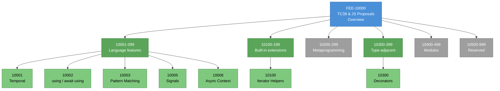
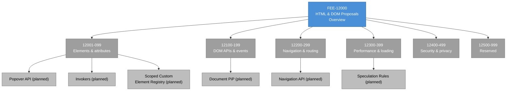
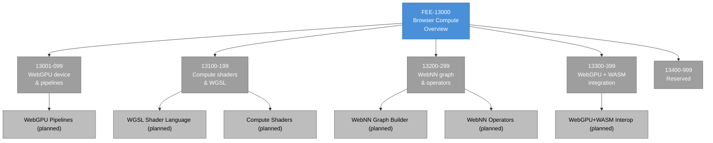
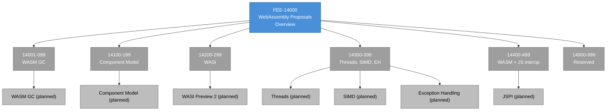

```mermaid
graph TD
    FEE11000["FEE-11000<br/>CSS Experimental<br/>Overview"]

    LAYOUT["11001-099<br/>Layout & positioning"]
    ANIM["11100-199<br/>Animation & scroll"]
    EXT["11200-299<br/>Extensibility"]
    CUSTOM["11300-399<br/>Custom properties<br/>& typed values"]
    SCOPING["11400-499<br/>Scoping"]
    RESERVED["11500-999<br/>Reserved"]

    FEE11001["11001<br/>Anchor Positioning"]
    FEE11002["11002<br/>Container Queries"]
    FEE11003["11003<br/>Subgrid"]
    FEE11100["11100<br/>Scroll-driven Animations"]
    FEE11101["11101<br/>@starting-style"]
    FEE11102["11102<br/>calc-size / interpolate-size"]
    FEE11103["11103<br/>View Transitions L1"]
    FEE11104["11104<br/>View Transitions L2"]
    FEE11200["11200<br/>@scope"]
    FEE11201["11201<br/>@property"]
    FEE11202["11202<br/>CSS Nesting"]
    FEE11203["11203<br/>@layer"]
    FEE11300["11300<br/>Carousel Primitives"]
    FEE11301["11301<br/>field-sizing"]
    FEE11302["11302<br/>Customizable select"]

    FEE11000 --> LAYOUT
    FEE11000 --> ANIM
    FEE11000 --> EXT
    FEE11000 --> CUSTOM
    FEE11000 --> SCOPING
    FEE11000 --> RESERVED

    LAYOUT --> FEE11001
    LAYOUT --> FEE11002
    LAYOUT --> FEE11003
    ANIM --> FEE11100
    ANIM --> FEE11101
    ANIM --> FEE11102
    ANIM --> FEE11103
    ANIM --> FEE11104
    EXT --> FEE11200
    EXT --> FEE11202
    EXT --> FEE11203
    CUSTOM --> FEE11201
    CUSTOM --> FEE11300
    CUSTOM --> FEE11301
    CUSTOM --> FEE11302

    style FEE11000 fill:#4A90D9,color:#fff,stroke:#2A5F9E
    style LAYOUT fill:#5BA55B,color:#fff,stroke:#3D7A3D
    style ANIM fill:#5BA55B,color:#fff,stroke:#3D7A3D
    style EXT fill:#5BA55B,color:#fff,stroke:#3D7A3D
    style CUSTOM fill:#5BA55B,color:#fff,stroke:#3D7A3D
    style SCOPING fill:#9E9E9E,color:#fff,stroke:#6A6A6A
    style RESERVED fill:#9E9E9E,color:#fff,stroke:#6A6A6A
```

# FEE Placeholder Overviews Completion Implementation Plan

> **For agentic workers:** REQUIRED SUB-SKILL: Use superpowers:subagent-driven-development (recommended) or superpowers:executing-plans to implement this plan task-by-task. Steps use checkbox (`- [ ]`) syntax for tracking.

**Goal:** Rewrite the five placeholder overview articles (FEE-10000, 11000, 12000, 13000, 14000) in the `Web Platform Proposals` range from their minimal placeholder form into full-template FEE overviews at the depth of FEE-200 and FEE-300. Both EN and zh-TW, ≥301 lines per file, `polish-documents` applied before each commit.

**Architecture:** Each task rewrites one overview pair (EN + zh-TW) and ends with a single commit. Five tasks total, executed in order 10000 → 11000 → 12000 → 13000 → 14000. After Task 1 commits, the plan pauses for a user review checkpoint to catch voice/depth drift before 80 % of the writing happens. All content authority: spec at `docs/superpowers/specs/2026-04-19-fee-placeholder-overviews-completion-design.md`.

**Tech Stack:** Markdown, VitePress, Mermaid (for `Visual` diagram blocks), `polish-documents` skill (invoked via `Skill` tool), `pnpm docs:build` for verification.

---

## File Map

**Files to rewrite (EN):**
- `docs/en/Web Platform Proposals/TC39 and JS Proposals/10000.md`
- `docs/en/Web Platform Proposals/CSS Experimental/11000.md`
- `docs/en/Web Platform Proposals/HTML and DOM Proposals/12000.md`
- `docs/en/Web Platform Proposals/Browser Compute/13000.md`
- `docs/en/Web Platform Proposals/WebAssembly Proposals/14000.md`

**Files to rewrite (zh-TW):**
- `docs/zh-tw/Web Platform Proposals/TC39 and JS Proposals/10000.md`
- `docs/zh-tw/Web Platform Proposals/CSS Experimental/11000.md`
- `docs/zh-tw/Web Platform Proposals/HTML and DOM Proposals/12000.md`
- `docs/zh-tw/Web Platform Proposals/Browser Compute/13000.md`
- `docs/zh-tw/Web Platform Proposals/WebAssembly Proposals/14000.md`

Each file is currently ~35 lines of placeholder content. Target: ≥301 lines of full-template content.

---

## Format Reference

Before writing any overview, read `docs/en/CSS and Layout Systems/200.md` as a depth/structure reference. It is an existing overview in the 0-9999 range that matches the template the five overviews must reach.

**Writing Style Rules (apply to every paragraph):**

- No contrastive-negation patterns ("not X, but Y"; "不是 X，而是 Y"). Say the positive thing directly.
- No unanchored modifiers ("very fast", "很重", "可以跑"). Every claim gets a specific measure or behavior.
- No em-dash chains of filler. Em dashes are allowed for single parenthetical asides, not as chained extensions of a sentence.
- No capability-list排比 ("可以 X 可以 Y 可以 Z"). Name each capability specifically with what it does.
- No emoji anywhere.

**Vue Template Safety Rules (apply before every commit):**

- No `{{ }}` inside backtick code spans. Use `<code v-pre>…</code>` instead.
- If `<TagName>` appears inside `<code v-pre>`, escape `<` as `&lt;` and `>` as `&gt;`.
- To embed a backtick inside a code span, use double-backtick delimiters (e.g. `` `` `code with ` backtick` `` ``). Backslash is not an escape inside code spans.

**Bilingual Header Map:**

| EN | zh-TW |
|----|-------|
| Context | 背景 |
| Scenario | 情境 |
| Best Practices | 最佳實踐 |
| Design Thinking | 設計思維 |
| Deep Dive | 深入探討 |
| Visual | 圖解 |
| Example | 範例 |
| Tracks in this range | 此範圍的軌道 |
| Graduation | 畢業機制 |
| Related FEEs | 相關 FEE |
| References | 參考資料 |

---

## Task 1: FEE-10000 — TC39 & JS Proposals Overview

**Files:**
- Modify: `docs/en/Web Platform Proposals/TC39 and JS Proposals/10000.md`
- Modify: `docs/zh-tw/Web Platform Proposals/TC39 and JS Proposals/10000.md`

### Step 1: Research pass

- [ ] **Step 1: Verify reference URLs and current-status claims**

Run WebFetch on each candidate URL. If a URL is dead or has moved, record the live replacement. If a status claim can't be pinned down, rewrite prose to the verifiable form described in the spec's References Strategy.

Candidate URLs (verify before use):
1. TC39 process document: `https://tc39.es/process-document/`
2. tc39/proposals repo index: `https://github.com/tc39/proposals`
3. MDN: JavaScript proposals tracker: `https://developer.mozilla.org/en-US/docs/Web/JavaScript/Guide/ECMAScript_Next_support_in_Mozilla` (fallback: the specific proposal listings under `https://github.com/tc39/proposals/blob/HEAD/README.md`)
4. ECMA-262 specification: `https://tc39.es/ecma262/`
5. kangax ES compat-table: `https://compat-table.github.io/compat-table/es2016plus/`
6. Interop project (sibling context): `https://wpt.fyi/interop`

Also verify, for every named proposal in the Visual leaves:
- 10001 Temporal — current stage
- 10002 Explicit Resource Management (`using` / `await using`) — current stage
- 10003 Pattern Matching — current stage
- 10005 Signals — current stage
- 10006 Async Context — current stage
- 10100 Iterator Helpers — current stage
- 10300 Decorators — current stage

Record the verified stage numbers; use structural phrasing ("at Stage 3 at time of writing") in the prose.

### Step 2: Write EN article

- [ ] **Step 2: Write `docs/en/Web Platform Proposals/TC39 and JS Proposals/10000.md`**

Replace the entire existing file contents.

**Frontmatter (exact):**
```yaml
---
id: 10000
title: TC39 & JS Proposals Overview
state: draft
overview: true
---
```

**H1:** `# [FEE-10000] TC39 & JS Proposals Overview`

**`:::info` hook (exact):**
```
:::info
The JavaScript language ships in stages. Understanding which stage a proposal is at — and which stage makes it safe to adopt in production — is the entry skill for working with modern JavaScript.
:::
```

**`:::warning Web Platform Proposals` callout (retained from the placeholder, exact):**
```
:::warning Web Platform Proposals
Articles in the 10000-19999 range cover features that are not yet stable across all major browsers or have not reached TC39 Stage 4. When a proposal ships stable, its article graduates to the appropriate 0-9999 category.
:::
```

**`## Context` — write 4 paragraphs covering:**
- TC39 is Ecma International's Technical Committee 39, the body that maintains ECMA-262 (the ECMAScript specification). Delegates from browser vendors, runtime implementers, transpiler authors, and the broader community meet every two months. Proposals are driven by **champions** — individual delegates who shepherd a feature through the five-stage pipeline.
- The **Stage 0-4 pipeline** is the central mechanism. Stage 0 is "strawperson"; Stage 1 is "proposal" (the committee accepts the problem statement); Stage 2 is "draft" (there is spec text, but changes are still expected); Stage 3 is "candidate" (the spec is complete, polyfills and implementations are expected, feedback from implementers is still incorporated); Stage 4 is "finished" — the feature is merged into the next yearly ECMA-262 edition.
- The practical reality is that **engine shipping is not locked to stage progression**. V8, SpiderMonkey, and JavaScriptCore ship Stage 3 proposals behind flags, and occasionally ship Stage 4 proposals unflagged only after a multi-engine shipping agreement. A Stage 4 proposal that shipped in Chrome may still be absent in Safari for another year. The usable bar for production adoption is Stage 4 **plus** cross-engine shipping.
- The yearly-release cadence was itself a committee decision. After the **ES4 collapse** in 2008 — a multi-year proposal to add classes, types, and packages that fell apart under vendor disagreement — TC39 committed to smaller, incremental releases. ES2015 shipped the first of these. Since then, every June, Ecma publishes a new edition (ES2016, ES2017, and so on) containing the Stage 4 proposals finalized during that year. The small-steps model is the reason the corpus of post-ES2015 features exists at all.

**`## Scenario` — write 2 paragraphs covering:**
- A team is considering replacing every `new Date()` in a production codebase with the Temporal API. Temporal is at Stage 3 at time of writing; the `@js-temporal/polyfill` package is actively maintained; Firefox ships it behind a preference; Chrome has it behind a runtime flag; Safari has an implementation in progress. The team wants to adopt Temporal now, not in two years.
- The choice collapses to three paths: ship the polyfill unconditionally (~50 KB of polyfill code, works everywhere); feature-detect and fall back to `Date` (two code paths to maintain); wait for cross-engine shipping. Each path has a specific cost, and the right answer depends on bundle-size tolerance, maintenance appetite, and timeline. This article maps the shape of that decision for every TC39 proposal, not only Temporal.

**`## Design Thinking` — write two ### subsections:**

- `### Why proposals exist as a process at all`
  - The post-ES4 era lessons: a large, vendor-negotiated, all-at-once spec is a failure mode. Features stall when any one vendor objects.
  - The "don't break the web" constraint: JavaScript is the only runtime that cannot afford a 2.x major version with breaking changes. Every feature must be backwards-compatible, which forces incremental shipping and careful naming to avoid collisions.
  - The champion model gives each proposal a dedicated advocate who is responsible for reaching cross-vendor agreement. Stages are checkpoints where the committee confirms progress, not where the champion hands off control.

- `### How the ecosystem bridges the gap`
  - **Syntax proposals** (like `using` / `await using`, pattern matching, decorators) require transpilation. Babel and SWC ship transforms that accept the new syntax and emit ES2015-compatible output. For these, Stage 3 is the practical adoption floor because the syntax is unlikely to change.
  - **Runtime proposals** (like Temporal, Iterator Helpers, Signals) ship as polyfills. A polyfill adds a few dozen kilobytes to the bundle and makes the new API available on runtimes that haven't shipped it natively. Canonical example: `@js-temporal/polyfill`.
  - **Feature detection** for runtime proposals uses `typeof` guards: `if (typeof Temporal !== 'undefined') { … }`. Transpilers do not help here — the detection must be at runtime.
  - **Status sources:** kangax's compat-table is the community-maintained reference for what each engine supports; the tc39/proposals repo tracks proposal stage; MDN tracks browser-shipping status per API.

**`## Visual` — include the following Mermaid block verbatim, then one paragraph of prose underneath summarizing the shape of the diagram:**

````markdown

````

Prose underneath: one paragraph (~4 sentences) explaining the color legend (blue parent, green drafted ranges, gray reserved ranges, pale green drafted articles), and pointing the reader to the entry article for each drafted proposal.

**`## Tracks in this range` — use the following table (unchanged from the placeholder, preserved verbatim):**

| Range | Topic |
|-------|-------|
| 10001-10099 | Language features (syntax, operators, declarations) |
| 10100-10199 | Built-in object extensions (Array, Set, Iterator, Promise) |
| 10200-10299 | Metaprogramming & reflection |
| 10300-10399 | Type-adjacent proposals (decorators, type annotations) |
| 10400-10499 | Module system proposals |
| 10500-10999 | Reserved |

**`## Graduation` — write 2 paragraphs covering:**
- Stage 4 alone is not the bar for graduation to 0-9999 — the feature must also be shipping unflagged in all three major engines (V8, SpiderMonkey, JavaScriptCore) for the article to move to `JavaScript Core & Runtime` (300-399). A Stage 4 proposal that is still behind a flag in Safari remains in 10000s.
- When graduation happens, the corresponding 10000s article is rewritten as a lightweight redirect pointing to the new article under 300-399. This preserves inbound links and the git history.

**`## Related FEEs` — write as a table matching FEE-200's format:**

| FEE | Relationship |
|-----|-------------|
| [FEE-300 JavaScript Core & Runtime](../../JavaScript%20Core%20and%20Runtime/300.md) | The destination category for graduated proposals. Readers who want the mature, cross-engine features go here; readers who want to track emerging features stay here. |
| [FEE-301 Event Loop & Async Model](../../JavaScript%20Core%20and%20Runtime/301.md) | Some proposals (Async Context, Explicit Resource Management) specifically modify the async model; understanding 301 is prerequisite to evaluating them. |
| [FEE-11000 CSS Experimental Overview](../CSS%20Experimental/11000.md) | Sibling track: proposals for the web platform's styling language, same 10000-19999 shipping conventions. |

**`## References` — write as a bulleted list of 5+ URLs, each with a short annotation:**
- TC39 Process Document — the authoritative source on what each stage means
- tc39/proposals GitHub repo — current stage of every active proposal
- ECMA-262 Specification — the completed language specification; Stage 4 proposals land here
- MDN JavaScript reference — per-feature shipping status across engines
- Web Platform Tests Interop project — cross-engine test compatibility data

Each URL must have been verified in Step 1.

### Step 3: Verify EN file

- [ ] **Step 3: Verify EN line count and Vue template safety**

Run:
```bash
wc -l "docs/en/Web Platform Proposals/TC39 and JS Proposals/10000.md"
```
Expected: ≥301 lines.

Run:
```bash
grep -n '{{' "docs/en/Web Platform Proposals/TC39 and JS Proposals/10000.md"
```
Expected: no matches, OR only matches inside `<code v-pre>` blocks. Any `{{ }}` inside a backtick code span is a blocking bug.

Run:
```bash
grep -nE '`<[A-Z][a-zA-Z]+' "docs/en/Web Platform Proposals/TC39 and JS Proposals/10000.md"
```
Expected: no matches. Any raw `<Tag>` inside a backtick code span must be either moved to `<code v-pre>&lt;Tag&gt;</code>` or the whole code span rewritten.

If any of the above find issues, fix inline and re-run until clean.

### Step 4: Write zh-TW article

- [ ] **Step 4: Write `docs/zh-tw/Web Platform Proposals/TC39 and JS Proposals/10000.md`**

Replace the entire existing file contents. Adapt the EN article into Traditional Chinese prose written for a native reader. Do not paste machine translation — write at equivalent depth.

**Frontmatter (exact):**
```yaml
---
id: 10000
title: TC39 & JS 提案概覽
state: draft
overview: true
---
```

**H1:** `# [FEE-10000] TC39 & JS 提案概覽`

**Section headers in order:** `:::info` hook → `:::warning Web Platform Proposals` callout → `## 背景` → `## 情境` → `## 設計思維` → `## 圖解` → `## 此範圍的軌道` → `## 畢業機制` → `## 相關 FEE` → `## 參考資料`

**Callout body for `:::warning Web Platform Proposals`** (preserve from the placeholder, exact):
```
:::warning Web Platform Proposals
10000-19999 範圍內的文章涵蓋尚未在所有主要瀏覽器中穩定，或尚未達到 TC39 Stage 4 的功能。當提案正式穩定後，文章將移至對應的 0-9999 分類。
:::
```

**設計思維 subsections:** `### 為什麼需要提案流程` and `### 生態系如何彌補時間差`.

**圖解 Mermaid block:** copy the exact Mermaid block from the EN file — do NOT translate the node labels; keep them in English for visual consistency with the EN file and all other overview diagrams in the site.

**此範圍的軌道 table** (preserved from placeholder, exact):

| 範圍 | 主題 |
|------|------|
| 10001-10099 | 語言功能（語法、運算子、宣告） |
| 10100-10199 | 內建物件擴充（Array、Set、Iterator、Promise） |
| 10200-10299 | 元程式設計與反射 |
| 10300-10399 | 類型相關提案（裝飾器、型別標註） |
| 10400-10499 | 模組系統提案 |
| 10500-10999 | 保留 |

**Cross-reference links in 相關 FEE:** use the same relative paths as the EN file. FEE names stay in English (matches project convention for cross-references).

### Step 5: Verify zh-TW file

- [ ] **Step 5: Verify zh-TW line count and Vue template safety**

Run the same three checks as Step 3, against the zh-TW file path.

### Step 6: Polish EN file

- [ ] **Step 6: Invoke `polish-documents` skill on the EN file**

Invoke via the `Skill` tool:
```
Skill("polish-documents", "docs/en/Web Platform Proposals/TC39 and JS Proposals/10000.md")
```

Apply every finding the skill reports. Re-run the Step 3 verifications if line count might have changed.

### Step 7: Polish zh-TW file

- [ ] **Step 7: Invoke `polish-documents` skill on the zh-TW file**

```
Skill("polish-documents", "docs/zh-tw/Web Platform Proposals/TC39 and JS Proposals/10000.md")
```

Apply findings. Re-run Step 5 verifications.

### Step 8: Build verify

- [ ] **Step 8: Run `pnpm docs:build` and confirm success**

Run:
```bash
pnpm docs:build
```
Expected: build completes without errors. If there are Vue template or Mermaid parse errors, fix them and re-run until clean.

### Step 9: Commit

- [ ] **Step 9: Commit both files in a single commit**

```bash
git add "docs/en/Web Platform Proposals/TC39 and JS Proposals/10000.md" \
        "docs/zh-tw/Web Platform Proposals/TC39 and JS Proposals/10000.md"
git commit -m "$(cat <<'EOF'
docs(fee): complete FEE-10000 TC39 & JS Proposals Overview

Replace placeholder with full-template overview (EN + zh-TW). Covers
the TC39 stage pipeline, the post-ES4 process lessons, and how Babel
and polyfills bridge the gap between Stage 3 proposals and production.
EOF
)"
```

### Step 10: Review checkpoint

- [ ] **Step 10: Pause for user review before Task 2**

Post a message to the user:

> FEE-10000 shipped (commit `<hash>`). Please review the EN and zh-TW files and confirm the voice, depth, and Mermaid rendering before I proceed to FEE-11000. Let me know if anything needs changes — or say "continue" to move on.

Wait for explicit confirmation before starting Task 2. If the user requests changes, apply them as amendments to the same commit (`git commit --amend`) or as a follow-up commit, per their preference.

---

## Task 2: FEE-11000 — CSS Experimental Overview

**Files:**
- Modify: `docs/en/Web Platform Proposals/CSS Experimental/11000.md`
- Modify: `docs/zh-tw/Web Platform Proposals/CSS Experimental/11000.md`

### Step 1: Research pass

- [ ] **Step 1: Verify reference URLs and current-status claims**

Candidate URLs (verify):
1. W3C CSS Working Group charter: `https://www.w3.org/groups/wg/css/charter/`
2. CSSWG drafts repo: `https://github.com/w3c/csswg-drafts`
3. W3C Process — maturity levels: `https://www.w3.org/2023/Process-20231103/#maturity-levels`
4. Interop 2025 project: `https://wpt.fyi/interop-2025`
5. caniuse.com (general CSS): `https://caniuse.com/?cats=CSS`
6. MDN CSS landing: `https://developer.mozilla.org/en-US/docs/Web/CSS`
7. W3C CSS Snapshot 2023: `https://www.w3.org/TR/css-2023/`

Verify, for every named article in the Visual leaves, that its spec exists and the feature is still tracked in CSSWG:
- 11001 Anchor Positioning, 11002 Container Queries, 11003 Subgrid
- 11100 Scroll-driven Animations, 11101 `@starting-style`, 11102 `calc-size()` / `interpolate-size`, 11103 View Transitions L1, 11104 View Transitions L2
- 11200 `@scope`, 11201 `@property`, 11202 CSS Nesting, 11203 `@layer`
- 11300 Carousel Primitives, 11301 `field-sizing`, 11302 Customizable `<select>`

### Step 2: Write EN article

- [ ] **Step 2: Write `docs/en/Web Platform Proposals/CSS Experimental/11000.md`**

**Frontmatter:**
```yaml
---
id: 11000
title: CSS Experimental Overview
state: draft
overview: true
---
```

**H1:** `# [FEE-11000] CSS Experimental Overview`

**`:::info` hook:**
```
:::info
CSS ships per module, not per specification. One module can be production-ready while its sister module is still a working draft — knowing which is which is the working skill for modern CSS.
:::
```

**`:::warning Web Platform Proposals` callout:** preserve from placeholder verbatim.

**`## Context` — write 4 paragraphs covering:**
- The W3C CSS Working Group is the W3C working group responsible for CSS. Its membership is W3C member organizations plus invited experts; the group meets in person roughly yearly and weekly on teleconferences. Decisions are made in public, in GitHub issues and in group minutes.
- The **module-per-feature model** is the load-bearing structural decision. Since the retirement of the monolithic CSS3 specification in 2011, each feature area is its own module with its own level number. Anchor Positioning Level 1, Grid Level 2, Cascade Layers Level 1, Nesting Level 1 — each is its own spec, its own editor, its own shipping timeline. This is why there is no "CSS4": the monolithic version was replaced by many modules advancing independently.
- The **W3C maturity ladder** for each module is FPWD (First Public Working Draft) → WD → CR (Candidate Recommendation) → PR (Proposed Recommendation) → REC (Recommendation). The useful bar is CR — at CR the spec is considered complete, browser implementations are expected, and the document is open for an implementation-feedback loop. PR and REC are formal but, in practice, no one waits for them.
- The **Interop project** (2022 onward) is a yearly cross-vendor commitment to ship a named list of features uniformly across Chromium, Firefox, and WebKit. Features selected for Interop get priority and their shipping delta closes within the calendar year. Features outside Interop may sit for years behind one engine's flag while the other engines debate implementation details.

**`## Scenario` — 2 paragraphs:**
- A product team gets design mocks that use anchor-positioned tooltips: each button has a flyout that's anchored to its edge via the CSS `anchor-name` / `position-anchor` properties. The feature is shipping unflagged in Chromium at time of writing; Safari and Firefox are working on it but have not shipped. The team can ship now and accept the feature being broken in Safari/Firefox; ship with a JavaScript fallback that positions the tooltip manually; gate the feature behind `@supports(anchor-name: --x)` so only Chromium users see it; or wait for cross-engine shipping.
- Every choice has a user-visible cost (no fallback means some users see broken UI), a maintenance cost (the JS fallback duplicates layout logic), or an opportunity cost (waiting loses the UX win). This overview maps the shape of that tradeoff for every feature in the CSS Experimental range.

**`## Design Thinking` — two subsections:**

- `### Why modules replaced the monolithic spec`
  - The 2011 CSS 2.1 freeze: the CSSWG spent 2004-2011 stabilizing CSS 2.1 — errata, implementation corrections, no new features. This taught the group that monolithic specs stall because every editorial decision has to wait on every feature.
  - The post-2011 decision: each new feature gets its own module. Anchor Positioning can ship while Subgrid is still drafting, without either one blocking the other. The downside is that "CSS version X" has no meaning; the W3C publishes a yearly CSS Snapshot document that collects the currently-recommended modules as the closest equivalent to a version.

- `### How userland bridges the gap`
  - **PostCSS plugins** act as polyfills for syntactic features: `postcss-nesting` rewrites nested CSS to flat CSS for older browsers, `postcss-preset-env` packages a configurable bundle of transforms.
  - **Runtime JavaScript polyfills** exist for some layout behaviors but are rare: layout features that rely on the rendering engine's box tree are hard to polyfill outside the engine. Container queries had a runtime polyfill during its CR period; anchor positioning has a partial one.
  - **Progressive enhancement via `@supports`** is the primary CSS-only mechanism. Wrap the experimental property in `@supports(property: value) { … }`; the block is applied only by engines that have shipped the property.
  - **Runtime feature detection** uses `CSS.supports('property: value')` in JavaScript — useful when a component's behavior must adapt beyond what an `@supports` block can express.

**`## Visual` — Mermaid block:**

````markdown

````

(Omit individual-article style directives — there are too many. The range-level coloring is sufficient.)

Prose underneath: 3-4 sentences on the balance of drafted ranges and the `@scope` clarification — note that `@scope` was drafted under `Extensibility (11200-11299)` rather than `Scoping (11400-11499)` for historical reasons; future scoping proposals will go in 11400s.

**`## Tracks in this range` — table preserved from placeholder, exact.**

**`## Graduation` — 2 paragraphs:**
- CR + Interop project support is the practical bar. Once a module reaches CR and shows up in an Interop year's final scorecard at ≥95% pass rate across the three engines, the article is ready to graduate to `CSS & Layout Systems` (200-299).
- The CSSWG does not force graduation from PR to REC — many widely-shipped modules are still at CR officially. The FEE uses shipping reality, not formal REC status, as the graduation gate.

**`## Related FEEs` — table:**

| FEE | Relationship |
|-----|-------------|
| [FEE-200 CSS & Layout Systems](../../CSS%20and%20Layout%20Systems/200.md) | Destination category for graduated CSS features. |
| [FEE-201 Cascade, Specificity & Inheritance](../../CSS%20and%20Layout%20Systems/201.md) | Scoping proposals (`@scope`, `@layer`) are extensions of the cascade; understanding 201 is prerequisite. |
| [FEE-205 CSS Architecture & Scoping Strategies](../../CSS%20and%20Layout%20Systems/205.md) | Architecture context for why scoping proposals matter. |
| [FEE-10000 TC39 & JS Proposals](../TC39%20and%20JS%20Proposals/10000.md) | Sibling track: same 10000-19999 range conventions, different standards body. |

**`## References` — 5+ URLs with annotations:**
- W3C CSSWG GitHub — the drafts repo where every module lives
- W3C CSS Snapshot (current year) — the closest thing to a CSS version reference
- Interop project current year — which features are committed for cross-engine shipping this year
- caniuse.com CSS — per-feature shipping matrix
- MDN CSS reference — per-property documentation and browser support tables

### Step 3: Verify EN file

- [ ] **Step 3: Verify EN line count and Vue template safety**

Run the same three checks from Task 1 Step 3 against the EN 11000 path.

### Step 4: Write zh-TW article

- [ ] **Step 4: Write `docs/zh-tw/Web Platform Proposals/CSS Experimental/11000.md`**

**Frontmatter:**
```yaml
---
id: 11000
title: CSS 實驗功能概覽
state: draft
overview: true
---
```

Preserve the existing zh-TW `:::warning` block verbatim. Translate each EN section using the header map. Keep Mermaid labels in English. Keep FEE cross-reference link text in English (project convention).

### Step 5: Verify zh-TW file

- [ ] **Step 5: Verify zh-TW line count and Vue template safety**

Same three checks against zh-TW 11000 path.

### Step 6: Polish EN file

- [ ] **Step 6: Invoke `polish-documents` on the EN file**

```
Skill("polish-documents", "docs/en/Web Platform Proposals/CSS Experimental/11000.md")
```

### Step 7: Polish zh-TW file

- [ ] **Step 7: Invoke `polish-documents` on the zh-TW file**

```
Skill("polish-documents", "docs/zh-tw/Web Platform Proposals/CSS Experimental/11000.md")
```

### Step 8: Build verify

- [ ] **Step 8: Run `pnpm docs:build` and confirm success**

### Step 9: Commit

- [ ] **Step 9: Commit both files in a single commit**

```bash
git add "docs/en/Web Platform Proposals/CSS Experimental/11000.md" \
        "docs/zh-tw/Web Platform Proposals/CSS Experimental/11000.md"
git commit -m "$(cat <<'EOF'
docs(fee): complete FEE-11000 CSS Experimental Overview

Replace placeholder with full-template overview (EN + zh-TW). Covers
the CSS module-per-feature model, the CR + Interop project graduation
bar, and the PostCSS + @supports userland bridges.
EOF
)"
```

---

## Task 3: FEE-12000 — HTML & DOM Proposals Overview

**Files:**
- Modify: `docs/en/Web Platform Proposals/HTML and DOM Proposals/12000.md`
- Modify: `docs/zh-tw/Web Platform Proposals/HTML and DOM Proposals/12000.md`

### Step 1: Research pass

- [ ] **Step 1: Verify reference URLs**

Candidate URLs:
1. WHATWG HTML Living Standard: `https://html.spec.whatwg.org/`
2. WHATWG working mode document: `https://whatwg.org/working-mode`
3. Chrome Origin Trials: `https://developer.chrome.com/docs/web-platform/origin-trials`
4. MDN HTML landing: `https://developer.mozilla.org/en-US/docs/Web/HTML`
5. Interop project current year: `https://wpt.fyi/interop`
6. WHATWG HTML Living Standard FAQ: `https://html.spec.whatwg.org/multipage/faqs.html`
7. WICG (Web Incubator Community Group): `https://wicg.io/`

Verify readiness claims for features called out in prose: Popover API, `commandfor` / `command` (Invokers), Navigation API, Speculation Rules, Document Picture-in-Picture, scoped custom element registry.

### Step 2: Write EN article

- [ ] **Step 2: Write `docs/en/Web Platform Proposals/HTML and DOM Proposals/12000.md`**

**Frontmatter:**
```yaml
---
id: 12000
title: HTML & DOM Proposals Overview
state: draft
overview: true
---
```

**H1:** `# [FEE-12000] HTML & DOM Proposals Overview`

**`:::info` hook:**
```
:::info
HTML has no version number. Features ship one by one into a Living Standard, which means every feature's readiness is its own calculation.
:::
```

**`:::warning Web Platform Proposals` callout:** preserve from placeholder.

**`## Context` — 4 paragraphs covering:**
- WHATWG stewardship: the Web Hypertext Application Technology Working Group owns HTML and the DOM specifications. Its membership is the four major browser engines (Google, Apple, Mozilla, Microsoft). The 2019 W3C/WHATWG memorandum of understanding settled a decade of parallel specifications by making WHATWG the single source of truth for HTML, DOM, Fetch, Streams, URL, and related specs.
- The **Living Standard model**: there is no HTML5, HTML5.1, or HTML6. The specification is continuously updated — a commit to the `whatwg/html` repo can land at any time, and the published HTML spec always reflects the current state of the standard. Features are added incrementally without any version ceremony.
- **Origin Trials** are Chrome's mechanism for shipping features to production before cross-engine agreement. A site operator registers for a feature and receives a token that enables the feature for that origin, in production traffic, for a time-limited trial window. Trials surface real-world adoption data and scaling issues that inform the standardization process.
- The **three-engine convention** is informal but load-bearing: an HTML feature is considered "standard" — and safe for production documentation — once it is shipping unflagged in Chromium, Firefox, and WebKit. Features that ship in one engine and are implemented but unshipped in another sit in an ambiguous middle zone.

**`## Scenario` — 2 paragraphs:**
- A team reviews the HTML feature inventory for a new product. The Popover API (`popover` attribute, `showPopover()`, `:popover-open`) ships unflagged in every major engine — they can use it directly. The scoped custom element registry proposal is a draft specification with one implementation; it would help their architecture but is not yet shippable. Both features are part of the HTML Living Standard; a reader looking at a single "HTML" category without per-feature readiness data would see them as equivalent.
- This overview is the mapping layer. Each sub-article under 12000 covers one proposal, its current status, its Origin Trial history if any, and the userland bridges available before all three engines ship.

**`## Design Thinking` — two subsections:**

- `### Why HTML abandoned versioning`
  - XHTML 2 collapse (2009): W3C's ambitious successor to HTML 4 tried to break from HTML's parsing model to enforce strict XML syntax. Browser vendors refused to implement it. The WHATWG, formed in 2004 by Apple, Mozilla, and Opera, continued work on what became HTML5.
  - The decision to abandon version numbers formalized what was already true: HTML is not a product that ships discrete releases; it is the evolving contract between browser engines and content authors. Version numbers suggested a false sense of compatibility boundary. Removing them let browsers ship features continuously.
  - The trade-off: readers cannot say "this site targets HTML X" the way they could in 2008. The new contract is "this site requires these specific features," and feature detection replaces version detection.

- `### How the ecosystem bridges the gap`
  - **JavaScript polyfills** for HTML features: Popover had a polyfill during its development period; the Dialog element had polyfills before Safari shipped it in 2022.
  - **Feature detection**: for DOM APIs, `'methodName' in Element.prototype` or `typeof new Element().method === 'function'`. For HTML-level behaviors, test a specific property presence.
  - **Origin Trials** let large sites gather production feedback during the Stage 3-equivalent period. A trial token is a commitment — if the API changes before graduation, the site must adapt.
  - **WICG (Web Incubator Community Group)** hosts early-stage HTML/DOM proposals before they reach WHATWG. Many current HTML features started as WICG proposals (Popover, Scheduling APIs).

**`## Visual` — Mermaid block (all leaves in gray because no articles are drafted yet):**

````markdown

````

Prose underneath: 3-4 sentences noting that no sub-articles are drafted yet, what the planned coverage is, and a pointer to the follow-up spec slug `fee-html-dom-proposals-articles-design.md`.

**`## Tracks in this range` — preserve table from placeholder, exact.**

**`## Graduation` — 2 paragraphs:**
- Graduation from 12000s to 100-199 (HTML & Semantic Markup) or 400-499 (Browser APIs) happens when a feature ships unflagged in all three engines AND has Interop support for the shipping year OR has measurable production adoption. The FEE uses a pragmatic rather than a formal gate because the Living Standard itself has no formal gate.
- Element proposals (Popover, Invokers) typically graduate to HTML & Semantic Markup (100-199). API proposals (Navigation API, Document PiP) graduate to Browser APIs & Web Platform (400-499). The graduation target is annotated in each sub-article.

**`## Related FEEs` — table:**

| FEE | Relationship |
|-----|-------------|
| [FEE-100 HTML & Semantic Markup](../../HTML%20and%20Semantic%20Markup/100.md) | Graduation destination for element proposals. |
| [FEE-400 Browser APIs & Web Platform](../../Browser%20APIs%20and%20Web%20Platform/400.md) | Graduation destination for DOM/API proposals. |
| [FEE-10000 TC39 & JS Proposals](../TC39%20and%20JS%20Proposals/10000.md) | Sibling track for the JavaScript language, different body and process. |
| [FEE-11000 CSS Experimental](../CSS%20Experimental/11000.md) | Sibling track for CSS, different body and different shipping calculus. |

**`## References` — 5+ URLs:**
- WHATWG HTML Living Standard — the spec itself
- WHATWG working mode — how WHATWG actually operates
- Chrome Origin Trials — the early-production feedback mechanism
- Interop project — cross-engine shipping coordination
- WICG — where many HTML/DOM proposals begin their life

### Step 3: Verify EN file

- [ ] **Step 3: Verify EN line count and Vue template safety**

### Step 4: Write zh-TW article

- [ ] **Step 4: Write `docs/zh-tw/Web Platform Proposals/HTML and DOM Proposals/12000.md`**

**Frontmatter title:** `HTML & DOM 提案概覽`. Preserve the zh-TW `:::warning` block. Adapt every section per the header map.

### Step 5: Verify zh-TW file

- [ ] **Step 5: Verify zh-TW line count and Vue template safety**

### Step 6: Polish EN file

- [ ] **Step 6: Invoke `polish-documents` on the EN file**

```
Skill("polish-documents", "docs/en/Web Platform Proposals/HTML and DOM Proposals/12000.md")
```

### Step 7: Polish zh-TW file

- [ ] **Step 7: Invoke `polish-documents` on the zh-TW file**

```
Skill("polish-documents", "docs/zh-tw/Web Platform Proposals/HTML and DOM Proposals/12000.md")
```

### Step 8: Build verify

- [ ] **Step 8: Run `pnpm docs:build`**

### Step 9: Commit

- [ ] **Step 9: Commit**

```bash
git add "docs/en/Web Platform Proposals/HTML and DOM Proposals/12000.md" \
        "docs/zh-tw/Web Platform Proposals/HTML and DOM Proposals/12000.md"
git commit -m "$(cat <<'EOF'
docs(fee): complete FEE-12000 HTML & DOM Proposals Overview

Replace placeholder with full-template overview (EN + zh-TW). Covers
the WHATWG Living Standard model, the informal three-engine shipping
convention, and how Origin Trials and polyfills bridge the gap.
EOF
)"
```

---

## Task 4: FEE-13000 — Browser Compute Overview

**Files:**
- Modify: `docs/en/Web Platform Proposals/Browser Compute/13000.md`
- Modify: `docs/zh-tw/Web Platform Proposals/Browser Compute/13000.md`

### Step 1: Research pass

- [ ] **Step 1: Verify reference URLs and shipping-status claims**

Candidate URLs:
1. W3C GPU for the Web CG: `https://www.w3.org/community/gpu/`
2. WebGPU specification: `https://www.w3.org/TR/webgpu/`
3. WGSL specification: `https://www.w3.org/TR/WGSL/`
4. W3C WebNN specification: `https://www.w3.org/TR/webnn/`
5. MDN WebGPU landing: `https://developer.mozilla.org/en-US/docs/Web/API/WebGPU_API`
6. Chrome WebGPU implementation status: `https://developer.chrome.com/blog/webgpu-io2023`
7. Mozilla WebGPU on Windows announcement: `https://hacks.mozilla.org/2025/07/`

**Critical: verify shipping status for every specific claim made in prose.** WebGPU shipping matrix moves fast. If a specific version/date can't be verified, rewrite to structural language ("shipped in Chromium", "shipped in Safari", etc.) without version numbers.

### Step 2: Write EN article

- [ ] **Step 2: Write `docs/en/Web Platform Proposals/Browser Compute/13000.md`**

**Frontmatter:**
```yaml
---
id: 13000
title: Browser Compute Overview
state: draft
overview: true
---
```

**H1:** `# [FEE-13000] Browser Compute Overview`

**`:::info` hook:**
```
:::info
The browser has spent thirty years as a document-and-UI runtime. WebGPU and WebNN are the specifications that add a compute runtime alongside it, and they are the API surface every browser-based GPU or ML workload now builds on.
:::
```

**`:::warning Web Platform Proposals` callout:** preserve.

**`## Context` — 4 paragraphs:**
- Two W3C Community/Working groups share this category. The **GPU for the Web Community Group** authors the WebGPU specification; its members are browser-engine teams, GPU IHVs (NVIDIA, AMD, Intel), and mobile vendors (Apple, Google). The **Web Machine Learning Working Group** authors the WebNN (Web Neural Network) specification, with a more ML-focused membership including Intel, Microsoft, and academic labs.
- **Hardware heterogeneity** is the central design problem. The browser runs on Windows (DirectX 12), macOS and iOS (Metal), Linux (Vulkan), and Android (Vulkan). A single shader program must execute correctly on all of these. WebGPU's solution is to specify an abstract device/pipeline model that each browser implements atop the native API, and **WGSL** as the cross-platform shader language that every engine translates to its backend.
- **WebGPU shipping reality** is split across engines and platforms at time of writing. Chromium shipped WebGPU unflagged on Windows/macOS/Linux in April 2023. Apple shipped WebGPU in Safari 26 in September 2025. Firefox shipped WebGPU on Windows in version 141 in July 2025; non-Windows platforms remain behind the `dom.webgpu.enabled` preference. Check the current shipping matrix before making specific claims in prose.
- **WebNN readiness** is earlier in the pipeline. The specification is at Candidate Recommendation. Chromium ships an implementation behind the `WebMachineLearningNeuralNetwork` flag. Firefox and Safari have not shipped implementations. Production adoption today routes through WebGPU or WASM runtimes rather than WebNN directly.

**`## Scenario` — 2 paragraphs:**
- A team prototypes in-browser large-language-model inference using transformers.js. The library detects available backends and selects WebGPU when present, falling back to WASM-SIMD when not. The prototype runs at interactive speed in Chrome on Apple silicon. In Firefox on the same machine, WebGPU is unavailable (Firefox has not shipped WebGPU on macOS), so the library falls back to WASM — which runs the same model at roughly one-tenth the throughput.
- The team cannot promise the same experience across browsers. The decision is whether to ship the WebGPU path with a measurably slower WASM fallback for other engines, or to ship only the WASM path uniformly. This overview maps the shape of that decision for any WebGPU or WebNN workload.

**`## Design Thinking` — two subsections:**

- `### Why compute is its own category`
  - Before WebGPU, browsers exposed graphics primitives (2D canvas, WebGL) but not general compute primitives. WebGL is a graphics API; using it for compute means encoding compute workloads into vertex and fragment shaders, which the engine then executes on the GPU in a graphics pipeline. This works but is awkward and inefficient.
  - WebGPU is a first-class compute API: it has a dedicated compute pipeline distinct from the render pipeline, and WGSL supports compute shaders as a native concept. The graphics capability comes along for free.
  - **The split between graphics (WebGPU) and ML (WebNN) mirrors native-SDK splits.** Apple ships Metal (graphics) and MPS (ML-focused kernels atop Metal); Nvidia ships CUDA (general compute) and cuDNN (ML kernels). Browsers adopted the same split: WebGPU is the low-level compute API, WebNN is the high-level graph-builder API that targets the platform ML accelerator.

- `### How userland bridges the gap`
  - **A WebGPU polyfill over WebGL is impractical.** WebGPU's device/pipeline model is fundamentally different from WebGL's state-machine model; a translation layer that preserves performance characteristics does not exist. Libraries that work cross-engine maintain separate WebGPU and WebGL implementations.
  - **ONNX Runtime Web** runtime-detects WebGPU and selects a backend per inference operator. When WebGPU is unavailable, it falls back to WASM-SIMD. The fallback is slower but functional on every engine.
  - **transformers.js** and similar libraries adopt the same pattern: WebGPU when present, WASM otherwise, with the library selecting at load time and reporting the selected backend for observability.
  - **For WebNN specifically, userland polyfills do not exist.** WebNN is meant to be the polyfill layer itself — a stable API over whatever ML accelerator the OS exposes. Until it ships cross-engine, teams route through WebGPU or WASM directly.

**`## Visual` — Mermaid block (gray leaves):**

````markdown

````

Prose underneath: 3-4 sentences on the planned coverage and a pointer to the follow-up spec slug.

**`## Tracks in this range` — preserve table.**

**`## Graduation` — 2 paragraphs:**
- WebGPU graduates to `Browser APIs & Web Platform` (400-499) when it ships unflagged across Chromium, Firefox, and Safari on all supported platforms (specifically: Firefox on macOS and Linux is the current outstanding item). Until then, WebGPU articles remain in 13000s with the current shipping matrix called out per article.
- WebNN will graduate when it reaches cross-engine shipping, which is likely several years away given current implementation status. Until then, the category holds.

**`## Related FEEs`:**

| FEE | Relationship |
|-----|-------------|
| [FEE-400 Browser APIs & Web Platform](../../Browser%20APIs%20and%20Web%20Platform/400.md) | Graduation destination. |
| [FEE-408 WebGL & WebGPU](../../Browser%20APIs%20and%20Web%20Platform/408.md) | The graphics-API neighbor; readers evaluating WebGPU for graphics should also read 408. |
| [FEE-14000 WebAssembly Proposals](../WebAssembly%20Proposals/14000.md) | Sibling track — WASM is the fallback compute runtime for workloads that can't use WebGPU. |

**`## References` — 5+ URLs:**
- W3C GPU for the Web Community Group — WebGPU authoring venue
- WebGPU specification — the spec itself
- WGSL specification — the shader language
- W3C WebNN specification
- MDN WebGPU API reference

### Step 3: Verify EN file

- [ ] **Step 3: Verify EN line count and Vue template safety**

### Step 4: Write zh-TW article

- [ ] **Step 4: Write `docs/zh-tw/Web Platform Proposals/Browser Compute/13000.md`**

**Frontmatter title:** `瀏覽器運算概覽`. Preserve the zh-TW `:::warning` block. Adapt every section.

### Step 5: Verify zh-TW file

- [ ] **Step 5: Verify zh-TW line count and Vue template safety**

### Step 6: Polish EN file

- [ ] **Step 6: Invoke `polish-documents` on the EN file**

```
Skill("polish-documents", "docs/en/Web Platform Proposals/Browser Compute/13000.md")
```

### Step 7: Polish zh-TW file

- [ ] **Step 7: Invoke `polish-documents` on the zh-TW file**

```
Skill("polish-documents", "docs/zh-tw/Web Platform Proposals/Browser Compute/13000.md")
```

### Step 8: Build verify

- [ ] **Step 8: Run `pnpm docs:build`**

### Step 9: Commit

- [ ] **Step 9: Commit**

```bash
git add "docs/en/Web Platform Proposals/Browser Compute/13000.md" \
        "docs/zh-tw/Web Platform Proposals/Browser Compute/13000.md"
git commit -m "$(cat <<'EOF'
docs(fee): complete FEE-13000 Browser Compute Overview

Replace placeholder with full-template overview (EN + zh-TW). Covers
the WebGPU and WebNN standards bodies, hardware heterogeneity as the
core design problem, and the per-engine shipping matrix as the
adoption gate.
EOF
)"
```

---

## Task 5: FEE-14000 — WebAssembly Proposals Overview

**Files:**
- Modify: `docs/en/Web Platform Proposals/WebAssembly Proposals/14000.md`
- Modify: `docs/zh-tw/Web Platform Proposals/WebAssembly Proposals/14000.md`

### Step 1: Research pass

- [ ] **Step 1: Verify reference URLs and current status**

Candidate URLs:
1. WebAssembly CG process document: `https://github.com/WebAssembly/meetings/blob/main/process/phases.md`
2. WebAssembly/proposals repo: `https://github.com/WebAssembly/proposals`
3. `wasm-feature-detect` on npm: `https://www.npmjs.com/package/wasm-feature-detect`
4. BytecodeAlliance: `https://bytecodealliance.org/`
5. MDN WebAssembly landing: `https://developer.mozilla.org/en-US/docs/WebAssembly`
6. WebAssembly core specification: `https://www.w3.org/TR/wasm-core-2/`
7. WASI project: `https://github.com/WebAssembly/WASI`

Verify phase status for each proposal mentioned in prose:
- WASM GC
- Component Model
- WASI Preview 2
- Threads
- SIMD
- Exception Handling
- JSPI (JS Promise Integration)

### Step 2: Write EN article

- [ ] **Step 2: Write `docs/en/Web Platform Proposals/WebAssembly Proposals/14000.md`**

**Frontmatter:**
```yaml
---
id: 14000
title: WebAssembly Proposals Overview
state: draft
overview: true
---
```

**H1:** `# [FEE-14000] WebAssembly Proposals Overview`

**`:::info` hook:**
```
:::info
WebAssembly shipped as a minimum viable runtime in 2017 and has been adding language-shaped features ever since. Every compile-to-WASM toolchain is a bet on which proposals have landed in the target engines.
:::
```

**`:::warning Web Platform Proposals` callout:** preserve.

**`## Context` — 4 paragraphs:**
- The **WebAssembly Community Group** at W3C maintains the core WebAssembly specification and incubates proposals. The **WebAssembly Working Group** publishes the formal Recommendation track. **BytecodeAlliance** is a separate consortium (Mozilla, Intel, Fastly, Red Hat, others) that drives WASI and the Component Model on the runtime side — outside the browser.
- The **phase model** (Phase 0 through Phase 4) mirrors TC39's stage model. Phase 0 is pre-proposal; Phase 1 is feature proposal; Phase 2 is spec text; Phase 3 is implementation phase (engines are implementing); Phase 4 is standardization (merged into the next core spec revision). Engines often ship Phase 3 proposals unflagged when the spec text is stable.
- **The in-browser / out-of-browser split** is the single most important fact about this category. WASM GC, Threads, SIMD, Exception Handling, and JSPI all ship **in browsers** and matter for browser workloads. WASI (the WebAssembly System Interface) and the **Component Model** ship **outside browsers** in runtimes like Wasmtime and Wasmer — they are out of scope for browser-shipped code but matter enormously for server-side WASM (edge compute, serverless, sandboxed plugins).
- This FEE category covers both. Articles 14001-14099 (WASM GC) and 14300-14399 (Threads/SIMD/EH) are about the browser. Articles 14100-14199 (Component Model) and 14200-14299 (WASI) are about the runtime ecosystem that compile-to-WASM toolchains target when the output runs on the server.

**`## Scenario` — 2 paragraphs:**
- A team ships a large application written in Kotlin/WASM. Kotlin's compiler emits WASM GC bytecode — it relies on the WASM GC proposal to manage object allocation and garbage collection natively in the engine, rather than implementing its own allocator inside linear memory. WASM GC shipped unflagged in Chromium (December 2023), Firefox (October 2023), and Safari (later in 2024). The team is confident the browser can execute their binary.
- The confidence does not extend to every proposal. If the same application wanted to use JSPI to call async JavaScript APIs as synchronous-looking Kotlin functions, JSPI is at a different shipping phase — it is behind an Origin Trial in Chromium and not yet shipped elsewhere. Per-proposal status auditing is the standard operation for any compile-to-WASM toolchain.

**`## Design Thinking` — two subsections:**

- `### Why WASM shipped an MVP first`
  - The 2017 MVP was deliberately minimal — four value types, linear memory, functions, tables. No GC, no exceptions, no threads, no SIMD. The minimal surface let all four engines reach interoperable shipping in under two years.
  - Post-MVP proposals emerged from real compile-to-WASM production. C++ and Rust users asked for SIMD (numeric code was hitting speed ceilings) and Threads (multi-core scaling). Java/Kotlin/Dart users asked for GC (implementing a GC inside linear memory doubled memory usage). Swift users asked for Exception Handling (its error model needed it). Each proposal traces to a specific language's production pain.
  - The staging let the engines ship a stable base and add capability incrementally, and let toolchain authors target the shipping feature set at each point in time. The alternative — ship GC, EH, Threads, and SIMD together in a v1 — would have delayed the MVP by years.

- `### How the ecosystem bridges the gap`
  - **wasm-bindgen** (Rust) and **emscripten** (C/C++) generate glue code that detects feature support at load time and uses the appropriate binary. Multiple binaries can be shipped — one compiled without SIMD, one with — and the loader selects at runtime.
  - **`wasm-feature-detect`** is a small npm library that tests for each proposal by compiling a tiny probe module. It returns per-feature booleans; the application decides which binary to load.
  - **Fallback compilation targets.** When a proposal isn't shipping everywhere, toolchains can emit alternative output: Kotlin could fall back to Kotlin/JS (compiled to JavaScript) where WASM GC is missing. Emscripten can emit asm.js for environments that predate WASM entirely. The trade-off is binary size and performance.
  - **Origin Trials** (for browser-shipped proposals) let production applications test against shipping engines before the proposal reaches Phase 4.

**`## Visual` — Mermaid block (gray leaves):**

````markdown

````

Prose underneath: 3-4 sentences on planned coverage and follow-up spec pointer.

**`## Tracks in this range` — preserve table.**

**`## Graduation` — 2 paragraphs:**
- Browser-shipped proposals (WASM GC, Threads, SIMD, EH, JSPI) graduate to `Browser APIs & Web Platform` (400-499) when they ship unflagged across Chromium, Firefox, and Safari. WASM GC is the nearest-term graduation candidate at time of writing.
- Runtime-only proposals (Component Model, WASI) do not graduate to a browser category. They remain in 14000s as the stable home for content about server-side WASM. If a future FEE category is added for server-runtime concerns, those articles could move there.

**`## Related FEEs`:**

| FEE | Relationship |
|-----|-------------|
| [FEE-400 Browser APIs & Web Platform](../../Browser%20APIs%20and%20Web%20Platform/400.md) | Graduation destination for browser-shipped proposals. |
| [FEE-13000 Browser Compute](../Browser%20Compute/13000.md) | Sibling track — WASM is often the compute runtime that WebGPU workloads fall back to when GPU is unavailable. |
| [FEE-10000 TC39 & JS Proposals](../TC39%20and%20JS%20Proposals/10000.md) | Sibling track — JSPI specifically bridges WASM and the JS async model. |

**`## References` — 5+ URLs:**
- WebAssembly CG phases document
- WebAssembly/proposals repo
- `wasm-feature-detect` on npm
- BytecodeAlliance
- MDN WebAssembly

### Step 3: Verify EN file

- [ ] **Step 3: Verify EN line count and Vue template safety**

### Step 4: Write zh-TW article

- [ ] **Step 4: Write `docs/zh-tw/Web Platform Proposals/WebAssembly Proposals/14000.md`**

**Frontmatter title:** `WebAssembly 提案概覽`. Preserve zh-TW `:::warning`. Adapt each section.

### Step 5: Verify zh-TW file

- [ ] **Step 5: Verify zh-TW line count and Vue template safety**

### Step 6: Polish EN file

- [ ] **Step 6: Invoke `polish-documents` on the EN file**

```
Skill("polish-documents", "docs/en/Web Platform Proposals/WebAssembly Proposals/14000.md")
```

### Step 7: Polish zh-TW file

- [ ] **Step 7: Invoke `polish-documents` on the zh-TW file**

```
Skill("polish-documents", "docs/zh-tw/Web Platform Proposals/WebAssembly Proposals/14000.md")
```

### Step 8: Build verify

- [ ] **Step 8: Run `pnpm docs:build`**

### Step 9: Commit

- [ ] **Step 9: Commit**

```bash
git add "docs/en/Web Platform Proposals/WebAssembly Proposals/14000.md" \
        "docs/zh-tw/Web Platform Proposals/WebAssembly Proposals/14000.md"
git commit -m "$(cat <<'EOF'
docs(fee): complete FEE-14000 WebAssembly Proposals Overview

Replace placeholder with full-template overview (EN + zh-TW). Covers
the WebAssembly CG phases, the in-browser vs out-of-browser split, the
2017 MVP-first strategy, and the wasm-feature-detect bridging pattern.
EOF
)"
```

---

## Final verification

- [ ] **After all five tasks have committed, verify the `PLACE` badges are gone**

Run the dev server or build once more:
```bash
pnpm docs:build
```

Then inspect the generated list for the five IDs:
```bash
grep -nE 'PLACE.*1[0-4]000' docs/en/list.md docs/zh-tw/list.md
```
Expected: no matches. The `PLACE` badge is generated at build time from the `placeholder: true` frontmatter field, and all five overviews should now have that field removed.

If any match remains, check that the corresponding file's frontmatter has been updated (no `placeholder: true` line).

- [ ] **Final summary message to user**

Post:

> All five overviews shipped. Commits:
> - FEE-10000: `<hash>`
> - FEE-11000: `<hash>`
> - FEE-12000: `<hash>`
> - FEE-13000: `<hash>`
> - FEE-14000: `<hash>`
>
> PLACE badges removed from the generated sidebar. The 12000/13000/14000 sub-category backfills are tracked as three separate follow-up specs per the design doc.
