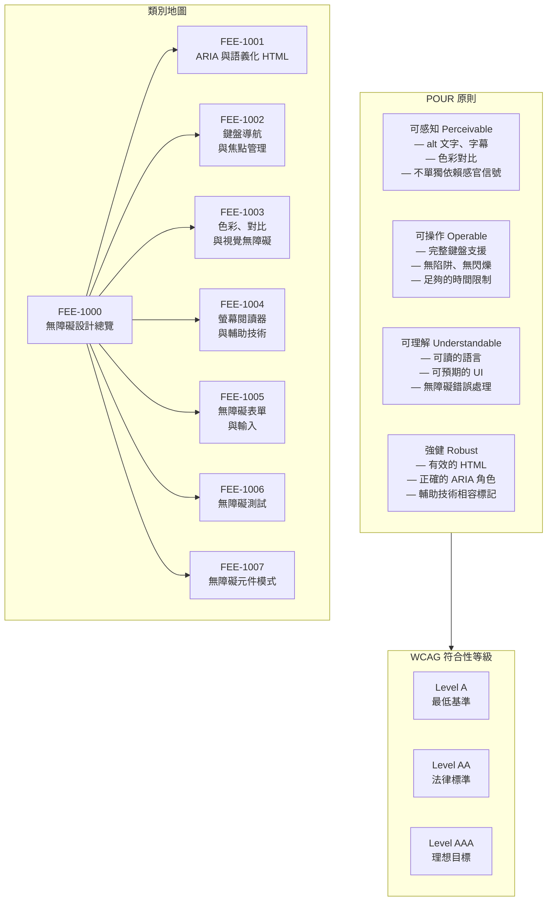

# 無障礙設計總覽

:::info
本類別涵蓋完整的無障礙實踐層次 — 從語義化 HTML 與 ARIA 角色，到鍵盤導航、色彩對比、螢幕閱讀器行為，再到無障礙元件模式 — 聚焦於如何從設計之初就讓產品對所有人可用，而非事後補救。
:::

## 情境

無障礙設計（縮寫為 **a11y** — "a" 與 "y" 之間共有 11 個字母）是一種設計與工程實踐，目標是讓身心障礙者也能有效地感知、理解、瀏覽並與數位產品互動。與網頁產品相關的障礙類型相當廣泛：

- **視覺** — 全盲、低視力、色盲、光敏感
- **動作** — 手部活動受限、顫抖、無法使用滑鼠、開關輔助控制
- **聽覺** — 全聾、重聽（與音訊或影片內容相關）
- **認知** — 讀寫困難、ADHD、記憶障礙、難以處理複雜語言

障礙並不罕見。根據世界衛生組織的資料，全球約有 13 億人（約占全球人口的 16%）有某種形式的重大障礙。若加上暫時性障礙（手腕骨折、術後恢復期）與情境性限制（強光使螢幕難以閱讀、單手抱著孩子使用手機），在任何特定時刻，實際受益於無障礙設計的使用者比例遠高於 16%。

### 法規環境

無障礙設計日益成為法律要求，而非單純的最佳實踐：

- **ADA（美國身心障礙者法案）** — 美國法律中，涵蓋州政府與地方政府機構的 Title II 現已明確要求數位資產符合 WCAG 2.1 Level AA。聯邦承包商與大型私人機構在 Title III 相關案例法下同樣面臨類似義務。
- **EN 301 549** — 歐洲 ICT 產品與服務無障礙要求的協調標準。它直接將 WCAG 2.1 Level AA 作為網頁內容的基準。
- **EAA（歐洲無障礙法案）** — 於 2025 年 6 月 28 日起在所有歐盟成員國強制執行。適用於員工 10 人以上、年營業額或資產負債表超過 200 萬歐元、且向歐盟消費者銷售產品或服務的組織。涵蓋類別包括電子商務、銀行服務、交通票務及電信服務。

實際意義：若您的產品服務美國或歐盟的使用者 — 而大多數網頁產品都是如此 — WCAG 2.1 Level AA 的符合性實際上已是必要條件。

### WCAG 符合性等級

由 W3C 發布的《網頁內容無障礙指引》（WCAG）定義了三個符合性等級：

| 等級 | 說明 | 實際意義 |
|------|------|----------|
| **A** | 最低標準 | 滿足最基本的準則；可能仍存在重大障礙 |
| **AA** | 中等標準 | 法律與業界標準；具備良好的無障礙性 |
| **AAA** | 最高標準 | 理想目標；不要求整個網站達到；某些內容類型可能無法達成 |

WCAG 2.1 是 2024 年以前大多數法律框架的基準。WCAG 2.2 於 2023 年 10 月發布（2024 年 12 月更新），新增了九項成功準則，其中許多針對認知與動作障礙。2.1 AA 與 2.2 AA 之間的差距相對較小，新專案應以 2.2 AA 為目標。

每個 WCAG 成功準則都被分配到三個等級之一。達到 AA 需要滿足所有 Level A 準則以及所有 Level AA 準則。達到 AAA 則還需要滿足所有 Level AAA 準則。即使是完全符合 AAA 的網站，仍無法對每位有各種障礙組合的使用者完全無障礙 — 特別是認知、語言與學習領域 — 這也是為何與身心障礙使用者進行持續的使用者研究，比單純的符合性測試更加重要。

### POUR 原則

所有 WCAG 成功準則都組織在四個基本原則之下，通常以縮寫 **POUR** 表示：

**可感知（Perceivable）** — 資訊與 UI 元件必須以使用者可以感知的方式呈現。內容不能對使用者的所有感官都不可見。範例：圖片的文字替代方案（`alt` 屬性）、影片字幕、足夠的色彩對比、不單獨依賴顏色傳達意義的內容。

**可操作（Operable）** — UI 元件與導覽必須可以操作。使用者必須能以其選擇的輸入方式與所有功能互動。範例：完整的鍵盤可操作性、無鍵盤陷阱、充足的時間閱讀和使用內容、每秒閃爍不超過三次的內容（癲癇發作風險）。

**可理解（Understandable）** — 資訊與 UI 的操作必須可以理解。使用者必須能夠理解內容以及介面的行為方式。範例：可讀且可預期的語言、輸入欄位標籤、錯誤識別與建議、一致的導覽。

**強健（Robust）** — 內容必須足夠強健，能被各種使用者代理程式（包括當前與未來的輔助技術）可靠地解讀。範例：有效的 HTML、所有 UI 元件的名稱/角色/值正確公開、狀態訊息可透過程式化方式判定。

POUR 不只是一個記憶術語。它是一種診斷工具。當無障礙問題出現時，將其對應到 POUR 原則，能立即指出所需修正的類別：感知問題（缺少 alt 文字）需要可感知方面的修正；鍵盤無法到達的互動元件是可操作問題；不清楚的錯誤訊息是可理解問題；螢幕閱讀器誤解的自訂元件是強健性問題。

### 本類別涵蓋內容

- **ARIA 與語義化 HTML**（FEE-1001）：為何原生 HTML 元素提供免費的無障礙語義，以及何時 ARIA 是 — 或不是 — 正確的工具。
- **鍵盤導航與焦點管理**（FEE-1002）：建立完全可鍵盤操作的介面、以程式化方式管理焦點，以及避免焦點陷阱。
- **色彩、對比與視覺無障礙**（FEE-1003）：對比度要求、不依賴顏色的溝通方式，以及動畫/運動考量。
- **螢幕閱讀器與輔助技術**（FEE-1004）：螢幕閱讀器如何解讀 DOM、即時區域（live regions），以及輔助技術之間的行為差異。
- **無障礙表單與輸入**（FEE-1005）：標籤、欄位組、錯誤處理，以及無障礙驗證模式。
- **無障礙測試**（FEE-1006）：自動化 lint 工具、手動測試、螢幕閱讀器測試，以及 axe/Lighthouse 工具。
- **無障礙元件模式**（FEE-1007）：按照 ARIA Authoring Practices Guide 模式建立對話框、選單、分頁及其他互動元件。

這些條目彼此建立在對方的基礎上。FEE-1001 建立了其他所有條目所依賴的語義基礎。FEE-1002 至 FEE-1005 分別處理特定的無障礙維度。FEE-1006 提供工具與測試流程以驗證符合性。FEE-1007 將所有前述條目應用於大多數應用程式中常見的具體元件模式。

## 設計思維

### 無障礙是一個光譜，不是二元的

將無障礙設計框定為合規核查表是一種誘人但具誤導性的做法：要麼網站通過稽核，要麼沒有。這種框架在兩個層面上是錯誤的。

首先，使用者存在於一個持續變化的能力光譜上。在明亮辦公室中視力 20/20 的使用者，在直射陽光下閱讀同一螢幕時，實際上變成了低視力使用者。手部活動完全正常的使用者，在手腕手術後第二天就成了僅能使用鍵盤的使用者。沒有任何診斷認知狀況的使用者，在壓力下面對一個有十二個欄位且錯誤訊息不清楚的表單時，同樣會遇到困難。無障礙設計所服務的不是一個獨立的「身心障礙使用者」群體 — 它為所有使用者在他們實際遇到的各種條件下減少阻力。

其次，符合性等級是門檻，不是目標。一個通過 WCAG 2.1 AA 自動化檢查的頁面，若 ARIA 角色在語義上正確但閱讀順序不合邏輯，或若即時區域過於頻繁地觸發而在使用者說話途中打斷他們，對螢幕閱讀器使用者而言仍可能幾乎無法使用。符合性是地板，天花板由您對身心障礙使用者體驗的深入理解程度決定 — 而這只能透過與真實使用者進行測試才能獲得。

### 預設無障礙勝過事後改造

建築業有一條廣為引用的經驗法則：在現有建築中加裝無障礙坡道，其費用約為在原始設計中納入坡道的十倍。同樣的不對稱性適用於軟體。

將無障礙性改造到未預先設計的元件庫或應用程式中，需要：稽核所有現有元件、重寫那些 DOM 結構從根本上與輔助技術不相容的互動元件、添加用於補償錯誤 HTML 結構的 ARIA 屬性，以及對所有修改的部分進行回歸測試。這項工作不只是倍增的 — 它往往受到架構上的限制。一個完全由 `div` 元素和點擊事件處理器構建的自訂下拉選單，沒有鍵盤語義、沒有 ARIA 角色、沒有焦點管理、也沒有標籤關聯。要正確改造它，可能需要從頭重寫。

相比之下，預設即無障礙的做法：`button` 元素天生就支援鍵盤操作，並會被螢幕閱讀器免費宣告。與 `input` 關聯的 `label` 無需任何 ARIA 屬性就能被每個螢幕閱讀器宣告。`h2` 創建了輔助技術使用者可以導覽的文件結構。瀏覽器和輔助技術完成了這些工作；開發者只需要選擇正確的元素。

改造的代價會隨著時間累積。每個加入到無障礙性不足的程式碼庫中的新元件，都會繼承已有的模式。若程式碼庫到處使用帶有 `onClick` 的 `div`，下一位開發者也會遵循這個模式。若程式碼庫使用語義化 HTML，只在必要時才使用正確的 ARIA，下一位開發者也會遵循這個模式。文化是由已存在的事物決定的。

### 語義化 HTML 是基礎

瀏覽器和輔助技術對原生 HTML 元素的無障礙語義有數十年的投資。當您使用 `button` 時，瀏覽器會將其作為具有名稱、角色和按壓狀態的控制項公開到無障礙樹中。螢幕閱讀器知道要宣告它。鍵盤使用者知道它響應 Enter 和 Space 鍵。語音控制使用者可以按名稱定位它。這一切都是免費的。

當您用 `div` 構建等效控制項時，您什麼都沒有繼承。您必須添加 `role="button"`、`tabindex="0"`、Enter 和 Space 的鍵盤事件處理器，以及適當的 ARIA 狀態屬性 — 而且您必須讓所有這些與元件的視覺狀態保持同步。您是在重新實作瀏覽器已經做的事情，而且對於每個遇到的情況都要不完整地重做一遍。

ARIA 使用的第一條規則是字面性的：如果原生 HTML 元素或屬性已經提供了所需的語義，就不要使用 ARIA。ARIA 是一種在 HTML 單獨不足以表達語義的地方擴展或修正無障礙樹的工具 — 不是正確 HTML 的替代品。

這個原則對元件編寫有一個推論：元件的無障礙品質在其 DOM 結構設計時就基本確定了。根元素是具有正確結構的語義元素的元件，只需最少的額外工作就能做到無障礙。根元素是通用容器的元件，需要在每個互動點上進行 ARIA 補償。

### 各框架的無障礙預設值

目前主流的 JavaScript 框架都不會免費提供無障礙性。每個框架決定了 HTML 的渲染方式 — 而它們都會渲染開發者所寫的內容，無論是否無障礙。

**React** — 無內建無障礙強制機制。React 渲染開發者寫的 JSX。正確的語義、鍵盤行為和 ARIA 使用完全是開發者的責任。`eslint-plugin-jsx-a11y` 插件在 lint 時可以捕捉常見錯誤（缺少 `alt`、缺少標籤、無效 ARIA 使用），但在大多數設定中預設未啟用。React 的 Server Components 和並發特性不改變無障礙模型。

**Vue** — 與 React 相同的模型。Vue 渲染開發者寫的模板。`eslint-plugin-vuejs-accessibility` 插件提供類似的靜態分析。無內建無障礙層。

**Angular** — 隨附 **Angular CDK（元件開發套件）**，其中包含 `a11y` 模組。CDK 提供 `FocusTrap`、`LiveAnnouncer`、`FocusMonitor` 以及一套 React 或 Vue 中不存在的高階無障礙工具。這並不意味著 Angular 應用自動無障礙 — 開發者仍必須選擇使用這些工具 — 但平台中存在這些基礎設施。

**Svelte** — 與 React 和 Vue 相同的模型。Svelte 將開發者的模板編譯為 DOM；無障礙性是開發者的責任。Svelte 編譯器確實包含內建的無障礙警告（常見問題如圖片缺少 `alt` 屬性會在編譯時出現 a11y 警告），這比 React 的預設設定做得更多，但不如 Angular CDK 的運行時工具。

實際結論：在這些框架中，無障礙品質取決於團隊紀律與流程，而非框架的預設值。Lint 規則、設計系統的無障礙要求，以及測試閘門，遠比框架選擇更重要。

## 視覺

### POUR 原則與類別地圖

下圖將四個 POUR 原則對應到 WCAG 符合性等級，並展示 FEE-1000 類別條目與本系列七個子主題之間的關係。

## 相關 FEE

- [FEE-1001: ARIA & Semantic HTML](1001.md)
- [FEE-1002: Keyboard Navigation & Focus Management](1002.md)
- [FEE-1003: Color, Contrast & Visual Accessibility](1003.md)
- [FEE-1004: Screen Readers & Assistive Technology](1004.md)
- [FEE-1005: Accessible Forms & Inputs](1005.md)
- [FEE-1006: Testing Accessibility](1006.md)
- [FEE-1007: Accessible Component Patterns](1007.md)
- [FEE-100: HTML & Semantic Markup Overview](../HTML%20and%20Semantic%20Markup/100.md)
