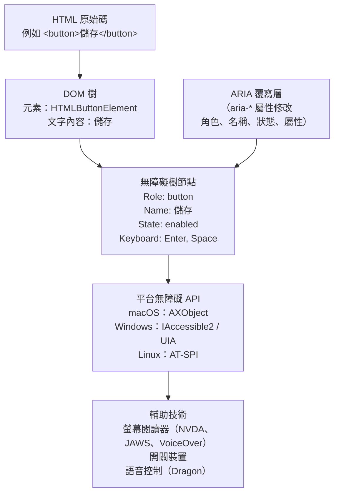
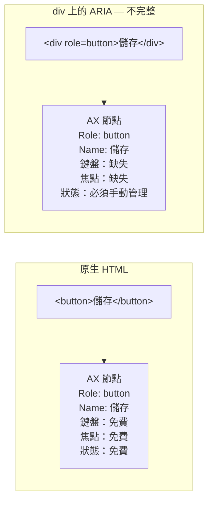

# ARIA 與語義化 HTML

:::info
語義化 HTML 讓無障礙性免費到手。ARIA 則是進一步強化的工具。理解各自的使用時機與順序，是前端工程師能培養的最具影響力的無障礙技能。
:::

## 情境

### 什麼是無障礙樹（Accessibility Tree）？

瀏覽器為每個頁面維護兩棵樹：**DOM 樹**（完整的文件模型）以及**無障礙樹**（一個平行的表示結構，去除純視覺資訊，並將每個元素的語義角色、名稱、狀態與屬性暴露給輔助技術）。

當螢幕閱讀器、開關裝置或語音控制軟體需要理解 UI 時，它們查詢的是無障礙樹，而非直接操作 DOM 或視覺渲染結果。平台無障礙 API（macOS 的 AXObject、Windows 的 IAccessible2/UIA）介於瀏覽器與輔助技術之間，將樹結構轉譯成 AT 可消費的介面。

每個 HTML 元素都會對應到無障礙樹中的一個節點，並帶有一組隱含屬性：

- **Role（角色）** — 元素是什麼（`button`、`heading`、`list`、`checkbox` ……）
- **Name（名稱）** — 用於識別元素的人類可讀標籤
- **Description（描述）** — 選用的補充資訊
- **State（狀態）** — 動態條件（`checked`、`expanded`、`disabled`、`selected` ……）
- **Value（值）** — 適用於範圍輸入與其他帶有值的控制項

原生 HTML 元素自動攜帶這些屬性。ARIA 屬性（`role`、`aria-*`）讓作者得以覆寫或補充這些屬性。

### 什麼是 ARIA？

**ARIA**（無障礙豐富網路應用程式，Accessible Rich Internet Applications）是 W3C 規格，目前為 1.2 版，定義了：

- 一組**角色（roles）**，可以指派給任何元素，宣告它是哪種 widget
- 一組**屬性（properties）**，描述 widget 在正常使用期間不會改變的特性
- 一組**狀態（states）**，描述 widget 在互動過程中會改變的當前條件

ARIA 是無障礙樹的詞彙表。它不新增行為。它不新增鍵盤處理。它不新增視覺樣式。它只改變無障礙樹所回報的內容。

### 原生 HTML 元素的隱含 ARIA 角色

每個原生 HTML 元素都有隱含的 ARIA 角色。正確使用元素時，你就獲得了該角色 — 以及通常伴隨的名稱計算與狀態 — 而無需撰寫任何 ARIA 屬性。

| HTML 元素 | 隱含 ARIA 角色 | 備註 |
|---|---|---|
| `<button>` | `button` | 可鍵盤操作；原生回應 Enter 與 Space |
| `<a href="...">` | `link` | 回應 Enter；無 href 時為通用角色 |
| `<nav>` | `navigation` | 地標；幫助 AT 使用者跳至導覽區 |
| `<main>` | `main` | 地標；每頁一個 |
| `<header>` | `banner`（頁面層級時） | 當為 `body` 的直接子元素時；巢狀於 `article`、`aside`、`main`、`nav` 或 `section` 內時，地標角色將消失 |
| `<footer>` | `contentinfo`（頁面層級時） | 當為 `body` 的直接子元素時；巢狀於 `article`、`aside`、`main`、`nav` 或 `section` 內時，地標角色將消失 |
| `<aside>` | `complementary` | 地標 |
| `<section>` | `region`（有名稱時） | 只有在有無障礙名稱時才具備地標角色 |
| `<article>` | `article` | 自包含、可獨立分發的內容 |
| `<h1>`–`<h6>` | `heading`（層級 1–6） | 文件大綱；AT 使用者以標題導覽 |
| `<ul>`、`<ol>` | `list` | 子元素具有 `listitem` 角色 |
| `<input type="checkbox">` | `checkbox` | 狀態：`checked`、`unchecked`、`mixed` |
| `<input type="radio">` | `radio` | |
| `<select>` | `listbox` | |
| `<form>` | `form`（有名稱時） | 只有在有無障礙名稱時才是地標 |
| `<table>` | `table` | |
| `<dialog>` | `dialog` | |

地標角色（`navigation`、`main`、`banner`、`contentinfo`、`complementary`、`region`、`form`、`search`）尤其重要，因為螢幕閱讀器使用者依靠地標在頁面上快速跳轉 — 類似於視覺使用者掃描頁面以找到主要區塊的方式。

### ARIA 角色

當原生 HTML 無法表達所需語義時 — 通常是自訂互動元件的情況 — ARIA 角色填補這個空缺。常見角色：

| 角色 | 用途 |
|---|---|
| `role="dialog"` | 強制型或非強制型對話框覆蓋層 |
| `role="alertdialog"` | 需要使用者立即關注並回應的對話框 |
| `role="alert"` | 緊急、中斷式公告的 live region（隱含 `aria-live="assertive"`） |
| `role="status"` | 非緊急狀態訊息的 live region（隱含 `aria-live="polite"`） |
| `role="tablist"` | 一組分頁標籤的容器 |
| `role="tab"` | tablist 中的單一分頁標籤 |
| `role="tabpanel"` | 與分頁標籤關聯的內容面板 |
| `role="menu"` | 提供選項清單的 widget |
| `role="menuitem"` | menu 中的選項 |
| `role="combobox"` | 結合輸入框與彈出清單的控制項 |
| `role="grid"` | 具有儲存格選取功能的互動表格 |
| `role="tree"` | 層級式清單 |
| `role="tooltip"` | 懸停或聚焦時顯示的元素簡短說明 |

### ARIA 屬性（Properties）

屬性描述固定或半固定的特性，補充或覆寫元素的計算無障礙名稱與描述：

| 屬性 | 用途 |
|---|---|
| `aria-label` | 直接提供字串作為無障礙名稱 |
| `aria-labelledby` | 參照另一個元素的文字作為無障礙名稱 |
| `aria-describedby` | 參照另一個元素的文字作為無障礙描述 |
| `aria-controls` | 識別此 widget 所控制的元素 |
| `aria-owns` | 在無障礙樹中宣告元素為子元素，即使不是 DOM 子元素 |
| `aria-haspopup` | 指示元素可開啟彈出視窗（menu、listbox、tree、grid 或 dialog） |
| `aria-level` | 定義元素的層級層次 |
| `aria-roledescription` | 覆寫 AT 公告的角色名稱（謹慎使用） |
| `aria-keyshortcuts` | 描述鍵盤快捷鍵 |
| `aria-placeholder` | 空白輸入框的提示文字（盡可能優先使用 HTML `placeholder`） |

### ARIA 狀態（States）

狀態描述在互動過程中會改變的動態條件，應即時反映：

| 狀態 | 用途 |
|---|---|
| `aria-expanded` | 可折疊區塊或彈出視窗是否展開（`true` / `false`） |
| `aria-hidden` | 從無障礙樹中移除元素（`true` / `false`） |
| `aria-disabled` | 將元素標記為停用，但不從焦點順序中移除 |
| `aria-checked` | 用於 checkbox、radio 及切換按鈕（`true` / `false` / `mixed`） |
| `aria-selected` | 用於 listbox 中的選項、分頁標籤或 grid 儲存格 |
| `aria-pressed` | 用於切換按鈕（`true` / `false` / `mixed`） |
| `aria-busy` | 指示元素正在載入或更新 |
| `aria-invalid` | 指示驗證錯誤（`true`、`false`、`grammar`、`spelling`） |
| `aria-current` | 指示集合中的當前項目（page、step、location、date、time、true） |

### Live Region（即時區域）

Live region 讓動態內容變更能在不需移動焦點的情況下，向螢幕閱讀器使用者公告。對於非同步更新的內容而言至關重要：toast 通知、表單驗證訊息、搜尋結果數量、聊天訊息。

`aria-live` 的兩個值涵蓋大多數使用情境：

- **`aria-live="polite"`** — 公告等待使用者閒置後（AT 完成目前的朗讀）才播放。適用於非緊急更新，例如搜尋結果載入完成、成功通知或狀態更新。幾乎所有 live region 的正確預設值。
- **`aria-live="assertive"`** — 公告立即中斷 AT 正在讀的內容。僅用於延遲會造成真實混淆或危險的緊急資訊 — 例如倒數計時的 session 逾時警告，或阻止表單提交的嚴重錯誤。

過度使用 `assertive` 是嚴重的無障礙問題。在 AT 說話途中打斷使用者令人迷失方向，許多螢幕閱讀器使用者認為這是網站的無禮行為。預設使用 `polite`；只有在資訊真的不能等待時才考慮 `assertive`。

其他 live region 屬性：
- `aria-atomic="true"` — 更新時公告整個區域，而非僅公告變更的部分
- `aria-relevant` — 指定哪些類型的變更相關（`additions`、`removals`、`text`、`all`）。預設為 `additions text`。

## 原則

> **SHOULD**（應該）在使用 ARIA 之前，優先使用原生 HTML 元素與屬性。`<button>` 永遠優於 `<div role="button">`。`<label>` 永遠優於 input 上的 `aria-label`。`<h2>` 永遠優於 `<div role="heading" aria-level="2">`。
>
> **MUST NOT**（禁止）對可聚焦元素或包含可聚焦子元素的元素套用 `aria-hidden="true"`。將元素從無障礙樹中隱藏，同時讓它保持可鍵盤到達，會產生一個「幽靈控制項」：鍵盤使用者可以聚焦，但螢幕閱讀器使用者無法感知或理解它。
>
> **MUST NOT**（禁止）使用 ARIA 以不受支援的方式指派與元素原生語義相衝突的角色。例如，不要在 `<button>` 上放 `role="heading"` — 角色必須用於原生語義不衝突的元素上。
>
> **SHOULD**（應該）隨時保持 ARIA 狀態屬性（`aria-expanded`、`aria-checked`、`aria-selected` 等）與元件實際的視覺及互動狀態同步。過時的 ARIA 狀態比沒有 ARIA 狀態更糟 — 它會主動誤導 AT 使用者。

## 設計思維

### 為何語義化 HTML 能免費提供無障礙性

原生 HTML 元素承載了數十年的瀏覽器投資。當你撰寫 `<button>` 時，瀏覽器的排版引擎、無障礙引擎與事件系統全都認識它：

- 無障礙引擎將它以 `button` 角色對應到平台無障礙 API，從文字內容計算無障礙名稱，並自動暴露鍵盤互動（Enter 和 Space 觸發預設動作）。
- 瀏覽器的焦點系統無需任何 `tabindex` 就將它納入 tab 順序。
- 平台無障礙 API 以 AT 語言中適當的角色名稱向螢幕閱讀器暴露它（VoiceOver 使用者聽到「按鈕」、JAWS 使用者聽到「button」、NVDA 使用者聽到「button」）。

這些對 `<div>` 一概不適用。`div` 沒有角色、沒有鍵盤行為、也不在 tab 順序中。要讓它在功能上等同於 `<button>`，你必須加上 `role="button"`、`tabindex="0"`、針對 Enter 和 Space 的 `keydown` 事件處理器，以及相關的 ARIA 狀態屬性。你在重新實作瀏覽器已經實作的東西 — 而且在每個遇到的案例中都會不可避免地遺漏邊角情況。

標題結構的邏輯相同。`<h2>` 在無障礙樹中建立一個層級 2 的標題節點。螢幕閱讀器使用者使用鍵盤快捷鍵持續導覽標題（NVDA 和 JAWS 的 H 鍵、VoiceOver 的 Control+Option+Command+H）。字型較大的 `<div class="heading">` 在無障礙樹中什麼都沒有建立。以真實標題組織的內容是可導覽的；以視覺樣式模仿標題的內容則不是。

這就是語義化 HTML 的核心論點：瀏覽器和 AT 為你完成工作。你的工作是選擇正確的元素，而非重新實作瀏覽器。

### 為何 ARIA 的第一條規則存在

WAI-ARIA 規格說明：「如果你可以使用已內建所需語義和行為的原生 HTML 元素或屬性，而非重新利用一個元素並添加 ARIA 角色、狀態或屬性來使其無障礙，那麼請使用原生元素。」

這條規則存在是因為 ARIA 有一個根本的限制：**它只向無障礙樹新增語義，不向元素新增任何行為**。

考慮 `<div role="button">Click me</div>`：

- 螢幕閱讀器會將其公告為按鈕。角色是正確的。
- 它沒有 `tabindex`，所以鍵盤使用者根本無法到達它（除非也加上 `tabindex="0"`）。
- 即使有了 `tabindex="0"`，在它上面按 Enter 或 Space 也不會有任何反應 — 這些鍵沒有綁定到 `div` 的 `click` 事件。
- 開發者必須加上：`tabindex="0"`、檢查 `event.key === 'Enter'` 和 `event.key === ' '`（Space）並手動觸發 click 的 `keydown` 處理器，以及防止 Space 的預設捲動行為。
- 如果按鈕有停用狀態，必須加上 `aria-disabled="true"` 並確保 click 和鍵盤處理器都遵守它，因為 `disabled` 屬性對 `div` 無效。
- 如果按鈕有切換按下狀態，必須加上 `aria-pressed` 並保持同步。

在每一步，開發者都在手工建構 `<button>` 免費提供的功能。而在每一步，都有出錯的可能 — 忘記處理 Space、忘記阻止 Space 的捲動、忘記同步 `aria-disabled`、忘記加上 `tabindex`。原生元素不只是更方便；它更強健，因為它的行為在瀏覽器中實作，已針對數千個螢幕閱讀器、AT 配置和邊角情況進行測試。

ARIA 的第一條規則不是風格偏好。它是一種認知：ARIA 是一個狹窄的、補充性的工具，專為 HTML 單獨不足的特定情況而設計，而非通用的無障礙機制。

### 為何 aria-label 與 aria-labelledby 的選擇很重要

`aria-label` 和 `aria-labelledby` 都為元素提供無障礙名稱。兩者之間的選擇在品質、可維護性和國際化方面有實際影響。

**`aria-label`** 直接提供字串字面值：

```html
<button aria-label="關閉對話框">
  <svg aria-hidden="true"><!-- icon --></svg>
</button>
```

優點：簡單、自包含、在沒有可見標籤文字時有效。
缺點：字串是不可見的 — 它不出現在 UI 中。必須在每個語系中手動翻譯。如果可見的情境改變，`aria-label` 的值可能在沒有人注意到的情況下變得過時。自動化工具無法輕易檢查 `aria-label` 內容是否最新且準確。

**`aria-labelledby`** 透過 `id` 參照可見文字：

```html
<section aria-labelledby="billing-heading">
  <h2 id="billing-heading">帳單地址</h2>
  <!-- ... -->
</section>
```

優點：無障礙名稱源自可見文字。可見文字改變時，無障礙名稱自動更新。處理可見文字的翻譯系統也同時處理無障礙名稱。視覺與非視覺呈現之間天然保持一致。
缺點：需要有 `id` 可以參照的元素；標記略多。

對大多數正式應用程式而言，國際化論點是決定性的：`aria-labelledby` 參照已在你的本地化流程中的文字。`aria-label` 的字串字面值對大多數 i18n 工具鏈是不可見的 — 必須分別追蹤、分別翻譯、分別進行 QA。在一個有許多元件和許多語系的大型應用程式中，維護 `aria-label` 字串的負擔相當可觀。

實際指引：
- 當已有可見文字為元素命名時，使用 `aria-labelledby` 參照它。
- 當沒有可見文字時（純圖示按鈕、純視覺區塊），使用 `aria-label`。
- 當標籤文字需要組合多個元素的文字時，`aria-labelledby` 可以參照多個 id：`aria-labelledby="first-id second-id"`。

### 漸進增強論點

應用於無障礙設計的漸進增強意思是：從正確的語義開始，只在必要時用 ARIA 增強。

**第一層 — 正確的 HTML 結構**：使用語義化元素（`nav`、`main`、`h1`–`h6`、`button`、`label`、`input` 等）並搭配正確的屬性（`type`、`for`、`href`、`alt`）。光是這一層就能在沒有任何 ARIA 的情況下滿足大部分的無障礙要求。

**第二層 — 為自訂 widget 使用 ARIA**：當你建構沒有原生 HTML 等效的互動元件時 — 日期選擇器、autocomplete combobox、樹狀導覽、多選 listbox — 加上適當的 ARIA 角色、屬性和狀態。這才是 ARIA 的正確使用情境。

**第三層 — 以 JavaScript 實作行為**：加上鍵盤事件處理器，實作 ARIA Authoring Practices Guide 中定義的互動模式。ARIA 宣告角色；JavaScript 實作該角色預期的鍵盤行為。

每一層本身都應該是正確的。一個沒有 ARIA 也沒有自訂 JavaScript 的 `<button>` 是完全無障礙的。一個 ARIA 增強但鍵盤處理不完整的 widget，比它試圖取代的原生元素無障礙性更差。建立在錯誤 HTML 結構上的精心 ARIA 實作，會產生一個描述的 UI 與視覺呈現不符的無障礙樹 — 這對 AT 使用者而言令人迷惑。

漸進增強的視角也有助於排定無障礙工作的優先順序：修正錯誤的 HTML 結構永遠優先於添加 ARIA，因為在破損結構上使用 ARIA 只會產生破損的無障礙樹。

## 視覺

### 無障礙樹流程

下圖展示 DOM 元素如何讓輔助技術得以存取。瀏覽器解析 HTML、建立 DOM，並從中推導無障礙樹。ARIA 屬性修改無障礙樹層。平台無障礙 API（例如 macOS 的 AXObject 或 Windows 的 UI Automation）將樹暴露給輔助技術。



### 原生元素 vs ARIA 覆寫比較



圖表說明了為何 `<button>` 永遠是首選：無障礙樹節點在角色/名稱層面看起來相同，但原生元素提供了 ARIA-on-div 模式需要手動 JavaScript 才能複製的鍵盤與焦點行為。

## 範例

### 1. 語義化 HTML 隱含角色 — 好的做法 vs 不好的做法

```html
<!-- 不好：純視覺結構，沒有語義 -->
<div class="header">
  <div class="nav">
    <div class="nav-link">首頁</div>
    <div class="nav-link">關於</div>
  </div>
</div>
<div class="main-content">
  <div class="big-text">歡迎</div>
  <div class="content-area">...</div>
</div>
<div class="sidebar">...</div>

<!-- 好：帶有隱含地標和標題角色的語義結構 -->
<header>
  <nav aria-label="主要導覽">
    <a href="/">首頁</a>
    <a href="/about">關於</a>
  </nav>
</header>
<main>
  <h1>歡迎</h1>
  <p>...</p>
</main>
<aside aria-label="相關連結">...</aside>
```

好的模式免費讓螢幕閱讀器使用者獲得地標導覽。`nav` 被公告為導覽地標。`main` 允許直接跳至主要內容。`h1` 可透過標題導覽。這些都不需要 ARIA。

### 2. 以 div 假裝按鈕的反模式

```html
<!-- 不好：視覺上像按鈕，行為上什麼都不是 -->
<div class="btn" onclick="submitForm()">送出</div>
<!-- 問題：
     - 不在 tab 順序中（鍵盤使用者無法到達）
     - 沒有角色（螢幕閱讀器看到的是通用 "group" 或沒有意義的東西）
     - Enter 和 Space 沒有任何效果
     - 無法使用 disabled 屬性停用
-->

<!-- 也不好：部分修正但仍然有問題 -->
<div class="btn"
     role="button"
     tabindex="0"
     onclick="submitForm()">送出</div>
<!-- 仍然有問題：
     - Enter 在 button 上原生觸發 click，但在 div 上不會 — 必須加上 keydown 處理器
     - Space 在 button 上（阻止捲動後）觸發 click，但在 div 上不會 — 必須加上 keydown 處理器
     - aria-disabled 必須手動同步
     - 沒有自動的表單送出行為
-->

<!-- 好：使用正確的元素 -->
<button type="submit">送出</button>
<!-- 優點：
     - 無障礙樹中隱含 role="button"
     - 無需 tabindex 就在 tab 順序中
     - Enter 和 Space 原生觸發 click
     - disabled 屬性從 tab 順序中移除並抑制事件
     - 當 type="submit" 時原生送出其父表單
-->
```

### 3. aria-label vs aria-labelledby

```html
<!-- aria-label：在沒有可見文字時使用 -->
<button aria-label="關閉">
  <svg aria-hidden="true" focusable="false">
    <use href="#icon-x" />
  </svg>
</button>

<!-- aria-labelledby：用來參照可見文字 -->
<section aria-labelledby="shipping-heading">
  <h2 id="shipping-heading">送貨地址</h2>
  <form>
    <!-- 輸入欄位 -->
  </form>
</section>

<!-- aria-labelledby 參照多個元素：依序合併文字 -->
<tr>
  <th id="col-price" scope="col">價格</th>
</tr>
<tr>
  <td>
    <input
      type="number"
      aria-labelledby="col-price row-product-name"
      id="price-widget"
    />
  </td>
</tr>
```

### 4. 動態內容的 aria-live

```html
<!-- 輕度 live region：搜尋結果、狀態更新 -->
<div role="status" aria-live="polite" aria-atomic="true">
  <!-- 搜尋結果載入時由 JavaScript 更新 -->
  <!-- 初始為空；螢幕閱讀器會公告變更 -->
</div>

<!-- JavaScript 更新：-->
<!-- document.querySelector('[role="status"]').textContent = '找到 24 筆結果'; -->

<!-- 緊急 live region：僅用於緊急錯誤 -->
<div role="alert">
  <!-- 僅用於無法等待使用者閒置的緊急錯誤 -->
  <!-- role="alert" 已隱含 aria-live="assertive" 和 aria-atomic="true" -->
</div>

<!-- toast 通知模式（polite） -->
<div
  id="toast-region"
  role="status"
  aria-live="polite"
  aria-atomic="true"
  class="sr-only"
></div>
```

注意：`role="alert"` 自動隱含 `aria-live="assertive"` 和 `aria-atomic="true"`。`role="status"` 自動隱含 `aria-live="polite"`，但 `aria-atomic` 的預設值為 `false`。若需要在 `role="status"` 上使用 `aria-atomic="true"`，必須明確設定。你可以使用角色簡寫，或在通用容器上使用明確的 `aria-live` — 但不要在同一個元素上同時使用兩者。

### 5. 展開/收合 widget 上的 aria-expanded

```html
<!-- 展開/收合 widget：顯示/隱藏區塊 -->
<button
  aria-expanded="false"
  aria-controls="faq-answer-1"
  id="faq-btn-1"
>
  退貨政策是什麼？
</button>
<div id="faq-answer-1" hidden>
  <p>商品可在購買後 30 天內退貨。</p>
</div>

<!-- JavaScript 管理狀態：-->
<!--
const btn = document.getElementById('faq-btn-1');
const panel = document.getElementById('faq-answer-1');
btn.addEventListener('click', () => {
  const isExpanded = btn.getAttribute('aria-expanded') === 'true';
  btn.setAttribute('aria-expanded', String(!isExpanded));
  panel.hidden = isExpanded;
});
-->
```

當按鈕被啟動時：
- `aria-expanded` 在 `"false"` 和 `"true"` 之間切換 — 螢幕閱讀器公告新狀態。
- `hidden` 屬性在面板上切換 — 從視覺顯示和無障礙樹中移除。
- 螢幕閱讀器使用者聽到：「退貨政策是什麼？折疊 按鈕」→ 點擊 →「退貨政策是什麼？展開 按鈕」。

### 6. aria-hidden 的正確與錯誤用法

```html
<!-- 正確：對裝飾性圖示隱藏於 AT -->
<button>
  <svg aria-hidden="true" focusable="false">
    <use href="#icon-save" />
  </svg>
  儲存文件
</button>

<!-- 正確：隱藏整個裝飾性區塊 -->
<div aria-hidden="true" role="presentation">
  <!-- 純粹裝飾性的視覺分隔元素 -->
</div>

<!-- 錯誤：在可聚焦元素上使用 aria-hidden -->
<button aria-hidden="true">關閉</button>
<!-- 鍵盤使用者可以聚焦這個按鈕；但螢幕閱讀器使用者看不到它。
     這個按鈕成了幽靈：對鍵盤使用者存在，但對 AT 不可見。-->

<!-- 錯誤：在包含可聚焦元素的容器上使用 aria-hidden -->
<div aria-hidden="true">
  <button>取消</button>  <!-- 可透過鍵盤到達但對 AT 隱藏的幽靈 -->
  <button>確認</button> <!-- 同樣問題 -->
</div>

<!-- 修正：如果要隱藏互動內容，也讓它無法被聚焦 -->
<div aria-hidden="true" style="display:none">
  <!-- display:none 同時從視覺渲染和無障礙樹中移除，
       並阻止焦點。用這個代替在包含可聚焦子元素的容器上使用 aria-hidden。-->
</div>
```

## 常見錯誤

### 使用 ARIA 角色但未實作預期的鍵盤行為

在容器上加上 `role="listbox"` 或 `role="combobox"`，告訴螢幕閱讀器將其視為該 widget 類型。螢幕閱讀器使用者隨即期待 ARIA Authoring Practices Guide 中定義的鍵盤互動模式：方向鍵在選項間移動、Home/End 跳至第一/最後，以及字符搜尋的前置搜尋。如果鍵盤行為未實作，widget 對 AT 使用者的困惑程度比直接使用 `<select>` 還要高。

**修正**：使用複雜的 ARIA 角色時，實作完整的鍵盤模式。參照 [ARIA APG patterns](https://www.w3.org/WAI/ARIA/apg/patterns/) 了解所需的鍵盤行為。

### 對已有可見標籤的元素使用 aria-label

```html
<!-- 錯誤：aria-label 覆寫可見文字 -->
<button aria-label="送出表單以建立您的帳號">送出</button>
<!-- 螢幕閱讀器公告「送出表單以建立您的帳號」，
     但說「點擊 送出」的語音控制使用者可能無法啟動它，
     因為說出的詞語「送出」已不再符合無障礙名稱。-->

<!-- 正確：讓可見文字成為無障礙名稱 -->
<button>送出</button>
```

當 `aria-label` 存在時，它完全覆寫從元素內容計算的無障礙名稱。可見文字與無障礙名稱分歧。這會破壞語音控制軟體（Dragon NaturallySpeaking），因為使用者透過說出可見標籤來啟動控制項 — 如果無障礙名稱與可見文字不符，口語命令就會失敗。

### 在 live region 中間套用 aria-hidden

```html
<!-- 錯誤：live region 內的 aria-hidden 阻止公告 -->
<div role="status" aria-live="polite">
  <span aria-hidden="true">✓</span>
  <span>檔案上傳成功</span>
</div>
<!-- 某些 AT 若部分內容為 aria-hidden，將完全不公告該區域。
     行為因螢幕閱讀器而異。-->

<!-- 正確：使用 CSS 隱藏裝飾元素，而非 aria-hidden -->
<div role="status" aria-live="polite">
  <span class="icon">✓</span>
  <!-- 裝飾性圖示透過 CSS（例如 visibility: hidden 或 font-size: 0）隱藏，
       而非 aria-hidden，使 live region 能可靠地公告 -->
  <span>檔案上傳成功</span>
</div>
```

### 忘記 section 和 form 只有在有名稱時才成為地標

```html
<!-- 不是地標（沒有無障礙名稱） -->
<section>
  <p>一些內容</p>
</section>

<!-- 是地標 -->
<section aria-labelledby="featured-heading">
  <h2 id="featured-heading">精選文章</h2>
  <p>一些內容</p>
</section>
```

沒有無障礙名稱的 `<section>` 沒有地標角色 — 它被視為通用容器。加上參照可見標題的 `aria-labelledby`，或對沒有可見標題的區塊加上 `aria-label`。

### 過度使用 aria-live="assertive"

每個 `aria-live="assertive"` 公告都會立即中斷 AT。在有多個動態區域的繁忙頁面上，這會產生持續不斷的中斷。螢幕閱讀器使用者對此感到迷失方向，而且一旦開始就沒有辦法停止。

assertive 公告適用於大約 5% 的 live region 使用情境：session 逾時、嚴重的驗證錯誤、阻止頁面運作的瀏覽器相容性警告。其他所有情況都應使用 `polite`。

### 按鈕內圖片的冗餘 alt 文字

```html
<!-- 錯誤：冗餘的公告 -->
<button>
   儲存
</button>
<!-- 螢幕閱讀器公告：「儲存 儲存 按鈕」-->

<!-- 正確：按鈕中帶有可見文字的裝飾性圖片 -->
<button>
   儲存
</button>
<!-- 螢幕閱讀器公告：「儲存 按鈕」-->

<!-- 正確：純圖示按鈕（沒有可見文字） -->
<button>
  
</button>
<!-- 螢幕閱讀器公告：「儲存文件 按鈕」-->
```

### 使用大於 0 的 tabindex 值

```html
<!-- 錯誤：建立令鍵盤使用者困惑的自訂焦點順序 -->
<button tabindex="3">視覺上第一</button>
<button tabindex="1">視覺上第二</button>
<button tabindex="2">視覺上第三</button>

<!-- 正確：讓 DOM 順序決定 tab 順序 -->
<button>視覺上第一（在 DOM 中第一 = tab 順序中第一）</button>
<button>視覺上第二</button>
<button>視覺上第三</button>
```

正的 `tabindex` 值會覆寫自然的 DOM tab 順序。視覺順序與 tab 順序分歧，這對有視力的鍵盤使用者而言令人迷失方向。`tabindex="0"` 在 DOM 位置將元素加入自然 tab 順序。`tabindex="-1"` 從自然 tab 順序中移除元素，但允許程式化聚焦。在正式程式碼中絕不使用 1 或更大的 `tabindex` 值。

## 相關 FEE

- [FEE-1000: 無障礙設計總覽](1000.md)
- [FEE-100: HTML & Semantic Markup Overview](../HTML%20and%20Semantic%20Markup/100.md)
- [FEE-1002: Keyboard Navigation & Focus Management](1002.md)
- [FEE-1007: Accessible Component Patterns](1007.md)

## 參考資料

- [WAI-ARIA 1.2 規格 — W3C](https://www.w3.org/TR/wai-aria-1.2/)
- [ARIA Authoring Practices Guide (APG) — W3C](https://www.w3.org/WAI/ARIA/apg/)
- [Using ARIA — W3C Working Group Note](https://www.w3.org/TR/using-aria/)
- [ARIA in HTML — W3C Editor's Draft](https://www.w3.org/TR/html-aria/)
- [MDN：ARIA — MDN Web Docs](https://developer.mozilla.org/zh-TW/docs/Web/Accessibility/ARIA)
- [WebAIM：ARIA 簡介](https://webaim.org/techniques/aria/)
- [The First Rule of ARIA — WebAIM blog](https://webaim.org/blog/aria-cause-solution/)
