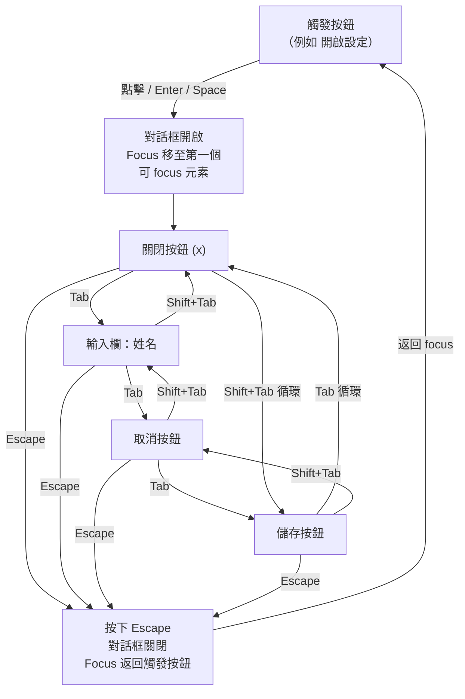

# 鍵盤導航與焦點管理

:::info
鍵盤無障礙性是所有其他輔助技術支援的基礎。凡是能用鍵盤操作的互動，就能被開關裝置、語音控制和絕大多數螢幕閱讀器使用。把鍵盤層做對，其他的事情就容易多了。
:::

## 情境

### 誰依賴鍵盤導航？

鍵盤導航不是小眾需求。廣泛的使用者群體都依賴它：

- **肢體障礙使用者**：患有腦性麻痺、多發性硬化症、ALS 或重複性勞損的使用者，可能無法以足夠的精準度操作滑鼠，甚至完全無法使用。他們完全依靠鍵盤，或依靠模擬鍵盤輸入的輔助裝置（開關裝置、吸吹控制器、眼動追蹤系統）。
- **進階使用者與開發者**：許多有經驗的使用者偏好鍵盤導航以求速度。Tab、方向鍵和鍵盤快捷鍵可以減少手部移動，加速在長表單和資料表格中的導覽。
- **語音控制軟體使用者**：Dragon NaturallySpeaking（Dragon）等應用程式讓使用者可以用語音指令控制電腦。語音控制依賴與鍵盤導航相同的底層無障礙 API。如果一個控制項無法獲得 focus，Dragon 就無法透過語音啟動它。
- **螢幕閱讀器使用者**：雖然螢幕閱讀器有自己的導覽模式（標題導覽、地標導覽），但操作互動控制項時，同樣依賴作者實作的鍵盤互動模式。螢幕閱讀器使用者在操作強制型對話框或資料格時，完全依賴已實作的鍵盤行為。

與鍵盤存取最直接相關的 WCAG 2.1 成功準則：

- **2.1.1 鍵盤（Level A）**：所有功能均可透過鍵盤介面操作。這是 Level A 要求——最低基準線。
- **2.1.2 無鍵盤陷阱（Level A）**：若鍵盤 focus 移入某元件，則可以僅用鍵盤將 focus 移出。
- **2.4.3 Focus 順序（Level A）**：導覽順序能保留意義與可操作性。
- **2.4.7 Focus 可見（Level AA）**：任何可鍵盤操作的 UI 元件都有可見的 focus 指示器。
- **2.4.11 Focus 外觀（Level AA，WCAG 2.2）**：focus 指示器符合最低尺寸與對比度要求。

### Tab 順序與 DOM 順序

瀏覽器根據 DOM 結構決定 tab 順序。預設情況下，所有原生可 focus 的元素——`<a href>`、`<button>`、`<input>`、`<select>`、`<textarea>`、`<details>`——按照它們在 DOM 中出現的順序接收 focus。

這建立了一個簡單而強大的規則：**視覺佈局應該與 DOM 順序一致**。當 CSS 用於視覺上重新排列元素時（透過 `flex-direction: row-reverse`、`order` 屬性、CSS grid 定位或 `position: absolute`），視覺順序與 DOM 順序可能出現分歧。鍵盤使用者和螢幕閱讀器使用者遵循 DOM 順序；視力正常的滑鼠使用者遵循視覺順序。結果是令人迷惑的不一致：focus 跳躍看起來相對於螢幕上可見內容向前或向後跳過。

`tabindex` 屬性以三種方式修改這個預設行為：

| 值 | 效果 |
|---|---|
| `tabindex="-1"` | 從自然 tab 順序中移除；元素仍可透過 `.focus()` 程式化接收 focus |
| `tabindex="0"` | 在元素的 DOM 位置將其加入自然 tab 順序（適用於需要可 focus 的非 focus 元素） |
| `tabindex="1"` 或任何正值 | 將元素移至 tab 順序的最前面，在所有 `tabindex="0"` 和原生可 focus 元素之前 |

第三種情況——正數 tabindex——是反模式。請參閱「設計思維」了解原因。

### Focus 指示器

Focus 指示器是顯示當前哪個元素具有鍵盤 focus 的視覺信號。沒有它，鍵盤使用者就無法知道自己在頁面上的位置。

瀏覽器提供預設的 focus 指示器——通常是藍色外框（Chrome/Edge）或點狀環（Firefox）。這些預設值常被 CSS reset 或設計系統樣式表透過 `outline: none` 或 `outline: 0` 移除。

CSS 提供兩個虛擬類別（pseudo-class）來設定 focus 樣式：

- `:focus` — 每當元素具有 focus 時應用，無論 focus 是如何接收的（鍵盤、滑鼠點擊、觸控、程式化 `.focus()`）。
- `:focus-visible` — 僅在瀏覽器判斷應顯示 focus 指示器時應用。這通常是透過鍵盤接收 focus 時，或元素是 `<input>` 或表單控制項時。大多數元素上，從滑鼠點擊接收的 focus 不會觸發 `:focus-visible`。

### Focus 陷阱（Focus Traps）

Focus 陷阱是刻意的行為：鍵盤 focus 被約束在頁面的特定區域內。當強制型對話框（modal dialog）開啟時，focus 不得逃出到背景內容中。使用者反覆按 Tab 時，必須循環瀏覽對話框內的可 focus 元素——按到最後一個時，Tab 再次回到第一個。Shift+Tab 反向循環。

現代 HTML 方法使用 `inert` 屬性設定在背景內容上。帶有 `inert` 的元素不可互動：無法接收 focus、滑鼠事件或選取，也從無障礙樹中移除。對開啟對話框外的所有內容設定 `inert`，focus 就自然被限制在對話框內，無需手動攔截鍵盤事件。

舊方法攔截 Tab 和 Shift+Tab 的 `keydown` 事件，查詢對話框內所有可 focus 的元素，並手動管理循環。這容易出錯：正確計算可 focus 元素列表比看起來難，對話框內動態新增的元素也必須追蹤。

### 命令式 focus 管理

瀏覽器的原生 focus 行為自動處理大多數情況。但有幾種情況需要透過 `.focus()` 進行明確的、命令式的 focus 管理：

1. **開啟強制型對話框後**：將 focus 移到對話框內第一個可 focus 的元素（或如果對話框元素本身有 `role="dialog"` 和 `tabindex="-1"`，則移到對話框元素）。否則，focus 停留在對話框背後的觸發按鈕上——螢幕閱讀器使用者被困在背景內容中。
2. **關閉強制型對話框後**：將 focus 返回到觸發開啟對話框的元素。這保留了使用者在頁面上的位置。
3. **刪除列表項目後**：如果被刪除的項目持有 focus，將 focus 移到下一個項目，若沒有下一個則移到前一個，若列表現在為空則移到列表容器。讓 focus 消失到 `<body>` 會迫使螢幕閱讀器使用者重新導覽到他們的位置。
4. **單頁應用程式路由切換後**：瀏覽器原生會在導覽時將 focus 移到頁面頂部。SPA 在 JavaScript 中處理路由，不觸發這個瀏覽器行為。若沒有手動 focus 管理，螢幕閱讀器使用者可能停留在前一個路由的舊元素上。

### Skip links

Skip links 是放在頁面開頭的隱藏錨點連結，讓鍵盤使用者可以跳過重複的導覽。如果沒有，鍵盤使用者每次載入頁面都要先按 Tab 跳過所有導覽項目才能到達主要內容。對於有二十個導覽連結的標頭，這意味著每個頁面、每次都要按二十次 Tab。

Skip link 通常是頁面上第一個可 focus 的元素。它在視覺上隱藏，直到獲得 focus 時才出現，讓使用者能啟動它並跳到主要內容區域。

### React Aria 和 Vue 中的 focus 管理

元件庫提供了 focus 管理的抽象：

**React Aria 的 `FocusScope`**：一個將 Tab 導覽約束在其子元素內的元件。`contain` prop 啟動 focus 陷阱行為；`autoFocus` 在掛載時自動 focus 第一個可 focus 的子元素。在 `useDialog`、`useModal` 和其他 hooks 內部使用。

**Vue 的 `useFocusTrap`**（來自 VueUse 或類似庫）：一個程式化地將 focus 陷入目標元素的 composable。啟動後，Tab 和 Shift+Tab 被攔截，並在元素的可 focus 後代間循環。

這兩種抽象都處理了查詢可 focus 元素、管理 Tab 循環和在清理時恢復 focus 的複雜性——這就是為什麼使用庫實作幾乎總是比手寫陷阱更可取。

## 最佳實踐

**禁止（MUST NOT）使用 `outline: none` 或 `outline: 0` 而不提供可見的替代焦點指示器。** 移除瀏覽器預設的焦點環而不加替代方案，會讓所有依賴鍵盤的使用者完全看不到焦點位置，直接違反 WCAG 2.4.7（焦點可見）。請使用 `:focus-visible` 提供自訂指示環，讓它只在鍵盤操作時出現，而不在滑鼠點擊時出現。

**應該（SHOULD）在關鍵狀態轉換後主動管理焦點。** 強制型對話框開啟時，將焦點移至其中第一個可聚焦的元素；關閉時，將焦點返還給觸發元素。SPA 路由切換後，將焦點移至新頁面的標題或 live region 通知。刪除已聚焦的列表項目後，將焦點移至下一個兄弟元素、前一個兄弟元素，或若清單已空則移至容器——絕對不要讓焦點消失到 `<body>`。

**禁止（MUST NOT）使用大於零的 `tabindex` 值。** 正數 tabindex 值（`tabindex="1"`、`tabindex="2"` 等）會建立兩階段焦點順序，先訪問所有正數 tabindex 元素，再依 DOM 順序訪問原生可聚焦元素，覆寫 DOM 順序的結果是非線性、難以預測的 Tab 序列，對鍵盤使用者造成混亂。請使用 `tabindex="0"` 將元素按其 DOM 位置加入自然 tab 順序，以及 `tabindex="-1"` 僅供程式化聚焦使用。

## 設計思維

### 為什麼 tabindex > 0 破壞無障礙性

正數 tabindex 值建立了兩階段的 tab 順序。瀏覽器先按 DOM 順序訪問所有 `tabindex="1"` 的元素，然後是 `tabindex="2"` 的元素，以此類推——只有在耗盡所有正數 tabindex 元素後，才繼續處理原生可 focus 元素和 `tabindex="0"` 元素（按 DOM 順序）。

在實踐中，開發者很少使用一致的、有計畫的正數 tabindex 方案。通常發生的情況是：某個元件為按鈕加上 `tabindex="3"` 因為有人希望它「提早」被 focus，另一個元件後來加上 `tabindex="1"` 作為快速修復，結果是 tab 順序與視覺佈局完全沒有關係。

即使有計畫的方案，正數 tabindex 也很脆弱：在頁面任何位置新增一個 `tabindex="2"` 元素，就會改變所有其他元素的 focus 順序。視覺順序和 tab 順序會隨時間產生偏差。鍵盤使用者會發現 Tab 帶他們到意想不到的地方，而沒有任何可見信號能解釋這個跳躍。

正確的解決方案是修正 DOM 順序使其與視覺順序一致，或使用不破壞 DOM 位置與視覺位置關係的 CSS。讓自然 tab 順序做它的工作。

### 為什麼 :focus-visible 取代了 :focus

原始的 CSS `:focus` 虛擬類別是為鍵盤導覽設計的，但應用於所有 focus 事件，包括滑鼠點擊。當設計師用醒目的 focus 環設計 `button:focus` 時，用滑鼠點擊按鈕的使用者會看到環出現並保持，直到他們點擊其他地方。這被認為視覺上嘈雜，且與原生應用程式行為不一致——原生應用程式中，focus 環在鍵盤互動時出現，但在滑鼠點擊時不出現。

常見的回應是用 `button:focus { outline: none }` 完全移除 focus 指示器——這通常被全域應用在 CSS reset 中。這解決了「滑鼠點擊時出現 focus 環」的問題，但摧毀了所有使用者的鍵盤導覽能力。

`:focus-visible` 正是為了解決這個矛盾而引入的。瀏覽器使用啟發式方法應用 `:focus-visible`：如果使用者使用鍵盤（最近一次互動是按鍵），則在元素獲得 focus 時應用 `:focus-visible`。如果使用者使用滑鼠，大多數元素在點擊時不會接收 `:focus-visible`。

結果是：設計師在滑鼠點擊按鈕時得到了乾淨的視覺效果，鍵盤使用者保留了他們所依賴的可見 focus 指示器。兩個需求都由同一個 CSS 規則滿足。

現代模式是：

```css
/* 為滑鼠使用者移除預設環 */
:focus:not(:focus-visible) {
  outline: none;
}

/* 為鍵盤使用者顯示自訂環 */
:focus-visible {
  outline: 3px solid #005fcc;
  outline-offset: 2px;
}
```

或者更簡潔地，只設定 `:focus-visible` 的樣式，讓瀏覽器正確應用啟發式方法。

### 為什麼 SPA 路由切換後的 focus 管理很重要

在傳統的多頁應用程式中，每次點擊連結都會導致完整的頁面載入。瀏覽器丟棄當前頁面，載入新文件，並將 focus 放在文件主體上。螢幕閱讀器使用者被定位在新頁面的頂部，可以從那裡使用標題、地標或順序 Tab 開始導覽。

單頁應用程式攔截連結點擊並透過操作 DOM 更新頁面內容——不發生頁面載入。從瀏覽器的角度來看，文件沒有改變。Focus 停留在原來的位置：被點擊的連結上，或導覽前具有 focus 的任何元素上。

對於螢幕閱讀器使用者，這意味著：
- 如果他們啟動了「設定」連結，focus 停留在「設定」連結上——即使設定頁面現在已經渲染。
- 他們沒有頁面已變更的信號。螢幕閱讀器不宣告頁面轉換。
- 他們被困在舊頁面情境中的過時位置。

修復方法是檢測路由變化並命令式地將 focus 移到合理的位置：新頁面的 `<h1>`、skip link 目標，或帶有 `aria-live` 的專用「頁面已載入」宣告區域。React Router 的 focus 管理功能、Next.js 的 focus 處理和 Nuxt 的過渡效果都試圖解決這個問題——但責任常常落在應用程式作者身上。

### inert 屬性作為現代 focus 陷阱解決方案

`inert` 屬性於 2022 年加入 HTML，現在所有現代瀏覽器都支援，是 focus 陷阱的宣告式解決方案。

在 `inert` 之前，focus 陷阱需要：
1. 查詢對話框內所有可 focus 的元素。
2. 攔截 `keydown` Tab 和 Shift+Tab 事件。
3. 計算第一個和最後一個可 focus 的元素。
4. 當 Tab 要移過最後一個元素或 Shift+Tab 要移過第一個元素時，手動重新導向 focus。
5. 同時防止點擊背景內容。

這個查詢欺騙性地困難：什麼算可 focus？`tabindex="-1"` 的元素可以程式化 focus 但不能鍵盤 focus。禁用的表單元素不可 focus。隱藏容器內的可見元素不可 focus。正確的查詢需要檢查可見性、禁用狀態、tabindex 和元素類型。

`inert` 屬性宣告式地處理了所有這些。對元素設定 `inert` 使它和所有後代：
- 不可 focus（鍵盤和程式化）
- 不可點擊
- 在無障礙樹中不可見

對開啟對話框外的所有內容——通常是 `<main>` 內容和其他地標——設定 `inert`，意味著 focus 自然被限制在對話框中，無需鍵盤事件攔截。

```js
// 開啟 modal：使背景 inert
document.getElementById('main-content').inert = true;
document.getElementById('sidebar').inert = true;
dialogEl.removeAttribute('inert');
dialogEl.querySelector('[autofocus], button, [href], input').focus();

// 關閉 modal：恢復
document.getElementById('main-content').inert = false;
document.getElementById('sidebar').inert = false;
triggerEl.focus();
```

限制是較舊的瀏覽器支援——`inert` 在 Internet Explorer 中不可用，且直到最近才在 Safari（2022 年 3 月）中推出。對於需要支援較舊瀏覽器的目標，需要 polyfill 或手動陷阱。

## 視覺

### 強制型對話框中的 focus 陷阱循環

當強制型對話框開啟時，Tab 必須在對話框內的可 focus 元素間循環。Shift+Tab 反向。Escape 關閉對話框並將 focus 返回到觸發它的元素。



圖表顯示完整的循環。Tab 按 DOM 順序向前遍歷所有可 focus 元素；在最後一個元素（儲存按鈕）上按 Tab 時，focus 回到第一個元素（關閉按鈕）。Shift+Tab 向後遍歷；在第一個元素上按 Shift+Tab 時，focus 回到最後一個。Escape 是退出鍵，摧毀陷阱並將 focus 返回原始觸發器。

## 範例

### 1. Tab 順序：自然 DOM 順序 vs tabindex > 0 反模式

```html
<!-- BAD：tabindex > 0 建立自訂的、令人困惑的 tab 順序 -->
<!-- Tab 順序將是：「送出」(tabindex=3)、「電子郵件」(tabindex=2)、「姓名」(tabindex=1) -->
<!-- 這對鍵盤使用者反轉了視覺順序 -->
<form>
  <label for="name">姓名</label>
  <input id="name" type="text" tabindex="1">

  <label for="email">電子郵件</label>
  <input id="email" type="text" tabindex="2">

  <button type="submit" tabindex="3">送出</button>
</form>

<!-- GOOD：讓 DOM 順序成為 tab 順序 -->
<!-- Tab 順序自然跟隨視覺順序 -->
<form>
  <label for="name">姓名</label>
  <input id="name" type="text">

  <label for="email">電子郵件</label>
  <input id="email" type="text">

  <button type="submit">送出</button>
</form>

<!-- tabindex="-1" 的可接受用法：可程式化 focus，但不在 tab 順序中 -->
<div id="dialog" role="dialog" aria-modal="true" tabindex="-1">
  <!-- 對話框內容 -->
</div>
<!-- 稍後在 JS 中：document.getElementById('dialog').focus() -->
```

### 2. :focus vs :focus-visible

```css
/* BAD：outline:none 而不提供替代方案——鍵盤使用者完全失去 focus 指示器 */
button:focus {
  outline: none;
}

/* ALSO BAD：:focus 在滑鼠點擊時也顯示環——這導致了 outline:none 濫用的問題 */
button:focus {
  outline: 3px solid #005fcc;
}
/* 用滑鼠點擊任何按鈕都會顯示環，直到使用者點擊其他地方 */

/* GOOD：:focus-visible——鍵盤時顯示環，滑鼠時隱藏 */
button:focus-visible {
  outline: 3px solid #005fcc;
  outline-offset: 2px;
  border-radius: 2px;
}

/* 可選地為滑鼠使用者抑制預設瀏覽器環，同時保留 :focus-visible */
button:focus:not(:focus-visible) {
  outline: none;
}
```

### 3. outline: none 反模式與替代方案

```css
/* BAD：全域 outline reset——摧毀所有使用者的鍵盤導覽能力 */
* {
  outline: none; /* 或 outline: 0 */
}

/* BAD：元件層級的抑制而沒有替代方案 */
.custom-button:focus {
  outline: none;
  /* 什麼都沒有加——鍵盤使用者看不到 focus 在哪裡 */
}

/* GOOD：移除預設，提供自訂指示器 */
.custom-button:focus {
  outline: none; /* 移除瀏覽器預設 */
  box-shadow: 0 0 0 3px rgba(0, 95, 204, 0.5); /* 使用 box-shadow 自訂環 */
}

/* BETTER：使用 :focus-visible 讓環只在鍵盤操作時出現 */
.custom-button:focus-visible {
  outline: 3px solid #005fcc;
  outline-offset: 2px;
}

.custom-button:focus:not(:focus-visible) {
  outline: none;
}

/* WCAG 2.2 focus 外觀的最低要求（2.4.11）：
   - focus 指示器面積 >= 元件周長 * 2 CSS 像素
   - focus 和非 focus 狀態間對比度 >= 3:1 */
```

### 4. Skip link 實作

```html
<!-- 將此放在 <body> 的第一個元素 -->
<a href="#main-content" class="skip-link">跳至主要內容</a>

<!-- 目標地標 -->
<main id="main-content" tabindex="-1">
  <!-- 頁面內容 -->
</main>
```

```css
/* 視覺上隱藏直到獲得 focus */
.skip-link {
  position: absolute;
  top: -100%;
  left: 0;
  padding: 0.5rem 1rem;
  background: #005fcc;
  color: #fff;
  font-weight: bold;
  z-index: 9999;
  text-decoration: none;
  border-radius: 0 0 4px 0;
  /* transition 讓它平滑滑入 */
  transition: top 0.1s;
}

.skip-link:focus {
  top: 0;
}
```

`<main>` 上的 `tabindex="-1"` 很重要：它讓錨點目標在 skip link 被啟動時可以接收程式化 focus，確保瀏覽器滾動到正確位置，且螢幕閱讀器從那裡開始閱讀。

### 5. 強制型對話框中的 focus 陷阱

#### 手動實作（不使用庫）

```js
function openDialog(dialogEl, triggerEl) {
  // 儲存觸發器以便在關閉時恢復 focus
  dialogEl._trigger = triggerEl;

  // 使背景 inert（現代方法）
  document.getElementById('app').inert = true;

  // 顯示對話框
  dialogEl.removeAttribute('hidden');
  dialogEl.removeAttribute('inert');

  // 將 focus 移入對話框
  const firstFocusable = dialogEl.querySelector(
    'button, [href], input, select, textarea, [tabindex]:not([tabindex="-1"])'
  );
  if (firstFocusable) firstFocusable.focus();
}

function closeDialog(dialogEl) {
  // 恢復背景
  document.getElementById('app').inert = false;

  // 隱藏對話框
  dialogEl.setAttribute('hidden', '');

  // 將 focus 返回觸發器
  if (dialogEl._trigger) {
    dialogEl._trigger.focus();
    dialogEl._trigger = null;
  }
}

// Escape 鍵處理器
document.addEventListener('keydown', (e) => {
  if (e.key === 'Escape') {
    const openDialog = document.querySelector('[role="dialog"]:not([hidden])');
    if (openDialog) closeDialog(openDialog);
  }
});
```

#### React Aria FocusScope

> **關於 import 路徑的說明：** 以下範例使用 `@react-aria/*` hooks 分散式套件（如 `@react-aria/focus`、`@react-aria/dialog`）。較新的專案可改用 `react-aria-components`，它提供更高層次的元件化 API，並將所有 hooks 整合在單一套件中。

```jsx
import { FocusScope } from '@react-aria/focus';
import { useDialog } from '@react-aria/dialog';
import { useOverlay } from '@react-aria/overlays';

function Modal({ isOpen, onClose, children, title }) {
  const ref = useRef(null);
  const { overlayProps } = useOverlay({ isOpen, onClose, isDismissable: true }, ref);
  const { dialogProps, titleProps } = useDialog({}, ref);

  if (!isOpen) return null;

  const overlayStyle = { position: 'fixed', inset: 0, background: 'rgba(0,0,0,0.5)' };

  return (
    <div style={overlayStyle}>
      {/* FocusScope contain=true 陷阱 focus；autoFocus 自動 focus 第一個子元素 */}
      <FocusScope contain restoreFocus autoFocus>
        <div
          {...overlayProps}
          {...dialogProps}
          ref={ref}
          role="dialog"
          aria-modal="true"
          aria-labelledby="dialog-title"
        >
          <h2 {...titleProps} id="dialog-title">{title}</h2>
          {children}
          <button onClick={onClose}>關閉</button>
        </div>
      </FocusScope>
    </div>
  );
}
```

帶有 `contain` 的 `FocusScope` 自動處理 Tab/Shift+Tab 循環。`restoreFocus` 在 `FocusScope` 卸載時將 focus 返回先前 focus 的元素。`autoFocus` 在掛載時將 focus 移至第一個可 focus 的後代。

#### Vue useFocusTrap（VueUse）

```vue
<script setup>
import { ref, watch } from 'vue';
import { useFocusTrap } from '@vueuse/integrations/useFocusTrap';

const props = defineProps({ isOpen: Boolean });
const emit = defineEmits(['close']);

const dialogEl = ref(null);
const { activate, deactivate } = useFocusTrap(dialogEl, {
  // 陷阱停用時將 focus 返回觸發器
  returnFocusOnDeactivate: true,
  // Escape 鍵停用並關閉
  onDeactivate: () => emit('close'),
});

watch(() => props.isOpen, (open) => {
  if (open) activate();
  else deactivate();
});
</script>

<template>
  <div
    v-if="isOpen"
    ref="dialogEl"
    role="dialog"
    aria-modal="true"
    aria-labelledby="dialog-title"
  >
    <h2 id="dialog-title">對話框標題</h2>
    <button @click="$emit('close')">關閉</button>
    <slot />
  </div>
</template>
```

### 6. 關閉 modal 後命令式 focus 返回觸發器

```js
// 模式：在開啟 modal 之前始終儲存觸發器參考
let lastFocusedElement = null;

function openModal(triggerElement) {
  // 捕獲當前 focus 位置
  lastFocusedElement = triggerElement || document.activeElement;

  const modal = document.getElementById('my-modal');
  modal.removeAttribute('hidden');

  // 將 focus 移入 modal
  const focusTarget = modal.querySelector('[autofocus]')
    || modal.querySelector('button, input, [href], select, textarea');
  if (focusTarget) focusTarget.focus();
}

function closeModal() {
  const modal = document.getElementById('my-modal');
  modal.setAttribute('hidden', '');

  // 將 focus 返回開啟 modal 的元素
  if (lastFocusedElement) {
    lastFocusedElement.focus();
    lastFocusedElement = null;
  }
}
```

```jsx
// React 模式：用 useRef 捕獲觸發器
function App() {
  const [isOpen, setIsOpen] = useState(false);
  const openButtonRef = useRef(null);

  return (
    <>
      <button ref={openButtonRef} onClick={() => setIsOpen(true)}>
        開啟設定
      </button>

      {isOpen && (
        <Modal
          onClose={() => {
            setIsOpen(false);
            // FocusScope restoreFocus 自動處理這個，
            // 但手動方式：openButtonRef.current?.focus()
          }}
          title="設定"
        >
          {/* modal 內容 */}
        </Modal>
      )}
    </>
  );
}
```

### 7. SPA 路由切換後的 focus 管理

```js
// React Router v6——導覽後 focus 頁面標題
import { useEffect, useRef } from 'react';
import { useLocation } from 'react-router-dom';

function RouteChangeAnnouncer() {
  const location = useLocation();
  const headingRef = useRef(null);

  useEffect(() => {
    // 路由切換後，focus 主要標題或 skip link 目標
    if (headingRef.current) {
      headingRef.current.focus();
    }
  }, [location.pathname]);

  return (
    <h1 ref={headingRef} tabIndex={-1} className="route-heading">
      {/* 每個路由設定頁面標題 */}
    </h1>
  );
}
```

在樣式表中加入以下規則，抑制標題被程式化 focus 時（非鍵盤觸發）出現的 focus 環：

```css
/* 抑制程式化 focus 標題上的 focus 環（非鍵盤觸發） */
.route-heading:focus {
  outline: none;
}
```

```js
// Vue Router——在 afterEach 守衛中管理 focus
router.afterEach(() => {
  // 等一個 tick 讓 DOM 更新
  nextTick(() => {
    const heading = document.querySelector('main h1');
    if (heading) {
      heading.setAttribute('tabindex', '-1');
      heading.focus();
      // 可選地在 focus 後移除 tabindex 以避免視覺指示器
      // heading.removeAttribute('tabindex');
    }
  });
});
```

## 常見錯誤

### 使用 aria-hidden 隱藏背景，然後疑惑為何 focus 還是逃脫

```html
<!-- WRONG：aria-hidden 本身不能阻止 focus -->
<div id="background" aria-hidden="true">
  <button>背景按鈕</button>
  <!-- 鍵盤使用者仍然可以 Tab 到這裡 -->
</div>

<!-- CORRECT 方案 1：inert 屬性 -->
<div id="background" inert>
  <button>背景按鈕</button>
</div>

<!-- CORRECT 方案 2：display:none（也從 tab 順序中移除） -->
<div id="background" style="display:none">
  <button>背景按鈕</button>
</div>
```

### Skip link 目標無法接收 focus

```html
<!-- WRONG：點擊 skip link 滾動到 #main 但 focus 停留在連結上 -->
<main id="main-content">
  <!-- 缺少 tabindex="-1"；點擊 skip link 不移動 focus -->
</main>

<!-- CORRECT：tabindex="-1" 讓目標可以接收程式化 focus -->
<main id="main-content" tabindex="-1">
  <!-- 現在 skip link 啟動將 focus 移到這裡 -->
</main>
```

### 建立透過可滾動區域或 iframe 洩漏 focus 的陷阱

當 modal 包含 iframe 或有自己可 focus 內容的可滾動元素時，手動 focus 陷阱通常會漏掉這些。對標準 DOM 元素有效的可 focus 元素查詢，可能無法考慮到 iframe 內容或帶有 overflow scroll 的元素。使用經過驗證的庫（`FocusScope`、`focus-trap`）而非自己手寫陷阱。

### 在刪除列表項目後不處理 focus

```js
// WRONG：刪除有 focus 的列表項目，focus 消失到 <body>
list.removeChild(focusedItem);

// CORRECT：在刪除前或後將 focus 移到相鄰項目
const nextItem = focusedItem.nextElementSibling || focusedItem.previousElementSibling;
list.removeChild(focusedItem);
if (nextItem) nextItem.focus();
else list.focus(); // 若列表為空則退回到容器
```

### 假設所有使用者都使用滑鼠而設計 hover-only 互動

使用 `:hover` 觸發的互動（tooltip、下拉選單、選項顯示）對鍵盤使用者不可用。每個 `:hover` 互動都必須有對應的 `:focus` 或 `:focus-visible` 替代方案，且對應的功能也必須可透過鍵盤觸發。

```css
/* WRONG：只在 hover 時顯示操作 */
.card:hover .card-actions {
  display: block;
}

/* CORRECT：hover 和 focus-within 都要顯示 */
.card:hover .card-actions,
.card:focus-within .card-actions {
  display: block;
}
```

## 相關 FEE

- [FEE-1000: Accessibility Overview](1000.md)
- [FEE-1001: ARIA & Semantic HTML](1001.md)
- [FEE-1007: Accessible Component Patterns](1007.md)

## 參考資料

- [WCAG 2.1 成功準則 2.1.1：鍵盤 — W3C](https://www.w3.org/TR/WCAG21/#keyboard)
- [WCAG 2.2 成功準則 2.4.11：Focus 外觀 — W3C](https://www.w3.org/TR/WCAG22/#focus-appearance)
- [:focus-visible CSS 選擇器 — MDN Web Docs](https://developer.mozilla.org/en-US/docs/Web/CSS/:focus-visible)
- [inert 屬性 — HTML 規格，WHATWG](https://html.spec.whatwg.org/multipage/interaction.html#the-inert-attribute)
- [鍵盤介面管理 focus — W3C ARIA 創作實踐指南](https://www.w3.org/WAI/ARIA/apg/practices/keyboard-interface/)
- [Skip 導覽連結 — WebAIM](https://webaim.org/techniques/skipnav/)
- [React Aria FocusScope — Adobe Spectrum](https://react-spectrum.adobe.com/react-aria/FocusScope.html)
- [SPA 路由切換的 Focus 管理 — Marcy Sutton](https://accessible-react.com/routing)
