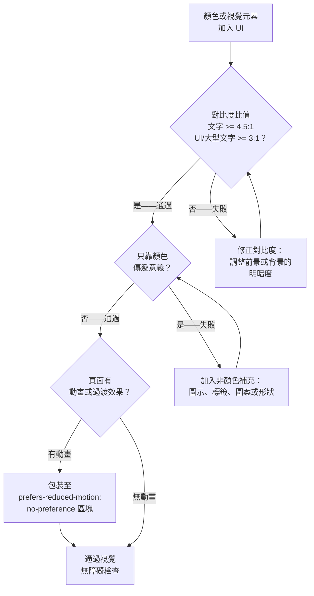

# 顏色、對比度與視覺無障礙

:::info
顏色是 UI 設計中最容易被過度依賴的溝通媒介，而對比度則是最常被違反的 WCAG 準則。正確處理顏色，意味著理解相對亮度的數學原理、色覺缺陷的生理基礎，以及自適應色彩系統的工程實踐。
:::

## 情境

### 哪些使用者受到顏色與對比度設計不當的影響？

顏色與對比度的不良決策，影響的使用者族群遠比大多數團隊預期的更廣：

- **低視力使用者**：全球約有 2.46 億人有中度至重度視力障礙。許多人的對比敏感度下降——他們能看到顏色，但低對比度的文字或 UI 元素若無放大輔助，難以甚至無法閱讀。低對比度文字直接違反 WCAG 1.4.3。
- **色盲使用者**：北歐裔男性中約有 8%、女性中約有 0.5% 具有某種形式的色覺缺陷。Deuteranopia（對綠色敏感度降低）與 protanopia（對紅色敏感度降低）加在一起，讓紅綠辨別對這族群而言不可靠。沒有輔助圖示或標籤的紅色錯誤狀態，對這些使用者而言根本看不出是錯誤。
- **老齡使用者**：對比敏感度隨年齡下降。70 歲時，水晶體泛黃、瞳孔收縮，需要約比年輕成人多一倍的對比度才能達到相當的可讀性。
- **光敏症使用者**：高亮度背景或高飽和度的配色可能對有光敏症的使用者引發不適或偏頭痛。深色模式可降低亮度負荷。
- **閱讀障礙使用者**：高對比純黑白文字對部分閱讀障礙讀者可能造成視覺上的「炫光」效果，讓文字看起來閃爍或游移。略帶米色的背景（如 #f8f8f8 或暖色調）在維持足夠對比度的同時，能緩解此問題。
- **前庭功能障礙使用者**：動畫、視差效果和動態效果可能對前庭功能障礙使用者引發眩暈和噁心。約有 35% 的 40 歲以上成人曾經歷前庭功能障礙。`prefers-reduced-motion` media query 能讓這些使用者選擇退出。
- **Windows 高對比模式使用者**：Windows 使用者可啟用高對比模式，以有限的系統調色盤覆蓋所有作者定義的顏色。若網站將顏色相依的資訊置於沒有結構性或語意性備援的位置，在此模式下將完全失效。

### WCAG 對比度要求

WCAG 2.1 在成功標準 1.4.3（對比度，最低要求）的 AA 等級，以及 1.4.6（對比度，加強版）的 AAA 等級，都有對比度規定。另一個標準 1.4.11（非文字對比度）則涵蓋 UI 元件和圖形物件。

| WCAG 標準 | 等級 | 要求 | 適用範圍 |
|---|---|---|---|
| 1.4.3 對比度（最低） | AA | 4.5:1 | 一般文字（< 18pt / < 14pt 粗體） |
| 1.4.3 對比度（最低） | AA | 3:1 | 大型文字（>= 18pt 或 >= 14pt 粗體） |
| 1.4.6 對比度（加強） | AAA | 7:1 | 一般文字 |
| 1.4.6 對比度（加強） | AAA | 4.5:1 | 大型文字 |
| 1.4.11 非文字對比度 | AA | 3:1 | UI 元件（邊框、圖示、焦點指示器）、圖形物件 |

對比度的計算公式為 `(L1 + 0.05) / (L2 + 0.05)`，其中 L1 是較亮顏色的相對亮度，L2 是較暗顏色的相對亮度。

### 檢查對比度的工具

幾個工具讓開發與設計期間的對比度驗證變得可行：

- **WebAIM Contrast Checker**（webaim.org/resources/contrastchecker/）：輸入前景與背景的十六進位色碼，立即顯示對比度數值、AA 通過/失敗、AAA 通過/失敗。
- **Chrome DevTools**：在元素面板中點擊任何 CSS 顏色值，會開啟一個顯示計算對比度的顏色選取器。工具提示會以勾號標示 AA 通過與 AAA 通過。
- **axe DevTools**（瀏覽器擴充套件）：對渲染頁面執行自動化無障礙稽核，標記對比度失敗項目，顯示實際比值和最低要求比值，並連結至 WCAG 標準。
- **Figma 外掛**：對比度外掛（Able、Contrast、A11y Annotation Kit）讓設計師在實作前，直接在設計稿中驗證對比度。

### 色盲：類型與盛行率

色覺缺陷是遺傳的（X 染色體隱性遺傳），影響視網膜中的錐狀細胞：

- **Deuteranopia**（最常見）：M 錐體（中波長，對綠色敏感）缺失或功能異常。影響約 6% 的男性。紅色與綠色看起來像黃棕色調。這就是多數人聽過的「紅綠色盲」。
- **Protanopia**：L 錐體（長波長，對紅色敏感）缺失或功能異常。影響約 2% 的男性。紅色看起來非常暗；紅綠辨別能力喪失。
- **Tritanopia**（罕見）：S 錐體（短波長，對藍色敏感）功能異常。影響不到 0.01% 的人口。藍黃辨別能力喪失。
- **Achromatopsia**：完全缺乏色覺（單色視覺）。極為罕見（三萬分之一）。所有色彩資訊喪失，視覺呈灰度。

合計起來，約 8% 的男性無法可靠地辨別紅色與綠色。任何只用紅色和綠色作為唯一區分符號的 UI——錯誤對成功、允許對禁止、選中對未選中——對這些使用者都是無效的。

### 不要只靠顏色傳遞資訊

WCAG 1.4.1（顏色的使用，A 等級）規定：「顏色不得作為傳達資訊、指示行動、提示回應或區分視覺元素的唯一視覺手段。」

這是 A 等級標準——最低基準。只靠顏色傳遞資訊不是 AA 或 AAA 的問題；它是地板要求。

修正方式是始終以下列其中一種方式補充顏色：
- **圖示**：錯誤用紅色圓圈加 X，成功用綠色勾號，警告用黃色三角形驚嘆號。
- **標籤**：在顏色旁加上「Error」、「Success」或「Warning」文字。
- **圖案**：在圖表與資料視覺化中，除顏色外使用斜線、虛線或形狀差異。
- **位置或形狀**：錯誤訊息置於欄位下方，成功指示用特定形狀。

### 深色模式：prefers-color-scheme

`prefers-color-scheme` CSS media query 自 2019 年起在所有現代瀏覽器中受支援，反映使用者作業系統的配色偏好（淺色或深色）。CSS 自訂屬性（custom properties）是實作深色模式主題的慣用方式，因為它們可以串聯並在 DOM 的任何層級被覆蓋。

### 減少動態效果：prefers-reduced-motion

`prefers-reduced-motion` CSS media query 反映使用者是否在作業系統無障礙設定中要求減少動態效果。前庭功能障礙——影響內耳平衡與空間定向系統的病症——會讓動畫和視差引發真實的身體症狀，包括眩暈、噁心和失向感。

此 media query 可用 `@media (prefers-reduced-motion: reduce)` 或 `@media (prefers-reduced-motion: no-preference)` 在 CSS 中使用。`no-preference` 值作為基礎更安全：在 `no-preference` 下定義動畫，預設值（不在 `@media` 內）就已沒有動畫，對 `reduce` 使用者來說天然適合。

### 高對比模式：forced-colors

Windows 高對比模式（WHCM）是一種無障礙功能，以約七個顏色關鍵字（`ButtonText`、`Canvas`、`CanvasText`、`Highlight`、`HighlightText`、`LinkText`、`GrayText`）組成的系統調色盤覆蓋所有作者定義的顏色。CSS `background-image`、`box-shadow`、`text-shadow` 和大部分漸層效果都會被抑制。`forced-colors` media query 於 2020 年推出，讓作者能偵測此模式並調整樣式。

## 設計思維

### 為什麼對比度是數學問題

WCAG 對比度公式並非任意制定，而是源自人類視覺的**相對亮度**模型。sRGB 顏色的相對亮度（L）計算方式如下：

1. 將每個色頻（R、G、B）標準化到 0–1 範圍。
2. 套用伽瑪校正：若 `c <= 0.04045` 則 `c_linear = c / 12.92`，否則 `c_linear = ((c + 0.055) / 1.055) ^ 2.4`。
3. 計算 `L = 0.2126 * R_linear + 0.7152 * G_linear + 0.0722 * B_linear`。

色頻權重（0.2126、0.7152、0.0722）代表人類明視覺中每個原色對感知亮度的貢獻——綠色貢獻約 72% 的感知亮度，紅色約 21%，藍色約 7%。

**4.5:1 比值門檻**的選取，是因為它近似於視力 20/40（許多地區的合法駕駛標準）的人，在典型辦公室照明下閱讀一般大小文字所需的對比敏感度。視力 20/40 表示在 20 英尺處看到的，是視力正常者在 40 英尺處才能看到的——這是老花眼（年齡相關性遠視）或輕度低視力的常見結果。

**7:1 AAA 門檻**則是為視力 20/80 且有部分對比敏感度損失的使用者所設，大約是某些地區法定失明的門檻。

這種數學基礎意味著，對比度比值是真實世界可用性的預測指標，而非任意的合規目標。

### 為什麼只靠顏色傳遞資訊會失敗

色盲並不罕見。約每 12 名男性中有 1 人、每 200 名女性中有 1 人有某種形式的色覺缺陷。在一個日活 10,000 名使用者、性別分佈正常的產品中，大約有 400 名使用者無法可靠地辨別紅色與綠色。

以紅色高亮顯示的必填欄位——沒有星號、沒有標籤、沒有圖示——對 deuteranope 使用者毫無意義。有綠色正向趨勢和紅色負向趨勢的儀表板，對 protanope 使用者而言無從分辨。有紅色和綠色資料系列的圖表，對約 8% 的男性觀看者毫無意義。

這不是樣式偏好問題。這是一個將統計上顯著的使用者族群排除在外的結構性失敗。WCAG 1.4.1 是 A 等級——最低基準——因為 W3C 認識到，只靠顏色傳遞資訊是一種基本的排除機制。

設計解決方案無需任何創意妥協：一個圖示或標籤只需一行 HTML，代價幾乎為零，同時幫助所有使用者（多數使用者解讀標籤的速度快於解碼顏色語意）。

### 為什麼 prefers-reduced-motion 被嚴重低估

`prefers-reduced-motion` media query 在現代瀏覽器中有廣泛支援（自 2019 年起所有現代瀏覽器），但在生產環境 Web 應用程式中的實作率可能只有 5–10%。差距的根源是文化：動畫被視為精緻感和品牌質感的體現，而無障礙則在心理上被歸為另一個議題。

醫學現實是嚴峻的。前庭功能障礙——包括良性陣發性姿態性眩暈（BPPV）、前庭偏頭痛、梅尼爾病和迷路炎——估計影響 40 歲以上成人的 35%。對這些使用者而言，意外的視差滾動、自動播放的主視覺動畫，或持續移動的載入指示器，可能觸發長達數小時的眩暈。

實作成本極低。將動畫包裝在 `@media (prefers-reduced-motion: no-preference)` 中——而非使用 reduce 覆蓋模式——意味著預設沒有動畫。動畫對未要求減少效果的使用者是選擇性的。這是更安全的預設。

CSS 框架如 Tailwind CSS 為此提供了 `motion-safe:` 變體，讓任何動態工具類別只需加一個詞即可。

### 為什麼深色模式的無障礙性很重要

深色模式通常被視為美學或省電功能，但它有直接的無障礙影響：

- **光敏症**：有畏光症、偏頭痛或某些藥物引發光敏感的使用者，可能對高亮度白色背景感到真實的不適。深色模式降低峰值亮度。
- **閱讀障礙**：部分閱讀障礙使用者反映，純黑白文字會造成「視覺雜訊」效果，讓字母看起來像在顫動或游移。深色背景上的近黑文字（或深色背景上的米色文字）可以緩解此問題。
- **低光源環境**：在黑暗環境中使用的使用者，用深色模式避免視網膜適應問題，這種問題在返回一般視覺時令人不適。

深色模式的關鍵工程重點在於：**對比度要求不會因此降低**。在淺色模式下通過 4.5:1 的配色，在深色模式下也必須通過 4.5:1。許多深色模式實作天真地交換顏色（黑變白、白變黑），卻沒有重新驗證強調色、連結色或淡化文字的對比度。結果是一個深色模式在淺色模式通過 WCAG 的同時，自身卻未通過。

## 最佳實踐

**應該（SHOULD）讓整個介面符合 WCAG AA 對比度最低要求。** 一般文字與背景的對比度需達到 4.5:1；大型文字（18pt 或 14pt 粗體）以及 UI 元件邊界（如表單欄位邊框和焦點指示器）需達到 3:1。應該（SHOULD）在開發期間使用自動化工具——axe-core、Lighthouse 或 Chrome DevTools 色彩選取器——針對渲染後的輸出驗證對比度，而非只在設計交付時驗證。

**禁止（MUST NOT）以顏色作為傳遞資訊的唯一手段。** 每個以顏色編碼的狀態——錯誤、警告、成功、必填、選中——都必須（MUST）附帶非顏色的補充：圖示、文字標籤、圖案或結構性指示器。大約 8% 的男性有某種形式的色覺缺陷，無法可靠地區分紅色與綠色；對這些使用者而言，沒有圖示或標籤的紅色錯誤邊框完全無法傳達錯誤訊號。

**應該（SHOULD）透過將所有 CSS 過渡與動畫包裝在 `@media (prefers-reduced-motion: no-preference)` 區塊中來支援 `prefers-reduced-motion`。** 這種方式使「無動畫」成為預設值，並將動畫視為未請求減少動效的使用者的選用功能——相較於在 `reduce` 區塊中覆寫動畫，此為更安全的預設值。JavaScript 驅動的動畫也必須（MUST）在觸發前先判斷 `matchMedia('(prefers-reduced-motion: reduce)').matches`。

## 視覺

### 顏色無障礙決策樹



## 範例

### 1. WCAG 對比度等級一覽

```css
/* ------- 失敗：對比度不足 ------- */

/* 中藍色上的白色文字——2.3:1——所有文字大小均不通過 AA */
.badge-fail {
  color: #ffffff;
  background-color: #6699cc;
}

/* 白色背景上的灰色文字——~2.3:1——所有文字大小均不通過 AA */
.muted-fail {
  color: #aaaaaa;
  background-color: #ffffff;
}

/* ------- 通過：符合 AA 規範 ------- */

/* 深藍色上的白色文字——~10.9:1——通過 AA 與 AAA */
.badge-pass-aaa {
  color: #ffffff;
  background-color: #003d80;
}

/* 白色背景上的深灰色文字——~16.1:1——通過 AA 與 AAA */
.body-text-pass {
  color: #222222;
  background-color: #ffffff;
}

/* 黃色背景上的深色文字——~7.7:1——一般文字通過 AA */
.warning-badge-pass {
  color: #3d3000;
  background-color: #ffcc00;
}
```

### 2. 只靠顏色的失敗模式 vs 通過模式：狀態指示器

```html
<!-- 錯誤做法：顏色是唯一區分符號——對色盲使用者不可見 -->
<ul class="status-list">
  <li class="status status--error">付款被拒</li>
  <li class="status status--success">個人資料已更新</li>
  <li class="status status--warning">工作階段即將到期</li>
</ul>

<!-- 正確做法：顏色 + 圖示 + 角色標籤——無論色覺如何均可閱讀 -->
<ul class="status-list">
  <li class="status status--error" role="alert">
    <svg aria-hidden="true" focusable="false" class="icon icon--error">
      <!-- 帶 X 的圓形圖示路徑 -->
    </svg>
    <span class="status__label">錯誤：</span>
    付款被拒
  </li>
  <li class="status status--success">
    <svg aria-hidden="true" focusable="false" class="icon icon--success">
      <!-- 勾號圖示路徑 -->
    </svg>
    <span class="status__label">成功：</span>
    個人資料已更新
  </li>
  <li class="status status--warning" role="status">
    <svg aria-hidden="true" focusable="false" class="icon icon--warning">
      <!-- 三角形驚嘆號圖示路徑 -->
    </svg>
    <span class="status__label">警告：</span>
    工作階段即將到期
  </li>
</ul>
```

```css
/* 顏色提供冗餘強化；不是唯一指示器 */
.status--error   { color: #b91c1c; } /* 紅色——同時有錯誤圖示 + 「錯誤：」標籤 */
.status--success { color: #15803d; } /* 綠色——同時有勾號圖示 + 「成功：」標籤 */
.status--warning { color: #b45309; } /* 琥珀色——同時有警告圖示 + 「警告：」標籤 */

.status__label {
  font-weight: bold;
  margin-right: 0.25rem;
}
```

### 3. 使用 CSS 自訂屬性的 prefers-color-scheme 深色模式

```css
/* 定義 token 層——顏色語意，而非原始數值 */
:root {
  /* 淺色模式預設值 */
  --color-bg-page:        #ffffff;
  --color-bg-surface:     #f4f4f5;
  --color-text-primary:   #111827;
  --color-text-muted:     #6b7280;
  --color-border:         #d1d5db;
  --color-link:           #1d4ed8;
  --color-focus-ring:     #2563eb;
  --color-status-error:   #b91c1c;
  --color-status-success: #15803d;
}

/* 深色模式——相同的 token 名稱，不同的數值 */
/* 每個深色模式數值都必須重新驗證對比度 */
@media (prefers-color-scheme: dark) {
  :root {
    --color-bg-page:        #111827;
    --color-bg-surface:     #1f2937;
    --color-text-primary:   #f9fafb;  /* 在 #111827 上 16.0:1——通過 AAA */
    --color-text-muted:     #9ca3af;  /* 在 #111827 上 4.6:1——通過 AA */
    --color-border:         #374151;
    --color-link:           #60a5fa;  /* 在 #111827 上 4.5:1——通過 AA */
    --color-focus-ring:     #93c5fd;
    --color-status-error:   #fca5a5;  /* 淺紅色——在深色背景上通過對比度 */
    --color-status-success: #6ee7b7;  /* 淺綠色——在深色背景上通過對比度 */
  }
}

/* 元件使用 token——永遠不直接寫死原始顏色值 */
body {
  background-color: var(--color-bg-page);
  color: var(--color-text-primary);
}

.card {
  background-color: var(--color-bg-surface);
  border: 1px solid var(--color-border);
}

a {
  color: var(--color-link);
}

/* 手動覆蓋：使用者透過切換按鈕明確選擇深色模式 */
/* 在 <html> 上設定 data-theme="dark" 覆蓋 OS 偏好 */
[data-theme="dark"] {
  --color-bg-page:        #111827;
  --color-bg-surface:     #1f2937;
  --color-text-primary:   #f9fafb;
  --color-text-muted:     #9ca3af;
  --color-border:         #374151;
  --color-link:           #60a5fa;
  --color-focus-ring:     #93c5fd;
  --color-status-error:   #fca5a5;
  --color-status-success: #6ee7b7;
}
```

### 4. prefers-reduced-motion：停用動畫

```css
/* 模式：在 no-preference query 內定義動畫。
   預設值（media query 外）已經沒有動畫效果，
   對 reduce 使用者而言天然適合。 */

/* 安全基礎：預設沒有動畫 */
.btn {
  transition: none;
}

.spinner {
  animation: none;
}

.card {
  transform: none;
}

/* 動畫對沒有動態偏好的使用者是選擇性的 */
@media (prefers-reduced-motion: no-preference) {
  .btn {
    transition: background-color 0.2s ease, box-shadow 0.2s ease;
  }

  .spinner {
    animation: spin 1s linear infinite;
  }

  .card--enter {
    animation: slide-up 0.3s ease-out;
  }
}

@keyframes spin {
  to { transform: rotate(360deg); }
}

@keyframes slide-up {
  from {
    opacity: 0;
    transform: translateY(16px);
  }
  to {
    opacity: 1;
    transform: translateY(0);
  }
}

/* 替代的覆蓋模式（常見但作為預設較不安全）：
   正常定義所有動畫，然後在 reduce 區塊內停用 */
@media (prefers-reduced-motion: reduce) {
  *,
  *::before,
  *::after {
    animation-duration: 0.01ms !important;
    animation-iteration-count: 1 !important;
    transition-duration: 0.01ms !important;
    scroll-behavior: auto !important;
  }
}
```

```js
// JavaScript：在觸發 JS 驅動的動畫前，先檢查 prefers-reduced-motion
const mq = window.matchMedia('(prefers-reduced-motion: reduce)');

function animateElement(el) {
  if (mq.matches) {
    // 完全跳過動畫——直接套用最終狀態
    el.style.opacity = '1';
    el.style.transform = 'translateY(0)';
    return;
  }

  // 對未選擇退出動態效果的使用者執行完整動畫
  el.animate(
    [
      { opacity: 0, transform: 'translateY(16px)' },
      { opacity: 1, transform: 'translateY(0)' }
    ],
    { duration: 300, easing: 'ease-out', fill: 'forwards' }
  );
}
```

注意：`mq.matches` 是在呼叫當下讀取的靜態快照——若使用者在頁面開啟期間變更作業系統的動態效果偏好，它不會自動更新。在使用者可能在工作階段中途變更偏好的 SPA 環境中，請加上 `mq.addEventListener('change', handler)`，以便在不需重新整理頁面的情況下即時回應偏好變化。

### 5. forced-colors media query：適配 Windows 高對比模式

```css
/* 基礎樣式——使用顏色自訂屬性和語意性顏色關鍵字 */
.btn {
  background-color: var(--color-brand);
  color: var(--color-on-brand);
  border: 2px solid transparent; /* transparent 邊框在一般模式下不可見 */
}

/* 在 forced-colors 模式下，大部分顏色被系統關鍵字取代。
   transparent 邊框變得不可見——加上 ButtonText 邊框，
   讓按鈕邊界在高對比模式下可見。 */
@media (forced-colors: active) {
  .btn {
    border-color: ButtonText;
    /* 使用系統顏色關鍵字確保 WHCM 相容性 */
    background-color: ButtonFace;
    color: ButtonText;
    /* forced-colors 會覆蓋 box-shadow 和 SVG fill——改用 border */
    box-shadow: none;
  }

  /* 使用 SVG fill 或 background-image 的圖示會失去顏色。
     對 SVG 路徑使用 currentColor，以繼承 ButtonText 顏色。 */
  .icon {
    fill: currentColor;
  }

  /* 確保焦點環可見——使用系統 Highlight 關鍵字 */
  .btn:focus-visible {
    outline: 3px solid Highlight;
  }
}

/* forced-colors 上下文中可用的系統顏色關鍵字：
   ButtonBorder、ButtonFace、ButtonText、Canvas、CanvasText、
   Field、FieldText、GrayText、Highlight、HighlightText、LinkText、
   Mark、MarkText、SelectedItem、SelectedItemText、VisitedText */
```

```html
<!-- SVG 圖示：始終使用 fill="currentColor"，以適配 forced-colors -->
<svg aria-hidden="true" focusable="false" class="icon" viewBox="0 0 24 24">
  <path fill="currentColor" d="M9 16.17L4.83 12l-1.42 1.41L9 19 21 7l-1.41-1.41z"/>
</svg>
```

## 常見錯誤

### 只在設計時檢查對比度

設計時的對比度檢查只驗證靜態模擬稿。生產 UI 可能有：
- 半透明遮罩改變了實際背景顏色。
- 文字渲染在圖片或漸層之上。
- 動態著色的文字（如使用者指定的主題顏色）。
- Hover 或 active 狀態有不同顏色，當初未予驗證。

修正方式：在開發期間使用 DevTools 對比度比值和 axe 驗證渲染輸出，而非設計稿。在 CI 中使用 axe-core 自動化對比度檢查。

### 以為深色模式就是顏色反轉

許多團隊將 `#ffffff` 換成 `#000000`、`#000000` 換成 `#ffffff` 來實作深色模式。強調色、淡化文字、邊框和狀態顏色幾乎不可能在這種反轉後保持可接受的對比度。

修正方式：將深色模式視為色彩系統的全面重設計。驗證每個 token 在深色模式背景值下的對比度，特別是淡化文字、連結色和狀態指示器顏色。

### 事後才加上 prefers-reduced-motion

在樣式表末尾以 `!important` 加上 `prefers-reduced-motion: reduce` 覆蓋持續時間，是一種脆弱的最後手段。這可能無法捕捉 JavaScript 驅動的動畫、Web Animations API 呼叫或第三方動畫函式庫。

修正方式：從一開始就用 `prefers-reduced-motion: no-preference` 結構化動畫。在觸發 JavaScript 動畫前，先以 `matchMedia('(prefers-reduced-motion: reduce)').matches` 進行判斷。對 GSAP 等函式庫，在要求減少動態時使用 `gsap.globalTimeline.timeScale(0)`。

### 在 SVG 中硬編碼 fill 顏色

帶有硬編碼十六進位 fill 值的 SVG 圖示（`fill="#c0392b"`），在 forced-colors 模式下會變得不可見或顯示錯誤，因為 WHCM 無法覆蓋行內 fill 屬性。

修正方式：始終對 SVG 路徑使用 `fill="currentColor"`。顏色將從元素的 CSS `color` 屬性繼承，WHCM 可用 `ButtonText` 或 `CanvasText` 適當覆蓋。

### 忽略 placeholder 和淡化文字的對比度

CSS `placeholder` 文字和「淡化」的次要文字經常低於 4.5:1，因為設計師刻意降低其視覺強調。但 WCAG 1.4.3 適用於介面中所有文字，包括 placeholder 文字和輔助說明文字。

修正方式：淡化文字仍必須符合 4.5:1。只有當透明度調整後的顏色在實際背景上仍然符合比值，才可使用透明度方式淡化。一個常見的安全值是白色（#ffffff）背景上的 `--color-text-muted` 約 `#6b7280`，可達到 4.6:1。

### 未在 Windows 高對比模式下測試

許多開發環境是 macOS 或 Linux，無法使用 Windows 高對比模式（WHCM）。團隊從未在 WHCM 下測試，上線後才發現在啟用無障礙設定的 Windows 上網站無法使用。

修正方式：在 Windows 上開啟高對比模式進行測試。或者，在 Chrome DevTools 的 Rendering 面板中使用「Emulate CSS media feature forced-colors: active」。同時也測試 DevTools 中的 prefers-color-scheme 和 prefers-reduced-motion 模擬設定。

## 相關 FEE

- [FEE-1000: Accessibility Overview](1000.md)
- [FEE-204: CSS Custom Properties for Theming](../CSS%20and%20Layout%20Systems/204.md)
- [FEE-1006: 無障礙測試：axe、Lighthouse 與螢幕閱讀器](1006.md)

## 參考資料

- [WCAG 2.1 Success Criterion 1.4.3: Contrast (Minimum) — W3C](https://www.w3.org/TR/WCAG21/#contrast-minimum)
- [WCAG 2.1 Success Criterion 1.4.1: Use of Color — W3C](https://www.w3.org/TR/WCAG21/#use-of-color)
- [WCAG 2.1 Success Criterion 1.4.11: Non-text Contrast — W3C](https://www.w3.org/TR/WCAG21/#non-text-contrast)
- [Understanding Relative Luminance — WCAG 2.1 Techniques (G17) — W3C](https://www.w3.org/TR/WCAG20-TECHS/G17.html)
- [WebAIM Contrast Checker — WebAIM](https://webaim.org/resources/contrastchecker/)
- [prefers-reduced-motion: Taking a no-motion-first approach to animations — CSS-Tricks](https://css-tricks.com/prefers-reduced-motion-taking-a-no-motion-first-approach-to-animations/)
- [forced-colors Media Query — MDN Web Docs](https://developer.mozilla.org/en-US/docs/Web/CSS/@media/forced-colors)
- [Color Blindness Prevalence — Colour Blind Awareness](https://www.colourblindawareness.org/colour-blindness/)
- [prefers-color-scheme — MDN Web Docs](https://developer.mozilla.org/en-US/docs/Web/CSS/@media/prefers-color-scheme)
- [Vestibular Disorders and Animations — A List Apart (Val Head)](https://alistapart.com/article/designing-safer-web-animation-for-motion-sensitivity/)
