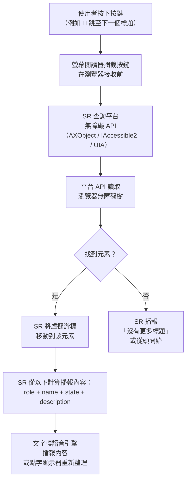
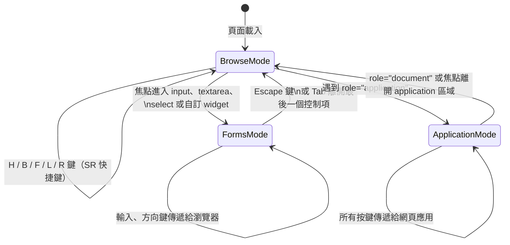

# 螢幕閱讀器與輔助技術

:::info
螢幕閱讀器讀取的不是你的頁面 — 它讀取的是無障礙樹。理解輔助技術如何與無障礙樹互動、哪些 AT+瀏覽器組合在正式環境中重要、以及使用者實際如何以鍵盤導覽，能將抽象的無障礙規則轉化為具體的工程決策。
:::

## 情境

### 螢幕閱讀器是什麼？

**螢幕閱讀器**（screen reader）是將無障礙樹轉換為語音輸出（透過文字轉語音引擎）或點字輸出（透過可更新點字顯示器）的軟體。螢幕閱讀器是全盲或嚴重低視力使用者的主要輔助技術，但也被失讀症、認知障礙及情境性障礙（例如駕車、烹飪、眼睛暫時被佔用）的使用者廣泛使用。

關鍵認知：螢幕閱讀器**不會**直接解析 HTML。它查詢的是平台無障礙 API — macOS 和 iOS 上的 AXObject、Windows 上的 IAccessible2 或 UI Automation（UIA）、Linux 上的 AT-SPI — 這些 API 反映瀏覽器的無障礙樹。這意味著：

1. 視覺版面對螢幕閱讀器是透明的。一個樣式看起來像按鈕的 `<div>`，除非無障礙樹中有 `role="button"`，否則不是按鈕。
2. CSS `display: none` 和 `visibility: hidden` 會將內容從無障礙樹中完全移除 — 無論這是否為預期行為。
3. 螢幕閱讀器所播報的內容，是從無障礙名稱、角色、狀態與描述計算出來的 — 而非視覺外觀、字體大小或顏色。

### 無障礙樹與 DOM 的差異

瀏覽器從 DOM 建構無障礙樹，但兩者並不相同。主要差異：

- 純呈現性元素（空的 `<div>`、`<span>`、沒有語意角色的版面包裹元素）通常會在無障礙樹中被修剪或合併。
- 使用 `aria-hidden="true"` 隱藏的元素會從樹中被排除，即使視覺上仍然存在。
- `aria-label`、`aria-labelledby` 和 `aria-describedby` 可以在完全不改動 DOM 文字的情況下，改變無障礙名稱或描述。
- 動態插入的內容（通知、模態對話框、Toast 訊息）不會自動播報給使用者 — 需要 ARIA live region 或明確的焦點管理。

### Browse 模式、application 模式與 forms 模式

螢幕閱讀器依據情境在不同的互動模式下運作。理解這些模式對建構正確運作的元件至關重要。

**Browse 模式**（部分 SR 稱為「reading 模式」）是預設模式。在 browse 模式中：
- 螢幕閱讀器在大多數按鍵到達瀏覽器之前就予以攔截。
- 使用者可使用豐富的單鍵指令導覽：`H` 跳至下一個標題、`B` 跳至下一個按鈕、`F` 跳至下一個表單控制項、`L` 跳至下一個列表等。
- SR 循序朗讀內容，並允許透過虛擬游標瀏覽無障礙樹。
- 大多數以內容為主的頁面（文章、文件、商品列表）在 browse 模式下運作。

**Forms 模式**（NVDA）/ **Interaction 模式**（JAWS）：當焦點進入表單控制項或互動 widget 時啟動：
- 螢幕閱讀器將按鍵直接傳遞給瀏覽器，而非攔截它們。
- 這使得文字輸入、組合框內的方向鍵導覽、日期選擇器、滑桿等操作成為可能。
- NVDA 在可聚焦的輸入元素上自動進入 forms 模式；使用者也可手動用 `Enter` 或 `Space` 切換。
- 離開 forms 模式後，使用者回到 browse 模式。

**Application 模式**由標記中的 `role="application"` 觸發：
- SR 停用所有 browse 模式快捷鍵，並將幾乎所有按鍵直接傳遞給網頁應用。
- 僅適用於實作了完整鍵盤互動模型的複雜 widget（例如試算表編輯器、IDE 風格的程式碼編輯器）。
- 在內容區域（而非真正的應用 widget）上誤用 `role="application"`，會破壞使用者以 SR 鍵盤快捷鍵導覽的能力。這是危害最大的 ARIA 誤用之一。

**Document 模式**是明確的 browse 模式。`role="document"`（或 application 中的巢狀 document）告訴 SR 對該區域重新啟用閱讀快捷鍵。

### 主要螢幕閱讀器

| 螢幕閱讀器 | 作業系統 | 費用 | 主要瀏覽器 | 市占率（WebAIM 2024） |
|---|---|---|---|---|
| NVDA | Windows | 免費（開源） | Chrome、Firefox | 約 31%（主要 SR） |
| JAWS | Windows | 年費 90–1,100 美元（企業） | Chrome、IE legacy | 約 40%（主要 SR） |
| VoiceOver | macOS | 內建（免費） | Safari | 約 9%（桌面） |
| VoiceOver | iOS | 內建（免費） | Safari | 行動 SR 使用者中約 71% |
| TalkBack | Android | 內建（免費） | Chrome | 行動 SR 使用者中約 24% |
| Narrator | Windows | 內建（免費） | Edge | 約 2–3%（主要 SR） |

關於市占率的說明：WebAIM 的螢幕閱讀器使用者調查（2024 年版）顯示，JAWS 仍保持企業主導地位（長期企業授權、政府採購規範），而 NVDA 在家用與開發者族群中持續成長。在行動端，iOS 上的 VoiceOver 是主流平台 — 超過 70% 的行動 SR 使用者 — 使其成為不可或缺的行動測試目標。

### AT 與瀏覽器的配對問題

螢幕閱讀器並非單獨與網頁互動。它們透過平台無障礙 API 取得無障礙資訊，而該 API 由特定瀏覽器填充。這個配對關係非常重要，因為：

- **不同瀏覽器對無障礙樹的暴露方式不同。** Chrome 的 ARIA live region 實作與 Firefox 存在細微差異。Safari 對特定 ARIA 模式的 AXObject 暴露與兩者都不同。
- **不同 SR 對無障礙樹的解讀方式不同。** JAWS 有數十年的自訂邏輯用於修正舊版瀏覽器的 bug，其中部分邏輯在這些 bug 被修正後反而產生不正確的播報。NVDA 更接近規格，但可能播報 JAWS 靜默略過的內容（反之亦然）。
- **你聽到的播報內容是 SR+瀏覽器的組合產物，而非僅由 HTML 決定。** 按鈕上正確的 `aria-label` 在 NVDA+Chrome 下可能播報完美，但在舊版 JAWS+IE11 配對下則被忽略。

這就是為什麼 axe-core 等自動化工具可以偵測結構性問題（缺少標籤、錯誤角色、無效 ARIA 用法），但無法驗證播報措辭 — 那需要使用真實的螢幕閱讀器軟體進行手動測試。

### 測試矩陣

以下配對代表涵蓋絕大多數真實世界 AT 使用者的正式環境配對：

| 優先級 | 螢幕閱讀器 | 瀏覽器 | 作業系統 | 理由 |
|---|---|---|---|---|
| P1 | VoiceOver | Safari | iOS | 71%+ 行動 SR 使用者；行動端事實標準 |
| P1 | NVDA | Chrome | Windows | 最大免費 SR；市占持續成長；Chrome 是主流瀏覽器 |
| P1 | JAWS | Chrome | Windows | 企業與政府標準；B2B 產品不可或缺 |
| P2 | VoiceOver | Safari | macOS | Mac 進階使用者與開發者；捕捉 macOS 特定問題 |
| P2 | TalkBack | Chrome | Android | Android 行動端；Chrome 配對為標準 |
| P3 | NVDA | Firefox | Windows | Firefox 特定的無障礙樹差異；適合回歸測試 |
| P3 | Narrator | Edge | Windows | 內建 Windows SR；政府資訊站、企業受管裝置 |

P1 配對應在每次無障礙稽核中進行測試。P2 增加次要平台的覆蓋率。P3 以回歸或合規為導向。

### 為什麼 VoiceOver+Safari 是行動測試基準

iOS VoiceOver 在行動端並非眾多選項之一 — 它是主流的行動輔助技術。幾個因素可以解釋這一點：

1. **市場滲透率**：Apple 自 iPhone 3GS（2009 年）起，在每台 iOS 裝置上都預裝 VoiceOver。無需安裝，無費用障礙。
2. **使用數據**：WebAIM 2024 年調查顯示，在以行動螢幕閱讀器作為主要或次要 SR 的受訪者中，超過 70% 選擇 iOS 上的 VoiceOver。
3. **瀏覽器限制**：iOS 只允許基於 WebKit 的瀏覽器（平台政策）。iOS 上的所有瀏覽器 — Chrome、Firefox、Edge — 都在 WebKit 上運行。Safari 因此反映了每個 iOS 瀏覽器所使用的實際渲染引擎。測試 VoiceOver+Safari 涵蓋了整個 iOS 瀏覽器表面。
4. **AT 互動層**：VoiceOver 透過 UIAccessibility API 與 iOS 應用（包括瀏覽器）互動。在實體裝置（而非模擬器）上進行測試，是捕捉手勢導覽行為（左右滑動在元素間移動、雙擊啟動）所必需的。

### 開關裝置與替代輸入

除了螢幕閱讀器，其他輔助技術也依賴結構良好的無障礙樹：

**開關裝置（Switch access）**允許運動能力有限的使用者，使用一個或兩個實體開關（或吸吹裝置）導覽介面。裝置循環瀏覽可聚焦元素 — 稱為掃描 — 使用者啟動開關以選取。這使得：
- 正確的 Tab 順序至關重要（符合邏輯的 DOM 順序）
- 高效的鍵盤快捷鍵和跳過連結非常有價值（減少掃描距離）
- 鍵盤陷阱是致命的（使用者無法在不重新設定開關的情況下脫離）

**語音控制 — Dragon NaturallySpeaking（Nuance Dragon）**允許使用者完全以語音導覽和操作軟體：
- 使用者說「點擊提交」，Dragon 透過無障礙名稱識別提交按鈕。
- 如果按鈕沒有無障礙名稱 — 或只有沒有 `aria-label` 的圖示 — Dragon 無法以語音鎖定它。
- Dragon 也支援「點擊 [數字]」— 它在所有互動元素上覆蓋數字 — 但主要路徑是透過無障礙名稱。
- 在 macOS 和 iOS 上，內建的語音控制功能提供類似功能。

**眼動追蹤**（例如 Tobii Dynavox）從視線位置產生等同滑鼠的輸入。支援開關裝置和語音控制的鍵盤及指標無障礙性，同樣支援眼動追蹤。

---

## 設計思維

### 為什麼自動化工具無法完全取代手動 SR 測試

自動化無障礙檢查器（axe-core、Lighthouse、IBM Equal Access）對於大規模捕捉結構性問題非常寶貴。它們可以可靠地偵測：

- 缺少圖片 `alt` 屬性
- 缺少表單標籤
- 無效的 ARIA 角色/屬性組合
- 色彩對比不足
- 缺少文件語言

但它們無法偵測的是**螢幕閱讀器如何向使用者播報你的介面**。這個區別在實務中意義重大：

- 按鈕可能有技術上有效的無障礙名稱，但播報起來很奇怪：「button, icon-chevron-right-16px」，因為圖示庫的 SVG title 被無意地納入了無障礙名稱計算。
- `aria-live` 區域可能結構正確，但因特定 SR 輪詢無障礙樹的方式而在錯誤的時機播報。
- 自訂組合框可能通過 axe 驗證，但讓 NVDA 使用者困在 forms 模式中，無法使用 SR 預期的鍵盤模式關閉下拉選單。
- 模態對話框可能正確接收焦點，但 JAWS 可能不會限制虛擬游標在其中導覽（需要 `aria-modal="true"` 作為補充提示 — 而 axe 不強制這一點）。

元件的播報措辭、時機和模式切換行為，只能透過操作真實的螢幕閱讀器軟體來驗證。使用至少 NVDA+Chrome 和 VoiceOver+Safari 進行測試，涵蓋了兩個最大的使用者族群和兩個差異最大的無障礙樹實作。

### 為什麼標題層級是導覽基礎設施

視覺使用者以掃描的方式瀏覽頁面：他們略讀標題、引述和條列摘要，在詳細閱讀前先確定方向。螢幕閱讀器使用者以同樣的方式導覽 — 但透過標題導覽快捷鍵，而非視覺掃描。

沒有標題的頁面，就像一本沒有章節標題、小節標題或目錄的技術手冊。到達一篇 3,000 字文章卻沒有標題的使用者，必須從頭開始線性地聆聽螢幕閱讀器朗讀，直到找到他們需要的內容。沒有捷徑。

有了正確的標題：
- 使用者按 `H` 向前跳過標題，或按 `Shift+H` 向後跳。
- 在 NVDA 和 JAWS 中，元素清單（NVDA：`NVDA+F7`，JAWS：`Insert+F6`）以可導覽的清單形式顯示所有標題 — 等同於動態目錄。
- 標題層級很重要：`h1` 是頁面標題，`h2` 是主要區塊，`h3` 是子區塊。跳過層級（從 `h1` 直接跳到 `h4`）會建立錯誤的層級結構，讓 SR 使用者對頁面的心理模型感到困惑。

從工程角度來看，標題層級應被視為導覽 API — 文件與其 AT 使用者之間的契約 — 而不是視覺格式選擇。視覺尺寸調整屬於 CSS（`font-size`），而非標題層級（用 `h4` 替代 `h2` 只因為它「看起來更小」）。

### NVDA+Chrome 與 JAWS 的動態

NVDA 和 JAWS 都是讀取同一份 HTML 的 Windows 螢幕閱讀器，但它們的歷史、架構和行為有實質差異：

**JAWS**（Job Access With Speech）是企業標準逾 30 年。企業無障礙要求、政府採購標準（Section 508）以及許多機構 AT 計畫預設使用 JAWS。其悠久歷史意味著：
- 廣泛的遺留啟發式規則，用於補償舊版瀏覽器的 bug — 其中部分在現代、符合規格的瀏覽器上反而產生錯誤播報
- 新 ARIA 功能的採用較慢（部分 ARIA 1.2 模式只在近期 JAWS 版本中才能正確運作）
- 對企業開發團隊已優化過的常見模式有可預期、文件完善的行為
- 高昂費用意味著家用和小型組織可能使用較舊版本

**NVDA**（NonVisual Desktop Access）免費、開源且持續開發。其行為：
- 更接近 ARIA 規格（較少遺留工作區）
- 較快實作新 ARIA 模式
- 受許多開發者青睞，用於日常測試，因為它免費且輕量
- 在個人使用者、教育及非營利情境中持續成長

對測試的影響：**NVDA+Chrome** 是捕捉規格合規問題的正確選擇，也是沒有 AT 預算的開發者最易取得的工具。**JAWS+Chrome** 對服務企業、政府或機構使用者的產品至關重要。同時測試兩者，可以發現單一配對會遺漏的差異行為。

### 為什麼 SR 測試需要實體裝置和真實 SR 軟體

模擬器和仿真器無法忠實重現 AT 行為：
- iOS 模擬器無法準確重現 VoiceOver 手勢行為
- 自動化 SR 模擬工具產生的是理想化的播報，而非真實結果
- 瀏覽器 DevTools 的「無障礙模式」顯示無障礙樹，但不顯示任何特定 SR 如何遍歷或播報它

可靠的 SR 測試需要：
1. 安裝了 NVDA 的真實 Windows 機器（或虛擬機）（免費，來自 nvaccess.org）
2. 企業測試的 JAWS 授權（或限時評估授權）
3. 啟用 VoiceOver 的實體 iPhone 或 iPad
4. 啟用 TalkBack 的 Android 裝置

---

## 最佳實踐

**應該（SHOULD）在發布無障礙功能前，至少以 NVDA+Chrome 和 VoiceOver+Safari 作為主要測試組合進行驗證。** 這兩個配對涵蓋最大的 Windows 及行動裝置螢幕閱讀器使用者群，並暴露最大差異的兩種無障礙樹實作。NVDA+Chrome 能揭露規格合規問題；VoiceOver+Safari 涵蓋超過 70% 的行動螢幕閱讀器使用者。在任何涉及新互動元件或流程的發布前，應同時測試兩者。

**禁止（MUST NOT）在一般內容區域使用 `role="application"`。** Application 模式會停用所有 browse 模式的鍵盤快捷鍵——即螢幕閱讀器使用者依賴的單鍵導覽，包括標題（H）、按鈕（B）、表單控制項（F）、連結（K）和地標（R）。`role="application"` 僅應保留給真正的應用程式 widget 區域，例如程式碼編輯器或試算表等擁有完整自訂鍵盤互動模型的 widget。將它誤用在文件、文章或頁面內容區域，會讓那些區域對螢幕閱讀器使用者實際上無法導覽。

**應該（SHOULD）使用真實的螢幕閱讀器軟體進行測試，而非 DevTools 模擬。** 瀏覽器無障礙面板可以顯示計算後的無障礙樹，但無法重現 NVDA、JAWS 或 VoiceOver 如何遍歷、切換模式或播報內容。axe-core 等自動化工具能偵測結構性問題，但無法驗證播報措辭、live region 時機或 forms 模式行為。只有在執行中的應用程式上操作真實的螢幕閱讀器，才能呈現使用者實際的聆聽體驗。

## 視覺

### 螢幕閱讀器互動流程



### Browse 模式與 forms 模式切換



---

## 範例

### SR 鍵盤導覽快捷鍵

以下快捷鍵適用於 browse 模式。在 NVDA 和 JAWS 中均有效，除非另有說明。macOS 上的 VoiceOver 使用 VoiceOver 修飾鍵（Caps Lock 或 Control+Option）結合方向鍵，而非單鍵快捷鍵。

| 元素類型 | 向前移動 | 向後移動 | NVDA 元素清單 |
|---|---|---|---|
| 標題（任何層級） | `H` | `Shift+H` | `NVDA+F7`，再篩選「標題」 |
| 標題層級 1 | `1` | `Shift+1` | — |
| 標題層級 2 | `2` | `Shift+2` | — |
| 標題層級 3 | `3` | `Shift+3` | — |
| 地標 / 區域 | `R`（NVDA）/ `;` 或 `R`（JAWS 2019+） | `Shift+R` | `NVDA+F7`，再篩選「地標」 |
| 表單控制項 | `F` | `Shift+F` | — |
| 按鈕 | `B` | `Shift+B` | — |
| 連結 | `K`（NVDA）/ `Tab` | `Shift+K` | `NVDA+F7`，再篩選「連結」 |
| 列表 | `L` | `Shift+L` | — |
| 列表項目 | `I` | `Shift+I` | — |
| 表格 | `T` | `Shift+T` | — |
| 表格儲存格（在表格內） | `Ctrl+Alt+方向鍵` | — | 瀏覽表格格線 |
| 圖片 | `G` | `Shift+G` | — |
| 下一個可聚焦元素 | `Tab` | `Shift+Tab` | — |

iOS VoiceOver 使用手勢：
- **向右滑動**：下一個元素
- **向左滑動**：上一個元素
- **雙擊**：啟動元素
- **三指上下滑動**：捲動頁面
- **旋轉器（雙指旋轉）**：變更導覽模式（標題、連結、表單控制項等）

### 良好的標題層級 vs 缺少標題

**有正確標題的頁面對螢幕閱讀器使用者聽起來像什麼：**

```html
<!-- 良好：SR 可以導覽的清晰層級結構 -->
<h1>API 參考 — 身份驗證</h1>

<h2>概覽</h2>
<p>此 API 使用 Bearer token 身份驗證...</p>

<h2>取得 token</h2>
<h3>使用儀表板</h3>
<p>導覽至設定 > API 金鑰...</p>

<h3>使用 CLI</h3>
<p>執行：auth login --scope read:all</p>

<h2>Token 過期</h2>
<p>Token 在 90 天後過期...</p>
```

有了這個結構，NVDA 使用者重複按 `H` 時聽到：
> 「API 參考 — 身份驗證，第 1 層標題」
> 「概覽，第 2 層標題」
> 「取得 token，第 2 層標題」
> 「使用儀表板，第 3 層標題」
> 「使用 CLI，第 3 層標題」
> 「Token 過期，第 2 層標題」

使用者可以直接跳至「Token 過期」，無需聆聽前面的內容。

**沒有標題的頁面聽起來像什麼：**

```html
<!-- 不良：沒有可供導覽的結構性地標 -->
<div class="title">API 參考 — 身份驗證</div>
<div class="section-title">概覽</div>
<p>此 API 使用 Bearer token 身份驗證...</p>
<div class="section-title">取得 token</div>
<!-- ... 又 800 個字 ... -->
```

在 NVDA 中按 `H` 會得到：「沒有找到標題。」使用者必須透過 `Tab` 或 `Down Arrow` 循序遍歷每個元素，才能找到他們需要的區塊。

### Browse 模式到 forms 模式的切換範例

```html
<!-- SR 在 browse 模式中。使用者按 F（表單控制項） -->
<form>
  <label for="email">電子郵件地址</label>
  <input type="email" id="email" name="email">
  <!-- 焦點到達此處。SR 播報：
       「電子郵件地址，編輯，輸入文字」（NVDA）
       「電子郵件地址，編輯文字」（JAWS）
       SR 自動進入 forms 模式。
       H、B、L 鍵現在輸入字母，而非導覽。 -->

  <label for="country">國家</label>
  <select id="country" name="country">
    <option value="tw">台灣</option>
    <option value="us">美國</option>
  </select>
  <!-- SR 播報：「國家，清單方塊，台灣」 -->

  <button type="submit">提交</button>
  <!-- Tab 至按鈕。SR 離開 forms 模式。
       NVDA 播報：「提交，按鈕」 -->
</form>
```

### Dragon NaturallySpeaking 鎖定按鈕所需的條件

```html
<!-- 良好：Dragon 可以說「點擊送出訂單」 -->
<button type="submit">送出訂單</button>

<!-- 良好：aria-label 提供語音鎖定目標 -->
<button type="submit" aria-label="送出訂單">
  <svg aria-hidden="true" focusable="false"><!-- 圖示 --></svg>
</button>

<!-- 不良：沒有無障礙名稱。Dragon 無法以語音鎖定此元素。 -->
<!-- 使用者必須說「點擊 3」（覆蓋數字）— 效率低且容易出錯 -->
<button type="submit">
  <svg><!-- 沒有 title、沒有 aria-label 的圖示 --></svg>
</button>
```

### 動態播報的 ARIA live region

```html
<!-- 在不移動焦點的情況下播報狀態訊息 -->
<div
  role="status"
  aria-live="polite"
  aria-atomic="true"
  class="sr-only"
>
  <!-- 在此動態注入文字：「找到 3 個結果」 -->
  <!-- SR 在內容變更時播報，不中斷當前語音 -->
</div>

<!-- 緊急錯誤 — 中斷當前播報 -->
<div
  role="alert"
  aria-live="assertive"
  aria-atomic="true"
>
  <!-- 「錯誤：作業階段已過期。請重新登入。」 -->
</div>
```

注意：向預先存在的 live region 注入內容，比建立後立即填充新 live region，在 SR+瀏覽器組合中更可靠。在頁面載入時建立空容器；動態地向其中注入訊息。

---

## 常見錯誤

### 跳過標題層級

```html
<!-- 不良：從 h1 跳至 h4 — 建立錯誤的層級結構 -->
<h1>設定</h1>
<h4>帳號</h4>   <!-- 視覺上樣式看起來像 h2，但語意上是 h4 -->
<h4>安全性</h4>

<!-- 良好：用 CSS 調整視覺大小，用正確層級表達結構 -->
<h1>設定</h1>
<h2>帳號</h2>
<h2>安全性</h2>
```

### 在可聚焦元素上使用 `aria-hidden`

```html
<!-- 不良：元素對 SR 隱藏，但仍接收 Tab 焦點 -->
<!-- SR 不播報任何內容；使用者不知道焦點去哪了 -->
<button aria-hidden="true">關閉</button>

<!-- 良好：若對 SR 隱藏，也要從 tab 順序中移除 -->
<button aria-hidden="true" tabindex="-1">關閉</button>
<!-- 或：不需要時，完全從 DOM 中移除按鈕 -->
```

### 建立 live region 後立即填充

```javascript
// 不良：SR 可能在播報觸發前尚未登記 live region
const el = document.createElement('div');
el.setAttribute('role', 'status');
el.setAttribute('aria-live', 'polite');
el.textContent = '找到 3 個結果'; // 可能不會播報
document.body.appendChild(el);

// 良好：在頁面載入時建立 region，稍後注入文字
// HTML: <div role="status" aria-live="polite" id="sr-status"></div>
document.getElementById('sr-status').textContent = '找到 3 個結果';
```

### 沒有焦點鎖定的模態對話框

```html
<!-- 如果焦點逃出模態框，SR 使用者可以用虛擬游標 -->
<!-- （browse 模式）導覽到視覺上被遮蔽的背景內容。 -->
<!-- 實作焦點鎖定 AND aria-modal="true" -->

<div role="dialog" aria-modal="true" aria-labelledby="dialog-title">
  <h2 id="dialog-title">確認刪除</h2>
  <p>此動作無法復原。</p>
  <button>取消</button>
  <button>刪除</button>
  <!-- 焦點必須在「取消」和「刪除」之間循環；-->
  <!-- Escape 鍵必須關閉對話框並將焦點返回觸發元素 -->
</div>
```

### 以 placeholder 作為唯一標籤

```html
<!-- 不良：placeholder 在輸入時消失；SR 可能播報不一致 -->
<input type="email" placeholder="電子郵件地址">

<!-- 良好：以 for/id 關聯可見標籤 -->
<label for="email">電子郵件地址</label>
<input type="email" id="email" placeholder="name@example.com">
```

---

## 相關 FEE

- [FEE-1000: Accessibility Overview](1000.md) — 完整的 a11y 全貌：WCAG、POUR 原則、法律要求
- [FEE-1001: ARIA & Semantic HTML](1001.md) — 無障礙樹如何建構；何時使用 ARIA vs 原生 HTML
- [FEE-1002: 鍵盤導航與焦點管理](1002.md) — 瀏覽模式、表單模式、應用程式模式等鍵盤導航模式，在螢幕閱讀器互動的情境下有深入討論
- [FEE-1006: Screen Reader Testing in CI](1006.md) — 將 SR 測試整合至自動化 CI 管線

---

## 參考資料

1. **WebAIM 螢幕閱讀器使用者調查第 10 版（2024 年）** — https://webaim.org/projects/screenreadersurvey10/
   SR 市占率數據、瀏覽器配對和使用者偏好的主要來源。自 2009 年起定期進行；2024 年版涵蓋 NVDA、JAWS、VoiceOver、TalkBack、Narrator 和 ORCA 的使用情況與偏好。

2. **W3C WAI — ARIA Authoring Practices Guide（APG）** — https://www.w3.org/WAI/ARIA/apg/
   APG 記錄了 ARIA widget 角色的預期鍵盤互動模式，並解釋模式切換的時機。包含組合框、對話框、樹狀檢視、分頁標籤等的實際範例。

3. **Deque Systems — 螢幕閱讀器測試** — https://dequeuniversity.com/screenreaders/
   Deque University 針對 NVDA、JAWS、VoiceOver 和 TalkBack 的 SR 測試指南。包含鍵盤快捷鍵參考、測試程序和 SR 特定的注意事項。

4. **Apple Developer — iOS 無障礙性（VoiceOver）** — https://developer.apple.com/accessibility/
   Apple 關於 VoiceOver 手勢、UIAccessibility API 和 iOS AT 整合的權威文件。理解為何 iOS VoiceOver+Safari 是行動基準的必讀參考。

5. **NVDA 使用者指南** — https://www.nvaccess.org/files/nvda/documentation/userGuide.html
   NV Access 的官方指南，涵蓋 NVDA 的模式、鍵盤快捷鍵、元素清單、設定和 SR+瀏覽器配對行為。任何使用 NVDA 進行測試的開發者的免費參考資料。
