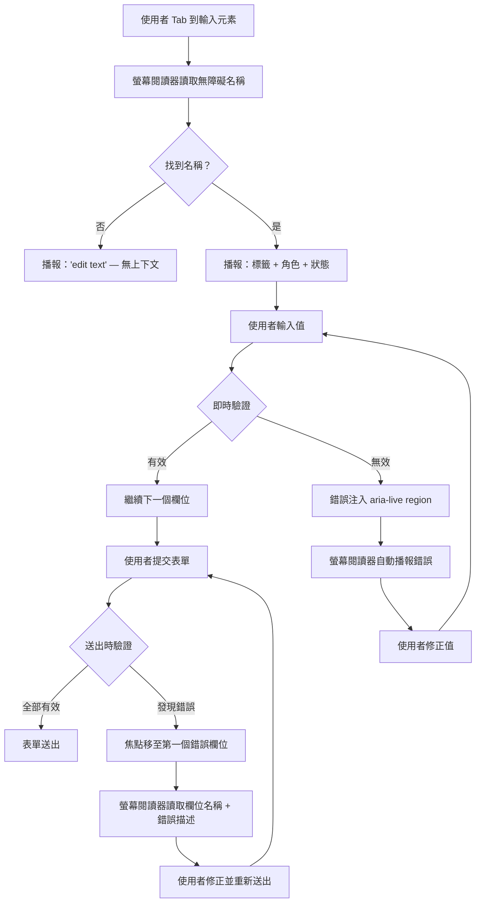

# 無障礙表單與輸入元素

:::info
表單是任何 Web 應用程式中互動密度最高的部分，也是無障礙最常出問題的地方。每個輸入元素都需要一個無障礙名稱，每則錯誤訊息都需要與其對應欄位建立關聯，每組相關控制元件都需要有結構性容器。做到這些，無論是有視力還是沒有視力的使用者，都能順利完成操作。
:::

## 情境

### 為什麼表單是無障礙高風險區

HTML 表單 — 登入畫面、結帳流程、搜尋篩選器、設定面板 — 是使用者達成目標的機制。當表單不具無障礙性時，使用者根本無法完成任務。這不是體驗降級，而是完全封鎖。

螢幕閱讀器使用者以特定方式與表單互動：他們用 Tab 鍵按照焦點順序瀏覽控制元件，對於每個控制元件，螢幕閱讀器會播報**無障礙名稱**（欄位的用途）、**角色**（文字輸入、checkbox、combobox 等）以及**狀態**（必填、無效、已勾選）。任何一項資訊缺失或錯誤，使用者就是在盲目導覽。

僅用鍵盤的使用者也依賴同樣的焦點順序。靠語音控制或 switch access 操作的肢體障礙使用者，需要看得到的、準確的標籤，才能用名稱指向控制元件。

關鍵認知：表單的無障礙性不是事後加上 ARIA 裝飾 — 而是從一開始就用正確的原生元素建立正確的 HTML 結構。只要使用正確的原生元素，大多數無障礙表單行為都由瀏覽器免費提供。

### 無障礙名稱的計算方式

每個互動元素都有一個**無障礙名稱** — 元素獲得焦點時螢幕閱讀器所播報的字串。對於表單控制元件，無障礙名稱按優先順序從以下來源計算：

1. `aria-labelledby` — 透過 ID 引用一個或多個元素；其文字內容會被串接
2. `aria-label` — 直接提供字串，不需要對應的可見元素
3. 關聯的 `<label>` 元素 — 透過 `for`/`id` 綁定或包裹控制元件
4. `title` 屬性 — 備用方案，不建議作為主要標籤
5. `placeholder` 屬性 — 最後手段，且效果非常差（見設計思維）

理解這個計算優先順序，能解釋為什麼某些模式有效、某些模式悄悄失敗。

### Forms 模式與螢幕閱讀器行為

當螢幕閱讀器使用者將焦點移入表單控制元件時，大多數螢幕閱讀器會從 browse 模式切換到 **forms 模式**（NVDA）或 **interaction 模式**（JAWS）。在此模式中：

- 按鍵會直接傳送給瀏覽器，而非被螢幕閱讀器攔截。
- 螢幕閱讀器會讀取焦點控制元件的無障礙名稱、角色與狀態。
- 未明確與輸入元素關聯的周圍文字**不會被讀出**。

這就是為什麼標籤與輸入元素的視覺距離對無障礙完全無關：視覺上位於 `<input>` 上方的 `<p>` 元素，除非有程式化關聯，否則對該輸入元素提供零無障礙名稱。

### WCAG 要求

無障礙表單涉及多項 WCAG 2.1 Level AA 成功準則：

- **1.3.1 資訊與關係** — 透過呈現傳遞的結構與關係必須可程式化判斷
- **1.3.5 識別輸入目的** — 收集個人資料的每個輸入元素的目的必須可程式化判斷（autocomplete）
- **2.4.6 標題與標籤** — 標籤必須描述其目的
- **3.3.1 錯誤識別** — 若偵測到輸入錯誤，錯誤項目及錯誤描述必須以文字方式呈現給使用者
- **3.3.2 標籤或說明** — 需要使用者輸入的內容必須提供標籤或說明
- **4.1.3 狀態訊息** — 狀態訊息必須可程式化判斷（live region）

---

## 設計思維

### 為什麼每個輸入元素都需要無障礙名稱

當螢幕閱讀器使用者 Tab 到沒有無障礙名稱的輸入元素時，螢幕閱讀器會播報類似「edit text」或「文字欄位」的內容 — 只有角色，沒有上下文。使用者完全不知道要輸入什麼。他們必須往回導覽閱讀周圍的文字，寄望能從中推斷目的 — 前提是周圍文字的閱讀順序還是正確的。

這不是假設性的不便。在一個有兩個未標記輸入元素的登入表單中，螢幕閱讀器使用者聽到的是「edit text, edit text」，無法區分電子郵件欄位與密碼欄位，除非閱讀整個周圍頁面。

修正方式是結構性的，而非外觀性的：每個 `<input>`、`<textarea>` 和 `<select>` 都必須與其標籤有程式化關聯。視覺距離不夠。

### 為什麼 placeholder 文字無法作為標籤

Placeholder 文字乍看之下似乎是合理的標籤替代。實際上它至少在三個方面失敗：

**1. 使用者開始輸入時它就消失了。** 處理速度較慢、有記憶障礙，或需要重新確認輸入內容的使用者，必須清空欄位才能回想它在問什麼 — 或仰賴外部記憶。

**2. 對比度通常不足。** WCAG 1.4.3 要求一般文字達到 4.5:1 的對比度。大多數 placeholder 樣式使用 40-50% 透明度的灰色，遠低於此門檻。瀏覽器預設通常套用 `color: graytext`，在許多背景色上都不合格。

**3. 螢幕閱讀器處理方式不一致。** 部分螢幕閱讀器在沒有其他名稱時會將 placeholder 作為無障礙名稱讀出；其他則不會。行為因瀏覽器+螢幕閱讀器組合而異，無法依賴。

正確做法：始終包含 `<label>` 元素。若設計需要無可見標籤的外觀（例如搜尋欄位，按鈕上下文使目的清晰），請使用 `aria-label` 或視覺隱藏標籤技術 — 而非 placeholder。

### 為什麼 radio 群組必須使用 fieldset + legend

設想一個詢問「您同意條款嗎？」的 radio 群組。兩個選項是「是」和「否」。每個 radio button 單獨獲得焦點時，其無障礙名稱是「是」或「否」。若沒有 fieldset 和 legend，螢幕閱讀器只會播報：「是，radio button，第 1 個，共 2 個。」使用者完全不知道他們在回答哪個問題。

有了 `<fieldset>` 和 `<legend>您同意條款嗎？</legend>`，螢幕閱讀器播報：「您同意條款嗎？是，radio button，第 1 個，共 2 個。」群組上下文隨著每個選項一起傳遞。

當單一頁面有多個 radio 群組時，這一點更加重要。沒有 legend 上下文，「小、中、大」和「差、好、優」的選項對非視覺使用者來說完全模糊。

同樣的邏輯適用於 checkbox 群組：一組「選擇您的興趣」checkbox 需要 fieldset+legend 來傳達分組問題。

### 為什麼自訂 select 元件是無障礙夢魘

原生 `<select>` 是已解決的問題。每個瀏覽器都內建了正確的實作，包含：
- 完整的鍵盤導覽（方向鍵、字元預輸入）
- 螢幕閱讀器播報已選選項與總數量
- 行動裝置上觸控友善的 UI
- 作業系統層級的樣式整合
- 零 JavaScript 需求

ARIA combobox 模式（`role="combobox"`、`aria-expanded`、`aria-controls`、`aria-activedescendant`）是建構自訂類 select 元件的規格。它需要：
- 管理開啟/關閉時的 `aria-expanded`
- 管理 `aria-activedescendant` 以追蹤 listbox 內的鍵盤焦點
- 實作鍵盤互動：`ArrowDown`、`ArrowUp`、`Home`、`End`、`Enter`、`Escape`、`Tab`、字元預輸入搜尋
- 在 listbox 開啟與關閉時正確管理焦點
- 另外處理行動裝置/觸控
- 跨 NVDA+Firefox、JAWS+Chrome、VoiceOver+Safari 進行測試 — 每種組合在處理 combobox 模式時都有各自的怪僻

這是 20+ 行非簡單的鍵盤事件處理，而這個元件的功能完全等同於 `<select>`。建構自訂 combobox 的唯一合理理由，是原生 `<select>` 無法滿足特定需求（例如在選項內渲染包含圖片的豐富內容，或支援多欄排版）。即便如此，也應使用 Headless UI 或 Radix UI 等成熟函式庫，而非自行開發。

---

## 最佳實踐

**必須（MUST）將每個輸入元素與可見標籤關聯——不是 placeholder，不是 title 屬性，不是視覺上相鄰的段落。** 當螢幕閱讀器使用者 Tab 到表單控制項時，它會播報無障礙名稱、角色和狀態。如果缺少無障礙名稱，使用者只會聽到「edit text」，完全沒有上下文。正確的做法必須（MUST）是使用帶有 `for`/`id` 綁定的明確 `<label>`、包裹式 `<label>`，或在無法提供可見標籤時使用 `aria-label`。Placeholder 文字在使用者開始輸入後會消失，且在不同的螢幕閱讀器與瀏覽器組合中行為不一致。

**必須（MUST）透過 `aria-describedby` 將每則錯誤訊息與其輸入元素關聯。** 視覺上相鄰於欄位但未程式化關聯的錯誤訊息，對螢幕閱讀器使用者在 forms 模式下是不可見的——只有聚焦控制項的無障礙名稱、角色和狀態會被播報，周圍文字不會。必須（MUST）在 input 上設定 `aria-describedby` 引用錯誤元素的 `id`，並在有錯誤時將 `aria-invalid="true"` 設定在 input 上，如此螢幕閱讀器在欄位獲得焦點時就會一併播報「無效輸入」和錯誤描述。

**應該（SHOULD）在建構自訂 combobox 前先使用原生 `<select>` 元素。** 原生 `<select>` 無需任何 JavaScript 即提供完整鍵盤導覽（方向鍵、字元搜尋）、螢幕閱讀器播報已選選項與總數，以及原生行動 UI。ARIA combobox 模式需要實作 `aria-expanded`、`aria-activedescendant`、以及 ArrowDown、ArrowUp、Home、End、Enter、Escape、Tab 和字元搜尋等鍵盤處理——且在 NVDA+Chrome、JAWS+Chrome 和 VoiceOver+Safari 之間行為各有差異。應該（SHOULD）只有當原生 `<select>` 無法滿足需求時，才建構自訂 combobox。

## 視覺

表單無障礙資料流 — 從輸入焦點到錯誤播報：



---

## 範例

### 1. 標籤關聯 — 四種方法

```html
<!-- 方法一：明確標籤，使用 for/id 綁定（推薦）-->
<label for="email">電子郵件地址</label>
<input type="email" id="email" name="email" autocomplete="email" />

<!-- 方法二：隱式標籤（包裹）— 可無障礙，但 for/id 更穩健 -->
<label>
  密碼
  <input type="password" name="password" autocomplete="current-password" />
</label>

<!-- 方法三：aria-label — 不需要可見標籤的情境 -->
<input
  type="search"
  aria-label="搜尋商品"
  placeholder="搜尋…"
/>

<!-- 方法四：aria-labelledby — 引用現有文字作為標籤 -->
<h2 id="shipping-heading">收件地址</h2>
<label for="street">街道</label>
<input type="text" id="street" aria-labelledby="shipping-heading street-label" />
<span id="street-label" class="visually-hidden">街道地址第一行</span>

<!-- 錯誤做法：僅使用 placeholder — 使用者開始輸入後就沒有無障礙名稱 -->
<!-- 請勿這樣做 -->
<input type="email" placeholder="請輸入您的電子郵件" />
```

### 2. Radio 群組的 fieldset + legend

```html
<!-- 錯誤做法：沒有 fieldset 的 radio 群組 — 螢幕閱讀器播報「是，radio button」，沒有問題上下文 -->
<p>您同意條款嗎？</p>
<input type="radio" id="agree-yes" name="agree" value="yes" />
<label for="agree-yes">是</label>
<input type="radio" id="agree-no" name="agree" value="no" />
<label for="agree-no">否</label>

<!-- 正確做法：fieldset + legend 為每個選項提供群組上下文 -->
<fieldset>
  <legend>您同意條款嗎？</legend>
  <input type="radio" id="agree-yes" name="agree" value="yes" />
  <label for="agree-yes">是</label>
  <input type="radio" id="agree-no" name="agree" value="no" />
  <label for="agree-no">否</label>
</fieldset>

<!-- 正確做法：checkbox 群組 — 同樣原則適用 -->
<fieldset>
  <legend>選擇您的興趣</legend>
  <input type="checkbox" id="interest-design" name="interests" value="design" />
  <label for="interest-design">設計</label>
  <input type="checkbox" id="interest-eng" name="interests" value="engineering" />
  <label for="interest-eng">工程</label>
  <input type="checkbox" id="interest-pm" name="interests" value="pm" />
  <label for="interest-pm">產品管理</label>
</fieldset>
```

### 3. 使用 aria-describedby 和 aria-live 的錯誤訊息

```html
<!-- 錯誤做法：錯誤視覺上存在，但與輸入元素沒有關聯 -->
<label for="username">使用者名稱</label>
<input type="text" id="username" />
<p class="error">使用者名稱為必填。</p>
<!-- 螢幕閱讀器使用者 Tab 回輸入元素時只聽到：「使用者名稱，edit text」— 沒有錯誤 -->

<!-- 正確做法：錯誤透過 aria-describedby 關聯，並注入 live region -->
<label for="username">使用者名稱</label>
<input
  type="text"
  id="username"
  aria-describedby="username-error"
  aria-invalid="true"
/>
<p id="username-error" class="error" role="alert">
  使用者名稱為必填。
</p>
<!--
  當螢幕閱讀器聚焦輸入元素時：「使用者名稱，edit text，輸入無效，使用者名稱為必填。」
  role="alert" 是隱式的 aria-live="assertive" — 錯誤出現在 DOM 中時立即播報，
  即使沒有焦點變化。
-->

<!-- 替代方案：明確的 aria-live region，用於即時驗證回饋 -->
<label for="password">密碼</label>
<input
  type="password"
  id="password"
  aria-describedby="password-hint password-error"
/>
<p id="password-hint">至少需要 8 個字元。</p>
<p id="password-error" aria-live="polite" class="error"></p>
<!--
  aria-live="polite" 會在目前語音結束後播報錯誤。
  只有在需要立即打斷的關鍵錯誤時，才使用 "assertive"。
  驗證執行時，JavaScript 設定 #password-error 的 textContent。
-->
```

**注入錯誤的 JavaScript：**

```js
function showError(inputId, errorId, message) {
  const input = document.getElementById(inputId);
  const errorEl = document.getElementById(errorId);

  input.setAttribute('aria-invalid', 'true');
  errorEl.textContent = message;
  // aria-live polite 會自動播報此更新
}

function clearError(inputId, errorId) {
  const input = document.getElementById(inputId);
  const errorEl = document.getElementById(errorId);

  input.removeAttribute('aria-invalid');
  errorEl.textContent = '';
}
```

### 4. 必填欄位

```html
<!-- 原生 required 屬性觸發瀏覽器驗證 UI，並隱式設定 aria-required -->
<label for="email">
  電子郵件地址
  <span aria-hidden="true">*</span>
  <span class="visually-hidden">（必填）</span>
</label>
<input type="email" id="email" required />

<!-- 明確的 aria-required，用於以 JavaScript 處理自訂驗證流程 -->
<label for="phone">電話號碼</label>
<input
  type="tel"
  id="phone"
  aria-required="true"
  aria-describedby="phone-format"
/>
<p id="phone-format">格式：+886 912 345 678</p>
<!--
  注意：required 和 aria-required="true" 在無障礙樹中是等效的。
  使用 required 進行原生瀏覽器驗證；只有在以 JavaScript 完全處理驗證
  且已用 novalidate 停用原生 UI 時，才另外加上 aria-required="true"。
-->

<!-- 表單層級的必填欄位說明 -->
<p><span aria-hidden="true">*</span> 表示必填欄位</p>
```

### 5. Autocomplete 屬性

```html
<!-- autocomplete 屬性啟用瀏覽器自動填入，並符合 WCAG 1.3.5 -->
<!-- 完整清單：https://html.spec.whatwg.org/multipage/form-control-infrastructure.html#autofill -->

<label for="name">姓名</label>
<input type="text" id="name" name="name" autocomplete="name" />

<label for="email">電子郵件</label>
<input type="email" id="email" name="email" autocomplete="email" />

<label for="tel">電話</label>
<input type="tel" id="tel" name="tel" autocomplete="tel" />

<label for="street">街道地址</label>
<input type="text" id="street" name="street" autocomplete="street-address" />

<label for="city">城市</label>
<input type="text" id="city" name="city" autocomplete="address-level2" />

<label for="country">國家/地區</label>
<select id="country" name="country" autocomplete="country">
  <option value="">選擇國家/地區</option>
  <option value="TW">台灣</option>
  <option value="US">美國</option>
  <option value="JP">日本</option>
</select>

<!-- 信用卡區塊 — 使用 autocomplete="cc-*" 標記 -->
<label for="cc-number">卡號</label>
<input type="text" id="cc-number" name="cc-number" autocomplete="cc-number" inputmode="numeric" />

<label for="cc-exp">到期日</label>
<input type="text" id="cc-exp" name="cc-exp" autocomplete="cc-exp" />

<label for="cc-csc">安全碼</label>
<input type="text" id="cc-csc" name="cc-csc" autocomplete="cc-csc" inputmode="numeric" />
```

### 6. 原生 select 與自訂 combobox 的複雜度比較

```html
<!-- 原生 SELECT — 處處可用，免費鍵盤導覽，螢幕閱讀器支援內建 -->
<label for="country-select">國家/地區</label>
<select id="country-select" name="country" autocomplete="country">
  <option value="">— 請選擇 —</option>
  <option value="TW">台灣</option>
  <option value="US">美國</option>
  <option value="JP">日本</option>
</select>
```

```html
<!-- 自訂 COMBOBOX（ARIA 模式）— 所有功能都必須自行實作 -->
<label id="country-label">國家/地區</label>
<div
  role="combobox"
  aria-labelledby="country-label"
  aria-expanded="false"
  aria-haspopup="listbox"
  aria-controls="country-listbox"
  tabindex="0"
  id="country-combobox"
>
  <span id="country-selected-value">— 請選擇 —</span>
</div>
<ul
  role="listbox"
  id="country-listbox"
  aria-labelledby="country-label"
  hidden
>
  <li role="option" aria-selected="false" data-value="TW">台灣</li>
  <li role="option" aria-selected="false" data-value="US">美國</li>
  <li role="option" aria-selected="false" data-value="JP">日本</li>
</ul>
```

```js
// 自訂 combobox 具備無障礙性，您必須實作的所有邏輯：
const combobox = document.getElementById('country-combobox');
const listbox  = document.getElementById('country-listbox');
const options  = listbox.querySelectorAll('[role="option"]');
let activeIndex = -1;

combobox.addEventListener('keydown', (e) => {
  switch (e.key) {
    case 'ArrowDown':
      e.preventDefault();
      openListbox();
      moveActiveOption(1);
      break;
    case 'ArrowUp':
      e.preventDefault();
      openListbox();
      moveActiveOption(-1);
      break;
    case 'Home':
      e.preventDefault();
      setActiveOption(0);
      break;
    case 'End':
      e.preventDefault();
      setActiveOption(options.length - 1);
      break;
    case 'Enter':
    case ' ':
      if (!listbox.hidden) {
        selectActiveOption();
      } else {
        openListbox();
      }
      break;
    case 'Escape':
      closeListbox();
      break;
    case 'Tab':
      closeListbox();
      break;
    default:
      // 字元預輸入搜尋
      handleTypeAhead(e.key);
  }
});

// 還需要：點擊處理、外部點擊關閉、觸控事件、焦點管理、
// aria-activedescendant 更新、選項選取播報...
// 這就是為什麼你應該使用原生 <select>。
```

---

## 常見錯誤

### 1. Radio 群組沒有 fieldset + legend

```html
<!-- 錯誤 -->
<p>上衣尺寸</p>
<input type="radio" id="sm" name="size" value="S" /><label for="sm">小</label>
<input type="radio" id="md" name="size" value="M" /><label for="md">中</label>

<!-- 正確 -->
<fieldset>
  <legend>上衣尺寸</legend>
  <input type="radio" id="sm" name="size" value="S" /><label for="sm">小</label>
  <input type="radio" id="md" name="size" value="M" /><label for="md">中</label>
</fieldset>
```

### 2. 必填標記只有視覺星號，沒有文字替代方案

```html
<!-- 錯誤：螢幕閱讀器使用者聽不到任何必填提示 -->
<label for="name">姓名 *</label>
<input type="text" id="name" />

<!-- 正確：星號對螢幕閱讀器隱藏，補充明確的 required 屬性 -->
<label for="name">
  姓名 <span aria-hidden="true">*</span>
</label>
<input type="text" id="name" required />
<!-- 或：在 label 內加入視覺隱藏的「（必填）」span -->
```

### 3. 停用原生表單驗證但未提供無障礙替代方案

```html
<!-- 使用 novalidate，你就擁有所有驗證與錯誤播報的責任 -->
<form novalidate>
  <label for="email">電子郵件</label>
  <input type="email" id="email" aria-describedby="email-error" aria-required="true" />
  <p id="email-error" role="alert"></p>
  <!-- JavaScript 必須：送出時驗證、注入錯誤文字、設定 aria-invalid、
       將焦點移至第一個錯誤欄位、透過 live region 播報錯誤 -->
</form>
```

### 4. 個人資料欄位忘記加上 autocomplete

WCAG 1.3.5（Level AA）要求收集個人資料的輸入元素必須有 autocomplete 標記。省略 `autocomplete` 不符合規範，並迫使使用者 — 尤其是依賴自動填入的肢體障礙使用者 — 每次都要手動輸入資訊。

---

## 相關 FEE

- [FEE-1000: Accessibility Overview](1000.md)
- [FEE-1001: ARIA Attributes](1001.md)
- [FEE-1002: Keyboard Navigation in Forms](1002.md)
- [FEE-1004: Screen Readers & Assistive Technology](1004.md)

---

## 參考資料

1. **WAI-ARIA Authoring Practices Guide — Combobox Pattern**
   https://www.w3.org/WAI/ARIA/apg/patterns/combobox/
   建構自訂 combobox 元件的權威規格，也是說明為何在需求許可時應優先選用原生 `<select>` 的最清楚示範。

2. **WebAIM — Creating Accessible Forms**
   https://webaim.org/techniques/forms/
   涵蓋標籤關聯、錯誤處理、必填欄位與 fieldset/legend 使用的全面實務指南，全篇附有螢幕閱讀器行為說明。

3. **MDN Web Docs — The HTML autocomplete attribute**
   https://developer.mozilla.org/en-US/docs/Web/HTML/Attributes/autocomplete
   所有 autocomplete 標記值的完整參考，包含各標記代表的個人資料描述，直接對應 WCAG 1.3.5 合規要求。

4. **Deque University — Placeholder is Not a Label**
   https://www.deque.com/blog/accessible-forms-the-problem-with-placeholders/
   從對比度、記憶負擔與螢幕閱讀器三個維度深入分析為何 placeholder 文字無法作為標籤替代。

5. **WCAG 2.1 Success Criterion 3.3.1 Error Identification**
   https://www.w3.org/WAI/WCAG21/Understanding/error-identification.html
   識別與描述輸入錯誤給使用者的規範性定義與充分技術。

6. **WCAG 2.1 Success Criterion 1.3.5 Identify Input Purpose**
   https://www.w3.org/WAI/WCAG21/Understanding/identify-input-purpose.html
   個人資料欄位 autocomplete 屬性的規範性要求，包含輸入目的清單。
