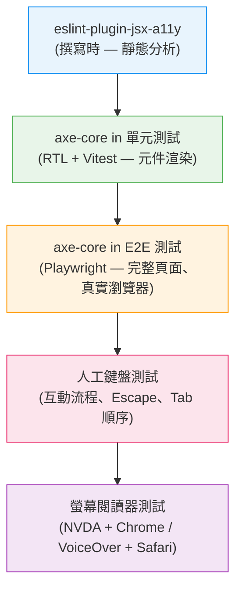

# 無障礙測試：axe、Lighthouse 與螢幕閱讀器

:::info
自動化工具能大規模捕捉人工審查容易遺漏的結構性無障礙違規 — 缺少標籤、錯誤的 ARIA 屬性、對比度不足。但自動化工具對意義是盲目的：它無法判斷標籤是否表意清晰、錯誤訊息是否有幫助，或自訂下拉選單是否在按下 Escape 後正確關閉。完整的無障礙測試策略需要結合靜態分析、CI 自動化測試，以及使用真實輔助技術的人工驗證。
:::

## 情境

### 自動化工具的覆蓋率上限

axe-core 是大多數無障礙測試工具背後的引擎，提供約 57 條可透過 DOM 檢測 WCAG 違規的規則。獨立研究一致發現，自動化工具能捕捉到 **30–40% 的真實 WCAG 問題**。其餘 60–70% 需要人工判斷。

這個數字不是 axe 特有的限制，而是問題本質的根本屬性。許多 WCAG 成功準則涉及無法單靠檢查標記來回答的意義、情境與使用者體驗問題：

- **WCAG 2.4.6 — 標題與標籤**：axe 可驗證每個輸入都有標籤，但無法判斷標籤是否具有足夠描述性，讓使用者理解應輸入什麼。
- **WCAG 3.3.3 — 錯誤建議**：axe 可偵測到錯誤訊息的存在，但無法判斷訊息是否說明了如何修正問題。
- **WCAG 2.1.1 — 鍵盤**：axe 可確認互動元素可獲得焦點，但無法模擬開啟自訂下拉選單後驗證其是否在按下 Escape 時關閉的使用者互動。
- **WCAG 1.3.2 — 有意義的順序**：axe 可偵測明顯的 DOM 順序違規，但無法評估閱讀順序在情境上是否有語意意義。

這正是自動化測試必要但不充分的原因 — 它能捕捉在人工審查中難以大規模發現的大量違規，但無法取代基於判斷的人工測試。

### 左移式無障礙測試模型

開發後期才發現的無障礙問題成本高昂：上線前一週由螢幕閱讀器測試員發現缺少標籤，需要設計審查、開發工作和新的測試週期。而在撰寫程式碼當下就被 ESLint 規則標記的同樣問題，只需按一個快速鍵即可解決。

左移模型將無障礙檢查從最早（撰寫時）到最晚（人工測試）分層，每一層捕捉前一層無法發現的問題：

1. **靜態分析（eslint-plugin-jsx-a11y）** — 在撰寫時、元件渲染前捕捉結構性違規。零執行時成本，反饋迴路最快。
2. **使用 axe-core 的單元測試（axe in RTL/Vitest）** — 對已渲染的元件 DOM 執行完整的 axe 規則集。捕捉靜態分析看不到的動態狀態問題（已渲染的條件式、JavaScript 設定的 ARIA 屬性）。
3. **使用 axe-core 的整合測試（axe in Playwright）** — 對含有路由、非同步資料和真實瀏覽器排版的完整頁面渲染執行 axe。捕捉只在完整組合下出現的問題。
4. **人工鍵盤測試** — 演練自動化工具無法模擬的互動流程：modal 中的焦點捕捉、下拉選單的 Escape 行為、跳過導航功能。
5. **螢幕閱讀器測試** — 驗證實際播報的體驗。axe 可確認 ARIA 標籤存在；只有螢幕閱讀器才能告訴你對真實使用者聽起來是什麼感覺。

### 生態系中的工具

**axe-core** 是由 Deque Systems 維護的開源無障礙測試引擎。它以 JavaScript 函式庫的形式實作 WCAG 2.0、2.1 和 2.2 規則。無障礙領域中的大多數瀏覽器擴充功能、測試整合和 CI 工具，要麼以 axe-core 為基礎，要麼以其作為參考。

**axe-playwright**（`@axe-core/playwright`）是官方的 Playwright 整合套件。它將 axe-core 注入瀏覽器頁面，並回傳可在測試中斷言的結構化違規報告。

**@axe-core/react** 是一個整合套件，在開發模式下對 React 的虛擬 DOM 輸出執行 axe-core，並將違規記錄到瀏覽器主控台，無需測試執行器。

**Lighthouse** 是 Google 的開源網路品質稽核工具。其無障礙稽核執行 axe 規則的子集加上額外檢查（Tab 順序分析、地標區域的使用）。Lighthouse 產生 0–100 的分數，可在 Chrome DevTools、CLI 以及透過 `lighthouse-ci` 在 CI 工具中使用。

**eslint-plugin-jsx-a11y** 是一個 ESLint 靜態分析插件，用於檢查 JSX 中的無障礙問題。與 axe-core 不同，它在渲染前對原始碼進行操作，使其成為整個流程中反饋最快的環節。

### 瀏覽器 DevTools 無障礙面板

**Chrome DevTools — Accessibility 面板**：在 DevTools 中選取任意元素，開啟 Accessibility 面板（位於 Elements 底部窗格的頂端，在 Styles 和 Computed 旁邊）。它顯示元素的無障礙樹節點：計算出的無障礙名稱、角色、狀態（已獲焦點、必填等）和 ARIA 屬性。Settings 中的「啟用全頁無障礙樹」選項將 Elements 面板切換為顯示完整的無障礙樹，方便驗證標題結構和地標區域。

**Firefox 無障礙檢測器**：Firefox 的無障礙檢測器（DevTools → Accessibility 標籤頁）顯示完整的無障礙樹以及 Tab 順序視覺化。「Check for issues」功能執行涵蓋對比度、鍵盤和文字標籤的內建稽核。Firefox 的實作在驗證焦點順序和偵測阻礙鍵盤導航的元素方面特別有用。

---

## 原則

- **SHOULD** 在 CI 的每個 Pull Request 中執行 axe-core — 將無障礙違規視為測試失敗，而非警告。
- **SHOULD** 在交付任何互動元件之前僅用鍵盤進行測試 — 不動滑鼠，開啟、導航、關閉並退出每個互動小工具。
- **SHOULD** 在上線新使用者流程前，至少用一個真實螢幕閱讀器進行測試 — Windows 上的 NVDA + Chrome，或 macOS 上的 VoiceOver + Safari。

---

## 設計思維

### 為什麼自動化工具必要但不充分

axe-core 擅長它能看到的東西：DOM 結構、屬性存在、對比度的計算 CSS 值，以及 ARIA 屬性組合的邏輯一致性。在 CI 中執行 axe-core 提供了有保障的基線 — 沒有元件帶著缺失的表單標籤、無效的 ARIA 角色組合或 2:1 的對比度上線。

但 axe-core 無法提出需要閱讀理解力的問題：

- 「Username」根據 axe 是有效的標籤。「輸入您的 6–20 個字元使用者名稱（僅限字母和數字）」是更好的標籤。axe 無法區分兩者。
- axe 確認錯誤訊息透過 `aria-describedby` 與輸入欄位關聯。它無法判斷「無效輸入」是否幫助使用者理解哪裡出錯了。
- axe 驗證 modal 具有 `role="dialog"` 和 `aria-modal="true"`。它無法驗證在鍵盤互動過程中焦點是否真的被捕捉在其中。

這意味著 axe-core 應被視為強制性基線，而非合規性證書。零違規的 axe 報告不代表元件具有無障礙性；它代表元件通過了 axe 知道如何檢查的規則。

### 為什麼 eslint-plugin-jsx-a11y 是最快的反饋迴路

無障礙問題被發現的時間越晚，修復成本越高。ESLint 規則在編輯器中、文件儲存前觸發 — 在元件渲染到瀏覽器之前、在測試執行之前、在程式碼審查之前。開發者在撰寫程式碼的確切時刻看到問題，有完整的情境，幾秒鐘內修復它。

eslint-plugin-jsx-a11y 捕捉以下模式：img 元素缺少 alt 文字、沒有無障礙名稱的按鈕、沒有內容的錨點標籤、沒有關聯標籤的表單輸入。這些是高頻違規，佔現實世界 WCAG 失敗的很大一部分。靜態捕捉它們可以消除整個類別永遠不會到達瀏覽器的問題。

靜態分析的限制在於它只能評估 JSX 來源，而不是已渲染的 DOM。條件渲染的 ARIA 屬性、動態標籤文字和執行時 DOM 結構對 ESLint 不可見。這就是測試中 axe-core 接手的地方。

### 為什麼鍵盤測試捕捉到 axe 遺漏的問題

鍵盤測試是兩個覆蓋率缺口的交集：自動化工具無法執行的互動流程，以及需要真實互動才能驗證的 WCAG 要求。

考慮一個自訂下拉選單元件。axe-core 可以驗證：
- 觸發按鈕有無障礙名稱。
- listbox 具有 `role="listbox"`。
- 每個選項具有 `role="option"`。

axe-core 無法驗證：
- 按下 Escape 是否關閉下拉選單並將焦點返回到觸發器？
- 下拉選單開啟時按 Tab 是否關閉它並將焦點移到下一個元素？
- 按 Arrow Down 是否將焦點移到第一個選項？
- 按 Home/End 是否移到第一個/最後一個選項？
- 提前輸入（按「C」跳到以 C 開頭的選項）是否有效？

這些都是 WCAG 2.1.1 的要求。任何一項失敗的自訂下拉選單都是鍵盤無障礙違規 — 但 axe 看到一個結構有效的 combobox 並報告沒有違規。

鍵盤測試需要人工開啟下拉選單、用方向鍵導航、按 Escape，並驗證焦點返回到觸發器。每個互動元件只需兩分鐘，就能捕捉到每個自動化工具都無法看到的違規。

### 為什麼螢幕閱讀器測試是不可替代的

無障礙樹和播報的體驗並非總是相同的。螢幕閱讀器在無障礙樹之上實作自己的處理 — 它們應用 NVDA、JAWS 和 VoiceOver 之間各不相同的啟發式方法、平台慣例和怪癖。

螢幕閱讀器測試回答了沒有任何工具能回答的問題：
- 播報順序 — 名稱、角色、狀態 — 在自然語言中是否有意義？
- 即時區域更新是否在正確的時刻中斷？
- 螢幕閱讀器的虛擬游標閱讀順序是否與視覺閱讀順序匹配？
- 元件在瀏覽模式與表單模式 / 應用程式模式下是否正常工作？

NVDA + Chrome 和 VoiceOver + Safari 代表兩種使用最多的螢幕閱讀器和瀏覽器組合（分別是 Windows 和 macOS）。用兩者測試涵蓋了大多數螢幕閱讀器使用者，並捕捉到瀏覽器特定的 ARIA 處理差異。

---

## 視覺

無障礙測試層次，從最早的反饋到最深入的覆蓋：



---

## 範例

### 1. axe-playwright — 在 Playwright 測試中執行 axe 並在 CI 中因違規而失敗

```bash
# 安裝
npm install --save-dev @axe-core/playwright
```

```typescript
// tests/a11y/home.spec.ts
import { test, expect } from '@playwright/test';
import AxeBuilder from '@axe-core/playwright';

test.describe('首頁無障礙', () => {
  test('應無法自動偵測到 WCAG 違規', async ({ page }) => {
    await page.goto('/');

    const accessibilityScanResults = await new AxeBuilder({ page })
      .withTags(['wcag2a', 'wcag2aa', 'wcag21a', 'wcag21aa'])
      .analyze();

    // 此斷言在 axe 發現違規時使測試（以及 CI）失敗。
    // 錯誤訊息包含違規規則、元素和修復提示。
    expect(accessibilityScanResults.violations).toEqual([]);
  });

  test('登入表單應無違規', async ({ page }) => {
    await page.goto('/login');

    // 將 axe 範圍限定在特定區域，以減少其他已知問題的雜訊
    const results = await new AxeBuilder({ page })
      .include('#login-form')
      .withTags(['wcag2aa', 'wcag21aa'])
      .analyze();

    expect(results.violations).toEqual([]);
  });

  test('為除錯列印可讀的違規報告', async ({ page }) => {
    await page.goto('/dashboard');

    const results = await new AxeBuilder({ page }).analyze();

    if (results.violations.length > 0) {
      // 為 CI 日誌記錄人工可讀的摘要
      const summary = results.violations.map((v) => ({
        id: v.id,
        impact: v.impact,
        description: v.description,
        nodes: v.nodes.map((n) => n.target),
      }));
      console.log('Accessibility violations:', JSON.stringify(summary, null, 2));
    }

    expect(results.violations).toEqual([]);
  });
});
```

### 2. axe-core in Vitest + React Testing Library — 元件層級測試

```bash
# 安裝
npm install --save-dev axe-core jest-axe
# 或用於 Vitest：
npm install --save-dev axe-core vitest-axe
```

```typescript
// src/components/LoginForm.test.tsx
import { render } from '@testing-library/react';
import { axe, toHaveNoViolations } from 'vitest-axe';
import { expect, test } from 'vitest';
import { LoginForm } from './LoginForm';

// 用無障礙匹配器擴充 Vitest 的 expect
expect.extend(toHaveNoViolations);

test('LoginForm 在預設狀態下無 axe 違規', async () => {
  const { container } = render(<LoginForm />);

  // axe() 對已渲染的 DOM 執行完整的 axe-core 規則集
  const results = await axe(container);
  expect(results).toHaveNoViolations();
});

test('LoginForm 在顯示錯誤狀態時無 axe 違規', async () => {
  const { container } = render(
    <LoginForm initialError="電子郵件或密碼無效。" />
  );

  // 特別測試錯誤狀態 — 動態 ARIA（aria-invalid、aria-describedby）
  // 只存在於已渲染的 DOM 中，而非 JSX 來源中
  const results = await axe(container);
  expect(results).toHaveNoViolations();
});

test('Modal 開啟時無違規', async () => {
  const { container } = render(<ConfirmModal isOpen={true} />);

  // axe 可檢查：role="dialog"、aria-modal、aria-labelledby 指向有效標題
  const results = await axe(container);
  expect(results).toHaveNoViolations();
});
```

### 3. eslint-plugin-jsx-a11y 設定

```bash
# 安裝
npm install --save-dev eslint-plugin-jsx-a11y
```

```javascript
// eslint.config.js（flat config，ESLint 9+）
import jsxA11y from 'eslint-plugin-jsx-a11y';

export default [
  // 以建議的規則集為基礎
  jsxA11y.flatConfigs.recommended,
  {
    files: ['**/*.{jsx,tsx}'],
    plugins: {
      'jsx-a11y': jsxA11y,
    },
    rules: {
      // 建議的規則（錯誤）— 這些對 WCAG 至關重要
      'jsx-a11y/alt-text': 'error',               // img 必須有 alt
      'jsx-a11y/anchor-is-valid': 'error',         // 錨點必須是有效連結
      'jsx-a11y/aria-props': 'error',              // 只允許有效的 ARIA 屬性
      'jsx-a11y/aria-proptypes': 'error',          // ARIA 的正確值類型
      'jsx-a11y/aria-role': 'error',               // 只允許有效的 ARIA 角色
      'jsx-a11y/aria-unsupported-elements': 'error', // 不在不支援的元素上使用 ARIA
      'jsx-a11y/heading-has-content': 'error',     // 標題必須有文字內容
      'jsx-a11y/img-redundant-alt': 'error',       // alt 文字中不含「image」或「photo」
      'jsx-a11y/interactive-supports-focus': 'error', // 互動角色必須可獲得焦點
      'jsx-a11y/label-has-associated-control': 'error', // label 必須程式化連結
      'jsx-a11y/no-access-key': 'warn',            // accesskey 會造成螢幕閱讀器衝突
      'jsx-a11y/no-autofocus': 'warn',             // autofocus 會干擾螢幕閱讀器流程
      'jsx-a11y/no-distracting-elements': 'error', // 不使用 marquee 或 blink
      'jsx-a11y/role-has-required-aria-props': 'error', // 每個角色的必要 ARIA 屬性
      'jsx-a11y/tabindex-no-positive': 'error',    // 正數 tabindex 會破壞自然順序
    },
  },
];
```

```json
// 仍使用 .eslintrc 的專案（ESLint 8）
{
  "plugins": ["jsx-a11y"],
  "extends": ["plugin:jsx-a11y/recommended"],
  "rules": {
    "jsx-a11y/label-has-associated-control": ["error", {
      "assert": "either"
    }]
  }
}
```

### 4. 人工鍵盤測試檢查清單

在交付任何互動元件或流程之前，請僅用鍵盤（不用滑鼠）完成以下檢查清單：

```
鍵盤測試檢查清單
================

[ ] 所有互動元素按照合理的視覺順序獲得焦點（由上到下、由左到右）
[ ] 每個已獲焦點的元素都有可見的焦點指示器（沒有無替代樣式的 outline:none）
[ ] Tab 向前移過互動元素；Shift+Tab 向後移動
[ ] 連結開啟其目標或觸發預期的導航
[ ] 按鈕在 Enter 和 Space 上啟動
[ ] 原生表單控制元件使用預期的鍵盤操作：
    [ ] Checkbox 使用 Space 切換
    [ ] Radio button 在群組內使用方向鍵切換
    [ ] Select 下拉選單使用 Space/Enter 開啟並使用方向鍵導航
[ ] 自訂下拉選單 / combobox：
    [ ] 在觸發按鈕上按 Enter 或 Space 開啟
    [ ] 方向鍵在已開啟的下拉選單中導航選項
    [ ] Enter 或 Space 選取已獲焦點的選項
    [ ] Escape 關閉下拉選單並將焦點返回到觸發器
    [ ] Tab 關閉下拉選單並移動到下一個可獲焦點的元素
[ ] Modal 對話框：
    [ ] 開啟時焦點移動到對話框內部
    [ ] 焦點被捕捉在內部（Tab 只在 modal 內循環）
    [ ] Escape 關閉 modal 並將焦點返回到觸發它的元素
    [ ] Modal 可以用鍵盤可及的關閉按鈕關閉
[ ] 跳過導航連結在從頁面頂端第一次按 Tab 時出現
[ ] 沒有鍵盤陷阱：焦點可以用 Tab 或 Escape 離開每個元件
[ ] 手風琴 / 展示：Space 或 Enter 切換；方向鍵導航面板（如適用）
[ ] 日期選擇器：日/月/年選擇的鍵盤導航有效
[ ] Toast / 通知：可以用鍵盤關閉（或在不需要互動的情況下消失）
```

### 5. Chrome DevTools Accessibility 面板 — 要檢查什麼

開啟 Chrome DevTools（F12），在 Elements 面板中點選任意元素，然後開啟 **Accessibility** 面板（底部窗格頂端的標籤頁，在 Styles 和 Computed 旁邊）。

主要檢查事項：

**無障礙樹節點**：顯示瀏覽器無障礙引擎計算出的角色、名稱和狀態。將此與您預期螢幕閱讀器播報的內容進行比較。如果按鈕的「Name」欄位為空，該按鈕就沒有無障礙名稱 — axe 也會捕捉到這一點，但面板讓您能除錯原因。

**全頁無障礙樹**：在 DevTools 設定 → 實驗 → 「在 Elements 面板中啟用完整無障礙樹視圖」中啟用。整個 Elements 面板切換為顯示無障礙樹。使用此功能：
- 驗證標題層次結構（h1 → h2 → h3，無跳躍層級）
- 檢查地標區域（header、main、nav、footer）是否存在且正確
- 識別出現在 DOM 中但被排除在無障礙樹之外的互動元素（`aria-hidden="true"` 或 `display:none`）

**ARIA 屬性**：面板列出元素上的所有 ARIA 屬性以及它們是否有效。指向不存在 ID 的 `aria-labelledby` 在這裡顯示為損壞 — 這是 axe 可能捕捉為違規的一類問題，但面板使其立即可見。

### 6. Lighthouse CI — 強制執行無障礙分數門檻

```bash
# 安裝 lighthouse-ci
npm install --save-dev @lhci/cli
```

```json
// lighthouserc.json
{
  "ci": {
    "collect": {
      "url": ["http://localhost:4173/", "http://localhost:4173/login"],
      "startServerCommand": "pnpm preview",
      "numberOfRuns": 3
    },
    "assert": {
      "assertions": {
        "categories:accessibility": ["error", { "minScore": 0.9 }],
        "categories:performance": ["warn", { "minScore": 0.8 }]
      }
    },
    "upload": {
      "target": "temporary-public-storage"
    }
  }
}
```

```yaml
# .github/workflows/lighthouse.yml
name: Lighthouse CI

on:
  pull_request:
    branches: [main]

jobs:
  lhci:
    runs-on: ubuntu-latest
    steps:
      - uses: actions/checkout@v4
      - uses: actions/setup-node@v4
        with:
          node-version: 20
      - run: npm ci
      - run: npm run build
      - run: npx lhci autorun
        env:
          LHCI_GITHUB_APP_TOKEN: ${{ secrets.LHCI_GITHUB_APP_TOKEN }}
```

注意：Lighthouse 無障礙評分按影響力加權。0.9 的分數代表加權平均通過 — 單一高影響力違規（例如頁面上許多輸入欄位缺少表單標籤）可能比幾個低影響力違規更大幅拉低分數。將 Lighthouse 分數作為趨勢指標，配合 axe-playwright 的零違規要求一起使用。

---

## 常見錯誤

### 1. 將零違規的 axe 報告視為無障礙合規證書

axe-core 報告零違規。團隊將無障礙標記為完成。使用螢幕閱讀器的使用者仍然遇到未標記的自訂控制元件、不合理的閱讀順序和焦點陷阱。

axe 捕捉 30–40% 的 WCAG 問題。零違規意味著「通過自動化檢查」— 而非「具有無障礙性」。在您的完成定義中明確記錄這一區別：零 axe 違規是必要前提條件，而非充分條件。

### 2. 只對 happy-path 頁面狀態執行 axe

只在初始頁面加載時執行的 axe 測試，錯過了大多數無障礙違規所在的狀態：含有 aria-invalid 和 aria-describedby 的錯誤狀態、使用者互動後開啟的 modal 對話框、條件渲染的分頁面板、處於開啟狀態的下拉選單。

```typescript
// 錯誤：只測試預設的關閉狀態
test('應無違規', async ({ page }) => {
  await page.goto('/');
  const results = await new AxeBuilder({ page }).analyze();
  expect(results.violations).toEqual([]);
});

// 正確：測試 modal 開啟狀態
test('modal 開啟時應無違規', async ({ page }) => {
  await page.goto('/');
  await page.click('button[data-testid="open-modal"]');
  // 等待 modal 進入 DOM
  await page.waitForSelector('[role="dialog"]');
  const results = await new AxeBuilder({ page }).analyze();
  expect(results.violations).toEqual([]);
});
```

### 3. 將 axe 加入測試但用 exclude 抑制違規

```typescript
// 錯誤：排除有問題的元件而不是修復它
const results = await new AxeBuilder({ page })
  .exclude('#problematic-dropdown')
  .analyze();
expect(results.violations).toEqual([]);
```

此模式適用於您無法控制的已知第三方元件問題，但它常常被用來讓 axe 對您自己擁有的元件保持沉默。每個排除都應該有對應的 issue 票單和移除排除的計劃。

### 4. 跳過「簡單」元件的鍵盤測試

團隊通常假設鍵盤測試只需要用於複雜的小工具，如日期選擇器和 combobox。在實踐中，簡單的元件也常常有鍵盤失敗：沒有鍵盤處理器的 `<div onClick={...}>`、只能透過滑鼠懸停觸發的工具提示，或 popover 內無法用 Tab 到達的關閉按鈕。

鍵盤檢查清單適用於每個互動元件，無論其感知到的複雜程度如何。

### 5. 從不用真實螢幕閱讀器測試

螢幕閱讀器是無障礙的最終整合測試。完全依賴自動化工具的團隊，交付的體驗通過了每個測試，但對螢幕閱讀器使用者來說仍然無法使用。

最基本的螢幕閱讀器測試：安裝 NVDA（免費，Windows）或使用內建的 VoiceOver（macOS，按 Cmd+F5），導航到您的應用程式，不用滑鼠嘗試核心使用者流程。注意您進入表單、啟動按鈕和移過動態內容時播報的內容。

### 6. 安裝了 eslint-plugin-jsx-a11y 但未強制執行

將插件放在 devDependencies 中什麼都不做。規則必須在 ESLint 設定中啟用，且 lint 步驟必須在 CI 中執行。驗證方式：

```bash
# 啟用 a11y 規則執行 lint
npx eslint src/ --rule 'jsx-a11y/alt-text: error'

# 在 CI 中，lint 失敗應阻止建置
# package.json
# "scripts": { "lint": "eslint src/", "ci:lint": "eslint src/ --max-warnings 0" }
```

---

## 相關 FEE

- [FEE-1000: 無障礙概覽](1000.md)
- [FEE-1001: ARIA 角色與屬性](1001.md)
- [FEE-1002: 鍵盤導航](1002.md)
- [FEE-1004: 螢幕閱讀器與輔助技術](1004.md)
- [FEE-1101: Vitest — 單元測試](../Testing%20Strategies/1101.md)
- [FEE-1102: React Testing Library](../Testing%20Strategies/1102.md)
- [FEE-1103: Playwright — E2E 測試](../Testing%20Strategies/1103.md)
- [FEE-1107: 左移測試哲學](../Testing%20Strategies/1107.md)

---

## 參考資料

1. **Deque Systems — axe-core GitHub 儲存庫與規則文件**
   https://github.com/dequelabs/axe-core
   axe-core 規則、WCAG 對應關係和覆蓋範圍的真相來源。規則列表記錄了每條規則針對哪些 WCAG 準則，以及哪些違規需要人工審查。

2. **Deque University — axe 的工作原理及其捕捉的內容**
   https://www.deque.com/axe/
   來自 axe-core 維護者關於 30–40% 自動化覆蓋率上限以及需要人工測試的問題類別的權威覆蓋率數據。

3. **@axe-core/playwright — 官方 Playwright 整合**
   https://github.com/dequelabs/axe-core-npm/tree/develop/packages/playwright
   在 Playwright 測試中執行 axe 的安裝指南、API 參考和設定選項。

4. **eslint-plugin-jsx-a11y — 規則參考**
   https://github.com/jsx-eslint/eslint-plugin-jsx-a11y
   完整的可用規則列表、建議設定，以及將每條規則對應到其強制執行的 WCAG 準則的規則層級文件。

5. **Google Lighthouse — 無障礙稽核文件**
   https://developer.chrome.com/docs/lighthouse/accessibility/
   說明 Lighthouse 的評分方法、它執行的檢查，以及加權評分如何與 WCAG 合規性相關聯。

6. **WebAIM — 螢幕閱讀器使用者調查**
   https://webaim.org/projects/screenreadersurvey/
   NVDA、JAWS 和 VoiceOver 與瀏覽器配對的使用統計 — 這是決定在人工測試中優先考慮哪些螢幕閱讀器和瀏覽器組合的實證基礎。

7. **Accessibility Insights — 人工測試指南**
   https://accessibilityinsights.io/
   微軟基於 axe-core 的無障礙測試工具，具有結構化的人工測試標籤，引導完成自動化工具無法評估的 WCAG 準則。
