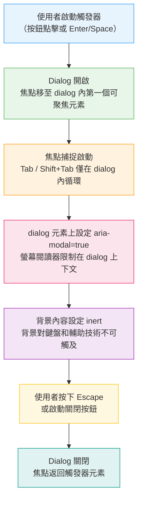

# 無障礙元件模式

:::info
WAI-ARIA Authoring Practices Guide（APG）定義了互動式 widget 在鍵盤和輔助技術下的行為規範。瀏覽器不會自動實作這些行為——應用程式中的每個下拉選單、tab 面板、modal 和 accordion 都需要刻意設計鍵盤互動。Headless 元件庫的存在，正是為了正確實作這個行為層，讓產品團隊掌控視覺設計，同時不必從頭重建無障礙基礎。
:::

## 情境

### 自訂 widget 的無障礙落差

原生 HTML 元素——`<button>`、`<input>`、`<select>`、`<details>`——內建了瀏覽器實作的鍵盤行為和無障礙語意。當你按下 `<button>` 上的 Space 鍵時，瀏覽器會觸發 click 事件。開啟原生 `<select>` 時，方向鍵可以導覽選項。這些行為無需任何 JavaScript 即可運作。

當你建立自訂 widget 時——一個避開原生 `<select>` 的樣式化下拉選單、tab 介面或 modal 對話框——你就走出了瀏覽器的預設行為範圍。瀏覽器不知道什麼是「tab」。它不知道方向鍵應在 tab 項目之間移動、Escape 應關閉 modal，或者焦點在 dialog 開啟時應被限制在其中。這一切都必須由你親自實作。

這不是可選的。WCAG 2.1 成功準則 2.1.1（鍵盤）要求所有功能都可以用鍵盤操作。準則 4.1.2（名稱、角色、值）要求每個 UI 元件的名稱、角色和狀態都必須可程式化確定。一個外觀上與原生等效但對鍵盤輸入毫無回應的自訂下拉選單，將同時違反這兩個準則。

### WAI-ARIA Authoring Practices Guide

**WAI-ARIA Authoring Practices Guide（APG）**——由 W3C 發布，網址為 `https://www.w3.org/WAI/ARIA/apg/`——是互動式 widget 在鍵盤和 ARIA 下應如何表現的權威來源。APG 定義了：

- widget 應使用哪些 ARIA 角色（`tablist`、`tab`、`tabpanel`、`dialog`、`menu`、`menuitem` 等）
- 哪些 ARIA 屬性是必要的（`aria-selected`、`aria-expanded`、`aria-modal`、`aria-haspopup` 等）
- 預期的鍵盤互動（方向鍵導覽、Escape 關閉、Enter/Space 啟動、Home/End 邊界導覽）

APG 模式不是風格建議，而是針對螢幕閱讀器和輔助技術如何處理 ARIA 標記進行深入分析後的結果，代表使用者對互動式 widget 行為的期待。偏離 APG 模式意味著螢幕閱讀器使用者會遭遇意外行為——甚至完全沒有行為。

本文涵蓋的每個互動式 widget，都對應一個 APG 模式。當你對任何自訂 widget 的正確行為有疑問時，APG 是第一個也是權威的參考資料。

### Headless 元件庫存在的原因

從頭建立一個無障礙自訂 widget 需要實作：

1. 正確的 ARIA 角色指派
2. 所有必要的 ARIA 屬性狀態，以及與視覺狀態的同步
3. 每個預期按鍵組合的鍵盤事件處理器
4. 焦點管理（開啟時移動焦點、在 modal 中捕捉焦點、關閉時還原焦點）
5. 邊緣情況：選單沒有項目時如何處理、動態新增 tab 面板時如何處理、在巢狀 modal 內按下 Escape 時如何處理

這是一項可觀的工程投入，而且每個產品的每個 widget 都需要重複這些工作。而且很容易出錯——遺漏一個鍵盤處理器，或者關閉時未能還原焦點，就會產生無障礙回歸。

**Headless 元件庫**封裝了行為和無障礙層，而不強制規定視覺設計：

- **Headless UI**（由 Tailwind CSS 團隊提供）——為 React 和 Vue 提供無障礙元件，涵蓋 modal、下拉選單、tabs、combobox 和過場動畫。元件沒有樣式；你透過 className 或 CSS 套用所有樣式。
- **Radix UI**——僅支援 React，提供原始元件（Dialog、DropdownMenu、Tabs、Accordion、Toast 等），具有完整的 ARIA 實作。為組合而設計；每個 primitive 匯出可供組裝的子元件。
- **React Aria**（Adobe）——hook 而非元件的函式庫。每個 hook 處理一個無障礙問題（焦點、鍵盤導覽、ARIA 屬性）。最靈活的選項；需要最多組裝但不強制規定 DOM 結構。
- **Ark UI**——支援 React、Vue 和 Solid 的 headless 元件，建構於 Zag.js（狀態機函式庫）之上。提供比 Headless UI 更受控的狀態管理，功能範圍接近 Radix UI。

核心價值主張：函式庫團隊承擔 ARIA 規格研究、跨瀏覽器和跨螢幕閱讀器測試，以及邊緣情況處理。你的團隊承擔視覺設計工作。合約很清晰：他們負責正確性，你負責外觀。

---

## 設計思維

### 為何無障礙模式需要特定的鍵盤互動

當使用者在網頁上遇到 tab 介面時，他們帶著 APG 慣例形成的期待：方向鍵在 tab 之間移動，Tab 鍵移動到 tab 面板內容，Enter 或 Space 啟動焦點所在的 tab。這些期待之所以存在，是因為 APG 定義了它們，輔助技術也傳達了它們。

瀏覽器不會自動實作這些期待。如果你用 `<div>` 元素加上 `role="tab"` 和 `role="tablist"` 建立 tab 介面，當使用者按下方向鍵時，瀏覽器什麼都不會做。方向鍵事件在 document 上觸發——然後什麼都沒發生，因為沒有任何東西處理這些事件。你必須自己寫事件處理器。

這是根本問題所在。APG 存在是因為瀏覽器平台是為文件而非應用程式而建立的。互動式 widget，如 tab 面板、樹狀檢視、日期選擇器和資料表格，需要原生 HTML 無法提供的應用程式模式鍵盤行為。APG 為每種 widget 類型整理了預期的鍵盤行為，使所有實作行為一致，螢幕閱讀器使用者得以建立可靠的心智模型。

### Headless 函式庫為何存在：行為與樣式的分離

Headless 函式庫解決的問題不是「讓元件看起來漂亮」，而是「正確實作 APG，並在瀏覽器和螢幕閱讀器演進時持續維護」。

考慮 Radix UI 的 Dialog 元件自動處理的事項，而天真的實作通常會遺漏：

- 開啟時焦點移動到 dialog 內的第一個可聚焦元素
- 焦點被限制在 dialog 內——Tab 和 Shift+Tab 在 dialog 內循環，不會逃脫
- `aria-modal="true"` 將 dialog 標記為螢幕閱讀器的 modal 上下文
- 背景內容接收 `inert`，防止輔助技術在 dialog 外部導覽
- dialog 開啟時頁面 body 的滾動被鎖定
- Escape 關閉 dialog
- 關閉時焦點返回到開啟 dialog 的觸發元素
- dialog 在 portal 中渲染於 document body，以避免 z-index 和 overflow:hidden 問題

一個從頭建立自訂 modal 的團隊，通常會實作項目 1 和 6，有時實作項目 5，很少實作項目 2–4 和 7–8。最常遺漏的——焦點捕捉、aria-modal、inertness 和焦點還原——恰恰是最直接影響螢幕閱讀器和鍵盤使用者的項目。

Headless 函式庫存在，是因為無障礙行為的正確實作是一個已解決的問題，應該集中處理，而非每個應用程式重新發明。

### 為何 modal 是最常被做錯的模式

Modal 對話框是最常被做錯的無障礙模式，原因如下：

**焦點捕捉**對視覺滑鼠使用者是不可見的，因此經常在後期才被發現。視覺使用者點擊開啟 modal，與之互動，然後點擊關閉。鍵盤使用者開啟 modal，按下 Tab，焦點卻逃脫到 modal 後方的頁面——然後他們無法在不到達現已無法觸及的關閉按鈕的情況下關閉它。

**`aria-modal="true"`** 經常被省略，因為 dialog 在視覺上看起來是 modal 的（有遮罩層）。Windows 上使用虛擬游標模式的 NVDA 螢幕閱讀器可以使用虛擬緩衝區導覽完整的頁面 DOM——它不受視覺遮罩層的限制。若沒有 `aria-modal="true"`，螢幕閱讀器使用者可以閱讀並與 dialog 後方的內容互動。

**背景內容的 `inert`** 是解決同一問題的更新、更強健的方案。`inert` 屬性會將元素完全從 tab 順序和無障礙樹中移除。對 modal 外部的所有內容添加 `inert`，無論螢幕閱讀器模式如何，都會使背景內容無法觸及。`aria-modal` 是一個較弱的信號，有些螢幕閱讀器沒有完全實作；`inert` 則在瀏覽器層級實作。

**滾動鎖定**被遺漏是因為開發者用滑鼠測試，而滑鼠使用者可以明顯感受到滾動鎖定的存在。用鍵盤按 Tab 超過最後一個 modal 元素後回到第一個 modal 元素（正確的焦點捕捉行為）的鍵盤使用者，可能也會注意到頁面 body 也跟著滾動了——因為 document body 的滾動相關行為沒有被鎖定。

**焦點還原**通常實作為「關閉 modal」，卻沒有記住哪個元素開啟了它。使用者在頁面中的位置就這樣丟失了。WAI-ARIA APG 明確規定：焦點必須返回到觸發 dialog 的元素。

### WAI-ARIA APG 作為權威來源

當你對任何互動式 widget 的正確 ARIA 角色、屬性或鍵盤行為有疑問時——不只是本文涵蓋的六種——APG 是權威的答案。APG 包含以下模式的完整頁面：Alert、Alert Dialog、Breadcrumb、Button、Carousel、Checkbox、Combo Box、Dialog、Disclosure、Feed、Grid、Link、Listbox、Menu Button、Meter、Radio Group、Slider、Spinbutton、Switch、Table、Tabs、Toggle Button、Toolbar、Tooltip、Tree View、Tree Grid，以及 Window Splitter。

每個模式頁面都指定：必要的 ARIA 角色、必要的 ARIA 屬性、鍵盤互動規格（逐鍵說明），以及範例實作。將它視為你 widget 的規格書，而非可選的參考讀物。

---

## 最佳實踐

**應該（SHOULD）遵循 WAI-ARIA APG 模式來處理所有互動式 widget 類型。** APG 定義了每種 widget 所需的 ARIA 角色、屬性，以及逐鍵的鍵盤互動——包括分頁、對話框、選單、手風琴、combobox、樹狀結構等。這些並非風格建議；它們代表螢幕閱讀器使用者已建立心理模型的預期行為。禁止（MUST NOT）在沒有充分理由的情況下偏離 APG 模式——偏離會導致 AT 使用者遇到意外或缺失的行為。對任何自訂 widget 的鍵盤互動有疑問時，APG 模式頁面是第一優先的權威參考。

**應該（SHOULD）優先選用 headless 元件庫（Radix UI、React Aria、Headless UI），而非從頭建構自訂無障礙元件。** 互動式 widget 的無障礙實作——正確的 ARIA 角色指派、屬性同步、完整的鍵盤事件處理、焦點管理以及邊緣情況——是大量的工程投入且容易出錯。Headless 函式庫將這份投入集中化：它們的團隊承擔規格研究、跨 SR+瀏覽器測試，以及隨 ARIA 演進的維護工作。你的團隊負責視覺設計；他們負責正確性。應該（SHOULD）只有在沒有合適的函式庫原件可用時，才從頭建構自訂無障礙 widget。

## 視覺

Modal 無障礙實作流程——開發者必須在 dialog 生命週期的每個階段處理的事項：



---

## 範例

### 1. Modal dialog — 焦點捕捉、aria-modal、inert 背景、Escape 關閉

以下範例展示了一個最小但完整的無障礙 modal dialog 實作，使用原生 JavaScript 和 HTML，處理設計思維中列出的全部七個需求。

```html
<!-- 觸發器 -->
<button id="open-modal-btn" type="button">開啟設定</button>

<!-- Dialog — 開啟前隱藏 -->
<div
  id="settings-dialog"
  role="dialog"
  aria-modal="true"
  aria-labelledby="dialog-title"
  aria-describedby="dialog-desc"
  hidden
  tabindex="-1"
>
  <h2 id="dialog-title">設定</h2>
  <p id="dialog-desc">在下方設定你的帳戶偏好。</p>

  <label for="display-name">顯示名稱</label>
  <input id="display-name" type="text" />

  <div class="dialog-actions">
    <button type="button" id="save-btn">儲存</button>
    <button type="button" id="cancel-btn">取消</button>
  </div>
</div>

<!-- 遮罩（僅視覺用途） -->
<div id="modal-backdrop" hidden aria-hidden="true"></div>
```

```javascript
const dialog = document.getElementById('settings-dialog');
const openBtn = document.getElementById('open-modal-btn');
const cancelBtn = document.getElementById('cancel-btn');
const saveBtn = document.getElementById('save-btn');
const backdrop = document.getElementById('modal-backdrop');

// 所有可聚焦元素的選擇器
const FOCUSABLE = [
  'a[href]', 'button:not([disabled])', 'input:not([disabled])',
  'select:not([disabled])', 'textarea:not([disabled])',
  '[tabindex]:not([tabindex="-1"])',
].join(', ');

function openModal() {
  // 1. 顯示 dialog 和遮罩
  dialog.removeAttribute('hidden');
  backdrop.removeAttribute('hidden');

  // 2. 鎖定 body 滾動
  document.body.style.overflow = 'hidden';

  // 3. 將背景設為 inert — 從鍵盤和 AT 導覽中移除
  document.querySelectorAll('body > *:not(#settings-dialog):not(#modal-backdrop)')
    .forEach(el => el.setAttribute('inert', ''));

  // 4. 將焦點移入 dialog
  const firstFocusable = dialog.querySelector(FOCUSABLE);
  if (firstFocusable) firstFocusable.focus();
  else dialog.focus(); // 備案：dialog 本身有 tabindex="-1"

  // 5. 在 dialog 內捕捉焦點
  dialog.addEventListener('keydown', trapFocus);
  document.addEventListener('keydown', handleEscape);
}

function closeModal() {
  // 隱藏 dialog
  dialog.setAttribute('hidden', '');
  backdrop.setAttribute('hidden', '');

  // 還原 body 滾動
  document.body.style.overflow = '';

  // 從背景移除 inert
  document.querySelectorAll('[inert]').forEach(el => el.removeAttribute('inert'));

  // 移除事件監聽器
  dialog.removeEventListener('keydown', trapFocus);
  document.removeEventListener('keydown', handleEscape);

  // 將焦點還原到觸發元素
  openBtn.focus();
}

function trapFocus(event) {
  if (event.key !== 'Tab') return;

  const focusable = Array.from(dialog.querySelectorAll(FOCUSABLE));
  const first = focusable[0];
  const last = focusable[focusable.length - 1];

  if (event.shiftKey) {
    // Shift+Tab：若在第一個元素，回捲到最後一個
    if (document.activeElement === first) {
      event.preventDefault();
      last.focus();
    }
  } else {
    // Tab：若在最後一個元素，回捲到第一個
    if (document.activeElement === last) {
      event.preventDefault();
      first.focus();
    }
  }
}

function handleEscape(event) {
  if (event.key === 'Escape') closeModal();
}

openBtn.addEventListener('click', openModal);
cancelBtn.addEventListener('click', closeModal);
saveBtn.addEventListener('click', () => { /* 儲存邏輯 */ closeModal(); });
```

---

### 2. 下拉選單 — aria-haspopup、aria-expanded、方向鍵導覽

APG Menu Button 模式：按鈕觸發選單，方向鍵導覽選單項目，Escape 關閉並將焦點返回觸發器。

```html
<div class="menu-container">
  <button
    id="actions-btn"
    type="button"
    aria-haspopup="menu"
    aria-expanded="false"
    aria-controls="actions-menu"
  >
    操作
  </button>

  <ul
    id="actions-menu"
    role="menu"
    aria-labelledby="actions-btn"
    hidden
  >
    <li role="menuitem" tabindex="-1">編輯</li>
    <li role="menuitem" tabindex="-1">複製</li>
    <li role="menuitem" tabindex="-1">刪除</li>
  </ul>
</div>
```

```javascript
const trigger = document.getElementById('actions-btn');
const menu = document.getElementById('actions-menu');
const items = () => Array.from(menu.querySelectorAll('[role="menuitem"]'));

function openMenu() {
  menu.removeAttribute('hidden');
  trigger.setAttribute('aria-expanded', 'true');
  // 聚焦到第一個項目
  const first = items()[0];
  if (first) first.focus();
}

function closeMenu(returnFocus = true) {
  menu.setAttribute('hidden', '');
  trigger.setAttribute('aria-expanded', 'false');
  if (returnFocus) trigger.focus();
}

trigger.addEventListener('click', () => {
  const isOpen = trigger.getAttribute('aria-expanded') === 'true';
  isOpen ? closeMenu() : openMenu();
});

// 選單內的方向鍵導覽
menu.addEventListener('keydown', (event) => {
  const menuItems = items();
  const current = menuItems.indexOf(document.activeElement);

  switch (event.key) {
    case 'ArrowDown':
      event.preventDefault();
      // 移至下一個項目；從最後一個回捲到第一個
      menuItems[(current + 1) % menuItems.length].focus();
      break;
    case 'ArrowUp':
      event.preventDefault();
      // 移至上一個項目；從第一個回捲到最後一個
      menuItems[(current - 1 + menuItems.length) % menuItems.length].focus();
      break;
    case 'Home':
      event.preventDefault();
      menuItems[0].focus();
      break;
    case 'End':
      event.preventDefault();
      menuItems[menuItems.length - 1].focus();
      break;
    case 'Enter':
    case ' ':
      event.preventDefault();
      // 啟動焦點所在的 menuitem——WAI-ARIA APG Menu Button 模式要求
      if (document.activeElement) document.activeElement.click();
      break;
    case 'Escape':
      closeMenu(true);
      break;
    case 'Tab':
      // Tab 關閉選單但不返回焦點——瀏覽器處理下一個元素
      closeMenu(false);
      break;
  }
});

// 點擊外部時關閉
document.addEventListener('click', (event) => {
  if (!menu.contains(event.target) && event.target !== trigger) {
    closeMenu(false);
  }
});
```

---

### 3. Tabs — aria-tablist、aria-tab、aria-tabpanel、方向鍵切換

APG Tabs 模式：方向鍵在 tablist 內切換 tab，Tab 鍵移入作用中的面板，aria-selected 追蹤作用中的 tab。

```html
<div class="tabs">
  <!-- Tab list：包含所有 tab 按鈕 -->
  <div role="tablist" aria-label="帳戶設定">
    <button
      role="tab"
      id="tab-profile"
      aria-controls="panel-profile"
      aria-selected="true"
      tabindex="0"
    >
      個人資料
    </button>
    <button
      role="tab"
      id="tab-security"
      aria-controls="panel-security"
      aria-selected="false"
      tabindex="-1"
    >
      安全性
    </button>
    <button
      role="tab"
      id="tab-notifications"
      aria-controls="panel-notifications"
      aria-selected="false"
      tabindex="-1"
    >
      通知
    </button>
  </div>

  <!-- Tab 面板 -->
  <div
    id="panel-profile"
    role="tabpanel"
    aria-labelledby="tab-profile"
    tabindex="0"
  >
    <p>個人資料設定內容。</p>
  </div>
  <div
    id="panel-security"
    role="tabpanel"
    aria-labelledby="tab-security"
    tabindex="0"
    hidden
  >
    <p>安全性設定內容。</p>
  </div>
  <div
    id="panel-notifications"
    role="tabpanel"
    aria-labelledby="tab-notifications"
    tabindex="0"
    hidden
  >
    <p>通知設定內容。</p>
  </div>
</div>
```

```javascript
const tablist = document.querySelector('[role="tablist"]');
const tabs = Array.from(tablist.querySelectorAll('[role="tab"]'));

function activateTab(tab) {
  // 停用所有 tab
  tabs.forEach(t => {
    t.setAttribute('aria-selected', 'false');
    t.setAttribute('tabindex', '-1');
    // 隱藏關聯的面板
    document.getElementById(t.getAttribute('aria-controls'))
      .setAttribute('hidden', '');
  });

  // 啟動選取的 tab
  tab.setAttribute('aria-selected', 'true');
  tab.setAttribute('tabindex', '0');
  tab.focus();

  // 顯示關聯的面板
  document.getElementById(tab.getAttribute('aria-controls'))
    .removeAttribute('hidden');
}

tablist.addEventListener('keydown', (event) => {
  const current = tabs.indexOf(document.activeElement);
  let next;

  switch (event.key) {
    case 'ArrowRight':
      event.preventDefault();
      // 移至下一個 tab；從最後一個回捲到第一個
      next = (current + 1) % tabs.length;
      activateTab(tabs[next]);
      break;
    case 'ArrowLeft':
      event.preventDefault();
      // 移至上一個 tab；從第一個回捲到最後一個
      next = (current - 1 + tabs.length) % tabs.length;
      activateTab(tabs[next]);
      break;
    case 'Home':
      event.preventDefault();
      activateTab(tabs[0]);
      break;
    case 'End':
      event.preventDefault();
      activateTab(tabs[tabs.length - 1]);
      break;
  }
});

// 點擊啟動
tabs.forEach(tab => {
  tab.addEventListener('click', () => activateTab(tab));
});
```

**關鍵模式說明：**

- 只有作用中的 tab 有 `tabindex="0"`——非作用中的 tab 有 `tabindex="-1"`。這表示 Tab 鍵移入 tab 面板，而不是在所有 tab 之間移動。
- 方向鍵在 tab 之間移動並啟動它們（APG「自動啟動」模式）。
- 面板有 `tabindex="0"`，使用者從 tablist 按 Tab 時，面板可以接收焦點。

---

### 4. Accordion — 按鈕上的 aria-expanded、面板上的 aria-controls

APG Disclosure 模式（以及 Accordion）：按鈕控制內容區域的展開狀態。`aria-expanded` 播報狀態；`aria-controls` 將按鈕連結到其面板。

```html
<div class="accordion">
  <h3>
    <button
      type="button"
      aria-expanded="false"
      aria-controls="section-1-panel"
      id="section-1-header"
    >
      退貨政策是什麼？
    </button>
  </h3>
  <div
    id="section-1-panel"
    role="region"
    aria-labelledby="section-1-header"
    hidden
  >
    <p>您可以在購買後 30 天內憑原始收據退回商品。</p>
  </div>

  <h3>
    <button
      type="button"
      aria-expanded="false"
      aria-controls="section-2-panel"
      id="section-2-header"
    >
      是否提供國際配送？
    </button>
  </h3>
  <div
    id="section-2-panel"
    role="region"
    aria-labelledby="section-2-header"
    hidden
  >
    <p>是的，我們配送到 40 多個國家。交貨時間因地點而異。</p>
  </div>
</div>
```

```javascript
document.querySelectorAll('.accordion button[aria-expanded]').forEach(button => {
  button.addEventListener('click', () => {
    const expanded = button.getAttribute('aria-expanded') === 'true';
    const panelId = button.getAttribute('aria-controls');
    const panel = document.getElementById(panelId);

    // 切換狀態
    button.setAttribute('aria-expanded', String(!expanded));

    if (expanded) {
      panel.setAttribute('hidden', '');
    } else {
      panel.removeAttribute('hidden');
    }
  });
});
```

**模式說明：**

- `aria-expanded` 在 `<button>` 上，而不是在面板上。螢幕閱讀器會根據按鈕的狀態播報「退貨政策是什麼？已收合，按鈕」（或「已展開」）。
- 面板上的 `role="region"` 加上指向按鈕的 `aria-labelledby`，為每個 accordion 區段建立命名地標——當區段夠長時，使用者可能希望直接導覽到它們，這很有用。
- 將按鈕包在 `<h3>` 中保留了標題結構：按標題導覽的使用者可以找到 accordion 區段。

---

### 5. Toast / 通知 — aria-live 區域、role="status"、role="alert"

Live region 在不移動焦點的情況下，向螢幕閱讀器使用者播報動態內容。`role="status"`（禮貌模式）和 `role="alert"`（主動模式）之間的差異，決定了螢幕閱讀器中斷使用者的緊迫程度。

```html
<!-- Live region 容器——必須在注入內容前就存在於 DOM 中 -->
<!-- role="status" 使用 aria-live="polite"：在當前語音完成後播報 -->
<div
  id="toast-region"
  role="status"
  aria-live="polite"
  aria-atomic="true"
  class="sr-only"
>
  <!-- Toast 訊息在此動態注入和移除 -->
</div>

<!-- 用於錯誤或緊急通知，使用 role="alert"（aria-live="assertive"） -->
<div
  id="alert-region"
  role="alert"
  aria-live="assertive"
  aria-atomic="true"
  class="sr-only"
>
</div>
```

```javascript
const toastRegion = document.getElementById('toast-region');
const alertRegion = document.getElementById('alert-region');

function showToast(message, type = 'status') {
  const region = type === 'alert' ? alertRegion : toastRegion;

  // 先清除再設定——部分螢幕閱讀器若文字相同則不會重新播報
  region.textContent = '';

  // 短暫延遲確保 DOM 變化被偵測為新的更新
  requestAnimationFrame(() => {
    region.textContent = message;
  });

  // 視覺 toast UI（與 live region 分開）
  const toast = document.createElement('div');
  toast.className = `toast toast--${type}`;
  toast.textContent = message;
  // 為鍵盤使用者新增關閉按鈕
  const closeBtn = document.createElement('button');
  closeBtn.type = 'button';
  closeBtn.textContent = '關閉';
  closeBtn.addEventListener('click', () => toast.remove());
  toast.appendChild(closeBtn);
  document.body.appendChild(toast);

  // 5 秒後自動關閉
  setTimeout(() => {
    toast.remove();
    region.textContent = '';
  }, 5000);
}

// 使用方式
showToast('設定已成功儲存。', 'status');          // 禮貌模式
showToast('您的工作階段已過期，請重新登入。', 'alert'); // 主動模式
```

**模式說明：**

- Live region 容器必須在注入內容前就存在於 DOM 中。螢幕閱讀器在頁面載入時登記 live region；同時注入容器和內容通常會失敗。
- `aria-atomic="true"` 使整個區域在任何部分變化時都會重新播報，而不只是變化的部分。這通常是 toast 訊息的正確行為。
- `aria-live="polite"`（或 `role="status"`）等待使用者讀完後再播報。用於非緊急的確認通知。
- `aria-live="assertive"`（或 `role="alert"`）立即中斷。保留給真正的錯誤或時間敏感的資訊——過度使用會造成干擾且令人惱怒。

---

### 6. 資料表格 — scope、caption、aria-sort

無障礙資料表格使用語意 HTML 表格元素。`scope` 屬性識別標題儲存格。`<caption>` 為表格命名。`aria-sort` 在可排序欄位上播報排序狀態。

```html
<table>
  <!-- caption：整個表格的無障礙名稱 -->
  <caption>進行中的支援票據 — 依日期排序，最新在前</caption>

  <thead>
    <tr>
      <!-- scope="col" 識別欄位標題 -->
      <th scope="col">票據 ID</th>

      <!-- aria-sort 值："ascending"、"descending"、"none"、"other" -->
      <!-- 排序按鈕在標題儲存格內 -->
      <th scope="col" aria-sort="descending">
        <button type="button" class="sort-btn" data-column="date">
          開啟日期
          <!-- 螢幕閱讀器可見的隱藏文字 -->
          <span class="sr-only">（已由新到舊排序）</span>
          <!-- 視覺排序圖示，對輔助技術隱藏 -->
          <span aria-hidden="true">▼</span>
        </button>
      </th>

      <th scope="col" aria-sort="none">
        <button type="button" class="sort-btn" data-column="status">
          狀態
          <span aria-hidden="true">⇅</span>
        </button>
      </th>

      <th scope="col">負責人</th>
    </tr>
  </thead>

  <tbody>
    <tr>
      <!-- scope="row" 識別具有列層級範圍的表格中的列標題 -->
      <th scope="row">#10482</th>
      <td>2026-04-09</td>
      <td>開啟</td>
      <td>陳小明</td>
    </tr>
    <tr>
      <th scope="row">#10479</th>
      <td>2026-04-08</td>
      <td>處理中</td>
      <td>李大華</td>
    </tr>
  </tbody>
</table>
```

```javascript
const sortButtons = document.querySelectorAll('.sort-btn');

sortButtons.forEach(button => {
  button.addEventListener('click', () => {
    const th = button.closest('th');
    const currentSort = th.getAttribute('aria-sort');
    const column = button.dataset.column;

    // 決定下一個排序方向
    const nextSort = currentSort === 'ascending' ? 'descending' : 'ascending';

    // 將所有其他可排序欄位重設為 'none'
    sortButtons.forEach(btn => {
      if (btn !== button) {
        btn.closest('th').setAttribute('aria-sort', 'none');
      }
    });

    // 對此欄位套用排序
    th.setAttribute('aria-sort', nextSort);

    // 執行實際排序（未顯示資料邏輯）
    sortTable(column, nextSort);
  });
});
```

**模式說明：**

- `<thead>` 中 `<th>` 元素上的 `scope="col"` 以及列層級 `<th>` 元素上的 `scope="row"`，告訴螢幕閱讀器標題適用於哪些資料儲存格。
- `<caption>` 是表格的無障礙名稱。沒有它，螢幕閱讀器可能只會播報「表格」而無任何進一步識別。
- `aria-sort` 在 `<th>` 元素上，而不是在其中的按鈕上。螢幕閱讀器將排序狀態作為標題儲存格的一部分播報。
- 對於有合併儲存格（`colspan`、`rowspan`）的複雜表格，使用 `id` 和 `headers` 屬性代替 `scope`，以明確將每個資料儲存格與其標題儲存格關聯。

---

### 7. Headless 函式庫範例 — Radix UI Dialog

以下範例展示 Radix UI 的 Dialog primitive 如何處理與範例 1 相同的 modal 需求，無需手動實作：

```jsx
// 安裝：npm install @radix-ui/react-dialog
import * as Dialog from '@radix-ui/react-dialog';

function SettingsModal() {
  return (
    <Dialog.Root>
      {/* Trigger：Radix 自動連接 aria-haspopup 和 aria-expanded */}
      <Dialog.Trigger asChild>
        <button type="button">開啟設定</button>
      </Dialog.Trigger>

      {/* Portal：在當前 DOM 樹外渲染，避免 z-index 問題 */}
      <Dialog.Portal>
        {/* Overlay：視覺遮罩 */}
        <Dialog.Overlay className="modal-overlay" />

        {/* Content：role="dialog"、aria-modal="true"、焦點捕捉、Escape 處理器、
            背景 inert、焦點還原——全部由 Radix 處理 */}
        <Dialog.Content
          className="modal-content"
          aria-describedby="dialog-description"
        >
          {/* Title：自動在 dialog 上設定 aria-labelledby */}
          <Dialog.Title>設定</Dialog.Title>
          <Dialog.Description id="dialog-description">
            設定你的帳戶偏好。
          </Dialog.Description>

          <label htmlFor="display-name">顯示名稱</label>
          <input id="display-name" type="text" />

          {/* Close：渲染按鈕，連接點擊以關閉 dialog */}
          <Dialog.Close asChild>
            <button type="button">取消</button>
          </Dialog.Close>
          <button type="button">儲存</button>
        </Dialog.Content>
      </Dialog.Portal>
    </Dialog.Root>
  );
}
```

Radix UI 相較於範例 1 的原生實作自動處理的項目：

| 需求 | 原生實作（範例 1） | Radix UI |
|---|---|---|
| 開啟時焦點移入 dialog | 手動實作 | 自動 |
| 焦點捕捉（Tab 在內部循環） | 手動事件處理器 | 自動 |
| `aria-modal="true"` | 手動屬性 | 自動 |
| 背景 `inert` | 手動 DOM 迴圈 | 自動 |
| Escape 關閉 | 手動 keydown 監聽器 | 自動 |
| 焦點返回觸發器 | 手動 `openBtn.focus()` | 自動 |
| Portal 渲染 | 未展示 | 透過 Dialog.Portal 內建 |

---

## 常見錯誤

### 1. 只有視覺遮罩層而沒有焦點管理的 modal

`div` 有 `position: fixed` 並覆蓋頁面。鍵盤使用者可以用 Tab 移過它到達後方的內容。Escape 鍵什麼都不做。螢幕閱讀器讀取整個頁面，而不只是 dialog。

修正方法：實作焦點捕捉、`aria-modal="true"`、對背景元素設定 `inert`，以及按 Escape 關閉的功能。

### 2. 使用 role="tab" 但讓所有 tab 都在 tab 順序中

```html
<!-- 錯誤：所有 tab 都有 tabindex="0" -->
<button role="tab" tabindex="0" aria-selected="true">個人資料</button>
<button role="tab" tabindex="0" aria-selected="false">安全性</button>
<button role="tab" tabindex="0" aria-selected="false">通知</button>
```

```html
<!-- 正確：只有作用中的 tab 在 tab 順序中 -->
<button role="tab" tabindex="0" aria-selected="true">個人資料</button>
<button role="tab" tabindex="-1" aria-selected="false">安全性</button>
<button role="tab" tabindex="-1" aria-selected="false">通知</button>
```

APG tabs 模式使用「漫遊 tabindex」技巧：只有當前選取的 tab 在 tab 順序中（`tabindex="0"`）。使用者用方向鍵（而非 Tab）在 tab 之間導覽。Tab 移動到面板內容。

### 3. 將 aria-expanded 放在容器上而非按鈕上

```html
<!-- 錯誤：aria-expanded 在包裝 div 上 -->
<div class="accordion-item" aria-expanded="false">
  <button>退貨政策是什麼？</button>
  <div>...</div>
</div>

<!-- 正確：aria-expanded 在控制面板的按鈕上 -->
<div class="accordion-item">
  <button aria-expanded="false" aria-controls="panel-1">
    退貨政策是什麼？
  </button>
  <div id="panel-1" hidden>...</div>
</div>
```

`aria-expanded` 是按鈕狀態。它屬於控制展開的互動元素，而非包裝容器。

### 4. 在注入訊息的同時才建立 live region 容器

```javascript
// 錯誤：同時建立和填充 live region
function showToast(message) {
  const region = document.createElement('div');
  region.setAttribute('role', 'status');
  region.setAttribute('aria-live', 'polite');
  region.textContent = message; // 螢幕閱讀器錯過這個
  document.body.appendChild(region);
}
```

螢幕閱讀器在頁面載入時登記 live region。頁面載入時不存在的容器不會被監控。始終在初始 HTML（或框架範本）中渲染 live region 容器，然後才向其注入任何內容。

### 5. 對所有通知使用 role="alert"

`role="alert"`（aria-live="assertive"）立即中斷使用者——在語音進行中、導覽進行中。對日常成功 toast（「檔案已儲存」、「個人資料已更新」）使用它是令人分心的干擾。螢幕閱讀器使用者已報告這是最令人沮喪的互動模式之一。

保留 `role="alert"` 用於：
- 驗證失敗
- 阻止任務完成的系統錯誤
- 工作階段過期警告
- 破壞性操作確認

對所有其他通知使用 `role="status"`（aria-live="polite"）。

### 6. 省略資料表格標題的 scope

沒有 `scope`，螢幕閱讀器可能不會將標題儲存格與其資料儲存格關聯，特別是在有多行標題或列層級標題的表格中。結果是資料在沒有上下文的情況下被播報——只是一連串的值。

始終對欄位標題添加 `scope="col"`，對列標題添加 `scope="row"`。對有合併儲存格的複雜表格，在資料儲存格上使用 `headers` 屬性。

---

## 相關 FEE

- [FEE-1000: 無障礙概述](1000.md)
- [FEE-1001: ARIA 角色與屬性](1001.md)
- [FEE-1002: 鍵盤導覽與焦點管理](1002.md)
- [FEE-501: 元件組合模式](../Component%20Architecture%20and%20Design%20Patterns/501.md)

---

## 參考資料

1. **W3C — WAI-ARIA Authoring Practices Guide（APG）**
   https://www.w3.org/WAI/ARIA/apg/
   互動式 widget 的 ARIA 角色、屬性和鍵盤互動的權威規格。Dialog、Menu Button、Tabs、Accordion、Alert 和 Table 的模式頁面是本文模式的直接依據。

2. **W3C APG — Dialog（Modal）模式**
   https://www.w3.org/WAI/ARIA/apg/patterns/dialog-modal/
   Modal dialog 的詳細鍵盤互動規格、必要 ARIA 屬性和焦點管理需求。本文的七項 modal 清單源自此模式頁面。

3. **W3C APG — Tabs 模式**
   https://www.w3.org/WAI/ARIA/apg/patterns/tabs/
   定義 tab 導覽的漫遊 tabindex 技巧、方向鍵啟動，以及 aria-tablist / aria-tab / aria-tabpanel 角色結構。

4. **Radix UI — Primitives 文件**
   https://www.radix-ui.com/primitives
   所有 Radix UI primitive 元件的文件，包括 Dialog、DropdownMenu、Tabs、Accordion 和 Toast。每個元件頁面描述已實作的無障礙功能及其遵循的 ARIA 規格。

5. **React Aria — Adobe Spectrum**
   https://react-spectrum.adobe.com/react-aria/
   Adobe 用於 React 的無障礙 hook 函式庫。架構（hook 而非元件）和涵蓋模式的廣度，使其成為需要在 DOM 結構上最大靈活度同時維護 ARIA 正確性的團隊的參考。

6. **Headless UI**
   https://headlessui.com/
   Tailwind CSS 團隊為 React 和 Vue 提供的無障礙、無樣式元件庫。涵蓋 Dialog、Menu、Tabs、Combobox、Disclosure 和 Popover。

7. **MDN — ARIA — Authoring Practices**
   https://developer.mozilla.org/en-US/docs/Web/Accessibility/ARIA
   MDN 的 ARIA 參考資料，補充 W3C APG，附有瀏覽器支援說明和每個 ARIA 角色的無障礙名稱計算解釋。
