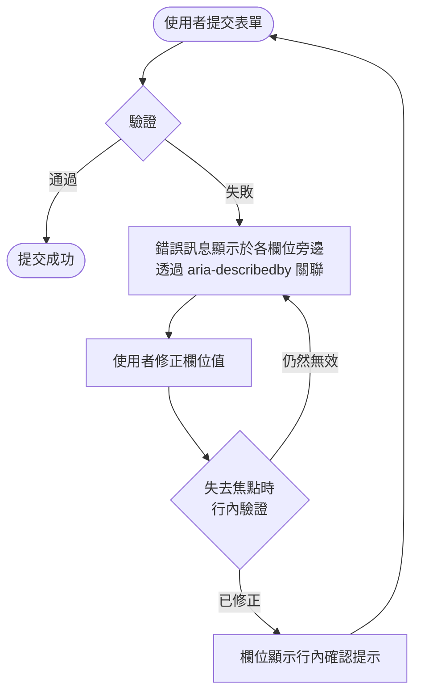

# 認知無障礙

認知無障礙針對的是具有認知、學習與神經系統障礙的使用者需求，涵蓋閱讀障礙、注意力不足過動症（ADHD）、自閉症類群障礙、記憶障礙，以及因腦傷或中風而引發的後天性認知障礙。
從全球角度來看，認知障礙是所有障礙類別中最普遍的一種，影響人口的比例遠高於肢體、視覺或聽覺障礙。
然而，認知障礙也最容易在無障礙審查中被忽略，原因在於其影響不像缺少替代文字或無法以鍵盤操作的元件那樣一目瞭然，但這並不意味著其影響較不嚴重。

WCAG 2.2 新增了專門針對認知無障礙的成功標準：SC 3.2.6（一致性說明）、SC 3.3.7（冗餘輸入）、SC 3.3.8（無障礙驗證——最低要求）以及 SC
3.3.9（無障礙驗證——增強要求）。這些標準反映了認知無障礙任務小組的研究結論：驗證身分、填寫表單以及頁面導航，是認知障礙使用者體驗最高阻礙的三大場景。
這些標準將使用者研究長期以來確立的結論正式化：當網頁應用程式缺乏認知無障礙設計時，最常見的操作任務就成為最令人難以克服的障礙。

認知無障礙並非獨立於良好使用者體驗之外的另一份清單；它就是有明確標準的良好使用者體驗。
清晰的語言、一致的導航、有意義的錯誤訊息，以及對使用者錯誤的容忍機制，對所有人都有益。差別在於：對認知障礙使用者而言，這些並非品質提升，而是缺席時的存取障礙。
沒有警告的工作階段逾時，對一般使用者只是不便；對處理速度緩慢或工作記憶有困難的使用者來說，卻是摧毀已完成工作的障礙。
語意模糊的錯誤訊息讓能力較強的使用者短暫感到挫折；對有閱讀障礙的使用者而言，則意味著無從判斷自己輸入了什麼錯誤，也不知道該如何修正。

工程師往往將認知無障礙視為終端使用者的無障礙功能，而非日常工程決策。
事實上，決定使用 `autocomplete="off"` 的工程師、撰寫「無效輸入」錯誤訊息的工程師、
清除多步驟表單返回時狀態的工程師，正在直接建立或消除認知無障礙障礙。
這使認知無障礙成為每位工程師在每個功能上都需要承擔的設計責任，而非只是審計時才需檢查的合規清單。

## 設計思維

### 白話文原則

有效的介面文案白話文寫作遵循一組固定的結構規則：短句、主動語態、一個段落只表達一個概念，以及一致的術語使用。最後一點往往被低估。
當介面在導航中將某個物件稱為「專案」，在設定面板中稱為「工作區」，在錯誤訊息中又稱為「空間」，使用者——尤其是認知障礙使用者——必須花費心力推斷這些詞彙指的是同一件事。
這種推斷工作是一種認知稅，隨著每次互動而累積。一致的術語使用可以完全消除這種負擔。

政府數位服務機構制定了直接適用於產品介面文案撰寫的白話文指南。GOV.UK
內容設計指南建議在每個句子中前置最關鍵的資訊、使用第二人稱（「您」），以及避免名詞化——也就是將動詞轉化為名詞，例如將「提交表單」變成「進行表單提交」。
名詞化會增加句子的複雜度，卻不增加任何資訊，在技術寫作中特別常見，原因是開發者比起使用者目標，更接近系統內部機制。
美國網頁設計系統（USWDS）的寫作指南提供了類似的建議，並附有具體的改寫前後對照範例，清楚展示白話文規則對真實介面文案的實際效果。

面向一般用途的介面文案，Flesch-Kincaid 可讀性等級應以八年級（Grade
8）以下為目標。
這並非對所有內容的嚴格上限——面向開發者的技術文件使用的語域本就不同——但對任務關鍵型介面文案，例如錯誤訊息、引導說明、空狀態以及確認對話框，八年級是適當的目標。
大多數現代可讀性評分工具已作為
lint 外掛程式提供於主流內容管理系統和文字編輯器，可整合至編輯審查工作流程，讓可讀性退步在發布前而非使用者測試後被發現。

一致性不僅適用於用字，也適用於介面本身的結構模式。
如果您的應用程式對確認對話框採用特定的視覺與文案模式——取消在左、確認在右、破壞性操作以紅色標示並採用特定警告句式——該模式必須在應用程式中的每一個確認對話框中保持一致。
使用者一旦學習了某種模式，便能依賴它；若使用者在不同情境中遇到模式改變，就必須在每次看到對話框時重新評估。
對有注意力困難或焦慮症的使用者而言，這種重新評估並非微不足道，而是在破壞性操作按鈕位置變化時產生錯誤的根源。

白話文也意味著說明文字、工具提示和行內指引應在使用者即將執行相關操作的時機點出現，而非放在需要離開當前流程才能查閱的說明中心文章中。
當指引必須存在於表單之外時，應可透過一個清楚標示、位置固定的說明機制從表單內部取得，且不應打斷使用者的任務焦點。

### 一致性說明與導航（WCAG 3.2.6）

WCAG
3.2.6（一致性說明）要求說明機制——聯絡連結、即時聊天、搜尋功能以及自助資源——在其出現的每個頁面中，位於相同的相對位置。
此標準存在的原因是：認知障礙使用者經常需要在執行任務過程中取得說明，且可能記不住上次在哪裡找到它，或是在目前頁面上它位於何處。
在某些頁面將說明顯示於頂部導航列、在其他頁面顯示於頁尾的介面，會強迫使用者在每次造訪時重新掃描整個頁面來找到它，這對有注意力困難的使用者是相當沉重的負擔。

導航選單必須在所有頁面中保持一致的順序與標籤。這不只是可用性指南，更是認知無障礙要求。
記憶障礙使用者為常用介面建立空間記憶：帳號設定永遠是導航中的第三項，登出選項永遠在帳號下拉選單的底部。
這些空間記憶讓使用者能在每次造訪時無需重新閱讀選單就能導航。
當導航順序改變——即使只是微妙地，例如當情境性的「升級」項目插入選單頂部而將所有其他項目向下位移時——這些空間記憶就會失效。
使用者必須在每次受影響的造訪中重新閱讀、重新定向、重新建立介面的心智地圖。

導航標籤也必須保持一致。如果主要導航將某個區段稱為「報表」，但頁面標題顯示為「分析儀表板」，使用者就必須進行推斷，確認這兩者指的是同一個區段。
這種不一致性在不同團隊各自擁有導航和頁面內容時很容易產生，並隨著功能的新增而逐漸累積。導航審查應確認每個導航標籤與其連結頁面的
H1 標題相符。

一致的說明也適用於描述求助行為的語言。
如果主要支援動作在行銷網站上標記為「聯絡我們」，而在應用程式內部標記為「取得協助」，在兩者之間導航的使用者就必須解決這種表面上的不一致——即使他們最終到達相同的目的地。
在整個產品中統一使用單一標籤，可消除這個解析步驟。標籤也應描述其機制：「與支援團隊聊天」比「取得協助」對正在決定是否參與的使用者更具資訊價值。

一致說明位置的實際實作方式，是在設計系統中建立說明機制元件，並在版面格線中指定其位置。
一旦此元件定義完成，每個頁面範本預設就包含該元件於指定位置，而偏離該位置需要明確的設計決策，而非逐頁的實作選擇。

### 防止冗餘輸入（WCAG 3.3.7）

多步驟表單**禁止（MUST NOT）**要求使用者重新輸入他們在早先步驟中已提供的資訊。WCAG
3.3.7（冗餘輸入）明文規定了這一要求。
重新輸入之前已提交的資訊會帶來認知負擔——使用者必須回憶自己輸入了什麼、再次準確輸入，並驗證其與之前內容一致——同時也會在每次重新輸入時引入錯誤風險。
對有閱讀障礙或運動障礙的使用者而言，重新輸入還是輸入錯誤的來源，而這些錯誤可能無法被識別為重新輸入錯誤；使用者可能相信自己在輸入不同的內容，實際上卻是試圖重現之前的輸入。

技術實作方式直接明確：在每個步驟中將表單資料儲存於元件狀態或工作階段儲存空間，並在後續步驟中預先填入先前輸入的值。
當使用者透過表單內部的返回按鈕（而非瀏覽器返回按鈕，後者會引入其自身的複雜性）導航回較早的步驟時，保留其已輸入的值，而非將步驟重置為空白狀態。
當使用者從已修正的較早步驟向前導航時，相應更新後續步驟中預先填入的值。
此模式要求表單儲存當前值的標準表示，並在任何步驟渲染時套用，無論使用者是第一次造訪還是返回造訪。

工作階段儲存空間適合用於在瀏覽器觸發的導航事件（瀏覽器返回按鈕）和主動工作階段中的頁面重新整理之間持久保存表單值。
本機儲存空間適合在需要表單於瀏覽器重啟後仍能存活的情況下使用。兩者均**禁止**用於儲存敏感憑證資料，例如密碼或信用卡號碼，這些資料不應被持久化。WCAG
3.3.7 中針對驗證步驟的例外情況——要求使用者輸入電子郵件地址兩次以確認——應保留用於靜默失敗的錯誤輸入電子郵件風險較高的情況，而非作為例行的表單模式應用。

在確認頁面上預先填入之前的資料，是一個對所有使用者均有益的密切相關模式。
顯示運送地址、付款方式和訂單摘要的結帳確認頁面，允許使用者在最終提交前驗證其輸入，而無需返回所有前面的步驟重新導航。此模式實現了電子商務情境下
WCAG 3.3.4（錯誤預防）的意圖，在承諾之前提供審查步驟。

### 無障礙驗證（WCAG 3.3.8）

WCAG 3.3.8（無障礙驗證——最低要求）規定，除非提供替代方法或說明機制，否則驗證流程不得依賴認知功能測試。認知功能測試包括：辨識扭曲文字（圖像型
CAPTCHA）、解答數學問題、在圖像中識別特定物件（例如「選取所有包含紅綠燈的圖像」），以及記憶在處理速度較慢的使用者能夠輸入之前就已到期的多步驟序列或暫時性代碼。
這些測試對沒有認知障礙的使用者而言是可解決的，但對有閱讀障礙、記憶障礙或注意力困難的使用者而言，會製造高阻礙甚至無法通過的障礙。

允許在密碼欄位中複製貼上是基礎要求，而非安全性取捨。密碼管理器——每個主要安全標準機構均推薦的、使用者可用的最安全憑證管理方式——依賴將憑證貼入驗證欄位的能力。
封鎖貼上功能會強迫使用者手動輸入憑證，提高所有使用者的錯誤率，並為記憶或運動障礙使用者製造存取障礙。瀏覽器將貼上功能實作為剪貼簿事件；封鎖它需要刻意攔截該事件。
任何在驗證欄位中攔截
`paste` 事件、移除 `autocomplete` 屬性，或在這些欄位設定 `autocomplete="off"` 的程式碼，都應被視為與安全性無關的無障礙退步，應予以移除。

驗證欄位的正確 `autocomplete` 屬性值為：使用者名稱或電子郵件欄位使用 `username`，登入表單的當前密碼欄位使用
`current-password`，註冊或密碼變更表單的新密碼欄位使用 `new-password`，OTP 輸入欄位使用
`one-time-code`。
這些值讓密碼管理器和瀏覽器憑證管理器能正確識別並填入欄位，也讓 iCloud 鑰匙圈等作業系統憑證管理器在支援的情況下能提供基於密碼金鑰的驗證。

若安全政策要求使用 CAPTCHA，提供音訊替代方案是無法解讀圖像型 CAPTCHA
的使用者——包括有閱讀障礙、視覺障礙或圖案辨識認知困難的使用者——所需的最低限度無障礙措施。更佳的解決方案是非認知型替代方案：電子郵件 OTP、SMS
OTP，或發送至先前已驗證電子郵件地址的魔法連結。這些機制在不要求任何認知功能測試的情況下驗證身分。
密碼金鑰驗證（WebAuthn）從安全性和認知無障礙兩個角度來看都是最強的可用替代方案，因為它完全不需要記憶憑證。

### 錯誤預防與復原

WCAG
3.3.4（錯誤預防）要求，對於使用者提交法律承諾或財務交易的頁面，提交內容應可撤銷、使用者輸入應進行錯誤檢查並提供修正機會，或在最終提交前提供確認機制。
此標準自然延伸至網頁應用程式中的任何破壞性操作——刪除帳戶、永久移除檔案、取消訂閱、撤銷存取權——其中意外操作的後果是重大的，且可能無法單靠使用者行動輕易撤銷。

行內驗證是表單錯誤回饋的首選模式，驗證時機與驗證內容同等重要。
在使用者離開欄位時（失去焦點時，即 `blur` 事件）進行驗證，而非在輸入時（按鍵時，即 `keyup`
事件），可避免在使用者仍在完成輸入的過程中呈現錯誤訊息。
使用者只輸入了「name@」時就呈現「此電子郵件無效」的錯誤，是毫無幫助的——使用者知道自己還沒完成輸入。
在失去焦點時進行驗證，等待使用者發出欄位完成的信號，然後立即提供回饋。
此回饋必須顯示於所描述欄位的旁邊，而非以橫幅形式顯示於頁面頂部，那樣會強迫使用者滾動過去，然後再滾動回來。

錯誤訊息必須透過 `aria-describedby` 與其欄位關聯，讓螢幕閱讀器使用者在焦點移到欄位時能收到錯誤文字。
`aria-invalid="true"`
屬性必須在欄位處於錯誤狀態時套用於欄位，這向螢幕閱讀器發出欄位包含無效輸入的信號，許多螢幕閱讀器會因此自動宣告關聯的描述。
當欄位值已修正且驗證通過時，這兩個屬性都必須移除或更新。

當錯誤狀態因使用者修正了欄位值而被清除時，應以可見的信號確認修正——帶有視覺上隱藏但無障礙標籤（例如「電子郵件地址有效」）的核取記號圖示，或與可見文字指示器配合的欄位框線顏色變化。
這種確認對有焦慮症或強迫症、可能對自己的輸入產生懷疑的使用者尤其重要。視覺確認提供了一個明確的信號，表明該欄位無需進一步操作。

對於破壞性操作，確認對話框是標準的錯誤預防機制。對話框應以具體的詞語描述操作及其後果（「刪除此專案？所有 47
個檔案及其版本歷史記錄將永久移除，無法復原。」），而非抽象的詞語（「您確定嗎？」）。取消選項應是預設的焦點元素，讓意外觸發對話框的使用者無需額外導航即可關閉它。
確認選項應要求明確的確認動作（點擊，而非僅僅按下
Enter），以確保透過在表單提交按鈕上按 Enter 觸發對話框的鍵盤使用者，不會立即確認破壞性操作。

### 工作記憶與任務中斷

工作記憶——暫時保存和處理資訊的認知系統——是認知障礙使用者在複雜網路任務中最常見的失敗點。
一個正在填寫多欄位註冊表單的使用者接到電話、關上筆電，二十分鐘後返回，其工作記憶脈絡已完全消失。有 ADHD
的使用者在任務進行中被瀏覽器通知分心，面臨同樣的認知重置。當他們返回時，必須重新閱讀表單以確定自己進行到哪裡、已完成哪些欄位，以及打算輸入什麼資訊。

針對工作記憶限制進行設計，意味著在任何互動過程中，將必須保存在記憶中的資訊量最小化。
單欄式表單版面確保使用者以清晰的線性順序處理欄位，而非在多個可能路徑之間做出決定。
多步驟表單上的進度指示器，顯示使用者所在位置、剩餘步驟數量，以及已完成的步驟——將原本需要保存在工作記憶中的資訊外化。
步驟標籤應描述每個步驟包含的內容（「您的地址」、「付款詳情」、「確認並提交」），而非使用通用編號（「第
1 步，共 3 步」），讓使用者無需記住每個步驟編號的含義，就能在流程中定位自己。

表單和互動工作階段的時間限制，強加了使用者在整個任務過程中必須保存在工作記憶中的截止時間。
即使顯示了倒計時計時器，在完成表單欄位的同時監控剩餘時間的認知需求也相當高。
首選解決方案是完全移除表單完成的時間限制，並將工作階段逾時限制在非活躍期間而非總elapsed
時間。當出於安全原因必須設定時間限制時，逾時計時器應在有活動時重置，而非從工作階段開始持續運行，且警告和延長機制必須可透過鍵盤操作，並向螢幕閱讀器宣告。

### OTP 到期時間與處理速度

一次性密碼（OTP）的到期時間對認知無障礙提出了具體挑戰。
許多 OTP 實作在 30 至 60 秒後讓代碼失效，這對大多數使用者而言是足夠的時間，
讓他們能切換至電子郵件應用程式、找到訊息、讀取代碼、切換回應用程式並輸入。
對於處理速度較慢、有注意力困難或運動障礙的使用者，這個時間表並不充裕。

美國國家標準技術研究院（NIST）SP 800-63B 建議 OTP 代碼的有效期至少為五分鐘。
使用更短到期窗口的實作，應對照此建議進行評估，
因為它們施加的時間壓力，對處理速度較慢的使用者而言，
實際上構成了一種認知功能測試。

發送 OTP 的機制本身也是認知無障礙的考量點。
SMS OTP 要求使用者在應用程式之間切換，並在輸入前記住或重新閱讀代碼。
電子郵件 OTP 提供稍長的持久性，但仍需在應用程式之間切換。
支援 `autocomplete="one-time-code"` 屬性和作業系統自動填入（如 iOS 簡訊自動填入），
可讓 OTP 代碼自動進入欄位，無需任何記憶或手動輸入。
這種機制大幅降低 OTP 流程的認知負擔，應在所有 OTP 輸入欄位上實作。

### 輸入格式輔助

輸入遮罩——在使用者輸入時以視覺模式引導格式的機制——可以減少格式嚴格的欄位驗證錯誤，
例如電話號碼、信用卡號碼和日期。
電話號碼欄位的輸入遮罩，在使用者輸入時自動插入連字號（「0912-345-678」），
減少了在輸入數字的同時記住格式的認知需求。

輸入遮罩不得限制貼上操作，因為貼入未格式化的號碼並讓其自動格式化，
比要求使用者以特定格式模式輸入更具無障礙性。
格式提示應在欄位旁邊以說明文字提供，而非僅以 placeholder 提供，
因為 placeholder 在使用者開始輸入後消失。

日期欄位特別容易出現認知無障礙問題。
「MM/DD/YYYY」和「DD/MM/YYYY」的格式差異，
對具有記憶困難或生活在多種日期格式慣例中的使用者而言，是頻繁的錯誤來源。
在可能的情況下，使用獨立的下拉選單或輸入欄位分別輸入日、月、年，
比要求使用者在單一欄位中記住並輸入組合格式更具認知無障礙性。

### 錯誤狀態中的認知負擔

錯誤狀態是任何表單互動中認知負擔最高的時刻。
使用者必須同時處理以下資訊：某些事情出錯了、識別哪個或哪些欄位有錯誤、了解每個欄位的值具體哪裡出了問題、回憶或查找正確的值、修正欄位值，以及驗證修正已被接受。
這每一步都是獨立的認知步驟，而且它們都發生在使用者的目標——完成表單——感覺受阻的時刻。

減少錯誤狀態中的認知負擔，需要最小化從識別錯誤到成功修正之間的步驟數量。當表單有多個錯誤時，一次處理一個，而非用所有錯誤同時壓倒使用者。
焦點管理發揮作用：提交失敗後，將焦點移至第一個有錯誤的欄位，讓使用者從第一個問題開始修正，而非重新閱讀整個表單。
提供最具體的錯誤描述，在格式相關時包含正確輸入的範例。
如果使用者的輸入接近正確——例如電子郵件地址缺少域名部分——承認已輸入的內容（「您輸入的地址「name@」缺少域名。
例如：name@example.com」），而非僅僅重申所需格式。

顏色**禁止**作為錯誤狀態的唯一指示器。有色覺缺陷的使用者，以及啟用了高對比度模式的使用者，可能無法將紅色框線與預設框線區分開來。
每個錯誤狀態都必須有非顏色指示器：可見圖示、在欄位標籤或錯誤訊息前加上「錯誤：」文字，或兩者兼具。`aria-invalid="true"`
屬性為螢幕閱讀器使用者提供了程式化指示器，但所有其他使用者也需要可見文字和圖示。

認知無障礙的設計原則並不只適用於有認知障礙的使用者，而是對所有使用者都有
益——尤其是在壓力、干擾或時間限制下使用介面的情境。白話文、清晰的錯誤訊
息、可預測的介面行為，在醫療、金融或緊急情境等高壓使用場景中，能顯著降
低所有使用者的錯誤率。在衡量認知無障礙的投資回報時，不應只計算障礙使用
者的比例，而應考慮全部使用者在各種使用情境下的整體錯誤率和任務完成率。
設計給最需要幫助的使用者，往往意味著設計給所有人。

可預測性是認知無障礙設計的核心屬性之一。當使用者在應用程式中建立一套對
UI 行為的預期模型後，意外的行為變化會打破這個模型，需要消耗認知資源重
新評估情境。這對認知障礙使用者造成的影響尤為顯著。一致的互動模式——相
同的動作在整個應用程式中產生相同的結果——是維持可預測性的基礎。設計系
統在此扮演重要角色：強制執行一致的元件行為，可以防止個別功能團隊在相似
的互動模式中引入微小但會累積認知成本的差異。

## 最佳實踐

**必須（MUST）**以白話文撰寫所有介面文案，包括錯誤訊息、驗證回饋、引導說明、確認對話框及說明文件。錯誤訊息必須識別發生了什麼問題並指示具體的修正方式；「Request failed: 422 Unprocessable Entity」並不具可操作性，而「您的電子郵件地址必須符合格式：name@example.com」則具體可行。白話文不是簡化內容，而是認知無障礙的直接要求，對所有使用者都有益。

**禁止（MUST NOT）**在任何驗證、個人資訊或表單欄位中停用瀏覽器自動填入或貼上功能。`autocomplete="off"` 與封鎖剪貼簿事件，會強迫使用者從記憶中輸入，為認知障礙、運動障礙使用者以及任何使用密碼管理器的人製造障礙。瀏覽器自動填入與剪貼簿是無障礙功能；停用它們以進行安全性表演只會降低無障礙性，對任何真實的威脅模型均不能提供有意義的保護。每一個被封鎖的貼上事件和每一個被抑制的自動填入，都是一個刻意讓依賴這些機制的使用者更難使用介面的選擇。

**必須（MUST）**撰寫能識別錯誤欄位、以白話文描述問題，並指示修正方式的錯誤訊息。「無效輸入」未識別任何內容。「電話號碼必須是 10 位數字，例如：0912-345-678」告訴使用者問題所在、預期格式，並提供範例。錯誤訊息必須顯示於欄位旁邊、透過 `aria-describedby` 關聯，並持續顯示直到欄位被修正。欄位處於錯誤狀態時，必須套用 `aria-invalid="true"` 屬性；欄位值有效時，必須移除或更新此屬性。

**必須（MUST）**在使用者於多步驟流程中的各步驟之間導航，或從較後步驟返回較早步驟時，保留表單狀態。在使用者返回時清除先前輸入的值，會違反 WCAG 3.3.7 強制要求冗餘輸入，並丟棄使用者已完成的工作。將表單值儲存於元件狀態或工作階段儲存空間，並在各步驟渲染時預先填入。

**禁止（MUST NOT）**以認知功能測試——扭曲文字 CAPTCHA、算術問題或圖像物件識別——作為唯一的驗證方式。至少應提供一種替代方案：音訊 CAPTCHA、電子郵件 OTP、魔法連結或密碼金鑰驗證。若政策規定必須使用認知型 CAPTCHA，應將替代方案醒目地顯示於其旁邊，而非隱藏在使用者必須先發現再追蹤的無障礙連結後面。

**應該（SHOULD）**為使用者完成有時間限制的表單提供充裕時間，並在工作階段即將逾時前警告使用者，並提供延長選項。WCAG 2.2.1（可調整時間）要求需要更多時間的使用者能在逾時前提出請求。對於有工作階段逾時的複雜表單或驗證流程，應在逾時前至少 20 秒顯示警告，並允許在不遺失資料的情況下延長。使用即時區域（`aria-live="assertive"`）實作警告，讓螢幕閱讀器使用者無需視覺確認即可收到通知。

**應該（SHOULD）**在所有介面表面使用一致的術語。當相同概念在介面的不同部分以不同詞彙稱呼時，認知障礙使用者必須花費額外的心力來解析這些表面上的不一致。建立產品詞彙表，並透過編輯審查，以及在可能的情況下透過自動化檢查，在錯誤訊息、標籤、說明文字與導航項目中強制執行一致的術語使用。

## 視覺呈現



## 範例

```html
<label for="email">電子郵件地址</label>
<input
  id="email"
  type="email"
  aria-describedby="email-error"
  aria-invalid="true"
  autocomplete="email"
>
<p id="email-error" role="alert">
  請輸入格式正確的電子郵件地址：name@example.com
</p>
```

## 常見錯誤

- 在登入或註冊表單欄位設定 `autocomplete="off"`，誤以為這能提高安全性。此做法封鎖了密碼管理器與瀏覽器自動填入，製造存取障礙，且對任何真實威脅模型均無有意義的安全性效益。
- 以 placeholder 文字取代可見標籤。Placeholder 文字在輸入時消失、通常對比度不足，且各輔助技術對其處理方式不一致。每個欄位都需要一個持續可見的標籤。
- 以表單頂部的摘要形式顯示所有驗證錯誤，而非在各錯誤所屬欄位旁邊顯示。認知障礙使用者必須將錯誤清單保存在工作記憶中，同時滾動頁面找到相關欄位。
- 使用者返回多步驟流程的前一步驟時清除表單值。這會強制冗餘輸入，違反 WCAG 3.3.7，並丟棄使用者已完成的工作。
- 撰寫只描述問題、而未指示修正方式的錯誤訊息。「無效的電子郵件」是不完整的。「請輸入格式正確的電子郵件地址：name@example.com」才是完整的。
- 實作無替代方案的圖像型 CAPTCHA，封鎖認知障礙使用者完成驗證。
- 在使用者尚未修正欄位值之前移除錯誤訊息。錯誤狀態必須持續直到欄位通過驗證。
- 在頁面之間更改導航順序或說明位置，破壞認知障礙使用者依賴的空間記憶模式。
- 在使用者仍在輸入時（`keyup` 事件）而非離開欄位時（`blur` 事件）進行驗證，導致錯誤訊息在使用者仍在撰寫輸入內容時出現。
- 在介面的不同部分使用不同術語指稱相同概念，要求使用者推斷其等同性。
- 將 OTP 到期時間設定為短於五分鐘，對處理速度較慢的使用者製造事實上的認知功能測試。
- 在 OTP 輸入欄位省略 `autocomplete="one-time-code"` 屬性，阻止作業系統自動填入代碼的功能運作，強迫使用者手動記憶並輸入代碼。
- 使用單一文字輸入欄位收集日期，並要求特定格式（如 MM/DD/YYYY），而非提供獨立的日、月、年欄位或具備明確格式提示的日期選擇器。
- 僅以顏色標示錯誤狀態，未提供圖示或文字等非顏色指示器，導致色覺障礙使用者或高對比度模式使用者無法識別欄位錯誤。

## 相關 FEE

- [FEE-1000 — 無障礙設計總覽](./1000.md)
- [FEE-1001 — ARIA 與語義化 HTML](./1001.md)
- [FEE-1005 — 無障礙表單與輸入元素](./1005.md)
- [FEE-1002 — 鍵盤導航與焦點管理](./1002.md)

## 參考資料

- [WCAG 2.2：認知標準——了解 SC 3.3.8 無障礙驗證](https://www.w3.org/WAI/WCAG22/Understanding/)
- [W3C 認知無障礙任務小組](https://www.w3.org/WAI/GL/task-forces/coga/)
- [GOV.UK 內容設計：白話文英語](https://www.gov.uk/guidance/content-design/writing-for-gov-uk)
- [WebAIM：認知障礙](https://webaim.org/articles/cognitive/)
