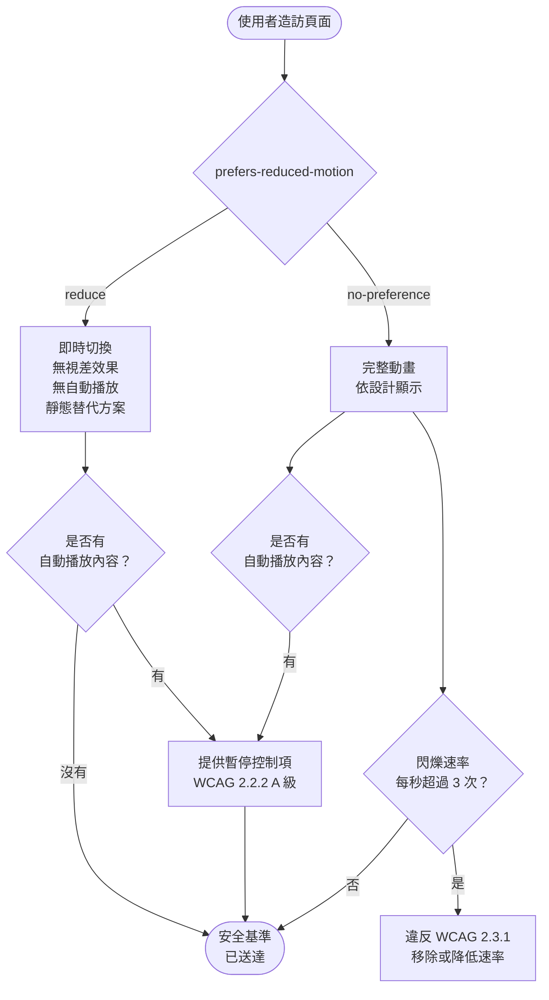

# 動態與動畫無障礙

動態與動畫是傳達狀態、提供回饋與引導注意力的強大介面工具，同時也帶來無障礙風險。
對前庭系統障礙的使用者而言——這是一個涵蓋全球數百萬人的群體——涉及視差、縮放、
旋轉或大範圍移動的動畫，可能引發噁心、頭暈和偏頭痛。前庭系統負責控制平衡感與
空間定向，當螢幕上的視覺動態與身體的其他感知訊號發生衝突時，便會產生干擾反應。
當使用者捲動時縮放的主視覺區塊、以不同速率移動的視差背景，或是在懸停時向外展開
的卡片，都可能在沒有任何外顯障礙、原本完全能夠正常使用介面的使用者身上，引發使
其喪失行為能力的身體反應。

CSS 媒體查詢 `prefers-reduced-motion` 允許使用者表達他們偏好減少動態效果。在 macOS
上，這對應於輔助功能設定中的「減少動態效果」；在 Windows 上，對應於輕鬆存取設定中
的「關閉動畫效果」；在 iOS 和 Android 上，等效的輔助功能設定會在透過瀏覽器存取時
對應至相同的媒體查詢。當媒體查詢回傳 `reduce` 時，網頁應用程式應消除或大幅降低可
能造成傷害或分心的動畫。這並非小眾的特殊需求——對前庭系統障礙使用者的調查一再發
現，網站上的動態效果是觸發症狀最常見的因素之一，且許多使用者已養成習慣，長期保持
「減少動態效果」的啟用狀態，以避免遭遇無法預期的內容。

「減少動態效果」並不等於「沒有動畫」。它的意思是，可能造成傷害或分心的動畫應當
降低或以即時切換及更簡單的替代方案取代。傳達意義的狀態切換動畫——表示載入中的
旋轉指示器、表示成功的顏色變化、確認新內容已載入的細緻淡入——可在減少動態效果模
式下保留，因為它們傳遞資訊而不觸發前庭反應。大範圍視差移動、彈跳或彈性物理效果、
旋轉過渡，以及佔據大量螢幕面積的自動播放動畫，是最常與前庭觸發相關的類別，當媒體
查詢回傳 `reduce` 時，這些應消除或以靜態等效內容取代。

對光敏性癲癇使用者而言，閃爍內容帶來獨立且更為急迫的風險。WCAG 2.3.1（三次閃爍
或低於閾值）規定，內容在大範圍區域內每秒閃爍不得超過三次。此標準為 A 級——所有
內容必須達到的基本要求——因為違反此標準可能在光敏性癲癇使用者身上引發全身性強直
-陣攣性發作。這不是理論上的風險：有文獻記錄的案例顯示，網頁內容曾引發癲癇發作，
且後果可能嚴重且即時。對注意力障礙的使用者而言，視野周邊持續或循環播放的動畫，
可能使他們無法專注於主要任務，讓原本只是裝飾性的背景元素變成實質性的障礙。

## 設計思維

### 前庭系統障礙與視差

前庭系統透過整合來自內耳、眼睛以及全身本體感受器的訊號，控制平衡感與空間定向。
當螢幕上的視覺動態與身體其他感知訊號相矛盾——由於使用者並未實際移動，這些訊號保
持靜止——所產生的衝突可能引發類似暈動病的反應。對前庭系統障礙的使用者而言，這種
反應相較於一般人群顯著放大，且可能在螢幕動態效果十分細微的情況下就已觸發。常見的
UI 設計模式中，以下最容易觸發前庭反應：不同頁面圖層以不同速率移動的視差捲動效果；
根據捲動位置縮放頁面元素的縮放動畫；隨頁面捲動而移動或轉換的黏性元素；以及頁面載
入時使用縮放或位移變換的大型主視覺或區塊動畫。

未親身體驗過前庭敏感症狀的設計師，往往低估這些效果可能造成的嚴重影響。典型的前庭
反應不只是美觀層面的不適——它可能引發在接觸觸發性內容後持續數小時的噁心，使患者
在當日無法繼續使用電腦的頭暈，以及在觸發性互動後數分鐘內開始的偏頭痛。有過這些
經歷的使用者通常學會迴避使用視差或大範圍動畫的網站，但發現某個網站是觸發因素，
需要先接觸到觸發性內容，這意味著他們無法在效果開始前安全地預覽或離開。每個工程
團隊的最低基準，是在啟用「減少動態效果」的狀態下測試自己的產品，並確認減少動態
效果狀態下不存在大範圍移動或視差動畫。

理解特定設計模式為何觸發前庭反應，有助於工程師做出更好的替代選擇。觸發因素不是
視覺變化本身——顏色變化、淡入淡出或不透明度過渡很少引發前庭反應——而是物件在空
間中移動的感知。暗示三維空間中移動的動畫（縮放、透視變換、旋轉）比暗示二維變化
的動畫（顏色、不透明度、模糊）更容易成為觸發因素。在以減少動態效果的替代方案取
代觸發性動畫時，目標是保留動畫的溝通意圖——「這個元素正在出現」、「這個元素正在
被移除」——同時以感知上的平面變化（淡入淡出）取代空間暗示性的變化（滑入或縮放）。

前庭障礙的盛行率高於大多數工程師的直覺估計。前庭疾患包括良性陣發性眩暈（BPPV）、
前庭神經炎、梅尼爾氏症以及因頭部外傷引發的繼發性前庭功能障礙。這些疾患在年長者
中更為普遍，但在任何年齡層均可發生。許多使用者並未正式診斷，只知道某些螢幕內容
讓他們感到不舒適，並因此養成迴避特定網站的習慣。啟用「減少動態效果」是他們對這
個不確定環境唯一可靠的防護機制，而網頁工程師尊重這個設定，是這個防護機制能否真
正發揮作用的關鍵。

### prefers-reduced-motion: reduce 與 no-preference

`prefers-reduced-motion` 媒體查詢有兩種狀態：`no-preference` 和 `reduce`。
`no-preference` 狀態是預設值——當使用者未調整系統輔助功能設定時回傳，並不代表使用
者積極希望有動態效果。`reduce` 狀態在使用者明確於系統設定中啟用「減少動態效果」時
回傳，表明對較少動態效果的偏好。

一種常見的實作模式是將完整動畫作為預設 CSS 規則，並新增 `prefers-reduced-motion:
reduce` 覆寫規則來停用動畫。這種方式可行，但存在一個失效模式：若媒體查詢不被支
援，或 CSS 特異性問題導致覆寫規則被忽略，已啟用「減少動態效果」的使用者將收到動
畫版本。較佳的模式是反轉這個邏輯：將減少動態效果狀態作為預設 CSS，並將動畫版本包
含在 `@media (prefers-reduced-motion: no-preference)` 區塊中。在這種模式下，安全基
準是每位使用者預設收到的內容，而動畫版本僅作為未表達動態效果偏好的使用者的選項。
這種方式更為保守且安全：特異性問題或不支援的媒體查詢，會導致使用者收到靜態版本而
非動畫版本，這是危害較低的失效模式。

選擇哪種方式也取決於動畫的撰寫方式。對完全在樣式表中控制的 CSS 動畫，反轉模式最
易實作。對由 Framer Motion 等 JavaScript 動畫函式庫驅動的動畫，等效的 hook
（`useReducedMotion`）以程式方式讀取媒體查詢並回傳布林值，元件可使用此布林值完全
跳過動畫版本的過渡，而非套用持續時間覆寫。對複雜的動畫序列而言，跳過比試圖覆寫
第三方函式庫深層應用的持續時間，更為簡潔可靠。

從設計流程的角度來看，最具前瞻性的做法是將「減少動態效果」模式視為設計的第一版本，
而非後期加入的回退方案。當設計師以靜態或僅使用淡入淡出的版本作為主要設計稿，並在
此基礎上為「偏好動畫」的使用者加入動態強化版本，整個開發流程的思維方向就會改變。
工程師在預設狀態下實作的是安全版本，動畫是一種加值，而非移除後才能得到的回退。
這種思維轉變可以有效降低後期發現漏網動畫的機率，因為每個動畫都是主動加入的，而非
被動移除的。

### WCAG 2.3.1 三次閃爍

WCAG 2.3.1（三次閃爍或低於閾值）為網頁內容建立了光敏性癲癇發作閾值。當內容在覆
蓋超過 25% 的螢幕或視窗組合面積的區域內，每秒閃爍三次或以上，且閃爍亮度變化超過
標準技術規範定義的閾值時，即違反此標準。此標準為 A 級——無障礙設計的基礎基準——
因為違反此標準可能在光敏性癲癇使用者身上引發全身性強直-陣攣性發作，且毫無預警，
有時後果嚴重。

網頁工程師最常在三種情境中遭遇此標準。第一種是快速切換不透明度、可見性或背景色
的 CSS 動畫——例如以每秒超過三個循環的速率，在 `opacity: 0` 和 `opacity: 1` 之間
循環的動畫。第二種是 JavaScript 驅動的 DOM 變更，導致大面積螢幕區域在高對比狀態
之間交替，例如用於吸引注意的閃爍通知橫幅。第三種是嵌入的影片內容，包括自動播放
的宣傳影片，在發布前未進行閃爍合規性檢查。第三方內容不在豁免之列：頁面發布者對
頁面上所有內容的無障礙合規性負責，包括嵌入內容。

自動化測試無法完全偵測 WCAG 2.3.1 違規，因為大多數違規取決於動畫播放期間的變化
速率和面積，而非靜態頁面結構。動畫互動的螢幕錄影可使用 PEAT 或哈丁分析儀進行分
析。對無法取得這些工具的工程團隊，實用的啟發式規則是：永遠不要建立在強烈對比視
覺狀態之間，以每 333 毫秒（每秒三次）以上速率交替的 CSS 動畫或 JavaScript 過渡；
並確保此類交替動畫僅限於視窗的小面積區域。

此標準的「閾值」部分提供了一個技術上的例外路徑：若閃爍的亮度對比低於特定數值，
即使速率超過每秒三次，也可能不構成違規。然而，此閾值計算涉及相對亮度測量和面積
加權，需要工具才能可靠評估。對大多數工程團隊而言，最安全的實務原則是完全迴避快
速交替的強對比動畫，而非試圖接近但不超過閾值。閾值計算的細節在 WCAG 技術說明文
件中有完整說明，並由 PEAT 工具自動處理。

### 自動播放動畫與 WCAG 2.2.2

WCAG 2.2.2（暫停、停止、隱藏）要求自動播放的內容——輪播、主視覺動畫、背景影片、
循環插圖——若自動開始且持續時間超過五秒，使用者必須能夠暫停、停止或隱藏它。暫停
或停止控制項必須可用鍵盤操作，且無需使用者將游標懸停或將焦點移入動畫區域即可看
到。主視覺區塊中的循環背景影片若沒有可見的暫停按鈕，即違反 A 級標準。每四秒自動
換頁且無任何停止方式的輪播，同樣違反此標準。

WCAG 2.2.2 的意圖是解決注意力障礙使用者的需求，對他們而言，視野任何部分的持續動
態，都是試圖完成任務時的嚴重干擾。一位患有注意力不足過動症的使用者，在嘗試閱讀
頁面正文的同時，若標題處有循環動畫在播放，可能發現自己實際上無法對文字維持注意
力。暫停控制項透過給予使用者停止動態的能力，讓他們得以專注，從而解決了這個問題。
控制項必須從動畫開始播放的那一刻起便清晰可見，而非隱藏在懸停狀態後方或僅能透過
使用者必須先發現的設定面板取得。

為背景影片實作暫停控制項，需要一個具有清楚標籤的可見按鈕——「暫停背景影片」或附
有無障礙名稱的圖示——用以切換影片的 `paused` 狀態，並更新按鈕自身的標籤以反映當
前狀態（暫停時顯示「播放背景影片」）。按鈕必須在頁面的自然定位順序中可用鍵盤操
作，若影片位於頁面頂部附近，按鈕應在 DOM 中出現於影片之前。對輪播而言，暫停控制
項必須停止自動換頁；當自動換頁暫停時，用於在投影片之間移動的個別導航控制項必須
保持可用。使用者的暫停狀態應在其造訪期間受到尊重；在使用者暫停後重新啟動動畫是
一種可用性錯誤。

WCAG 2.2.2 中「五秒」的門檻值，意在區分短暫的過渡動畫（如頁面載入時的淡入效果）
與持續循環或自動推進的內容。一個持續三秒的進場動畫在標準上不需要暫停控制項，但
若該動畫在首次播放後繼續循環，即使每次循環不超過五秒，整體持續時間仍超過閾值，
因此需要暫停控制項。判斷的關鍵是內容是否在使用者未主動互動的情況下，持續在視野
中產生動態——若是，就需要暫停機制。

### JavaScript 驅動的動畫與 useReducedMotion

許多動畫密集的應用程式透過 JavaScript 而非 CSS 驅動動畫，使用 Framer Motion、
GSAP、React Spring 或 Anime.js 等函式庫。在這些情況下，`@media
(prefers-reduced-motion)` CSS 查詢可能不適用，因為動畫是以程式方式建構的，並以行
內樣式或透過函式庫的內部渲染管線套用。為了在 JavaScript 驅動的動畫中尊重使用者的
減少動態效果偏好，必須以程式方式讀取此偏好。

在使用 Framer Motion 的 React 應用程式中，`useReducedMotion` hook 回傳一個布林值，
當使用者啟用「減少動態效果」時為 `true`。元件可使用此布林值以減少動態效果的動畫
變體——通常是簡單的淡入淡出或完全沒有動畫——取代完整動態版本。此 hook 從與 CSS 功
能相同的底層媒體查詢讀取，因此在不重新載入頁面的情況下，即可對系統設定的變更做
出回應。對未使用 Framer Motion 的應用程式，可透過
`window.matchMedia('(prefers-reduced-motion: reduce)')` 和 `change` 事件監聽器達到
相同效果，在媒體查詢狀態改變時更新元件狀態。

對直接將動畫套用於 DOM 節點而非透過 React 狀態的動畫函式庫，應在啟動任何動畫序
列之前檢查媒體查詢結果，並在 `reduce` 啟用時將動畫持續時間設為接近零，而非預設
值。GSAP 提供了 `gsap.globalTimeline.timeScale()` 方法，可全域縮放所有動畫持續時
間；當偏好減少動態效果時，將此值設為極端值（0.001）可有效消除所有 GSAP 動畫，而
無需逐一修改每個動畫的定義。無論採用哪種方式，實作都應全域且一致地套用——逐元件
的實作需要每位元件作者主動選擇處理減少動態效果，這將產生新元件遺漏處理的風險，
需要持續的審計工作才能發現缺漏。

設計系統與元件庫的維護者肩負額外的責任：函式庫中的每個帶有動畫的元件，都應在其
預設行為中內建對 `prefers-reduced-motion` 的支援，而非依賴消費者手動覆寫。一個對
外提供的輪播元件，若未在文件中說明其對媒體查詢的處理方式，便將合規責任轉嫁給了
每一個使用它的工程師。反之，若元件庫的每個動態元件均在內部讀取並尊重此偏好，消
費者只需使用元件，無需為每個使用場景單獨處理減少動態效果的邏輯。

## 最佳實踐

**必須（MUST）**將所有涉及大範圍移動、視差或旋轉的 CSS 動畫與過渡，包含在
`@media (prefers-reduced-motion: no-preference)` 區塊中，並以靜態或即時切換的回退
方案作為預設規則。將動畫狀態撰寫為選項，而非將減少動態效果作為覆寫，可確保未更
改系統設定的使用者收到安全基準，並消除 CSS 特異性問題導致媒體查詢覆寫被靜默忽略
的風險。

**禁止（MUST NOT）**在覆蓋視窗超過 25% 面積的區域內，建立在強烈對比視覺狀態之間
每秒交替超過三次的 CSS 動畫或 JavaScript 過渡。違反 WCAG 2.3.1 的內容可能在光敏性
癲癇使用者身上引發發作。每當內容包含快速交替的視覺狀態時，應在發布前使用 PEAT 或
哈丁閃爍與圖案分析儀，對動畫內容的螢幕錄影進行分析。

**必須（MUST）**為所有持續超過五秒的自動播放動畫或影片，提供可用鍵盤操作的播放
／暫停控制項。WCAG 2.2.2 是 A 級要求。自動換頁的輪播、含有循環影片或動畫的主視覺
區塊，以及頁面上持續存在的任何自動播放內容，均需要一個在所有狀態下均可見、在自
然定位順序中可用鍵盤操作，且以反映受控內容當前播放／暫停狀態的無障礙名稱加以標
記的暫停控制項。

**應該（SHOULD）**在 CSS 過渡的減少動態效果回退方案中，使用
`transition-duration: 0.01ms; animation-duration: 0.01ms`，而非完全移除動畫屬性。
將持續時間設為接近零可保留過渡機制——JavaScript 可能透過 `transitionend` 和
`animationend` 事件依賴此機制——同時使視覺變化實際上即時發生。使用 `animation: none`
完全移除屬性，會破壞監聽 `animationend` 以觸發動畫後邏輯的 JavaScript，且可能產
生難以診斷的靜默回歸。

**應該（SHOULD）**為 JavaScript 驅動的動畫實作全域的減少動態效果 hook 或工具，並
在應用程式根層套用，而非要求每個元件各自讀取媒體查詢。全域實作確保整個應用程式行
為一致，防止新元件意外遺漏減少動態效果的處理，並在實作策略需要變更時提供單一的
更新點。此 hook 還應監聽媒體查詢變更，使在應用程式執行期間切換「減少動態效果」的
使用者，無需重新載入頁面即可立即獲得回應。

## 視覺呈現



## 範例

```css
/* 預設：無動態效果——對所有使用者安全，
   包括未更改系統設定的使用者 */
.hero {
  opacity: 1;
  transform: none;
}

/* 僅在使用者無偏好設定時選用動態效果 */
@media (prefers-reduced-motion: no-preference) {
  .hero {
    animation: slideIn 600ms ease-out;
  }

  .card {
    transition: transform 300ms ease, box-shadow 300ms ease;
  }

  .card:hover {
    transform: translateY(-4px);
  }
}

/* 替代方案：全域減少動態效果覆寫。
   使用 0.01ms 而非 0，以保留 transitionend 事件。 */
@media (prefers-reduced-motion: reduce) {
  *,
  *::before,
  *::after {
    animation-duration: 0.01ms !important;
    animation-iteration-count: 1 !important;
    transition-duration: 0.01ms !important;
    scroll-behavior: auto !important;
  }
}
```

## 常見錯誤

- 將動畫狀態作為預設，並將減少動態效果狀態作為覆寫。特異性問題或不支援的媒體查詢
  會導致覆寫靜默失敗，使已啟用「減少動態效果」的使用者收到動畫版本。
- 在減少動態效果回退方案中設定 `animation: none` 或 `transition: none`。這會完全移
  除動畫機制，破壞監聽 `animationend` 或 `transitionend` 事件以觸發動畫後邏輯的
  JavaScript。
- 僅在啟用「減少動態效果」的狀態下進行減少動態效果合規性測試，並以目視確認動畫消
  失。這會遺漏 JavaScript 驅動的動畫完全忽略 CSS 媒體查詢的情況，此類動畫必須以
  `useReducedMotion` 或 `window.matchMedia` 處理。
- 逐元件而非全域實作減少動態效果處理。這產生新元件遺漏處理的風險，需要持續的審計
  工作才能發現缺漏。
- 發布無暫停控制項的自動播放輪播或主視覺影片內容，或僅在懸停時可見暫停控制項。無
  法觸發懸停互動的鍵盤使用者無法到達暫停控制項，也無法停止動畫。
- 假設視差或縮放動畫因速度緩慢或細微而安全。前庭敏感性在使用者之間差異很大；在典
  型顯示器上看似無害的緩慢視差效果，仍可能在敏感使用者身上觸發前庭反應。
- 使用快速的 CSS 不透明度切換來建立吸引注意的閃爍效果。即使意圖是裝飾性的而非警
  示性的，大型元件在 0 和 1 之間快速的不透明度交替，仍可能違反 WCAG 2.3.1。
- 僅憑目視檢查確認 WCAG 2.3.1 合規性。三次閃爍每秒的閾值無法靠肉眼可靠偵測；必須
  使用 PEAT 等工具。
- 在使用者暫停後重新啟動自動播放動畫。一旦使用者暫停動態效果，暫停狀態必須在其工
  作階段期間受到尊重。

## 相關 FEE

- [FEE-1000 — 無障礙設計總覽](./1000.md)
- [FEE-710 — GPU 加速動畫與 `will-change`](../Rendering%20and%20Performance/710.md)
- [FEE-412 — `requestAnimationFrame` 與動畫計時](../JavaScript%20Core%20and%20Runtime/412.md)
- [FEE-1010 — 無障礙與國際化的交集](./1010.md)

## 參考資料

- [MDN: prefers-reduced-motion](https://developer.mozilla.org/en-US/docs/Web/CSS/@media/prefers-reduced-motion)
- [web.dev: prefers-reduced-motion](https://web.dev/articles/prefers-reduced-motion)
- [WCAG 2.3.1：三次閃爍或低於閾值](https://www.w3.org/WAI/WCAG22/Understanding/three-flashes-or-below-threshold)
- [WCAG 2.2.2：暫停、停止、隱藏](https://www.w3.org/WAI/WCAG22/Understanding/pause-stop-hide)
