# 無障礙與國際化的交集

無障礙與國際化（i18n）在幾個關鍵面向上彼此交織。螢幕閱讀器必須知道內容的語言，才能正確發音——
以英文語音模型朗讀德文單詞，會產生難以辨識的輸出。RTL（從右至左）語言不僅需要反轉文字方向，還需要
反轉鍵盤導覽順序並調整焦點管理機制。ARIA 標籤中對數字、日期和貨幣的語系敏感格式化，必須與可見
文字同樣謹慎地進行國際化處理。

`<html>` 元素上的 `lang` 屬性，以及個別使用不同語言內容之元素上的 `lang` 屬性，是實現無障礙正確
國際化的主要機制。螢幕閱讀器藉由此屬性選擇適當的語音和發音規則。提供多語言服務的應用程式，必須為
每個頁面設定正確的 BCP 47 語言標籤，或在多語系頁面中，於每個語言發生切換的區段上設定。

這個交集往往被忽視，因為無障礙團隊和 i18n 團隊各自獨立工作。無障礙審查聚焦於英文內容；i18n 團隊
聚焦於翻譯完整性。結果是應用程式通過了英文無障礙審查，但其他語言的無障礙性未經測試且問題頻繁。
一個健全的方法，需要將語言標記、ARIA 翻譯和書寫方向管理視為與翻譯工作流程同等重要的首要考量，而非
在後期審查才發現的補救措施。

語言和無障礙的交集在實際開發流程中有一個常見的組織性根源：無障礙稽核通常在功能完成後才執行，並且
以英文進行，而在此階段發現的問題再事後補救，往往比在設計和開發過程中就納入考量，耗費更多心力。將
無障礙語言需求（`lang` 屬性、ARIA 標籤可翻譯性、RTL 支援）納入功能開發定義完成的條件，比依賴事後
的稽核流程，能更可靠地預防這類問題。此外，建議將 i18n 工程師和無障礙工程師在產品規劃階段即進行協
作，而非各自在功能實作結束後才做交叉審查，以確保語言正確性與無障礙需求從一開始就被整合進設計決策。

## 設計思維

### BCP 47 語言標籤

BCP 47 是用於 `lang` 屬性的網際網路標準語言標籤規範。格式為 `語言[-文字系統][-地區]`。簡單範例
包括 `en`（英文）、`fr`（法文）和 `ja`（日文）。更精確的範例包括 `en-US`（美式英文）、
`zh-Hant-TW`（台灣使用的繁體中文）和 `ar-SA`（沙烏地阿拉伯使用的阿拉伯文）。BCP 47 標籤不區分
大小寫，但既定慣例是使用小寫語言子標籤和大寫地區子標籤，這也是瀏覽器和螢幕閱讀器所期望的格式。

在 SSR（伺服器端渲染）情境中，`<html>` 元素上的 `lang` 屬性可在伺服器端根據請求語系設定，通常來
自 Accept-Language 標頭或識別語系的 URL 路徑段（例如 `/ja/`、`/zh-TW/`）。這是最可靠的實作方式，
因為屬性在初始 HTML 回應中即已存在，螢幕閱讀器無需等待 JavaScript 執行即可讀取。

在 SPA（單頁應用程式）情境中，當語系切換時，`lang` 屬性必須動態更新，這需要在應用程式框架中建立
一個文件層級的效果。當客戶端導覽改變所顯示的語系時，瀏覽器不會自動更新屬性；需要明確地指派
`document.documentElement.lang`。若語系切換僅更新了 i18n provider 而未更新 `lang` 屬性，頁面的
可見文字雖已切換至新語言，但螢幕閱讀器的語音模型仍維持舊語言，對所有內容產生錯誤發音。在 SPA
框架中工作的工程師，必須找到處理語系初始化的效果，並確保 `document.documentElement.lang` 在同一
效果中被指派——不僅在初始載入時，在使用者觸發的後續語系切換時也同樣需要。

在幾種情況下，選擇正確的 BCP 47 標籤需要特別謹慎。對於中文內容，單獨使用 `zh` 是模糊的——
`zh-Hans`（簡體）和 `zh-Hant`（繁體）選擇不同的字元集和不同的發音規則。對於阿拉伯文和希伯來文，
指定地區子標籤很重要，因為方言發音差異顯著。如有疑問，請參考 IANA 語言子標籤登錄，這是有效
BCP 47 子標籤的權威來源。

一個實作無障礙 i18n 的最佳時機，是在翻譯基礎設施建立之初，而非功能開發完成後。當 i18n 函式庫和
語言切換機制在早期就將 ARIA 標籤翻譯和 `lang` 屬性動態更新納入設計範疇，後續每個新功能都會自然
遵循正確的模式。若待功能開發完成後才補強，則需對每個元件逐一審查並修改，成本顯著提高，且容易
遺漏隱藏於實作細節中的 ARIA 字串。這個時機問題適用於所有規模的應用程式：小型專案同樣會受益於
從一開始就將無障礙 i18n 設計進工作流程，而非將其視為日後的補強工作。

BCP 47 標籤中的文字系統子標籤對繁體與簡體中文的區分尤為重要。許多應用程式僅使用 `zh-TW` 或
`zh-CN` 來區分台灣和中國大陸使用者，但更語意精確的標籤是 `zh-Hant-TW`（台灣使用的繁體中文）和
`zh-Hans-CN`（中國大陸使用的簡體中文）。螢幕閱讀器可以利用文字系統子標籤選擇更精確的發音字典；
省略文字系統子標籤的標籤仍然有效，但在某些螢幕閱讀器實作中，語音選擇的精確度可能略有不同。

### RTL 版面配置與鍵盤導覽

RTL（從右至左）語言——阿拉伯文、希伯來文、波斯文、烏爾都文等——需要的不僅是在 `<html>` 元素上設定
`dir="rtl"`。`dir` 屬性反轉文字渲染方向，並將視覺閱讀流從左至右改為從右至左。但這也影響鍵盤導覽，
鍵盤導覽應遵循閱讀順序。在 RTL 版面中，使用者在選單中按下右方向鍵，通常預期移至前一個項目（在
LTR 中，右方向鍵向前移動），因為在 RTL 閱讀順序中，右邊是行的起始位置。

CSS 邏輯屬性可自動使版面配置適應書寫方向。使用 `margin-inline-start` 而非 `margin-left`，意味著
無論書寫方向為何，屬性都能解析到元素的正確一側。同樣地，`padding-inline-end` 無需任何媒體查詢或方
向判斷即可適應 RTL。轉換為邏輯屬性不僅是視覺上的考量——它能預防整類 RTL 版面錯誤，這些錯誤源於
硬編碼的左/右偏移量在閱讀方向已反轉的版面中被錯誤應用。

在複雜自訂元件中，RTL 情境的焦點順序可能需要明確管理。瀏覽器和螢幕閱讀器通常依 DOM 順序進行焦點
移動，但複雜的網格版面或自訂工具列可能具有反映 LTR 視覺設計而非 RTL 視覺順序的 DOM 結構。在這些
情況下，可能需要調整 `tabindex` 或重新排列 DOM。測試 RTL 鍵盤導覽是與 LTR 測試分開的活動——同一
元件可能通過 LTR 鍵盤導覽測試，卻在 RTL 鍵盤導覽測試中失敗，因為預期的移動順序是相反的。服務 RTL
市場的工程團隊應維護獨立的 RTL 鍵盤導覽測試套件，或在現有鍵盤導覽測試中加入 RTL 特定案例。

RTL 支援也與圖示方向性有關。表示方向或進度的圖示——箭頭、進度指示器、播放控制項、導覽角括號——在
RTL 版面中應進行鏡像處理，因為其隱含方向相對於閱讀方向具有意義。表示沒有方向意義的物件圖示——星
形、勾選標記、相機——則不應鏡像。這種區別不會由 `dir="rtl"` 自動處理，需要明確的鏡像邏輯，通常
透過在適當圖示上使用 CSS `transform: scaleX(-1)`，或在設計系統中使用方向性圖示變體來實現。

RTL 支援的另一個常被忽視的面向是數字和標點符號的處理。阿拉伯文數字（١٢٣）與西方阿拉伯數字（123）
在 `dir="rtl"` 的環境下有不同的渲染行為；現代瀏覽器通常根據內容的語言正確渲染數字，但當數字與
RTL 文字混合時，雙向文字演算法（Unicode Bidi Algorithm）的行為可能產生非預期的結果。在包含數字的
ARIA 標籤中，使用 `Intl.NumberFormat` 確保數字以符合語系的格式表示，同時也有助於確保雙向文字渲染
的正確性。對於需要同時支援阿拉伯文和英文的應用程式，建議在開發早期即建立雙向文字渲染的測試案例，
以避免在後期整合時才發現格式衝突問題。

### 螢幕閱讀器語言切換

已安裝多個語言包的螢幕閱讀器，在遇到文件中的 `lang` 屬性變更時，能自動切換語音模型。當使用者正
在閱讀日文頁面，螢幕閱讀器遇到 `<span lang="en">API</span>` 時，它會切換至英文語音模型來朗讀
「API」，然後為周圍內容返回日文語音模型。這種自動切換完全依賴於在語言不同的內容元素上存在 `lang`
屬性，以及使用者已安裝對應的語言包。

對於技術文件、多語系頁面和國際化應用程式，這個機制具有重要意義。一篇包含英文技術術語的日文文章——
JavaScript 方法名稱、API 識別符、程式關鍵字——若未以 `lang="en"` 標記這些術語，螢幕閱讀器會嘗試
以日文音韻對應來朗讀它們。在某些情況下，結果可能仍可理解（日文技術詞彙廣泛借用英文讀音），但在其
他情況下則難以辨識。為程式識別符和技術術語標記其來源語言，能改善螢幕閱讀器使用者在閱讀技術內容
時的體驗。

實際挑戰在於，手動為日文頁面上的每個英文技術術語標記 `lang="en"` 在規模上並不可行。最務實的方法
是在程式碼區塊、行內程式碼段，以及英文術語密集的區段上使用 `lang="en"`，並接受整合進日文文本的個
別英文借用詞不會被個別標記的現實。優先確保整頁的某一段落不被以錯誤語言模型朗讀——一段日文散文被英
文語音朗讀，比單個英文術語被以音韻近似發音，是嚴重得多的問題。

在設計系統層面，可以透過約定元件 API 來簡化語言切換的實作。例如，一個 `<CodeBlock lang="en">` 元
件可以在其根元素上自動應用 `lang="en"`，讓使用該元件的文章作者無需手動添加語言屬性；一個
`<InlineTerm lang="en">` 元件可以對行內技術術語做同樣的事。這種約定式方法將正確的語言標記內建於
設計系統的元件中，而非依賴個別頁面作者記得手動標記，從而在整個應用程式中實現更一致的覆蓋率。

### 語系敏感的 ARIA 標籤

包含格式化數值——價格、日期、數量、測量值——的 ARIA 標籤，必須使用符合語系的格式，而不僅是翻譯。
為英文使用者嵌入「Price: $1,234.56」的 `aria-label`，對日文使用者必須是「価格：¥1,234」，不僅使用
翻譯後的標籤文字，還需使用符合語系的貨幣符號、數字格式和標點符號慣例。在構建 ARIA 標籤時使用帶有
明確語系參數的 `Intl.NumberFormat` 和 `Intl.DateTimeFormat`——不只用於可見文字——能確保視覺使用者
所見與螢幕閱讀器使用者所聽之間的一致性。

語系不敏感的 ARIA 標籤風險是微妙的：可見文字通常會通過 i18n 框架並被正確格式化，但 ARIA 標籤往往
以字串拼接的方式在 JavaScript 中構建，使用預設語系的格式化邏輯。一個以 i18n 函式庫在可見文字中渲
染格式化價格的元件，可能在構建其 `aria-label` 時，使用不帶語系參數的 `toLocaleString()` 來拼接翻
譯後的字串與格式化價格，而該方法預設使用環境語系而非使用者選擇的語系。結果是正確的可見文字，以及
對非預設語系的錯誤螢幕閱讀器輸出。

預防語系不敏感 ARIA 標籤的最有效方式，是在應用程式中建立一個統一的格式化工具函式，接受語系參數並
使用 `Intl` API 進行格式化，並在整個應用程式中一致使用這個工具函式來構建 ARIA 標籤字串。這樣做的
好處是，當需要修改格式化行為時，只需在一個地方進行更改，而非在每個使用 ARIA 標籤的元件中逐一修改。
在程式碼審查中，若發現元件直接使用 `toLocaleString()` 或其他不帶語系參數的格式化方法來構建 ARIA
標籤，應將其視為需要修正的問題。當應用程式在未來新增語系支援時，統一的工具函式也能確保新語系的
ARIA 標籤格式化行為自動正確，無需對每個元件進行個別驗證。

日期格式化在 ARIA 標籤中具有最高的混淆潛力，因為日期格式在不同語系間差異顯著。以「01/02/03」顯示
的日期，在美國是 2003 年 1 月 2 日，在英國是 2003 年 2 月 1 日，在日本（年在前的慣例）則是 2001
年 3 月 2 日。當這種模糊格式出現在 `aria-label` 中，螢幕閱讀器使用者獲得的脈絡並不比視覺使用者
更多。使用帶有明確選項的 `Intl.DateTimeFormat` 能產生適合使用者語系的明確格式化日期——例如，
`en-US` 的「January 2, 2003」或 `ja-JP` 的「2003年1月2日」——完全消除歧義。

### i18n 與 a11y 的整合測試

英文無障礙測試無法揭示法文、日文或阿拉伯文中的發音問題。對英文頁面進行 axe-core 掃描，可以偵測缺
失的 `lang` 屬性、缺失的 ARIA 標籤和對比度不足，但無法驗證法文頁面的 `lang` 屬性是否設定為 `fr`
而非 `en`、ARIA 標籤是否已翻譯成法文，或阿拉伯文頁面中的 RTL 鍵盤導覽是否遵循正確的閱讀順序。這
些失敗對英文語言的自動化測試而言是不可見的。

使用設定為各語系語音的螢幕閱讀器測試每個支援的語系，是驗證語言標記和 ARIA 翻譯正確性的唯一方式。
在 macOS 上，VoiceOver 允許將所選語音更改為任何已安裝的語言；將 VoiceOver 設定為日文語音並導覽
應用程式的日文版本，能立即揭示 `lang` 屬性缺失的問題——儘管語系已切換，英文語音仍繼續朗讀日文文
字。在 Windows 上，NVDA 支援多個語言包，可配置為使用各語系的語音進行測試。

自動化工具可以部分協助 i18n-a11y 測試。Axe-core 能偵測 `<html>` 元素上缺失的 `lang` 屬性
（WCAG 3.1.1）以及語法錯誤的 lang 屬性值，但無法偵測 `lang` 屬性存在但設定為錯誤語言的情況。自訂
lint 規則或測試斷言可在執行時檢查 `document.documentElement.lang` 是否與當前語系匹配。端對端測試
可以斷言 ARIA 標籤對每個語系包含翻譯後的字串，而非英文後備字串。這些自動化檢查的組合能減少人工測
試負擔，但不能消除以目標語言語音進行螢幕閱讀器驗證的必要性。

在實際的多語系產品開發中，建議為每個支援語系建立一份語言無障礙測試計畫，列出需要以螢幕閱讀器手動
驗證的關鍵使用者流程。這份計畫不必涵蓋所有可能的互動，而是聚焦於最重要的轉換路徑——登入、核心功能
操作、錯誤狀態——並確保這些路徑在每個語系中都以目標語音進行過驗證。隨著新語系的加入，測試計畫也應
相應擴展，以包含新語系的驗證需求。這份計畫同時也是向利害關係人說明無障礙語言測試投入必要性的有效
工具，因為它具體呈現出不同語系使用者在使用應用程式時的真實體驗品質。

國際化與無障礙的交叉領域常見一個組織挑戰：無障礙工程通常由前端團隊負責，
而國際化則可能由專屬的本地化團隊或第三方翻譯廠商負責。當兩個領域由不同
的所有者負責時，交叉問題——如 ARIA 標籤的翻譯品質、語言切換後的焦點管理
——容易在責任邊界上掉落。建議在 WCAG 合規檢查清單中明確列出「已為所有支
援語系驗證 ARIA 標籤」，並將其納入每個新語系上線的驗收標準，確保無障礙
驗證涵蓋所有語系，而非僅針對預設的英文語系。在本地化 QA 流程中加入螢幕
閱讀器驗證步驟，使語言團隊能夠在其工作範圍內直接發現並回報無障礙問題，
而不必等待前端無障礙審查的排程。

右至左書寫方向（RTL）語系——阿拉伯文、希伯來文、波斯文——對版面配置提
出了全面的技術要求，不僅是文字方向的翻轉。彈性盒（Flexbox）和 CSS Grid
在設定 `direction: rtl` 後會自動反轉排列方向，但絕對定位、浮動佈局和固
定偏移量（如 `margin-left: 16px`）則不會。採用邏輯屬性（`margin-inline-start`
取代 `margin-left`）可讓 CSS 自動適應書寫方向，而無需針對 RTL 語系撰寫
覆蓋樣式。圖示和方向性視覺元素（箭頭、進度條、時間軸）在 RTL 語系中通
常也需要水平翻轉，以符合右至左的閱讀習慣。在設計系統層面建立 RTL 支援，
遠比在個別元件中修補更為高效。

## 最佳實踐

**必須（MUST）**將 `<html lang="...">` 設定為正確的 BCP 47 語言標籤，並在單頁應用程式中當使用者
更改應用程式語言時動態更新。在 SPA 中，語言切換時必須更新 `lang` 屬性——僅在建置時設定一次，對支
援會話中語系切換的應用程式而言是不夠的。React 應用程式應在語系切換時更新
`document.documentElement.lang`，在更新 i18n provider 的同一個效果中執行，確保 `lang` 屬性始終反
映當前顯示的語言。

**必須（MUST）**將所有 ARIA 標籤、`aria-label` 字串和無障礙名稱計算納入 i18n 翻譯目錄。將 ARIA
屬性視為實作細節而非面向使用者的文字，會產生未翻譯的螢幕閱讀器公告。螢幕閱讀器將朗讀的每個字串
——無論可見與否——都必須在翻譯目錄中，並接受與可見文字相同的翻譯工作流程。程式碼審查和翻譯工具應
被配置為將包含硬編碼字串的 ARIA 屬性，視為與硬編碼可見文字字串同等級別的問題來標記。

**禁止（MUST NOT）**在服務多個語系的模板中，將 `dir="ltr"` 或 `dir="rtl"` 作為 `<html>` 上的硬
編碼屬性。硬編碼方向性，會使應用程式在不更改程式碼的情況下無法正確顯示 RTL 語系。方向性應在執行
時根據當前語系動態決定，並與 `lang` 屬性一同應用於 `<html>` 元素，以便切換至阿拉伯文或希伯來文語
系時，能正確反轉文字方向並觸發瀏覽器中的 RTL 鍵盤導覽行為。

**應該（SHOULD）**使用設定為各語系語音的螢幕閱讀器測試每個支援的語系。英文無障礙測試無法揭示非英
文語系中的發音問題、`lang` 屬性缺失或 RTL 導覽問題。使用 VoiceOver（macOS/iOS）或 NVDA（Windows）
設定為每個支援語系的語音進行測試，是驗證語言標記和 ARIA 翻譯正確性的唯一方式。在無法對每個語系進
行人工測試的情況下，應優先考慮 RTL 語系和使用者基礎最大的語系，因為這些語系具有最高的未偵測失敗
風險。

**應該（SHOULD）**在構建包含格式化數字、日期或貨幣值的 ARIA 標籤時，使用帶有明確語系參數的
`Intl.NumberFormat` 和 `Intl.DateTimeFormat`。將當前語系傳遞給這些建構函式，能確保 ARIA 標籤中的
格式化值與可見文字一致，並使用符合語系的慣例，而非預設使用可能與使用者所選應用程式語系不同的環境
語系。

## 視覺呈現

```mermaid
flowchart TD
    A(["<html lang='ja'>"])
    A --> B["繼承日文發音規則\n應用於所有內容"]
    B --> C["<p>日本語のテキスト</p>\n→ 使用日文語音模型"]
    B --> D["<span lang='en'>JavaScript</span>\n→ 螢幕閱讀器切換至英文語音"]
    D --> E["周圍內容\n→ 返回日文語音"]
    E --> F(["所有內容\n發音正確"])
    C --> F
    A --> G{lang 屬性\n是否正確設定？}
    G -- 未設定 lang --> H["所有內容以預設語音朗讀\n（通常為英文）"]
    H --> I(["WCAG 3.1.1\nLevel A 違規"])
    G -- "日文頁面設定 lang='en'" --> H
```



## 範例

```jsx
function I18nProvider({ locale, children }) {
  React.useEffect(() => {
    // 每當語系切換時更新 lang 屬性。
    // 這確保螢幕閱讀器正確切換語音模型。
    document.documentElement.lang = locale; // 例如：'zh-Hant-TW'
    // 為 RTL 語系更新書寫方向性。
    const rtlLocales = ['ar', 'ar-SA', 'he', 'fa', 'ur'];
    const isRTL = rtlLocales.some(rtl => locale.startsWith(rtl));
    document.documentElement.dir = isRTL ? 'rtl' : 'ltr';
  }, [locale]);

  return <IntlProvider locale={locale}>{children}</IntlProvider>;
}

// 透過 react-intl 翻譯的 ARIA 標籤。
// 'dialog.close' 的翻譯目錄條目已翻譯至每個支援的語系——
// 而非在程式碼中以英文硬編碼。
function CloseButton({ onClose }) {
  const intl = useIntl();
  return (
    <button
      aria-label={intl.formatMessage({ id: 'dialog.close' })}
      onClick={onClose}
    >
      <CloseIcon aria-hidden="true" />
    </button>
  );
}

// 格式化價格的語系敏感 ARIA 標籤。
// Intl.NumberFormat 使用當前語系，而非環境預設值。
function PriceLabel({ amount, locale }) {
  const formatted = new Intl.NumberFormat(locale, {
    style: 'currency',
    currency: locale.startsWith('ja') ? 'JPY' : 'USD',
  }).format(amount);
  return <span aria-label={formatted}>{formatted}</span>;
}
```

## 常見錯誤

- 在 HTML 模板中一次性設定 `lang` 屬性，之後在 SPA 中從不更新。當使用者在客戶端切換語言時，`lang`
  屬性仍保持初始語系設定，導致螢幕閱讀器對新語言的所有內容使用錯誤的語音模型。
- 將 ARIA 標籤字串排除在翻譯目錄之外。傳遞至 `aria-label`、`aria-describedby` 和 `title` 的字串，
  不會被掃描 JSX 中面向使用者文字的 i18n 提取工具自動納入；需要明確納入或設定提取規則。
- 在 HTML 模板的 `<html>` 元素上硬編碼 `dir="ltr"`，使 RTL 語系在不更改程式碼的情況下無法正確顯示。
- 僅以英文內容和英文螢幕閱讀器語音設定進行無障礙測試。這會遺漏 `lang` 屬性缺失和未翻譯的 ARIA 標
  籤，這些問題只有在使用針對目標語系配置的螢幕閱讀器時才可偵測。
- 在構建 ARIA 標籤字串時，使用不帶明確語系參數的 `toLocaleString()`。環境語系和使用者選擇的應用程
  式語系可能不同，導致 ARIA 標籤以錯誤語系格式化。
- 忘記為與周圍散文語言不同的行內程式碼片段和技術術語應用 `lang` 屬性。螢幕閱讀器會嘗試以頁面的主
  要語音模型朗讀這些內容，對識別符和關鍵字可能產生難以辨識的輸出。
- 假設在應用 `dir="rtl"` 並修正視覺版面後，RTL 支援即已完成。RTL 還影響鍵盤導覽順序、圖示方向性
  和複雜互動元件中的焦點管理，這些都需要獨立的測試。

## 相關 FEE

- [FEE-1000 — 無障礙設計總覽](./1000.md)
- [FEE-1001 — ARIA 與語義化 HTML](./1001.md)
- [FEE-1004 — 螢幕閱讀器與輔助技術](./1004.md)
- [FEE-1008 — 認知無障礙](./1008.md)

## 參考資料

- [WCAG 3.1.1: Language of Page](https://www.w3.org/WAI/WCAG22/Understanding/language-of-page)
- [MDN: lang attribute](https://developer.mozilla.org/en-US/docs/Web/HTML/Global_attributes/lang)
- [W3C: BCP 47 Language Tags](https://www.rfc-editor.org/rfc/bcp/bcp47.txt)
- [W3C: Internationalization and Accessibility](https://www.w3.org/WAI/fundamentals/accessibility-intro/)
