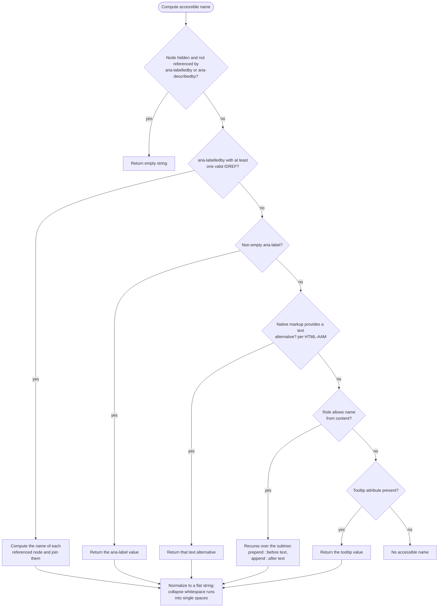

# [FEE-1011] Accessible Name 計算：AccName 演算法如何決定標籤

:::info
螢幕閱讀器遇到一顆按鈕或一個連結時，會唸出一段文字，讓使用者知道這是什麼控制項。這段文字叫 accessible name（無障礙名稱），計算方式由 W3C 的 Accessible Name and Description Computation 規範定義。演算法依固定順序檢查候選來源：先看 `aria-labelledby`，再看 `aria-label`，然後是 HTML 原生標記（`label` 元素、`alt` 屬性這類），接著收集元素內部的文字，最後看 `title` 屬性；第一個非空的結果就是名稱。Chrome DevTools 的 accessibility 面板直接呈現這個計算：它依優先順序列出所有候選來源，並標出勝出的那一個。誤解這個順序會寫出標籤 bug：在按鈕上加了 `aria-label`，螢幕閱讀器就只唸它的值，不再唸按鈕上的可見文字。
:::

## Context

Accessible Name and Description Computation 1.2 是 W3C Working Draft，走 Recommendation 進程，最近一次發布在 2026 年 8 月 5 日，內容更新自 AccName 1.1 Recommendation。演算法的核心結構歷經各版本沒有變：一串固定順序的步驟，第一個非空結果勝出。HTML 這邊的細節由另一份 W3C 規範補完，名叫 HTML Accessibility API Mappings（HTML-AAM）：它規定 `label`、`alt`、`placeholder`、`title` 這些 HTML 標記如何套進 AccName 演算法的「原生標記」那一步。W3C 的 ARIA Authoring Practices Guide（APG）與多家無障礙顧問公司的建議方向一致：優先用可見文字和原生 HTML 標記命名，少用 ARIA 命名屬性。ARIA、表單標籤、螢幕閱讀器這些主題都圍繞著「元素叫什麼名字」；這一篇說明當多個候選標籤同時存在時，瀏覽器怎麼算出螢幕閱讀器實際唸出的那一個。

## Visual

下方流程圖是單一元素的名稱計算流程。每一步有三種結果：回傳一個字串、遞迴往子樹計算，或落到下一個來源。



## Example

這顆儲存按鈕同時帶著三個名稱來源，還有一個 icon font 字元：

```html
<style>
  .icon-save::before {
    font-family: "IconFont";
    content: "\f0c7";
  }
</style>

<button class="icon-save" title="Save the current draft" aria-label="Save">
  Save document
</button>
```

按鈕上沒有 `aria-labelledby`，演算法走到 `aria-label` 那一步就回傳它的值，算出的名稱是 `Save`。在 Chrome DevTools 選取這顆按鈕並打開 accessibility 面板：面板依計算順序列出候選來源，標出 `aria-label` 勝出，落選的候選排在下面。button 屬於「以內容命名」（name from content）的角色：這類角色可以把元素子樹裡的文字收集起來當名稱，`<a>`、`<td>`、`<button>` 都在此列。但 `aria-label` 排在前面，它一勝出，螢幕閱讀器就只唸 `Save`；可見文字 `Save document` 和 icon 字元都不會唸出來。

刪掉 `aria-label` 之後，演算法落到以內容命名那一步。這一步遞迴走訪子樹收集文字，規範還要求瀏覽器把 CSS `::before` 的文字內容接在最前面、`::after` 的接在最後面。算出的名稱變成 private-use 字元 `\f0c7` 加上 `Save document`。按鈕原始碼裡的縮排和換行不會保留：規範把結果正規化成一條扁平字串，carriage return、換行、tab、form feed 都換成單一空格，連續空格再合併成一個。

再把 class 和可見文字也刪掉，只剩 `<button title="Save the current draft"></button>`。前面每個來源都是空的，`title` 那一步回傳它的值，名稱變成 `Save the current draft`。APG 把 `title` 歸類為瀏覽器備援：沒有更強的來源時它才生效，不要把它當成正式的命名手段。

`aria-labelledby` 的路徑對隱藏內容有一條例外規則：

```html
<span id="discard-hint" style="display: none">Discard unsaved changes</span>
<button aria-labelledby="discard-hint">X</button>
```

隱藏節點在名稱計算裡通常只回傳空字串。但這個 `span` 被按鈕的 `aria-labelledby` 指到，例外規則生效：它的內容照樣參與計算，螢幕閱讀器唸這顆按鈕時唸的是 `Discard unsaved changes`。按鈕裡可見的 `X` 落選，因為 `aria-labelledby` 在步驟順序裡排在以內容命名前面。

## Best Practices

- 禁止在「禁止命名」（name prohibited）的角色上用 `aria-label` 或 `aria-labelledby`。ARIA 規範為每種角色定義名稱可以從哪裡來，標成 prohibited 的角色沒有名稱，規範明文禁止作者為它命名。
- 在以內容命名的角色（button、連結這類）上用 `aria-label` 時，必須拿螢幕閱讀器實際聽一次結果：屬性值會取代整個子樹的文字，而且不會顯示在畫面上，光看畫面察覺不到唸出來的內容變了。
- 應該直接用控制項的可見文字當名稱；APG 指出這樣做簡化維護、減少 bug，也降低翻譯需求。
- 應該優先用 `label`、`alt` 這類原生 HTML 標記命名，少用 ARIA 屬性；ARIA 用錯會蓋掉正確的 HTML 語義，ARIA 屬性用得多的頁面錯誤率也偏高。
- 不應該把 `title` 屬性當成主要命名手段；只有前面所有來源都空了它才生效，APG 的基本原則也要求避免依賴這種瀏覽器備援。
- 應該在 Chrome DevTools 的 accessibility 面板驗證算出的名稱；面板依計算順序列出候選來源，並標出勝出者。
- 應該把名稱寫得簡短、有用；APG 把這列為基本原則。
- 可以用 `aria-labelledby` 指向隱藏元素；隱藏節點的排除規則，對被 `aria-labelledby` 或 `aria-describedby` 指到的節點不適用。

## Failure Modes

下面每個 bug 都對應演算法的特定步驟，也都能在 DevTools accessibility 面板看到是哪個來源勝出。

**aria-label 蓋掉可見文字。** `aria-label` 那一步排在以內容命名前面，所以在 button、連結這類角色上，`aria-label` 的值會取代元素內部的全部文字。畫面上寫 `Save document` 的按鈕，加上 `aria-label="Submit"` 之後，螢幕閱讀器唸的是 `Submit`。APG 特別提醒這種情況要用輔助技術實測，因為 `aria-label` 的值不會顯示在畫面上。

**螢幕閱讀器照樣唸出 display:none 的標籤。** 隱藏節點在一般走訪時回傳空字串，開發者於是以為把元素藏起來就等於移出名稱計算。但被 `aria-labelledby` 或 `aria-describedby` 指到的節點是例外：`display: none` 的目標照樣貢獻文字。重構後遺留的隱藏 `span`，會一直蓋掉按鈕的可見文字。

**icon font 字元污染名稱。** 演算法以內容命名收集文字時，瀏覽器會把 `::before` 的文字內容接在最前面、`::after` 的接在最後面。用 `content` 注入 private-use 字元的 icon font，會把那個字元加進它裝飾的每個元素的名稱，螢幕閱讀器唸出的名稱開頭因此多一個唸不出來的字元。

**放在禁止命名角色上的名稱不生效。** 標成 prohibited 的角色沒有名稱，規範也禁止作者在這些角色上用 `aria-label` 或 `aria-labelledby`。放上去的 `aria-label` 不會變成名稱，螢幕閱讀器也不會唸它。

## Related Topics

- [ARIA 與語義化 HTML](/zh-tw/Accessibility/1001) — 名稱計算讀取的語義基礎。
- [螢幕閱讀器與輔助技術](/zh-tw/Accessibility/1004) — 算出的名稱最終如何唸給使用者聽。
- [無障礙表單與輸入元素](/zh-tw/Accessibility/1005) — label 與控制項的關聯方式，關聯的結果由這套演算法解析。
- [無障礙測試：axe、Lighthouse 與螢幕閱讀器](/zh-tw/Accessibility/1006) — 這些工具能標出本文描述的標籤 bug。

## References

- W3C ARIA Working Group, "Accessible Name and Description Computation 1.2," W3C Working Draft (2026). https://www.w3.org/TR/accname-1.2/
- W3C, "HTML Accessibility API Mappings 1.0," W3C (2026). https://www.w3.org/TR/html-aam-1.0/
- W3C WAI, "Providing Accessible Names and Descriptions," ARIA Authoring Practices Guide (2026). https://www.w3.org/WAI/ARIA/apg/practices/names-and-descriptions/
- MDN Web Docs, "Accessible name," Glossary, Mozilla (2026). https://developer.mozilla.org/en-US/docs/Glossary/Accessible_name
- Stefan Judis, "The order of accessible name computation steps," stefanjudis.com (2024, updated 2025). https://www.stefanjudis.com/today-i-learned/the-order-of-accessible-name-computation-steps/
- Level Access, "ARIA Labels and Accessible Names: A Developer's Guide," Level Access Blog (2026). https://www.levelaccess.com/blog/aria-labels-and-accessible-names-a-developers-guide/
