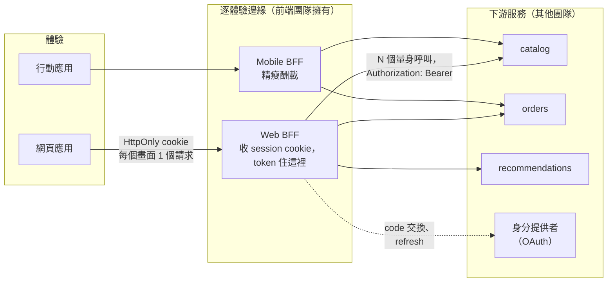

# [FEE-1905] Backend-for-Frontend（BFF）與 API 邊界

:::info
Backend-for-Frontend 是一個小型伺服器端元件，與恰好一種使用者體驗配對，由打造那個體驗的團隊擁有。它存在的理由是：通用 API 對每個用戶端都一樣糟：網頁應用需要把三個聚合呼叫收成一個、行動應用需要精瘦的酬載，而兩者都得排隊等後端團隊的路線圖。BFF 把那層翻譯搬進前端團隊的圍籬內，讓它能跟 UI 一樣快地變更。這個模式後來多了第二份工作，如今往往才是採用它的決定性理由：IETF 針對瀏覽器應用的 OAuth 指引把 BFF 列為最安全的架構，因為 token 只活在伺服器上，瀏覽器裡沒有任何指令碼注入偷得走的東西。一個模式、兩份回報：一個長得像你的畫面的 API，以及一條兼任 token 邊界的 API 邊界。
:::

## 背景

這個模式源自 SoundCloud 在 2015 年前後逃離單體公用 API 的過程：當打造新用戶端的團隊擁有自己的 API 層時，它「能移動得快很多，因為不需要各方協調」，Phil Calçado 與 Sam Newman 把結果寫成了 Backends For Frontends。組織層面的洞見是刻意運用的 Conway 定律：與其讓一個通用 API 團隊成為每個用戶端需求的瓶頸，不如給每種體驗一個單一用途的邊緣服務，聚合下游服務、為那一個 UI 塑形回應。十年後，多數前端團隊都在跑一個沒有掛名的 BFF，因為 meta-framework 的伺服器路由（API routes、server actions、loaders）就是 UI 團隊擁有的逐體驗伺服器程式碼，而這正是模式的完整定義。真正改變的是安全那一半：OAuth 2.0 for Browser-Based Apps 草案（IETF 進行中的 Best Current Practice）把 BFF、token-mediating backend、純瀏覽器 OAuth 明文列為「安全性遞減」的三種架構，讓「token 住哪裡」成為現代前端 API 設計最鋒利的岔路。本文涵蓋這兩半，以及讓 BFF 不變成第二個單體的邊界紀律。

## 視覺對比



## 範例

聚合的那一半：一個畫面、一個端點。BFF 對下游服務扇出，丟掉畫面不渲染的一切，回傳長得像 UI 的酬載。範例用 Hono，但任何有路由處理器的伺服器框架讀起來都一樣：

```ts
// bff/routes/home.ts —— 每個畫面一個端點，為那個畫面塑形
import { Hono } from "hono";

export const home = new Hono().get("/api/home", async (c) => {
  const user = c.get("session").userId;
  const [orders, recs] = await Promise.all([
    ordersService.recent(user, { limit: 3 }),
    recommendationService.forUser(user, { limit: 6 }),
  ]);
  return c.json({
    greetingName: orders.customer.firstName,
    openOrders: orders.items.map((o) => ({
      id: o.order_id,                 // 下游形狀止步於此
      status: STATUS_LABEL[o.state],
      eta: o.estimated_delivery,
    })),
    recommendations: recs.map((r) => ({ id: r.id, title: r.title, image: r.hero_url })),
  });
});
```

Token handler 的那一半：瀏覽器只拿到 `HttpOnly` session cookie，其他什麼都沒有；BFF 是機密（confidential）OAuth 用戶端，把 access 與 refresh token 留在伺服器端，並注入代理出去的呼叫。頁面上的惡意指令碼可以在執行期間*使用*這個工作階段，卻沒有 token 可以外洩：

```ts
// bff/routes/auth.ts —— BFF 是 OAuth 用戶端；瀏覽器永遠看不到 token
export const auth = new Hono()
  .get("/auth/callback", async (c) => {
    const tokens = await oauth.exchangeCode(c.req.query("code"), { pkce: true });
    const sid = await sessionStore.create(tokens);          // token 活在伺服器端
    setCookie(c, "sid", sid, {
      httpOnly: true, secure: true, sameSite: "Lax", path: "/",
    });
    return c.redirect("/");
  })
  .all("/api/proxy/*", async (c) => {
    const tokens = await sessionStore.get(getCookie(c, "sid"));
    return fetch(downstreamUrl(c.req), {
      method: c.req.method,
      headers: { Authorization: `Bearer ${await freshAccessToken(tokens)}` },
      body: c.req.raw.body,
    });
  });
```

用戶端的後果主要是刪程式碼。不用存 token、不用編排 refresh、不用鋪 `Authorization` header 的水管；請求是帶上憑證的普通同源 fetch，外加一個 CSRF token，因為 cookie 在跨站請求上也會被順路帶走：

```ts
// web/src/api/client.ts
export async function api<T>(path: string, init?: RequestInit): Promise<T> {
  const res = await fetch(`/api${path}`, {
    ...init,
    credentials: "same-origin",
    headers: { ...init?.headers, "X-CSRF-Token": readCsrfToken() },
  });
  if (res.status === 401) redirectToLogin();
  return res.json();
}
```

## 最佳實踐

- **必須（MUST）**一個 BFF 配一種體驗，抵抗把它通用化的誘惑；當兩個用戶端共用一個 BFF，每次變更都要跟兩個畫面談判，通用 API 的問題只是往上搬了一層重建。
- **必須（MUST）**把 BFF 放在前端團隊的所有權下：同一個 repo 或同一條 review 路徑。由平台團隊擁有的 BFF，是一個名字有誤導性的 API gateway。
- **必須（MUST）**對處理敏感或個人資料的應用，依 IETF 瀏覽器應用指引把 OAuth token 擋在瀏覽器之外：給用戶端 `HttpOnly` + `Secure` + `SameSite` 的 session cookie，token 關在 BFF 裡。
- **必須（MUST）**在 cookie 承載工作階段之後仍然防禦 CSRF（cross-site request forgery，跨站請求偽造）：`SameSite=Lax` 加上變更操作的明確 token 或 origin 檢查，因為 cookie 驗證的端點正是 CSRF 的攻擊對象。
- **必須（MUST）**把領域規則擋在 BFF 之外：它聚合、重塑、授權傳輸；定價/權限/流程邏輯屬於下游或用戶端的領域核心。會計算業務結果的 BFF，是一個名字比較好聽的第二單體。
- **應該（SHOULD）**把囉唆的呼叫序列收到伺服器端；BFF 坐在資料中心延遲上，瀏覽器坐在最後一哩延遲上，把三次呼叫的瀑布搬過這條線，往往是採用後單項最大的體感效能收益。
- **應該（SHOULD）**認出你已經擁有的那個 BFF：meta-framework 的路由處理器、server actions 與 loaders 就是 UI 團隊擁有的逐體驗伺服器程式碼，在那裡套用同樣的邊界紀律，而不是再加第二層邊緣。
- **應該（SHOULD）**在存在防腐映射時讓 BFF 承載它（見[前端 DDD](/zh-tw/Application Architecture and Scaling Patterns/frontend-ddd)）：在伺服器端翻譯上游 DTO，讓線路格式與瀏覽器 bundle 互不相干。
- **可以（MAY）**在各畫面資料形狀差異劇烈時，用 GraphQL 作為 BFF 的查詢表面；模式與協定是正交的。
- **可以（MAY）**在純網頁應用、API 已經是 UI 形狀、驗證已走 cookie 時完全跳過這個模式，這是 Newman 自己劃的界線：沒有聚合與 token 職責時，BFF 是一跳額外延遲加一輪 on-call。

## 設計思維

**BFF 對 API gateway 的差別在所有權，不在拓撲。**兩者都站在用戶端與服務之間；差別是誰為了什麼改它。Gateway 是共享基礎設施，長出通用功能（限流、路由）、抗拒逐畫面的頻繁變更；BFF 是應用程式碼，存在的目的就是跟著畫面一起變。Newman 的框架能存活，是因為它點名了中間路線的失敗方式：「共用 BFF」會累積每個用戶端的需求與協調成本，直到它又變回一個通用 API。

**跨 BFF 的重複是代價，自主性才是產品。**兩個 BFF 都會寫分頁膠水、都會呼叫 orders 服務。模式的賭注是：這種重複比它取代的協調便宜，而賭注成立的前提是重複的東西是翻譯。當同一條*業務規則*出現在兩個 BFF 裡，那不是可接受的重複，而是規則屬於下游的訊號。

**安全的重新定框改變了採用的算術。**多年來 BFF 是開發者體驗模式，聚合之痛夠大才值得多養一個部署單位。OAuth 瀏覽器應用的工作把敏感應用的預設反轉了：瀏覽器持有 token 如今是需要你*主動辯護*的架構，XSS 爆炸半徑是你必須回答的問題，而 BFF 是參考答案。連聚合與塑形都不需要的團隊，也開始純粹為了 token 邊界而採用它。

**成本是一個服務，前端團隊應該誠實計價。**BFF 是有正常運行時間、祕密、擴縮與 on-call 故事的部署單位，擁有者卻是專長在 UI 的團隊。Meta-framework 代管吸收了一部分營運重量，這是模式隨那些框架而非在它們之前普及的實際原因。

## 深入探討

**IETF 的架構階梯。**瀏覽器應用草案把三種架構按安全性遞減排序。*BFF*：後端是機密 OAuth 用戶端，所有資源請求經它代理，token 永不抵達瀏覽器；指令碼注入可以搭工作階段的便車，卻偷不走憑證。*Token-mediating backend*：後端取得 token，但把 access token 交給瀏覽器直接呼叫資源，以可被竊（雖短命）的 token 換掉代理跳數。*純瀏覽器公開用戶端*：SPA 自己跳完整支舞，每個 token 都離外洩只差一次 XSS。草案對商務與個人資料應用強烈建議第一種，並與 RFC 9700（OAuth 安全 BCP）搭配完成周邊加固。

**邊界上的 cookie 機制。**Session cookie 帶 `HttpOnly`（指令碼讀不到）、`Secure`（僅限 TLS）、`SameSite=Lax` 或 `Strict`（限制跨站傳送）。`Lax` 仍放行頂層導覽的 GET，所以會改狀態的路由需要 CSRF token、`Origin`/`Sec-Fetch-Site` 檢查、或兩者兼備。BFF 與應用同源部署（同網域、按路徑路由）完全繞開 CORS，是最不易出錯的形狀；跨子網域的 BFF 會重新引入帶憑證的 CORS 與 cookie 作用域決策，屆時每一項都得刻意決定。

**串流與長連線。**讓 SSE 或 WebSocket 升級經 BFF 代理能保住 token 邊界，但會把 BFF 變成持有連線的層，擴縮輪廓從無狀態請求處理器變成帶逐使用者記憶的東西。常見的折衷：在 BFF 終結串流、以同源 SSE 重新暴露；或為那一條通道鑄造短命、窄範圍的 token 讓它直連，有意識地接受在安全階梯上下一格。

**失敗塑形是契約的一部分。**下游的局部失敗浮現在 BFF，它必須逐畫面決定降級的意義：略去推薦區塊、代之以快取的訂單、或讓整個畫面失敗。把這些選擇編碼在伺服器端，能讓同一體驗的各用戶端行為一致、也讓它們遠離元件樹，而這正是「長得像 UI」在實務上很大的一部分。

## 架構選型階梯

API 邊界與 token 該住哪裡？按安全性遞減排列，附上每一階換到的東西：

| 架構 | Token 住哪 | 瀏覽器持有 | 選它的時機 |
|---|---|---|---|
| BFF（全代理） | 只在伺服器 | `HttpOnly` session cookie | 敏感/商務應用；同時想要聚合；IETF 的強烈建議 |
| Token-mediating backend | 伺服器取得，access token 交給瀏覽器 | 短命 access token | 必須直連資源（媒體 CDN、第三方 API）但存在後端 |
| 純瀏覽器 OAuth 用戶端 | 瀏覽器 | Access + refresh token | 完全沒有後端可用；有意識地接受 XSS 暴露 |
| 無 BFF、cookie API | 伺服器 session，瀏覽器無 OAuth | Session cookie | 純網頁應用、第一方 UI 形狀 API：模式自己的「不必費事」案例 |

兩個逼問能收斂多數爭論：「如果攻擊者在我們頁面上跑指令碼，他帶得走什麼？」與「這個畫面的酬載變更需要誰批准？」第一題決定行的排序；第二題決定這條邊緣到底屬不屬於前端團隊。

## 延伸閱讀

- [前端的 Domain-Driven Design](/zh-tw/Application Architecture and Scaling Patterns/frontend-ddd)
- [Server-Driven UI](/zh-tw/Application Architecture and Scaling Patterns/server-driven-ui)
- [Authentication & Token Storage](/zh-tw/Security/1202)
- [CORS & CSRF](/zh-tw/Security/1204)
- [SSR & Server Component Security](/zh-tw/Security/1207)

## 參考資料

- Sam Newman, "Pattern: Backends For Frontends," samnewman.io (2015). https://samnewman.io/patterns/architectural/bff/
- Phil Calçado, "The Back-end for Front-end Pattern (BFF)," philcalcado.com (2015). https://philcalcado.com/2015/09/18/the_back_end_for_front_end_pattern_bff.html
- IETF OAuth Working Group, "OAuth 2.0 for Browser-Based Applications," Internet-Draft draft-ietf-oauth-browser-based-apps-26 (2025). https://www.ietf.org/archive/id/draft-ietf-oauth-browser-based-apps-26.html
