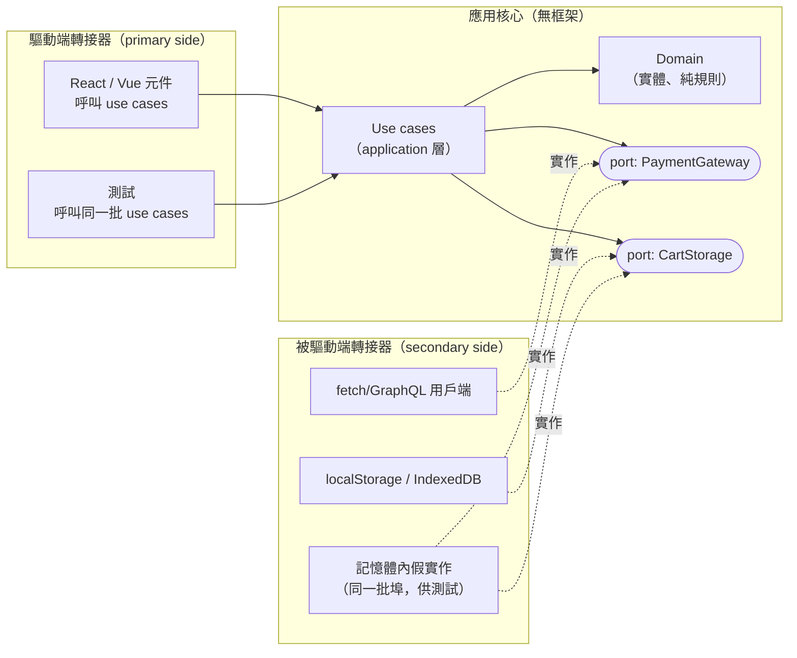

# [FEE-1903] 前端的 Clean 與六角架構

:::info
Clean Architecture 與六角架構（Hexagonal Architecture，又稱 Ports & Adapters）是同一條規則的兩種表述：原始碼依賴一律指向內側的業務邏輯，永不指向外側的框架、網路用戶端或儲存。領域核心對 React、fetch、localStorage 一無所知；它透過*埠（port，自己擁有的介面）*與外界對話，外界則經由實作這些埠的*轉接器（adapter）*接上來。在前端，這買到三件事：撐得過框架更迭的業務邏輯、不需要 DOM 或網路就能跑的測試，以及一個「這條規則住哪裡？」永遠只有一個答案的 codebase。代價是間接性，而且這個模式只在真正存在領域邏輯的地方划算；把一個薄薄的 CRUD 畫面包進四層，是儀式，不是架構。
:::

## 背景

六角架構由 Alistair Cockburn 於 2005 年命名，解決的是應用程式設計的問題：業務邏輯滲進 UI 與資料庫程式碼，直到兩者都無法獨立變更、什麼都無法隔離測試。Robert C. Martin 的 Clean Architecture（2012）把它與幾個兄弟模式（Onion Architecture 等）統一成受單一「依賴規則（Dependency Rule）」支配的同心圓。前端繼承了同一種病，只是症狀不同。元件累積定價規則、驗證與流程邏輯；等到框架變了樣（class 元件到 hooks、hooks 到 server components）或 API 層遷移（REST 到 GraphQL）那天，業務邏輯得跟著手動搬家，因為它從未被分離。這個模式遲遲才來到前端，因為早期前端沒什麼值得保護的領域邏輯。離線應用、編輯器、購物車與儀表板改變了這件事。本文展示前端的翻譯版：核心裡放什麼、TypeScript 的埠長什麼樣、以及這個模式從哪裡開始不再划算。它的兄弟篇是組織領域切片的 [Feature-Sliced Design](/zh-tw/feature-sliced-design)，以及決定「領域到底是什麼」的 [Domain-Driven Design](/zh-tw/frontend-ddd)。

## 視覺對比



## 範例

核心是純 TypeScript。domain 層放實體與純規則；application 層放 use case 並*宣告它需要的埠*。注意方向：介面跟著消費者住，不跟著實作者住。這個所有權的選擇，正是讓依賴箭頭指向內側的機關。

```ts
// core/domain/cart.ts —— 核心內部的 import 沒問題；規則擋的是外部
import { add, ZERO, type Money } from "./money";

export interface Cart { items: CartItem[]; coupon?: Coupon; }

export function cartTotal(cart: Cart): Money {
  const subtotal = cart.items.reduce((sum, i) => add(sum, price(i)), ZERO);
  return cart.coupon ? applyCoupon(subtotal, cart.coupon) : subtotal;
}

// core/application/ports.ts —— 核心宣告它對世界的需求
export interface PaymentGateway {
  pay(amount: Money): Promise<PaymentResult>;
}
export interface CartStorage {
  load(): Promise<Cart>;
  save(cart: Cart): Promise<void>;
}

// core/application/checkout.ts —— use case 編排 domain 與埠
export function makeCheckout(deps: { payment: PaymentGateway; storage: CartStorage }) {
  return async function checkout(): Promise<PaymentResult> {
    const cart = await deps.storage.load();
    const result = await deps.payment.pay(cartTotal(cart));
    if (result.ok) await deps.storage.save({ items: [] });
    return result;
  };
}
```

轉接器住在外側並實作埠。API 用戶端在邊界上把傳輸形狀的資料映射成領域形狀，線路格式的變更就停在這裡：

```ts
// adapters/paymentApi.ts —— 被驅動端轉接器：實作核心的埠
import type { PaymentGateway } from "../core/application/ports";

export const httpPayment: PaymentGateway = {
  async pay(amount) {
    const res = await fetch("/api/pay", {
      method: "POST",
      headers: { "Content-Type": "application/json" },
      body: JSON.stringify({ cents: amount.cents, currency: amount.currency }),
    });
    // 失敗也在這裡翻譯，絕不以傳輸例外的形式往內拋
    if (res.status === 402) return { ok: false, reason: "insufficient-funds" };
    if (!res.ok) return { ok: false, reason: "gateway-error" };
    const dto = await res.json();          // 傳輸形狀
    return { ok: dto.status === "OK", transactionId: dto.tx_id }; // 領域形狀
  },
};
```

UI 是*驅動端*轉接器：它呼叫 use case 並渲染結果，而接線只在組合根（composition root，唯一被允許認識所有具體轉接器的地方）發生一次：

```tsx
// app/compositionRoot.ts
export const checkout = makeCheckout({ payment: httpPayment, storage: localCartStorage });

// ui/CheckoutButton.tsx —— 框架程式碼保持薄
function CheckoutButton() {
  const [state, setState] = useState<"idle" | "paying" | "done" | "failed">("idle");
  return (
    <button onClick={async () => {
      setState("paying");
      const result = await checkout();
      setState(result.ok ? "done" : "failed");
    }}>
      {state === "paying" ? "Processing..." : "Pay"}
    </button>
  );
}
```

回報體現在測試：同一個 use case 對著記憶體內的假實作跑，過程中不需要 DOM，也不需要網路：

```ts
test("checkout empties the cart on success", async () => {
  const storage = inMemoryStorage(cartWith(twoItems));
  const checkout = makeCheckout({ payment: alwaysApproves, storage });
  await checkout();
  expect((await storage.load()).items).toHaveLength(0);
});
```

## 最佳實踐

- **必須（MUST）**讓核心不含框架與平台 import：沒有 React、沒有 `fetch`、沒有 `window`、沒有 router。如果 `core/` 裡的檔案 import 了語言層級以外的 `node_modules`，邊界已經不存在了。
- **必須（MUST）**讓內層擁有自己的埠介面（把 `PaymentGateway` 定義在需要它的 use case 旁邊，而不是實作它的 HTTP 用戶端旁邊）。由轉接器擁有的介面什麼都沒有反轉。
- **必須（MUST）**讓跨邊界的資料是純資料：進出都是領域型別。傳輸用的 DTO（data transfer object，線路格式的形狀）止步於轉接器，框架物件（事件、ref、request 物件）永不進入核心。
- **必須（MUST）**用工具強制依賴方向（`eslint-plugin-boundaries`、`dependency-cruiser`，layer 對齊時也可用 FSD 的 Steiger）；沒有強制的架構會隨著每個 sprint 風化。
- **應該（SHOULD）**從「只抽領域」開始：先把純規則從元件裡抽出來，等第二個消費者或第一個認真的測試出現時再加埠與 use case。這正是這個模式自己的文獻建議的漸進路徑。
- **應該（SHOULD）**把狀態管理器當轉接器，不是核心：store 負責持有與分發狀態；計算狀態轉移的規則屬於 domain，由 store 引入。
- **應該（SHOULD）**每個應用（或每個微前端）只保留一個組合根來挑選具體轉接器；散落在元件樹各處的 `new`/轉接器 import 會重建埠才剛移除的耦合。
- **可以（MAY）**在「領域」只是一張表單加一個 POST 的薄 CRUD 表面跳過完整分層；核心會是空的模式，依定義就是額外負擔。
- **可以（MAY）**依環境更換轉接器：測試用記憶體內的 `CartStorage`、離線用 IndexedDB、連線用 HTTP，全部藏在同一個埠後面。可互換性正是這個模式當初宣告的意圖。

## 設計思維

**規則只有一句話；難的是紀律。**「依賴指向內側」說出口毫無成本，維持住卻需要整個 code review 文化。每次抄捷徑都有一個聽起來合理的藉口：把 API 用戶端「只 import 這一次」進 use case、讓元件「反正只有這裡用」自己算價格。之所以要用機器強制，是因為每一次個別的違規都辯護得了，而總和就是這個模式本來要防止的那團大泥球。

**前端天生轉接器占比高，這改變了經濟學。**後端服務往往是大塊領域裹著薄薄一層串接雜務；典型前端把比例倒過來，因為渲染、路由、資料抓取本來就是工作內容。因此這個模式的價值集中在真正屬於領域的少數程式碼上：定價、權限、文件模型、離線合併規則。把這一小塊抽成純核心很便宜、在測試上立刻回本；把多數的「抓了就渲染」畫面包進四層，正是團隊開始對這個模式反感的地方。架構的尺寸要對齊領域，不是對齊應用。

**框架更迭是前端版的「資料庫只是細節」。**後端 clean architecture 把資料庫當可替換品；實際上很少有團隊真的換。前端框架卻真的會換，甚至同一框架內的慣用法也會換（class 元件、hooks、server components）。不含框架 import 的核心，是唯一能毫髮無傷跨過那些遷移的程式碼。

**對上 FSD，兩個模式是互補而非競爭。**FSD 沿領域垂直切片（entities、features、widgets）；Clean/六角沿技術角色水平分層（domain、application、adapters）。FSD 切片內的 `api` 與 `ui` segment 是轉接器的位置；`model` segment 是核心的位置。已採用 FSD 的團隊從 layer 階層已拿到大部分的依賴規則，可以只在承載真實邏輯的切片內選擇性地套用埠。

## 深入探討

**TypeScript 裡的依賴反轉。**這門語言讓模式變便宜：`interface` 加結構型別（型別以形狀而非宣告的名字來匹配）意味著轉接器不必 import 基底類別就能實作埠，`import type` 保證型別依賴在執行期消失。工廠函式風格（`makeCheckout(deps)`）是前端慣用的組合機制；在沒有裝飾器與執行期反射的 codebase 裡，class 式依賴注入（DI）容器增益有限，手工接線的組合根反而讓物件圖保持可見、可 tree-shake。

**元件怎麼拿到 use case。**範例採用「從組合根做模組層級 import」，這是最簡單的交付方式，對應用程式碼來說也夠用；代價是元件測試必須 mock 模組。替代方案是把接好線的 use case 經由 props 或 context provider 往下傳，讓元件測試回到單純的依賴注入；本文引用的前端文獻蓋的正是這種以 hook 交付的版本。按元件選擇：只渲染結果的葉節點兩者都不需要，會觸發 use case 的容器元件則受益於注入。

**主埠與副埠並不對稱。**Cockburn 的區分：primary（驅動端）行動者呼叫應用（UI、測試、CLI）；secondary（被驅動端）行動者被應用呼叫（儲存、支付、通知）。前端的不對稱比後端更尖銳，因為最大的驅動端轉接器（元件樹）同時也是最大的一塊程式碼。實務結論：驅動端的「埠」通常就是 use case 函式簽名本身，被驅動端的埠才是明確的介面。只把介面儀式花在被驅動端，是正確的預設。

**邊界相對於伺服器狀態的位置。**查詢快取（TanStack Query 及其同類）模糊了界線：它們是基礎設施，但它們的快取鍵與失效規則承載著應用邏輯。乾淨的答案是讓查詢層留在轉接器環，凡是規則（結帳後該重抓什麼、樂觀更新怎麼合併）委派給核心函式，凡是機制（重試、去重、過期）自己擁有。同樣的安置邏輯適用於 router 與表單函式庫。

**帶著錯誤跨邊界。**轉接器翻譯失敗的方式與翻譯資料相同：`fetch` 的 rejection 或 402 狀態碼變成有領域意義的結果（`{ ok: false, reason: "insufficient-funds" }`），而不是 HTTP 函式庫的例外型別。讓傳輸例外穿進 use case，等於悄悄把核心重新耦合到線路格式，這是原本乾淨的前端最常見的滲漏。

## 分層對照表

三套詞彙描述重疊的疆域；這是前端 codebase 的一種可行對照（FSD 文件對 segment 的描述比這更窄，中間那欄請當社群實務、不是規格）。

| Clean Architecture | 六角架構 | FSD 位置 | 典型前端產物 |
|---|---|---|---|
| Entities | 六角形內部 | `entities/*/model` | 領域型別、純計算/驗證函式 |
| Use cases | 六角形內部 | `features/*/model` | `makeCheckout`、流程編排、埠宣告 |
| Interface adapters | Adapters | `*/api`、stores | API 用戶端、DTO 映射、狀態管理繫結 |
| Frameworks & drivers | 外部行動者 | `app/`、`*/ui` | 元件樹、router、建置工具、瀏覽器 API |
| （組合） | （接線，六角形之外） | `app/providers` | 把埠接上轉接器的組合根 |

如果其他都不採用，有兩條邊界規則承載了大部分價值：核心檔案不 import 框架，以及 DTO 止步於轉接器。

## 延伸閱讀

- [Feature-Sliced Design 與資料夾架構](/zh-tw/feature-sliced-design)
- [前端的 Domain-Driven Design](/zh-tw/frontend-ddd)
- [測試元件契約](/zh-tw/513)
- [狀態管理總覽](/zh-tw/600)

## 參考資料

- Alistair Cockburn, "Hexagonal architecture (Ports & Adapters)," alistair.cockburn.us (2005, maintained). https://alistair.cockburn.us/hexagonal-architecture/
- Robert C. Martin, "The Clean Architecture," The Clean Code Blog (2012). https://blog.cleancoder.com/uncle-bob/2012/08/13/the-clean-architecture.html
- Alex Bespoyasov, "Clean Architecture on Frontend," bespoyasov.me (2021). https://bespoyasov.me/blog/clean-architecture-on-frontend/
- Feature-Sliced Design team, "Layers," feature-sliced.design (maintained). https://feature-sliced.design/docs/reference/layers
