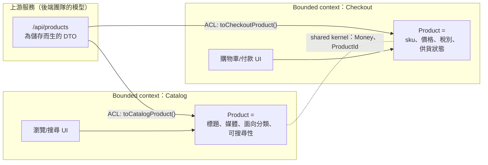

# [FEE-1904] 前端的 Domain-Driven Design

:::info
Domain-Driven Design（DDD）分成兩半，前端主要繼承其中一半。*戰術*模式（aggregate、repository、domain event）是為伺服器端持久化設計的，在瀏覽器裡很少值回票價。*戰略*模式則幾乎原封不動地遷移過來：**ubiquitous language**（通用語言：業務詞彙，由領域專家說出口、編碼進型別名稱）、**bounded context**（限界上下文：明確的邊界，界內只有一種「Product」或「Customer」的模型成立，界外合法地存在另一種），以及 **anti-corruption layer**（ACL，防腐層：一層翻譯，讓別人的模型滲不進你的模型）。在前端，這些模式決定切片、workspace 套件與微前端怎麼切，也點名了每個共用 `types/` 資料夾的失敗模式：一個全域模型被拉扯著橫跨幾個從未對「這些詞是什麼意思」達成共識的上下文。
:::

## 背景

DDD 出自 Eric Evans 2003 年的書，在後端長大，範例與工具至今多半住在那裡。前端很晚才遇到它，而且來自兩個方向。其一，應用變得領域繁重：帶定價規則的購物車、帶文件模型的編輯器、帶權限邏輯的儀表板，這些都在用戶端活得夠久、久到需要一個真正的模型。其二，組織用擴展服務的方式擴展前端，撞上了 Fowler 描述的同一面牆：對大型系統做領域模型的完全統一，既不可行也不划算。「meter」一個詞在某電力公司的不同部門裡有三種意思；「Customer」對結帳與客服也是兩回事，而假裝不是這樣的前端型別系統，會把每個 sprint 都變成一場談判。多數 DDD 文獻止步於 API 邊界。本文把戰略模式帶過這條邊界：bounded context 在前端 codebase 裡長什麼樣、ubiquitous language 怎麼出現在 TypeScript 裡、以及當上游模型屬於一個你管不到的後端團隊時，防腐層該放在哪。兄弟篇：[Feature-Sliced Design](/zh-tw/feature-sliced-design) 給上下文一個資料夾形狀，[Clean 與六角架構](/zh-tw/clean-hexagonal-frontend)保持它們的核心純淨，[微前端](/zh-tw/micro-frontend-architecture)則是上下文同時想要獨立部署時的樣子。

## 視覺對比



一個上游端點、兩個上下文各自的模型、一個刻意迷你的 shared kernel（兩個上下文共同擁有、必須一起變更的一小塊模型）。兩個「Product」型別只在身分與金額上達成一致，其餘刻意不一致，而這個不一致就是設計本身。

## 範例

Ubiquitous language 以「從業務實際說話方式提取的型別名稱」現身。結帳的人說「line item」、「稅別」、「缺貨候補」；型別就說一樣的話，領域專家認不得的詞不屬於這個模型：

```ts
// checkout/model/product.ts —— Checkout 上下文自己的模型
export interface CheckoutProduct {
  sku: Sku;
  unitPrice: Money;
  taxClass: "standard" | "reduced" | "exempt";
  availability: "in-stock" | "backorder" | "discontinued";
}

// catalog/model/product.ts —— 同一個詞、不同上下文、不同模型
export interface CatalogProduct {
  id: ProductId;
  title: string;
  media: MediaAsset[];
  facets: Record<FacetName, FacetValue[]>;
}
```

防腐層是上下文邊緣的一個映射函式。上游 DTO（data transfer object，線路格式的形狀）由後端的儲存與它自己的歷史決定；ACL 把它翻譯成這個上下文的語言，並把上游變更吸收在一個點上：

```ts
// checkout/api/acl.ts —— 上游形狀進來，上下文形狀出去
import type { CheckoutProduct } from "../model/product";

interface ProductDto {              // 後端團隊的模型，不是我們的
  product_id: string;
  price_cents: number;
  currency: string;
  tax_category_code: number;
  stock_state: number;
}

export function toCheckoutProduct(dto: ProductDto): CheckoutProduct {
  return {
    sku: asSku(dto.product_id),
    unitPrice: money(dto.price_cents, asCurrency(dto.currency)),
    taxClass: TAX_BY_CODE[dto.tax_category_code] ?? "standard",
    // ACL 是上游宣稱獲得執行期防護的地方，不只是型別
    availability: (["in-stock", "backorder", "discontinued"] as const)[dto.stock_state] ?? "discontinued",
  };
}
```

上下文邊界成為檔案系統邊界。在 monorepo 裡，每個上下文是一個有強制公開 API 的 workspace 套件；在 FSD codebase 裡，每個上下文是一族切片。無論哪種，linter 能檢查的規則是同一條：一個上下文永不 import 另一個上下文的內部，只碰它發布的表面（DDD 稱之為 *published language*：上下文刻意向他人暴露的表述）：

```
packages/
  checkout/        # bounded context
    src/model/     # CheckoutProduct、定價規則
    src/api/       # 對 products 服務的 ACL
    src/ui/
    index.ts       # published language：其他上下文可見的部分
  catalog/         # bounded context，自己的 Product
  shared-kernel/   # Money、ProductId、Sku —— 刻意保持小
```

戰術 DDD 裡的 value object 這一端確實跨得過來。像 `Money` 這樣的型別，擋掉的是「數字就只是數字」這一整族經典 bug：

```ts
// shared-kernel/money.ts —— value object：以值判等、沒有身分
export interface Money { readonly cents: number; readonly currency: Currency; }
export function add(a: Money, b: Money): Money {
  if (a.currency !== b.currency) throw new CurrencyMismatch(a.currency, b.currency); // 領域錯誤，定義在 Money 旁邊
  return { cents: a.cents + b.cents, currency: a.currency };
}
```

## 最佳實踐

- **必須（MUST）**用業務自己的詞彙為模型型別與函式命名，每個上下文維護一份詞彙表。當領域專家說「缺貨候補」而型別叫 `stockState2`，模型已經漂移了。
- **必須（MUST）**讓每個 bounded context 擁有自己的模型。兩個上下文都可以有 `Product`；把它們統一成一個共用型別，等於把每個消費者耦合到每個欄位，重建 bounded context 本來要避免的 canonical model 陷阱。
- **必須（MUST）**在上游模型不屬於你時，用 ACL 在邊界翻譯：API DTO 止步於映射函式，上游改名從全 codebase 的變更縮成一個檔案的變更。
- **必須（MUST）**用機器強制上下文邊界（workspace 套件可見性、`eslint-plugin-boundaries`、dependency-cruiser 規則）；內部可以被任意 import 的上下文只是一個資料夾，不是邊界。
- **應該（SHOULD）**讓 shared kernel 刻意保持小而穩定：識別碼、`Money`、日期。每往裡面加一個型別，就多一個兩個團隊從此必須一起改的型別。
- **應該（SHOULD）**讓上下文邊界對齊團隊與語言邊界，而不是技術分層；上下文跟著詞彙變化的地方走，而詞彙變化的地方通常就是團隊分界的地方。多義詞測試能找出接縫：同一個詞在兩場會議裡意思不同，邊界就在它們中間。
- **應該（SHOULD）**對帶著規則的量使用 value object（金額、時長、百分比）；這是戰術模式裡前端回報最高的一個。
- **可以（MAY）**在瀏覽器裡跳過 aggregate、repository 與 domain event；伺服器狀態函式庫與 store 已經扮演那些角色，引進完整的戰術詞彙只添儀式、不添新的保證。
- **可以（MAY）**在一個 bounded context 同時需要獨立部署時，把它升級成微前端；context map 正是那個切分決策的天然輸入。

## 設計思維

**敵人是那個無辜的共用 types 資料夾。**一個共用的 `types/` 或 `models/` 套件、裡面一個累積了數十個 optional 欄位的 `Product` interface，是規模化前端 monorepo 的標準失敗形狀：結帳、目錄、搜尋、後台各自把需求塞進了那個唯一的共用形狀。每個欄位最終都在某處可為 null、誰都不敢刪任何東西，於是一個團隊的變更弄壞另一個團隊。Bounded context 是這件事的具名替代方案：幾個各自內部一致的小模型，加上相遇處的明確翻譯。反直覺的一步在於：接受*詞*的重複，來避免*模型*的耦合。

**戰略遷移得過來，戰術多半不行。**Aggregate 與 repository 回答的是持久化問題（交易一致性、跨資料庫往返的身分），而瀏覽器已把這些外包給伺服器與查詢快取。前端的難題是戰略性的：誰的詞算數、模型在哪裡可以不同、誰來翻譯。用「在 React 裡蓋 aggregate」來評價，前端 DDD 看起來是儀式；從 context mapping 入手評價，它回答的正是前端真實面對的問題。

**Conway 定律從這裡的正中央穿過。**Conway 定律說，系統會鏡射打造它的組織的溝通結構；Fowler 則指出，實務上的上下文邊界跟著人的文化走：語言變化之處模型變化，團隊變化之處語言變化。讓不共享詞彙的團隊共享一個模型，等於每次欄位變更都要跨團隊會簽；一隊一上下文、之間隔著 ACL 的切法讓變更保持局部，而邊界 linter 負責讓它一直保持局部。

## 深入探討

**上下文關係模式，翻譯成前端現實。**DDD 為兩個上下文的相處方式命名，而消費著一個自己不擁有的 API 的前端，用 DDD 的話說就是*下游*。當 API 穩定、形狀本來就順著你的需求時，做 **conformist**（直接採用上游模型）很便宜；一旦上游模型對 UI 變得彆扭（儲存形狀的巢狀、enum 代碼、null 蔓延），**anti-corruption layer** 用一個映射檔案的成本買回上下文自己的模型。**Customer/supplier** 描述比較健康的組織：前端的需求能進入 API 的路線圖。**Published language** 則是有版本、有文件的 API schema（OpenAPI、GraphQL SDL）提供的東西：一份任何一方都無法單方面擁有的穩定共用表述。

**TypeScript 作為語言的強制媒介。**結構型別預設會破壞上下文分離：任何欄位對的物件*就是*一個 `Sku`。Branded type 恢復名義式邊界（`type Sku = string & { readonly __brand: "Sku" }`），讓 ACL 不只是慣例而是型別檢查的一部分；原始的 `product_id` 字串在要求 `Sku` 的地方無法編譯。再配上隱藏內部的套件層級 `exports` 對照表，編譯器與模組解析器聯手守住 DDD 所稱的上下文邊界。

**前端的上下文實際浮現在哪。**三個常見的家：FSD 切片（一個上下文橫跨一個 `entities` 切片與它的 `features`）、monorepo workspace 套件（一個上下文一個套件，`index.ts` 是發布表面）、微前端（一個上下文一個部署單位，此時 ACL 同時也是 remote 之間的執行期契約）。模式在每個尺度都一樣；只有強制機制逐步變硬：從 lint 規則、到套件可見性、到部署邊界。

## 前端的 Context Mapping

把 DDD 的關係模式讀成一張決策表，給遇上上游模型的前端團隊：

| 情境 | DDD 名稱 | 前端動作 |
|---|---|---|
| API 穩定、形狀貼合 UI、詞彙與你一致 | Conformist | 直接使用 DTO；此時 ACL 沒有東西可翻譯 |
| API 是儲存形狀、老舊、或持續變動 | Anti-corruption layer | 在邊界把 DTO 映射成上下文模型；DTO 型別留在 ACL 檔案內部 |
| 後端團隊照你的需求交付 | Customer/supplier | 協商 schema；仍在邊緣映射以保隔離 |
| 兩個前端上下文必須共享身分/數量型別 | Shared kernel | 迷你的共有套件（`Money`、id）；抵抗它長大 |
| 兩個上下文在執行期需要彼此的資料 | Published language | 每個上下文一份有型別的公開 API（套件 `index.ts` 或 MFE 契約） |
| 某上下文需要獨立部署與所有權 | Context per micro-frontend | 把邊界升級成建置/部署邊界（見 [FEE-1901](/zh-tw/micro-frontend-architecture)） |

這張表的對角線讀法：上游模型偏離你的上下文語言越遠、你對它的控制越少，邊界就值得越多翻譯機械。

## 延伸閱讀

- [Feature-Sliced Design 與資料夾架構](/zh-tw/feature-sliced-design)
- [前端的 Clean 與六角架構](/zh-tw/clean-hexagonal-frontend)
- [微前端架構](/zh-tw/micro-frontend-architecture)
- [Monorepos & Workspaces](/zh-tw/805)
- [Conditional Types and infer](/zh-tw/conditional-types-and-infer)

## 參考資料

- Martin Fowler, "BoundedContext," martinfowler.com bliki (2014). https://martinfowler.com/bliki/BoundedContext.html
- Martin Fowler, "UbiquitousLanguage," martinfowler.com bliki (2006). https://martinfowler.com/bliki/UbiquitousLanguage.html
- AWS, "Anti-corruption layer pattern," AWS Prescriptive Guidance: Cloud Design Patterns (maintained). https://docs.aws.amazon.com/prescriptive-guidance/latest/cloud-design-patterns/acl.html
- Eric Evans, "Domain-Driven Design Reference: Definitions and Pattern Summaries," domainlanguage.com (2015, CC-BY). https://www.domainlanguage.com/ddd/reference/
- Khalil Stemmler, "An Introduction to Domain-Driven Design (DDD)," khalilstemmler.com (2019, updated). https://khalilstemmler.com/articles/domain-driven-design-intro/
