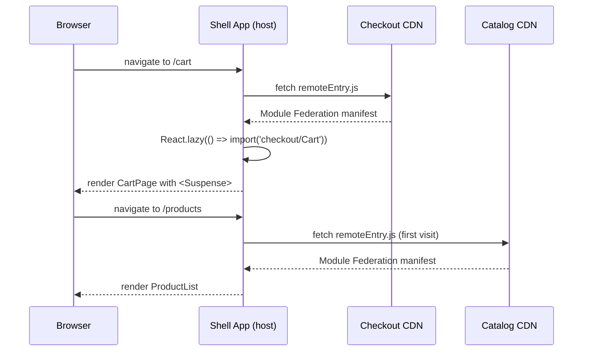

# [FEE-1901] 微前端架構

:::info
微前端將 Web 應用程式分解為可獨立部署的 UI 單元，與團隊或領域邊界對齊。團隊 MUST 在 Module Federation 設定中宣告共享函式庫的 singleton（`react`、`react-dom`、router）。重複的實例會導致 React context 失效與「invalid hook call」錯誤。團隊 MUST NOT 透過共享全域狀態來耦合微前端；跨 MFE 通訊 SHOULD 使用自訂 event bus 或最小化、版本化的共享契約。除非跨多個團隊的獨立部署節奏是實際且已量測的瓶頸，否則團隊 SHOULD NOT 採用微前端；單一團隊，或是能靠 monorepo 搭配套件邊界組織好的程式碼庫，很少值得付出這樣的操作開銷。
:::

## 背景

單體前端長期以來很好地服務了 Web 開發。整個應用程式從單一儲存庫出發，經過單一建置流水線，以單一可部署產物的形式交付。對於在可管理範圍內工作的小型團隊而言，這個模型仍然是正確答案。但隨著組織規模擴大，單體架構積累的成本在五人團隊中是無形的，在五十人團隊中卻是令人窒息的：一個團隊功能中的改動會觸發整個應用程式的完整重建和重測；隨著數十位工程師競相合併，共享主分支成為協調瓶頸；2019 年做出的框架決策在 2026 年仍約束著每個團隊，無論它是否還代表其特定領域的最佳工具。

微前端是這個組織擴展問題的架構回應。這個術語出現於 2016 年的 ThoughtWorks Technology Radar，並在 2019 年由 Cam Jackson 在 martinfowler.com 上給出了廣為流傳的完整闡述。早期的實作仰賴 single-spa 這類執行期協調器（首次發布於 2016 年），將個別建置的應用程式掛載與卸載到共享頁面中。webpack 5 於 2020 年推出的 Module Federation，為這個模式提供了打包工具原生的替代方案：remote 編譯為獨立的 bundle，host 可以在執行期獲取並組合它們，並透過協商後的相依圖共享框架實例。無論源自哪個系譜，微前端都是由單一產品團隊擁有、建置與部署，且無需與其他團隊協調的 UI 單元。這種分解反映了組織邊界：擁有結帳領域的團隊擁有結帳微前端，擁有產品目錄的團隊擁有目錄微前端。協調透過契約進行：每個遠端暴露的公開 API，而非透過共享程式碼、共享分支或共享部署流水線。

微前端的承諾是真實的，但它引入的複雜性也是真實的。將每個 MFE 視為獨立可部署執行期單元的架構，為模組載入增加了網路往返、為遠端與主機 shell 之間的版本相容性創造了風險面，並要求跨 MFE 通訊的紀律，這是單體架構從未要求的。理解微前端何時解決真實問題、何時只是為了基礎設施而增加基礎設施，與理解如何正確實作它們同樣重要。本文涵蓋兩個維度：何時採用微前端的決策框架、每種整合策略的技術機制，以及避免最常見失敗模式所需的操作紀律。以下的實作範例以 React 與 Module Federation 作為具體載體，因為這個組合在實務中是最常見的起點；「設計思維」一節則涵蓋 single-spa 的框架無關協調模型，以及適合限制條件不同團隊的更輕量 import maps 替代方案。

## 視覺對比



這個時序圖說明了懶載入模式：shell 只在首次導覽到需要某個遠端的路由時才獲取該遠端的 `remoteEntry.js` manifest，而非在 shell 啟動時。manifest 告訴 Module Federation 執行期在哪裡找到遠端的區塊，以及它向共享範圍貢獻哪些套件。後續對 `/cart` 的導覽會重用瀏覽器模組快取中已載入的結帳模組；每個遠端每個 session 的 `remoteEntry.js` 獲取只是一次性成本。shell 路由層的 `<Suspense>` 邊界在 manifest 獲取和初始區塊載入期間渲染骨架回退，防止版面在遠端解析時阻塞。

## 範例

### 主機與遠端的 Module Federation 設定

以下範例展示了使用 webpack 5 的 Module Federation plugin 的完整主機 shell 和結帳遠端設定，接著是 shell 的懶載入頁面元件和跨 MFE event bus。

```js
// host/webpack.config.js
const { ModuleFederationPlugin } = require('webpack').container;

module.exports = {
  mode: 'production',
  plugins: [
    new ModuleFederationPlugin({
      name: 'shell',
      remotes: {
        checkout: 'checkout@https://checkout.acme.com/remoteEntry.js',
        catalog:  'catalog@https://catalog.acme.com/remoteEntry.js',
      },
      shared: {
        react: {
          singleton: true,
          requiredVersion: '^18.0.0',
          eager: false, // 懶載入——不阻塞 shell 啟動
        },
        'react-dom': {
          singleton: true,
          requiredVersion: '^18.0.0',
          eager: false,
        },
        'react-router-dom': {
          singleton: true,
          requiredVersion: '^6.0.0',
        },
      },
    }),
  ],
};
```

```js
// checkout/webpack.config.js
const { ModuleFederationPlugin } = require('webpack').container;

module.exports = {
  mode: 'production',
  output: {
    publicPath: 'https://checkout.acme.com/',
  },
  plugins: [
    new ModuleFederationPlugin({
      name: 'checkout',
      filename: 'remoteEntry.js',
      exposes: {
        './Cart':    './src/Cart',
        './Summary': './src/OrderSummary',
      },
      shared: {
        react:       { singleton: true, requiredVersion: '^18.0.0' },
        'react-dom': { singleton: true, requiredVersion: '^18.0.0' },
        'react-router-dom': { singleton: true, requiredVersion: '^6.0.0' },
      },
    }),
  ],
};
```

幾個設定決策值得注意。主機在 `react` 和 `react-dom` 上設定 `eager: false`，以保持 shell 的初始區塊輕量。當 `eager` 為 false 時，需要 Module Federation 的異步初始化模式，也就是一個執行動態 `import('./App')` 的薄 `bootstrap.js` 檔案。遠端明確設定 `publicPath` 到其 CDN URL；沒有這個，webpack 無法從主機的來源正確解析遠端的區塊 URL。遠端上的 `filename: 'remoteEntry.js'` 是主機在解析 `checkout@https://checkout.acme.com/remoteEntry.js` 時獲取的 manifest 檔案。

### 帶有懶載入的 shell 頁面元件

```tsx
// host/src/pages/CartPage.tsx
import React, { Suspense } from 'react';
import { CartSkeleton } from '../components/CartSkeleton';

// 從聯邦遠端懶匯入——在執行期解析
const Cart = React.lazy(() => import('checkout/Cart'));

export function CartPage() {
  return (
    <Suspense fallback={<CartSkeleton />}>
      <Cart />
    </Suspense>
  );
}
```

`import('checkout/Cart')` 呼叫由 Module Federation 執行期解析，而非標準模組捆綁器。在建置時，webpack 看到 `checkout/` 前綴，在 `remotes` 設定中查找它，並生成執行期程式碼，從 `https://checkout.acme.com/` 獲取 `remoteEntry.js`，讀取 manifest 以找到暴露 `./Cart` 的區塊，獲取該區塊，並解析模組。整個解析過程是異步進行的，這就是為什麼需要 `React.lazy`。`CartSkeleton` 回退在遠端 manifest 和初始區塊傳輸時渲染，立即給用戶提供可見的版面結構，而不是空白區域。

### 跨 MFE event bus

```ts
// host/src/lib/eventBus.ts — 不使用共享狀態的跨 MFE 通訊
type EventMap = {
  'cart:updated': { itemCount: number };
  'user:logged-in': { userId: string };
};

const bus = new EventTarget();

export function emit<K extends keyof EventMap>(event: K, detail: EventMap[K]) {
  bus.dispatchEvent(new CustomEvent(event, { detail }));
}

export function on<K extends keyof EventMap>(
  event: K,
  handler: (detail: EventMap[K]) => void
) {
  const listener = (e: Event) => handler((e as CustomEvent).detail);
  bus.addEventListener(event, listener);
  return () => bus.removeEventListener(event, listener);
}
```

event bus 在 shell 模組範圍中存在的單一 `EventTarget` 實例上實作。shell 將其作為 Module Federation 共享模組暴露（或型別作為 `@acme/mfe-contracts` 發布），以便遠端可以匯入 `emit` 和 `on`。因為 `EventTarget` 實例在共享範圍中是 singleton，所有遠端和 shell 共享相同的 bus，無需任何全域變數或 window 層級的變更。

在結帳遠端中的使用：

```ts
// checkout/src/Cart.tsx（節選）
import { emit } from 'shell/eventBus'; // 或來自 '@acme/mfe-contracts'

function addToCart(item: CartItem) {
  cartStore.add(item);
  emit('cart:updated', { itemCount: cartStore.items.length });
}
```

在 shell 中更新導覽徽章的使用：

```tsx
// host/src/components/NavBar.tsx（節選）
import { on } from '../lib/eventBus';
import { useEffect, useState } from 'react';

export function NavBar() {
  const [cartCount, setCartCount] = useState(0);

  useEffect(() => {
    return on('cart:updated', ({ itemCount }) => setCartCount(itemCount));
  }, []);

  return <nav>... 購物車 ({cartCount}) ...</nav>;
}
```

### 使用官方 Module Federation plugin 的 Vite 設定

Module Federation 2.0 將執行期與 webpack 解耦，module-federation 專案現在提供官方的 `@module-federation/vite` plugin，使用與 webpack 和 Rspack 遠端相同的 manifest 協定，包括上文使用的相同 `singleton` 與 `requiredVersion` 協商機制：

```ts
// vite.config.ts（主機）
import { defineConfig } from 'vite';
import { federation } from '@module-federation/vite';

export default defineConfig({
  plugins: [
    federation({
      name: 'shell',
      remotes: {
        checkout: 'checkout@https://checkout.acme.com/remoteEntry.js',
        catalog:  'catalog@https://catalog.acme.com/remoteEntry.js',
      },
      shared: {
        react: {
          singleton: true,
          requiredVersion: '^18.0.0',
        },
        'react-dom': {
          singleton: true,
          requiredVersion: '^18.0.0',
        },
        'react-router-dom': {
          singleton: true,
          requiredVersion: '^6.0.0',
        },
      },
    }),
  ],
  build: {
    target: 'chrome89', // 生成的 federation 執行期使用頂層 await
  },
});
```

因為 `@module-federation/vite` 直接串接 `@module-federation/runtime`，上面的物件形式 `shared` 設定帶有與本文稍早 webpack 範例相同的正確性保證：無論哪個打包工具產生該遠端，`singleton: true` 與 `requiredVersion` 都會得到相同的遵循。較舊、由社群維護的 `@originjs/vite-plugin-federation` plugin 早於這套執行期出現；它透過物件形式的 `shared` 設定支援 `requiredVersion`，但完全沒有記載任何 `singleton` 機制，因此無法強制本文視為 MUST 的單一實例保證。對於在意這項保證的專案，應優先選用官方 plugin。

Module Federation 生成的執行期使用頂層 `await`，因此建置目標必須原生支援帶有頂層 await 的 ESM。Chrome 與 Firefox 自 89 版（2021 年）起就已支援。Safari 的支援狀況則不太一致：caniuse 將 Safari 15 到 26 標記為僅部分支援，原因是 WebKit 模組載入器在並行匯入同一個頂層 await 模組時存在錯誤（恰好正是 Module Federation 產生的匯入圖形），完整支援要到 Safari 27 左右才會出現。在將這條路徑投入生產環境之前，務必對照 caniuse 確認實際的目標瀏覽器。webpack 與 Rspack 的 federation 執行期使用自己的區塊載入機制，而非原生 ESM，因此不受這個瀏覽器版本限制；對於必須支援較舊版 Safari 的團隊，它們仍是較安全的選擇。

## 最佳實踐

**在主機和遠端設定中都宣告所有共享 singleton。** Module Federation 共享範圍由主機 shell 和每個遠端的貢獻共同填充。如果主機將 `react` 宣告為 `singleton: true` 但遠端沒有，那麼無論主機提供什麼，該遠端都會載入自己捆綁的 React 副本。federation 圖中的每個 `webpack.config.js`（或帶有 `@module-federation/vite` 的 `vite.config.ts`）MUST 包含 `react`、`react-dom` 和路由器的相同 `shared` 設定。在 monorepo 根目錄建立一個共享的 `federation.config.js` 檔案，讓每個套件擴展它，這樣新遠端預設就有正確的設定。

**在 shell 的所有共享 singleton 上設定 `eager: false`。** 在共享 singleton 上設定 `eager: true` 旗標，會使 Module Federation 執行期將該 singleton 包含在 shell 的初始區塊中，該區塊在任何遠端被獲取之前同步載入。這消除了 Module Federation 所需的異步初始化步驟（`bootstrap.js` / 動態 `import()` 包裝器），但將 singleton 的重量加到 shell 的初始捆綁中。設定 `eager: false`（預設值）並將 shell 的入口點包裝在動態匯入中，以保持 shell 啟動輕量。`checkout` 遠端載入時會從主機的共享範圍解析共享的 React。這個異步解析由 Module Federation 執行期透明地處理。

**始終在 `React.lazy` + `Suspense` 後面懶載入遠端。** 在 shell 啟動時急切載入所有遠端，意味著每個用戶在首頁載入時都要支付獲取每個遠端的 `remoteEntry.js` manifest 和初始區塊的延遲成本，即使他們從不訪問使用這些遠端的路由。將每個聯邦匯入包裝在 `React.lazy` 中，並在帶有有意義回退的 `<Suspense>` 邊界內渲染它。回退應該是一個與遠端 UI 版面匹配的骨架：購物車的閃光佔位符，產品列表的網格骨架，避免遠端解析時通用載入轉圈造成的版面偏移。

**使用型別化的 event bus 實作跨 MFE 通訊。** 遠端之間的共享狀態會創造獨立可部署性本應消除的執行期耦合：透過 Module Federation 匯入的 Zustand 儲存，或透過共享模組傳遞的 Redux 儲存實例，會將每個消費者都綁死在該儲存的內部形狀上。當儲存的形狀改變時，每個讀取它的遠端都必須同時更新和重新部署。event bus 模式將生產者與消費者解耦：結帳遠端發出帶有型別化有效載荷的 `cart:updated` 事件，shell 監聽它並更新購物車徽章計數，shell 和目錄遠端都不需要了解結帳遠端如何管理其內部購物車狀態。在一個小型、版本化的 `@acme/mfe-contracts` 套件中定義事件有效載荷型別，所有遠端都可以作為開發依賴依賴它。這在通訊邊界上提供了變更日誌紀律和 TypeScript 安全性，而無需創造執行期耦合。

**將 `remoteEntry.js` URL 固定到環境特定設定，而非硬編碼字串。** 在 `webpack.config.js` 中硬編碼 `checkout@https://checkout.acme.com/remoteEntry.js`，使得在不修改設定文件的情況下，無法針對 staging 或本地結帳遠端執行 shell。使用在建置時注入的環境變數（`CHECKOUT_REMOTE_URL`）（透過 `DefinePlugin` 或 Vite 的 `loadEnv`）使遠端 URL 每個環境可設定。在本地開發中，將所有遠端 URL 指向本地執行的實例或共享的 staging 部署。這個模式也啟用了「strangler fig」遷移模式，其中新的遠端版本可以在 staging 中測試，然後在沒有任何 shell 程式碼變更的情況下升級到生產環境。

**明確版本化暴露的模組並溝通破壞性變更。** 更改暴露的 `Cart` 元件 props 介面的遠端（新增必填 prop、移除 prop、更改 prop 型別）會在任何載入更新遠端而沒有相應 shell 更新的 shell 版本中造成執行期失敗。Module Federation 不提供任何在建置時跨遠端邊界進行型別檢查的機制。將每個對暴露模組公開介面的更改視為需要與 shell 維護者協調的破壞性變更。考慮為每個遠端的暴露模組維護 `CHANGELOG.md`，為 `remoteEntry.js` 檔名採用語義版本控制（例如 `remoteEntry@2.js`），或執行從 staging URL 載入實際遠端 manifest 並驗證 shell 可以在沒有錯誤的情況下組合它的整合測試。

**在整合測試而非僅在單元測試中測試 federation 邊界。** 遠端內的單元測試驗證遠端的內部邏輯，但對遠端是否與 shell 正確組合不提供任何訊號。添加啟動 shell 和一個或多個遠端的整合測試，並驗證跨邊界互動是否有效：shell 可以從結帳遠端掛載 Cart 元件，`cart:updated` 事件正確傳播到 shell 的徽章計數，共享的 React singleton 從共享範圍解析而不是重複。這些測試最好針對從本地開發伺服器提供的實際 `remoteEntry.js` manifest 執行，而非針對模擬版本，因為 Module Federation 執行期行為無法通過模擬完全模擬。

**必須（MUST）在主機 shell 和每個遠端的設定中將所有共享框架 singleton 宣告為 `singleton: true`，並且必須在每個 singleton 旁邊指定 `requiredVersion`。** `singleton: true` 旗標的存在是為了正確性。少了它，遠端會載入自己的 React 副本，React context 會在模組邊界間失效。Module Federation 執行期發出的版本不匹配警告必須在 CI 中被視為錯誤：引入 singleton 套件版本不匹配的部署必須被封鎖。

**禁止（MUST NOT）透過直接跨遠端匯入狀態儲存、context provider 或內部模組來耦合微前端。** 唯一安全的跨遠端匯入是明確暴露的、版本化的公開契約。直接匯入內部模組會破壞獨立可部署性，不得以任何形式在遠端之間建立此類耦合。

**不應（SHOULD NOT）採用微前端，除非跨多個團隊的獨立部署節奏是實際且已量測的瓶頸。** 無論團隊規模大小，其操作開銷（獨立的 CI 流水線、跨環境的 URL 協調、共享依賴版本管理、跨遠端除錯）都是真實的，只有在團隊今天確實被獨立交付所阻塞時，才值得付出這個代價。Monorepo 搭配內部套件邊界能提供相同的程式碼組織效益，且沒有任何執行期複雜性；在瓶頸被量測出來之前，這是更好的預設選項。

**為 shell 應用程式建立清晰的所有權模型。** shell 應用程式是載入和組合遠端的主機。就一個團隊擁有它並獨立部署它而言，它本身也是一個微前端。抵制將產品功能放入 shell 的誘惑。導覽、認證，以及設計系統的頁首和頁尾，都是適合的 shell 責任；產品功能不是。當產品邏輯在 shell 中積累時，shell 再次成為部署瓶頸：每個影響共享 shell 行為的產品團隊變更都需要一次 shell 部署。保持 shell 的責任範圍窄：路由、認證編排、遠端載入、全域版面框架，以及 event bus 初始化。

## 設計思維

微前端架構中的核心設計張力，是隔離與整合之間的權衡。最大隔離讓每個 MFE 在完全沙盒化的 iframe 中提供服務，因此每一個都擁有自己的 JavaScript 執行期，沒有任何東西（狀態、DOM 或程式碼）會在 MFE 之間共享。這消除了每一類跨 MFE 干擾，但也消除了讓 Web 應用程式感覺一致的東西，包括共享認證狀態、共享導覽、共享捲動位置，以及統一的 URL 模型。最小隔離則將所有 MFE 作為模組匯入，並在單一 JavaScript 執行期中組合它們。它實現了最緊密的整合和最佳用戶體驗，但也重新引入了微前端本應消除的協調要求。每種整合策略都是這個光譜上的一個點，選擇正確的點需要理解產品實際需要哪些維度的隔離。

是否採用微前端，是最重要的決策，它在組織層面上與技術層面上同樣重要。微前端解決的是部署協調問題。如果在某個產品上工作的團隊沒有被部署協調所阻塞，也就是說他們已經可以獨立地將功能交付到生產環境，而無需等待其他團隊的批准、測試或發布窗口，那麼微前端解決的就是一個不存在的問題。它們引入的開銷（網路往返、執行期版本協商、跨遠端除錯、環境 URL 管理）是真實的開銷，會消耗工程時間。在承諾採用微前端架構之前，團隊 SHOULD 審計其實際部署頻率，並找出架構將消除的具體協調瓶頸。如果瓶頸是社會性的（流程、溝通）而非架構性的（共享產物、共享流水線），微前端不太可能有所幫助。

整合策略的選擇（Module Federation、single-spa、Web Components 或 iframe）應由隔離要求和所涉及團隊的框架現實驅動。當所有遠端共享一個共同框架時（通常是 React 或 Vue），Module Federation 提供最佳的開發者體驗：共享 singleton 機制確保框架實例、hooks 和 context 被正確共享。當團隊確實使用不同框架時，例如一個團隊用 React、另一個用 Vue 或 Angular，single-spa 是既有的解法。它透過 bootstrap/mount/unmount 生命週期協調獨立建置的應用程式：每個應用程式保有自己的框架和建置流水線，single-spa 則在導覽時將它們掛載或卸載到共享的頁面區域中。Module Federation 在模組層級共享程式碼和框架實例；single-spa 協調整個應用程式，不要求它們共享任何東西。Web Components 提供框架無關的隔離，代價是更高的序列化開銷：所有資料必須透過屬性或事件跨越自訂元素邊界，而非作為 JavaScript 值傳遞，且框架原生的組合模式（例如 React children、Vue slots）會遺失。iframe 提供最嚴格的隔離，是第三方遠端必須在沒有任何信任關係的情況下執行時的正確選擇，例如支付小部件、廣告或嵌入式分析。但它們也以需要大量工程工作來修復的方式，破壞了 URL、捲動、焦點和認證整合。

**設計決策表：**

| 情境 | 微前端 | Monorepo 單體 |
|---|---|---|
| 多個團隊需要獨立交付同一個產品 | 是 | 否 |
| 團隊需要獨立的部署節奏，且這在今天是已量測的瓶頸 | 是 | 否 |
| 團隊使用不同框架 | 是（single-spa 協調；零信任第三方則用 iframe） | 否 |
| 單一團隊，沒有已量測的部署協調瓶頸 | 否 | 是 |
| 性能預算嚴格（TTI） | 謹慎（每個遠端都有額外網路往返） | 優先 |
| 所有部分共享設計系統 | 透過 Module Federation 共享範圍 | 更適合作為版本化 npm 套件 |

性能考量值得詳細說明。每個遠端的 `remoteEntry.js` manifest 必須在遠端模組載入之前被獲取。在空快取的冷載入中，組合三個遠端的頁面在任何遠端 UI 能夠渲染之前，會在關鍵渲染路徑上增加三次順序或並行的網路往返。`React.lazy` + `Suspense` 模式透過推遲遠端載入直到用戶導覽到需要該遠端的路由來緩解這一點。從不訪問結帳路由的用戶，永遠不用支付獲取結帳遠端的成本。但在同時組合多個遠端的路由上，獲取延遲會累積。對嚴格 Time-to-Interactive 預算有要求的團隊，SHOULD 在其目標網路條件下測量實際遠端載入時間，然後再承諾採用微前端架構。

第二個性能考量是共享區塊圖（shared chunk graph）。當 Module Federation 將 `react` 和 `react-dom` 共享為 singleton 時，這些套件只從提供最高相容版本的貢獻者（host 或 remote）載入一次。其他所有模組，包括元件庫、工具函式和自訂 hook，則要麼各自獨立捆綁到每個遠端，要麼明確地宣告為共享。如果一個大型工具未宣告為共享，每個匯入它的遠端都要個別支付完整的捆綁成本。使用 Webpack Bundle Analyzer 或等效工具稽核共享模組設定，是任何 Module Federation 部署中的例行維護任務。共享模組漂移，也就是每個遠端累積了應被共享套件的自有副本，是微前端架構中意外捆綁成長最常見的原因之一。

**整合策略按耦合度排列（從低到高隔離）：**

1. **Module Federation**（webpack 5+、Rspack，或透過官方 `@module-federation/vite` plugin 的 Vite）。執行期組合，共享框架實例，是四種策略中最佳的開發者體驗。shell 在執行期獲取每個遠端的 `remoteEntry.js` manifest，並從遠端的區塊圖解析模組匯入。框架 singleton 透過 Module Federation 共享範圍共享。開發者體驗接近在 monorepo 中工作：遠端使用標準匯入語法匯入，並使用 `React.lazy` 組合。

2. **single-spa**。透過共享的 bootstrap/mount/unmount 生命週期，協調獨立建置的框架應用程式（React、Vue、Angular、Svelte）。每個應用程式保有自己的框架和建置流水線，single-spa 依據當前路由掛載或卸載它。它不像 Module Federation 那樣共享框架實例，因此不需要 singleton 協商，但也無法在剛好使用相同框架的應用程式之間自動共享程式碼。實務上這兩者經常搭配使用：single-spa 負責跨框架協調與路由，而在一群應用程式確實共享同一框架的情況下，由 Module Federation 負責該群組內的程式碼共享。

3. **Web Components**。框架無關，沒有共享實例，序列化開銷較高。每個 MFE 暴露自訂元素（`<checkout-cart>`、`<catalog-product-list>`），shell 將它們組合為 HTML 元素。框架實例不被共享：每個 MFE 捆綁自己的框架副本。屬性必須可序列化，這排除了沒有 JSON 序列化的 React 元素和複雜物件。

4. **iframe**。完全隔離，沒有共享狀態，是四者中 UX 最破碎的（捲動、焦點、URL、認證都需要手動調解）。每個 MFE 在其自己的 URL 上提供並嵌入為 `<iframe>`。通訊透過 `postMessage` 進行。跨來源（或帶有 `sandbox` 屬性）的 iframe 對主機的 JavaScript 完全不透明，這正是提供安全隔離的原因；沒有沙盒化的同來源 iframe 在邊界兩側仍然完全可被腳本存取，完全沒有隔離效果。要在真正隔離的 iframe 邊界上實現一致的 UX，仍然需要工程投入：父層必須手動同步 iframe 的捲動位置、轉發焦點事件、讓網址列 URL 與 iframe 的內部導覽保持同步，並代理認證 cookies 或 tokens。

**還有一個更輕量的替代方案值得一提。** Import maps 是一種瀏覽器原生的標準，用於為模組指定符設定別名，讓 shell 可以宣告每個遠端的 ES 模組要從哪裡載入，完全不需要任何特定打包工具的執行期。Native Federation（最初為 Angular 建立在 import maps 之上，現已框架無關）以及 Mercedes-Benz.io 的〈You Might Not Need Module Federation〉等社群文章都指出，許多團隊在只需要一個由瀏覽器原生解析的普通 import map，就能以少得多的工具鏈滿足相同需求時，卻動用了 Module Federation 的共享範圍協商與 `remoteEntry.js` manifest 機制。這個取捨是真實的：import maps 不提供任何自動的 singleton 協商。你得到的是瀏覽器原生解析，但 Module Federation 的 `singleton` 和 `requiredVersion` 所提供的版本相容性保證，必須靠慣例或 CI 來強制執行，而非由平台本身保證。

## 常見錯誤

**跨遠端直接存取儲存。** 在目錄遠端中匯入 `import { useCartStore } from 'checkout/store'`，對結帳遠端的內部狀態管理創造了硬性的建置期和執行期依賴。這種耦合意味著在沒有結帳遠端存在且其儲存形狀穩定的情況下，無法建置或測試目錄遠端。更關鍵的是，結帳團隊無法在不與每個匯入它的遠端協調的情況下重構其儲存實作。正確的模式是讓結帳遠端透過 event bus 向外溝通狀態變更，並讓消費遠端維護自己需要的任何結帳狀態的本地副本。

**在 shell 啟動時急切載入所有遠端。** 在所有共享依賴上設定 `eager: true`，或在 shell 入口點頂層不使用 `React.lazy` 匯入遠端模組，會迫使所有遠端 manifest 和其初始區塊在 shell 渲染任何東西之前被獲取。組合五個遠端的 shell，在用戶看到任何 UI 之前會進行五次並行的 `remoteEntry.js` 獲取。每次獲取都是疊加在 shell 自身關鍵路徑之上的一次完整網路往返，在受限的行動網路連線上，這個成本會隨著每個急切載入的遠端累加；請在目標網路條件下實際測量，而非假設它可以忽略不計。將每個遠端模組包裝在 `React.lazy(() => import('checkout/Cart'))` 中，並將 `React.lazy` 呼叫放在路由元件內部或路由守衛後面，這樣遠端只在用戶導覽到需要它的路由時才被獲取。

**跳過 `bootstrap.js` 異步初始化包裝器。** 當任何共享依賴設定為 `eager: false`（這是預設值）時，Module Federation 執行期要求 shell 的實際應用程式程式碼異步載入。這透過讓 shell 的 webpack 入口點成為一個只執行 `import('./bootstrap')` 的薄檔案來實現，其中 `bootstrap.js` 包含實際的 `ReactDOM.render` / `createRoot` 呼叫。跳過這個包裝器並直接在入口點放置渲染呼叫，會產生錯誤：「Shared module is not available for eager consumption。」這個錯誤令人困惑，但修法是機械性的：加上 `bootstrap.js` 這層間接引用。

## 延伸閱讀

- [FEE-1902：Feature-Sliced Design 與資料夾架構](/zh-tw/feature-sliced-design)：每個微前端各自使用 FSD 是大規模時常見的搭配；每個 remote 擁有自己的 layer 層級。
- [FEE-1904：前端的 Domain-Driven Design](/zh-tw/frontend-ddd)：微前端理想上是一個 bounded context 的部署形式；context map 正是切分決策的輸入。
- [FEE-805：Monorepo 與工作區](/zh-tw/805)：federation 之前，所有 MFE 套件共同的主機。Turborepo 和 pnpm workspaces 建立了 Module Federation 之後在執行期暴露的套件邊界。
- [FEE-705：虛擬 DOM、協調與差異比較](/zh-tw/705)：程式碼分割和懶載入作為主機端執行期模型。`React.lazy` 和 `Suspense` 是在單體中用於路由層級程式碼分割的相同原語，在這裡應用於跨遠端邊界。
- [FEE-901：設計代幣](/zh-tw/901)：共享設計代幣作為跨 MFE 的視覺契約。以版本化 npm 套件發布的代幣，讓每個遠端能使用相同的視覺語言，而無需共享執行期依賴。

## 參考資料

- ThoughtWorks, "Micro Frontends," Technology Radar, Volume 15 (2016). https://www.thoughtworks.com/radar/techniques/micro-frontends
- Cam Jackson, "Micro Frontends," martinfowler.com (2019). https://martinfowler.com/articles/micro-frontends.html
- single-spa, "Microfrontends Overview," single-spa.js.org documentation. https://single-spa.js.org/docs/microfrontends-concept/
- webpack, "Module Federation," webpack documentation (2020). https://webpack.js.org/concepts/module-federation/
- Module Federation, "Announcing Module Federation 2.0," module-federation.io blog (2024). https://module-federation.io/blog/announcement.html
- Rspack, "Module Federation," Rspack documentation (2026). https://rspack.rs/guide/features/module-federation
- Module Federation, "Vite," module-federation.io integrations documentation (2026). https://module-federation.io/integrations/build-tool/vite.html
- originjs, "vite-plugin-federation," GitHub (2024). https://github.com/originjs/vite-plugin-federation
- Manfred Steyer, "Micro Frontends with Angular and Native Federation," Angular Blog (2023). https://blog.angular.dev/micro-frontends-with-angular-and-native-federation-7623cfc5f413
- Mercedes-Benz.io, "You Might Not Need Module Federation: Orchestrate your Microfrontends at Runtime with Import Maps" (2023). https://www.mercedes-benz.io/blog/2023-01-05-you-might-not-need-module-federation-orchestrate-your-microfrontends-at-runtime-with-import-maps
- Can I Use, "await: Use at module top level," caniuse.com (2026). https://caniuse.com/mdn-javascript_operators_await_top_level
- Luca Mezzalira, "Building Micro-Frontends," O'Reilly (2021). https://www.oreilly.com/library/view/building-micro-frontends/9781492082989/
- Michael Geers, "Micro Frontends in Action," Manning (2020). https://www.manning.com/books/micro-frontends-in-action
