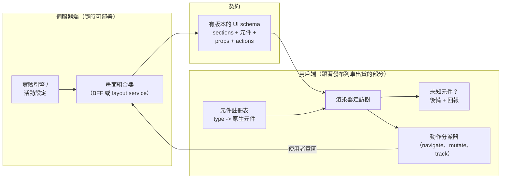

# [FEE-1906] Server-Driven UI

:::info
Server-Driven UI（SDUI）是一種由後端透過 API 回應定義使用者介面的架構：伺服器回傳的不是「讓用戶端自行編排的資料」，而是一份畫面的描述（sections、元件、屬性、動作），用戶端再透過自己早已內建的元件註冊表（registry）把它渲染出來。回報是發布解耦：UI 變更、實驗與活動版位以伺服器部署的速度上線，不經 app store 審核、不出用戶端新版，而 iOS、Android 與 Web 渲染的是同一份答案。成本同樣是結構性的：用戶端變成一個直譯器、JSON schema 變成一份橫跨所有存活用戶端版本的有版本公開契約、離線行為必須被設計而不是被繼承。SDUI 在每週都在變的表面上划算；套在穩定、深度互動的畫面上，它是一種昂貴的 HTML 重造。
:::

## 背景

逼出這個模式的是行動端：發布列車、app store 審核、加上一長尾停在舊版的使用者，意味著一個做在用戶端的 UI 決策會被凍結數週，這對動態消息排序、促銷、新手引導與實驗來說難以忍受。文件最完整的工業級實作是 Airbnb 的 Ghost Platform：把畫面建模為伺服器組合的 *section* 清單、經 GraphQL 交付、在每個平台用共享的元件註冊表渲染；Doist 從另一個方向抵達同一形狀，採用標準化的卡片 schema（Adaptive Cards）並為它打造 SwiftUI/Jetpack Compose 渲染器。兩個團隊用不同的話說同一個收穫：實驗與活動版位在伺服器說了算的時刻上線，而不是在發布列車出發的時刻。Web 與這個模式的關係是繞了一圈：在 SPA 把版面決策搬進用戶端程式碼之前，HTML *本來就是* server-driven UI；SDUI 是選擇性地把決策搬回去，而 React Server Components 是它在框架內的表親（序列化的是*渲染結果*而非抽象 schema）。本文涵蓋 schema、註冊表、決定這個模式成敗的版本紀律，以及它從哪裡開始不再划算。它與 [Backend-for-Frontend](/zh-tw/backend-for-frontend) 成對：BFF 提供的逐體驗伺服器，正是 SDUI 酬載自然被組合出來的地方。

## 視覺對比



## 範例

線路格式是一棵帶型別的元件樹，承載資料，不是標記語言也不是程式碼。動作也是資料，由用戶端的分派器解析：

```json
{
  "schemaVersion": "2.3",
  "screen": "home",
  "sections": [
    {
      "type": "hero-banner",
      "props": { "title": "Winter deals", "imageUrl": "https://cdn.example.com/w.jpg" },
      "action": { "kind": "navigate", "to": "campaign", "params": { "id": "winter-24" } }
    },
    {
      "type": "product-carousel",
      "props": { "title": "Picked for you", "items": [ { "id": "p1", "title": "Lamp", "price": { "cents": 2900, "currency": "EUR" } } ] }
    },
    { "type": "vote-banner", "props": { "question": "New layout?" } }
  ]
}
```

用戶端擁有一份把 schema 型別映射到真實元件的註冊表，以及走訪這棵樹的渲染器。兩條不可妥協的規則都住在這裡：酬載在邊界驗證、未知型別優雅降級而不是當機，因為伺服器永遠比某些已安裝的用戶端新：

```tsx
// sdui/registry.tsx —— 契約的用戶端那一半
const registry = {
  "hero-banner": HeroBanner,
  "product-carousel": ProductCarousel,
  "vote-banner": VoteBanner,
} satisfies Record<string, SduiComponent>;

export function RenderSection({ section }: { section: Section }) {
  const Component = (registry as Record<string, SduiComponent | undefined>)[section.type];
  if (!Component) {
    reportUnknownComponent(section.type);   // 可觀測，不是沉默
    return null;                            // 優雅跳過，畫面照常渲染
  }
  const parsed = sectionSchemas[section.type].safeParse(section.props);
  if (!parsed.success) { reportBadPayload(section.type, parsed.error); return null; }
  return <Component {...parsed.data} onAction={dispatch} />;
}

// sdui/actions.ts —— 分派器是動作唯一的執行地點
export function dispatch(action: Action) {
  switch (action.kind) {
    case "navigate": return router.push(routeFor(action.to, action.params));
    case "mutate":   return api(action.endpoint, { method: "POST", body: action.body });
    case "track":    return analytics.emit(action.event, action.payload);
    default:         return reportUnknownAction(action); // 較新的伺服器、較舊的詞彙表
  }
}
```

伺服器端從設定與實驗指派組合畫面；有 BFF 的話，這就是多一條路由：

```ts
// bff/routes/home-screen.ts —— 畫面在請求時逐使用者計算
app.get("/api/screen/home", async (c) => {
  const user = c.get("session").userId;
  const variant = await experiments.assignment(user, "home-layout");
  return c.json({
    schemaVersion: SCHEMA_VERSION,
    screen: "home",
    sections: [
      ...(await campaigns.activeBanners(user)),
      variant === "carousel-first" ? recsCarousel(user) : ordersSummary(user),
    ],
  });
});
```

## 最佳實踐

- **必須（MUST）**把 schema 當成一份面向你所支援的最寬用戶端矩陣的有版本公開 API：同一主版本內只做加法變更、每份酬載帶明確的 `schemaVersion`、棄用窗口以用戶端汰換速度計，不以伺服器 sprint 計。
- **必須（MUST）**把未知元件型別渲染成有記錄的 no-op（或設計過的後備），絕不是當機；「伺服器比已安裝的用戶端新」是這個模式的常態而非例外。
- **必須（MUST）**在邊界用執行期 schema 驗證酬載；伺服器是可信任的一方，但不是不會出錯的一方，一段格式錯誤的 section 應該只賠掉一個區塊，不是整個畫面。
- **必須（MUST）**讓動作保持宣告式（`{ kind, params }` 對著固定詞彙表分派），絕不可執行；一旦表達式或腳本爬進酬載，用戶端就成了沒有沙箱的 eval 引擎，還附帶 app store 問題。
- **應該（SHOULD）**把 SDUI 限定在高變動的表面（動態消息、活動、新手引導、設定式清單），深度互動的畫面完全由用戶端擁有；逐畫面的混合採用是 Airbnb 與 Doist 殊途同歸的形狀。
- **應該（SHOULD）**快取最後一份完好的酬載，並刻意設計離線/啟動狀態；沒有快取也沒有網路的 SDUI 畫面預設是一片空白，而帶本地狀態的資料驅動畫面從不如此。
- **應該（SHOULD）**讓互動延遲留在本地：伺服器決定結構，兩次抓取之間的文字輸入、開關、樂觀狀態歸用戶端所有；每次按鍵都往返伺服器，是讓這個模式蒙上壞名聲的誇張醜化版。
- **應該（SHOULD）**在 props 裡引用設計 token 而不是原始樣式（`"tone": "critical"`，不是 `"color": "#d32f2f"`），把視覺契約留在用戶端的設計系統裡，那裡才有主題化與無障礙。
- **可以（MAY）**在表面適合卡片形內容時，採用現成的 schema 標準（Adaptive Cards）而不是自己發明；渲染器的投資相同，設計成本不同。
- **可以（MAY）**在產品純 Web、單一 codebase 時優先考慮 React Server Components；RSC 以零用戶端 bundle 的方式交付伺服器決定的 UI 渲染結果，不需要維護一份跨平台 schema。

## 設計思維

**產品是發布解耦，就該按這個定價。**Airbnb 的文章把回報說得最直白（實驗與活動變更在伺服器部署時上線），其他有文件的採用者則用各自的話描述同一個收穫。如果你的產品純 Web，你本來就在持續部署 UI，這個模式的頭號收益大半蒸發；這是 SDUI 實務上以原生端優先的原因，也是 Web 這邊的問題通常變成「RSC 還是重造一次 HTML？」的原因。在 Web 上存活下來的是多平台情境：一份組合好的答案，由 Web、iOS、Android 三個註冊表渲染。

**SDUI 搬移的是決策，不是工作。**畫面上有什麼，總得有人決定；這個模式把決策從五個用戶端 codebase 搬進一個伺服器，所有權問題也跟著搬。伺服器團隊從此交付使用者看得見的 UI，畫面品質、空狀態與無障礙驗收移進伺服器的 review；用戶端團隊的契約轉為註冊表：一份帶硬品質保證的元件菜單。只採用線路格式、不重新談判這條所有權邊界的團隊，拿到的是完整的成本與稀釋過的收益。

**Schema 是一門語言，而語言會生長。**每份 SDUI schema 都從宣告式、小巧開始，然後有人需要一個條件式、然後一個逐項重複、然後一條計算出來的可見性規則，schema 就悄悄變成一個更糟的 JavaScript。守得住的紀律是封閉的元件詞彙表加伺服器端運算：畫面需要邏輯，就讓伺服器跑完、送結果，酬載永遠描述*是什麼*，絕不描述*怎麼決定*。

**對上 RSC，差別在過線的是什麼。**Server Components 序列化的是「同一個 codebase、作為一個單位部署」的元件渲染結果；用戶端從不直譯抽象 schema，也沒有長存的版本矩陣，因為伺服器與用戶端一起部署。SDUI 序列化的是一份抽象 UI，服務多個用戶端、多個平台、多個同時存活的版本。同一句口號（「伺服器決定 UI」），不同的問題：RSC 最佳化一個 Web 應用的 bundle 與資料流；SDUI 協調一支艦隊。

## 深入探討

**Schema 設計。**公開實作之間穩定的共同核心：偏扁平的帶型別 section 清單而非深的類 DOM 樹（Airbnb 的畫面由 section 組成；section 彼此獨立）、每個 schema 版本一個封閉的元件型別聯集、props 限縮為資料與 token 引用、只在真正需要組合的地方開 children/slots。識別碼比看起來重要：穩定的 section ID 讓 diff、局部更新與跨變體的分析對齊成為可能。

**版本協商。**穩健的模式是能力協商而非純版本號：用戶端宣告它能渲染什麼（註冊表版本或明確的元件清單），伺服器在這個能力範圍內組合，對更新的東西代之以後備。這把「舊用戶端遇上新伺服器」從一類錯誤變成一個版面決策，也讓棄用窗口變成分析問題（還有多少 session 沒有 `vote-banner`？）而不是猜測。

**可觀測性是一級功能。**一個來自 JSON 的畫面沒辦法靠讀元件來除錯。工具要早早蓋好：酬載擷取與對本地註冊表的重播、按 schema 版本統計的未知元件與驗證失敗遙測、每次用戶端建置對 fixture 酬載渲染的 golden/快照測試。跳過這些不會移除成本；只會把成本搬進正式環境事故。

**效能形狀。**SDUI 把一次擋渲染的資料抓取換成一次擋渲染的*畫面*抓取，所以關鍵請求的既有紀律全部適用：快取外殼、對長列表做 section 串流或分頁、讓用戶端先渲染快取的結構再重新驗證。有文件的採用者也警告：複雜畫面的酬載可能長得非常大；緩解之道是讓 props 承載引用（圖片 URL、token 名稱、用戶端能從自身快取補齊的項目 ID）而非內嵌大塊資料。導覽值得同等的第一天關注：URL 或深層連結必須映射到一個伺服器組合的畫面，所以路由成為「畫面識別碼加上組合器接受的參數」，`navigate` 動作攜帶的也是這些識別碼，而非平台專屬路徑。

## 失敗模式

SDUI 部署反覆出現的出事方式，與各自的護欄：

| 失敗模式 | 長什麼樣 | 護欄 |
|---|---|---|
| Schema 蔓生 | 條件式、迴圈、表達式爬進酬載 | 封閉元件詞彙表；所有邏輯在伺服器端跑完 |
| 版本矩陣爆炸 | 每次畫面變更弄壞某些已安裝用戶端 | 只做加法變更、能力協商、未知型別後備 |
| 離線空白 | 沒網路、沒快取，啟動時一片空白 | 保存最後完好酬載；逐畫面設計無資料狀態 |
| 直譯器不透明 | 「哪次部署改了這個畫面？」在用戶端 repo 裡無解 | 酬載擷取/重播工具；schema 版本遙測 |
| 所有權真空 | 伺服器交付 UI，沒人擁有它的無障礙與空狀態 | 把畫面驗收移進組合團隊的完成定義 |
| 選錯表面 | 穩定、手勢繁重的編輯器被重造成 JSON | 混合採用：高變動表面用 SDUI，其餘由用戶端擁有 |

前兩列是致命的；其餘的靠工具都救得回來。

## 延伸閱讀

- [Backend-for-Frontend（BFF）與 API 邊界](/zh-tw/backend-for-frontend)
- [微前端架構](/zh-tw/micro-frontend-architecture)
- [RSC State Boundary](/zh-tw/rsc-state-boundary)
- [Design Tokens](/zh-tw/901)

## 參考資料

- Ryan Brooks, "A Deep Dive into Airbnb's Server-Driven UI System," The Airbnb Tech Blog, Medium (2021). https://medium.com/airbnb-engineering/a-deep-dive-into-airbnbs-server-driven-ui-system-842244c5f5
- Pedro Carrasco, "Server-Driven UI from a Mobile Perspective," Doist Engineering (2022). https://www.doist.dev/server-driven-ui-from-a-mobile-perspective/
- Microsoft, "Adaptive Cards," adaptivecards.io (maintained). https://adaptivecards.io/
- React team, "Server Components," react.dev (maintained). https://react.dev/reference/rsc/server-components
- Mobile Native Foundation, "Server-driven UI (or Backend driven UI) strategies," GitHub Discussions #47 (2021, ongoing). https://github.com/MobileNativeFoundation/discussions/discussions/47
