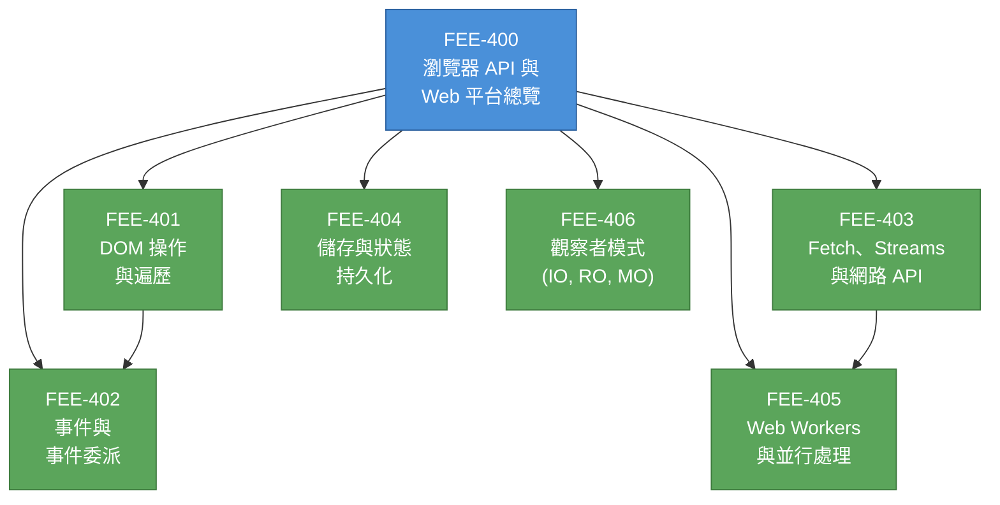

# [FEE-400] 瀏覽器 API 與 Web 平台總覽

:::info
本類別涵蓋瀏覽器作為應用程式執行環境的全貌 -- 它所暴露的全域物件、疊加在 ECMAScript 之上的 Web API，以及影響平台演進方向的可延伸 Web（extensible web）哲學。文章 401 到 406 深入探討各個 API 家族。
:::

## 背景

Web 瀏覽器遠不只是 HTML 渲染器。它是一個完整的應用程式執行環境，為 JavaScript 程式碼提供網路存取、持久化儲存、硬體感測器、並行處理原語（concurrency primitives）以及文件本身的操作能力。這些能力透過 **Web API** 傳遞 -- 由標準組織（WHATWG、W3C、Khronos）制定規範，並由瀏覽器引擎實作的介面。

### 瀏覽器執行環境模型

當瀏覽器載入頁面時，它會建構數個相互關聯的全域物件（global objects）：

- **`window`** -- 瀏覽上下文（browsing context）中的頂層全域物件。每個全域變數和函式都以 `window` 的屬性存在。它同時提供計時器（`setTimeout`、`requestAnimationFrame`）、導覽（`location`、`history`）與框架關係（`parent`、`top`）。
- **`document`** -- DOM 樹的進入點。它代表已解析的 HTML，並暴露查詢、建立與修改元素的方法（`querySelector`、`createElement`、`createTreeWalker`）。
- **`navigator`** -- 代表使用者代理（user agent）的身份與能力。它提供對裝置 API 的存取，例如地理位置（`navigator.geolocation`）、Service Worker（`navigator.serviceWorker`）、剪貼簿（`navigator.clipboard`）和網路狀態（`navigator.onLine`）。

這些物件不屬於 ECMAScript 語言規範。它們定義在 HTML Living Standard 及相關的 Web API 規範中。理解這個區別是基本功。

### Web API 與 ECMAScript 的差異

ECMAScript（JavaScript 背後的語言標準）定義核心語言：語法、型別、控制流程、`Promise`、`Map`、`Proxy` 等等。它對 DOM、HTTP 請求或本機儲存一無所知。

Web API 是語言與瀏覽器環境之間的橋樑。它們獨立制定規範，並以全域物件上的屬性方式暴露：

| 層級 | 規範制定者 | 範例 |
|------|-----------|------|
| **ECMAScript** | TC39 / ECMA-262 | `Promise`、`Array.prototype.map`、`class`、`async/await` |
| **Web API** | WHATWG、W3C、Khronos | `fetch`、`IntersectionObserver`、`localStorage`、`WebGL` |
| **瀏覽器專屬** | 個別瀏覽器廠商 | DevTools 協定、專有擴充功能 |

一個常見的困惑來源：`setTimeout` 感覺像是「JavaScript」的一部分，但它是 HTML 規範中定義的 Web API，而非 ECMA-262 的內容。`console`、`fetch`、`URL` 和許多日常工具也是如此。

### 可延伸 Web（Extensible Web）

2013 年，一群瀏覽器廠商和 Web 開發者發布了 **Extensible Web Manifesto（可延伸 Web 宣言）**。其核心主張：標準組織應優先提供低層級、可組合的原語（primitives），而非高層級、帶有明確主張的功能。當平台暴露強大的建構模塊時，開發者和函式庫作者就能在使用者端（userland）進行實驗、迭代並驗證解決方案，然後才成為正式標準。

這個哲學塑造了現代平台：

- **Service Workers** 暴露對網路請求的低層級控制，讓開發者能建構離線體驗、自訂快取策略和推播通知，而不需要瀏覽器規定單一的「離線模式」。
- **Custom Elements** 與 **Shadow DOM** 提供封裝、可重用元件的原語，而非強制規定一種元件模型。
- **CSS Houdini** 暴露渲染管線（layout、paint、animation），讓開發者能用 JavaScript 擴展 CSS。
- **Streams API** 暴露增量資料處理能力，而非強迫全部緩衝或全無的模式。

可延伸 Web 哲學意味著 API 表面積持續增長。新能力傾向於低層級且可組合。這使得前端工程師必須具備對 API 全貌的結構化心智模型。

### 為什麼需要類別導覽圖

瀏覽器暴露了數百個 API。如果沒有心智地圖，工程師不是忽略了需要的能力，就是引入了重複平台已有功能的函式庫。本類別的文章（FEE-401 到 FEE-406）將最重要的 API 家族組織成一條連貫的學習路徑：

| FEE | 主題 | 涵蓋內容 |
|-----|------|---------|
| 401 | DOM 操作與遍歷 | querySelector、createElement、TreeWalker、DOM diffing 策略 |
| 402 | 事件與事件委派 | 事件傳播（event propagation）、委派模式、自訂事件、AbortController |
| 403 | Fetch、Streams 與網路 API | fetch、Request/Response、ReadableStream、Server-Sent Events、WebSocket |
| 404 | 儲存與狀態持久化 | localStorage、sessionStorage、IndexedDB、Cache API、cookies |
| 405 | Web Workers 與並行處理 | Dedicated/shared workers、MessageChannel、Transferable、排程 API |
| 406 | 觀察者模式 | IntersectionObserver、ResizeObserver、MutationObserver、PerformanceObserver |

## 設計思維

### 為什麼瀏覽器透過全域物件暴露 API

瀏覽器透過 `window`、`document` 和 `navigator` 上的屬性暴露能力，而非透過 import/module 系統。這是植根於 Web 歷史與限制的刻意設計選擇：

1. **向後相容性（backward compatibility）。** Web 不能破壞既有頁面。全域物件在 ES modules 出現之前（2015 年）就已確立。改變存取模式會破壞數十億個頁面。

2. **功能偵測（feature detection）。** 全域屬性使得簡單的能力檢查成為可能：`if ('serviceWorker' in navigator)`。這個模式 -- 檢查已知物件上是否存在某個屬性 -- 是 Web 上漸進增強（progressive enhancement）的基石。

3. **安全邊界（security boundaries）。** 瀏覽器根據上下文控制每個全域物件所暴露的內容。跨來源的 iframe 得到受限的 `window`；不透明的 `Response` 隱藏其 body。全域物件扮演的是能力邊界的角色，而不只是命名空間。

4. **可發現性（discoverability）。** 開發者可以在 DevTools 中輸入 `navigator.` 就看到所有可用的裝置 API。這種即時可發現性雖然嘈雜，但降低了探索平台的門檻。

### 可延伸 Web 宣言的實踐

宣言的核心洞見是：標準流程緩慢，但 Web 必須快速演進。透過暴露低層級原語：

- **開發者主導實驗。** 像 Workbox（建立在 Service Workers 之上）和 Lit（建立在 Custom Elements 之上）這樣的函式庫，在成為平台功能之前就驗證了設計模式。
- **Polyfill 成為可能。** 當新 API 以既有原語來定義時，開發者可以在舊版瀏覽器中 polyfill 它。當功能是「魔法」（無法用更低層級的構造來解釋）時，polyfill 就不可能。
- **平台保持精簡。** 瀏覽器不是提供一個帶有主張的離線解決方案，而是提供 Service Workers 和 Cache API。開發者將這些原語組合成適合其特定需求的方案。

這個哲學正是為什麼現代瀏覽器 API 感覺像工具箱（toolkit）而非框架（framework）。理解這一點有助於你評估新 API：偏好那些能與既有原語組合的 API，而非引入新魔法的 API。

## 圖解

**閱讀順序：** 從 DOM 操作（401）與事件（402）開始 -- 這是所有瀏覽器互動的基礎。網路 API（403）與儲存（404）可以平行探索。Web Workers（405）建立在網路與串流的概念之上。觀察者（406）可獨立學習，但有 DOM 知識會更好理解。

## 相關 FEE

| FEE | 關聯 |
|-----|------|
| [FEE-100 HTML 與語意標記](../HTML%20and%20Semantic%20Markup/100.md) | HTML 定義了瀏覽器 API 所操作的文件。DOM API（FEE-401）運作在 HTML 建立的樹上。 |
| [FEE-300 JavaScript 核心與執行環境](../JavaScript%20Core%20and%20Runtime/300.md) | ECMAScript 提供語言；瀏覽器 API 提供能力。理解事件迴圈（event loop，FEE-301）對於推理非同步 Web API 至關重要。 |
| [FEE-500 元件架構](../Component%20Architecture%20and%20Design%20Patterns/500.md) | 元件框架對瀏覽器 API 進行抽象。理解底層平台有助於除錯框架行為，並判斷何時直接使用原生 API。 |

## 參考資料

- [WHATWG HTML Living Standard](https://html.spec.whatwg.org/) -- 關於 HTML 語言與瀏覽器執行環境 API（包括 Window、Document、Navigator 和事件迴圈）的權威規範
- [MDN: Web APIs](https://developer.mozilla.org/en-US/docs/Web/API) -- 所有瀏覽器可用 Web API 的綜合參考，按類別組織
- [MDN: Introduction to Web APIs](https://developer.mozilla.org/en-US/docs/Learn_web_development/Extensions/Client-side_APIs/Introduction) -- 適合初學者的指南，說明什麼是 Web API 以及它們與 JavaScript 的關係
- [The Extensible Web Manifesto](https://extensiblewebmanifesto.org/) -- 2013 年發布的宣言，倡導低層級、可組合的 Web 平台原語，而非高層級帶有主張的功能
- [ECMA-262 Specification](https://tc39.es/ecma262/) -- ECMAScript 語言規範，定義 Web API 所建立其上的核心語言
- [Browser environment, specs (javascript.info)](https://javascript.info/browser-environment) -- 清晰的視覺化解說，呈現 window、DOM、BOM 與 JavaScript 之間的關係
