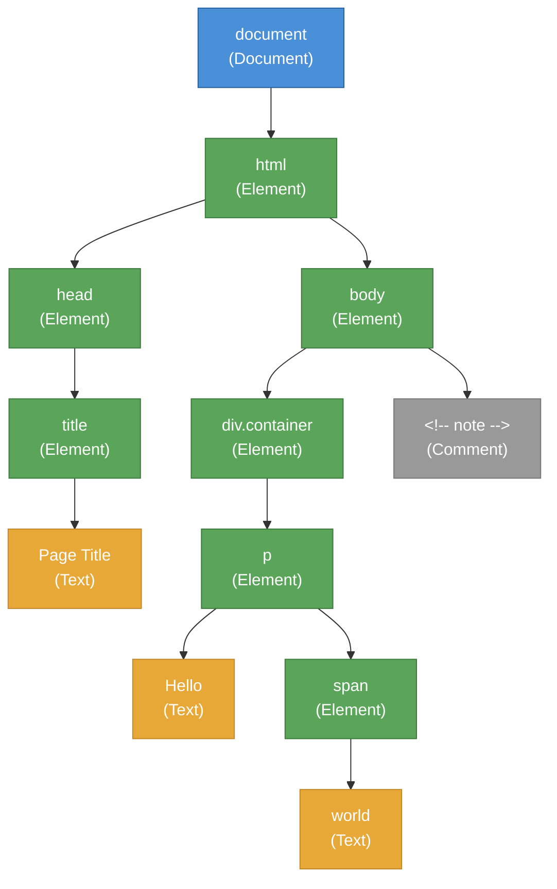
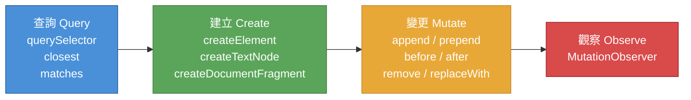

# [FEE-401] DOM 操作與遍歷

:::info
Document Object Model (DOM) 是瀏覽器對 HTML 文件的記憶體內部表示。每個元素、文字節點與註解都成為樹狀結構中的物件，JavaScript 可以查詢、遍歷與修改這些物件。深入理解 DOM 操作對於除錯框架行為、優化渲染效能，以及判斷何時原生 API 就已足夠而無需依賴函式庫，都至關重要。
:::

## 背景

當瀏覽器解析 HTML 文件時，會建構一棵由 **節點 (node)** 組成的樹。這棵樹 -- 即 DOM -- 是使用者所見內容的唯一真實來源。CSS 讀取它來計算樣式；排版引擎 (layout engine) 讀取它來計算幾何資訊；繪製引擎 (painting engine) 讀取它來產生像素。從 jQuery 到 React 到 Svelte，每個框架最終都是透過 DOM API 呼叫來更新這棵樹。

### DOM 是一棵樹

HTML 是巢狀的標記語言。DOM 將這種巢狀結構精確地映射為樹狀資料結構。樹中的每個節點都實作 `Node` 介面，最常見的節點類型如下：

| 節點類型 | `nodeType` 常數 | 說明 |
|---------|----------------|------|
| **Element（元素）** | `Node.ELEMENT_NODE` (1) | HTML 或 SVG 元素（`<div>`、`<span>`、`<svg>`） |
| **Text（文字）** | `Node.TEXT_NODE` (3) | 元素之間或內部的文字內容 |
| **Comment（註解）** | `Node.COMMENT_NODE` (8) | HTML 註解（`<!-- ... -->`） |
| **Document（文件）** | `Node.DOCUMENT_NODE` (9) | 根節點 `document` 物件 |
| **DocumentFragment（文件片段）** | `Node.DOCUMENT_FRAGMENT_NODE` (11) | 輕量容器，持有節點但不屬於即時樹的一部分 |

元素是開發者最常互動的節點，但文字節點同樣重要。一個常見的意外：標籤之間的空白會產生文字節點。字串 `<ul>\n  <li>A</li>\n</ul>` 會為 `<li>` 周圍的換行與空格產生文字節點。

### 屬性 (attribute) 與特性 (property)

DOM 元素同時擁有 **attribute**（HTML 標記中序列化的鍵值對）和 **property**（DOM 節點上的 JavaScript 物件特性）。兩者相關但不同：

- `element.getAttribute('value')` 讀取 HTML attribute -- 標記中的*初始*值。
- `element.value` 讀取 JavaScript property -- *目前*的值，可能已被使用者輸入或腳本改變。
- `element.setAttribute('value', 'new')` 更新 attribute，對大多數內建屬性也會同步 property。
- 某些 attribute 和 property 名稱相同但類型不同。`checked` attribute 是字串（存在或不存在）；`checked` property 是布林值。

**原則：** SHOULD 使用 property 讀取目前狀態，使用 attribute 做序列化或初始設定。

### innerHTML 與 textContent

兩種常見的內容設定方式有截然不同的行為：

- **`textContent`** 設定或取得節點及其所有後代的文字內容。它不會解析 HTML。`element.textContent = userInput` 對注入攻擊是安全的。
- **`innerHTML`** 將指派的字串解析為 HTML 並以產生的節點取代元素的子節點。若 `userInput` 包含未經清理的標記，`element.innerHTML = userInput` 即為 **XSS 攻擊向量**。

**原則：** SHOULD 在插入純文字時使用 `textContent`。MUST NOT 對未經清理的使用者輸入使用 `innerHTML`。

## 使用情境

你正在開發一個富文字編輯器，格式化動作是透過將選取的文字包裹在新元素中來實現的。選取正確的節點、在精確的位置插入元素、讀取屬性時不觸發不必要的佈局重算——這些操作都需要精準的 DOM 遍歷與操作。DOM 的樹狀模型決定了如何從被點擊的元素導航到父節點、尋找兄弟節點、在不觸發佈局的情況下讀取屬性，以及在不替換現有子節點的前提下插入新節點。

## 設計思維

### 為何 DOM 是樹狀 API

HTML 是樹狀結構的語言：元素巢狀於其他元素之內，形成父子關係。DOM 精確地映射此結構，因為它必須表示每個有效的 HTML 文件。樹是自然的資料結構，因為：

1. **層級包含 (hierarchical containment)。** `<div>` 包含其子元素；`<table>` 包含 `<tr>`，`<tr>` 又包含 `<td>`。樹直接編碼這些關係。
2. **高效的 CSS 匹配。** 選擇器如 `div > p` 或 `.sidebar .link` 會遍歷父子與祖先後代關係。樹使這些查詢成為可能。
3. **事件傳播 (event propagation)。** 事件從目標元素向上冒泡 (bubble) 經過祖先到達 document。樹明確定義了這條路徑。

### 框架的抽象策略

框架存在的原因是直接 DOM 操作無法擴展到複雜的 UI。每個框架對基本問題採取不同的方法：在狀態變更時，決定所需的最小 DOM 操作集合。

**React：Virtual DOM 與 reconciliation。** React 在記憶體中維護一棵由輕量 JavaScript 物件組成的樹（virtual DOM）。每次狀態變更時，React 將元件樹重新渲染為新的 virtual DOM，與前一版進行 diff，並產生最小的真實 DOM 變更列表。成本在於 diff 本身 -- 複雜度為 O(n)（n 為樹的大小）-- 但 React 以啟發式規則分攤此成本（相同類型的元素保持原位，key 用於識別列表項目）。

**Vue：Reactive proxy 搭配編譯器優化的 patch。** Vue 3 使用 JavaScript `Proxy` 物件追蹤每個模板表達式所依賴的資料。當資料變更時，Vue 精確知道哪些表達式受到影響。Vue 編譯器進一步優化，標記永遠不會改變的靜態子樹，在更新時完全跳過它們。

**Svelte：編譯時期 DOM 指令。** Svelte 將工作從執行時期移至建構時期。編譯器分析每個元件的模板，產生直接建立與更新特定 DOM 節點的命令式 JavaScript。沒有 virtual DOM、沒有 diff 演算法、沒有 reconciliation 步驟。當 reactive 變數改變時，產生的程式碼只更新綁定的 DOM 節點。

**Solid：Fine-grained signals。** SolidJS 使用 signal（reactive 基本元件）精確追蹤哪些 DOM 節點依賴哪些狀態。當 signal 變更時，只有那些特定的 DOM 文字節點或屬性會更新。元件只執行一次（建立 reactive 圖譜）且永不重新執行。

**Lit：Tagged template literals。** Lit 使用 JavaScript tagged template literal 來建立高效的模板。模板的靜態部分只解析一次；更新時只評估動態表達式。Lit 將這些編譯為表達式邊界上的直接 DOM 變更。

### DOM 操作的成本

DOM 操作本身並不慢 -- 建立一個 `<div>` 並附加到樹上，單獨來看是很快的。成本來自**排版重算 (layout recalculation)**。瀏覽器引擎在變更後必須決定每個受影響元素的位置與尺寸。在以下情況成本會倍增：

- **排版抖動 (layout thrashing)**：交錯的讀寫迫使每次讀取都進行同步排版。
- **強制同步排版 (forced synchronous layout)**：在待處理的樣式變更後讀取幾何屬性（`offsetTop`、`getBoundingClientRect()`、`scrollHeight`）時觸發。
- **龐大的 DOM 樹**增加每次排版的成本，因為有更多元素需要重算。

解決方案是批次處理寫入操作，並使用 `requestAnimationFrame` 將其延遲到適當的時機，該函式會在瀏覽器下一次繪製前排程程式碼執行。

## 最佳實踐

**在寫入之前批次完成所有 DOM 讀取，以避免排版抖動 (layout thrashing)。** 瀏覽器採用延遲排版策略，只在真正需要幾何資訊時才重新計算。當 JavaScript 交錯執行讀取（如 `offsetWidth`、`getBoundingClientRect()`）與寫入（如 `style.width = ...`）時，每次讀取都會強制觸發同步排版，導致幀率從 60 fps 急降至個位數。SHOULD 先收集所有幾何讀取，再在第二階段統一套用所有樣式寫入。

**批次插入 DOM 時，SHOULD 使用 `DocumentFragment`。** 逐一將元素附加至即時 DOM 會在每次插入時觸發排版重算。`DocumentFragment` 不屬於活躍的文件樹，對其附加子節點不會產生排版成本。將 fragment 插入 DOM 時，所有子節點會在單一操作中原子性地移入。插入多個元素時，SHOULD 使用 `document.createDocumentFragment()`（或現代的 `append()` 搭配多個節點引數）。

**新程式碼 SHOULD 優先使用 `querySelector` 與 `querySelectorAll`，而非舊式 API。** `getElementById`、`getElementsByTagName`、`getElementsByClassName` 回傳的是即時 HTMLCollection，會隨 DOM 變動而更新，在迴圈中容易引發難以察覺的 bug。`querySelector` 與 `querySelectorAll` 回傳靜態結果，並接受任意 CSS 選擇器，行為更可預期且表達力更強。AVOID 使用舊式 collection API，除非明確需要即時集合。

**在長期存活的程式碼中，SHOULD 快取 DOM 參考。** `querySelector` 每次呼叫都會遍歷整個子樹。在迴圈或頻繁呼叫的函式中對不會改變的目標元素重複查詢，會白白浪費 CPU 資源。SHOULD 僅查詢一次 DOM 並將結果儲存於變數，在後續的函式呼叫或渲染週期中重複使用，AVOID 對同一個穩定元素進行多次查詢。

## 視覺化



**圖例：** 藍色 = Document 節點。綠色 = Element 節點。橘色 = Text 節點。灰色 = Comment 節點。此樹表示一個簡單 HTML 頁面解析後的 DOM。每個節點都是 JavaScript 可以查詢與修改的物件。



**DOM 操作生命週期：** 查詢樹以尋找節點、建立新節點、透過插入或移除來變更樹、以 MutationObserver 進行反應式觀察。

## 範例

### 1. 查詢與操作元素

```js
// querySelector 回傳第一個匹配項（或 null）
const header = document.querySelector('h1.title');

// querySelectorAll 回傳靜態 NodeList
const items = document.querySelectorAll('.list-item');

// closest 沿樹向上走訪，找到匹配選擇器的祖先
const form = header.closest('form');

// matches 測試元素本身是否匹配選擇器
if (header.matches('.title')) {
  console.log('Element matches .title');
}

// 現代操作方法（不再需要 parentNode.insertBefore）
const newEl = document.createElement('p');
newEl.textContent = 'Inserted paragraph';

header.after(newEl);       // 在 header 之後插入
header.before(newEl);      // 在 header 之前插入
header.append(newEl);      // 作為 header 的最後子節點附加
header.prepend(newEl);     // 作為 header 的第一個子節點前置
header.replaceWith(newEl); // 完全取代 header
newEl.remove();            // 從 DOM 移除
```

### 2. 使用 DocumentFragment 批次插入

```js
// 不佳：在迴圈中逐一附加，每次都觸發排版
function addItemsSlow(container, count) {
  for (let i = 0; i < count; i++) {
    const li = document.createElement('li');
    li.textContent = `Item ${i}`;
    container.appendChild(li); // 每次都觸發排版
  }
}

// 良好：在 fragment 中建構節點，一次插入
function addItemsFast(container, count) {
  const fragment = document.createDocumentFragment();
  for (let i = 0; i < count; i++) {
    const li = document.createElement('li');
    li.textContent = `Item ${i}`;
    fragment.appendChild(li); // 無排版成本 -- fragment 不在 DOM 中
  }
  container.appendChild(fragment); // 單次 DOM 插入
}

// 也很好：現代 append() 接受多個節點
function addItemsModern(container, count) {
  const items = Array.from({ length: count }, (_, i) => {
    const li = document.createElement('li');
    li.textContent = `Item ${i}`;
    return li;
  });
  container.append(...items); // 單一操作
}
```

### 3. 使用 requestAnimationFrame 修正排版抖動

```js
// 不佳：排版抖動 -- 讀寫交錯
function resizeAll(elements) {
  for (const el of elements) {
    const width = el.offsetWidth;         // 讀取 -> 強制排版
    el.style.width = (width * 1.1) + 'px'; // 寫入 -> 使排版失效
    // 下一次迭代的讀取再次強制排版
  }
}

// 良好：先批次讀取，再批次寫入
function resizeAllBatched(elements) {
  // 階段 1：讀取所有值
  const widths = elements.map(el => el.offsetWidth);

  // 階段 2：寫入所有值
  elements.forEach((el, i) => {
    el.style.width = (widths[i] * 1.1) + 'px';
  });
}

// 良好：將寫入延遲至下一個動畫幀
function resizeAllRAF(elements) {
  const widths = elements.map(el => el.offsetWidth); // 現在批次讀取

  requestAnimationFrame(() => {
    elements.forEach((el, i) => {
      el.style.width = (widths[i] * 1.1) + 'px';   // 在 rAF 中批次寫入
    });
  });
}
```

### 4. 使用 MutationObserver 進行反應式 DOM 監視

```js
// 監視子節點的新增/移除與屬性變更
const observer = new MutationObserver((mutations) => {
  for (const mutation of mutations) {
    if (mutation.type === 'childList') {
      for (const node of mutation.addedNodes) {
        if (node.nodeType === Node.ELEMENT_NODE) {
          console.log('Element added:', node.tagName);
        }
      }
    }
    if (mutation.type === 'attributes') {
      console.log(`Attribute "${mutation.attributeName}" changed on`, mutation.target);
    }
  }
});

const target = document.querySelector('#app');
observer.observe(target, {
  childList: true,
  attributes: true,
  subtree: true,            // 觀察所有後代
  attributeFilter: ['class', 'data-state'], // 只觀察這些屬性
});

// 完成時清理
// observer.disconnect();
```

## 常見錯誤

### 1. 對使用者輸入使用 innerHTML（XSS）

將 `innerHTML` 設為未經清理的使用者輸入會允許腳本注入：

```js
// 危險：使用者可注入  或 <script>
container.innerHTML = userComment;

// 安全：textContent 會跳脫 HTML
container.textContent = userComment;

// 安全：以程式方式建立元素
const p = document.createElement('p');
p.textContent = userComment;
container.append(p);
```

### 2. 未使用 closest() 進行事件委派

在父元素上處理事件時，開發者常手動向上遍歷樹。`closest()` 方法能正確且簡潔地完成此操作：

```js
// 脆弱：只檢查直接目標
list.addEventListener('click', (e) => {
  if (e.target.tagName === 'LI') { /* ... */ }
  // 若使用者點擊 <li> 內的 <span> 則失敗
});

// 穩健：closest() 向上走訪尋找匹配的祖先
list.addEventListener('click', (e) => {
  const item = e.target.closest('li');
  if (item && list.contains(item)) {
    // 正確處理對 <li> 任何後代的點擊
  }
});
```

### 3. 忘記 DOM 操作是同步的且會阻塞渲染

DOM 變更是同步的 -- 在下一行 JavaScript 執行前就已完成。然而，瀏覽器在 JavaScript 讓出控制權之前不會**繪製**。一個附加數千個元素的長時間執行迴圈會阻塞主執行緒，使 UI 凍結直到完成。對大量批次操作應使用 `requestAnimationFrame` 或分塊處理。

## 相關 FEE

| FEE | 關聯 |
|-----|------|
| [FEE-400 Browser APIs & Web Platform 總覽](./400.md) | 父分類。建立 DOM API 運作所在的執行時期模型（window、document、navigator）。 |
| [FEE-402 事件與事件委派](./402.md) | 事件透過 DOM 樹傳播。事件委派仰賴 `closest()` 等 DOM 遍歷方法。 |
| [FEE-301 事件迴圈與非同步執行](../JavaScript%20Core%20and%20Runtime/301.md) | DOM 變更是同步的但渲染是非同步的。理解事件迴圈能解釋 `requestAnimationFrame` 回呼何時執行。 |
| [FEE-306 記憶體管理與垃圾回收](../JavaScript%20Core%20and%20Runtime/306.md) | 仍被 JavaScript 參考的已分離 DOM 節點會造成記憶體洩漏。理解 GC root 有助於預防此問題。 |

## 參考資料

- [WHATWG DOM Living Standard](https://dom.spec.whatwg.org/) -- DOM 樹、Node 介面與變更演算法的權威規格
- [MDN: Document Object Model (DOM)](https://developer.mozilla.org/en-US/docs/Web/API/Document_Object_Model) -- 所有 DOM API 的完整參考，含範例與瀏覽器相容性資料
- [MDN: DocumentFragment](https://developer.mozilla.org/en-US/docs/Web/API/DocumentFragment) -- 批次 DOM 操作用的輕量文件容器指南
- [MDN: MutationObserver](https://developer.mozilla.org/en-US/docs/Web/API/MutationObserver) -- 取代已棄用 Mutation Events 的 MutationObserver API 參考
- [Avoid large, complex layouts and layout thrashing (web.dev)](https://web.dev/articles/avoid-large-complex-layouts-and-layout-thrashing) -- Google 的排版抖動辨識與修正指南，含效能工具使用說明
- [What forces layout/reflow (Paul Irish)](https://gist.github.com/paulirish/5d52fb081b3570c81e3a) -- 會強制同步排版的 DOM 屬性與方法完整列表
- [DOM tree (javascript.info)](https://javascript.info/dom-nodes) -- 視覺化、初學者友善的 DOM 樹、節點類型與遍歷說明
