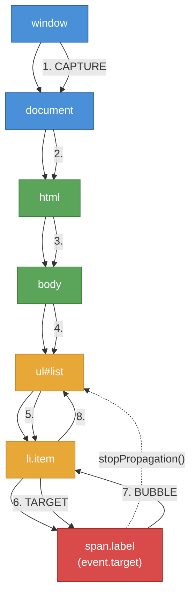

# [FEE-402] 事件與事件委派

:::info
事件 (event) 是瀏覽器用來通知「某件事發生了」的機制 -- 使用者點擊、按下按鍵、網路回應抵達，或自訂動作完成。DOM 事件系統定義了這些訊號如何在文件樹中傳播、監聽器如何註冊與移除，以及預設行為如何被攔截。精通事件模型對於建構回應式介面、管理清理工作，以及理解框架如何抽象化原生事件，都至關重要。
:::

## 背景

瀏覽器是事件驅動 (event-driven) 的環境。程式碼不會輪詢 (poll) 變更，而是在目標（元素、`document`、`window`）上註冊**事件監聽器 (event listener)**，當對應的事件發生時由瀏覽器呼叫它們。此模型支撐著每一種使用者互動：點擊、按鍵、捲動、焦點變更、表單輸入、拖放、剪貼簿操作與指標移動。

### 事件流程：捕獲、目標、冒泡

當事件在 DOM 元素上觸發時，它不會只是單純抵達該元素。WHATWG DOM Standard 定義了三階段傳播模型：

1. **捕獲階段 (Capture phase)。** 事件從 `window` 向下經過每個祖先傳遞到目標的父元素。以 `capture: true` 註冊的監聽器在此階段觸發。
2. **目標階段 (Target phase)。** 事件抵達事件起源的元素。目標上的捕獲與冒泡監聽器皆按註冊順序觸發。
3. **冒泡階段 (Bubble phase)。** 事件從目標的父元素向上傳回 `window`。未使用 capture 旗標（預設行為）註冊的監聽器在此階段觸發。

並非所有事件都會冒泡。`focus`、`blur`、`load` 與 `scroll` 等事件預設不冒泡。它們的冒泡對應版本 -- `focusin`、`focusout` -- 專為委派 (delegation) 用途而存在。

### addEventListener 選項

`addEventListener` 方法接受含四個鍵的選項物件：

| 選項 | 類型 | 預設值 | 用途 |
|------|------|--------|------|
| `capture` | boolean | `false` | 將監聽器註冊在捕獲階段而非冒泡階段 |
| `once` | boolean | `false` | 首次呼叫後自動移除監聽器 |
| `passive` | boolean | 依情況 | 承諾不呼叫 `preventDefault()`，使瀏覽器能優化捲動 |
| `signal` | AbortSignal | -- | 當關聯的 AbortController 被中止時移除監聽器 |

在大多數瀏覽器中，`passive` 預設值對 `document` 層級目標上的 `touchstart`、`touchmove`、`wheel` 與 `mousewheel` 事件為 `true`。這允許合成器執行緒 (compositor thread) 立即捲動，無需等待 JavaScript。

### 事件類型總覽

平台提供數十種事件類型，依輸入模式分組：

| 分類 | 主要事件 | 備註 |
|------|---------|------|
| **滑鼠 (Mouse)** | `click`, `dblclick`, `mousedown`, `mouseup`, `mousemove`, `mouseenter`, `mouseleave` | `mouseenter`/`mouseleave` 不冒泡 |
| **指標 (Pointer)** | `pointerdown`, `pointerup`, `pointermove`, `pointerenter`, `pointerleave`, `pointercancel` | 統一滑鼠、觸控與觸控筆的輸入模型 |
| **觸控 (Touch)** | `touchstart`, `touchmove`, `touchend`, `touchcancel` | 行動裝置專用；pointer events 是現代替代方案 |
| **鍵盤 (Keyboard)** | `keydown`, `keyup` | `keypress` 已棄用；應使用 `keydown` |
| **焦點 (Focus)** | `focus`, `blur`, `focusin`, `focusout` | `focusin`/`focusout` 冒泡；`focus`/`blur` 不冒泡 |
| **輸入 (Input)** | `input`, `change`, `beforeinput` | `input` 在每次按鍵時觸發；`change` 在提交時觸發 |
| **組字 (Composition)** | `compositionstart`, `compositionupdate`, `compositionend` | 用於 CJK 等複雜文字的 IME 輸入 |
| **剪貼簿 (Clipboard)** | `copy`, `cut`, `paste` | 透過 `event.clipboardData` 存取剪貼簿資料 |
| **拖放 (Drag)** | `dragstart`, `drag`, `dragenter`, `dragleave`, `dragover`, `drop`, `dragend` | 需在 `dragover` 呼叫 `preventDefault()` 才能允許 drop |

## 使用情境

一個有 500 列動態產生資料的表格，每列都需要點擊事件處理器。為每列個別掛載監聽器雖然可行，卻消耗大量記憶體，也會在列新增或移除時失效——新列根本沒有監聽器。事件委派透過在表格上掛載單一監聽器，借助事件冒泡機制將點擊路由到處理函式，從根本解決了這個問題。理解冒泡、捕獲與事件委派，讓你能用單一處理器建構互動式清單、表格和樹狀結構，對現有與未來新增的元素都同樣有效。

## 設計思維

### 為何事件會冒泡

DOM 事件模型是**以文件為中心 (document-centric)** 的。HTML 最初為文件而非應用程式設計，原始事件模型反映了這點：祖先應能觀察其子樹中發生的事情。冒泡編碼了一個直覺：點擊段落中的一個字，也就是點擊了該段落、該區段與整個頁面。

這個設計帶來強大的結果：**委派 (delegation)**。容器上的單一監聽器可以處理來自任意數量後代的事件，包括尚未存在於 DOM 中的元素。若沒有冒泡，每個動態建立的元素都需要自己的監聽器。

### 框架的事件系統

框架在原生 DOM 事件系統之上建構自己的事件層，各有不同的取捨：

**React：Synthetic event 搭配根層級委派。** React 將原生事件包裝在 `SyntheticEvent` 物件中以統一跨瀏覽器差異。自 React 17 起，所有事件監聽器附加在根容器元素（而非 `document`），改善了多個 React root 共存時的相容性。在 React 中呼叫 `e.stopPropagation()` 會停止 React 樹內的傳播，但不會阻止原生事件傳播。

**Vue：`v-on` 指令搭配修飾符。** Vue 透過 `v-on`（或 `@`）提供宣告式事件綁定，內建修飾符：`.stop`（stopPropagation）、`.prevent`（preventDefault）、`.capture`、`.self`、`.once`、`.passive`。這些直接對應原生 addEventListener 選項與事件方法，減少樣板程式碼的同時保持貼近平台的思維模型。

**Web Components：跨 Shadow DOM 的事件重定向 (retargeting)。** 當事件源自 Shadow DOM 內部並跨越 shadow 邊界時，瀏覽器會**重定向**它 -- 從外部監聽器的角度看，`event.target` 變為 host 元素。`composed: true` 的事件（如 `click`、`keydown`、`input`）跨越 shadow 邊界；`composed: false` 的事件（如 `focus`、`blur`）則不會。自訂事件必須明確設定 `composed: true` 和 `bubbles: true` 才能逃出 shadow root。

**Svelte：`on:` 指令（Svelte 4）/ `onclick` props（Svelte 5）。** Svelte 4 使用 `on:click` 搭配修飾符（`|preventDefault|stopPropagation`）。Svelte 5 改為 props 模型，事件處理器作為 `onclick` 屬性傳入。兩者都編譯為直接的 `addEventListener` 呼叫，沒有執行時期的委派層。

### AbortController 作為現代清理機制

在 `AbortController` 之前，移除事件監聽器需要保留傳給 `addEventListener` 的完全相同的函式參考。匿名函式和綁定方法使此操作變得脆弱。`AbortController` 反轉了這個關係：不再追蹤每個監聽器，而是追蹤單一 controller，並在元件卸載、對話框關閉或功能拆解時中止它。此模式與 `AbortController` 最初用於 fetch 取消的目的一致，建立了跨平台的統一取消原語 (cancellation primitive)。

## 最佳實踐

**對動態列表，SHOULD 優先使用事件委派而非為每個元素個別附加監聽器。** 應在穩定的祖先元素上附加單一監聽器，在處理器內使用 `event.target.closest()` 識別被操作的後代元素。這能降低記憶體使用量、簡化清理工作，並自動涵蓋初始化後動態加入 DOM 的元素。

**元件或功能拆解時，MUST 移除所有事件監聽器。** 必須確保在 setup 期間註冊的每個監聽器都在 cleanup 時被移除，以防止 SPA 中的記憶體洩漏與殭屍監聽器。建議模式是建立一個 `AbortController`，將 `{ signal: controller.signal }` 傳給每次 `addEventListener` 呼叫，並在卸載時呼叫 `controller.abort()` — 這能一次移除所有關聯監聽器，無需追蹤個別函式參考。

**只需觸發一次的處理器，SHOULD 使用 `{ once: true }`。** 應使用 `once` 選項，而非在處理器內手動呼叫 `removeEventListener`。瀏覽器會在首次呼叫後自動移除監聽器，無需保留函式參考，也能防止同一處理器再次被註冊時意外重複觸發。

**捲動與觸控事件監聽器，SHOULD 優先使用 `passive: true`。** 當不需要呼叫 `preventDefault()` 時，應將 `touchstart`、`touchmove` 與 `wheel` 監聽器標記為 `passive: true`。非 passive 的監聽器會強迫瀏覽器等待 JavaScript 完成才能推進捲動，造成可見的卡頓。注意，瀏覽器已對 `document` 層級目標（`Window`、`Document`、`Document.body`）上的這些事件類型預設將 `passive` 設為 `true`；在元素層級的監聽器上明確設定才是更常見的需求。

## 視覺化



**事件流程：** 事件在捕獲階段（步驟 1-5）從 `window` 向下經過祖先傳遞，抵達目標（步驟 6），然後向上冒泡（步驟 7-8）。若在 `<ul>` 上呼叫 `stopPropagation()`，事件在冒泡階段將不會繼續傳遞到 `<body>`、`<html>`、`document` 或 `window`。

## 範例

### 1. 列表上的事件委派

```js
const list = document.querySelector('#task-list');

list.addEventListener('click', (event) => {
  // 使用 closest() 找到相關祖先，而非僅檢查 event.target
  const item = event.target.closest('li[data-task-id]');
  if (!item || !list.contains(item)) return;

  const taskId = item.dataset.taskId;

  // 處理項目內不同的互動元素
  if (event.target.closest('.delete-btn')) {
    deleteTask(taskId);
  } else if (event.target.closest('.toggle-btn')) {
    toggleTask(taskId);
  } else {
    selectTask(taskId);
  }
});

// 動態新增的項目自動被處理 -- 不需要新的監聽器
const newItem = document.createElement('li');
newItem.dataset.taskId = '42';
newItem.innerHTML = '<span class="label">New task</span> <button class="delete-btn">X</button>';
list.append(newItem);
```

### 2. 使用 AbortController 清理監聽器

```js
function createDraggable(element) {
  const controller = new AbortController();
  const opts = { signal: controller.signal };

  let startX, startY;

  element.addEventListener('pointerdown', (e) => {
    startX = e.clientX;
    startY = e.clientY;
    element.setPointerCapture(e.pointerId);
  }, opts);

  element.addEventListener('pointermove', (e) => {
    if (!element.hasPointerCapture(e.pointerId)) return;
    const dx = e.clientX - startX;
    const dy = e.clientY - startY;
    element.style.transform = `translate(${dx}px, ${dy}px)`;
  }, opts);

  element.addEventListener('pointerup', (e) => {
    element.releasePointerCapture(e.pointerId);
  }, opts);

  // 回傳拆解函式 -- 一次呼叫清理所有監聽器
  return () => controller.abort();
}

const teardown = createDraggable(document.querySelector('#box'));

// 稍後，當元件被移除時：
teardown();
```

### 3. 自訂事件派發

```js
// 定義帶有 detail 載荷的自訂事件
class ShoppingCart extends HTMLElement {
  addItem(item) {
    this.items.push(item);

    // 派發一個冒泡且跨越 shadow 邊界的自訂事件
    this.dispatchEvent(new CustomEvent('cart:updated', {
      bubbles: true,
      composed: true,     // 跨越 Shadow DOM 邊界
      detail: {
        item,
        total: this.items.length,
      },
    }));
  }
}

// 任何祖先都能監聽自訂事件
document.addEventListener('cart:updated', (event) => {
  console.log('Cart updated:', event.detail.total, 'items');
  // event.target 是 <shopping-cart> 元素（若重定向則為 host 元素）
});
```

## 常見錯誤

### 1. stopPropagation 中斷祖先監聽器

`stopPropagation()` 會無聲地阻止所有祖先監聽器看到事件。這可能破壞分析追蹤、全域鍵盤快捷鍵、焦點管理與框架事件系統：

```js
// 危險：阻止事件到達任何祖先
button.addEventListener('click', (e) => {
  e.stopPropagation(); // document 上的分析追蹤監聽器永遠不會觸發
  doSomething();
});

// 較佳：處理事件但不停止傳播
button.addEventListener('click', (e) => {
  doSomething();
  // 讓事件繼續傳遞到祖先
});

// 若必須阻止特定行為，改用 preventDefault()
link.addEventListener('click', (e) => {
  e.preventDefault(); // 阻止導航，但事件仍會傳播
  handleInternalNavigation();
});
```

### 2. 未使用 closest() 的脆弱委派

僅檢查 `event.target` 在點擊目標為預期元素的巢狀子元素時會失敗：

```js
// 脆弱：若使用者點擊 <li> 內的 <span> 或  則失敗
list.addEventListener('click', (e) => {
  if (e.target.tagName === 'LI') {
    handleItem(e.target);
  }
});

// 穩健：closest() 向上走訪樹以找到匹配的祖先
list.addEventListener('click', (e) => {
  const item = e.target.closest('li');
  if (item && list.contains(item)) {
    handleItem(item);
  }
});
```

### 3. Web Component 跨 Shadow DOM 的事件重定向

跨越 shadow 邊界的事件會被重定向 -- `event.target` 從外部視角變為 host 元素，而非 shadow 樹內的原始元素。自訂事件必須以 `composed: true` 明確選擇加入：

```js
// 失效：自訂事件留在 shadow DOM 內
this.shadowRoot.querySelector('button').dispatchEvent(
  new CustomEvent('action', { bubbles: true })
  // composed 預設為 false -- 事件在 shadow 邊界停止
);

// 正確：設定 composed: true 以跨越 shadow 邊界
this.shadowRoot.querySelector('button').dispatchEvent(
  new CustomEvent('action', {
    bubbles: true,
    composed: true,
    detail: { type: 'save' },
  })
);
```

## 相關 FEE

| FEE | 關聯 |
|-----|------|
| [FEE-400 Browser APIs & Web Platform 總覽](./400.md) | 父分類。建立事件系統運作所在的執行時期模型與全域物件。 |
| [FEE-401 DOM 操作與遍歷](./401.md) | DOM 遍歷方法如 `closest()` 與 `contains()` 是事件委派的基礎。DOM 變更觸發 MutationObserver 但非標準事件。 |
| [FEE-301 事件迴圈與非同步執行](../JavaScript%20Core%20and%20Runtime/301.md) | 事件監聽器是由事件迴圈排入的任務。理解 microtask 與 macrotask 能解釋監聽器相對於 promise 與渲染的觸發時機。 |
| [FEE-306 記憶體管理與垃圾回收](../JavaScript%20Core%20and%20Runtime/306.md) | 未釋放的事件監聽器會建立 GC root，阻止元素及其閉包被回收。 |

## 參考資料

- [WHATWG DOM Living Standard -- Dispatching Events](https://dom.spec.whatwg.org/#dispatching-events) -- 事件流程、捕獲/冒泡階段與 dispatch 演算法的權威規格
- [MDN: EventTarget.addEventListener()](https://developer.mozilla.org/en-US/docs/Web/API/EventTarget/addEventListener) -- addEventListener 選項的完整參考，包含 passive、once、capture 與 signal
- [MDN: Event bubbling](https://developer.mozilla.org/en-US/docs/Learn_web_development/Core/Scripting/Event_bubbling) -- 事件傳播的視覺化指南，含互動範例
- [MDN: Event reference](https://developer.mozilla.org/en-US/docs/Web/Events) -- 依分類整理的完整 DOM 事件列表
- [W3C Pointer Events specification](https://www.w3.org/TR/pointerevents3/) -- 統一滑鼠、觸控與觸控筆的輸入模型
- [React SyntheticEvent documentation](https://react.dev/reference/react-dom/components/common#react-event-object) -- React 如何包裝原生事件並委派至根容器
- [MDN: Creating and triggering events](https://developer.mozilla.org/en-US/docs/Web/Events/Creating_and_triggering_events) -- CustomEvent、dispatchEvent 與 detail 屬性的指南
