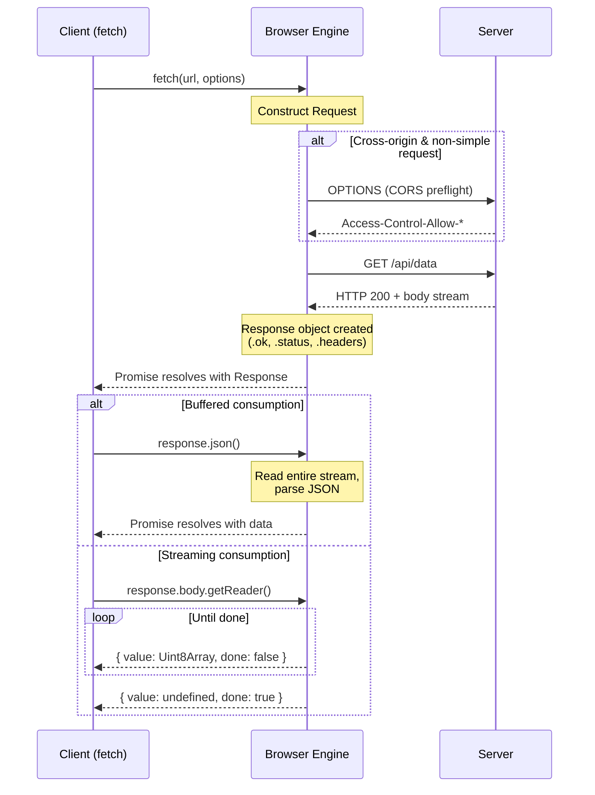

# [FEE-403] Fetch、串流與網路 API

:::info
瀏覽器提供了分層的網路堆疊：`fetch()` 用於請求/回應交換、Streams API 用於漸進式資料處理、`EventSource` 用於伺服器推送更新、`WebSocket` 用於全雙工通道，以及 `sendBeacon` 用於即發即忘的遙測。理解這些原語 (primitive) -- 以及它們與舊版 API 不同的錯誤語意 -- 是現代框架中所有資料擷取層的基礎。
:::

## 背景

瀏覽器中的網路通訊經歷了三個世代。首先是 `XMLHttpRequest`（XHR），一個基於回呼 (callback) 的 API，將設定、執行與回應處理混合在單一可變物件中。接著 Fetch API 登場，建立在 Promise 與不可變的 Request/Response 物件之上，與 Service Worker 及串流 (streaming) 天然契合。最近，Streams API 帶來了具備背壓 (backpressure) 感知的漸進式處理，實現了漸進式渲染和即時轉碼等以緩衝式回應不可能達成的用途。

如今，每個主要框架都包裝了一或多個這些原語。React Server Components 在伺服器端呼叫 `fetch()`；TanStack Query 和 SWR 圍繞 fetch 管理客戶端快取與重新驗證；Remix loader 和 SvelteKit `load` 函式將網路呼叫抽象在慣例之後。但當抽象洩漏時 -- CORS preflight 失敗、串流回應停滯、或已卸載的元件觸發狀態更新 -- 你需要理解底層的 API。

### Fetch API 介面

Fetch API 圍繞兩個物件運作：

| 物件 | 角色 |
|------|------|
| **Request** | 封裝 URL、method、headers、body、mode、credentials、redirect 策略與 abort signal |
| **Response** | 封裝 status、headers 與 body stream。建構後不可變。 |

兩者的 body 都是 **ReadableStream** -- 只能消費一次。呼叫 `response.json()` 會鎖定並耗盡串流；第二次呼叫會拋出例外。若需要讀取 body 兩次（例如在 Service Worker 中快取同時回傳給頁面），請在讀取前使用 `response.clone()`。

主要 fetch 選項：

| 選項 | 值 | 預設值 | 備註 |
|------|-----|--------|------|
| `method` | 任何 HTTP method | `GET` | `no-cors` 模式限制為 GET、HEAD、POST |
| `mode` | `cors`, `same-origin`, `no-cors` | `cors` | `no-cors` 產生不透明回應 (opaque response)，body/headers 不可存取 |
| `credentials` | `omit`, `same-origin`, `include` | `same-origin` | `include` 搭配跨域需要伺服器明確的 header |
| `redirect` | `follow`, `error`, `manual` | `follow` | `manual` 回傳 opaque-redirect 回應 |
| `signal` | `AbortSignal` | -- | 取消請求或設定逾時 |
| `keepalive` | boolean | `false` | 允許請求在頁面結束後存活（類似 `sendBeacon`） |

### Response 消費方法

| 方法 | 回傳值 | 使用情境 |
|------|--------|----------|
| `.json()` | `Promise<any>` | JSON API |
| `.text()` | `Promise<string>` | 純文字、HTML、CSV |
| `.blob()` | `Promise<Blob>` | 圖片、檔案下載 |
| `.arrayBuffer()` | `Promise<ArrayBuffer>` | 二進位協定、WASM 模組 |
| `.formData()` | `Promise<FormData>` | multipart 表單回應 |
| `.body` | `ReadableStream` | 串流：進度追蹤、漸進式解析 |

### 即時與單向 API

| API | 方向 | 協定 | 使用情境 |
|-----|------|------|----------|
| **EventSource**（SSE） | 伺服器到客戶端 | HTTP | 即時動態、通知、LLM token 串流 |
| **WebSocket** | 雙向 | WS/WSS | 聊天、多人遊戲、協作編輯 |
| **sendBeacon** | 客戶端到伺服器（即發即忘） | HTTP POST | 分析、頁面卸載時的遙測 |

## 使用情境

你正在開發一個逐字符輸出 AI 生成回應的聊天介面。標準的 `fetch` 呼叫會等待完整回應後才返回，造成令人不舒適的「整段文字突然出現」感。Streams API 將回應主體暴露為 `ReadableStream`，讓你能在資料塊到達時即時讀取並逐步更新 UI，呈現出使用者對現代聊天介面所期待的漸進渲染體驗。

## 設計思維

### 為何 fetch 取代了 XHR

XHR 是在 2006 年為一個沒有 Promise、Service Worker 或串流的世界所設計。其可變、有狀態的設計（open、設定 header、設定 body、send、監聽事件）將設定與執行耦合在一起。Fetch API 分離了這些關注點：

- **Request 與 Response 是不可變的值物件 (value object)。** 它們可以被建構、檢視、複製，並在不同上下文之間傳遞（頁面到 Service Worker 到快取）。
- **基於 Promise。** 可與 `async/await`、`Promise.all` 和 `Promise.race` 組合。
- **預設串流。** `response.body` 是 `ReadableStream`，能在完整回應到達前進行漸進式處理。
- **Service Worker 原生。** Service Worker 中的 `FetchEvent` 給你一個 `Request` 並期望一個 `Response` -- 與頁面使用的是相同物件。

### 框架資料擷取層

現代框架不會將原始 `fetch()` 暴露給應用程式碼。它們將其包裝在快取、去重與生命週期管理中：

**SWR / TanStack Query（stale-while-revalidate 策略）。** 立即回傳快取資料，然後在背景重新驗證。可透過 `staleTime`（資料被視為過期前的時間）和 `gcTime`（未使用的快取條目存活時間）設定。TanStack Query 額外提供 DevTools、樂觀更新 (optimistic mutation)、無限查詢 (infinite query) 與框架無關的轉接器。

**Nuxt `useFetch` / `useAsyncData`。** 同構 (isomorphic)：在 SSR 期間於伺服器端執行、跨元件去重、將結果序列化到客戶端 payload 使瀏覽器無需重新擷取。

**React Server Components。** `fetch()` 在伺服器端執行，具備自動請求去重與靜態快取。純伺服器端資料不會傳送客戶端 JS。結合客戶端的 TanStack Query 形成混合模式：RSC 負責初始載入，TanStack Query 處理互動式 mutation 與即時更新。

**Remix loader / SvelteKit `load`。** 路由層級的資料函式在渲染前執行。框架管理快取、重新驗證與錯誤邊界 (error boundary)，將 fetch 邏輯隔離在元件之外。

### 串流：超越緩衝式回應

Streams API 使資料在到達時即可處理，而非等待完整 payload：

- **ReadableStream** 包裝資料來源（網路、檔案、感測器）。透過 `getReader()` 讀取 chunk，或以 `for await...of` 消費。
- **WritableStream** 包裝資料目的地。透過 `getWriter()` 寫入 chunk。
- **TransformStream** 將可寫入端連接到可讀取端，在傳輸中轉換 chunk。內建轉換包含 `TextDecoderStream`、`TextEncoderStream`、`CompressionStream` 與 `DecompressionStream`。
- **Piping**（`pipeTo`、`pipeThrough`）以自動背壓 (backpressure) 串聯串流 -- 若消費者速度較慢，生產者會暫停。

React 的 `renderToPipeableStream` 使用此模型將 HTML 串流到客戶端，立即傳送外殼 (shell) 並在資料解析完成時填入 Suspense 邊界。

## 最佳實踐

**每次 fetch 後務必檢查 `response.ok` 再消費 body。** `fetch()` 只在網路層失敗時 reject；HTTP 4xx 與 5xx 回應仍會正常 resolve，但 `response.ok === false`。你 MUST 在每次 fetch 呼叫後測試 `response.ok`（或 `response.status`）並拋出有意義的錯誤，而非將錯誤頁面的 body 傳給 `.json()`——後者只會產生令人困惑的 `SyntaxError`。

**為所有可取消的請求使用 `AbortController`。** 你 SHOULD 為每個可能變得無關的 `fetch()` 呼叫傳入 `AbortSignal`——元件卸載、路由切換與被取代的搜尋都需要取消機制。使用 `AbortSignal.timeout(ms)` 進行宣告式逾時；需要程式化取消時使用手動的 `AbortController`。務必吞掉 `AbortError`，使已取消的請求不會成為未處理的錯誤。

**串流大型回應，而非緩衝整個 payload。** 對於大型 payload，你 SHOULD 以 `ReadableStream`（透過 `getReader()` 或 `pipeThrough()`）使用 `response.body`，而非呼叫 `.json()` 或 `.arrayBuffer()`。緩衝式消費會在主執行緒上同步解析整個 payload；串流式處理則逐塊漸進處理，讓 UI 保持響應且記憶體用量穩定。

**跨域請求時明確設定 `credentials` 與 `mode`。** 你 SHOULD 明確宣告 `mode`（`cors`、`same-origin` 或 `no-cors`）與 `credentials`（`omit`、`same-origin` 或 `include`），而非依賴預設值。AVOID 在伺服器回應 `Access-Control-Allow-Origin: *` 的情況下同時使用 `credentials: 'include'`——瀏覽器將封鎖該請求。明確的選項讓 CORS 行為可被審查，並防止因意外的 opaque response 造成的靜默失敗。

## 視覺化



**Fetch 生命週期：** 客戶端建構 Request。對於跨域的非簡單請求，瀏覽器先傳送 CORS preflight OPTIONS 請求。伺服器以串流形式回傳實際資料。客戶端可以緩衝消費（`.json()`、`.text()`）或透過 `ReadableStream` 漸進消費回應。

## 範例

### 1. 帶錯誤處理與中止的 Fetch

```js
async function fetchUser(userId, signal) {
  const response = await fetch(`/api/users/${userId}`, {
    headers: { 'Accept': 'application/json' },
    signal, // 用於取消的 AbortSignal
  });

  if (!response.ok) {
    // 區分客戶端錯誤與伺服器錯誤
    const body = await response.text().catch(() => '');
    throw new Error(
      `Failed to fetch user ${userId}: ${response.status} ${body}`
    );
  }

  return response.json();
}

// 在 React 元件中使用（含清理）
function useUser(userId) {
  const [user, setUser] = useState(null);

  useEffect(() => {
    const controller = new AbortController();

    fetchUser(userId, controller.signal)
      .then(setUser)
      .catch((err) => {
        if (err.name !== 'AbortError') {
          console.error(err);
        }
      });

    return () => controller.abort(); // 在卸載或 userId 變更時取消
  }, [userId]);

  return user;
}
```

### 2. 使用 ReadableStream 串流回應

```js
async function streamLargeJSON(url, onItem) {
  const response = await fetch(url);
  if (!response.ok) throw new Error(`HTTP ${response.status}`);

  const reader = response.body
    .pipeThrough(new TextDecoderStream())
    .getReader();

  let buffer = '';

  while (true) {
    const { value, done } = await reader.read();
    if (done) break;

    buffer += value;

    // 漸進式處理 newline-delimited JSON（NDJSON）
    let newlineIndex;
    while ((newlineIndex = buffer.indexOf('\n')) !== -1) {
      const line = buffer.slice(0, newlineIndex).trim();
      buffer = buffer.slice(newlineIndex + 1);

      if (line) {
        onItem(JSON.parse(line)); // 每筆記錄到達時即處理
      }
    }
  }
}

// 使用方式：處理 10 萬筆記錄而無需全部緩衝在記憶體中
await streamLargeJSON('/api/export/orders', (order) => {
  appendToTable(order);
});
```

### 3. 使用 Server-Sent Events 進行即時更新

```js
function subscribeToPrices(symbols, onUpdate) {
  const params = new URLSearchParams({ symbols: symbols.join(',') });
  const source = new EventSource(`/api/prices/stream?${params}`);

  source.addEventListener('price', (event) => {
    const data = JSON.parse(event.data);
    onUpdate(data); // { symbol: 'AAPL', price: 198.52, ts: 1712678400 }
  });

  source.addEventListener('error', () => {
    // EventSource 會自動重連；記錄以便觀測
    if (source.readyState === EventSource.CONNECTING) {
      console.warn('SSE reconnecting...');
    }
  });

  // 回傳清理函式
  return () => source.close();
}

// 使用方式
const unsubscribe = subscribeToPrices(['AAPL', 'GOOG'], (update) => {
  renderPrice(update.symbol, update.price);
});

// 元件卸載時
unsubscribe();
```

## 常見錯誤

### 1. 伺服器缺少 CORS header

缺少 `Access-Control-Allow-Origin` header 會使 fetch 以 `TypeError` reject。為了安全性，錯誤訊息故意含糊。常見的遺漏：

- 忘記處理 `OPTIONS` preflight 方法
- 搭配 `credentials: 'include'` 時設定 `Access-Control-Allow-Origin: *`（必須指定確切的 origin）
- 未透過 `Access-Control-Expose-Headers` 暴露自訂 header

### 2. 在 SSE 足夠時使用 WebSocket

WebSocket 需要持久的雙向連線、獨立的協定升級與自訂的重連邏輯。若資料僅從伺服器流向客戶端（儀表板、通知、LLM 串流），`EventSource` 更為簡單：它自動重連、追蹤 `lastEventId` 以便恢復，並在標準 HTTP 上運作。WebSocket 應保留給真正需要客戶端到伺服器訊息傳遞的場景（聊天、協作編輯、遊戲）。

### 3. 發出下一個請求前未消耗回應主體

`fetch()` 在主體讀取完成前便返回 `Response` 物件。若主體被忽略——例如在迴圈中呼叫 `fetch()` 而未等待 `response.json()` 或 `response.text()`——瀏覽器會保持連線開啟，直到主體逾時或被垃圾回收。應始終消耗或明確取消主體：以 `await response.arrayBuffer()` 讀取，或以 `response.body.cancel()` 釋放連線。這在 Service Worker 中尤其重要，未關閉的串流可能導致頁面載入失敗。

## 相關 FEE

| FEE | 關聯 |
|-----|------|
| [FEE-400 Browser APIs & Web Platform 總覽](./400.md) | 父分類。建立網路 API 運作所在的全域物件（`window`、`navigator`）與執行時期模型。 |
| [FEE-301 事件迴圈與非同步執行](../JavaScript%20Core%20and%20Runtime/301.md) | Fetch Promise、串流讀取與 SSE 回呼皆透過事件迴圈排程。理解 microtask 時序能解釋為何 `.then()` 鏈在下一次渲染前執行。 |
| [FEE-308 錯誤處理與除錯](../JavaScript%20Core%20and%20Runtime/308.md) | 網路錯誤需要結構化處理：區分 AbortError、TypeError 與 HTTP 狀態錯誤。框架的錯誤邊界 (error boundary) 捕獲因錯誤資料造成的渲染時期失敗。 |
| [FEE-405 Web Workers 與並行](./405.md) | Worker 有自己的 `fetch()` 且可在主執行緒外處理串流資料，避免大量傳輸時的 UI 卡頓。 |

## 參考資料

- [WHATWG Fetch Standard](https://fetch.spec.whatwg.org/) -- fetch()、Request、Response、Headers 與 CORS 的權威規格
- [WHATWG Streams Standard](https://streams.spec.whatwg.org/) -- ReadableStream、WritableStream、TransformStream 與 piping 的規格
- [MDN: Using the Fetch API](https://developer.mozilla.org/en-US/docs/Web/API/Fetch_API/Using_Fetch) -- 涵蓋所有 fetch 選項的完整指南與範例
- [MDN: ReadableStream](https://developer.mozilla.org/en-US/docs/Web/API/ReadableStream) -- 可讀串流的 API 參考，包含 BYOB reader
- [MDN: EventSource](https://developer.mozilla.org/en-US/docs/Web/API/EventSource) -- Server-Sent Events API 參考，含重連行為說明
- [MDN: WebSocket](https://developer.mozilla.org/en-US/docs/Web/API/WebSocket) -- 全雙工通訊 API 參考
- [MDN: Navigator.sendBeacon()](https://developer.mozilla.org/en-US/docs/Web/API/Navigator/sendBeacon) -- 用於分析與遙測的即發即忘 beacon API
- [web.dev: Streams -- The Definitive Guide](https://web.dev/articles/streams) -- ReadableStream、WritableStream 與 TransformStream 的實用指南，含視覺化說明
- [TanStack Query Documentation](https://tanstack.com/query/v5/docs/react/overview) -- 框架無關的資料擷取與 stale-while-revalidate 快取
