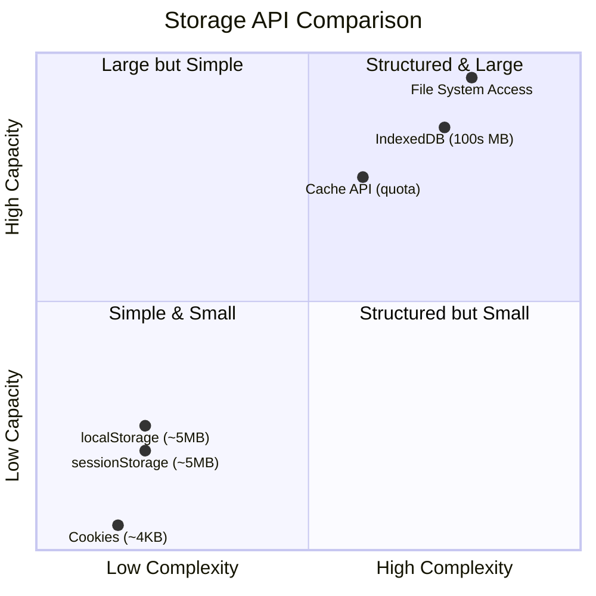

# [FEE-404] 儲存與狀態持久化

:::info
瀏覽器提供了多種儲存 API，各自針對不同的使用情境進行最佳化：Cookie 隨每個 HTTP 請求傳送、Web Storage 提供簡單的鍵值持久化、IndexedDB 處理結構化與大規模資料、Cache API 儲存 HTTP 請求/回應對以供離線使用，而 File System Access API 則提供直接的檔案讀寫存取。選擇正確的 API -- 並理解其安全邊界 -- 是建構可靠持久化狀態且不洩漏敏感資料的應用程式之關鍵。
:::

## 背景

客戶端儲存從單一機制（1994 年引入的 Cookie）演進至如今豐富的專用 API 生態系。每一代都解決了前一代的限制：

**Cookie** 設計用於伺服器往返狀態 -- Session 識別碼、CSRF token、同意旗標。它們會自動附加到每個與其 domain 和 path 匹配的 HTTP 請求中，這使得它們特別適合驗證用途，但不適合作為通用儲存。每個 Cookie 約 4 KB 的限制和同步的 `document.cookie` 字串 API 強化了這個狹隘的範疇。

**Web Storage**（`localStorage` 和 `sessionStorage`）隨 HTML5 而來，提供同步的鍵值字串儲存。`localStorage` 跨瀏覽器 session 持久化；`sessionStorage` 僅限於單一分頁，分頁關閉時即清除。每個 origin 約 5 MB 的限制和僅支援字串值，使其適合偏好設定和小型 UI 狀態，但不適合結構化資料或大型資料集。

**IndexedDB** 是一個交易式 (transactional)、非同步的物件儲存 (object store)，支援索引 (index)、游標 (cursor) 和結構化複製 (structured cloning)（直接儲存物件、陣列、Blob 和 ArrayBuffer）。它可處理數百 MB 的資料，是任何結構化或大規模客戶端儲存的建議 API。

**Cache API** 儲存 Request/Response 配對，主要用於 Service Worker 離線策略。與其他 API 不同，它基於 HTTP 語意運作 -- 你快取一個 fetch 回應，並透過匹配請求來檢索它。

**File System Access API**（前身為 Native File System）透過檔案和目錄選擇器對話方塊，提供對使用者裝置上檔案的直接讀寫存取。它是唯一能夠寫回使用者開啟的同一檔案的客戶端 API。

### 儲存配額

所有 origin 範圍的儲存（IndexedDB、Cache API，以及一定程度的 localStorage）共享一個配額池。`navigator.storage.estimate()` 方法回傳總配額和目前使用量：

```js
const { quota, usage } = await navigator.storage.estimate();
console.log(`Using ${(usage / 1024 / 1024).toFixed(1)} MB of ${(quota / 1024 / 1024).toFixed(0)} MB`);
```

在 Chromium 系列瀏覽器中，每個 origin 可使用總磁碟空間的約 60%。Firefox 允許每組 origin 使用可用磁碟空間的 50%。Safari 對每個 origin 施加 1 GB 的限制。超過配額時，IndexedDB 和 Cache API 會拋出 `QuotaExceededError`，localStorage 則拋出一般的 `DOMException`。

若要請求瀏覽器在儲存壓力下不清除你的資料，請呼叫 `navigator.storage.persist()`：

```js
const persisted = await navigator.storage.persist();
// true = 瀏覽器不會清除; false = 盡力而為 (可能被清除)
```

## 使用情境

使用者填到多步驟表單的第三步時，不小心關掉了瀏覽器分頁。回來之後，表單內容全空了。資料必須在關閉分頁後依然存在，但登出後就應該清除。`localStorage` 跨 session 持久；`sessionStorage` 在分頁關閉後消失；`IndexedDB` 則處理大小超過鍵值儲存上限的結構化資料。選用哪種儲存 API，取決於資料的生命週期、大小與結構，也取決於這份資料是否需要在多個分頁間共享存取。

## 設計思維

### 為何存在多種儲存 API

每個 API 針對不同的存取模式：

| API | 設計用途 | 傳送至伺服器？ | 非同步？ | 容量 |
|-----|---------|---------------|---------|------|
| Cookie | 伺服器往返狀態（驗證、CSRF） | 是，每個匹配的請求 | 否（`document.cookie` 是同步的） | 每個 Cookie 約 4 KB |
| localStorage | 簡單的持久化 KV（偏好設定） | 否 | 否（阻塞主執行緒） | 每個 origin 約 5 MB |
| sessionStorage | 分頁範圍的暫時 KV | 否 | 否（阻塞主執行緒） | 每個 origin 約 5 MB |
| IndexedDB | 結構化資料、大型資料集、離線 | 否 | 是（交易式） | 數百 MB 以上 |
| Cache API | HTTP 請求/回應快取（SW） | 否 | 是（Promise 式） | 共享 origin 配額 |
| File System Access | 使用者檔案讀寫 | 否 | 是（Promise 式） | 裝置磁碟 |

沒有單一 API 能涵蓋所有需求。Cookie 存在是因為伺服器需要在每個請求中取得狀態。localStorage 存在是因為 IndexedDB 對於佈景主題偏好來說過於複雜。Cache API 存在是因為 IndexedDB 無法原生儲存和匹配 HTTP Request/Response 配對。

### 框架持久化模式

現代框架在這些原始 API 之上提供抽象層：

**React + localStorage / useEffect。** 常見模式是在 `useEffect` 中將狀態持久化到 localStorage，並在初始化時讀取：

```js
function usePersistedState(key, defaultValue) {
  const [value, setValue] = useState(() => {
    const stored = localStorage.getItem(key);
    return stored !== null ? JSON.parse(stored) : defaultValue;
  });

  useEffect(() => {
    localStorage.setItem(key, JSON.stringify(value));
  }, [key, value]);

  return [value, setValue];
}
```

**Vue + pinia-plugin-persistedstate。** Pinia store 可以宣告式地持久化：

```js
defineStore('settings', {
  state: () => ({ theme: 'light', locale: 'en' }),
  persist: true, // 預設使用 localStorage，以 store ID 作為 key
});
```

**Zustand persist 中介軟體。** Zustand 支援可插拔的儲存後端：

```js
import { create } from 'zustand';
import { persist } from 'zustand/middleware';

const useStore = create(
  persist(
    (set) => ({ count: 0, inc: () => set((s) => ({ count: s.count + 1 })) }),
    { name: 'counter-storage' }, // localStorage key
  ),
);
```

**SvelteKit cookies。** 與 load 函式整合的伺服器端 cookie 管理：

```js
// +page.server.js
export function load({ cookies }) {
  const theme = cookies.get('theme') || 'light';
  return { theme };
}

export const actions = {
  setTheme({ cookies, request }) {
    const data = await request.formData();
    cookies.set('theme', data.get('theme'), { path: '/', httpOnly: true });
  },
};
```

**Remix cookie/session。** 內建的 session 儲存，由 cookie 或外部儲存支援：

```js
import { createCookieSessionStorage } from '@remix-run/node';

const { getSession, commitSession } = createCookieSessionStorage({
  cookie: { name: '__session', httpOnly: true, secure: true, sameSite: 'lax' },
});
```

### 安全考量

**localStorage 與 XSS。** 任何透過 XSS 注入的指令碼都可以呼叫 `localStorage.getItem()` 並竊取所有儲存的值。這不是理論風險 -- 它是在 SPA 中將 JWT 儲存於 localStorage 時最主要的 token 竊取向量。HttpOnly cookie 不受此影響，因為 JavaScript 無法存取它們。

**Cookie 與 CSRF。** 沒有 `SameSite` 屬性的 cookie 會隨跨域請求一起傳送，從而啟用 CSRF 攻擊。現代瀏覽器預設為 `SameSite=Lax`，但明確設定它對於縱深防禦至關重要：

| SameSite 值 | 行為 |
|-------------|------|
| `Strict` | Cookie 永不在跨站請求中傳送 |
| `Lax` | 在頂層導航（連結）時傳送，但不在子資源請求（圖片、frame、POST）時傳送 |
| `None` | 在所有跨站請求中傳送（需要 `Secure` 旗標） |

**Secure 旗標。** 帶有 `Secure` 的 cookie 僅透過 HTTPS 傳送，防止在不安全的網路上被攔截。

## 最佳實踐

**使用 `localStorage` 進行簡單的鍵值持久化；對結構化或二進位資料使用 IndexedDB。** `localStorage` 適合儲存小型字串值，例如使用者偏好設定、功能旗標和 UI 狀態（如側邊欄的收合狀態）。AVOID 將物件、陣列、Blob 或大型 JSON 存入 localStorage — 所需的 `JSON.stringify`/`JSON.parse` 往返是同步操作，會阻塞主執行緒。SHOULD 對任何結構化、關聯式或二進位資料使用 IndexedDB；它透過結構化複製 (structured cloning) 原生儲存物件，且完全非同步。

**務必處理 `QuotaExceededError`。** `localStorage` 和 IndexedDB 在 origin 的儲存配額耗盡時都會拋出例外。MUST 將儲存寫入包裹在 try/catch 中（localStorage）或檢查交易錯誤（IndexedDB）。靜默忽略配額錯誤會造成資料遺失和應用程式崩潰。優雅降級的方式 — 清除過時條目或通知使用者 — 永遠優於未處理的例外。

**NEVER 將敏感資料存入 `localStorage` 或 `sessionStorage`。** 在同一 origin 上執行的任何 JavaScript 都可以讀取所有 Web Storage 的值，包括透過 XSS 注入的惡意程式碼。驗證 token、API 金鑰和 session 密鑰 MUST 存放在 `HttpOnly` cookie 中，因為 JavaScript 完全無法存取這類 cookie。這不是理論上的風險：透過 XSS 從 localStorage 竊取 token 是 SPA 驗證中最主要的攻擊向量。

**使用 `sessionStorage` 處理分頁範圍的狀態。** 當某個狀態只在單一瀏覽 session 或分頁中具有意義時 — 例如多步驟表單草稿、暫時的精靈狀態、分頁專屬的 UI 上下文 — SHOULD 優先使用 `sessionStorage` 而非 `localStorage`。它在分頁關閉時會自動清除，無需明確的清理程式碼，也能防止過時狀態跨 session 洩漏。

## 視覺化



**圖表說明：** x 軸代表 API 複雜度（學習曲線、所需設定）。y 軸代表儲存容量。Cookie 和 Web Storage 聚集在低複雜度、低容量的角落。IndexedDB 和 Cache API 佔據高容量、較高複雜度的區域。File System Access 具有最高容量（裝置磁碟）和最高複雜度（權限提示、非同步 handle）。

## 範例

### 1. localStorage 搭配跨分頁 storage 事件

`storage` 事件會在 localStorage 變更時於其他分頁中觸發，實現簡單的跨分頁同步：

```js
// 分頁 A：更新佈景主題
function setTheme(theme) {
  document.documentElement.setAttribute('data-theme', theme);
  localStorage.setItem('theme', theme);
}

// 分頁 B：監聽來自其他分頁的變更
window.addEventListener('storage', (event) => {
  if (event.key === 'theme' && event.newValue) {
    document.documentElement.setAttribute('data-theme', event.newValue);
  }
});

// 從儲存的值初始化
const savedTheme = localStorage.getItem('theme') || 'light';
setTheme(savedTheme);
```

注意：`storage` 事件僅在同一 origin 的**其他**分頁/視窗中觸發 -- 它不會在進行變更的分頁中觸發。

### 2. IndexedDB CRUD 操作

```js
// 開啟（或建立）資料庫
function openDB(name, version, onUpgrade) {
  return new Promise((resolve, reject) => {
    const request = indexedDB.open(name, version);
    request.onupgradeneeded = (e) => onUpgrade(e.target.result);
    request.onsuccess = (e) => resolve(e.target.result);
    request.onerror = (e) => reject(e.target.error);
  });
}

// 使用 object store 和索引初始化資料庫
const db = await openDB('app-db', 1, (db) => {
  const store = db.createObjectStore('contacts', { keyPath: 'id', autoIncrement: true });
  store.createIndex('by_email', 'email', { unique: true });
});

// CREATE（新增）
function addContact(db, contact) {
  return new Promise((resolve, reject) => {
    const tx = db.transaction('contacts', 'readwrite');
    const store = tx.objectStore('contacts');
    const request = store.add(contact);
    request.onsuccess = () => resolve(request.result); // 回傳生成的 key
    request.onerror = () => reject(request.error);
  });
}

// READ（讀取）-- 透過索引
function getContactByEmail(db, email) {
  return new Promise((resolve, reject) => {
    const tx = db.transaction('contacts', 'readonly');
    const index = tx.objectStore('contacts').index('by_email');
    const request = index.get(email);
    request.onsuccess = () => resolve(request.result);
    request.onerror = () => reject(request.error);
  });
}

// UPDATE（更新）
function updateContact(db, contact) {
  return new Promise((resolve, reject) => {
    const tx = db.transaction('contacts', 'readwrite');
    const request = tx.objectStore('contacts').put(contact); // put = upsert
    request.onsuccess = () => resolve();
    request.onerror = () => reject(request.error);
  });
}

// DELETE（刪除）
function deleteContact(db, id) {
  return new Promise((resolve, reject) => {
    const tx = db.transaction('contacts', 'readwrite');
    const request = tx.objectStore('contacts').delete(id);
    request.onsuccess = () => resolve();
    request.onerror = () => reject(request.error);
  });
}

// 使用範例
const id = await addContact(db, { name: 'Alice', email: 'alice@example.com' });
const alice = await getContactByEmail(db, 'alice@example.com');
await updateContact(db, { ...alice, name: 'Alice Wu' });
await deleteContact(db, id);
```

### 3. Cache API 實現離線支援

```js
const CACHE_NAME = 'app-shell-v1';
const PRECACHE_URLS = ['/', '/index.html', '/styles.css', '/app.js', '/logo.svg'];

// Service Worker：安裝時預快取
self.addEventListener('install', (event) => {
  event.waitUntil(
    caches.open(CACHE_NAME).then((cache) => cache.addAll(PRECACHE_URLS))
  );
});

// Service Worker：從快取提供，回退到網路
self.addEventListener('fetch', (event) => {
  event.respondWith(
    caches.match(event.request).then((cached) => {
      if (cached) return cached;

      return fetch(event.request).then((response) => {
        // 複製，因為 response body 只能消費一次
        const clone = response.clone();
        caches.open(CACHE_NAME).then((cache) => cache.put(event.request, clone));
        return response;
      });
    })
  );
});

// Service Worker：啟動時清除舊快取
self.addEventListener('activate', (event) => {
  event.waitUntil(
    caches.keys().then((names) =>
      Promise.all(
        names
          .filter((name) => name !== CACHE_NAME)
          .map((name) => caches.delete(name))
      )
    )
  );
});
```

## 常見錯誤

### 1. 在高頻路徑中同步使用 localStorage

`localStorage.getItem()` 和 `localStorage.setItem()` 是同步的，會阻塞主執行緒。在渲染迴圈、捲動處理器或動畫幀中呼叫它們會造成卡頓 (jank)：

```js
// 不佳：每次捲動事件都阻塞渲染
window.addEventListener('scroll', () => {
  localStorage.setItem('scrollY', window.scrollY);
});

// 良好：防抖並非同步寫入
let timer;
window.addEventListener('scroll', () => {
  clearTimeout(timer);
  timer = setTimeout(() => {
    localStorage.setItem('scrollY', window.scrollY);
  }, 300);
});
```

### 2. Cookie 缺少 SameSite 屬性（CSRF 風險）

省略 `SameSite` 會允許 cookie 隨跨域請求傳送，從而啟用 CSRF 攻擊。請務必明確設定 `SameSite`：

```
Set-Cookie: session=abc123; SameSite=Lax; Secure; HttpOnly
```

## 相關 FEE

| FEE | 關聯性 |
|-----|--------|
| [FEE-400 瀏覽器 API 與 Web 平台概覽](./400.md) | 父類別。建立儲存 API 運作所在的全域物件與執行時期模型。 |
| [FEE-403 Fetch、串流與網路 API](./403.md) | Cache API 儲存來自 fetch 的 Request/Response 物件。理解 fetch 語意是有效快取策略的先決條件。 |
| [FEE-405 Web Workers 與並行處理](./405.md) | IndexedDB 可從 Web Worker 和 Service Worker 存取，實現主執行緒外的資料處理。 |
| [FEE-1200 安全性](../Security/1200.md) | XSS 和 CSRF 緩解直接影響儲存 API 的選擇。HttpOnly cookie、SameSite 和 Secure 旗標是安全性基礎。 |

## 參考資料

- [MDN: Web Storage API](https://developer.mozilla.org/en-US/docs/Web/API/Web_Storage_API) -- localStorage 和 sessionStorage 的 API 參考
- [MDN: IndexedDB API](https://developer.mozilla.org/en-US/docs/Web/API/IndexedDB_API) -- IndexedDB 概念、object store、索引和交易的全面指南
- [MDN: Using IndexedDB](https://developer.mozilla.org/en-US/docs/Web/API/IndexedDB_API/Using_IndexedDB) -- IndexedDB CRUD 操作的逐步教學
- [MDN: Cache API](https://developer.mozilla.org/en-US/docs/Web/API/Cache) -- 與 Service Worker 搭配使用的 Cache 介面 API 參考
- [MDN: Storage quotas and eviction criteria](https://developer.mozilla.org/en-US/docs/Web/API/Storage_API/Storage_quotas_and_eviction_criteria) -- 各瀏覽器的配額限制與清除策略
- [MDN: Window: storage event](https://developer.mozilla.org/en-US/docs/Web/API/Window/storage_event) -- 透過 storage 事件進行跨分頁同步
- [WHATWG Storage Standard](https://storage.spec.whatwg.org/) -- navigator.storage、配額與持久化的規範性規格
- [WHATWG HTML: Web Storage](https://html.spec.whatwg.org/multipage/webstorage.html) -- localStorage 和 sessionStorage 的規格
- [web.dev: Storage for the Web](https://web.dev/articles/storage-for-the-web) -- 比較儲存 API 與配額資訊的實用指南
- [web.dev: IndexedDB Best Practices](https://web.dev/indexeddb-best-practices/) -- 使用 IndexedDB 持久化應用程式狀態的模式
